### 00 C++ 开发环境配置优化

Date：2023/04/11 15:24:57

------


[TOC]


------


### 01 环境准备

​		对比云服务器的配置版本，这里使用**本地虚拟机** + **electerm** 部署 Linux 环境。

> * 虚拟机平台：VMware Workstation Pro 17
> * 虚拟机系统：ubuntu server 20.04.6
> * Ssh 连接：electerm，用以本地连接 ubuntu 虚拟机


------


### 02 虚拟机安装

#### 01 VMware Workstation Pro

*  https://www.vmware.com/cn/products/workstation-pro.html
* 跟着流程安装即可
  * 注意自定义安装路径
  * 可勾选 “增强型键盘”，后面也可以重新点击安装包更改配置

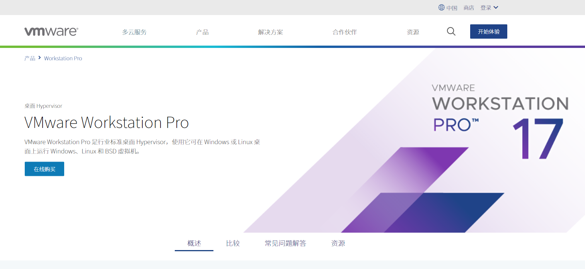


------


#### 02 ubuntu server

* 官网[下载](http://releases.ubuntu.com/20.04.6/ )较慢

* 阿里云镜像-OS镜像-选择版本-[点此进入](https://developer.aliyun.com/mirror/?spm=a2c6h.265751.1364563.38.728e2621iHKW48)
* [ubuntu-20.04.6-live-server-amd64.iso 下载地址](https://mirrors.aliyun.com/ubuntu-releases/focal/ubuntu-20.04.6-live-server-amd64.iso)

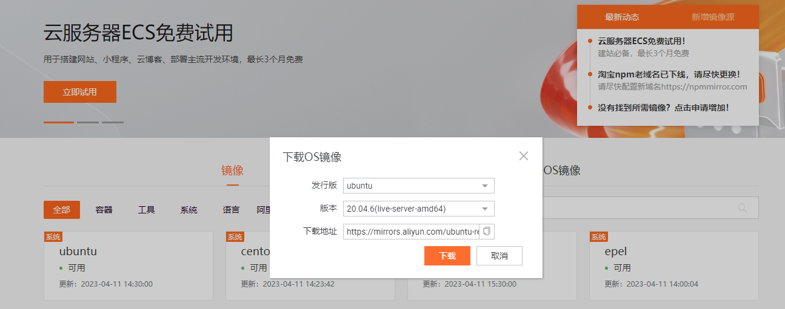

* 在 VMware 创建 ubuntu 虚拟机
  * 打开虚拟机后，会有若干配置界面
    * 大部分采用默认选项即可
    * 注意勾选 openssh，也可后面手动安装 `sudo apt-get install openssh-server` 
    * 注意记录自己设置的用户名和密码
  * 若虚拟机启动较慢，可更改 net 的配置文件，添加 `TimeoutSec=2sec` 
* 安装完毕后，设置虚拟机网络为 “桥接模式”

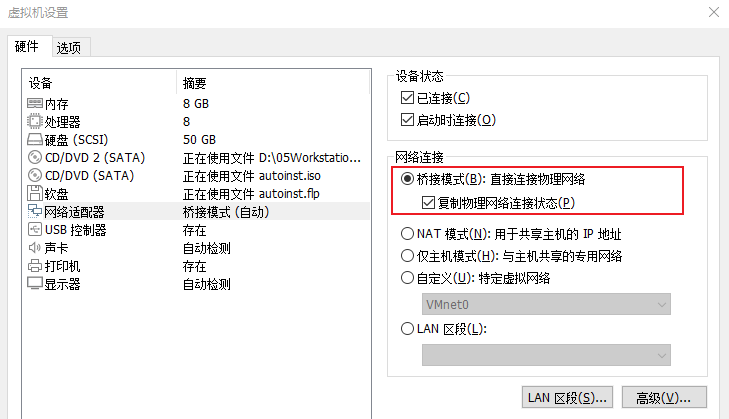


------


#### 03 electerm

* https://electerm.html5beta.com/

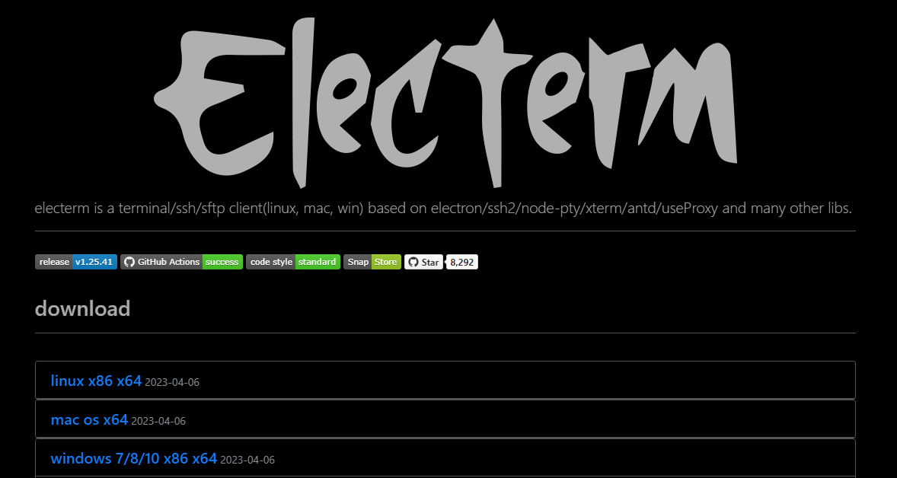


------


#### 04 连接虚拟机

* 获取虚拟机 IP 地址

```bash
ip address show
```

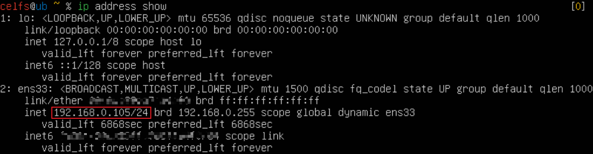

* 配置 electerm 的 Ssh
  * 填入安装 ubuntu 时自己设置的用户名、密码
  * 填入上面获得的 IP 地址（注意，桥接虚拟机网络，IP 可能会根据路由器的自动配置发生变化，重新利用上一步获取即可）


* 连接成功
  * electerm 的界面更加友好，文件传输更加方便，且可以省很多 Vmware 的设置
  * 最重要的是：复制粘贴的便携性，后面配置系统内部的 shell 环境会很方便

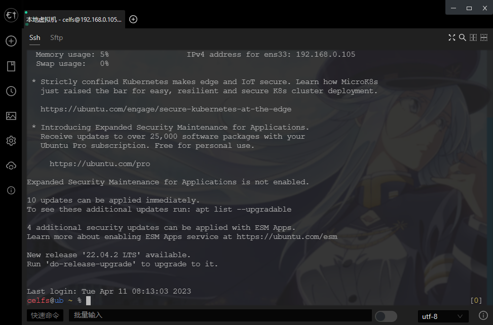

* 配置鼠标选词复制与粘贴，默认快捷键 `ctrl+shift+c/v` 


* 在 Vmware 打开的 ubuntu 虚拟机，挂在后台运行即可，经过一段时间的使用，主机资源占用率并不高（用的联想小新 Pro-13，2019-i7-MX250 款）

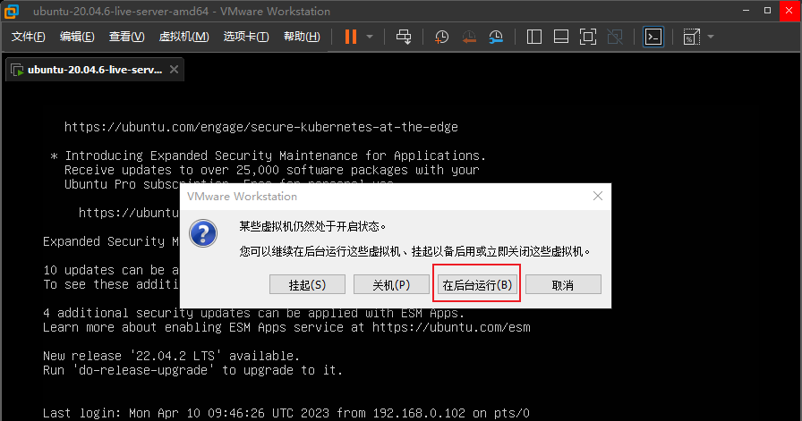


------


### 03 安装系统后的环境准备

​		这部分基于云服务器的配置版本，稍作整理，更新了失效的图片。


#### 01 普通用户

> * 前面安装系统时已添加普通用户，这一步**可跳过**，没有删掉是因为内容重要。
>
> * 在Linux使用过程中，应尽量避免使用root用户直接使用系统，使用下面的步骤创建一个新用户

1. 添加新用户

   ```bash
   adduser new_user
   ```

2. 将用户添加到`sudo`组中

   ```bash
   usermod -G sudo new_user
   ```


3. 使用`su`命令切换到新用户

   ```bash
   su - new_user
   ```


#### 02 配置 sshd

​		考虑到本次 Ssh 是连接本地虚拟机，所以这一步**不是必要的**。

1. 使用命令 `sudo vim /etc/ssh/sshd_config` 打开sshd的配置文件，找到 `ClientAliveInterval` 和 `ClientAliveCountMax` 并将其修改为（如果没有直接添加即可）：

   

2. 重启sshd服务

   ```bash
   sudo service sshd restart
   ```

> 如果上述命令报错，大致内容为 sshd 这个服务不存在的话，就执行`sudo service ssh restart`


------

**以下所有配置，都是为了优化终端，提升使用效率，如果你已经能独立对bash，zsh，vim等进行配置优化，可自行选择方案，无需完全按照这个方案**

------------------------------


#### 03 GitHub 访问优化

1. 请进入这个网址：[点击这里](https://fastly.net.ipaddress.com/github.global.ssl.fastly.net#ipinfo)

2. 找到图中的 `IP1`

   

3. 在上面的网站上搜索 `github.com` ,找到 `IP2`

   

4. 使用命令 `sudo vim /etc/hosts` 打开hosts文件，并在最后加入以下信息

   ```bash
   199.232.69.194 github.global.ssl.fastly.net
   140.82.112.4 github.com
   ```

5. 保存并退出


#### 05 配置 Vim

* [Vim配置推荐 - ma6174](https://github.com/ma6174/vim)（不用打开这个官方网站）

1. 更新 `apt` 源信息

   ```bash
   sudo apt update
   ```

2. 安装 `git`

   ```bash
   sudo apt install git
   ```

3. 配置vim，执行下面命令配置安装vim

   ```bash
   wget 47.93.11.51:88/install_vim.sh
   bash install_vim.sh
   ```

> vim的配置因为需要安装较多插件，所以需要等较多时间


#### 06 zsh 的安装及配置

1. 安装 `zsh` 

```bash
sudo apt install zsh
```

2. 修改默认 `shell` 为 `zsh` 

```bash
chsh -s /bin/zsh
```

3. 安装 `oh-my-zsh` 

```bash
wget 47.93.11.51:88/install_zsh.sh
bash install_zsh.sh
```

4. 安装 `zsh-syntax-highlighting` 

```bash
git clone https://gitee.com/suyelu/zsh-syntax-highlighting.git ${ZSH_CUSTOM:-~/.oh-my-zsh/custom}/plugins/zsh-syntax-highlighting
```

5. 使用命令 `vim ~/.zshrc` 打开 `.zshrc` 文件，找到 `plugins=()` 这一行，将 `zsh-syntax-highlighting` 添加进去

```bash
plugins=(git zsh-syntax-highlighting)
```

6. 安装其他插件

```bash
##命令自动补全插件
mkdir ~/.oh-my-zsh/plugins/incr
wget http://mimosa-pudica.net/src/incr-0.2.zsh -O ~/.oh-my-zsh/plugins/incr/incr.plugin.zsh
##目录自动跳转插件
sudo apt install autojump
```

7. 使用命令 `vim ~/.zshrc`，打开后在最后插入以下内容：

```bash
#设置终端颜色，提示符，及上一条指令返回码提示
autoload -U colors && colors
PROMPT="%{$fg[red]%}%n%{$reset_color%}@%{$fg[blue]%}%m %{$fg[yellow]%}%1~ %{$reset_color%}%# "
RPROMPT="[%{$fg[yellow]%}%?%{$reset_color%}]"
# Useful support for interacting with Terminal.app or other terminal programs
[ -r "/etc/zshrc_$TERM_PROGRAM" ] && . "/etc/zshrc_$TERM_PROGRAM"
source /usr/share/autojump/autojump.sh
source ~/.oh-my-zsh/plugins/incr/incr*.zsh
```

> 注意，复制后可能会因为Vim的配置导致以上内容被注释，也就是在前面加上了`#`,如果有的话，删掉就行。


#### 07 ctags 安装与配置

1. 使用以下命令安装 `ctags`，用以打开源代码

```bash
sudo apt install ctags     
```

2. 执行以下命令

```bash
ctags -I __THROW -I __attribute_pure__ -I __nonnull -I __attribute__ --file-scope=yes --langmap=c:+.h --languages=c,c++ --links=yes --c-kinds=+p --c++-kinds=+p --fields=+iaS --extra=+q  -f ~/.vim/systags /usr/include/* /usr/include/x86_64-linux-gnu/sys/* /usr/include/x86_64-linux-gnu/bits/*  /usr/include/arpa/*
```

3. 使用命令 `vim ~/.vimrc` 编辑 `.vimrc`，在最后添加以下内容

```bash
set tags+=~/.vim/systags
```


#### 08 安装 glibc-doc

1. 使用以下命令安装

```bash
sudo apt install glibc-doc
```


------


### 04 结果验证

#### 01 zsh 验证

* 配置完毕，重启虚拟机 `sudo reboot`。

* 终端输入命令 `pwd`，如果显示如下图，则没问题


#### 02 vim 验证

​		使用命令 `vim a.c` ，如果直接打开，并显示如下图，则没问题

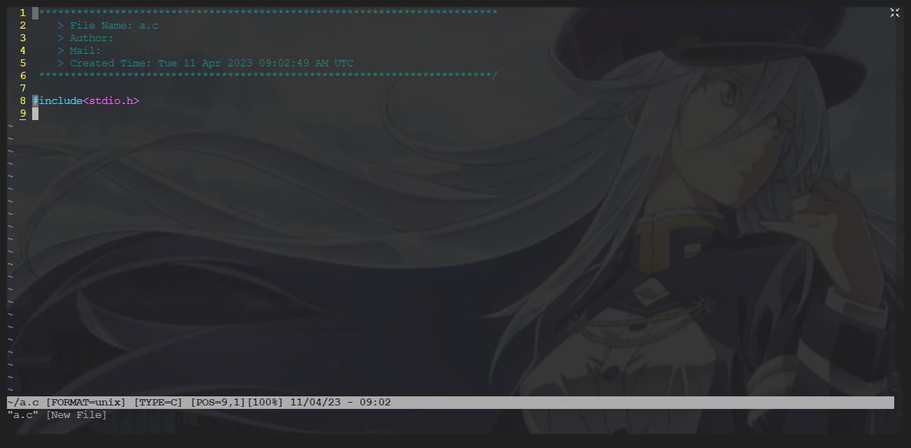


#### 03 ctags 验证

* 写一个 `HelloWorld` 的程序，在 `vim` 普通模式下，移动光标到 `printf` 

* 键入 `ctrl + ]`，显示如下图

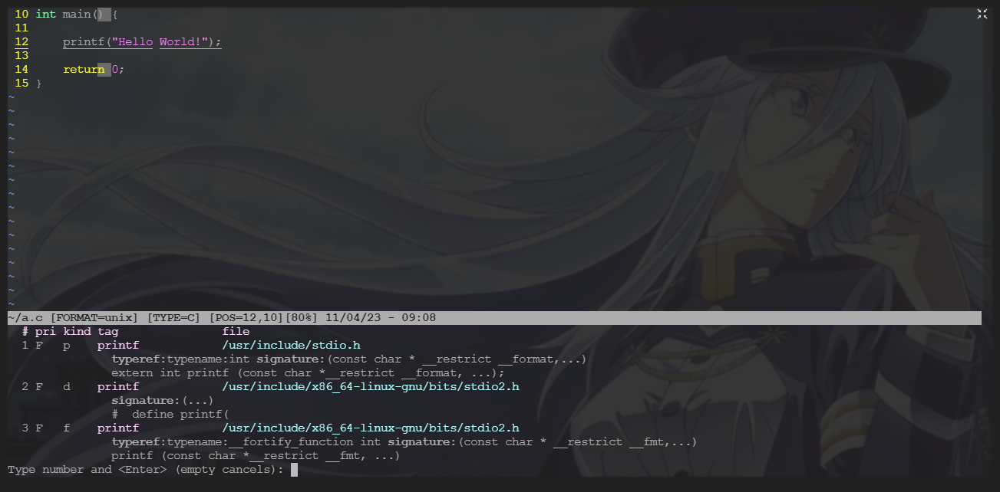

* 键入 `1`，进入 `stdio.h`

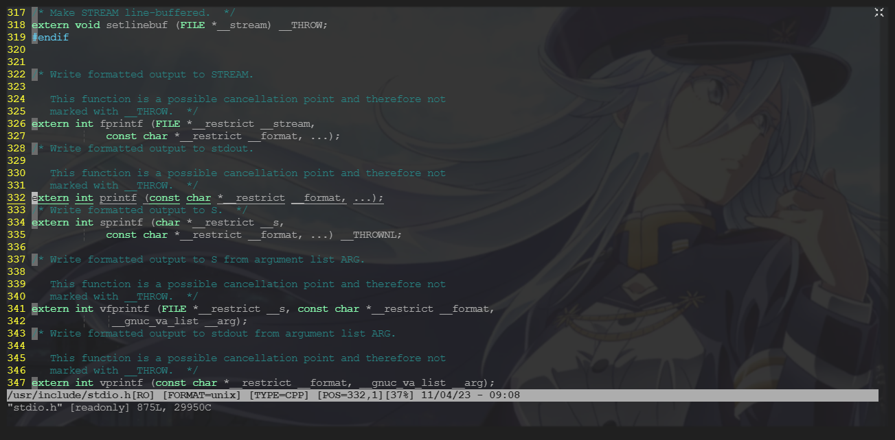

* 键入 `ctrl + o ` 返回原程序

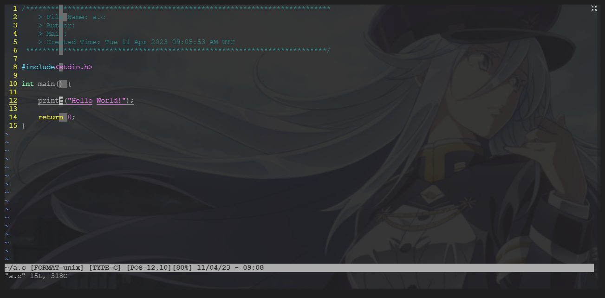

* 如果可以完成上述操作，没有报错，就说明没问题


------

* 2023/04/11 17:12:58 1h50min