### 01 Linux环境下，部分软件安装

### 文档说明

* 记录Linux环境下的部分软件安装操作步骤；
* 记录已安装软件的主要功能、命令行、简要使用方式；
* 本次记录四个软件，个人理解都是用来监控系统的。

------

最后修改信息：2021年6月13日16:17:49  By CELFS


### Ubuntu安装相关命令

```bash
sudo     提权
apt      理解为安装工具集合命令（相关资料推荐使用apt）
apt-get  理解为apt命令集的拆分

//查询
--help
dpkg -l  列出当前系统中所有的包
dpkg -s  查询已安装的包的详细信息
dpkg -L  查询系统中已安装的软件包所安装的位置
```

* 命令详解资源查找
  * ubuntu安装和查看已安装 - foward.molly.宝儿 - 博客园  https://www.cnblogs.com/forward/archive/2012/01/10/2318483.html
  * apt 和 apt-get的区别_憨憨松的博客-CSDN博客  https://blog.csdn.net/liudsl/article/details/79200134

------


### 1 nethogs

#### 1.1 主要功能

* 检测系统占用带宽情况【任务卡】
* 可以通过nethogs查看Linux下进程的流量

#### 1.2 软件详细信息

* 软件描述及翻译
  * Net top tool grouping bandwidth per process NetHogs is a small 'net top' tool. Instead of breaking the traffic down per protocol or per subnet, like most tools do, it groups bandwidth by process. NetHogs does not rely on a special kernel module to be loaded.
  * NetHogs是一个小型的“nettop”工具。它不像大多数工具那样按协议或子网划分流量，而是按进程对带宽进行分组。NetHogs不依赖于要加载的特殊内核模块。

```bash
dpkg -s nethogs
```

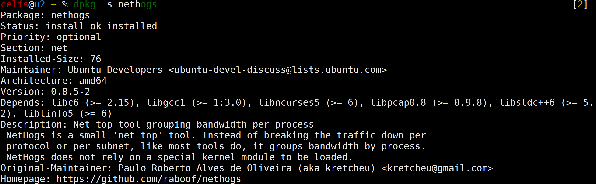

#### 1.3 本次安装方法

```bash
sudo apt-get install nethogs
```

#### 1.4 运行界面

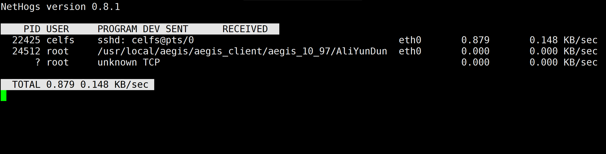

#### 1.5 命令行 --help

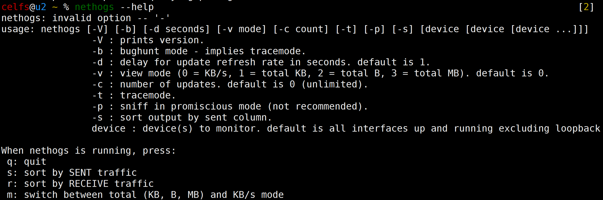

#### 1.6 命令详解资源

```bash
实例1：设置5秒钟刷新一次，通过-d来指定刷新频率
# nethogs -d 5

实例2：监视eth0网络带宽
# nethogs eth0

实例3：同时监视eth0和eth1接口
# nethogs eth0 eth1

m : 修改单位
r : 按流量排序
s : 按发送流量排序
q : 退出命令提示符
```

* nethogs命令详解_mark's technic world-CSDN博客_nethogs操作说明  https://blog.csdn.net/hxpjava1/article/details/88241410

------


### 2 htop

#### 2.1 主要功能

* 交互式的进程浏览器【任务卡】
* 人性化的互动进程查看器

#### 2.2 软件详细信息

* 软件描述及翻译
  * interactive processes viewer Htop is an ncursed-based process viewer similar to top, but it allows one to scroll the list vertically and horizontally to see all processes and their full command lines. . Tasks related to processes (killing, renicing) can be done without entering their PIDs.
  * **交互式进程查看器**Htop是一个基于ncursed的进程查看器，类似于top，但它允许用户垂直和水平滚动列表以查看所有进程及其完整的命令行。与进程相关的任务（终止、重新冻结）可以在不输入PIDs的情况下完成。

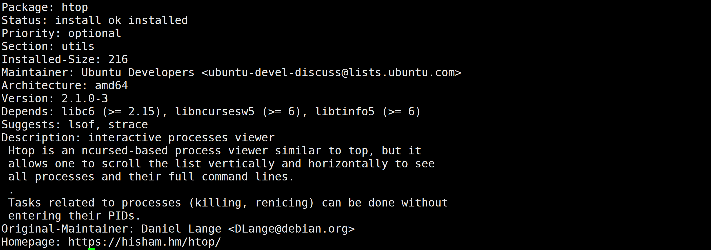

#### 2.3 本次安装方法

```bash
sudo apt-get install htop
```

#### 2.4 运行界面

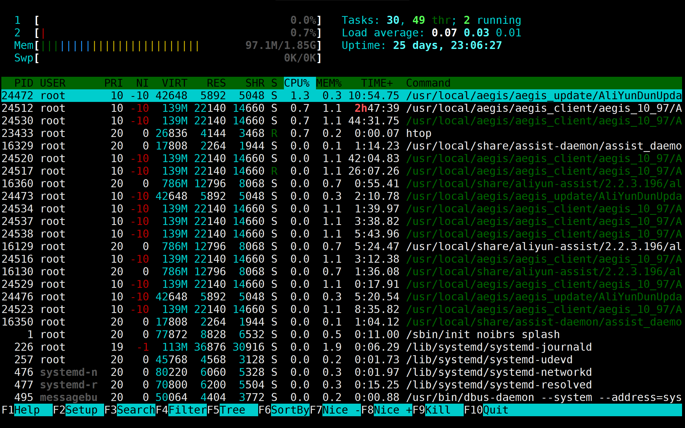

#### 2.5 命令行 --help

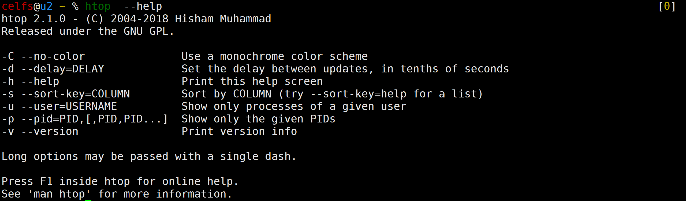

#### 2.6 命令详解资源

* htop命令使用详解 - zangfans - 博客园  https://www.cnblogs.com/zangfans/p/8595000.html

------


### 3 nmon

#### 3.1 主要功能

* 显示所有重要的性能优化信息【任务卡】
* 服务端监控工具

#### 3.2 软件详细信息

* 软件描述及翻译
  * performance monitoring tool for Linux nmon is a systems administrator, tuner, benchmark tool. It can display the CPU, memory, network, disks (mini graphs or numbers), file systems, NFS, top processes, resources (Linux version & processors) and on Power micro-partition information. Data is displayed on the screen and updated once every two seconds, using a dumb screen. However, you can easily change this interval to a longer or shorter time period. The nmon tool can also capture the same data to a text file for later analysis and graphing for reports. The output is in a spreadsheet format (.csv).
  * Linux nmon**性能监视工具**是一个系统管理员、调谐器、基准测试工具。它可以显示CPU、内存、网络、磁盘（迷你图或数字）、文件系统、NFS、顶级进程、资源（Linux版本和处理器）和on-Power微分区信息。数据显示在屏幕上，并使用哑屏每两秒钟更新一次。但是，您可以轻松地将此间隔更改为更长或更短的时间段。nmon工具还可以将相同的数据捕获到文本文件中，**以便以后进行分析和绘制报表**。输出为电子表格格式（.csv）。

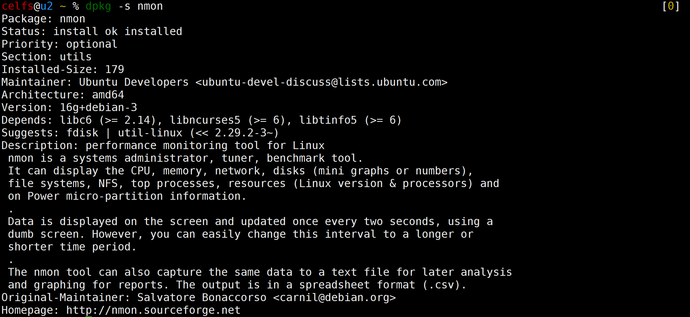

#### 3.3 安装方法

```bash
sudo apt install nmon
```

#### 3.4 运行界面

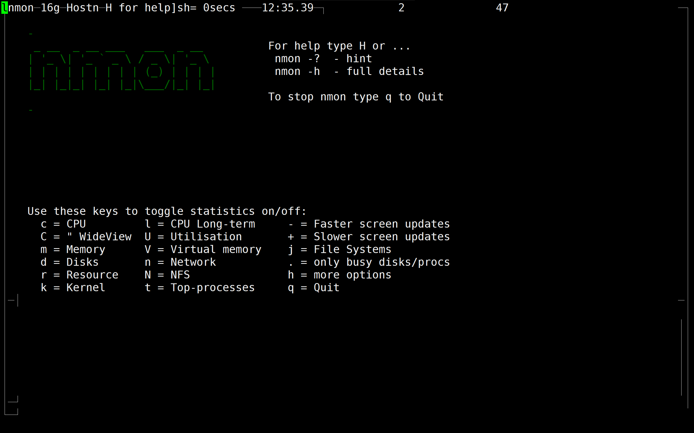

#### 3.5 命令行 --help

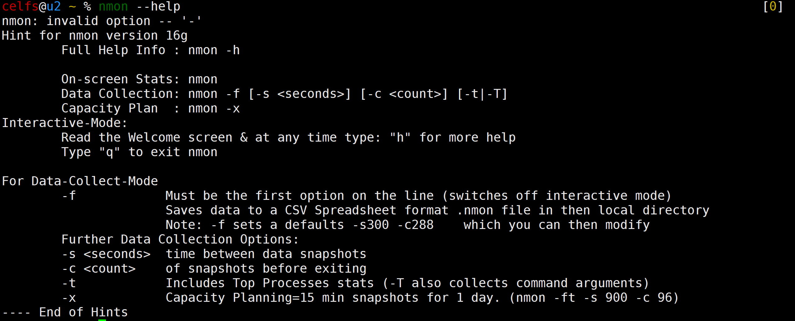

#### 3.6 命令详解资源

* 服务端监控工具：Nmon使用方法 - 老_张 - 博客园  https://www.cnblogs.com/imyalost/p/9689213.html
* nmon分析与详解 - scarlett1798 - 博客园  https://www.cnblogs.com/scarlett-hy/p/9760062.html

------


### 4 dstat

#### 4.1 主要功能

* 全能信息统计工具【任务卡】
* 实时监控 CPU、磁盘、网络、IO、内存等使用情况

#### 4.2 软件详细信息

* 软件描述及翻译
  * versatile resource statistics tool Dstat is a versatile replacement for vmstat, iostat and ifstat. Dstat overcomes some of the limitations of these programs and adds some extra features. Dstat allows you to view all of your network resources instantly, you can for example, compare disk usage in combination with interrupts from your IDE controller, or compare the network bandwidth numbers directly with the disk throughput (in the same interval). Dstat also cleverly gives you the most detailed information in columns and clearly indicates in what magnitude and unit the output is displayed. Dstat is also unique in letting you aggregate block device throughput for a certain diskset or network bandwidth for a group of interfaces, i.e. you can see the throughput for all the block devices that make up a single filesystem or storage system. Dstat's output, in its current form, is not suited for post-processing by other tools, it's mostly meant for humans to interpret real-time data as easy as possible.
  * **通用资源统计工具**Dstat是vmstat、iostat和ifstat的通用替代品。Dstat克服了这些程序的一些限制，并添加了一些额外的特性。Dstat允许您**立即查看所有网络资源**，例如，您可以将磁盘使用情况与IDE控制器的中断进行比较，或者直接将网络带宽数字与磁盘吞吐量（在相同的时间间隔内）进行比较。Dstat还巧妙地在列中提供最详细的信息，并清楚地指示输出的大小和单位。Dstat的另一个独特之处是，它允许您为一组接口的特定磁盘集或网络带宽聚合块设备吞吐量，即您可以看到构成单个文件系统或存储系统的所有块设备的吞吐量。Dstat目前的输出形式不适合其他工具的后处理，它主要是为了让人类尽可能容易地解释实时数据。

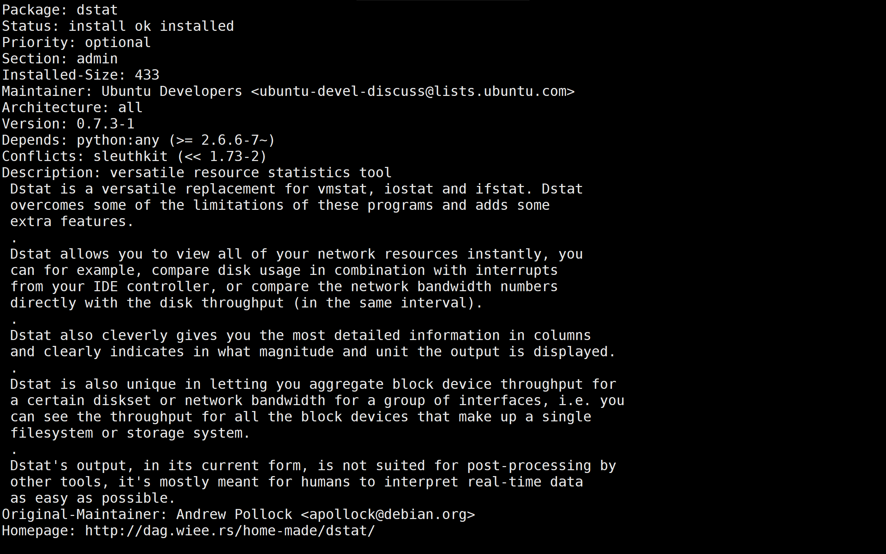

#### 4.3 安装方法

```bash
sudo apt-get install dstat
```

#### 4.4 运行界面

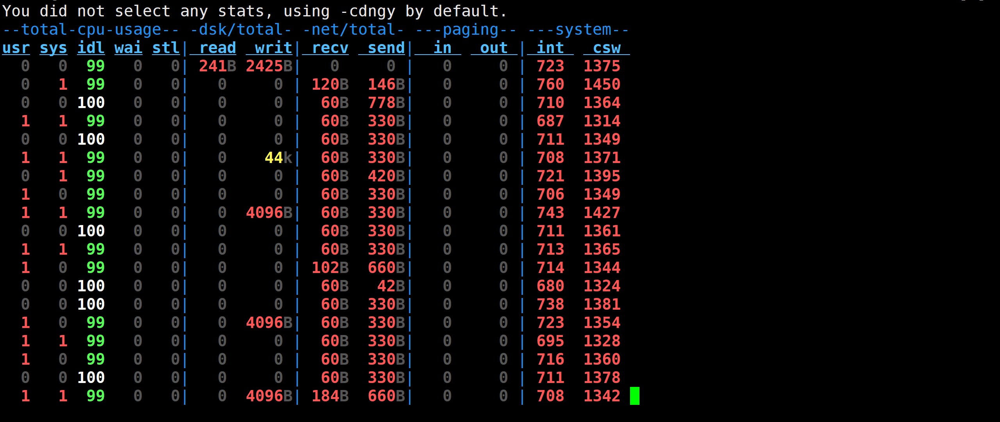

#### 4.5 命令行 --help

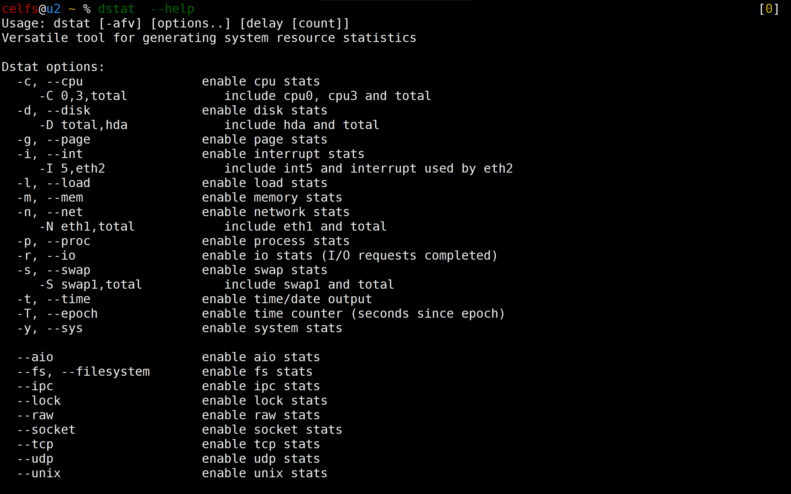

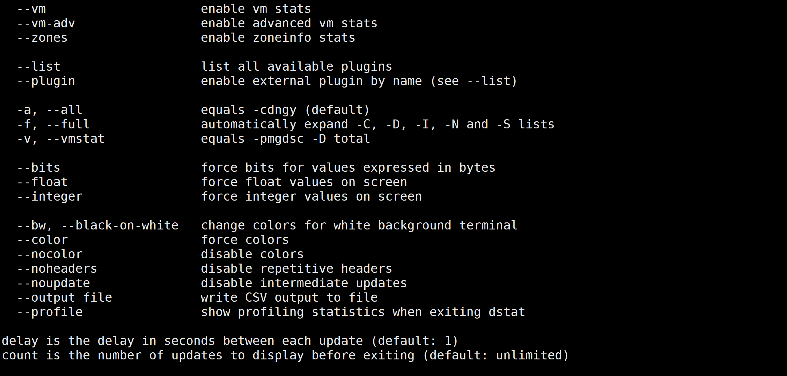

#### 4.6 命令详解资源

* Linux 终端下全能系统监控工具dstat命令详解与使用教程-网络教程与技术 -亦是美网络  http://www.yishimei.cn/network/850.html
* Linux如何安装使用dstat监控工具 - 系统之家  http://www.xitongzhijia.net/xtjc/20150202/36696_all.html


