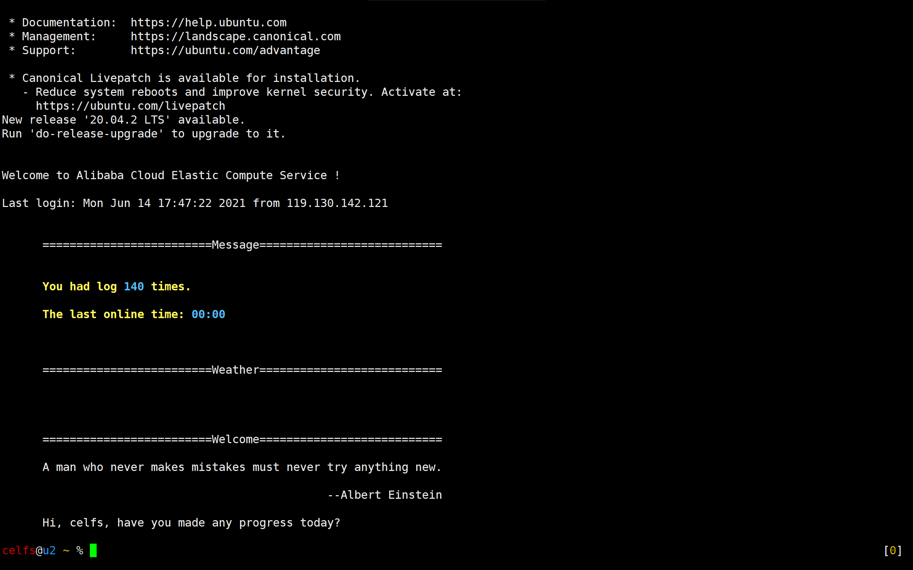
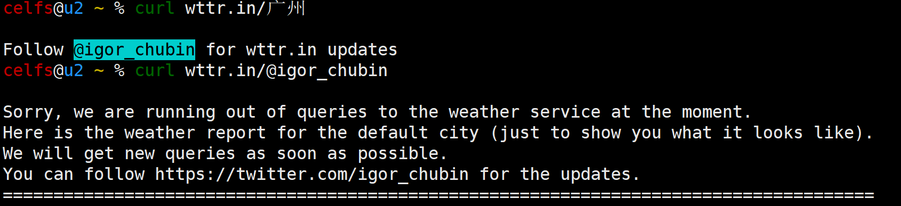

### 02 shell环境的熟悉与使用

### 功能需求 & 需求分析

* 在每次通过远程连接**进⼊系统时**，告知⽤户相关信息；
* 要求显示美观，有⼀定的**颜⾊**。

|      | 功能需求                                       | 需求分析                |
| :--- | ---------------------------------------------- | ----------------------- |
| 1    | 最近⼀段时间，当前⽤户，也就是你，登录了多少次 | last统计用户名称词频    |
| 2    | 上⼀次登录系统，停留了多少时间                 | last                    |
| 3    | 给⽤户推荐⼀句名⼈名⾔，唐诗三百⾸之类的       | 添加到默认shell配置文件 |
| 4    | 最好还能告知⼀下当地当⽇天⽓预报               | 需查资料                |
| 5    | ⼀个温馨的问候                                 | 添加到默认shell配置文件 |
| 6    | 信息颜色                                       | 需查资料                |

------

最后修改信息：2021年6月14日17:55:22  By CELFS


### 代码实现

* 运行截图

#### 1 显示当前用户最近登录次数

```bash
Name=`whoami`
login_cnt=`last | cut -d ' ' -f 1 | grep -w ${Name} | wc -l`
echo "033[1;33mYou had log \033[1;34m${login_cnt}\033[0m times.\n"
```

#### 2 上次登录停留时间

```bash
landingtime=`last | grep -w ${Name} | head -2 | tail -1 | cut -d '(' -f2 | cut -d ')' -f1`
echo "033[1;33mThe last online time : \033[1;34m${landingtime}\033[0m\n"
```

#### 3 当地当日天气

```bash
curl wttr.in/广州\?0
```

* 上午调用还能用，下午天气软件维护了无法显示



#### 4 推荐名人名言

```bash
echo "A man who never makes mistakes must never try anything new.\n"
echo "                      	                --Albert Einstein\n"
```

#### 5 问候语

```bash
echo "Hi , ${Name} , have you made any progress today ?\n"
```

### 参考

* Linux操作系统学习笔记2—欢迎登陆界面_实练_Lioba的博客-CSDN博客  https://blog.csdn.net/qq_39660009/article/details/112591744
* 个性化设置Linux用户登录信息_Rowinner的博客-CSDN博客  https://blog.csdn.net/Rowinner/article/details/110824404
* \033[0;30m 之超级终端的字体背景和颜色显示等_夜风的博客-CSDN博客  https://blog.csdn.net/u014470361/article/details/81512330