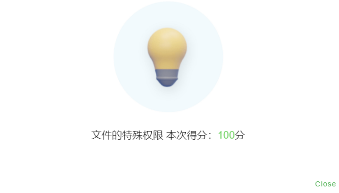

### 03 文件的特殊权限

最后修改信息： 2021年6月16日23:57:17  By CELFS


### 切换用户

```bash
//【1】切换到当前用户下的root用户
su
sudo -i

users
celfs root

who am i
celfs     pts/0        ...

//【2】系统root思考
//暂未找到切换系统root用户的命令，但可通过Xshell密钥进入
who am i
root     pts/1        ...

//【3】系统root用户模式下切换普通用户，同样具有root身份
su celfs
celfs@u2 /root %【此处为%，但所在路径有root字眼】

who am i
root     pts/1        ...

//【4】$/% 普通用户， # root用户
```

### 创建Project目录

```bash
whereis opt
sudo mkdir Project
```

### 创建用户组

```bash
sudo groupadd TestGroup
```

### 创建测试用户

```bash
sudo useradd -G TestGroup TestUser1 -s /bin/bash -m
sudo useradd -G TestGroup TestUser2 -s /bin/bash -m
```

### 功能实现

* 原始权限

```bash
drwxr-xr-x 2 root root ... Project
```

* 移除其他用户所有权限

```bash
//方法一【tldr chmod】
sudo chmod o= Project/

//方法二
chmod 770 Project/

drwxr-x--- 2 root root ... Project
```

* 目录下所有用户只能删除自己创建的文件，root除外

```bash
sudo chmod a+t Project/
drwxr-x--T 2 root root ... Project
```

* 修改目录所属组

```bash
sudo chgrp TestGroup Project 
drwxr-x--T 2 root TestGroup ... Project
```

* 修改目录所属组权限
  * 可写【w】、SUID权限【s】

```bash
sudo chmod g+ws Project/
drwxrws--T 2 root TestGroup ... Project
```

### 自动测试

