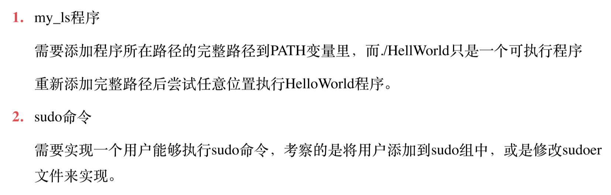
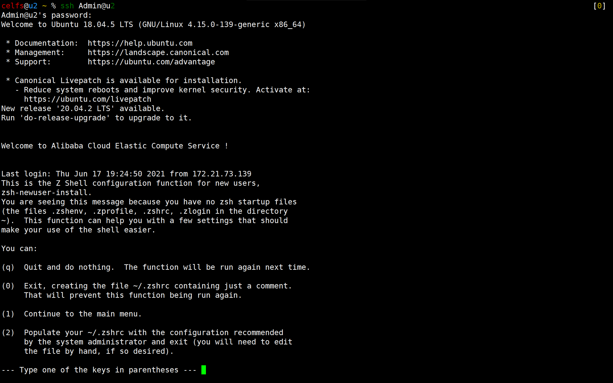
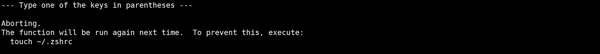
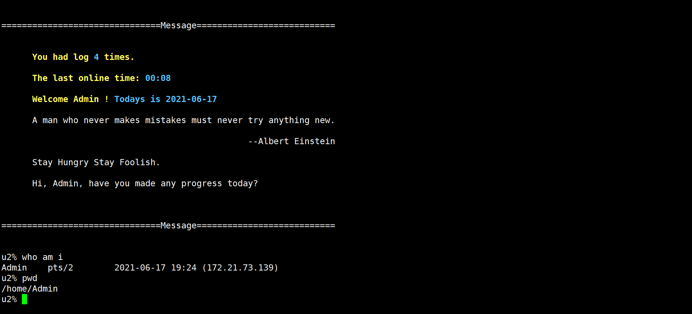
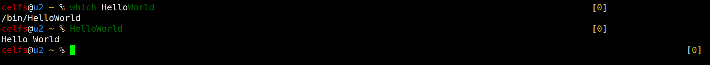
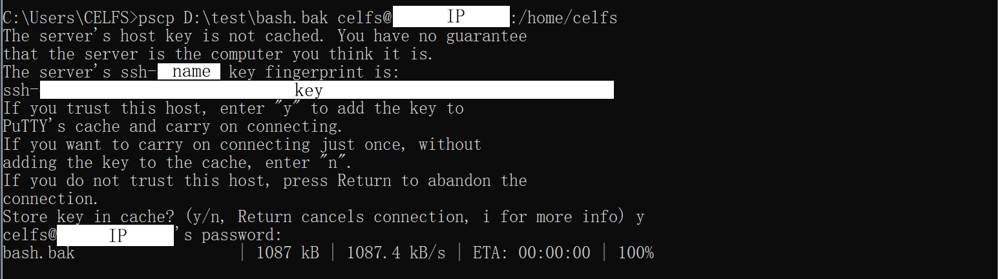
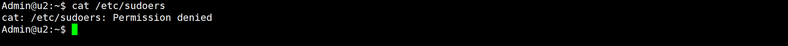
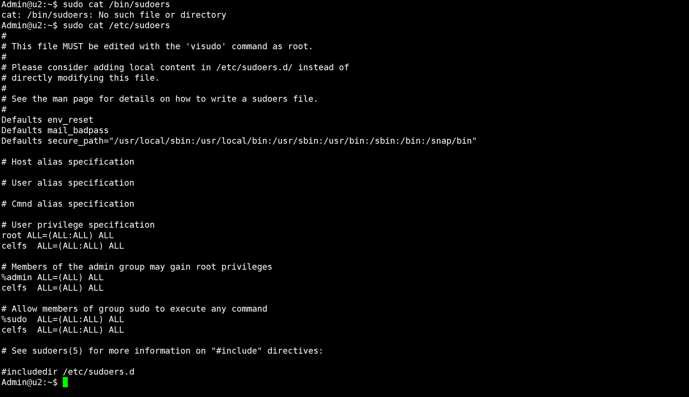

### 04 用户管理测验

第一次修改信息：2021年6月17日20:13:51  By CELFS

* 反馈意见：



第二次修改信息：2021年6月18日22:03:58  By CELFS

* bash误操作

第三次修改信息：2021年6月21日16:23:29  By CEFLS

* 修复bash并完成作业

------


[TOC]

------


### 1 功能需求

* 新建一个用户Admin；

- 密码100天后过期，提前7天提醒，过期10天后不修改密码将关闭账号 ；
- 定义一个SHELL，可以选择bash，也可以选择zsh，有HOME；
- 登录打印自定义欢迎信息：Welcome Admin（此处取变量）！Today is yyyy-mm-dd，并且打印最近一次登录的详细信息和近期登录总次数；
- 可直接执行my_ls，my_ls是你自己写的ls程序，如果不会写，你可以写一个简单的HelloWorld代替。可以直接执行的意思是，在任何地方直接执行my_ls可以运行；
- 可执行sudo命令。

### 2 新建用户Admin

```bash
sudo useradd -G sudo Admin -s /bin/bash -m

Admin@u2:~$ pwd
>>>/home/Admin
```

### 3 密码操作

* **查看Admin用户密码信息【passwd】**

```bash
sudo passwd -S Admin
>>>Admin L 06/17/2021 0 99999 7 -1
```

* **查看Admin用户密码信息【chage】**

```bash
sudo chage -l Admin

Last password change								: Jun 17, 2021
Password expires									: Sep 25, 2021
Password inactive									: Oct 05, 2021
Account expires										: never
Minimum number of days between password change		: 0
Maximum number of days between password change		: 100
Number of days of warning before password expires	: 7
```

* **密码100天后需修改 & 密码过期宽限日期**

```bash
sudo passwd -x 100 -i 10 Admin
>>>Admin L 06/17/2021 0 100 7 10
```

### 4 修改登录欢迎信息

* **motd文件【message of the day】**
* **相关资料显示，motd文件内容是静态内容，似乎涉及shell脚本语法【此路难通】**
  * **因此更改默认shell为zsh**

```bash
//更改默认shell
chsh -s /bin/zsh Admin
//连接Admin用户
ssh Admin@u2

who am i
>>>Admin    pts/2        2021-06-17 19:04 (...)
```

* **添加当前登录时间到zlogin**

```bash
/etc/zsh/zlogin
Name=`whoami`
echo "\033[1;33mWelcome ${Name} ! \033[1;34mTodays is `date +'%Y-%m-%d'`\033[0m\n"
```

* **运行如下【提示未找到zsh文件，但检查/etc/shells是有zsh路径的，回车正常进入用户，但除了登入信息以外，界面shell似乎没有生效】**







------


### 5 my_ls程序【修改，环境变量设置】

- 相关资料显示结合个人能力范围，暂不实现，因此尝试实现HelloWorld；
- 可在任意路径执行，应与PATH有关；【已解决，即环境变量】
- 不是很理解需要的执行文件是何种格式文件，目前接触过的是a.out，按照颜色应该是绿色的都算是可执行文件；【已解决】【绿色的即为可执行文件，只是后缀可有可无，a.out是特殊的，属于汇编语言传承下来的表述，assembler output-汇编程序输出】

#### **5.1 尝试一：【失败】**

```bash
vim HelloWorld

//参考文末update-motd内文件的操作
#!/bin/bash
echo "Hello World\n"

//参考文末update-motd内文件的操作，以下命令可将文件改为可执行文件
sudo chmod 775 HelloWorld
//得到绿色文件
```


```bash
//添加到PATH【虽然后面可以添加进路径，但方法错了，并不需要再次复制已有的环境变量路径】
export
PATH=:/usr/local/sbin:/usr/local/bin:/usr/sbin:/usr/bin:/sbin:/bin:/usr/games:/usr/local/games:/snap/bin:/HelloWorld:$PATH

echo $PATH
:/usr/local/sbin:/usr/local/bin:/usr/sbin:/usr/bin:/sbin:/bin:/usr/games:/usr/local/games:/snap/bin:/HelloWorld::/usr/local/sbin:/usr/local/bin:/usr/sbin:/usr/bin:/sbin:/bin:/usr/games:/usr/local/games:/snap/bin:./HelloWorld
```

#### **5.2 尝试二：【成功】**

* 路径内已有HelloWorld文件，但同样无法执行，可能是HelloWorld文件的语法或生成逻辑不对，知识有点超纲，暂不解决此问题。【已解决】

* export添加路径需写入程序完整路径，而且该设置仅在当前登录期间生效，为此，有两种简要的方式可将HelloWorld程序全局执行长期生效

  * 方法一：

    * 将HelloWorld文件复制至已有的全局环境变量路径中

    ```bash
    cp HelloWorld /bin/
    ```

    运行截图：

    

  * 方法二：

    * 将HelloWorld路径写入~/.bashrc或/etc/

  * 方法三：【思路】

    * 使用alias命令，添加HelloWorld绝对路径；即通过命令别称的方式，调用绝对路径，直接执行文件。
    * alias命令可执行

* 【修改】获取HelloWorld完整路径

```bash
//readlink
readlink -f HelloWorld
>>>/home/celfs/HelloWorld

//pwd
```

------


### 6 小插曲——bash文件误操作

#### **6.1 错误产生——cp命令覆盖文件**

* 在长期使用windows环境下ctrl c/v命令的习惯上，本意是使用cp命令将HelloWorld文件复制到系统已有的环境变量路径当中，但对“/”斜杠表示的文件夹以及没有斜杠表示的单个文件产生了误解，以至于cp命令使用后，将被复制文件进行了重命名，从而变相覆盖了/bin/bash文件

```bash
//本意
cp HelloWorld /bin/bash/
cp HelloWorld /bin

//实际操作
cp HelloWorld /bin/bash
```

#### **6.2 修复bash文件**

* 网络查询到的解决办法，大部分要求重装系统，但觉得重装系统是大刀阔斧的行为，而且万不得已情况下才可考虑，在意识到主要问题为bash覆盖后，考虑找到相同环境的bash代码，复制替换；
  * **前提条件是Linux环境下其他用户有其他的shell**，例如zsh，否则可能连系统都登录不进去；
  * 比如本人普通用户使用zsh，但**root默认使用bash，在这种情况下， root账户就无法登录了**，但可考虑将root的默认shell也改外zsh，凑合着用，只是学习早晚绕不开bash，治标不治本。
* 寻求帮助：找到其他电脑相同系统环境下bash文件，重新传入bash文件即可修复；
* vim代码复制操作不太友好，而且相关资料显示vim有复制行数上限，因此考虑实现Windows、Linux互联文件传输，本次使用pscp命令；
* **操作均在Windows的cmd窗口执行**。

```bash
//命令格式【Windows传入Linux】
pscp [可选参数] D:\test\bash.bak celfs@ip:/home/celfs
即
pscp[空1][可选参数][空2]Windows待上传文件路径[空3]Linux用户名@[主机IP][冒号]Linux待接收文件路径

//【Linux传入Windows】【注意：是在cmd操作，不是在linux】
格式不变，将[空3]前后两种路径调转即可
```

* 运行截图：



#### **6.3 cmd的dos模式命令优化**

* 执行上述pscp命令后，将进入提示输入用户密码。
* 如果输入提示**连接超时**，**大概率是因为IP地址错了**，IP地址不要相信网上说的ifconfig，即使是root用户下，ifconfig或者last得到的也不是真正的IP【这个问题的出现，不知道是不是云主机平台的保护机制，因为网上教程有些情况下得到的IP可以实现传输操作】【**其实pscp安装以及命令执行都很便捷，主要的时间花销就在IP地址的确认里面，IP错了，系统抛出新的问题，接着就逐渐导向了错误的解决方向**】
* 真正的IP【应该叫主机IP】，要打开Xshell——会话管理窗口——右键属性——连接——主机


```bash
//由于要输入密码，或者有时候是对大量文件进行备份操作
//echo把指令串起来
echo [登录密码] | pscp [可选参数] D:\test\bash.bak celfs@ip:/home/celfs

//指令保存为txt文件，改后缀为bat，相当于把命令封装了，可直接执行上述操作，自动打开cmd窗口，运行完毕自动关闭cmd窗口//印象中还可以执行完毕把窗口停留，具体命令在需要的时候再查了

//对大量文件备份——参数[-r]，文件递归
echo [登录密码] | pscp -r D:\test\bash.bak celfs@ip:/home/celfs
```

#### **6.4 其他可尝试文件传输方式**

* Windows下使用Xshell连接云主机，可用xftp传输文件。

#### 6.5 重要文件做好备份

```bash
//备份系统文件，提示权限不够——将用户改为root即可
```

------


### 7 可执行sudo命令

```bash
To run a command as administrator (user "root"), use "sudo <command>".
See "man sudo_root" for details.

Admin@u2:~$ sudo passwd -S Admin
[sudo] password for Admin: 
>>>Admin P 06/17/2021 0 100 7 10
```

* **id名称，Admin在sudo组内**


* **sudo权限测试——将sudoers文件内容读取**





------


### 8 参考

* [Linux] usermod: Your account has expired； please contact your system administrator_Wherein-CSDN博客  https://blog.csdn.net/where_in/article/details/115667475
* **Linux运维学习笔记之八：用户管理_放飞的心灵－记录学习的点点滴滴-CSDN博客  https://blog.csdn.net/rumengjian/article/details/78572996**
* **ubuntu/linux修改登录欢迎信息 自定义登录欢迎信息_littlehaes的博客-CSDN博客  https://blog.csdn.net/littlehaes/article/details/103700579**
* linux创建用户，添加及修改shell_wqh0830的博客-CSDN博客_shell 创建用户  https://blog.csdn.net/wqh0830/article/details/87793576
* linux登陆欢迎提示信息的设置 - 方面盘 - 博客园  https://www.cnblogs.com/qzqdy/p/8422283.html
* 怎样设置Linux用户登录后的欢迎信息？_百度知道  https://zhidao.baidu.com/question/366278148695806492.html
* Linux motd详解_weixin_33727510的博客-CSDN博客  https://blog.csdn.net/weixin_33727510/article/details/85080976
* linux motd详解 - liangwode - 博客园  https://www.cnblogs.com/liangwode/articles/6433311.html
* Linux设置登录欢迎信息设置总结_peter-zou的博客-CSDN博客_linux 登录欢迎信息  https://blog.csdn.net/qq_23587541/article/details/85040997
* **Linux date命令的用法（转） - asxe - 博客园  https://www.cnblogs.com/asxe/p/9317811.html**
* linux下实现my_ls_binxxi的博客-CSDN博客  https://blog.csdn.net/binxxi/article/details/114847979
* Linux C编程my_ls 的实现_☞ ♚ ☜的博客-CSDN博客  https://blog.csdn.net/weixin_53012351/article/details/114603161?utm_medium=distribute.pc_relevant_t0.none-task-blog-2%7Edefault%7EBlogCommendFromMachineLearnPai2%7Edefault-1.control&depth_1-utm_source=distribute.pc_relevant_t0.none-task-blog-2%7Edefault%7EBlogCommendFromMachineLearnPai2%7Edefault-1.control
* 求救大神，Linux编程，写一个my_ls程序，用来查看目录列表，要求如下，谢谢！-服务器-CSDN问答  https://ask.csdn.net/questions/388939
* 如何让你的脚本可以在任意地方都可执行？ - 良许Linux - 博客园  https://www.cnblogs.com/yychuyu/p/12918957.html
* linux可执行文件添加到PATH环境变量的方法 - joshua317 - 博客园  https://www.cnblogs.com/joshua317/p/6899057.html
* Linux下查看和添加PATH环境变量_qingkongyeyue的博客-CSDN博客_linux path  https://blog.csdn.net/qingkongyeyue/article/details/52733203?utm_medium=distribute.pc_relevant.none-task-blog-2%7Edefault%7EBlogCommendFromMachineLearnPai2%7Edefault-1.control&depth_1-utm_source=distribute.pc_relevant.none-task-blog-2%7Edefault%7EBlogCommendFromMachineLearnPai2%7Edefault-1.control
* linux可执行文件格式_hjjdebug的专栏-CSDN博客_linux 可执行文件  https://blog.csdn.net/hejinjing_tom_com/article/details/72718595
* **linux中间文件与可执行文件的区别_helloworld-CSDN博客  https://blog.csdn.net/chopinyychopinyy/article/details/93665660**
* 《Linux就该这么学》刘遄
  * P66 3.5重要的环境变量
  * P68 export sth.可将一般变量提升为全局变量【HelloWorld作为可执行文件，是否相当于引用对象的变量？】
* 《鸟哥Linux私房菜：基础版》
* Linux alias命令 | 菜鸟教程  https://www.runoob.com/linux/linux-comm-alias.html
* **如何让shell脚本变成可执行文件 - linux-123 - 博客园  https://www.cnblogs.com/cainiaoyige1/p/13876660.html**
* 【263】Linux 添加环境变量 & 全局 shell 脚本_weixin_33830216的博客-CSDN博客  https://blog.csdn.net/weixin_33830216/article/details/86397882?utm_medium=distribute.pc_relevant.none-task-blog-2%7Edefault%7EBlogCommendFromMachineLearnPai2%7Edefault-2.control&depth_1-utm_source=distribute.pc_relevant.none-task-blog-2%7Edefault%7EBlogCommendFromMachineLearnPai2%7Edefault-2.control
* 使用pscp实现Windows 和 Linux服务器间远程拷贝文件_黑坑的专栏-CSDN博客  https://blog.csdn.net/alzhuzhu/article/details/53393186?utm_medium=distribute.pc_relevant.none-task-blog-baidujs_title-0&spm=1001.2101.3001.4242
* Windows和Linux与远程服务器之间进行文件交互_Winter_FDd的博客-CSDN博客  https://blog.csdn.net/WIinter_FDd/article/details/71077832?utm_medium=distribute.pc_relevant.none-task-blog-baidujs_title-0&spm=1001.2101.3001.4242