### 05 进程管理 随堂笔记及简答题思考

创建信息：2021年6月22日14:09:07  By CELFS

* 随堂笔记整理

修改信息：2021年6月22日15:53:47  By CELFS

* 笔记整理完成

修改信息：2021年6月22日16:32:08  By CEFLS

* 简答题思路添加

------


[TOC]

------


### 一、主要命令


------


### 1 free

* 功能：检查内存使用情况，较多参数控制显示单位。
* 勘误：
  * [-s] N：--seconds
    * ​	delay	每隔N秒执行一次
  * [-t] ：--total
    * ​	Display a line showing the column totals.
* 其他常用参数
  * [-h]：--human
  * [-b|k|m|g]
* 运行截图

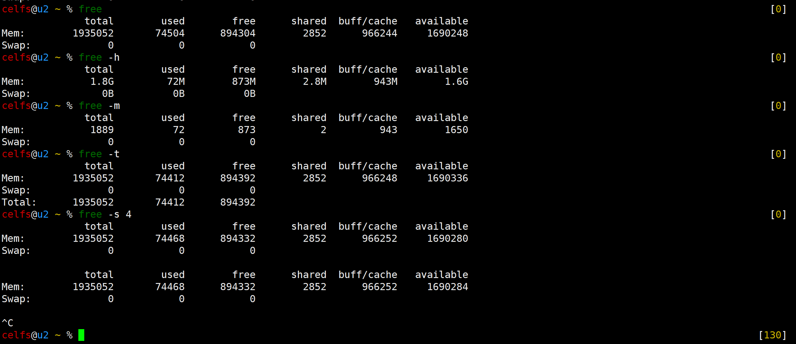

------


### 2 top

* 功能：了解系统正常运行有哪些常见进程，显示最活跃的进程，通常了解top界面有的信息即可。
* Swap：交换分区。相关资料显示，该分区类似Windows的虚拟内存，一般设置为内存的两倍。
* **疑问：**
  * **top界面的信息刷新形式，区别于[free -s N]向下增加行的刷新形式，是如何实现的？有没有专有名词？如何定格了画面，用新的信息把画面替换？**

* 运行截图

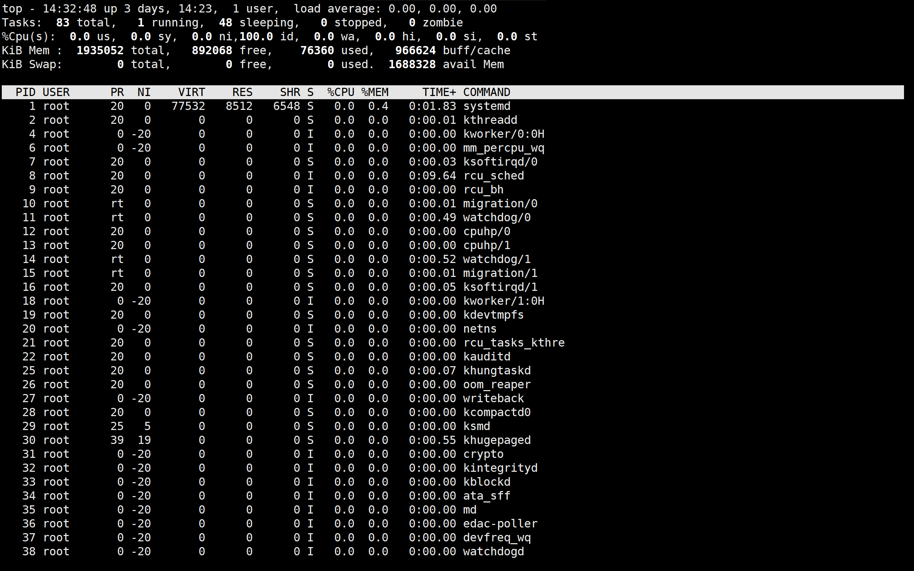

------

### 3 dstat

* 功能：实时监控磁盘、CPU、网络等的读写流量，辅助判断系统正在做什么、是否忙碌。
* 常用命令：
  * [num1 num2]]：
    * 控制显示时间，更新次数
    * **刷新次数达到num2将退出dstat**
  * [--list]：
    * 列出内外插件名称
  * [--output]：
    * 输出为CSV文件
* 运行截图

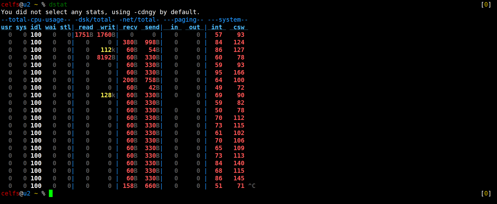

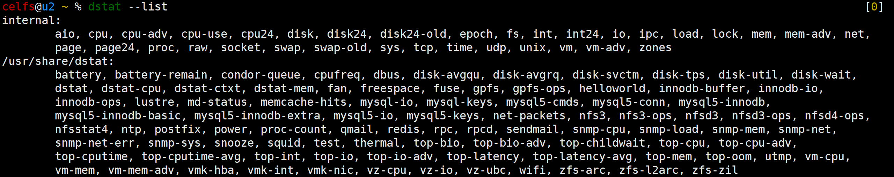

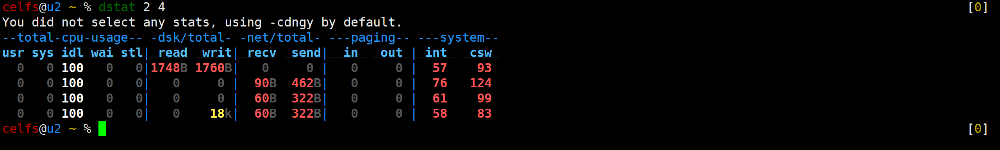

------


### 4 ps【常用】

* 功能：类似Windows的任务管理器。
* 掌握命令：
  * [-aux]
    * BSD格式显示进程【BSD风格】
    * List all running processes
    * SIMPLE PROCESS SELECTION
      * [-a]   Select all processes except both session leaders (see getsid(2)) and processes not associated with a terminal.
    * OUTPUT FORMAT CONTROL
      * [u]    Display user-oriented format.
      * [x] Register format.
  * [-ef]
    * 标准格式显示进程
    * OUTPUT MODIFIERS
      * [e]    Show the environment after the command.
      * [f]     ASCII art process hierarchy (forest).
  * 历史：两参数分别来源于Unix和Linux，展示格式不同。man手册中涉及[-aux]命令有UNIX的相关描述，且讲述了[ps -aux]和[ps aux]是存在区别的。暂未找到详细的历史
* 运行截图

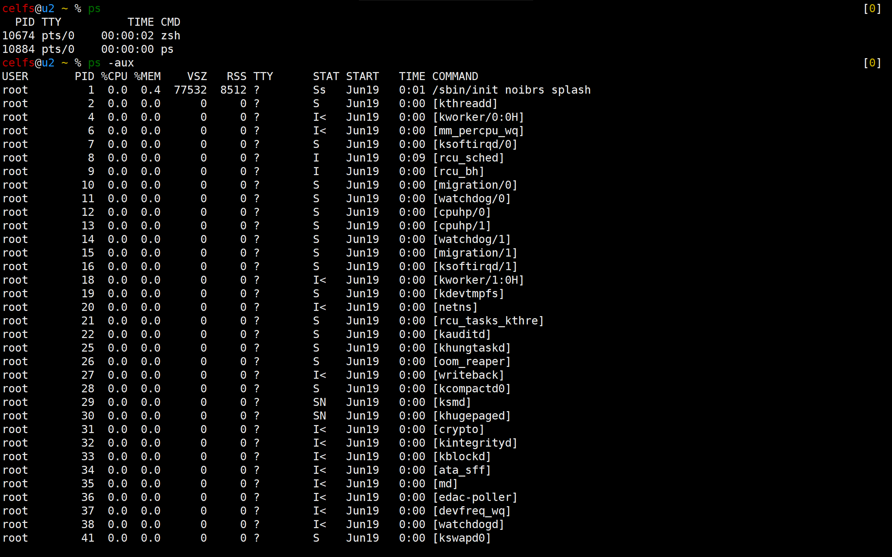

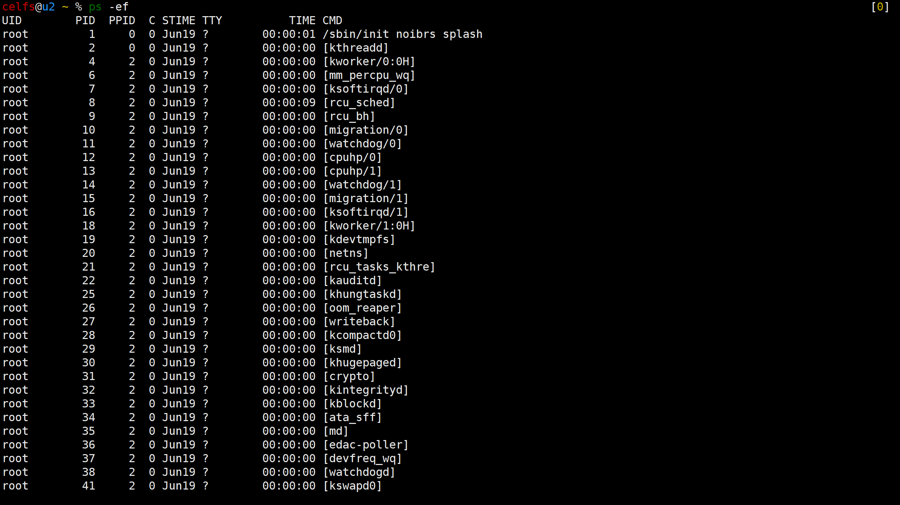

------

### 5 pstree【常用】

* 功能：树状显示进程派生关系。
* 常用命令：
  * [-a]：显示程序完整指令
  * [-n]：PID排序
  * [-p]：显示PID
  * [-u]：显示用户名
  * [-l]：使用长列格式显示树状【测试发现，与直接使用pstree结果一致，可能受当前进程环境限制，进程较少，未体现该参数功能】 
* 运行截图

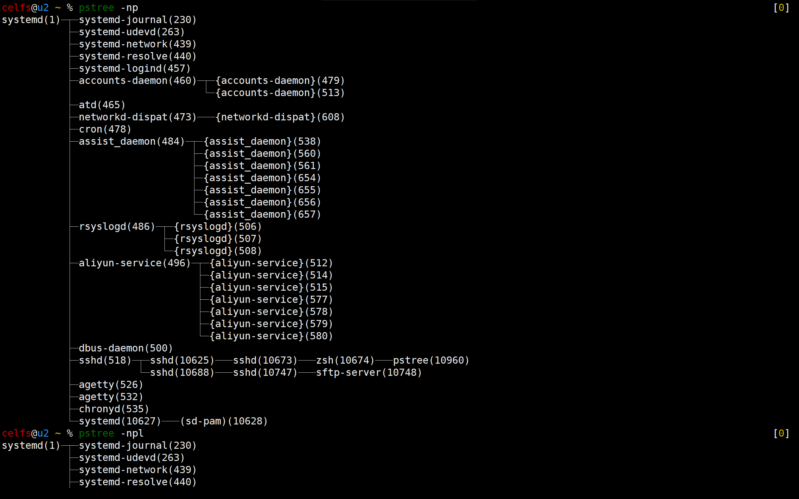

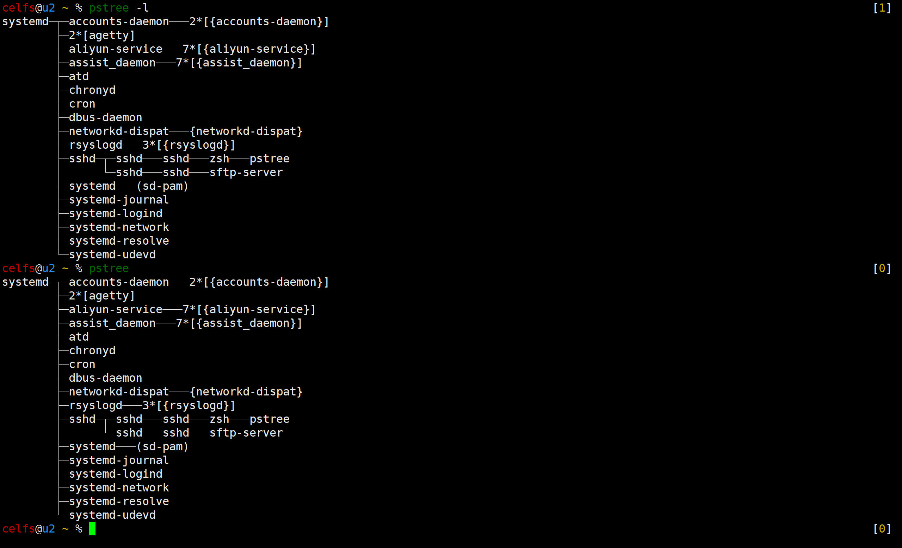

------


### 6 pgrep

* 功能：查找进程ID，检索进程（grep检索信息）。

* 运行截图

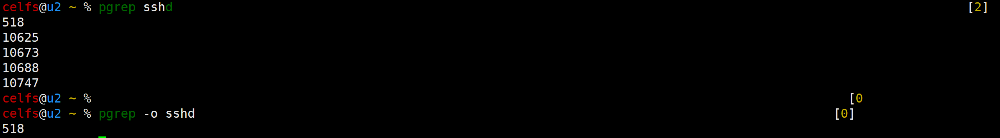

------


### 7 kill

* 功能：结束执行中的程序和工作。【根据具体进程PID的kill】

* 常用命令：
  * `kill pid`
  * `kill -9 pid`
    * [-9]：Kill all processes you can kill.
* **疑问：**
  * **为什么强制结束进程的参数是`[-9]`？至今为止见到的命令参数，基本上都是英文字母，而偶尔出现的个别数字是控制输出形式的，或者像`PID`那样指明对象。`kill`下的数字命令参数，还有`[-2]` ` [-17]`。**
  * **`kill`执行完毕，没有反馈信息，需再次键入`jobs`等检查进程命令，是否有更快捷的信息反馈方式？例如与`kill`命令融合执行，`kill`后自动反馈成功与否的信息。**
  * 执行`kill`后，进程[1] +/- PID，中的±号代表什么？
    * 【**变化规律：**1个进程[+]，2个进程[-] [+]，3个进程[空] [-] [+]，4个进程[空] [空] [-] [+]】
    * 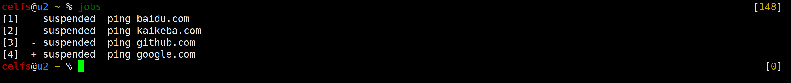
* **插曲【ping不通，已解决】**：

```bash
//编辑以下文件
sudo vim /etc/resolv.conf
//添加以下代码
nameserver 114.114.114.114
```

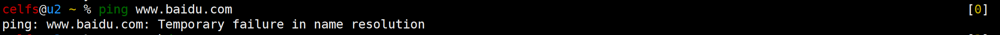

* 运行截图

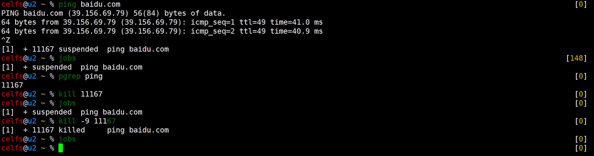

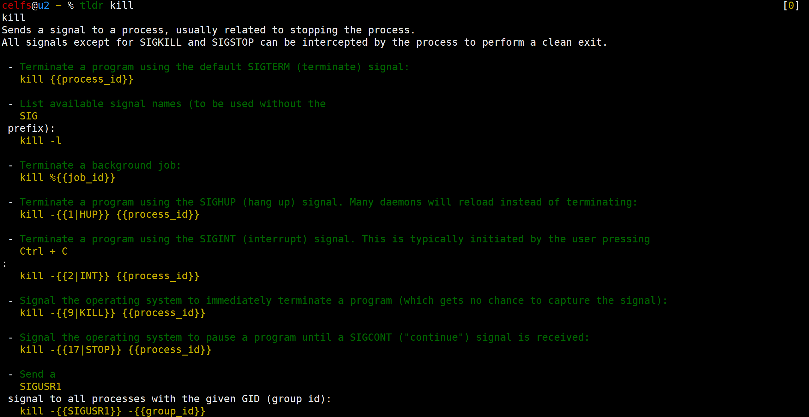

------


### 8 pkill

* 功能：结束进程中的程序和工作。**【模糊匹配进程名称的kill，root下存在`kill`系统进程的风险】**

* 运行截图

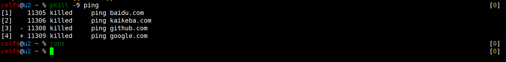

------


### 二、简答题

* 假设你在你的云主机上安装了`MySQL`数据库，请问你要如何确认它是否在**正确运行**，以及如果它在运行的话，应该如何**结束**它？
* **答：**
  * 以`ping`进程为例
    * 执行后挂起程序（非必要）；
    * `jobs`获取当前挂起的进程列表（非必要）；
    * `pgrep`获取进程`PID`（挂起操作也会显示`PID`）；
    * `ps`和`grep`关键词筛选信息，对照获取的`PID`，可找到**正在运行**的`ping`进程；
    * `pkill`结束进程，`jobs`检查挂起进程列表，为空，说明`ping`进程既没有挂起，也没有在总进程中执行，进程成功结束。
  * **但是**
    * 1、以上的操作，应该**只能够证明`MySQL`打开了**，不代表正确运行，本人理解的**正确运行，是基于有效实现数据传输任务**的运行，因此，应该结合**进程使用流量等信息进一步判断**。
    * 2、这样结束的方式，是否代表进程正确结束？`kill`命令，尤其是`[-9]`强制`kill`命令，需考究是否执行数据保存的操作，正常结束进程，**应该是**像`vim`编辑文本的时候使用的`:wq`命令，**从程序内部主动结束任务**，而`kill`相关命令，更像是**程序被动结束**。
  * **进一步判断思路【控制变量】**
    * 考虑优先清空除系统进程外的额外进程，减少数据干扰；
    * 运行`MySQL`前，使用`dstat`监控当前进程流量，`--output`输出CSV文件；
    * 运行`MySQL`后，考虑利用测试数据，充程序的流量，同时考虑**如何估算**输入输入数据流量大小；
    * 挂起`MySQL`后，使用`dstat`监控当前进程流量，`--output`输出CSV文件；
    * 对比相同时间、相同刷新次数下的进程流量CSV文件数据，若数据收发量差值与估算值相近，说明`MySQL`某种程度上正确运行。

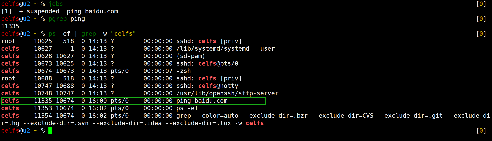

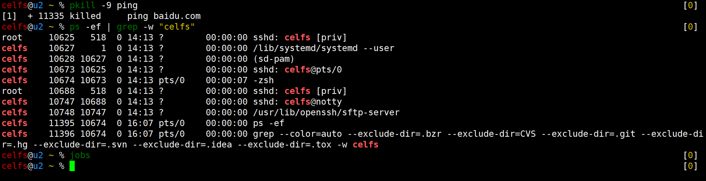

------


### 参考

* Linux脚本刷新屏幕显示输出，像top命令一下刷新屏幕_Aubrey.J的博客-CSDN博客_shell 刷新输出  https://blog.csdn.net/qq_33598419/article/details/103315187
* linux top mem/swap内存显示_麦子的博客-CSDN博客  https://blog.csdn.net/u010931123/article/details/101461771
* linux SWAP大小与内存的关系_libaoan1971的专栏-CSDN博客_centos7 swap和内存关系  https://blog.csdn.net/libaoan1971/article/details/52931284?utm_medium=distribute.pc_relevant.none-task-blog-2%7Edefault%7EBlogCommendFromMachineLearnPai2%7Edefault-1.control&depth_1-utm_source=distribute.pc_relevant.none-task-blog-2%7Edefault%7EBlogCommendFromMachineLearnPai2%7Edefault-1.control
* <ps> ps aux 和ps -aux和 ps -ef的选择 - 裴银祥的博客园 - 博客园  https://www.cnblogs.com/yinxiangpei/articles/5053840.html
* Linux下ps -ef和ps aux的区别及格式详解 - 520_1351 - 博客园  https://www.cnblogs.com/5201351/p/4206461.html
* **Linux三种风格（Unix、BSD、GNU）下的ps的参数说明_喵哥的博客-CSDN博客_bsd风格  https://blog.csdn.net/ruibin_cao/article/details/84660224**
* Temporary failure in name resolution 错误解决方法 – 默默的点滴  https://www.mobibrw.com/2017/6092
* Temporary failure in name resolution 错误解决方法 - Open source of memory - ITeye博客  https://www.iteye.com/blog/cloudera-809821