### 06 数据提取练习题

创建信息：2021年6月23日10:48:26  By CELFS

修改信息：2021年6月23日19:32:56  By CELFS

* 反馈信息：

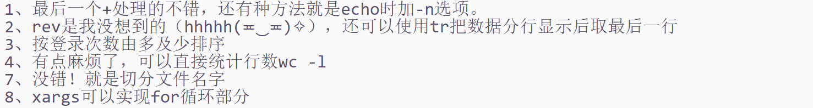

修改信息：2021年6月24日02:30:21  By CELFS

------


### 1 题目一（tr命令操作）

* 题干：对文件的重命名，内容的替换操作。

 

#### 1.1 `tr`命令对文件重命名（translate or delete characters）【疑问？】

* 查找了不少资料，没找到整体文件名替换的方法，另一方面，tr命令更多是对文件内部的字符进程处理的工具，修改文件名，可以用`mv` `cp` `rename`

#### 1.2 `tr`命令字符串数字求和

```bash
#"1 2 3 4 5 6 7 8 9 a v 你好 ./8"
echo "1 2 3 4 5 6 7 8 9 a v 你好 ./8" | xargs -n1 | echo $[ $(tr '\n' '+') 0 ]

#替换、连续重复字符去重
echo "1 2 3 4 5 6 7 8 9 a v 你好 ./8" | tr -c -s '^[0-9]' '0' | tr '0' '+'
>>>1+2+3+4+5+6+7+8+9+8+

#由于等式末位为“+”号，等式对象整体用“$()”（等价于``）输入最外层的“echo $[]”命令作为变量，并在`等式`末尾添加“0”，以确保运算式正确，运行得到结果
echo $[$(echo "1 2 3 4 5 6 7 8 9 a v 你好 ./8" | tr -c -s '^[0-9]' '0' | tr '0' '+') 0 ]
>>>53

#命令优化，外层$[]不可替换为“``”，“``”嵌套将出现类似“/**/”嵌套的识别错误
echo $[`echo "1 2 3 4 5 6 7 8 9 a v 你好 ./8" | tr -c -s 0-9 0 | tr 0 +` 0 ]
>>>53

#方法二：（去除末位+替换操作）（不可省略任何括号）【修改1】
echo $[$(echo -n "1 2 3 4 5 6 7 8 9 a v 你好 ./8" | tr -c -s 0-9 0 | tr 0 +)]
```

* 运行截图

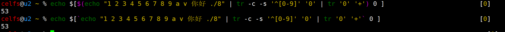

#### 1.3 `tr`命令字符串大写字母替换为小写

```bash
#创建文件
echo "ABCefg">>test.log

#方法一：
echo `cat test.log | tr A-Z a-z`>>test.log

#方法二：偶尔发现的语法（详见问题一参考链接），因为这个操作类似python的for循环，所以大致能明白语法意思
for var in `ls`; do mv -f "$var" `echo "$var" |tr a-z A-Z`; done
```

* 运行截图

  > 重定向
  >
  > * 覆盖
  >   * \>：命令到文件
  >   * \<：文件到命令
  > * 追加
  >   * \>>、<<

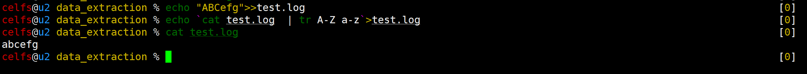

#### 1.4 参考

* linux下的文件操作——批量重命名 - pangbangb - 博客园  https://www.cnblogs.com/pangblog/p/3243931.html
* linux命令总结之tr命令 - 琴酒网络 - 博客园  https://www.cnblogs.com/ginvip/p/6354440.html

------


### 2 题目二（路径)

* 题干：找到 `PATH` 变量中的最后⼀个路径。

```bash
echo ${PATH}
>>>/usr/local/sbin:/usr/local/bin:/usr/sbin:/usr/bin:/sbin:/bin:/usr/games:/usr/local/games:/snap/bin

#有时候，由于内容较多，末位字段序号难以人为计数
#echo获取环境变量 | rev反转内容 | cut按冒号分隔，识别反转后的第一个元素 | rev再次反转内容
echo $PATH | rev | cut -d ":" -f 1 | rev
>>>/snap/bin
```

------


### 3 题目三（排序）

* 题干：使用`last`命令，输出所有的登录用户名及登录次数，按登录次数由多及少排序。

```bash
#last获取最近登录信息列表 | cut按空格符切分列表 | grep筛选掉不符的信息及空行 | sort字典序排序 | uniq -c计数
last | cut -d " " -f 1 | grep -v wtmp | grep  -v "^$" | sort | uniq -c

#遗漏登录次数排序【修改1】
last | cut -d " " -f 1 | grep -v wtmp | grep  -v "^$" | sort | uniq -c | sort -nr
```

* 运行截图

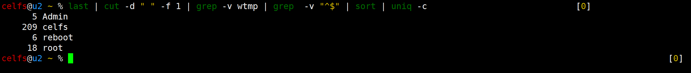


------


### 5 题目五（排序）

* 题干：将 `/etc/passwd` 中的内容按照用户名排序。 

* 运行截图（字典序，**用户名下划线“_”应该是自动忽略了**）

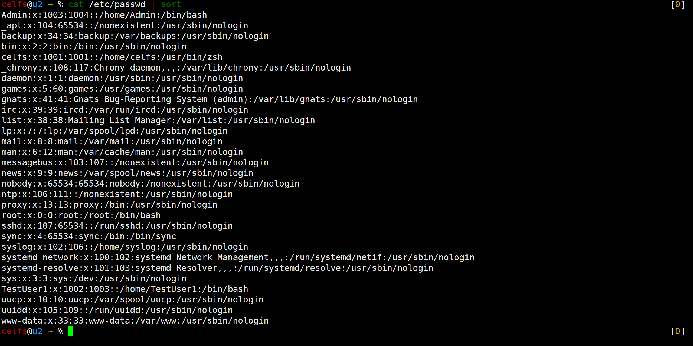

* 分隔内容以简化界面

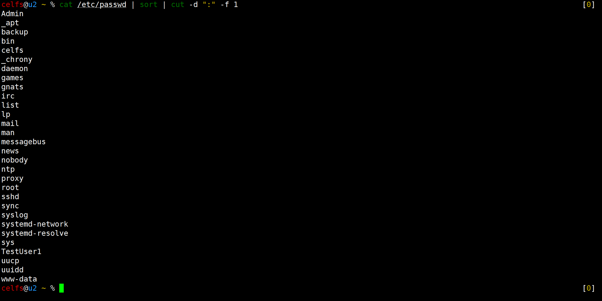

------


### 6 题目六（排序）

* 题干：将 `/etc/passwd` 中的内容按 `uid` 排序。 

``` bash
#cat获取文件内容 | sort以冒号分隔，取分隔后第三个区间，按数值排序（-r反向排序）
cat /etc/passwd | sort -t : -k 3 -n
```

* 运行截图

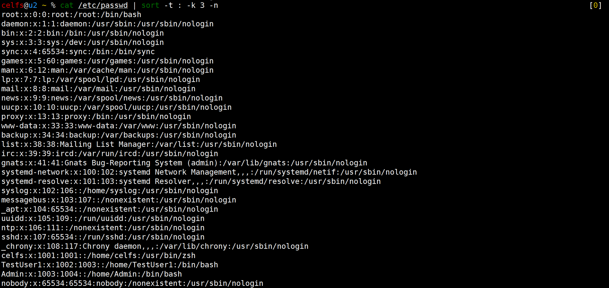

------


### 7 题目七（切分文件）

* 题干：将本地的 `/etc` 目录下的文件及目录，每十条保存到⼀个文件中。 
* 部分题意未达，目录下的文件也要存到不同的文件内？会不会影响系统运行的呢？【理解正确，已解决】

```bash
echo `ls /etc/`>>/home/celfs/data_extraction/ls_tec.log
cat ls_tec.log | tr " " "\n" | split -l 10
>>xaa  xab  xac  xad  xae  xaf  xag  xah  xai  xaj  xak  xal  xam  xan  xao  xap  xaq  xar
```

* 运行截图

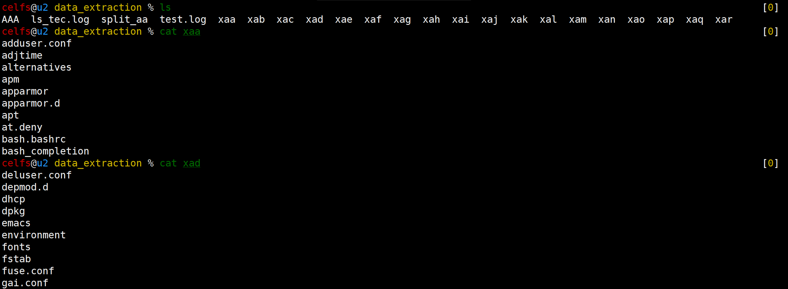

------


### 8 题目八（指定输出）

* 题干：将 `/etc/passwd` 中存放的第10到20个用户，输出 `uid` ， `gid` 和 `groups` 。 

```bash
echo /etc/passwd>>data_extraction/passwd_test

#cat获取备份文件内容 | sed获取指定行内容 | cut获取用户名
cat passwd_test | sed -n '10,20p' | cut -d : -f 1

#偶尔找到一种语法（详见问题一的参考），类似python的for循环，尝试了一下发现有点能理解，于是进行了魔改
#for循环读取上述管道内容，逐一存在val变量内，do语法执行id + user命令，done结束命令
for val in $(cat passwd_test | sed -n '10,20p' | cut -d : -f 1 );do id "$val";done

#同时执行groups检索(没想到&&也能生效，有机会要了解一下脚本语言的历史)
for val in $(cat passwd_test | sed -n '10,20p' | cut -d : -f 1 );do id  "$val" && groups  "$val" ;done

#xargs实现for循环【修改1】
#man不推荐使用-l
cat passwd_test | sed -n '10,20p' | cut -d : -f 1 | xargs -l id
cat passwd_test | sed -n '10,20p' | cut -d : -f 1 | xargs -L 1 id

#如何实现xargs后连续指向id和groups？
```

* xargs三种用法【修改1】
  * 分隔数据，避免参数过长
  * 传递参数，从而组合多个命令
  * 不支持管道的命令
* 参考
  * linux_xargs入门介绍_及和for循环命令区别 - 深入学习ing - 博客园  https://www.cnblogs.com/lxhbky/p/13598921.html
* 运行截图

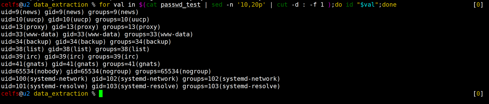

* 所属组检索

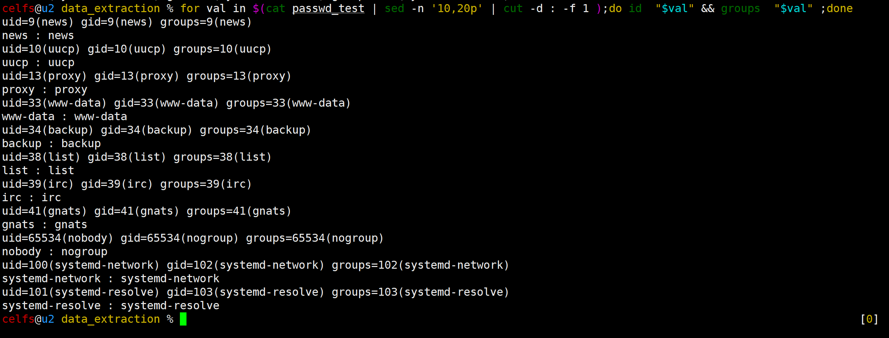

* 【修改1】

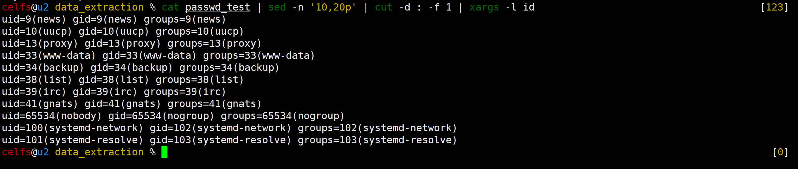

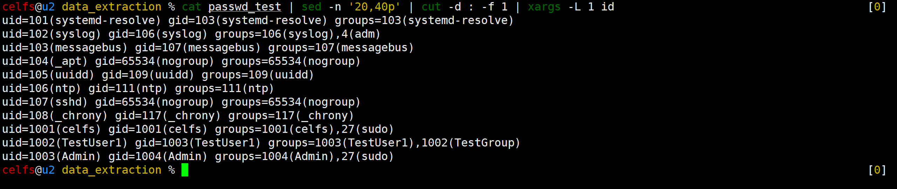

### 9 题目九（指定读取）

* 题干：将按照用户名查看 `/etc/passwd` 中的用户，读到 `'sync’` 用户时结束。

```bash
#cat获取备份文件内容 | cut按用户查找 | xargs读取至sync
cat passwd_test | cut -d ":" -f 1 | xargs -esync
>>>root daemon bin sys
```

* 运行截图

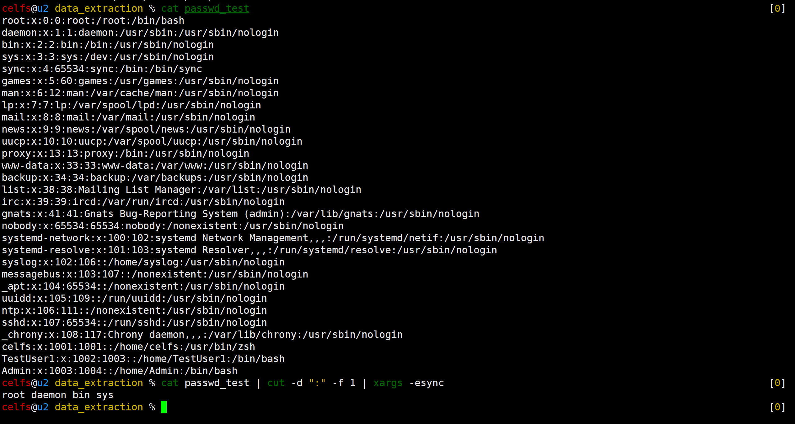

------


### 10 题目十（词频统计）

* 题干：统计a.txt中各词的词频，并按照从大到小的顺序输出。

 

```bash
#测试及资料显示，单独使用uniq命令只能去重相邻行元素
cat a.txt | grep -v "^$" | tr ' ' '\n' | uniq -c
>>>
      1 nihao
      2 hello
      1 你好
      1 nihao
      1 hello
      1 ls
      1 cd
      1 world
      1 pwd

#偶然加入sort排序后，发现uniq可以按行识别元素，是因为sort打散了内容原本的行列结果？
cat a.txt | grep -v "^$" | tr ' ' '\n' | sort | uniq -c
>>>
      1 cd
      3 hello
      1 ls
      2 nihao
      1 pwd
      1 world
      1 你好

#cat获取内容 | grep去除空行 | tr将单词按行分隔 | sort排序打散内容 | uniq去重统计 | sort反向排序
cat a.txt | grep -v "^$" | tr ' ' '\n' | sort | uniq -c | sort -nr
```

* 运行截图

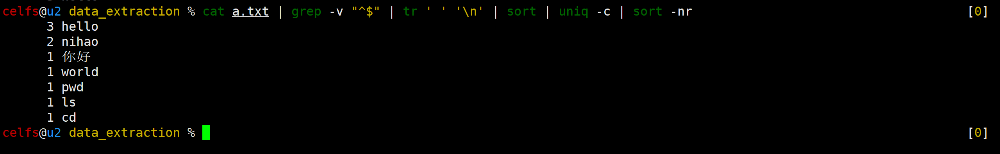

* 参考
  * Linux命令去重统计排序（awk命令去重，sort, uniq命令去重统计）_风之翊的专栏-CSDN博客_linux去重命令  https://blog.csdn.net/feng973/article/details/73849586

------


### 4 题目四（统计登录总人次）

* 题干：在云主机上查找系统登录用户的总⼈次。 

```bash
#第三章第3节【Linux系统信息的获取】讲到，成功登录的用户信息存储在wtmp文件内，而wtmp.1为上个月登录成功的用户信息，更早前的登录信息，文件名称应该是顺延的，本机最早登录在当年5月7日
last -f /var/log/wtmp

#重定向备份文件，两个月的成功登录信息追加
last -f /var/log/wtmp>/home/celfs/data_extraction/wtmp_test
last -f /var/log/wtmp.1>>/home/celfs/data_extraction/wtmp_test

#数据清洗，统计备份文件单用户登录总次数
cat wtmp_test | grep -v wtmp | grep -v "^$" | cut -d " " -f 1 | sort | uniq -c

#在上述命令的基础上，利用问题一的求解思路，求内容中的数字总和
#echo返回表达式结果 | tr筛选数字，替换+运算符，末位0构建完整表达式
echo $[$(echo `cat wtmp_test | grep -v wtmp | grep -v "^$" | cut -d " " -f 1 | sort | uniq -c` | tr -cs 0-9 +) 0]
>>>289

#原做法较为繁琐【修改1】
cat wtmp_test | grep -v wtmp | grep -v "^$" | cut -d " " -f 1 | wc -l
>>>289
```

* 运行截图

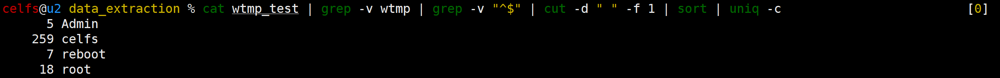

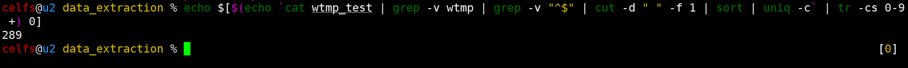