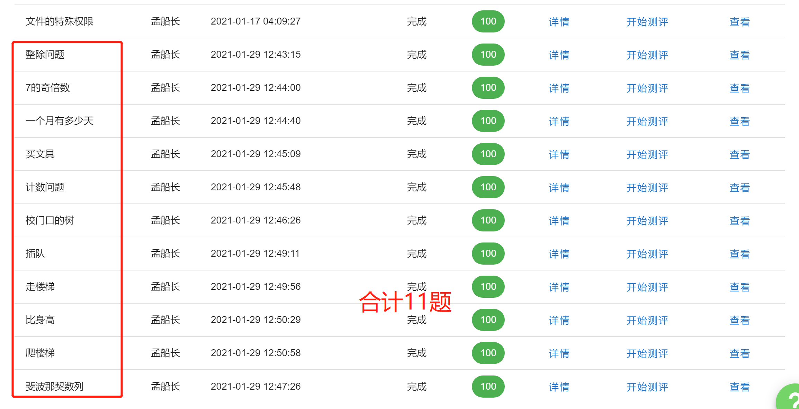
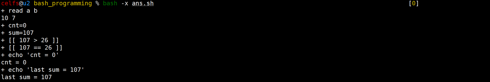
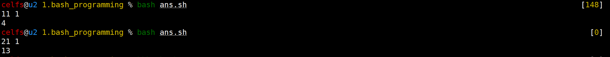
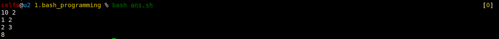
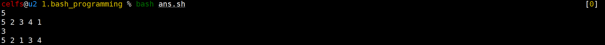
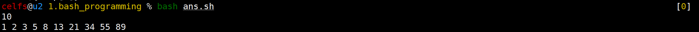

### 07 shell编程练习题

创建信息：2021年6月25日23:00:23  By CELFS

修改信息：2021年6月26日03:57:20  By CELFS

* 完成题6

修改信息：2021年6月26日18:26:22  By CELFS

* 完成题11，截止目前，测评解锁可能出现bug，未出现12-14题

------


### 0 测评截图



------

<div style="page-break-after: always;"></div>

### 1 整除问题

* 题干

   

* 代码实现

```bash
#!/bin/bash
read a b
#使用符号运算符“==”亦可
if [[ $[a % b] -eq 0 ]];then
    echo "YES"
else 
    echo "NO"
fi
```

------

<div style="page-break-after: always;"></div>

### 2 七的奇数倍

* 题干

   

* 代码实现

```bash
#!/bin/bash
read n
#C语言中的&&语法有效
if [[ $[n % 7] == 0 && $[n % 2] != 0 ]];then
    echo "YES"
else
    echo "NO"
fi
```

------

<div style="page-break-after: always;"></div>

### 3 一个月有多少天

* 题干

   

* 思路：

  * 构造函数判断平闰年即可。

* 历程：

  * 主要绊脚石在函数传参语法、数字下标运算语法，查找相关资料后（详见问题4参考链接）暂且解决。

* 代码实现

```bash
#!/bin/bash
read y m
#判断平闰年
function is_a_leap_year {
    if [[ ($[$y % 100] == 0 && $[$y % 400] == 0) || ($[$y % 100] != 0 && $[$y % 4] == 0) ]];then
        echo 1
    else
        echo 0
    fi
}

declare -a days
days=(31 28 31 30 31 30 31 31 30 31 30 31)
#存储函数返回值，用作判断
result=`is_a_leap_year`

if [[ $result != 0 ]];then
    days[1]=29
    echo ${days[`expr $m - 1`]}
else
    echo ${days[`expr $m - 1`]}
fi
```

------

<div style="page-break-after: always;"></div>

### 4 买文具

* 题干：

    

* 读题：考察的应该是浮点数运算、比较大小

* 思路：

  * **扩大为整数优先得出结果**，初步查阅资料发现，let仅支持整数运算，需找到对应其他数值形式的命令与语法，有时间再学习shell浮点数运算，暂时放一下。

* **疑问及代码**

  * shell比较两数大小，在使用运算符号“>=”情况下，例如107和12，得到的结果是107<12，而130和12，得到的结果是130>12，问题出现在比较的数位上，三位数只比较了前面两个数位的大小，相当于10和12比，13和12比。【已解决，更换为“-ge”比较符】【但问题的根源是什么？shell语言下的符号是按位比较？】

```bash
#问题代码
#!/bin/bash
read a b
cnt=0
sum=$[$[$a * 10] + $b]
#此处比较运算符，如果用符号，就会按b的位数多少来与a的前面相同位数比较，想起了位运算，但好像没什么关系
while [[ $sum > 26 || $sum == 26]];do
    let sum-=26
    let cnt++
done
echo $cnt
```

* 运行截图【失败】



* 代码实现【成功】

```bash
#!/bin/bash
read a b
cnt=0
sum=$[$[$a * 10] + $b]
while [[ $sum -ge 26 ]];do
    let sum-=26
    let cnt++
done
echo $cnt
```

* 参考
  * **运算符相关**
    * Shell 基本运算符 | 菜鸟教程  https://www.runoob.com/linux/linux-shell-basic-operators.html
    * Shell (())：对整数进行数学运算  http://c.biancheng.net/view/2480.html
    * (1条消息) shell中实现浮点数运算_jichenchen1990的专栏-CSDN博客_shell浮点数  https://blog.csdn.net/jichenchen1990/article/details/76059977
    * shell运算符与表达式_pansaky的博客-CSDN博客_shell计算表达式  https://blog.csdn.net/pansaky/article/details/86530754
  * **判断语句相关**
    * (1条消息) 一起学Bash脚本：判断语句_Day_and_Night_2017的博客-CSDN博客  https://blog.csdn.net/Day_and_Night_2017/article/details/116454894
    * (转)bash条件判断之if语句 - liujiacai - 博客园  https://www.cnblogs.com/liujiacai/p/9012857.html
  * **返回值、传参相关**
    * Bash：将函数作为参数传递 - ITranslater  https://www.itranslater.com/qa/details/2326003297267745792
    * Bash：传递一个函数作为参数 - 编程之家  https://www.jb51.cc/bash/390967.html
    * shell获取函数的返回值 - 每天1990 - 博客园  https://www.cnblogs.com/meitian/p/5662022.html
    * (1条消息) shell 函数返回值接收问题_Tinghua_M的博客-CSDN博客_shell 函数返回值  https://blog.csdn.net/mdx20072419/article/details/9381339?utm_medium=distribute.pc_relevant.none-task-blog-2%7Edefault%7EBlogCommendFromMachineLearnPai2%7Edefault-1.control&depth_1-utm_source=distribute.pc_relevant.none-task-blog-2%7Edefault%7EBlogCommendFromMachineLearnPai2%7Edefault-1.control
    * (1条消息) SHELL中获取函数返回值_柳鲲鹏-CSDN博客_shell 获取方法返回值  https://blog.csdn.net/quantum7/article/details/103085715?utm_medium=distribute.pc_relevant.none-task-blog-baidujs_baidulandingword-0&spm=1001.2101.3001.4242
    * (1条消息) Bash函数返回值(转)_weixin_33788244的博客-CSDN博客  https://blog.csdn.net/weixin_33788244/article/details/92021783
  * **针对符号比较运算符的查阅【未果】**
    * (1条消息) shell语言，判断一个数字与10的大小_seaVip-CSDN博客  https://blog.csdn.net/I_peter/article/details/78711357
    * shell脚本学习（2）比较两个数字大小 - JUSTZHI - 博客园  https://www.cnblogs.com/me80/p/7989992.html
    * shell中比较两个小数的大小-caojiangfeng-ChinaUnix博客  http://blog.chinaunix.net/uid-20754793-id-177765.html
  * **其他**
    * Linux let 命令 | 菜鸟教程  https://www.runoob.com/linux/linux-comm-let.html
    * bash数组应用之：数组下标的问题 - 简书  https://www.jianshu.com/p/4ad2a61ae5c3?utm_campaign=maleskine&utm_content=note&utm_medium=seo_notes&utm_source=recommendation

------

<div style="page-break-after: always;"></div>

### 5 计数问题

* 题干

    

* 读题：区间、整数、单个数字出现次数，循环，管道

* 思路：

  * 考虑拆分各数值，但如果`n`太大拆分不现实，拆分尝试cut命令，或考虑按位求余数
  * 假设用C语言实现，考虑while循环，按位以字符串的形式存储，遍历比较是否与x相等，计数得到结果；类似的，尝试将思路转换为shell脚本语法；
  * **最后，在调试cut命令之后，觉得可以使用循环嵌套，首先获取n的位数，每一位输入数字按字符读取，可得到结果【简而言之，就是有多少位，一个数就被cut多少次】**

* 历程

  * 判断语句，必须后面跟条件值，不像C语言，返回值1、0可以直接控制循环执行？【这个问题的出现，主要原因应该是以往的学习更为强调理论知识的系统性，而本次学习在简要了解语法的前提下，从**具体题目实践出发**，时间成本可以缩短，语法在做题当中碰碰撞撞，加深了印象，虽然使用过程中有意往C语言语法上靠，但还是挺多不一样的地方】
  * 需梳理shell循环、条件语句、变量中的各类括号应用场景、语法定义、异同。

* 不足

  * **时间复杂度较大（n^2^），在测试的时候有个数停了几秒**
  * 对于时间复杂度的计算，以往无论是自学还是平台的课程预习，也没能清晰理解，虽然在这段时间学习了C语言之后，有了一些更系统的理解，但实际的计算方式总归有点模糊，比如log是怎么来的，之前于船长的C语言任务卡里有讲到素数筛的时间复杂度，个人理解上还是觉得缺少个可视化的对应关系，例如基本代码——通用模型——复杂度对应关系。

```bash
#!/bin/bash
read n x
#判断n的位数
target=$n
len=1
while [[ $(($target/ 10)) != 0 ]];do
    let len++
    let target/=10
done
#通过管道按位切割，暴力穷举所有出现的单个位数字
cnt=0
#seq的作用，相当于python的range，但右端点开闭关系不同
for i in $(seq 1 $n);do
    for j in $(seq 1 $len);do
        if [[ $(echo $i | cut -c $j) == $x ]];then
            let cnt++
        fi
    done
done

echo $cnt
```

* 运行截图



------

<div style="page-break-after: always;"></div>

### 6 校门口的树

* 题干

   

* 示例

```bash
500 3
150 300
100 200
470 471
>>>298
```

* 读题：数轴，整数，区间移除，重合。
* 思路：
  * 总树：L+1；
  * 考虑用数组标记区域，M控制循环读入次数。
* 历程
  * 主要绊脚石还是在判断运算符，宿船长在任务制里使用的是`${tree[$i]}x == x`
  * 变量的取值，花括号与否，需对标相关理论知识。

```bash
#!/bin/bash
read L M

for (( i = 0; i < $M; i++));do
    read start end
    for j in $(seq $start $end);do
        tree[$j]=1
    done
done

cnt=0
for (( i = 0; i <= $L; i++ ));do
    if [[ ${tree[$i]} -eq 0 ]];then
        let cnt++
    fi
done

echo $cnt
```

* 运行截图



------

<div style="page-break-after: always;"></div>

### 7 插队

* 题干

   

* 示例

```bash
7
7 2 3 4 5 6 1
3
>>>7 2 1 3 4 5 6
```

* 读题：把最后一个数，插入到指定位置。
* 思路：
  * n控制循环次数，插入位改变值，其后索引加1，两个数组可以实现；
  * 多数组操作，可能涉及数组**深浅拷贝**问题。【然而并没有涉及到】

* 历程
  * echo 1 2 3 4 5传入的数列，假若赋值给数组，只会存储在数组首位，因此需循环获取【这个问题的出现，是由于`read num`以一个变量读入一行数值】；
  * **数组下标运算表达`expr $i - 1`太繁琐；**
  * touch创建文件后，写好bash文件第一行语法，需重新打开文件vim的配色才能生效，每次都需操作不太现实，需进一步调试环境。

```bash
#!/bin/bash
read n
read num
read x
j=0
for i in $num;do
#这里曾经改错名字，遗漏arr的“1”导致引出了许多不必要的赋值问题
    arr1[$j]=$i
    arr2[$j]=$i
    let j++
done

arr2[`expr $x - 1`]=${arr1[`expr $n - 1`]}
#下面for循环条件表达式由于语法问题，曾陷入瓶颈
for (( i = $x; i <= $n; i++ ));do
    arr2[$i]=${arr1[`expr $i - 1`]}
done

#由于上述实现逐一推后赋值，末位将多出原来的值，移除即可
unset arr2[$n]
#echo ${arr1[@]}
echo ${arr2[*]}
```

* 运行截图



* 参考
  * Shell删除数组元素（也可以删除整个数组）  http://c.biancheng.net/view/819.html
  * Shell 数组 | 菜鸟教程  https://www.runoob.com/linux/linux-shell-array.html
  * Shell数组的增删改查 - 唐胜伟 - 博客园  https://www.cnblogs.com/tangshengwei/p/5446315.html
  * shell-数组复制 - Tool_Man - 博客园  https://www.cnblogs.com/hxlinux/p/13047343.html
  * Li ux shell 四则运算_风雪舞者的技术博客_51CTO博客  https://blog.51cto.com/happytree007/1712338
  * shell下求表达式值的方法 - 向前进 - 博客园  https://www.cnblogs.com/edward259/archive/2010/07/07/1772838.html
  * shell 中的单行注释和多行注释 - 虚生 - 博客园  https://www.cnblogs.com/dylancao/p/9516237.html
  * Shell字符串详解  http://c.biancheng.net/view/821.html
  * Shell 变量 | 菜鸟教程  https://www.runoob.com/linux/linux-shell-variable.html

------

<div style="page-break-after: always;"></div>

### 8 走楼梯

* 题干

   

* 读题：递推实现。

* 思路：

  * 开始条件
    * n=1，1种；n=2 2种；n=3 3种；
    * n=4 五种
      * 1111、22、112、121、211 
  * 递推关系
    * 后一项=前两项之和【通过前几项，暂且判断；具体证明需数学归纳法】
    * f(n)=f(n-1)+f(n-2)
    * 与此类似的有：斐波那契数列、兔子问题、杨辉/帕斯卡三角、C语言预习课中的蒜头爬楼梯题目
  * 终止条件
    * 从n递归回n=1

* 历程

  * 对于数组下标的表示，如果嵌套太多，考虑将一部分结构存储在

```bash
#!/bin/bash
read n
declare -a step
step[0]=1
step[1]=2
for (( i = 2; i < $n; i++ ));do
    val_1=`expr $i - 1`
    val_2=`expr $i - 2`
    step[$i]=`expr ${step[$val_1]} + ${step[$val_2]}`
done

if (( $n == 1 ));then
    unset step[1]
fi

echo ${step[*]}
```

* 运行截图



------

<div style="page-break-after: always;"></div>

### 9 比身高

* 题干

   

* 示例

```bash
4
1
2
1
3
>>>2
```

* 读题：
  * 找指定数值，符合前后比其大的数值个数；
    * 样例符合的是：第二个1（1个）、3（0个）
  * 指定位置的数值，检索位置前后，比较大小、计数；
  * 如果按照样例，“比他高”应该是“比他矮”，题干两个“他”指代的对象应该是不同的，否则会产生矛盾；【**已解决**，属题干理解不到位，主要问题在于，输出的是人数，不是身高】
* 思路
  * 二分法？
  * 【反向】假设已经找到这样的位置x，那么需对x前后两部分数值分段计数；
  * 【正向】从第一个数值开始，依次寻找较大值y，对y逐一分段检索统计，前后为0，那么这个数就是**最大值**；
  * **最后确定思路：遍历——向两端比较大小——记录较大值出现次数——比较两边是否相等——相等则计数**
    * 分段表示
      * 1——（-∞，0）（2，n）【实际操作将0位赋值为0，判断语句从1计算】
      * 2——（0，1）（3，n）
      * 3——（0，2）（4，n）
      * a——（0，a-1）（a+1，n）
* 考虑**数形结合**，这题实际上找的是**该点前后极大值个数（好像也不对，例如下面3就不是极值）**（如下图所示），若相等则符合要求【应该可以使用离散数学的一些工具，可惜没学过】

```bash
#假设输入为1213，关系如下
						3(0,0)√
		2(0,1)			|
1(0,2)	|		1(1,1)√	|
|_______|_______|_______|_______
1		2		3		4

#假设输入为5121341，关系如下
5(0,0)√
|										4(1,0)
|								3(1,1)√ |
|				2(1,2)			|		|
|		1(1,3)	|		1(2,2)√	|		|		1(4,0)
|_______|_______|_______|_______|_______|_______|__________
1		2		3		4		5		6		7
```

* 代码实现

```bash
#!/bin/bash
read N
for i in $(seq 1 $N);do
    read num
    arr[$i]=$num
done

cnt=0
for (( i = 1; i <= $N; i++ ));do
    left_cnt=0
    right_cnt=0
    #val命名取决于区间上的端点位置，与左右部分无关
    val_right=`expr $i - 1`
    val_left=`expr $i + 1`
    arr[0]=0
    #分段判断
    #左半部分，若有较大值，则计数+1
    for j in $(seq 0 $val_right);do
        if [[ ${arr[$j]} -gt ${arr[$i]} ]];then
            let left_cnt++
        fi
    done
    #右半部分，若有较大值，则计数+1
    for j in $(seq $val_left $N);do
        if [[ ${arr[$j]} -gt ${arr[$i]} ]];then
            let right_cnt++
        fi
    done
    #若两者相等，则计数+1
    if [[ $left_cnt -eq $right_cnt ]];then
        let cnt++
    fi
done

echo ${cnt}
```

------

<div style="page-break-after: always;"></div>

### 10 爬楼梯

* 题干

   

* 读题：与C语言程序设计课程中的“蒜头爬楼梯”题目一样。

* 思路：

  * 开始条件
    * n=2 1种，n=3 1种，n=4 1种，n=5 2种；
    * n=6 2种【由4 3相加】
      * 222、33
    * n=7 3种【由5 4相加】
      * 223、232、322
    * n=8 4种【由6 5相加】
      * 2222、233、323、332
  * 递推关系
    * f(n)=f(n-2)+f(n-3)
    * 这样的关系，是由什么决定的？递推的形式多种多样，但本质是什么？如何更形象地理解？

```bash
#!/bin/bash
read N
step[1]=0
step[2]=1
step[3]=1
for (( i = 4; i <= $N; i++ ));do
    val1=`expr $i - 2`
    val2=`expr $i - 3`
    step[$i]=`expr ${step[$val1]} + ${step[$val2]}`
done

echo ${step[$N]}
```

------

<div style="page-break-after: always;"></div>

### 11斐波那契数列

* 题干

   

* 读题：顾名思义，与第8题一样，修改一下起始值与输出值即可。

```bash
#!/bin/bash
read n
declare -a step
step[0]=1
step[1]=1
for (( i = 2; i < $n; i++ ));do
    val_1=`expr $i - 1`
    val_2=`expr $i - 2`
    step[$i]=`expr ${step[$val_1]} + ${step[$val_2]}`
done

if (( $n == 1 ));then
    unset step[1]
fi

echo ${step[-1]}
```

------


### 12 To Be Continued……