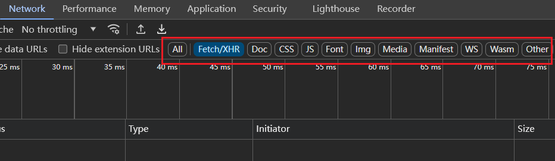
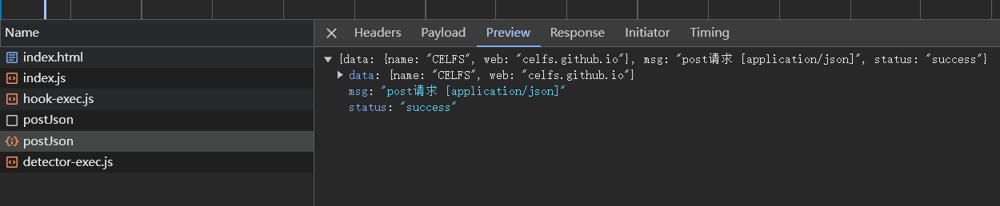

## 00 Task Ajax + Axios + Fetch API

Date：2024/07/11 16:50:21

------


[TOC]


------


### 00 进度

* 开始课程（2024/07/11）--> 完成课程（2024/07/11）
* 补充
  * 本篇对 Ajax 的了解，仅仅停留在网络请求的相关内容，还需要系统补充 Ajax 的地图，例如同源策略这种涉及跨域问题的基础知识。


------


### 00 网络请求

* 什么是网络请求？
  * 一次请求（每一次的传输）
  * 网页请求数（衡量网页性能的重要指标）

> 1. **加载时间相关指标**:
>    - **首次内容绘制（First Contentful Paint, FCP）**: 表示页面开始加载有意义的内容的时间点。
>    - **首次有意义绘制（First Meaningful Paint, FMP）**: 页面主要内容加载完成的时间点。
>    - **最大内容绘制（Largest Contentful Paint, LCP）**: 页面上最大的图像或文本块渲染完毕的时间，这是 Core Web Vitals 中的一个关键指标。
>    - **完全加载时间（Total Load Time）**: 页面所有资源加载完成的时间。
> 2. **交互性指标**:
>    - **首次输入延迟（First Input Delay, FID）**: 用户第一次与页面交互到浏览器实际处理该事件之间的时间，这也是 Core Web Vitals 的一部分。
>    - **可交互时间（Time to Interactive, TTI）**: 页面变得完全可交互所需的时间，即所有资源加载完毕且页面响应用户输入的时间。
> 3. **视觉稳定性指标**:
>    - **累积布局偏移（Cumulative Layout Shift, CLS）**: 页面在加载过程中元素位置发生变化的程度，也是 Core Web Vitals 的一部分。
> 4. **资源优化指标**:
>    - **DNS解析时间**: 解析域名到IP地址所需的时间。
>    - **建立连接时间（TCP建立时间）**: 建立TCP连接所需的时间。
>    - **首字节时间（Time to First Byte, TTFB）**: 发出请求到收到第一个字节数据的时间。
>    - **下载速度**: 下载页面资源的速度。
> 5. **用户体验指标**:
>    - **总阻塞时间（Total Blocking Time, TBT）**: 在首次内容绘制和可交互时间之间，所有长任务阻塞主线程的时间总和。
> 6. **其他指标**:
>    - **并发用户数**: 系统能够同时处理的用户数量。
>    - **网络丢包率和网络时延**: 影响数据传输效率的因素。
>    - **请求响应时间**: 服务器处理请求并返回响应所需的时间。
>    - **事务响应时间**: 完成一次完整用户操作（如登录或搜索）所需的时间。

* 请求筛选




------


### 01 原生 AJAX

* 整体一板一眼，步骤繁琐。

```javascript
const xhr = new XMLHttpRequest();
xhr.open('GET', 'http://127.0.0.1:8008/article/get/id/2');
xhr.send();
xhr.onreadystatechange = function () {
    if (xhr.readyState === XMLHttpRequest.DONE && xhr.status === 200) {
        console.log(JSON.parse(xhr.responseText));
    }
}

xhr.open('POST', 'http://127.0.0.1:8008/postJson');
xhr.setRequestHeader('Content-Type', 'application/json');
xhr.send(
    JSON.stringify({
        name: 'CELFS',
        web: 'celfs.github.io',
    })
);
xhr.onreadystatechange = function () {
    if (xhr.readyState === XMLHttpRequest.DONE && xhr.status === 200) {
        console.log(JSON.parse(xhr.responseText));
    }
}

```

* 运行




------


### 02 Axios

* 可使用链式调用、或 `async await` 两种写法；
* 可定义属性；
* 可设置拦截器（需 `return` ）

```javascript
// 2）axios
// 链式调用
axios.get('http://127.0.0.1:8008/article/get/id/2').then(res => {
    console.log(res.data);
});

// async await 写法
(async () => {
    const res1 = await axios.get('http://127.0.0.1:800/article/get/id/2');
    console.log(res1.data);

    const res2 = await axios.post('http://127.0.0.1:8008/postJson',
        JSON.stringify({
            name: 'CELFS', 
            web: 'celfs.github.io', 
        }),
        { 
            headers: {
                'Content-Type': 'application/postjson'
            } 
        }
    );
    console.log(res2.data);
})();

// 定义属性 + 拦截器
(async () => {
    const ins = axios.create({
        baseURL: 'http://127.0.0.1:8008'
    });

    ins.interceptors.request.use(config => {
        console.log('发送了请求');
        return config;
    });

    ins.interceptors.response.use(res => {
        console.log('接收到了响应');
        return res;
    });

    const res1 = await ins.get('/article/get/id/2');
    console.log(res1.data);

    const res2 = await ins.post('/postJson',
        JSON.stringify({
            name: 'CELFS', 
            web: 'celfs.github.io', 
        }),
        { 
            headers: {
                'Content-Type': 'application/postjson'
            } 
        }
    );
    console.log(res2.data);
})();
```


------


### 03 Fetch API

* 开发初衷是代替原生 Ajax，封装了一些优质的第三方库，后来，官方将其纳入到规范中。

```javascript
// 3）Fetch API
fetch('http://127.0.0.1:8008/article/get/id/2')
    .then(res => {
        if (res.ok) {
            return res.json()
        }
    })
    .then(data => {
        console.log(data);
    });

fetch('http://127.0.0.1:8008/postJson', {
    method: 'POST',
    headers: {
        'Content-Type': 'application/json'
    },
    body: JSON.stringify({
        name: 'CELFS',
        web: 'celfs.github.io'
    })
}).then(res => {
    if (res.ok) {
        return res.json()
    }
}).then(data => {
    console.log(data);
});
```


* 2024/07/11 19:03:29 2h16min

------

