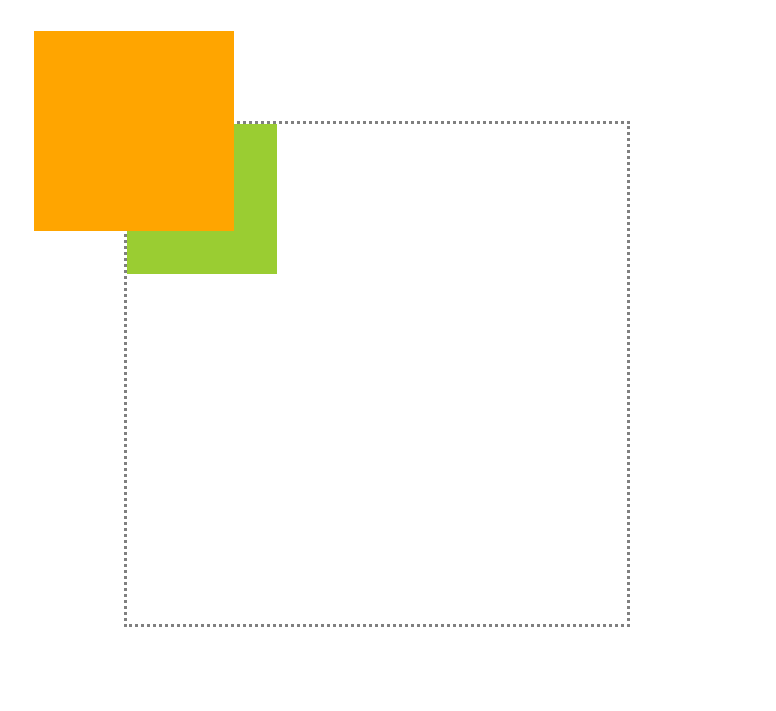
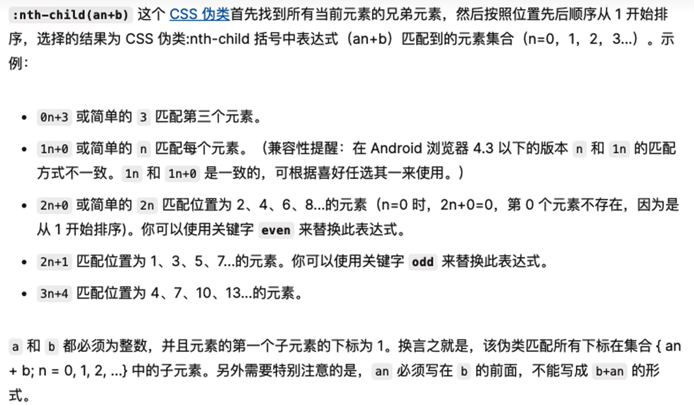
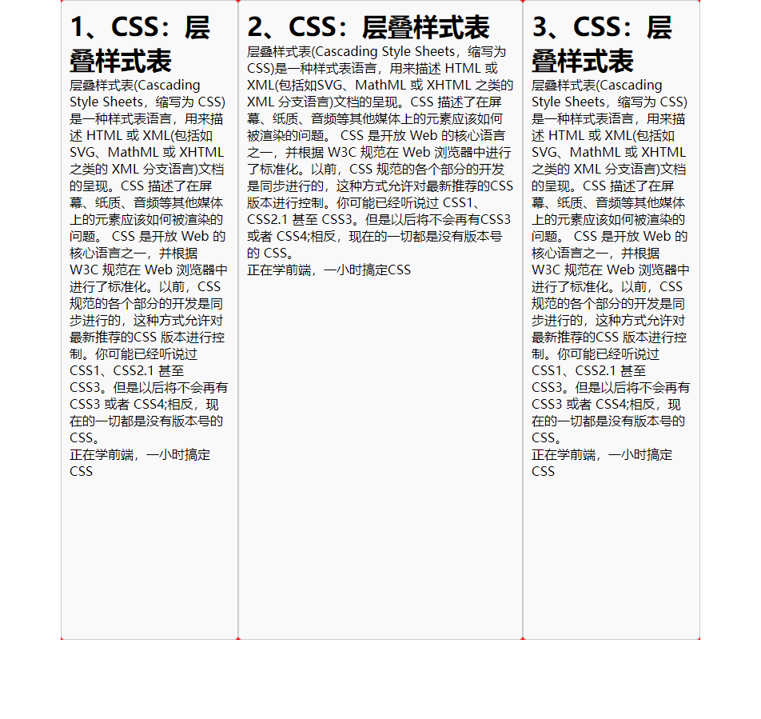
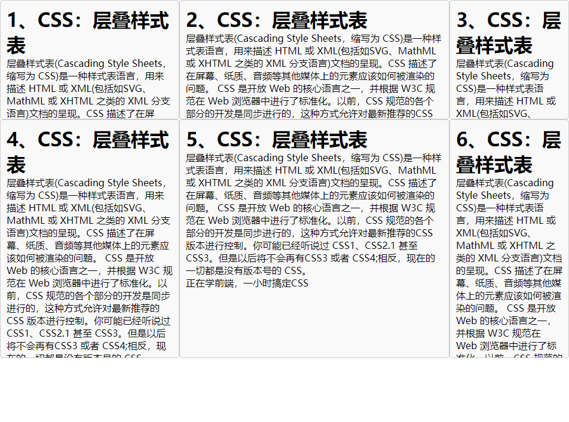
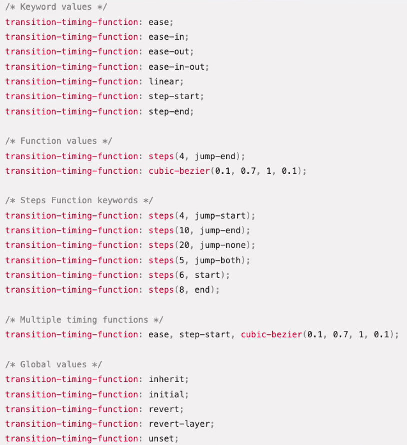

## 00 Task CSS

Date：2024/07/12 17:34:07

------


[TOC]


------


### 00 进度

* 开始课程（2024/07/12）--> 完成课程（2024/07/12）
* 下一步补充
  * CSS 响应式设计
  * 预处理器
* 待整理
  * 按内容切分代码，补充运行效果


------


### 00 CSS

* 层叠样式表（Cascading Style Sheets，缩写为 CSS）是一种**样式表语言**，用来描述 HTML 或 XML（包括如 SVG、MathML 或 XHTML 之类的 XML 分支语言）文档的呈现。
* CSS 描述了在屏幕、纸质、音频等其他媒体上的元素应该如何被渲染的问题。
* [官方教程 HTML.net](http://zh.html.net/tutorials/css/) 


------


### 01 尺寸操作

* 1）引入 CSS 样式文件
* 2）选择器
  * 选择器：用以表示将样式给定的对象
  * 类名：用以标识特定的元素，便于定制化样式。
    * `.className` 元素选取
    * `width` 默认撑满页面


------


### 02 背景处理
### 03 文本处理


------


### 04 位置操作

* `position` 
  * `absolute` 基于父元素的绝对位置，如果父元素未设置相对位置，则默认基于视口的绝对位置；
  * `relative` 如果子元素使用绝对位置属性，则父元素可利用本属性，使得子元素在以父元素自身为参考，并实现基于父元素的绝对位置。简单来说，就是让设置了 `absolute` 属性的子元素，在父元素的内部进行定位。

```html
<!DOCTYPE html>
<html lang="en">
<head>
    <meta charset="UTF-8">
    <meta http-equiv="X-UA-Compatible" content="IE=edge"></meta>
    <meta name="viewport" content="width=device-width, initial-scale=1.0">
    <title>Document</title>
    <link rel="stylesheet" href="./index.css"></link>
</head>
<body>
    <div class="box">
        <h1>CSS：层叠样式表</h1>
        <p>
            层叠样式表(Cascading Style Sheets，缩写为 CSS)是一种样式表语言，用来描述 HTML 或 XML(包括如SVG、MathML 或 XHTML 之类的 XML 分支语言)文档的呈现。CSS 描述了在屏幕、纸质、音频等其他媒体上的元素应该如何被渲染的问题。
            CSS 是开放 Web 的核心语言之一，并根据 W3C 规范在 Web 浏览器中进行了标准化。以前，CSS 规范的各个部分的开发是同步进行的，这种方式允许对最新推荐的CSS 版本进行控制。你可能已经听说过 CSS1、CSS2.1 甚至 CSS3。但是以后将不会再有CSS3 或者 CSS4;相反，现在的一切都是没有版本号的 CSS。
        </p>
        <span>正在学前端，一小时搞定CSS</span>
    </div>

    <div>
        <h1>1、CSS：层叠样式表</h1>
        <p>
            层叠样式表(Cascading Style Sheets，缩写为 CSS)是一种样式表语言，用来描述 HTML 或 XML(包括如SVG、MathML 或 XHTML 之类的 XML 分支语言)文档的呈现。CSS 描述了在屏幕、纸质、音频等其他媒体上的元素应该如何被渲染的问题。
            CSS 是开放 Web 的核心语言之一，并根据 W3C 规范在 Web 浏览器中进行了标准化。以前，CSS 规范的各个部分的开发是同步进行的，这种方式允许对最新推荐的CSS 版本进行控制。你可能已经听说过 CSS1、CSS2.1 甚至 CSS3。但是以后将不会再有CSS3 或者 CSS4;相反，现在的一切都是没有版本号的 CSS。
        </p>
    </div>

    <div>
        <h1>2、CSS：层叠样式表</h1>
        <p>
            层叠样式表(Cascading Style Sheets，缩写为 CSS)是一种样式表语言，用来描述 HTML 或 XML(包括如SVG、MathML 或 XHTML 之类的 XML 分支语言)文档的呈现。CSS 描述了在屏幕、纸质、音频等其他媒体上的元素应该如何被渲染的问题。
            CSS 是开放 Web 的核心语言之一，并根据 W3C 规范在 Web 浏览器中进行了标准化。以前，CSS 规范的各个部分的开发是同步进行的，这种方式允许对最新推荐的CSS 版本进行控制。你可能已经听说过 CSS1、CSS2.1 甚至 CSS3。但是以后将不会再有CSS3 或者 CSS4;相反，现在的一切都是没有版本号的 CSS。
        </p>
    </div>

    <div>
        <h1>3、CSS：层叠样式表</h1>
        <p>
            层叠样式表(Cascading Style Sheets，缩写为 CSS)是一种样式表语言，用来描述 HTML 或 XML(包括如SVG、MathML 或 XHTML 之类的 XML 分支语言)文档的呈现。CSS 描述了在屏幕、纸质、音频等其他媒体上的元素应该如何被渲染的问题。
            CSS 是开放 Web 的核心语言之一，并根据 W3C 规范在 Web 浏览器中进行了标准化。以前，CSS 规范的各个部分的开发是同步进行的，这种方式允许对最新推荐的CSS 版本进行控制。你可能已经听说过 CSS1、CSS2.1 甚至 CSS3。但是以后将不会再有CSS3 或者 CSS4;相反，现在的一切都是没有版本号的 CSS。
        </p>
    </div>

    <div>
        <h1>4、CSS：层叠样式表</h1>
        <p>
            层叠样式表(Cascading Style Sheets，缩写为 CSS)是一种样式表语言，用来描述 HTML 或 XML(包括如SVG、MathML 或 XHTML 之类的 XML 分支语言)文档的呈现。CSS 描述了在屏幕、纸质、音频等其他媒体上的元素应该如何被渲染的问题。
            CSS 是开放 Web 的核心语言之一，并根据 W3C 规范在 Web 浏览器中进行了标准化。以前，CSS 规范的各个部分的开发是同步进行的，这种方式允许对最新推荐的CSS 版本进行控制。你可能已经听说过 CSS1、CSS2.1 甚至 CSS3。但是以后将不会再有CSS3 或者 CSS4;相反，现在的一切都是没有版本号的 CSS。
        </p>
    </div>
</body>
</html>
```

```css
/* 早期浏览器提供默认内外边距，以提高页面美观 */
* {
    padding: 0;
    margin: 0;
}

.box {
    /* 1）尺寸 */
    width: 500px;
    height: 280px;
    border: 3px dotted grey;
    border-radius: 8px;
    padding: 15px 20px;
    /* width: 100%; */ /* 100% of the parent, and with the padding pixels added. */
    /* box-sizing: border-box; */ /* Include the padding and border in the width and height. */
    /* margin: 30px;
    margin-bottom: 50px;
    margin-left: auto;
    margin-right: auto; */
    margin: 200px auto;

    /* 2）背景处理 */
    /* background-image: url(./bg.jpg); */
    background-color: #f9f9f9;
    box-shadow: 5px 5px 5px grey;

    position: relative; /* 相对定位不会影响标签自身，但可提供内部元素在定位时的位置参考 */
}

/* 3）文本处理 */
.box p {
    color: #666;
    text-indent: 2em;
}

.box h1 {
    font-size: 50px;
    /* font-family: '黑体'; */
    font-weight: normal; /* normal is 400 */
    text-align: center;

    /* background-color: orange; */
    height: 80px;
    line-height: 80px; /* 通过匹配行高，实现文本垂直对齐 */
    text-shadow: 2px 2px 2px black;
    text-decoration: dashed underline skyblue; /* underline, overline, line-through, none */
}

.box span {
    color: orange;
    writing-mode: vertical-lr;
    text-orientation: upright;
    /* 4）位置 */
    /* 浮动；定位 --> 浮动存在很多小问题，基本不使用 */
    /* position: absolute; */
    position: fixed;
    top: 50px;
    left: 5px;
}
```

* 位置操作的补充

```css
* {
    margin: 0;
    padding: 0;
}

.box1 {
    width: 500px;
    height: 500px;
    border: 3px dotted grey;
    margin: 130px;
    top: 300px; /* 默认 static，除非设置 position，否则 top 等操作都无效 */
    /* position: relative;  */
}

.box2 {
    width: 200px;
    height: 200px;
    background-color: orange;
    position: absolute; /* 绝对定位不占用空间，找到最近的祖先元素作为参数，无祖先则以 HTML 为参数 */
    top: 40px;
    left: 40px;
}

.box3 {
    width: 150px;
    height: 150px;
    background-color: yellowgreen;
}
```

```html
<!DOCTYPE html>
<html lang="en">
<head>
    <meta charset="UTF-8">
    <meta http-equiv="X-UA-Compatible" content="ie=edge">
    </meta>
    <meta name="viewport" content="width=device-width, initial-scale=1.0">
    <title>Document</title>
    <link rel="stylesheet" href="./index.css"></link>
</head>
<body>
     <div class="box1">
        <div class="box2"></div>
        <div class="box3"></div>
     </div>
</body>
</html>
```

* 运行效果




------


### 05 布局技术

* 网页布局：默认呈现 --> 目标呈现

* `flex` 布局

  * ` display: flex` 以及 `align-items` 与 `justify-content` 的提出，在当时有划时代意义——意味着可以仅用两个参数，控制整体布局的位置，解决了当时普遍采用繁琐实现的问题。

* CSS 伪类

  * `.flex-item:nth-child(2)` 可用于选择该类下的第二个元素，多用于处理没有额外类名或 id 的元素调整（细微的调整，不必用到额外的类名）。

  

```css
* {
    margin: 0;
    padding: 0;
}

.flex-container {
    width: 100%;
    max-width: 800px;
    min-width: 500px;
    margin: 0 auto;
    background-color: red;
    /* 元素的不同呈现 */
    height: 800px;
    display: flex; /* flex 布局 */
    /* align-items: flex-end; */ /* flex 的轴概念 */
    /* justify-content: center; */ /* 水平方向内容调整 */
}

.flex-item {
    padding: 10px;
    border: 1px solid #ccc;
    border-radius: 5px;
    background-color: #f9f9f9;
    /* 元素的不同呈现 */
    /* max-height: 500px;
    max-width: 200px; */
    /* flex 呈现不同比例 */
    /* flex: 2; */
}

.flex-item:nth-child(2) {
    flex: 3;
    min-width: 251px;
}

.flex-item:nth-child(2n+1) {
    width: 200px; /* 最大呈现宽度 */
}
```

```html
<!DOCTYPE html>
<html lang="en">
<head>
    <meta charset="UTF-8">
    <meta http-equiv="X-UA-Compatible" content="IE=edge"></meta>
    <meta name="viewport" content="width=device-width, initial-scale=1.0">
    <title>Document</title>
    <link rel="stylesheet" href="./index.css"></link>
</head>
<body>
    <div class="flex-container">
        <div class="flex-item">
            <h1>1、CSS：层叠样式表</h1>
            <p>
                层叠样式表(Cascading Style Sheets，缩写为 CSS)是一种样式表语言，用来描述 HTML 或 XML(包括如SVG、MathML 或 XHTML 之类的 XML 分支语言)文档的呈现。CSS 描述了在屏幕、纸质、音频等其他媒体上的元素应该如何被渲染的问题。
                CSS 是开放 Web 的核心语言之一，并根据 W3C 规范在 Web 浏览器中进行了标准化。以前，CSS 规范的各个部分的开发是同步进行的，这种方式允许对最新推荐的CSS 版本进行控制。你可能已经听说过 CSS1、CSS2.1 甚至 CSS3。但是以后将不会再有CSS3 或者 CSS4;相反，现在的一切都是没有版本号的 CSS。
            </p>
            <span>正在学前端，一小时搞定CSS</span>
        </div>
        <div class="flex-item">
            <h1>2、CSS：层叠样式表</h1>
            <p>
                层叠样式表(Cascading Style Sheets，缩写为 CSS)是一种样式表语言，用来描述 HTML 或 XML(包括如SVG、MathML 或 XHTML 之类的 XML 分支语言)文档的呈现。CSS 描述了在屏幕、纸质、音频等其他媒体上的元素应该如何被渲染的问题。
                CSS 是开放 Web 的核心语言之一，并根据 W3C 规范在 Web 浏览器中进行了标准化。以前，CSS 规范的各个部分的开发是同步进行的，这种方式允许对最新推荐的CSS 版本进行控制。你可能已经听说过 CSS1、CSS2.1 甚至 CSS3。但是以后将不会再有CSS3 或者 CSS4;相反，现在的一切都是没有版本号的 CSS。
            </p>
            <span>正在学前端，一小时搞定CSS</span>
        </div>
        <div class="flex-item">
            <h1>3、CSS：层叠样式表</h1>
            <p>
                层叠样式表(Cascading Style Sheets，缩写为 CSS)是一种样式表语言，用来描述 HTML 或 XML(包括如SVG、MathML 或 XHTML 之类的 XML 分支语言)文档的呈现。CSS 描述了在屏幕、纸质、音频等其他媒体上的元素应该如何被渲染的问题。
                CSS 是开放 Web 的核心语言之一，并根据 W3C 规范在 Web 浏览器中进行了标准化。以前，CSS 规范的各个部分的开发是同步进行的，这种方式允许对最新推荐的CSS 版本进行控制。你可能已经听说过 CSS1、CSS2.1 甚至 CSS3。但是以后将不会再有CSS3 或者 CSS4;相反，现在的一切都是没有版本号的 CSS。
            </p>
            <span>正在学前端，一小时搞定CSS</span>
        </div>
    </div>
</body>
</html>
```

* 运行效果



* 网格布局
  * 二维布局方案

```css
.grid-container {
    display: grid;
    /* grid-template-columns: 200px 300px 200px; */
    /* grid-template-columns: 20% 50% 30%; */
    /* grid-template-columns: 1fr 1fr 1fr; */
    /* grid-template-columns: repeat(3, 1fr); */
    /* grid-template-columns: repeat(auto-fill, 200px); */
    grid-template-columns: 300px auto 200px;
    height: 600px;
    grid-template-rows: 1fr 2fr; /* 除了比例，还需进行隐藏处理 */
}

.grid-item {
    padding: 10px;
    border: 1px solid #ccc;
    border-radius: 5px;
    background-color: #f9f9f9;
    overflow: hidden;
}
```

```html
<!DOCTYPE html>
<html lang="en">
<head>
    <meta charset="UTF-8">
    <meta http-equiv="X-UA-Compatible" content="IE=edge"></meta>
    <meta name="viewport" content="width=device-width, initial-scale=1.0">
    <title>Document</title>
    <link rel="stylesheet" href="./index.css"></link>
</head>
<body>
    <div class="grid-container">
        <div class="grid-item">
            <h1>1、CSS：层叠样式表</h1>
            <p>
                层叠样式表(Cascading Style Sheets，缩写为 CSS)是一种样式表语言，用来描述 HTML 或 XML(包括如SVG、MathML 或 XHTML 之类的 XML 分支语言)文档的呈现。CSS 描述了在屏幕、纸质、音频等其他媒体上的元素应该如何被渲染的问题。
                CSS 是开放 Web 的核心语言之一，并根据 W3C 规范在 Web 浏览器中进行了标准化。以前，CSS 规范的各个部分的开发是同步进行的，这种方式允许对最新推荐的CSS 版本进行控制。你可能已经听说过 CSS1、CSS2.1 甚至 CSS3。但是以后将不会再有CSS3 或者 CSS4;相反，现在的一切都是没有版本号的 CSS。
            </p>
            <span>正在学前端，一小时搞定CSS</span>
        </div>
        <div class="grid-item">
            <h1>2、CSS：层叠样式表</h1>
            <p>
                层叠样式表(Cascading Style Sheets，缩写为 CSS)是一种样式表语言，用来描述 HTML 或 XML(包括如SVG、MathML 或 XHTML 之类的 XML 分支语言)文档的呈现。CSS 描述了在屏幕、纸质、音频等其他媒体上的元素应该如何被渲染的问题。
                CSS 是开放 Web 的核心语言之一，并根据 W3C 规范在 Web 浏览器中进行了标准化。以前，CSS 规范的各个部分的开发是同步进行的，这种方式允许对最新推荐的CSS 版本进行控制。你可能已经听说过 CSS1、CSS2.1 甚至 CSS3。但是以后将不会再有CSS3 或者 CSS4;相反，现在的一切都是没有版本号的 CSS。
            </p>
            <span>正在学前端，一小时搞定CSS</span>
        </div>
        <div class="grid-item">
            <h1>3、CSS：层叠样式表</h1>
            <p>
                层叠样式表(Cascading Style Sheets，缩写为 CSS)是一种样式表语言，用来描述 HTML 或 XML(包括如SVG、MathML 或 XHTML 之类的 XML 分支语言)文档的呈现。CSS 描述了在屏幕、纸质、音频等其他媒体上的元素应该如何被渲染的问题。
                CSS 是开放 Web 的核心语言之一，并根据 W3C 规范在 Web 浏览器中进行了标准化。以前，CSS 规范的各个部分的开发是同步进行的，这种方式允许对最新推荐的CSS 版本进行控制。你可能已经听说过 CSS1、CSS2.1 甚至 CSS3。但是以后将不会再有CSS3 或者 CSS4;相反，现在的一切都是没有版本号的 CSS。
            </p>
            <span>正在学前端，一小时搞定CSS</span>
        </div>
        <div class="grid-item">
            <h1>4、CSS：层叠样式表</h1>
            <p>
                层叠样式表(Cascading Style Sheets，缩写为 CSS)是一种样式表语言，用来描述 HTML 或 XML(包括如SVG、MathML 或 XHTML 之类的 XML 分支语言)文档的呈现。CSS 描述了在屏幕、纸质、音频等其他媒体上的元素应该如何被渲染的问题。
                CSS 是开放 Web 的核心语言之一，并根据 W3C 规范在 Web 浏览器中进行了标准化。以前，CSS 规范的各个部分的开发是同步进行的，这种方式允许对最新推荐的CSS 版本进行控制。你可能已经听说过 CSS1、CSS2.1 甚至 CSS3。但是以后将不会再有CSS3 或者 CSS4;相反，现在的一切都是没有版本号的 CSS。
            </p>
            <span>正在学前端，一小时搞定CSS</span>
        </div>
        <div class="grid-item">
            <h1>5、CSS：层叠样式表</h1>
            <p>
                层叠样式表(Cascading Style Sheets，缩写为 CSS)是一种样式表语言，用来描述 HTML 或 XML(包括如SVG、MathML 或 XHTML 之类的 XML 分支语言)文档的呈现。CSS 描述了在屏幕、纸质、音频等其他媒体上的元素应该如何被渲染的问题。
                CSS 是开放 Web 的核心语言之一，并根据 W3C 规范在 Web 浏览器中进行了标准化。以前，CSS 规范的各个部分的开发是同步进行的，这种方式允许对最新推荐的CSS 版本进行控制。你可能已经听说过 CSS1、CSS2.1 甚至 CSS3。但是以后将不会再有CSS3 或者 CSS4;相反，现在的一切都是没有版本号的 CSS。
            </p>
            <span>正在学前端，一小时搞定CSS</span>
        </div>
        <div class="grid-item">
            <h1>6、CSS：层叠样式表</h1>
            <p>
                层叠样式表(Cascading Style Sheets，缩写为 CSS)是一种样式表语言，用来描述 HTML 或 XML(包括如SVG、MathML 或 XHTML 之类的 XML 分支语言)文档的呈现。CSS 描述了在屏幕、纸质、音频等其他媒体上的元素应该如何被渲染的问题。
                CSS 是开放 Web 的核心语言之一，并根据 W3C 规范在 Web 浏览器中进行了标准化。以前，CSS 规范的各个部分的开发是同步进行的，这种方式允许对最新推荐的CSS 版本进行控制。你可能已经听说过 CSS1、CSS2.1 甚至 CSS3。但是以后将不会再有CSS3 或者 CSS4;相反，现在的一切都是没有版本号的 CSS。
            </p>
            <span>正在学前端，一小时搞定CSS</span>
        </div>
    </div>
</body>
</html>
```

* 运行效果



* 经验
  * 从 “最大允许宽度” 的概括可知，布局并不是那么简单，也会有一些属性搭配导致的行为变化。在学习 CSS 时，更多应该是自己切身实际地去使用、去练习，光靠掌握一两个属性是不可能解决问题的。 

* BUG
  * ~~`grid-template-columns: repeat(auto-fill, 200px);` 未能预期自动按宽度排列元素。~~ 
    * 检查发现，是复制数据的时候，使用了两个 `grid-container`，将它们合并为一个即可。


* 2024/07/12 22:14:56 37min + 10min + 2h18min

------


### 06 过渡

```css
* {
    margin: 0;
    padding: 0;
}

.transition-box {
    width: 100px;
    height: 100px;
    background-color: orange;
    /* transition: width 1s, height 2s, background-color 2s; */
    /* transition: all 1s linear; */
    transition: all 1s ease-in-out;
    /* position: absolute;
    left: 0; */
}

.transition-box:hover {
    width: 200px;
    height: 200px;
    background-color: tomato;
    /* left: 200px; */
}
```

```html
<!DOCTYPE html>
<html lang="en">
<head>
    <meta charset="UTF-8">
    <meta http-equiv="X-UA-Compatible" content="ie=edge">
    </meta>
    <meta name="viewport" content="width=device-width, initial-scale=1.0">
    <title>Document</title>
    <link rel="stylesheet" href="./index.css"></link>
</head>
<body>
    <div class="transition-box"></div>
</body>
</html>
```

* 动画效果
  * 利用贝塞尔曲线实现的交互变换




------


### 07 变换


------


### 08 动画

```html
<!DOCTYPE html>
<html lang="en">
<head>
    <meta charset="UTF-8">
    <meta http-equiv="X-UA-Compatible" content="ie=edge">
    </meta>
    <meta name="viewport" content="width=device-width, initial-scale=1.0">
    <title>Document</title>
    <link rel="stylesheet" href="./index.css"></link>
</head>
<body>
    <!-- <div class="transition-box"></div> -->
    <!-- <div class="transform-box"></div> -->
     <div class="container">
        <div class="transform-box"></div>
        <div class="text-box"></div>
     </div>
</body>
</html>
```

```css
* {
    margin: 0;
    padding: 0;
}

.transition-box {
    width: 100px;
    height: 100px;
    background-color: orange;
    /* transition: width 1s, height 2s, background-color 2s; */
    /* transition: all 1s linear; */
    transition: all 1s ease-in-out;
    /* position: absolute;
    left: 0; */
}

.transition-box:hover {
    width: 200px;
    height: 200px;
    background-color: tomato;
    /* left: 200px; */
}

.container {
    width: 200px;
    margin: 0 auto;
    transform-style: preserve-3d;
    perspective: 500px; /* 视口与舞台的距离 */
    position: relative;
    transition: all 1s;
}

.container:hover {
    transform: rotate3d(0, 1, 0, 180deg);
}

.transform-box {
    width: 200px;
    height: 200px;
    background-color: tomato;
    transition: all 1s;
    position: absolute;
    /* position: absolute;
    left: 100px;
    top: 100px; */
    /* transform-origin: right bottom; */
    animation: changeColor 5s linear infinite;
}

.transform-box:hover {
    /* transform: translate(100px, 20px); */
    /* transform: translateX(100px) translateY(20px); */

    /* transform: rotate(30deg); */
    /* transform-origin: right bottom; */ /* 元素运动会改变此处鼠标相对位置，应当写在元素本身 */

    /* transform: scale(.5, 2); */

    /* transform: skew(20deg); */
    /* transform: skew(-20deg); */
    /* transform: skew(0, 20deg); */

    /* transform: translate3d(0, 0, 100px); */
    /* transform: rotate3d(0, 0, 1, 180deg); */
}

.text-box {
    width: 200px;
    height: 200px;
    background-color: yellowgreen;
    position: absolute;
    transform: translateZ(-100px);
}

@keyframes changeColor {
    0% {
        background-color: tomato;
    }

    50% {
        background-color: yellowgreen;
    }

    100% {
        background-color: tomato;
    }
}
```


* 2024/07/12 23:16:15 1h1min

------


