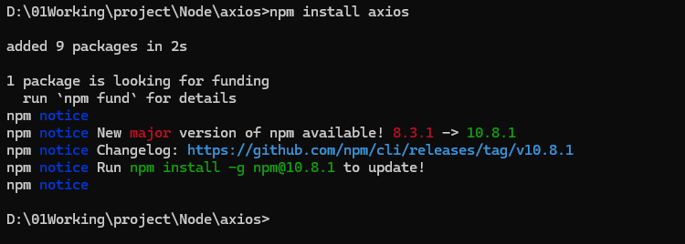
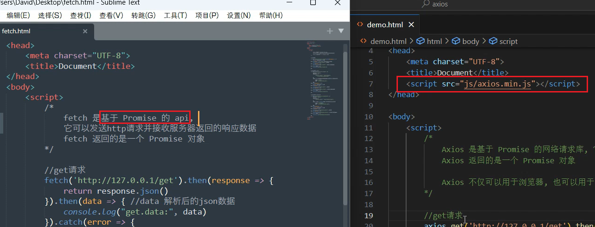

## 00 Task ES6

Date：2024/07/02 03:07:41

------


[TOC]


------


### 00 策略

* 有限游戏的思路
  * 1）搞懂游戏规则（语法、数据对象、模块）
  * 2）搞懂资源（申请、使用、回收、性能）
  * 3）搞清目标、任务、要求（项目导向）
  * 4）搞懂实现路径、计划
  * 5）警惕 + 梳理潜在问题 / 可能的坑（随时记录补充）

### 00 进度

* [ES6 课程-邓瑞编程](https://www.bilibili.com/video/BV1Bh4y1q73A/?p=1&vd_source=1e9ce768698d539dc8e4dbecfe72afaa) 
* Vue 信息收集 --> 开始 ES6 前置课程（2024/07/02）
* P01-05（2024/07/02）
* P06-19（2024/07/03）
* 完成 ES6 课程（2024/07/03）


------


### 00 备忘

* 补充概念的简要说明（收集 --> 定义 --> AI 拓展）
* 汇总 ES6 语法增量（对比已学习语言）
* 批量解决现阶段绕不过的疑问（记录 + 反馈调查）


------


### 01 什么是ECMAScript？

* ECMAScript 是定义脚本语言的规范。JavaScript 则是遵循 ECMAScript 规范实现的一种编程语言。
* [参考链接-邓瑞编程](https://www.dengruicode.com/classes_content?uuid=83ca466a73524f5694fb6eba868dc28e) 
* [ES6 兼容性表](https://compat-table.github.io/compat-table/es6) 


------


### 02 VS Code 安装及使用

* 工作目录 `project/ES6` 
* 插件 `open in browser` 


------


### 03 变量和常量

```javascript
<!DOCTYPE html>
<html lang="en">
<head>
    <meta charset="UTF-8">
    <meta name="viewport" content="width=device-width, initial-scale=1.0">
    <title>Document</title>
</head>
<body>
    <script>
        
        // 变量
        let name = "CELFS";
        console.log(name);
        console.log(typeof name);

        let balance = 100;
        console.log("余额", balance);
        console.log(typeof balance);

        // 常量
        const PI = 3.14;
        console.log("Pi is", PI);

        // 变量与常量的区别
        name = "Hilbert";
        console.log("name is", name);

        PI = 314159; // 异常，常量不可修改
        console.log("Pi is", PI);

    </script>
</body>
</html>
```


------


### 04 数据类型

* ES6 为弱类型语法，例如整数、浮点数，统称 `number` 类型

```javascript
<!DOCTYPE html>
<html lang="en">
<head>
    <meta charset="UTF-8">
    <meta name="viewport" content="width=device-width, initial-scale=1.0">
    <title>Document</title>
</head>
<body>
    <script>
        
        // 字符串类型 string
        let name = "CELFS";
        console.log(name);
        console.log(typeof name);

        let balance = 100;
        console.log("余额", balance);
        console.log(typeof balance);

        // 数值类型 number
        const PI = 3.14;
        console.log("Pi is", PI);

        // 布尔类型
        let testBool = true;
        console.log("testBool", testBool);
        console.log(typeof testBool);
        
        // 对象
        let boy = {
            name:"Peter",
            age:15,
            weight:60.5
        };
        console.log("boy", boy);
        console.log(typeof boy);

        // map
        let girl = new Map([
            ["name", "Maria"],
            ["age", 18]
        ]);
        console.log("girl", girl);
        console.log(typeof girl);

        // set
        let numSet = new Set([1, 2, 3, 1, "2"]);
        console.log("numSet", numSet);

        // array
        let arr =  new Array([1, 2, 3, 1, 3, "CELFS", true, boy, girl]); // 两种方式，控制台类型识别有一点区别
        let arr2 = [1, 2, 3, 1, 3, "CELFS", true, boy, girl];
        console.log("arr", arr);
        console.log(typeof arr);
        console.log("arr2", arr2);
        console.log(typeof arr2);

        // function
        function add(x, y) {
            console.log(x + y);
        }
        add(20, 30);

        // 类
        class Person {
            name
            age
            
            constructor(userName, userAge) {
                this.name = userName;
                this.age = userAge;
            }

            info() {
                console.log("name", this.name, "age", this.age);
            }
        };

        let person = new Person("芙芙", 518);
        let person2 = new Person("流萤", 22);
        person.info();
        person2.info();

    </script>
</body>
</html>
```


------


### 00 语法认知 + 疑问

* 分号可有可无，根据习惯使用即可；
* 为什么 `console.log()` 字符串自带末尾空格？
* 语法风格约定？例如何时添加空格、注释空行、帮助文档等
* 为何输出使用 `console`，而不是直接在 HTML 中 显示？算是一种专门化的开发环境优化？例如避免调试内容出现在主页面，并且针对控制台，有更多的技术性组件。
* ES6 是弱类型概念，例如数值类型，无论整数、浮点数，都是统称。
* 为什么 map 类型依然识别为 Object 类型？它提出的背景是什么？解决了什么问题？使用是否广泛？具体有哪些应用场景？看多层中括号的模式 ，有点像多维数组。
* 为何 map  和 set，都是传入“列表”参数？列表形式的参数有什么必要性？有何种优势？
* 若数组中存在 Object 等复合类型，在控制台显示的对应数据项，并不只有数据项，还有 `[Prototype]`，这是什么内容？用来做什么的，某种属性说明？
* 如何理解“当你理解和函数作用域、类的作用域以后，很多代码其实可以省略”？（P05，08:24）
* ES6 的垃圾回收机制是怎样的？在资源利用方面，常见有哪些坑？
* 留意到，很多打印的数据类型都是 Object，这里的 Object 可以理解为 ES6 大部分数据结构的基类？既然引入了类的概念，那么类的继承、多态、封装特性是否与常规理解保持一致？考虑到 ES6 的弱类型架构，是否会对这三种类的特性产生影响？


* 2024/07/02 04:51:17 1h4min

------


### 05 函数

* 概括
  * 匿名函数在不需要命名的情况下定义和使用，通常用作回调函数（特定事件或条件发生时被调用 的函数，通常用作异步编程）。
  * 通常，使用一个**变量接收**匿名函数返回的**结果**。
  * 匿名函数 --> 箭头函数 --> 隐式返回

```javascript
<!DOCTYPE html>
<html lang="en">
<head>
    <meta charset="UTF-8">
    <meta name="viewport" content="width=device-width, initial-scale=1.0">
    <title>Document</title>
</head>
<body>
    <script>
        
        // 定义函数（无参数）
        function getWeb() {
            let url = "www.celfs.com";
            // console.log(url);
            return url;
        }

        // 一般参数
        function add(x, y) {
            return x  + y;
        }

        // 参数默认值
        function getNum(num = 10) {
            return num;
        }

        console.log(getWeb());
        console.log(add(10, 11));
        console.log(getNum());
        console.log(getNum(11));

        // 匿名函数
        let sub = function(x, y) {
            return x - y;
        }
        console.log(sub(30, 5));

        // 箭头函数（匿名函数的轻微简化）
        let plus = (a, b) => {
            return a + b;
        }
        console.log(plus(1, 2));

        // 箭头函数的隐式返回（进一步简化）
        let plus2 = (a, b) => a + b;
        console.log(plus2(5, 6));

    </script>
</body>
</html>
```

* 疑问
  * 为什么是 `let` 定义的变量？这个语法名称是否有什么渊源？设计的时候只是考虑其弱类型语法，从而统一定义变量的关键字？
  * 又比如 `shift` 和 `unshift`，总觉得 ES6 语法的命名思路不太一样，简言之，想要找到关键字命名的原则。


------


### 07 数组

* 数组是有序的（有方向的），其有序性可体现在向头、尾插入元素时的不同 API，并且遍历操作也需要基于有序性。

```javascript
<!DOCTYPE html>
<html lang="en">
<head>
    <meta charset="UTF-8">
    <meta name="viewport" content="width=device-width, initial-scale=1.0">
    <title>Document</title>
</head>
<body>
    <script>

        // 定义数组
        let arr = [3, 5];
        console.log("arr", arr);

        // push 向数组末尾添加一个或多个元素，返回修改后的数组长度
        let arrLength = arr.push(11, 13);
        console.log("push", arr);
        console.log("arrLength", arrLength);

        // unshift 向数组开头添加一个或多个元素，返回修改后的数组长度
        arrLength = arr.unshift(1, 2);
        console.log("unshift", arr);
        console.log("arrLength", arrLength);

        // shift 删除数组第一个元素，返回被删除元素
        let delElement = arr.shift();
        console.log("shift", arr);
        console.log("delElement", delElement);

        // pop 删除数组最后一个元素，返回被删除元素
        delElement = arr.pop();
        console.log("pop", arr);
        console.log("delElement", delElement);

        // 删除元素，返回包含被删除元素的数组 splice(start_index, delete_numbers)
        let delArr = arr.splice(2, 1);
        console.log("splice", arr);
        console.log("delArr", delArr);

        // 翻转数组
        arr.reverse();
        console.log("arr", arr);

        // 数组中的元素按首字母排序（默认以字节序）
        let arr2 = ["Shannon", "David", "Ada", "Turing"];
        arr2.sort();
        console.log("arr2", arr2);

        // 根据比较函数排序，根据 (a - b) 运算结果的正负值，例如 17 - 11 > 0，那么 17 在 11 后面
        let arr3 = [1, 17, 11, 7, 5, 13, 14, 12];
        arr3.sort((a, b) => (a - b));
        console.log("arr3", arr3);

        // 筛选满足条件的元素，返回一个新的数组
        let arr4 = [17, 11, 7, 13, 14, 12];
        let newArr = arr4.filter((value) => {
            return value > 12;
        });
        console.log("arr4", arr4);
        console.log("newArr", newArr);

        // 遍历数组，for...of
        let arr6 = ["CELFS", "celfs.github.io/Notes/#/", 100]
        for (let value of arr6) {
            console.log("for...of", value);
        }

        // 遍历数组，forEach
        arr6.forEach((value, index) => {
            console.log("forEach", value, "index", index);
        });
        
    </script>
</body>
</html>
```

* 疑问 / 感悟
  * 遍历操作真的需要基于有序性？例如 C++ 中的迭代器，map 是无序的，但遍历时，似乎遵循一定的顺序？
  * 数组的在控制台的输出提示符，对于一维数组和多维数组是不一样的，多维数组不会直接行输出其元素内容，而会被折叠。这个显示问题，可以通过刷新页面额外加载。
  * 注意，数组的有序，并不是指元素值的有序排列，而是指元素的增长和减少，是有方向的，可以简单理解为每个元素的索引值是有序的。


* 2024/07/03 02:43:31 整理笔记结构 + P07，1h5min

------


### 08 Set集合、扩展运算符

* 概括
  * 操作与数组一致，涉及集合与数组的双向转换，集合的去重用法。
  * 介绍了扩展运算符对可迭代对象的展开功能，并且可借助其调用形式（数组形式），将集合转换为数组。

```javascript
<!DOCTYPE html>
<html lang="en">
<head>
    <meta charset="UTF-8">
    <meta name="viewport" content="width=device-width, initial-scale=1.0">
    <title>Document</title>
</head>
<body>
    <script>

        // Set 集合
        let fruits = new Set(["banana", "apple", "strawberry", "durian"]);
        console.log("fruits", fruits);

        // add
        fruits.add("mango");
        console.log("fruits", fruits);

        // delete
        fruits.delete("banana");
        console.log("fruits", fruits);

        // has
        console.log(fruits.has("banana"));
        console.log(fruits.has("strawberry"));

        // size
        console.log(fruits.size);

        // 1) set --> array
        let arr = Array.from(fruits);
        console.log(arr);

        // 2) set --> array
        let arr2 = [...fruits];
        console.log(arr2);

        // 扩展运算符，用于展开可迭代对象
        let web = "celfs.github.io/Notes/#/";
        let webExtend = [...web];
        console.log(webExtend);

        // 遍历集合，for...of
        for (let item of fruits) {
            console.log("for...of", item);
        }

        // 遍历集合，forEach（区别为 index 非数值，而是元素本身，可理解为没有索引）
        fruits.forEach((value, index) => {
            console.log("value", value, "index", index);
        });

        // 去重 array --> set
        let arr3 = [1, 1, 3, 3, 2, 7, 7];
        let set1 = new Set(arr3);
        console.log(set1);
        
		// clear
		fruits.clear();
		console.log(fruits.size);
    </script>
</body>
</html>
```

* 疑问
  * 为什么不直接禁用 `set` 遍历 `forEach` 的 `index` 参数，而直接使用元素值本身来占位无效的索引值？


* 2024/07/03 03:05:05 21min

------


### 09 Map集合

* 概括
  * 操作与集合类似，区别引入了 “解构” 的概念。
* 注意
  * `map` 的 `forEach` 参数顺序与解构遍历相反（即需要与函数形参顺序对应）

```javascript
<!DOCTYPE html>
<html lang="en">
<head>
    <meta charset="UTF-8">
    <meta name="viewport" content="width=device-width, initial-scale=1.0">
    <title>Document</title>
</head>
<body>
    <script>

        // map 集合
        let learner = new Map([
            ["name", "CELFS"],
            ["gender", "male"],
            ["web", "celfs.github.io/Notes/#/"]
        ]);
        console.log(learner);

        // set 设置属性
        learner.set("times", 10);
        // set 修改属性
        learner.set("web", "https://celfs.github.io/Notes/#/");
        console.log(learner);

        // delete
        learner.delete("gender");
        console.log(learner);
        
        // has
        console.log(learner.has("web"));

        // size
        console.log(learner.size);

        // 1) map --> array
        let arr = Array.from(learner);
        console.log("arr", arr);

        // 2) map --> array
        let arr2 = [...learner];
        console.log("arr2", arr2);

        // 遍历map，for...of
        for (let value of learner) {
            console.log("value", value);
        }

        // 解构遍历map，for...of
        for (let [key, value] of learner) {
            console.log("key", key, "value", value);
        }

        // 遍历map，forEach
        learner.forEach((value, key) => {
            console.log("key", key, "value", value);
        });

        // clear
        learner.clear();
        console.log(learner.size);

    </script>
</body>
</html>
```

* 为什么从设计上，不针对 `map` 的使用习惯，修改 `forEach` 的形参顺序？
  * 不同于对象的 `forEach`，不能使用数组接收键值对，即不可保持习惯顺序；
  * 可能还需深入学习，才能找到对齐的方法，当然，也可能不存在；


* 2024/07/03 03:24:16 20min

------


### 10 对象

* 概括
  * 对象操作有些特殊，不乏繁琐的操作。
* 遍历区别
  * `for...of` 主要用于遍历**可迭代对象**（array、set、string 等）
  * `for...in` 主要用于遍历**对象的**可枚举属性
  * `forEach` 需使用 `entries` 将键值对转换为数组，方可解构遍历

```javascript
<!DOCTYPE html>
<html lang="en">
<head>
    <meta charset="UTF-8">
    <meta name="viewport" content="width=device-width, initial-scale=1.0">
    <title>Document</title>
</head>
<body>
    <script>

        // object
        let learner = {
            name:"CELFS",
            gender:"male",
            web:"celfs.github.io/Notes/#/"
        };
        console.log(learner);

        // 添加属性
        learner.height = 180;
        console.log(learner);
        // 修改属性
        learner.web = "https://celfs.github.io/Notes/#/";
        console.log(learner);

        // 删除
        delete learner.gender;
        console.log(learner);

        // has
        let has = "gender" in learner;
        console.log(has);

        // length
        console.log(Object.keys(learner).length);

        // 遍历对象，for...in 遍历对象的可枚举属性
        for (let key in learner) {
            console.log("for...in key", key, "value", learner[key]);
        }

        // entries 将对象的键值对转换为数组
        console.log(Object.entries(learner));

        // 遍历对象，forEach 基于转换后的数组，才能使用一致的顺序来解构键值对
        Object.entries(learner).forEach(([key, value]) => {
            console.log("forEach key", key, "value", value);
        });

        // clear
        learner = {};
        console.log(learner);
        
    </script>
</body>
</html>
```

* 经验
  * 现今不需要纠结什么是可迭代对象、什么是可枚举属性，因为在后续的学习中，自然而然会知道（还好这些概念在 C++ 时基本搞懂了）。前期灌输过多的基础概念，对学习编程没有太多好处。

* 疑问 / 感悟
  * 为什么对象的属性数量，需要通过获取其属性名称的数组 `keys()`，从而计算数组长度，如此间接而复杂地计算属性数量？为什么不从设计的层面考虑添加一个类似 `size` 的属性？
  * 为什么对象的 `has` 不做简化的语法封装？是因为无论 `size` 还是 `has` 对于对象类型来说，都不常用？
  * 为什么这里的对象是以键值对形式表示属性的？与过往了解的编程语言有所出入，这里对象更像是 Python 的字典，但其属性访问与一般意义上的对象（或 C++ 的结构体），是一致的，即使用点运算符。
  * 了解对象的一系列调用方式，有助于理解 API 在 ES6 中的调用形式。
  * 对象的 `forEach` 遍历，基于 `entries()` 转换后的数组，才能使用一致的顺序来解构键值对。


* 2024/07/03 04:12:24 39min

------


### 11 私有属性、存取器

* 类的私有属性
  * 类内直接访问，外部无法直接访问与修改
  * 若外部希望访问私有属性，则需要使用 “凭证”，例如去旅游景点存放个人物品，需要使用号码牌获取物品，这个号码牌就是凭证。

```javascript
<!DOCTYPE html>
<html lang="en">
<head>
    <meta charset="UTF-8">
    <meta name="viewport" content="width=device-width, initial-scale=1.0">
    <title>Document</title>
</head>
<body>
    <script>

        class Person {
            name
            #web

            constructor(name, web) {
                this.name = name;
                this.#web = web;
            }

            // 获取私有属性（存取器 getter），外部访问类的私有属性的 “凭证”
            get web() {
                return this.#web;
            }

            // 设置私有属性（存取器 setter）
            set web(value) {
                this.#web = value;
            }

            info() {
                // 字符串拼接方式
                // return "姓名：" + this.name + " 个人网站：" + this.web;
                // ES6 模板字符串
                return `姓名：${this.name} 个人网站：${this.#web}`;
            }
        };

        let person = new Person("CELFS", "celfs.github.io/Notes/#/");
        console.log(person.web);

        person.web = "https://celfs.github.io/Notes/#/";
        console.log(person.web);

        console.log(person.info());

    </script>
</body>
</html>
```

* 疑问
  * 模板字符串，对于私有属性，为什么不写 `#web` 而直接使用 `web` 也不会报错？是语言对语法的兼容优化，还是因为这种操作也允许？是否存在未定义的行为或者其他问题？


* 2024/07/03 13:23:11 25min

------


### 12 继承 extends

* 类的继承

```javascript
<!DOCTYPE html>
<html lang="en">
<head>
    <meta charset="UTF-8">
    <meta name="viewport" content="width=device-width, initial-scale=1.0">
    <title>Document</title>
</head>
<body>
    <script>

        // 父类
        class Person {
            name
            gender

            constructor(name, gender) {
                this.name = name;
                this.gender = gender;
            }

            sleep() {
                return `${this.name} 休息中...`;
            }
        };

        // 子类，继承自父类 Person
        class Celfs extends Person {
            web

            constructor(name, gender, web) {
                super(name, gender); // 调用父类构造函数，使得父子关联

                this.web = web;
            }

            eat() {
                return `${this.name} 吃零食`;
            }
        };

        // 初始化
        let celfs = new Celfs("CELFS", "male", "celfs.github.io/Notes/#/");
        
        // 调用子类
        console.log(celfs.web);
        console.log(celfs.eat());

        // 调用父类属性、父类方法
        console.log(celfs.gender);
        console.log(celfs.sleep());

    </script>
</body>
</html>
```


------


### 13 解构

* 概括
  * 解构，可以从数组或对象中提前值并赋给变量。
  * 数组解构的处理形式丰富，主要包括一般对齐参数的解构、占位符解构、扩展运算符解构（本质是数组特性）、部分解构、解构的默认值，并且，基于解构的特性，可以实现 `swap` 操作（与 Python 该功能一致，或许 Python 受其启发？）。
  * 对象解构类似 “字典” 的访问，需注意属性重命名。

```javascript
<!DOCTYPE html>
<html lang="en">
<head>
    <meta charset="UTF-8">
    <meta name="viewport" content="width=device-width, initial-scale=1.0">
    <title>Document</title>
</head>
<body>
    <script>

        // 1) 数组解构
        let [x, y] = [1, 2];
        console.log("x:", x, "y:", y);

        // ",,"占位符解构，",,"表示前两个数值不具有结构，仅解析第三个数值
        let [, , c] = [10, 20, 30];
        console.log("c:", c);

        // 扩展运算符实现解构
        let [A, ...B] = [1, 3, 7, 13, 11];
        console.log("A:", A, "B:", B);

        // 部分解构（未赋值以 undefined 占位）
        let [x2, y2] = [100];
        console.log("x2:", x2, "y2:", y2);

        // 默认值
        let [x22, y22 = 200] = [100];
        console.log("x22:", x22, "y22:", y22);

        // 两数交换
        let x3 = 10;
        let y3 = 20; // 不加分号会报错，可能解析成 20 [x3, y3]
        [x3, y3] = [y3, x3];
        console.log("x3:", x3, "y3:", y3);

        // 2) 对象解构
        let person = {
            name:"CELFS",
            gender:"male",
            web:"celfs.github.io/Notes/#/"
        };

        let {name} = person;
        console.log("name:", name);

        let {name:userName, gender, web} = person; // 解构属性重命名
        console.log("userName:", userName, "gender:", gender, "web:", web);
        
    </script>
</body>
</html>
```

* 疑问

  * 观察发现，ES6 语法**不能完全舍弃分号**，因此，不如按照习惯，都加上分号。例如：

    ```javascript
    let x3 = 10;
    let y3 = 20; // 不加分号会报错
    [x3, y3] = [y3, x3];
    ```

    * 是否意味着可能将 `20 [x3, y3]` 解析成一个整体？尝试后错误如下：

    ```javascript
    demo13.html:34 Uncaught ReferenceError: Cannot access 'y3' before initialization
        at demo13.html:34:14
    ```


------


### 14 Promise

* 概括
  * Promise 对象，表示承诺在未来的某个时刻可能完成并返回结果。
  * 一般用于需要时间处理结果的操作，例如用户登录、读取文件等。
  * 需要时间操作，意味着并非同步执行，因此属于**异步编程**的范畴。
* 例子
  * 张三向李四借了一本书，承诺两个月后归还。
  * 如果还没到两个月后，那么保持初始状态 `pending`（待处理）；
  * 如果张三在约定时间内还书，状态更新为 `fulfilled`（已履行）；
  * 如果到期了，张三仍未归还书籍，状态更新为 `rejected`（被驳回）。

```javascript
<!DOCTYPE html>
<html lang="en">
<head>
    <meta charset="UTF-8">
    <meta name="viewport" content="width=device-width, initial-scale=1.0">
    <title>Document</title>
</head>
<body>
    <script>

        // Promise 逐步构建写法
        // let promise = new Promise((resolve, reject) => {
        //     // resolve("还钱了"); // 对应 then 方法
        //     reject("没有还钱"); // 对应 catch 方法
        // });  
        // console.log("promise:", promise);

        // promise.then(result => {
        //     console.log("result:", result);
        // }).catch(error => {
        //     console.log("error:", error);
        // }).finally(() => {
        //     console.log("异步执行结束");
        // });

        // Promise 合并写法
        let promise = new Promise((resolve, reject) => {
            // resolve("还钱了"); // 对应 then 方法
            reject("没有还钱"); // 对应 catch 方法
        }).then(result => {
            console.log("result:", result);
        }).catch(error => {
            console.log("error:", error);
        }).finally(() => {
            console.log("异步执行结束");
        });

    </script>
</body>
</html>
```


------


### 15 Fetch

* 概括
  * `fetch` 是基于 `Promise` 的网络请求库（基于浏览器的原生 API），可以发送 http 请求，并接收服务器返回的响应数据。

```txt
http://127.0.0.1:8008/get
```

```javascript
<!DOCTYPE html>
<html lang="en">
<head>
    <meta charset="UTF-8">
    <meta name="viewport" content="width=device-width, initial-scale=1.0">
    <title>Document</title>
</head>
<body>
    <script>

        // get请求
        fetch('http://127.0.0.1:8008/get').then(response => {
            // 返回解析后的 json 数据会传递给下一个 then() 方法中的回调函数作为参数，该参数为 data
            return response.json(); // 用于将响应数据解析为 json 格式的数据
        }).then(data => { // data 是解析后的 json 数据内容
            console.log("get.data:", data);
        }).catch(error => {
            console.log("get.error:", error.message);
        }).finally(() => {
            console.log("get.finally");
        });

        // post请求（表单提交，不常用；主流 postJson）
        fetch('http://127.0.0.1:8008/post', {
            method: 'POST',
            headers: {
                'Content-Type': 'application/x-www-form-urlencoded',
            },
            body: new URLSearchParams({ // 编码为 url 查询字符串
                name: 'CELFS',
                web: 'celfs.github.io/Notes/#/',
            }),
        }).then(response => {
            return response.json();
        }).then(data => {
            console.log("post.data:", data);
        }).catch(error => {
            console.log("post.error:", error.message);
        }).finally(() => {
            console.log("post.finally");
        });

        // post请求，postJson
        fetch('http://127.0.0.1:8008/postJson', {
            method: 'POST',
            headers: {
                'Content-Type': 'application/json',
            },
            body: JSON.stringify({ // 对象转换为 json 字符串
                name: 'CELFS',
                web: 'celfs.github.io/Notes/#/',
            }),
        }).then(response => {
            return response.json();
        }).then(data => {
            console.log("postJson.data:", data);
        }).catch(error => {
            console.log("postJson.error:", error.message);
        }).finally(() => {
            console.log("postJson.finally");
        });

    </script>
</body>
</html>
```

* 经验

  * Go 编写接口程序，便于本地调试，而不需要另外找后端接口。
  * 很有必要后面找时间再研究接口程序的搭建。
  * 代码基于 Golang，若使用 Java 或 Php，在调试过程中，如果后端收不到数据，则需添加 `headers`，否则可以删掉。

* 疑问

  * 考虑到没有字符概念，那么 ES6 对字符串是否区分单双引号？有没有不同情景下的规范约定？是否根据处理的数据格式来选择，例如使用 json 格式，则请求报文使用单引号？
  * 如何理解下一个 `then()` 的回调函数？只是在其源码级别的内容？还是说类似《Vue.js 设计与实现》当中，第一章示例的 `Render()` 函数的递归解析？
  * ~~如何理解 `error.message` 属性？为何不直接使用 `error` 作为属性？~~ 显示内容不同，具体如下，一目了然。

  ```javascript
  // 使用 error
  get.error: ReferenceError: data1 is not defined
      at demo15.html:16:38
  
  // 使用 error.message
  get.error: data1 is not defined
  ```

  * 为什么在代码层面，编写顺序是先 `get` 后 `post` 的，但实际运行时，`get` 会晚于 `post` 返回？不过也正常，`fetch` 是基于 `Promise` 这种具有异步编程特性的对象，并不强调先来后到。


* 2024/07/03 15:24:53 P12-15 1h40min

------


### 16 安装和配置Node.js

* 概括
  * Node.js 是 JavaScript 的运行环境（开源，用于服务端运行）
  * npm (Node Package Manager) 为 Node.js 的包管理器，可安装各种库、框架、工具

```bash
# 查询 Node.js 版本
node -v

# 查询 npm 版本
npm -v

# 查询 npm 镜像源
npm get registry

# 设置淘宝镜像源
npm config set registry https://registry.npmmirror.com/

# 设置华为云镜像源
npm config set registry https://repo.huaweicloud.com/repository/npm/
```

* 安装 `axios` 网络请求库
  * 工作目录 `project/Node/axios` --> `cmd` --> 安装
  * 查看模块 `node_modules` （利用 CDN 路径快速定位文件）

```bash
npm install axios
```



* 经验

  * 先找到它的 CDN，通过 CDN 路径可快速找到它所对应的文件。

  ```javascript
  // axios 使用 unpkg CDN
  <script src="https://unpkg.com/axios/dist/axios.min.js"</script>
  ```


------


### 17 Axios

* 概括
  * Axios 是基于 Promise 的网络请求库，可发送 http 请求并接收服务器返回的响应数据。
* 区别
  * Axios 可用于浏览器、Node.js（引入了第三方文件）
  * Fetch 主要用于浏览器（基于浏览器的原生 API）
  * 相较于 Fetch，Axios 在代码层面做了许多简化，提高了代码可读性、简化了代码逻辑，由此进一步降低了开发的负担。



```javascript
<!DOCTYPE html>
<html lang="en">
<head>
    <meta charset="UTF-8">
    <meta name="viewport" content="width=device-width, initial-scale=1.0">
    <title>Document</title>
    <script src="../js/axios.min.js"></script>
</head>
<body>
    <script>

        // Axios
        // get请求
        axios.get('http://127.0.0.1:8008/get').then(response => {
            console.log("get.data:", response.data); // 简化代码，省去了数据解析与转换的过程
        }).catch(error => {
            console.log("get.error:", error);
        }).finally(() => {
            console.log("get.finally");
        });

        // post请求 post
        let data = { // 参数
            name: 'CELFS',
            web: 'celfs.github.io/Notes/#/',
        };

        axios.post('http://127.0.0.1:8008/post', data, {
            headers: {
                'Content-Type': 'application/x-www-form-urlencoded',
            }
        }).then(response => {
            console.log("post.data:", response.data);
        }).catch(error => {
            console.log("post.error:", error);
        }).finally(() => {
            console.log("post.finally");
        });

        // post请求，postJson [axios 的默认请求头是 application/json]
        fetch('http://127.0.0.1:8008/postJson', data).then(response => {
            console.log("postJson.data:", response.data); // 进一步省略了请求头
        }).catch(error => {
            console.log("postJson.error:", error);
        }).finally(() => {
            console.log("postJson.finally");
        });

    </script>
</body>
</html>
```

* 经验
  * 同类库的源码对比，原生库 VS 第三方库，可以基于前面的探索，分析第三方库的优势和优化，新的信息和知识，只需要少部分的增量即可进行迭代，不失为一种学习的好办法。
    * 例如，`fetch` 库需要先将数据解析为 json，而 `axios` 只需直接调用，可以理解为已经将解析的过程封装起来了，这个思想在《Vue.js 设计与实现》的第一章，关于命令式与声明式编程框架以及不同编译模式的优劣、封装互相转换所做的尝试一致，目的是降低代码使用的心智负担。


------


### 18 模块化开发

* 概括
  * 背景：
    * 假设引入两个 `js` 文件，其中有同名函数 `get_data()`，则后引入文件将覆盖前面的文件 ；
    * 使用模块化，则可以设置导入的别名，避免模块冲突。
  * 模块化开发：
    * 将复杂代码拆分为独立模块，每个模块负责完成特定功能。
    * 不同模块之间，使用 `export` 将代码导出为模块，使用 `import` 导入模块。
* 代码流程
  * 定义 `js` 文件 --> 导出变量或函数
  * 修改 `script` 属性 `type="module"` 
  * 导入 `js` 文件 --> 导入指定变量或函数 + 文件路径
  * 安装插件 Live Server
  * 修改别名 `title as WebTitle` --> 保存 --> 页面自动加载 --> 报错（未定义） --> 将调用位置修改为别名 --> 执行成功
  * 1）将变量和函数，作为整体导出 `default` 
    * `export default {p1, p2, p3};` 
    * `import obj from './path'` 
  * 2）在不使用 `default` 下，使用点操作
    * `import * as obj from './path'` 
    * 解释：通配 `*` 表示导出的所有变量和函数，都赋值给 `obj` 对象

```javascript
let title = "CELFS's Code";
let web = "celfs.github.io/Notes/#/";

let getWeb = () => {
    return "https://celfs.github.io/Notes/#/";
}

// let getWeb = () => "https://celfs.github.io/Notes/#/"; // 匿名函数隐式返回

export {title, web, getWeb}; // 将多个变量或函数分别导出
// export default {title, web, getWeb}; // 将多个变量或函数，或一个对象，作为整体导出
```

```javascript
<!DOCTYPE html>
<html lang="en">
<head>
    <meta charset="UTF-8">
    <meta name="viewport" content="width=device-width, initial-scale=1.0">
    <title>Document</title>
</head>
<body>
    <script type="module">
        
        // import {title as WebTitle, web, getWeb} from '../js/demo18.js';
        import obj from '../js/demo18.js';

        console.log("title", obj.title);
        console.log("web", obj.web);
        console.log(obj.getWeb());

    </script>
</body>
</html>
```

* 策略阻挡
  * 原因：访问了本地目录，只能访问本地服务器地址
  * 解决：插件 Live Server

```javascript
// 访问本地目录，策略阻挡，并非代码层面的问题
Access to script at 'file:///D:/01Working/project/ES6/js/demo18.js' from origin 'null' has been blocked by CORS policy: Cross origin requests are only supported for protocol schemes: http, data, isolated-app, chrome-extension, chrome, https, chrome-untrusted.
demo18.js:1 

Failed to load resource: net::ERR_FAILED


// 添加插件解决，仅剩图标问题，刷新页面即消失
Live reload enabled.
demo18.html:12 title CELFS's Code
demo18.html:13 web celfs.github.io/Notes/#/
demo18.html:14 https://celfs.github.io/Notes/#/
:5500/favicon.ico:1 
        
Failed to load resource: the server responded with a status of 404 (Not Found)
```


* 2024/07/03 16:45:06 P16-18，1h19min

------


### 19 async、await 使用同步的方式编写异步代码

* 概括
  * 同步
    * 代码依序逐行执行，后续代码必须等待当前执行的代码完成才可执行，若遇到耗时操作（如网络请求等），主线程会被阻塞，直到该操作完成。
  * 异步
    * 当遇到耗时操作，主线程不会被阻塞，而会继续执行后续代码，不必等待。
  * 例子
    * 同步：单车道路段事故导致交通阻塞，只能等待事故车被处理，后续车辆方可继续行驶。
    * 异步：多车道的高速公路，事故导致部分车道交通阻塞，其他车道可继续行驶。
* 信息补充
  * `async` 
    * 当一个函数被标记为 `async` 后，该函数会返回一个 `Promise` 对象
  * `await` 
    * 只能在 `async` 函数内部使用；
    * 加上 `await` 关键字后，当执行到这一行时：
      * **暂停函数的剩余部分**；
      * **等待网络请求完成**；
    * 继续执行 --> 获取请求返回的数据。
  * **回调地狱**：指过度使用嵌套的回调函数，导致代码难以阅读和维护。

```javascript
<!DOCTYPE html>
<html lang="en">
<head>
    <meta charset="UTF-8">
    <meta name="viewport" content="width=device-width, initial-scale=1.0">
    <title>Document</title>
    <script src="../js/axios.min.js"></script>
</head>
<body>
    <script>

        // get请求
        axios.get('http://127.0.0.1:8008/get').then(response => {
            console.log("get.data:", response.data);
        }).catch(error => {
            console.log("get.error:", error);
        }).finally(() => {
            console.log("get.finally");
        });

        // async/await 同步方式编写异步代码，避免回调地狱（过度嵌套的回调函数，难以阅读和维护）
        // 处理多个异步操作时，可使代码简洁易读
        const getData = async () => {
            try {
                const response = await axios.get('http://127.0.0.1:8008/get');
                console.log("async.get.data:", response.data);
            } catch {
                console.log("async.get.error:", error);
            } finally {
                console.log("async.get.finally");
            }
        };

		getData();

    </script>
</body>
</html>
```

```javascript
<!DOCTYPE html>
<html lang="en">
<head>
    <meta charset="UTF-8">
    <meta name="viewport" content="width=device-width, initial-scale=1.0">
    <title>Document</title>
    <script src="../js/axios.min.js"></script>
</head>
<body>
    <script>

        // 1) 回调地狱
        // get请求
        axios.get('http://127.0.0.1:8008/get').then(response => {
            console.log("get.data:", response.data);
            if (response.data.data.web == "celfs.github.io/Notes/#/") {

                // get请求2
                return axio.get('http://127.0.0.1:8008/get').then(response2 => {
                    console.log("get2.data:", response2.data);
                    if (response2.data.data.name == "CELFS") {

                        // get请求3
                        return axio.get('http://127.0.0.1:8008/get').then(response3 => {
                            console.log("get3.data:", response3.data);
                        });
                    }
                });
            }
        }).catch(error => {
            console.log("get.error:", error);
        }).finally(() => {
            console.log("get.finally");
        });

		// 2) 避免回调地狱
        // async/await
        const getData = async () => {
            try {
                // get请求
                const response = await axios.get('http://127.0.0.1:8008/get');
                console.log("async.get.data:", response.data);
                if (response.data.data.web == "dengruicode.com") {

                    // get请求2
                    const response2 = await axios.get('http://127.0.0.1:8008/article/get/id/1');
                    console.log("async.get2.data:", response2.data);
                    if (response.data.data.web == "celfs.github.io/Notes/#/") {

                        // get请求3
                        const response3 = await axios.get('http://127.0.0.1:8008/article/get/search/title/入门');
                        console.log("async.get3.data:", response3.data);
                    }
                }
            } catch {
                console.log("async.get.error:", error);
            } finally {
                console.log("async.get.finally");
            }
        };

        getData();
        
    </script>
</body>
</html>
```

* 疑问
  * 本节讲得比较浅，需要后面补充学习。
  * 为什么是同步的方式编写的异步代码？其实是利用 `Promise` 对象的特性，同步代码用以将函数标记为以 `Promise` 对象返回，那么 `Promise` 对象可根据分支策略，决定当前调用的程序状态。
  * 在上述代码中，仅有一次异步请求。那么，如何优化代码，从而产生了若干次的 `get` 异步情况请求？需要考虑循环体的设计？（使用 if 层级调用，见代码2）


* 2024/07/03 17:41:50 47min

------


