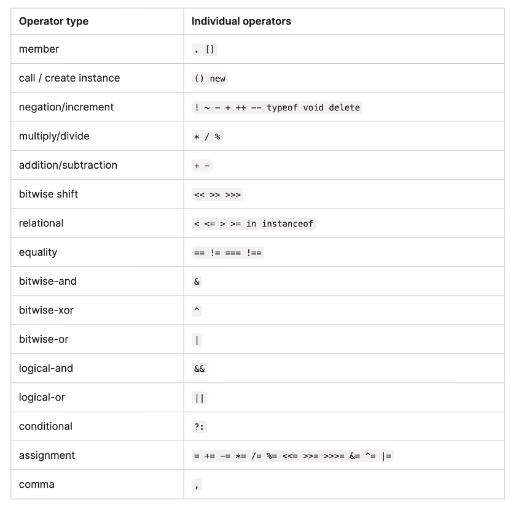
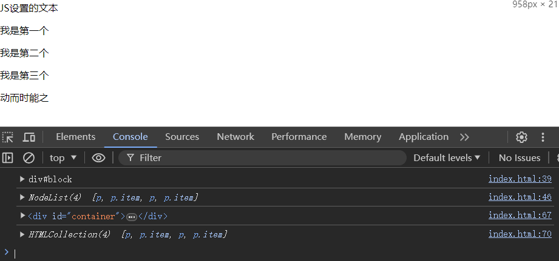
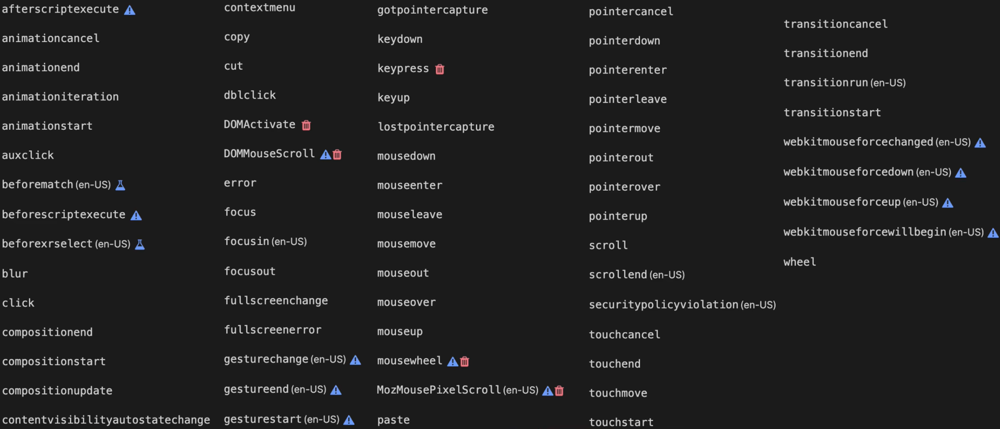
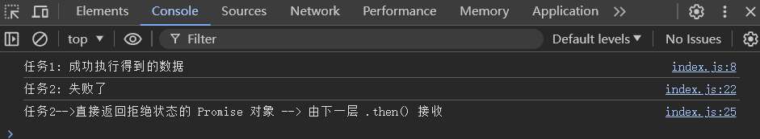
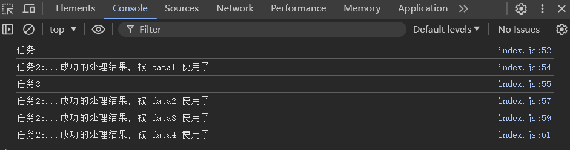
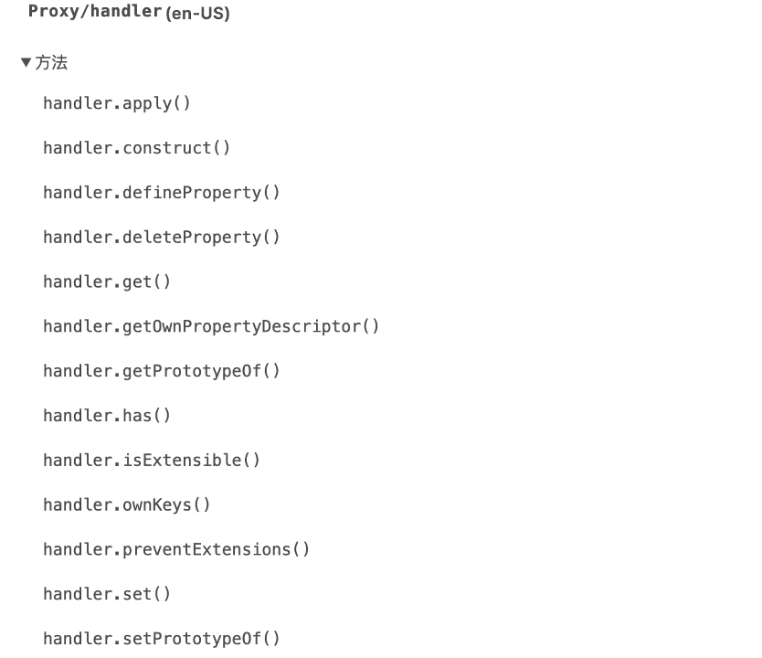
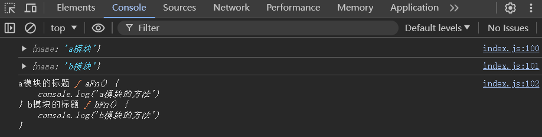
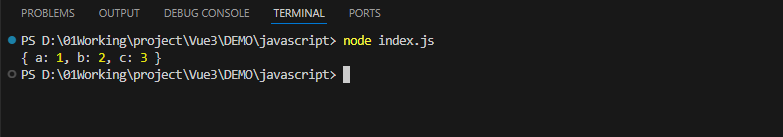

## 00 Task JavaScript + DOM + ES6

Date：2024/07/09 17:11:01

------


[TOC]


------


### 00 进度

* [B站-吴悠讲编程-视频课](https://www.bilibili.com/video/BV1Z84y1K7jG/?spm_id_from=333.999.0.0&vd_source=1e9ce768698d539dc8e4dbecfe72afaa) 
* 开始课程（2024/07/09）--> 完成课程（2024/07/10）
* 下一步
  * ~~1）项目教程文章（登录权限模块）~~ 
  * ~~2）同步 JavaScript~~ 
  * 3）CSS
  * 4）Vue CLI
  * 5）Rollup.js
  * 6）mock / easy-mock
  * 7）TypeScript
  * 8）React 18
  * 9）Google V8


------


### 01 核心语法

* [MDN 文档](https://developer.mozilla.org/en-US/docs/Web/JavaScript) 

#### 1.1 JS 引入方式

* 1）标签式语法（通常用于当前页面强相关的代码）
* 2）外链式语法（常用）

```html
<!DOCTYPE html>
<html lang="en">
<head>
    <meta charset="UTF-8">
    <meta http-equiv="X-UA-Compatible" content="ie=edge">
    </meta>
    <meta name="viewport" content="width=device-width, initial-scale=1.0">
    <title>Document</title>
    <style>
        .change {
            width: 100px;
            line-height: 100px;
            background-color: tomato;
            color: #fff;
            text-align: center;
            transition: all 1s;
        }
    </style>
</head>
<body>
    <div id="box">默认文本</div>
    <script>
        // box.onclick = function() {
        //     this.innerText = '新的内容'
        //     this.className = 'change'
        // }
    </script>
    <script src="index.js"></script>
</body>
</html>
```

```javascript
// index.js
box.onclick = function() {
    this.innerText = '新的内容'
    this.className = 'change'
}
```

* 运行效果（点击交互）


#### 1.2 变量

```javascript
// 1）变量
var num = 10        // var 变量类型，可变类型
let num2 = 20       // let 变量类型，可变类型（ES6）
const num3 = 30     // const 变量类型，不可变类型（ES6）
```

#### 1.3 数据类型

```javascript
// 2）数据类型
var myNum = 10       // number 数值类型
var myStr = '文本'
var myName = "CELFS" // string 字符串类型
var myBool = true    // boolean 布尔类型
var myNull = null    // null 空类型，用于清空变量内容，表示空
var myUn             // undefined 未定义类型，容器的默认值
console.log(myNum)
console.log(myUn)
```

#### 1.4 运算符

```javascript
// 3）运算符
var sum = 1 - 2 * 3 % 4 / 5
console.log(sum)

var resultStr = '你好' + ' ' + 'JavaScript'
console.log(resultStr)

var isTrue = 2 >= 21
console.log(isTrue)
```

* 运算符优先级（由高到低）



#### 1.5 语句

```javascript
// 4）语句
if (true) {                   // 判断语句
    console.log('执行')
}

if (false) {                  // 判断语句块
    console.log('不执行')
} else if (true) {
    console.log('执行')
} else {
    console.log('不执行')
}

for (var i = 0; i < 10; i++) { // 循环语句
    console.log(i)
}

var sum = 0
for (var i = 1; i <= 100; i++) {
    if (i % 2 == 0) {
        sum += i
    }
}
console.log(sum)
```

#### 1.6 函数

```javascript
// 5）函数
function getSum(start, end) {  // 通过参数，可定制化需求
    console.log('开始了')
    var sum = 0
    for (var i = start; i <= end; i++) {
        sum += i
    }
    return sum                  // 返回值，用于函数作用域外部使用
    console.log('结束了')
}

var result1 = getSum(1, 100)
console.log(result1)

var result2 = getSum(200, 300)
console.log(result2)

function getSumWidthConditon(start, end, fn) {
    var sum = 0
    for (var i = start; i <= end; i++) {
        if (fn(i)) {
            sum += i
        }
    }
    return sum
}

var result = getSumWidthConditon(1, 100, function (n) {
    if (n % 2 === 0) {
        return true
    }
    return false
})

console.log(result)
```

#### 1.7 数组

* [MDN 文档-Array](https://developer.mozilla.org/en-US/docs/Web/JavaScript/Reference/Global_Objects/Array#description)

```javascript
// 6）数组（有序）
var myArr = [10, 20, 30, 40, 50]
console.log(myArr.length)
console.log(myArr[2])
console.log(myArr)

myArr.push(100)     // 尾部添加元素
myArr.unshift(200)  // 头部添加元素
console.log(myArr)

var sum = 0
for (var i = 0; i < myArr.length; i++) {
    sum += myArr[i]
    console.log(i, myArr[i])
}
console.log(sum)

myArr.forEach(function (item, index) {
    console.log(index, item)
})
```

#### 1.8 对象

```javascript
// 7）对象（无序）
var myObj = {
    name: '张三',
    age: 18,
    sex: '男'
}

console.log(myObj.name)
console.log(myObj['name'])

for (var k in myObj) {
    console.log(k, myObj[k])
}
```


* 2024/07/09 18:11:43 1hmin

------


### 02 DOM & Timer

* 基于浏览器提供的功能，实现相关网页效果。
* DOM（Document Object Model）
  * DOM 是一种标准的表示和操作 HTML 和 XML 文档的方式。
  * 它将文档解析成树状结构，其中每个节点都是文档中的一个组成部分，如元素、属性或文本。
  * 通过 DOM，开发者可以使用 JavaScript 来读取、修改或创建文档的内容和结构。DOM 提供了一系列的接口和方法，允许对文档进行查询、插入、删除、替换以及修改样式和属性。
* BOM（Browser Object Model）
  * BOM 并不是一个正式的标准，而是各种浏览器厂商为了使 JavaScript 能够与浏览器交互而实现的一组非标准API。
  * BOM 定义了浏览器窗口的交互方式，包括管理浏览器窗口、弹出新窗口、获取浏览器状态（如屏幕尺寸）、导航到新的页面等功能。
  * BOM 包括如 `window`、`navigator`、`screen` 等对象，它们提供了对浏览器环境的访问和控制。
* DOM 和 BOM 的区别
  * 目的不同
    * DOM 主要关注文档本身，用于操作 HTML 或 XML 文档的结构和内容；
    * 而 BOM 更多关注浏览器环境，用于控制浏览器窗口和获取浏览器信息。
  * 标准性不同
    * DOM 是 W3C 的一个标准；
    * 而 BOM 没有统一的标准，其实现可能在不同的浏览器中有差异。
  * 功能不同
    * DOM 提供了对文档节点的操作，如选择元素、修改属性和内容；
    * BOM 则提供了对浏览器窗口的控制，如打开新窗口、调整窗口大小等。

#### 2.1 元素操作 DOM Element

* 获取标签的方法
  * 1）通过 id；
  * 2）通过标签名；
    * 伪数组形式（具有数组基础语法特征，但不具有数组特殊方法的类型）；
    * 修改伪数组类型。
  * 3）HTML5 的新方法
    * **通过选择器**（与 CSS 选择器一致，开发很常用）
    * 通过单一选择器

```html
<!DOCTYPE html>
<html lang="en">

<head>
    <meta charset="UTF-8">
    <meta http-equiv="X-UA-Compatible" content="ie=edge">
    </meta>
    <meta name="viewport" content="width=device-width, initial-scale=1.0">
    <title>Document</title>
    <style>
        .change {
            width: 100px;
            line-height: 100px;
            background-color: tomato;
            color: #fff;
            text-align: center;
            transition: all 1s;
        }
    </style>
</head>

<body>
    <div id="block">默认文本</div>

    <!-- <p class="text">默认内容</p>
    <p class="text">默认内容</p>
    <p class="text">默认内容</p>
    <p class="text">默认内容</p> -->

    <div id="container">
        <p>默认内容</p>
        <p class="item">默认内容</p>
        <p>默认内容</p>
        <p class="item">默认内容</p>
    </div>

    <script>
        var block = document.getElementById('block')         // 通过id获取元素
        console.log(block)
        block.textContent = 'JS设置的文本'

        // var contents = document.getElementsByTagName('p') // 通过标签名获取元素
        // var contents = document.querySelectorAll('p')     // 通过选择器获取元素（HTML5）
        // var contents = document.querySelectorAll('.text')        // 通过选择器获取类名，继而获取元素（与CSS选择器一致）
        var contents = document.querySelectorAll('#container p')    // 通过选择器获取id，继而获取标签
        console.log(contents)

        var textArr = [
            '学而时习之',
            '思而时想之',
            '行而时动之',
            '动而时能之'
        ]
        for (var i = 0; i < contents.length; i++) {
            // contents[i].textContent = '第' + i + '个p标签'
            contents[i].textContent = textArr[i]
        }

        var secondItem = document.querySelector('.item')    // 通过选择器获取类名，继而获取第一个检索的标签
        // 同级访问
        secondItem.textContent = '我是第二个'
        secondItem.previousElementSibling.textContent = '我是第一个'
        secondItem.nextElementSibling.textContent = '我是第三个'

        // 上下级访问
        var container = secondItem.parentNode
        console.log(container)
        // container.textContent = '我是父内容'  // 替换/覆盖容器内容
        var items = container.children
        console.log(items)

    </script>
</body>

</html>
```

* 运行效果



#### 2.2 样式处理 Style

* 两种方式
  * 1）JS 内部 `.style` 访问（不建议使用）；
  * 2）统一类名形式（样式统一定义 Style 标签内，类名传递）；

```html
<!DOCTYPE html>
<html lang="en">

<head>
    <meta charset="UTF-8">
    <meta http-equiv="X-UA-Compatible" content="ie=edge">
    </meta>
    <meta name="viewport" content="width=device-width, initial-scale=1.0">
    <title>Document</title>
    <style>
        * {
            margin: 0;
            padding: 0;
        }

        body {
            margin: 10px;
        }

        div {
            width: 100px;
            height: 100px;
            border: 1px dashed #ccc;
            margin-bottom: 10px;
        }

        .changeStyle {
            width: 200px;
            height: 200px;
            background-color: tomato;
        }
    </style>
</head>

<body>
    <div id="block">默认文本</div>
    <script>
        // 2）样式处理
        var block = document.querySelector('#block')
        // block.style.width = '200px'
        // block.style.height = '200px'
        // block.style.backgroundColor = 'tomato'
        block.className = 'changeStyle'
    </script>
</body>

</html>
```

#### 2.3 文本处理 Content

* `textContent` 只能设置纯文本（普通文本）
* `innerHTML` 可进行标签的生成（生成文本，性能消耗）

```html
<head>
    <style>
        .bold-text {
            font-size: 20px;
            font-weight: bold;
        }
    </style>
</head>

<body>
    <div id="block">默认文本</div>
    <script>
        // 3）文本处理
        block.innerHTML = '普通内容<span class="bold-text">加粗的文本</span>'
    </script>
</body>
```

* 运行效果


#### 2.4 事件处理 Event

* JS 的交互处理

```javascript
<!DOCTYPE html>
<html lang="en">

<head>
    <meta charset="UTF-8">
    <meta http-equiv="X-UA-Compatible" content="ie=edge">
    </meta>
    <meta name="viewport" content="width=device-width, initial-scale=1.0">
    <title>Document</title>
    <style>
        * {
            margin: 0;
            padding: 0;
        }

        body {
            margin: 10px;
        }

        div {
            width: 100px;
            height: 100px;
            border: 1px dashed #ccc;
            margin-bottom: 10px;
        }

        .changeStyle {
            width: 200px;
            height: 200px;
            background-color: tomato;
        }

        .bold-text {
            font-size: 20px;
            font-weight: bold;
        }

        #carousel {
            width: 200px;
            height: 200px;
            position: relative;
        }

        #carousel li {
            width: 200px;
            line-height: 200px;
            position: absolute;
            text-align: center;
            font-size: 35px;
            text-shadow: 0 0 5px #000;
            color: #fff;
            opacity: 0;
            transition: opacity 1s;
        }

        #carousel li:nth-child(1) {
            background-color: orange;
        }

        #carousel li:nth-child(2) {
            background-color: gold;
        }

        #carousel li:nth-child(3) {
            background-color: brown;
        }

        #carousel li:nth-child(4) {
            background-color: grey;
        }

        #carousel li.active {
            opacity: 1;
        }
    </style>
</head>

<body>
    <div id="block">默认文本</div>

    <ul id="carousel">
        <li class="active">学而时习之</li>
        <li>思而时想之</li>
        <li>行而时动之</li>
        <li>动而时能之</li>
    </ul>
    <button id="prev">上一张</button>
    <button id="next">下一张</button>

    <script>
        // 2）样式处理
        var block = document.querySelector('#block')

        // 3）文本处理
        block.innerHTML = '普通内容<span class="bold-text">加粗的文本</span>'

        // 4) 事件处理
        // block.onclick = function () {
        //     alert('suprise!')
        // }

        // block.onclick = function () {   // 存在覆盖
        //     alert('suprise again!')
        // }

        block.addEventListener('click', function () {
            alert('suprise!')
        })

        block.addEventListener('click', function () { // 不会覆盖，适用于多人开发场景
            alert('suprise again!')
        })

        // 5) 轮播图
        var carousel = document.querySelector('#carousel')
        var items = carousel.children
        var prevBtn = document.querySelector('#prev')
        var nextBtn = document.querySelector('#next')

        var index = 0
        nextBtn.addEventListener('click', function () {
            items[index].className = '' // 移除active属性，使得轮播图到达头尾时，切换到第一张
            if (index === items.length - 1) {
                index = -1
            }
            index++
            items[index].className = 'active'
            console.log('next-->', index)
        })

        prevBtn.addEventListener('click', function () {
            items[index].className = '' // 移除active属性
            if (index === 0) {
                index = items.length
            }
            index--
            items[index].className = 'active'
            console.log('prev-->', index)
        })

    </script>
</body>

</html>
```

* 事件相关 API



* 运行效果


* 疑问

  * ~~为什么一定要将 `items[index].className = ''` 的 `active` 属性置空，才能正确执行循环轮播？~~ 

    * 当 `index` 到达标签数组末尾时，将重新指向数组开头。

    * 这时，若不作置空操作，`active` 属性仍然被赋值在数组末尾所在的标签上（相当于加锁了）。

    * 当事件再次触发，`index` 正常修改，而 `active` 属性则由于已经被使用，

    * 由此推测，`active` 属性在标签数组中，是互斥的，同一时间只能被赋值给其中一个标签。

    * 推测正确

      * **互斥关系**：`active` 类在同一时间只能赋予一个标签。即轮播图中同一时间只能有一个标签是活动的。

        **状态重置**：在切换到下一个或上一个标签之前，必须先移除当前标签的 `active` 类，否则会导致多个标签同时具有 `active` 类，从而**出现逻辑错误**。

#### 2.5 定时器 Timer

* 延迟定时器 `setTimeout()` 
* 间隔执行定时器 `setInterval()` 

```html
<body>
    <div id="block">默认文本</div>
    <ul id="carousel">
        <li class="active">学而时习之</li>
        <li>思而时想之</li>
        <li>行而时动之</li>
        <li>动而时能之</li>
    </ul>
    <button id="prev">上一张</button>
    <button id="next">下一张</button>
    <script>
        // 6) 定时器
        // setTimeout(function () {
        //     console.log('定时器执行')
        // }, 2000)

        var timer = setInterval(function () { // 返回一个定时器id
            console.log('间隔2s输出一次')
        }, 2000)

        setTimeout(function () {
            clearInterval(timer) // 停止定时器
        }, 6000)

        // 自动轮播
        setInterval(function () {
            items[index].className = ''
            if (index === items.length - 1) {
                index = -1
            }
            index++
            items[index].className = 'active'
        }, 2000)
    </script>
</body>

</html>
```


* 2024/07/09 19:14:46 53min
* 2024/07/09 21:48:14 1h

------


### 03 ES6

#### 3.1 变量与常量

* 建议优先考虑 const，若后续需要修改，则改为 let 类型

```javascript
// 1）变量与常量
{   // 块级作用域
    let count = 1
    count++
    const BASE_URL = 'http://localhost:3000'
}
```

#### 3.2 模板字符串

* 反引号

```javascript
// 2）模板字符串
const str1 = 'abc' + 'efg'
const str2 = `233${str1}
    反引号内可换行!
`
console.log(str2)
```

#### 3.3 解构赋值

* 避免了繁琐而重复的定义与赋值操作；
* 数组解构；
* 对象解构；

```javascript
// 3）解构赋值
const [a, b, c] = [1, 2, 3]
console.log(a, b, c)

const { username, age: userAge, ...otherInfo } = {
    username: 'CELFS',
    age: 18,
    gender: 'male',
    category: 'web'
}
console.log(username, userAge, '剩余内容接收-->', otherInfo)
```

#### 3.4 数组和对象的扩展

#### 3.4.1 扩展运算符

* 扩展运算符：建议将扩展内容放在目标数据的末尾，统一约定。

```javascript
// 4）数组和对象的扩展
// 4.1）扩展运算符
const arr1 = [1, 2, 3]
const arr2 = [4, 5, 6]
const arr3 = [100, ...arr1, ...arr2, 10, 20]
console.log(arr3)

const obj1 = {
    name: 'CELFS',
    age: 18
}
const obj2 = {
    gender: 'male',
    category: 'web'
}
const obj3 = {
    ...obj1,
    ...obj2
}
console.log(obj3)
```

#### 3.4.2 数组方法

* `Array.from()` 建立数组与伪数组之前的桥梁，使得交替处理不再繁琐。

```javascript
// 4.2 数组方法 Array.from()
function fn() {
    Array.from(arguments).forEach(function (item) {
        console.log(item)
    })
}
fn(1, 2, 3, 4)
```

#### 3.4.3 对象方法

* `Object.assign()` 将多个对象属性添加到目标对象中（构成一个新对象）；
* 涉及浅拷贝的内容。

```javascript
// 4.3 对象方法 Object.assign()
const objA = {
    name: 'CELFS',
    age: 18,
}

const objB = {
    gender: 'male',
}

const objC = Object.assign({}, objA, objB)
console.log(objA, objB, objC)
```

#### 3.5 Class

* Class 是对 ES5 构造函数的语法糖，书写上更贴近传统的面向对象语言

```javascript
// 5）Class
class A {
    constructor(name, age) {
        this.name = name
        this.age = age
    }

    intruduce() {
        console.log(`My name is ${this.name}, I'm ${this.age} years old.`)
    }
}

const a1 = new A('CELFS', 10)
console.log(a1)
a1.intruduce()

class B extends A {
    constructor(name, age, gender) {
        super(name, age)
        this.gender = gender
    }

    sayHello() {
        console.log(`Hello, my name is ${this.name}, I'm ${this.age} years old, and I'm a ${this.gender}.`)
    }
}

const b1 = new B('张三', 19, 'female')
console.log(b1)
b1.sayHello()
b1.intruduce()
```

#### 3.6 箭头函数

```javascript
// 6）箭头函数
// const getSum1 = function (n) {
//     return n + 3
// }
// const getSum1 = (n) => {
//     return n + 3
// }
const getSum1 = (n) => n + 3

const getSum2 = (n1, n2) => n1 + n2
const getSum3 = (n1, n2, ...other) => console.log(n1, n2, other)

const getResult = arr => {
    let sum = 0
    arr.forEach(item => sum += item)
    return sum
}
console.log(getResult([1, 2, 3, 4, 5]))
```


* 2024/07/09 22:37:08 49min

------


### 04 ES6 异步处理

#### 4.1 Promise 异步处理

* 同步（顺序执行）
* 异步
  * Async（异步处理的语法糖）
  * 特殊队列（任务队列）
  * 常见异步：定时器、Ajax
  * 异步任务会在当前存在的同步任务都执行完毕之后才会触发，而 `setTimeout` 的时间参数，只是在多个异步任务之间考虑执行顺序，即使设为 0，依然晚于同步任务执行。
* 事件循环
* Promise 用以解决异步写法的嵌套问题，能够**将嵌套异步结构书写为更接近同步的写法**。
  * 回调参数： `resolve`（成功使用的工具）、`reject`（失败使用的工具）
  * 状态标记：`pending`（等待）、`fulfilled` （成功）、`rejected`（拒绝）
  * 实际上，Promise 对其实例的异步任务进行状态标记，从而返回给实例去判断，由于回调在 Promise 内部以接收回调参数的形式执行，避免了嵌套结构暴露在外，从而使得整体代码书写与同步结构基本保持一致。
  * 其核心就是**对异步任务的状态标记**，根据最终触发的是 `resolve` 还是 `reject`，分别处理成功逻辑和失败的兜底逻辑。
    * `.then()` 
      * 若返回 Promise 对象 `.then(){ return new Promise({})}`，则由 `p1.then()` 接收，并且可通过 `p1.then().then()` 进行相关配置；
      * 整体使用链式调用，确保了异步嵌套结构降维到仅有一层嵌套。
    * `.catch()` 
      * 若存在多个异步任务，并且希望给不同任务不同的 `.catch()` ；
      * 则可通过在对应 `.then()` 内部，使用 `, err => {}` 的形式。
  * 当外层任务失败，其所对应的 `err` 若没有返回真正的数据，则不会触发内层的 `.then()`，于是内层输出 `undefined`，解决方式有两种：
    * 1）外层 `err` 返回一个 `reject` 状态的 Promise 对象；
    * 2）抛出异常（如果异步任务是连贯的，则期望一个失败，全部终止）。

```javascript
// 1）Promise
const p1 = new Promise((resolve, reject) => {
    resolve('任务1: 成功执行得到的数据')
    // reject('任务1: 失败说明')
})

p1.then(data => {
    console.log(data)

    return new Promise((resolve, reject) => { // 链式调用，返回给 p1.then()
        // resolve('任务2: 成功执行得到的数据')
        reject('任务2: 失败说明')
    })
}, err => {
    console.log('任务1: 失败了')
    throw new Error('任务1失败')
}).then(data => {
    // p1.then().then() 即接收到的 p1.then() 的返回值，
    // 并且处理前面 return 内嵌套的 Promise 的分支
    console.log(data)
}, err => {
    console.log('任务2: 失败了')
    return new Promise(reject => reject('任务2-->直接返回拒绝状态的 Promise 对象 --> 由下一层 .then() 接收'))
}).then(data => {
    console.log(data)
}, err => {
    console.log('我的上一层之间返回了拒绝状态的对象，我的 err 也不会执行，但至少不会出现 undefined 了')
})
// .catch(err => { // 若前面都定义了自己的 err 分支，则 catch() 不会执行，因此注释掉
//     console.log(err)
// })
```

* 运行效果



* 疑问
  * JS 中，类和构造函数的关系是否与 C++ 一致？为什么课程中将类也成为构造函数？
  * 异步处理的逻辑，真是奇妙，而为了使用同步的结构来书写异步代码，这个设计思想更加有趣，大大降低了编程的心智负担。


------


#### 4.2 Async

* Async 基于 Promise，能够在某些特定语境下使用，但不能完全替代 Promise；
* Async 需搭配 `await` 使用，设计初衷是**追求完全同步的写法**来实现异步逻辑；
* 步骤
  * 1）准备一个返回 Promise 对象的函数
  * 2）为使用 await 的函数添加 async
  * 若某个步骤出现 `reject`，则可在异步调用函数外层设置 `try...catch` 兜底

```javascript
// 2）Async 异步处理语法糖
// 2.1）准备一个返回 Promise 对象的函数
function asyncTask(value) {
    return new Promise((resolve, reject) => {
        // 假设有一些关键代码...
        const isSuccess = true
        if (isSuccess) {
            resolve(`任务2:...成功的处理结果, 被 data${value} 使用了`)
        } else {
            reject('任务2:...失败的处理结果')
        }
    })
}

// 2.2）为使用 await 的函数添加 async
async function main() {
    try {
        console.log('任务1')
        const data1 = await asyncTask(1)
        console.log(data1)
        console.log('任务3')
        const data2 = await asyncTask(2)
        console.log(data2)
        const data3 = await asyncTask(3)
        console.log(data3)
        const data4 = await asyncTask(4)
        console.log(data4)
    } catch {
        console.log('某个异步任务出错了')
    }
}
main()
```

* 运行效果（改）



* 疑问
  * ~~为什么多次调用 `await asyncTask()`，其结果只有一个？是否因为调用的对象只有一个？与引用有关系？或者与去重机制有关系？前面某个课程里面提到，既有可以重复输出的机制，也有避免重复输出的机制，还需要更具体的理解。~~ 
    * 在你提供的代码示例中，`await asyncTask()` 被多次调用，但你观察到的结果似乎只反映了单次调用的效果。
    * 这实际上**并不是因为只执行了一次**，而是因为 `asyncTask()` 的返回值（假设它返回一个 Promise 或一个值）在多次调用之间**没有被使用或打印出来**。
    * 于是，对原代码进行了修改，添加了参数 `value`，存储并使用了返回结果，并且标识了每一次的调用。


* 2024/07/10 01:17:00 1h39min

------

### 05 ES6 代理与模块

#### 4.3 Proxy

* Proxy 代理对象，可用于**监控在对象属性上所做的操作**，例如频繁变更数据的场景，每次变更都需重复处理逻辑，则代码的体积变大，维护也困难，也就是说，希望能够在监控下，实现数据的局部自动更新。这个机制，也是 Vue 和 React 内部的**数据驱动原理实现的底层机制**。
* 在 ES5 中，有 `Object.defineProperty()` 代理对象，用于属性定义。
* Porxy 相关 API，可见 [MDN 文档-Proxy](https://developer.mozilla.org/en-US/docs/Web/JavaScript/Reference/Global_Objects/Proxy) 



* 具体操作
  * 1）将代理的**操作反馈**给原始数据对象；
  * 2）在相应代理操作过程中，设置**额外的操作**，例如反馈一个页面、更新一个容器等。

```javascript
// 3）Proxy
const obj = {
    name: '张三',
    age: 18,
    gender: '男'
}
const container = document.getElementById('container')
container.textContent = obj.name

const p1 = new Proxy(obj, {
    get(target, property) {
        return obj[property]
    },
    set(target, property, value) {
        obj[property] = value
        container.textContent = obj.name
    }
})

console.log(p1.name)
p1.age = 21
p1.name = 'jack'
```

* 经验
  * 这部分可以多练习，对于框架学习、原理学习有一定的帮助。


------


#### 4.4 Module（两种范式）

* 模块：将函数分类放到不同的文件中，便于管理，现在通常把这类文件成为模块。
* 主流模块范式
  * ESM（适合在 JavaScript 操作）
  * CommonJS（适合在 Node.js 操作）
* ESM 具体步骤
  * 1）JS 模块 `export` 导出（变量、方法）
  * 2）`default` 仅支持一次导出一个模块；
  * 3）script 标签添加 `type="module"` 属性；
  * 4）导入模块
    * 默认导入（对应 `default` 内容）；
    * 解构导入（需名称对象，可重命名 `as` ）。

```javascript
// 4）Module
// ESM
import moduleA from './a.js'
import moduleB from './b.js'
import { aTitle, aFn } from './a.js'
import { bTitle, bFn as bFunctionNewName } from './b.js'

console.log(moduleA)
console.log(moduleB)
console.log(aTitle, aFn, bTitle, bFunctionNewName)
```

```javascript
export const aTitle = 'a模块的标题'
export function aFn() {
    console.log('a模块的方法')
}

export default {
    name: 'a模块'
}
```

```javascript
export const bTitle = 'b模块的标题'
export function bFn() {
    console.log('b模块的方法')
}

export default {
    name: 'b模块'
}
```

```html
<body>
    <div id="container">默认内容</div>
    <script src="index.js" type="module"></script>
</body>
```

* 运行效果



* CommonJS
  * 需使用 Node 执行（不能浏览器运行）
  * [CJS-wiki](https://wiki.commonjs.org/wiki/CommonJS) 

```javascript
// CommonJS
const moduleC = require('./c')
console.log(moduleC)
```

```javascript
module.exports = {
    a: 1,
    b: 2,
    c: 3
}

// exports.a = 1; // 相当于别称 const exprots = module.exports;
// exports.b = 2;
```

* 运行效果



* 疑问
  * 为什么 CommonJS 不能在浏览器运行？是否真的不能，例如用插件实现其能够在控制台调试？
  * 如何理解 CJS 中使用 `exports` 是类似 `modelu.exports` 的别名？但是实验发现，并不能直接使用 `exports` 进行多对象导出，那么这还能用 “别名” 来解释吗？


* 2024/07/10 02:32:56 1h15min

------

## 本篇完

