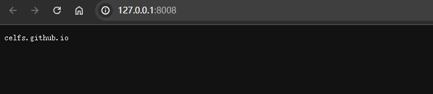

## 00 Task Node.js

Date：2024/07/08 00:28:07

------


[TOC]


------


### 00 进度

* 开始课程（2024/07/08）
* 完成课程（2024/07/08）


------


### 00 信息补充

* 代理、反向代理 Nginx


------


### 01 安装和配置 Node.js

* 前面 ES6 课程已安装，此处仅作补充
  * 0）最新 [Node.js](https://nodejs.org/zh-cn) 安装方式比较直观；
  * 1）创建 `axios` --> `cd /axios` 
  * 2）使用 `i` 或者 `install` 进行安装；
  * 3）可通过 [npm 官网](https://www.npmjs.com/)，查询所需扩展的安装方式。

```bash
npm i axios
```


------


### 02 常用内置模块

* 概括
  * [参考文章-邓瑞编程](https://www.dengruicode.com/classes_content?uuid=97898a1d5baa4e52831879af15f4161d) 
  * 暂时仅需了解模块的大致功能
* 常用内置模块（10 个）

| 模块                 | 功能                                                         |
| :------------------- | ------------------------------------------------------------ |
| url                  | 用于**解析**请求的 url，将其分解为各个组成部分， 如域名、端口、查询字符串。 |
| path                 | 用于获取文件或目录的路径、路径中的文件名、扩展名等。         |
| buffer               | Buffer 对象可以被看作是一个固定长度的数组， 专门用于处理**二进制数据**。<br>如：读取文件、图像处理等。<br>注：buffer <--> 字符串r。 |
| fs(File System)      | 用于读取、写入、编辑、删除**文件**和创建、删除目录等。       |
| stream 流            | 数据流处理， 支持读取流、写入流等， 使得**处理大文件**变得高效。 |
| os(Operating System) | 用于获取操作系统类型、系统架构、CPU核心数等。                |
| http                 | 用于构建 Web 服务器、处理 http 请求和响应等。                |
| crypto               | 提供**加密和解密**功能， 支持各种哈希算法、对称加密和非对称加密等。 |
| util                 | 提供一些**工具函数**， 如格式化输出等。                      |


------


### 03 创建一个 Node.js 应用程序和安装插件

* 1）创建工作目录 --> VSC --> 运行程序 `node demo.js` 
* 2）安装插件 Code Runner（前面课程已安装）
* 3）配置 Code Runner（勾选 --> 重新运行 --> 清空 OUTPUT 历史输出）


* 4）初始化配置文件 `npm init` 
  * 由于安装新版 Node.js，可能出现权限报错 `在此系统上禁止运行脚本` 
  * 则可执行如下命令，对应参数为：
    * `Restricted`  禁止运行所有脚本；
    * `AllSigned` 所有脚本需要有效的数字签名才可运行；
    * `RemoteSigned` 允许运行本地创建的脚本,但从网下载的脚本则需有效的数字签名才可运行；
    * `Unrestricted` 允许所有脚本运行。

```bash
# 获取当前脚本的执行策略 --> Restricted
Get-ExecutionPolicy

# 设置脚本的执行策略 --> RemoteSigned
Set-ExecutionPolicy RemoteSigned -y
```


* 5）继续完成配置初始化
  * 对应选项按需填写即可


------


### 04 ESM(ES Modules) 和 CJS(CommonJS) 规范

* 概括
  * Node.js 默认使用 CJS（CommonJS） 规范
    * 使用 `require` 和 `module.exports` 
  * ESM（ES Modules）规范（**对标最新项目**）
    * 使用 `import` 和 `export` 

* 1）初始代码

```javascript
// demo.js
// 从 web.js 文件中导入 title, url, getUrl

import obj from "./web.js";         // ESM 规范
// const obj = require("./web.js"); // CJS 规范

console.log(obj.title);
console.log(obj.url);
console.log(obj.getUrl);
```

```javascript
// web.js
let title = "CELFS";
let url = "celfs.github.io/Notes/#/";
let getUrl = () => "www.celfs.github.io/Notes/#/";

export default { title, url, getUrl }; 	   // ESM 规范
// module.exports = { title, url, getUrl } // CJS 规范
```

* 2）运行项目 --> 规范警告 --> 提示两种方式导入
  * 方式一：在配置文件添加 `"type": "module"` 
  * 方式二：修改文件后缀 `.js` --> `.mjs` 


* 3）修改配置文件 --> 正确运行

```json
{
  "type": "module", // 添加 ES 模块标识 | 若使用 CJS，需删除次项
  "name": "demo02",
  "version": "1.0.0",
  "description": "",
  "main": "demo.js",
  "scripts": {
    "test": "echo \"Error: no test specified\" && exit 1"
  },
  "author": "",
  "license": "ISC"
}
```


------


### 05 url 模块

* 代码流程

```javascript
// demo05.js
// 导入 url 模块，将 file:// 格式转换为 Windows 路径
import url from 'url';
import path from 'path';

// --- url
// new URL 将传入的字符串解析为一个 URL 对象
let DRUrl = new URL('https://www.dengruicode.top:8008/study?id=588#vue3');
// console.log(DRUrl);

console.log('\n完整的url:', DRUrl.href); // https://www.dengruicode.top:8008/study?id=588#vue3
console.log('协议:', DRUrl.protocol); // https:
console.log('域名:', DRUrl.hostname); // www.dengruicode.top
console.log('端口:', DRUrl.port); // 8008
console.log('域名和端口:', DRUrl.host); // www.dengruicode.top:8008
console.log('协议、域名、端口:', DRUrl.origin); // https://www.dengruicode.top:8008
console.log('路径:', DRUrl.pathname); // /study
console.log('查询字符串:', DRUrl.search); // ?id=588
console.log('查询参数:', DRUrl.searchParams); // URLSearchParams { 'id' => '588' }
console.log('id:', DRUrl.searchParams.get('id')); // 588
console.log('哈希:', DRUrl.hash); // 输出: #vue3

// --- 文件
// file:// 的使用场景: 1.跨平台兼容性 2.url相关的操作
console.log('\n当前文件的url格式路径:', import.meta.url); // file:///d:/01Working/project/Vue3/DEMO/demo02/demo05.js

// 对齐名称，获取当前文件的路径
let __filename = url.fileURLToPath(import.meta.url);
console.log('当前文件的路径:', __filename) // d:\01Working\project\Vue3\DEMO\demo02\demo05.js

// 对齐名称，获取当前文件所在目录的路径
let __dirname = path.dirname(__filename);
console.log('当前文件所在目录的路径:', __dirname); // d:\01Working\project\Vue3\DEMO\demo02
```

* 运行效果


* 疑问
  * 为何这次不需要打开本地调试程序，即可获取相应的请求信息？是因为访问的域名是真实存在互联网的？
  * 为何配置文件 `package.json` 不需要将 `demo04` 改为 `demo05` ？
  * 如何理解 `__filename` 命名规则对于 CJS 规范的兼容？
    * 在 CJS 规范中，`__filename` 用于获取当前文件的路径；
    * 可以理解为，名称对齐，使得相关接口在识别该名称时，能够实现相同的功能。
  * 如何理解 `file://` 的跨平台兼容性？
    * `file://` 格式路径，是 URL 格式的路径
    * 相当于一种格式对齐，从而将本地路径，用相应的前缀指明为 URL 格式


------


### 06 path 模块

* 代码流程

```javascript
import url from 'url';
import path from 'path';

// file:// 的使用场景: 1.跨平台兼容性 2.url相关的操作
console.log('当前文件的url格式路径:', import.meta.url);  // file:///d:/01Working/project/Vue3/DEMO/demo02/demo06.js

let __filename = url.fileURLToPath(import.meta.url);
console.log('当前文件的路径:', __filename);              // d:\01Working\project\Vue3\DEMO\demo02\demo06.js

let __dirname = path.dirname(__filename);
console.log('当前文件所在目录的路径:', __dirname);       // d:\01Working\project\Vue3\DEMO\demo02

let basename = path.basename(__filename);
console.log('文件名:', basename); // demo06.js

let extname = path.extname(__filename);
console.log('扩展名:', extname);  // .js

/*
pathObj: {
  root: 'd:\\',         // 根目录
  dir: 'd:\\01Working\\project\\Vue3\\DEMO\\demo02', // 目录路径
  base: 'demo06.js',    // 文件名
  ext: '.js',           // 扩展名
  name: 'demo06'        // 文件名（不含扩展名）
}
*/

let pathObj = path.parse(__filename); // 路径解析：将路径拆分为多个部分
console.log('pathObj:', pathObj);

// 错误示例
console.log('错误示例:', __dirname + "/DR.jpg"); // d:\01Working\project\Vue3\DEMO\demo02/DR.jpg

// path.join 路径拼接 | 自动纠正错误路径
let pathJoin = path.join(__dirname, "/DR.jpg"); // d:\01Working\project\Vue3\DEMO\demo02\DR.jpg
console.log('pathJoin:', pathJoin);

// path.resolve 会解析路径中的 ../(上级目录)  ./(当前目录)  /(根目录)
// path.resolve 会将路径字符串解析为根目录
let pathResolve = path.resolve(__dirname, "/DR.jpg"); // d:\DR.jpg
console.log('pathResolve:', pathResolve);

// 分隔符（对应系统的文件路径）
console.log('分隔符:', path.sep) // 在 Linux 上是 /(正斜杠), 在 Windows 上是 \(反斜杠)
```

* 运行效果


------


### 07 buffer 模块

* 代码流程

```javascript
// 创建一个 10 字节 Buffer，以十六进制输出（便于阅读），实际存储二进制数据
console.log('创建 Buffer:', Buffer.alloc(10));
console.log('Buffer 的长度:', Buffer.alloc(10).length);

// String 转换为 Buffer (常用于将数据写入文件、通过网络发送数据等)
let urlBuffer = Buffer.from('celfs.github.io', 'utf8'); //创建一个包含字符串 'github.com'' 的 Buffer
console.log('字符串转换为 Buffer:', urlBuffer);

// Buffer 转换为 String (常用于从文件读取数据、接收到网络数据后解析内容)
console.log('Buffer 转换为字符串:', urlBuffer.toString('utf8')); // 注意选择对应的编码字符集

// Buffer 转换为 Base64 (常用于在文本协议中传输二进制数据,如：嵌入图像资源、电子邮件附件等)
const urlBase64 = urlBuffer.toString('base64');
console.log('Buffer 转换为 Base64:', urlBase64);

// Base64 转换为 Buffer
console.log('Base64 转换为 Buffer:', Buffer.from(urlBase64, 'base64'));
```

* 运行效果


* 2024/07/08 01:55:05 P1-7，1h30min

------


### 08 fs 模块

* 代码流程（9 种文件操作）
  * 创建目录、写入文件、追加文件、读取文件
  * 检测目录或文件是否存在、获取文件或目录详细信息
  * 文件或目录重命名、删除文件、删除目录

```javascript
// demo08.js
import fs from 'fs';

// 1）创建目录
const createDir = async (path) => {
    try {
        await fs.promises.mkdir(path, { recursiv: true });
        console.log("目录创建成功");
    } catch (err) {
        console.error(`目录创建失败：${err}`);
    };
};

let dir = "DEMO/demo02/celfs/log/";
// let dir = "";
// createDir(dir); // 创建多级目录


// 2）写入文件（覆盖）
const writeFile = async (path, content) => {
    try {
        await fs.promises.writeFile(path, content);
        console.log("文件写入成功");
    } catch (err) {
        console.log(`文件写入失败：${err}`);
    };
};

let name = "web.txt";
let path = dir + name; // DEMO/demo02/celfs/log/web.txt
let content = "celfs.github.io";
// writeFile(path, content);


// 3）追加文件
const appendFile = async (path, content) => {
    try {
        await fs.promises.appendFile(path, content);
        console.log("追加写入成功");
    } catch (err) {
        console.error(`追加写入失败: ${err}`);
    };
};

let appendContent = "\nCELFS Learning";
// appendFile(path, appendContent);


// 4）读取文件
const readFile = async (path) => {
    try {
        const data = await fs.promises.readFile(path);
        console.log(String(data)); // Buffer --> String
        // console.log(data);      // 打印 Buffer
    } catch (err) {
        console.error(`文件读取失败: ${err}`);
    };
}

// readFile(path);


// 5）检测文件或目录是否存在
/*
  fs.promises.constants.F_OK 检查文件是否存在
  fs.promises.constants.R_OK 检查文件是否可读
  fs.promises.constants.W_OK 检查文件是否可写
  fs.promises.constants.X_OK 检查文件是否可执行

  ENOENT(Error NO ENTry) - no such file or directory (文件或目录不存在)
  EEXIST - file already exists (文件已存在)
  EACCES - permission denied (没有足够的权限)
*/
const fileOrDirExist = async (path) => {
    try {
        await fs.promises.access(path, fs.constants.F_OK); // 参数添加 promises 会报错：F_OK 属性错误
        console.error("文件或目录存在");
    } catch (err) {
        console.error(`文件或目录不存在: ${err}`);
    };
};

// console.log(path); // DEMO/demo02/celfs/log/web.txt
// fileOrDirExist("d:/01Working/project/Vue3/DEMO/demo02/celfs/log/web.txt"); // 存在
// fileOrDirExist("d:\\01Working\\project\\Vue3\\DEMO\\demo02\\celfs\\log"); // 存在
// fileOrDirExist("celfs/log/web.txt"); // 不存在
// fileOrDirExist(path); // 存在
// fileOrDirExist("DEMO/demo02/celfs/log/web.txt"); // path 存在


// 6）获取文件或目录详细信息
const fileOrDirStats = async (path) => {
    try {
        let stats = await fs.promises.stat(path);
        // console.log(stats)

        // 检查是否是一个文件  
        if (stats.isFile()) {
            console.log(`${path} 是文件`);
            return;
        }

        // 检查是否是一个目录  
        if (stats.isDirectory()) {
            console.log(`${path} 是目录`);
            return;
        }
    } catch (err) {
        console.error(`获取文件或目录详细信息时出错: ${err}`);
    }
};

// fileOrDirStats(path);
// fileOrDirStats("DEMO/demo02/celfs/log");


// 7）文件或目录重命名
const fileOrDirRename = async (oldPath, newPath) => {
    try {
        await fs.promises.rename(oldPath, newPath);
        console.log("文件或目录重命名成功");
    } catch (err) {
        console.error(`文件或目录重命名失败: ${err}`);
    };
};

// fileOrDirRename("DEMO/demo02/celfs/log", "DEMO/demo02/celfs/newLog");
// fileOrDirRename("DEMO/demo02/celfs/newLog/web.txt", "DEMO/demo02/celfs/newLog/newWeb.txt");


// 8）删除文件
const deleteFile = async (path) => {
    try {
        await fs.promises.unlink(path);
        console.log("文件删除成功");
    } catch (err) {
        console.error(`文件删除失败: ${err}`);
    };
};

// deleteFile("DEMO/demo02/celfs/newLog/newWeb.txt");


// 9）删除目录
const deleteDir = async (path) => {
    try {
        await fs.promises.rm(path, { recursive: true }) // recursive: true 允许递归删除多级目录
        console.log("目录删除成功")
    } catch (err) {
        console.error(`目录删除失败: ${err}`)
    }
}

deleteDir("DEMO/demo02/celfs");
```

* 疑问
  * 如何将当前代码识别的路径，定义为 `demo02` 目录之下？
  * 为什么当前目录识别为 `DEMO/demo02/` ？是因为工作目录定义在这个层级？
    * 另外，还需创建 `celfs` 一级目录，否则 `log` 报错。
  * 为何检测文件是否存在时，参数添加 `promises` 会报错？`F_OK` 属性错误。需删除前一级的 `promises` ？是版本更新的缘故？


* 2024/07/08 02:38:22 P08，43min

------


### 09 stream 流

* 概括
  * 流（Stream）是一种处理数据的方式。对于比较大的文件，流可以**逐步处理数据**，而不是一次性将整个文件加载到内存中，这样可以**节省内存资源**，避免内存溢出问题。
* 代码流程
  * 将 08 节代码的写入文件、追加文件、读取文件，使用流处理方式替换，实现了相同的功能。

```javascript
// demo09.js
import fs from 'fs';

// 1）创建目录
const createDir = async (path) => {
    try {
        await fs.promises.mkdir(path, { recursiv: true });
        console.log("目录创建成功");
    } catch (err) {
        console.error(`目录创建失败：${err}`);
    };
};

let dir = "DEMO/demo02/celfs/log/"; // 需先创建 celfs 目录
// let dir = "";
// createDir(dir); // 创建多级目录


// 2）写入文件（覆盖）
// const writeFile = async (path, content) => {
//     try {
//         await fs.promises.writeFile(path, content);
//         console.log("文件写入成功");
//     } catch (err) {
//         console.log(`文件写入失败：${err}`);
//     };
// };

const writeFile = (path, content) => {
    const writeStream = fs.createWriteStream(path);

    writeStream.on('error', err => {
        console.error(`文件写入失败： ${err}`);
        writeStream.close(); // 出错时关闭流
    })

    writeStream.on('finish', () => {
        console.log("文件写入成功");
    })

    writeStream.write(content, 'utf8');
    writeStream.end();
};

let name = "web.txt";
let path = dir + name; // DEMO/demo02/celfs/log/web.txt
let content = "celfs.github.io";
// writeFile(path, content);


// 3）追加文件
// const appendFile = async (path, content) => {
//     try {
//         await fs.promises.appendFile(path, content);
//         console.log("追加写入成功");
//     } catch (err) {
//         console.error(`追加写入失败: ${err}`);
//     };
// };

const appendFile = (path, content) => {
    const appendStream = fs.createWriteStream(path, { flags: 'a' }); // flags: 'a' 追加模式

    appendStream.on('error', err => {
        console.error(`追加写入失败 ${err}`);
        writeStream.close(); // 出错时关闭流
    })

    appendStream.on('finish', () => {
        console.log("追加写入成功");
    })

    appendStream.write(content, 'utf8');
    appendStream.end();
};

let appendContent = "\nCELFS Learning";
// appendFile(path, appendContent);


// 4）读取文件
// const readFile = async (path) => {
//     try {
//         const data = await fs.promises.readFile(path);
//         console.log(String(data)); // Buffer --> String
//         // console.log(data);      // 打印 Buffer
//     } catch (err) {
//         console.error(`文件读取失败: ${err}`);
//     };
// }

const readFile = (path) => {
    const readStream = fs.createReadStream(path);

    let content = '';
    readStream.on('data', chunk => {
        // console.log(chunk); //chunk是指在流中传输的数据块
        content += chunk.toString('utf8'); //将Buffer转换为UTF-8编码的字符串
    });

    readStream.on('end', () => {
        console.log(content);
    });

    readStream.on('error', err => {
        console.error(`文件读取失败: ${err}`);
    });
};

readFile(path);


// 5）检测文件或目录是否存在
/*
  fs.promises.constants.F_OK 检查文件是否存在
  fs.promises.constants.R_OK 检查文件是否可读
  fs.promises.constants.W_OK 检查文件是否可写
  fs.promises.constants.X_OK 检查文件是否可执行

  ENOENT(Error NO ENTry) - no such file or directory (文件或目录不存在)
  EEXIST - file already exists (文件已存在)
  EACCES - permission denied (没有足够的权限)
*/
const fileOrDirExist = async (path) => {
    try {
        await fs.promises.access(path, fs.constants.F_OK); // 参数添加 promises 会报错：F_OK 属性错误
        console.error("文件或目录存在");
    } catch (err) {
        console.error(`文件或目录不存在: ${err}`);
    };
};

// console.log(path); // DEMO/demo02/celfs/log/web.txt
// fileOrDirExist("d:/01Working/project/Vue3/DEMO/demo02/celfs/log/web.txt"); // 存在
// fileOrDirExist("d:\\01Working\\project\\Vue3\\DEMO\\demo02\\celfs\\log"); // 存在
// fileOrDirExist("celfs/log/web.txt"); // 不存在
// fileOrDirExist(path); // 存在
// fileOrDirExist("DEMO/demo02/celfs/log/web.txt"); // path 存在


// 6）获取文件或目录详细信息
const fileOrDirStats = async (path) => {
    try {
        let stats = await fs.promises.stat(path);
        //console.log(stats)

        // 检查是否是一个文件  
        if (stats.isFile()) {
            console.log(`${path} 是文件`);
            return;
        }

        // 检查是否是一个目录  
        if (stats.isDirectory()) {
            console.log(`${path} 是目录`);
            return;
        }
    } catch (err) {
        console.error(`获取文件或目录详细信息时出错: ${err}`);
    }
};

// fileOrDirStats(path);
// fileOrDirStats("DEMO/demo02/celfs/log");


// 7）文件或目录重命名
const fileOrDirRename = async (oldPath, newPath) => {
    try {
        await fs.promises.rename(oldPath, newPath);
        console.log("文件或目录重命名成功");
    } catch (err) {
        console.error(`文件或目录重命名失败: ${err}`);
    };
};

// fileOrDirRename("DEMO/demo02/celfs/log", "DEMO/demo02/celfs/newLog");
// fileOrDirRename("DEMO/demo02/celfs/newLog/web.txt", "DEMO/demo02/celfs/newLog/newWeb.txt");


// 8）删除文件
const deleteFile = async (path) => {
    try {
        await fs.promises.unlink(path);
        console.log("文件删除成功");
    } catch (err) {
        console.error(`文件删除失败: ${err}`);
    };
};

// deleteFile("DEMO/demo02/celfs/newLog/newWeb.txt");


// 9）删除目录
const deleteDir = async (path) => {
    try {
        await fs.promises.rm(path, { recursive: true }) // recursive: true 允许递归删除多级目录
        console.log("目录删除成功")
    } catch (err) {
        console.error(`目录删除失败: ${err}`)
    }
}

// deleteDir("DEMO/demo02/celfs");
```

* 疑问
  * 流式处理的代码，还需要熟悉一下。


------


### 10 os 模块

* 使用 OS 模块获取一些常用系统信息。

```javascript
// demo10.js
import os from 'os'

// bytes 转换为 GB
const bytesToGB = bytes => (bytes / (1024 * 1024 * 1024)).toFixed(2)

console.log("内核版本:", os.version())
console.log("操作系统类型:", os.type())
console.log("系统架构:", os.arch())
console.log("主机名:", os.hostname())
console.log("总内存(GB):", bytesToGB(os.totalmem()))
console.log("空闲内存(GB):", bytesToGB(os.freemem()))
console.log("CPU核心数:", os.cpus().length)
console.log("当前用户的主目录:", os.homedir())
console.log("当前用户的信息:", os.userInfo())
```

* 运行效果


------


### 11 crypto 模块

* 概括
  * 网站开发中，md5 和 sha1 一般用于加密用户密码。
  * AES-GCM 是一种高级的加密标准。

```javascript
// demo11.js
import crypto from 'crypto'

// 1）使用 md5 算法生成数据的哈希值
const md5 = data => {
    const hash = crypto.createHash("md5"); // 创建一个 md5 的哈希对象
    hash.update(data);         // 更新哈希对象, 处理并传入待哈希的数据
    return hash.digest("hex"); // 计算哈希值并以十六进制字符串的形式返回
};

// 1）使用 sha-1 算法生成数据的哈希值
const sha1 = data => {
    const hash = crypto.createHash("sha1");
    hash.update(data);
    return hash.digest("hex");
};

console.log("md5:", md5("celfs.github.io"));
console.log("sha1:", sha1("celfs.github.io"));


// 2）生成指定长度的随机字符串 - 常用于生成临时密码、令牌等
const randomStr = length => {
    /*
        每个字节在转换为十六进制字符串后会变成两个字符
        所以字节的数量是所需字符串长度的一半(向上取整)
        如:要生成20位的随机字符串,则需要10个字节
    */
    const bytesNeed = Math.ceil(length / 2);
    const randomBytes = crypto.randomBytes(bytesNeed);

    const hexStr = randomBytes.toString('hex'); // 字节转换成十六进制字符串

    return hexStr.slice(0, length); // 截取指定长度的字符串,确保字符串长度符合要求
};

console.log("随机字符串: ", randomStr(20));


/*
    AES(Advanced Encryption Standard 高级加密标准)
    对称加密算法: 加密和解密使用相同的密钥
*/
// 3）使用AES-GCM模式加密
const aesGcmEncrypt = (plaintext, key) => {
    // nonce(Number Used Once 一次性使用的数字) 是一个随机字符串 (AES-GCM的nonce长度应为12字节)
    // nonce 用于确保相同的明文也不会产生相同的密文, 从而增强安全性
    const nonce = crypto.randomBytes(12);

    // 创建加密器, 使用 aes-256-gcm 算法、给定密钥和nonce
    const cipher = crypto.createCipheriv('aes-256-gcm', key, nonce);

    // 使用加密器对明文进行加密, 并将结果转换为十六进制字符串
    let encrypted = cipher.update(plaintext, 'utf8', 'hex');
    encrypted += cipher.final('hex'); // 加密后的密文数据

    // 获取认证标签,并将其转换为十六进制字符串
    // 认证标签用于验证数据的完整性和来源的真实性, 防止篡改和假冒
    const authTag = cipher.getAuthTag().toString('hex');

    // 将加密后的数据、nonce 和认证标签合并为一个 json 字符串
    const encryptedJson = JSON.stringify({
        nonce: nonce.toString('base64'), // 将nonce转换为Base64编码
        encrypted: encrypted,
        authTag: authTag
    });
    return encryptedJson;
};

// 密钥长度应为16、24、32字节，对应于AES-128、AES-192、AES-256
const key = crypto.randomBytes(32); // 用于加密和解密的密钥 [生成一个随机的AES-256密钥]
const plaintext = "CELFS Learning"; // 要加密的原始文本

const encryptedJson = aesGcmEncrypt(plaintext, key);
console.log("加密: ", encryptedJson);


// 4）使用AES-GCM模式解密
const aesGcmDecrypt = (encryptedJson, key) => {
    //从 json 字符串中解析出加密数据、nonce 和认证标签
    const { nonce, encrypted, authTag } = JSON.parse(encryptedJson);

    //  将 Base64 编码的 nonce 转换回 Buffer 格式, 以便于解密器使用
    const nonceBuffer = Buffer.from(nonce, 'base64');

    // 创建解密器, 使用 aes-256-gcm 算法、给定密钥和nonceBuffer
    const decipher = crypto.createDecipheriv('aes-256-gcm', key, nonceBuffer);

    // 设置解密时用于校验的认证标签
    decipher.setAuthTag(Buffer.from(authTag, 'hex'));

    // 使用解密器对加密后的数据进行解密, 将十六进制格式的密文转换为 UTF-8 字符串
    let decrypted = decipher.update(encrypted, 'hex', 'utf8');
    decrypted += decipher.final('utf8');

    return decrypted;
};

const decryptedText = aesGcmDecrypt(encryptedJson, key);
console.log('解密:', decryptedText);
```

* 运行效果


* 疑问
  * 这一节有点复杂，需要慢慢理解。


------


### 12 util 模块

* 提供一些常用的工具函数。
* 在后续开发中，`format` 和 `inspect` 会经常使用。

```javascript
// demo12.js
import util from 'util';

/*
  格式化字符串,将参数插入到占位符所在的位置
  %s 是一个字符串(String)类型的占位符
  %d 是一个十进制整数(Decimal Integer)类型的占位符
*/
const url = 'dengruicode.com';
const user = 100;
const msg = util.format('网址: %s, 在线人数: %d', url, user);
console.log(msg);

// 将对象转换为字符串
const webObj = { url: 'www.dengruicode.com', user: 200 };
console.log('webObj:', typeof webObj, webObj);
const webStr = util.inspect(webObj);
console.log('webStr:', typeof webStr, webStr);
```

* 运行效果


------


### 13 http 模块 - 创建并启动 http 服务器

* 使用 node 创建本地服务器

```javascript
// demo13.js
import http from 'http';

// 本地回环地址是一个特殊的ip地址(通常为 127.0.0.1), 主要用于同一台主机的通信和测试
const hostname = '127.0.0.1'; // 服务器监听的ip地址(本地回环地址), 意味着服务器只接受来自本机的网络请求
const port = 8008; //服务器监听的端口号

// http.createServer 创建一个 http 服务器实例
const server = http.createServer((request, response) => {
    response.write("celfs.github.io"); //发送响应数据
    response.end(); //结束响应
});

// 启动 http 服务器,并在指定的ip地址(127.0.0.1)和端口(8008)上监听连接请求
server.listen(port, hostname, () => {
    console.log(`服务器已启动: http://${hostname}:${port}`);
});
```

* 运行效果





------


### 14 http 模块 - request(请求) 和 response(响应)

* 概括
  * [请求头的详细说明-邓瑞编程](https://www.dengruicode.com/classes_content?uuid=7f17da33810545fba9f8eae39f8d3d75) 

```javascript
// demo14.js
import http from 'http';

// 本地回环地址是一个特殊的ip地址(通常为 127.0.0.1), 主要用于同一台主机的通信和测试
const hostname = '127.0.0.1'; // 服务器监听的ip地址(本地回环地址), 意味着服务器只接受来自本机的网络请求
const port = 8008; //服务器监听的端口号

// http.createServer 创建一个 http 服务器实例
const server = http.createServer((request, response) => {
    // ------ request
    console.log(`${request.method} ${request.url}`);
    // console.log(request.headers);
    console.log("referer:", request.headers.referer);
    console.log("user-agent:", request.headers['user-agent']);
    console.log("\n"); // 换行

    // ------ response
    response.statusCode = 200; // 200 状态码表示请求成功
    response.setHeader('Content-Type', 'text/html; charset=UTF-8'); // 设置内容类型为 'text/html; charset=UTF-8' 的响应头
    response.write("<h3>celfs.github.io</h3>"); // 发送响应数据，添加识别规则后，可正确解析 h3 标签

    response.write("celfs.github.io"); // 发送响应数据
    response.end(); // 结束响应
});

// 启动 http 服务器,并在指定的ip地址(127.0.0.1)和端口(8008)上监听连接请求
server.listen(port, hostname, () => {
    console.log(`服务器已启动: http://${hostname}:${port}`);
});
```

* 运行效果
* 1）控制台查看请求头


* 2）显示请求头的相关属性


* 3）浏览器未正确解析 h3 标签


* 4）设置响应内容，可正确解析 h3 标签


------


### 15 http 模块 - 获取参数

* 代码流程
  * 1）构建完整 URL
  * 2）使用 `new URL()` 解析 URL
  * 3）获取查询参数 `URLSearchParams()` 
  * 4）获取指定参数的内容

```javascript
// demo15.js
import http from 'http';

// 本地回环地址是一个特殊的ip地址(通常为 127.0.0.1), 主要用于同一台主机的通信和测试
const hostname = '127.0.0.1'; // 服务器监听的ip地址(本地回环地址), 意味着服务器只接受来自本机的网络请求
const port = 8008; //服务器监听的端口号

// http.createServer 创建一个 http 服务器实例
const server = http.createServer((request, response) => {
    // ------ url http://127.0.0.1:8008/?id=1&web=celfs.github.io 构成完成，点击此 URL
    let fullUrl = `http://${hostname}:${port}${request.url}` // 构造完整的 url 字符串
    console.log(fullUrl);
    let urlObj = new URL(fullUrl);
    // console.log(urlObj); // 可找到 search 的值

    const queryObj = new URLSearchParams(urlObj.search); // 获取查询参数对象
    console.log(queryObj);
    console.log("web:", queryObj.get('web'));

    // ------ request
    // console.log(`${request.method} ${request.url}`);
    // console.log(request.headers);
    // console.log("referer:", request.headers.referer);
    // console.log("user-agent:", request.headers['user-agent']);
    console.log("\n"); // 换行

    // ------ response
    response.statusCode = 200; // 200 状态码表示请求成功
    response.setHeader('Content-Type', 'text/html; charset=UTF-8'); // 设置内容类型为 'text/html; charset=UTF-8' 的响应头
    response.write("<h3>celfs.github.io</h3>"); // 发送响应数据，添加识别规则后，可正确解析 h3 标签

    response.write("celfs.github.io"); // 发送响应数据
    response.end(); // 结束响应
});

// 启动 http 服务器,并在指定的ip地址(127.0.0.1)和端口(8008)上监听连接请求
server.listen(port, hostname, () => {
    console.log(`服务器已启动: http://${hostname}:${port}`);
});
```

* 运行效果


* 2024/07/08 03:56:36 P9-15,1h13min

------

## 本篇完

