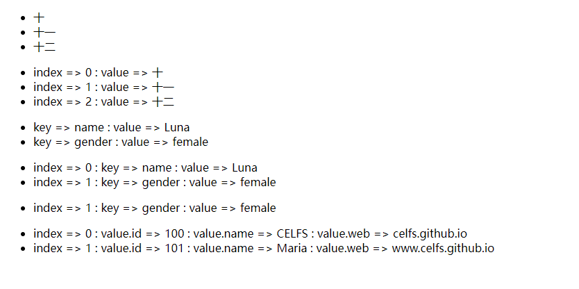
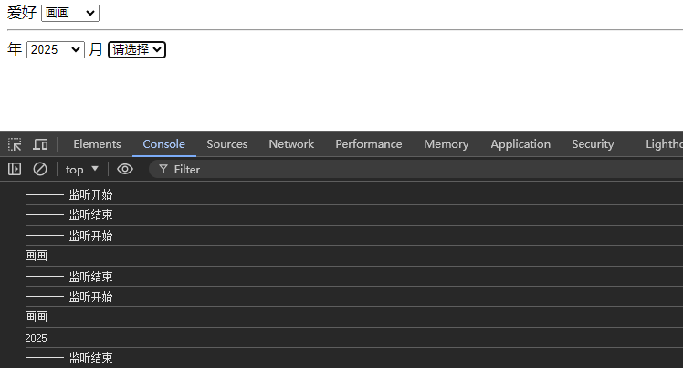

## 01 Task Vue 3

Date：2024/07/03 22:39:31

------


[TOC]


------


### 00 策略

* 本课程示例多为要素展示，其页面效果比较朴素，但内容比较典型，有助于快速建立对 Vue 3 的认知。
* 下一步需补充学习通用性内容
  * 0）**前端业务面**（涉及的不同领域、不同分支、不同类型项目）
  * 1）项目的完整生命周期；
  * 2）项目的**各阶段划分**，对应任务、**对应工具 / 技术栈的进入点**；
  * 3）**项目构建的标准流程**
    * 前端项目的构建标准流程；
    * 各业务端的配合模式；
    * 立项、商议、会议、构建、审查、测试、结项等；
  * 4）**页面效果较为丰富的项目**（vue-admin-template）；
  * 5）整理 Vue 3 知识网，延伸学习（例如脚手架 Vite、vuex、vue-router、webpack、element-ui等）；
  * 6）复盘 ES6 基础语法；
  * 7）前端八股 Vue 部分、业务部分（留意安全与性能问题 + 相关技术）；
  * 8）前端业务与后端业务的配合模式（详细）。

### 00 进度

* 整理结构（2024/07/03）
* 开始课程（2024/07/04）
* 课程 P01-09（2024/07/04）
* 课程 P10-29（2024/07/05）
* 策略 + 下一步（2024/07/06）
* 课程 P30-33（2024/07/06）
* 完成课程（2024/07/06）


------


## 第一篇 语法

### 01 Vue3 课程简介

* ES5 --> Vue3 --> npm
* Vue3 --> Vuex --> Vue-router


------


### 02 创建一个 Vue3 应用

* 概括
  * 渐进式框架：可按需加载模块与功能。
  * 选项式（Vue 2）、组合式（Vue 3）
  * 三种创建方式
    * 使用 Vue 3 框架
    * 使用 CND（传统开发方式）
    * 使用 ES 模块化开发
* 代码流程
  * 通过 CDN 使用 Vue --> 准备 js 文件 --> 创建项目
  * 页面挂载 --> 解构赋值（删除 `Vue.` 调用前缀）

```html
<!DOCTYPE html>
<html lang="en">

<head>
    <meta charset="UTF-8">
    <meta name="viewport" content="width=device-width, initial-scale=1.0">
    <title>Document</title>
    <script src="vue.global.js"></script>
</head>

<body>
    <div id="app">
        {{ msg }}

        <h2>{{ web.title }}</h2>
        <h2>{{ web.url }}</h2>
    </div>

    <script>
        const { createApp, reactive } = Vue // 解构赋值语法

        createApp({
            // setup选项，用于设置响应式数据和方法等
            setup() {
                const web = reactive({
                    title: "CELFS",
                    url: "celfs.github.io/Notes/#/"
                })

                return {
                    msg: "success",
                    web
                }
            }
        }).mount("#app")

    </script>
</body>

</html>
```

* 页面效果


* 信息补充
  * 挂载、插值表达式
* 疑问
  * 如何判断当前项目 Vue 代码的版本？是否有版本标识符？
  * API 的学习方法，如何更有效地按需学习？如何找到并把握 API 分类体系？


------


### 03 Vue3 模块化开发

* 代码流程
  * 拷贝上节代码 --> 删除 `js` 引用 -->
  * 添加 `type="module"` --> 添加 `import` 
  * `Live Server` 运行
* 注意
  * 检查模块化开发的标签是否正确设置；
  * 检查 `js` 文件的导入是否正确。

```html
<!DOCTYPE html>
<html lang="en">

<head>
    <meta charset="UTF-8">
    <meta name="viewport" content="width=device-width, initial-scale=1.0">
    <title>Document</title>
</head>

<body>
    <div id="app">
        {{ msg }}

        <h2>{{ web.title }}</h2>
        <h2>{{ web.url }}</h2>
    </div>

    <script type="module">
        import { createApp, reactive } from './vue.esm-browser.js'

        createApp({
            // setup选项，用于设置响应式数据和方法等
            setup() {
                const web = reactive({
                    title: "CELFS",
                    url: "celfs.github.io/Notes/#/"
                })

                return {
                    msg: "success",
                    web
                }
            }
        }).mount("#app")

    </script>
</body>

</html>
```

* 页面效果


------


### 04 ref 和 reactive 区别

* 概括
  * `ref` 用于存储单个基本类型的数据（数字、字符串等）
    * 使用 `ref` 创建的响应式对象，需通过 `.value` 属性来访问和修改值。
  * `reactive` 用于存储复杂数据类型（对象、数组等）
    * 使用 `reactive` 创建的响应式对象，可直接用属性名来访问和修改值。
* 信息补充
  * 响应式对象、响应式数据

```html
<!DOCTYPE html>
<html lang="en">

<head>
    <meta charset="UTF-8">
    <meta name="viewport" content="width=device-width, initial-scale=1.0">
    <title>Document</title>
</head>

<body>
    <div id="app">
        {{ msg }}

        <h2>{{ web.title }}</h2>
        <h2>{{ web.url }}</h2>
        <h2>{{ number }}</h2>
    </div>

    <script type="module">
        import { createApp, reactive, ref } from './vue.esm-browser.js'

        createApp({
            // setup选项，用于设置响应式数据和方法等
            setup() {
                const number = ref(10);
                number.value = 20;        // ref 是引用值，不能直接赋值修改
                number.value = [1, 2, 3]; // ref 可存储数组，初始化时同理 

                const web = reactive({    // reactive 可直接赋值修改
                    title: "CELFS",
                    url: "celfs.github.io/Notes/#/"
                });
                web.url = "https://celfs.github.io/Notes/#/";

                return {
                    msg: "success",
                    number,
                    web
                }
            }
        }).mount("#app")

    </script>
</body>

</html>
```

* 页面效果


* 疑问
  * 为什么需要繁琐地定义与区分两种响应式对象的生成方式？
  * 此处的 `ref` 涉及 “引用” 的概念，如何理解 Vue 中的引用？是 JS 原生的内容？


------


### 05 绑定事件 v-on 和按键修饰符

* 概念
  * 绑定事件、点击事件（最常用）、简写形式 `@`、按键修饰符（按键事件）
* 代码流程
  * 添加 `edit` 方法
  * 添加 `edit` 到返回值列表
  * 添加按钮 --> 绑定事件 `v-on:click="edit"` 
  * 简写形式 `@click="edit"` 
  * 按键修饰符

```html
<!DOCTYPE html>
<html lang="en">

<head>
    <meta charset="UTF-8">
    <meta name="viewport" content="width=device-width, initial-scale=1.0">
    <title>Document</title>
</head>

<body>
    <div id="app">
        {{ msg }}

        <h2>{{ web.url }}</h2>
        <h2>{{ web.user }}</h2>

        <button v-on:click="edit">修改网址1</button> <br>
        <button @click="edit">修改-简写形式@</button>
        <hr>

        回车 <input type="text" @keyup.enter="add(40, 60)"> <br>
        空格 <input type="text" @keyup.space="add(40, 60)"> <br>
        Tab <input type="text" @keydown.tab="add(0, 30)"> <br>
        w <input type="text" @keyup.w="add(0, 30)"> <br>

        <!-- 组合快捷键 -->
        Ctrl + Enter <input type="text" @keyup.ctrl.enter="add(40, 60)"> <br>
        Ctrl + A <input type="text" @keyup.ctrl.a="add(40, 60)">
    </div>

    <script type="module">
        import { createApp, reactive } from './vue.esm-browser.js';

        createApp({
            setup() {
                const web = reactive({
                    url: "celfs.github.io/Notes/#/",
                    user: 0
                });

                const edit = () => {
                    web.url = "https://celfs.github.io/Notes/#/";
                };

                const add = (a, b) => {
                    web.user += a + b;
                };

                return {
                    msg: "success",
                    web,
                    edit,
                    add
                };
            }
        }).mount("#app")
    </script>
</body>

</html>
```

* 页面效果


------


### 06 显示和隐藏 v-show

* 概括
  * 实际上，`v-show` 通过设置 `displa:none` 样式控制内容的显示或隐藏。

```html
<!DOCTYPE html>
<html lang="en">

<head>
    <meta charset="UTF-8">
    <meta name="viewport" content="width=device-width, initial-scale=1.0">
    <title>Document</title>
</head>

<body>
    <div id="app">
        {{ web.show }}
        <hr>
        <p v-show="web.show">CELFS celfs.github.io/Notes/#/</p>

        <button @click="toggle">切换显示状态</button>
    </div>

    <script type="module">
        import { createApp, reactive } from './vue.esm-browser.js';

        createApp({
            setup() {
                const web = reactive({
                    show: true
                });

                const toggle = () => {
                    web.show = !web.show;
                };

                return {
                    web,
                    toggle
                };
            }
        }).mount("#app");

    </script>
</body>

</html>
```

* 页面效果


* 疑问
  * 如何理解标签开头设置的属性？使用字符串控制样式的分组？这是 CSS 的内容，有时间复习一下两年前的知识。


------


### 07 条件渲染 v-if

* 概括
  * `v-if` 也可用于实现显示与隐藏的效果，但并**不适合频繁切换**元素显式状态，因为它会频繁从 DOM 删除或添加元素，会导致性能下降，此时使用 `v-show` 更合适。
  * `v-if-else` 可用于不同阈值条件下，渲染不同的内容。

```html
<!DOCTYPE html>
<html lang="en">

<head>
    <meta charset="UTF-8">
    <meta name="viewport" content="width=device-width, initial-scale=1.0">
    <title>Document</title>
</head>

<body>
    <div id="app">
        {{ web.show }}
        <hr>
        <p v-show="web.show">CELFS celfs.github.io/Notes/#/</p>
        <p v-if="web.show">celfs.github.io/Notes/#/</p>

        <button @click="toggle">切换显示状态</button>

        <p v-if="web.user < 1000">新网站</p>
        <p v-else-if="web.user >= 1000 && web.user < 10000">优秀网站</p>
        <p v-else>资深网站</p>
    </div>

    <script type="module">
        import { createApp, reactive } from './vue.esm-browser.js';

        createApp({
            setup() {
                const web = reactive({
                    show: true,
                    user: 100000
                });

                const toggle = () => {
                    web.show = !web.show;
                };

                return {
                    web,
                    toggle
                };
            }
        }).mount("#app");

    </script>
</body>

</html>
```

* 页面效果


* 2024/07/04 23:02:42 P1-7，1h24min

------


### 08 动态属性绑定 v-bind

* 代码流程
  * 原属性 --> 改为动态属性 --> 简写形式
    * `value` --> `v-bind:value` --> `:value` 
    * `src` --> `v-bind:src` --> `:src` 
    * `class`--> `v-bind:class{textColor:fontStatus}` --> `:class={textColor:fontStatus}`

```html
<!DOCTYPE html>
<html lang="en">

<head>
    <meta charset="UTF-8">
    <meta name="viewport" content="width=device-width, initial-scale=1.0">
    <title>Document</title>
    <style>
        .textColor {
            color: blue
        }
    </style>
</head>

<body>
    <div id="app">
        <!-- :value -->
        <h3>value="celfs.github.io"</h3>
        <input type="text" value="celfs.github.io">

        <h3>v-bind:value="web.url"</h3>
        <input type="text" v-bind:value="web.url">

        <h3>:value="web.url"</h3>
        <input type="text" :value="web.url">

        <!-- :src -->
        <h3>src="windows.jpg"</h3>
        

        <h3>:src="web.img"</h3>
        

        <!-- :class -->
        <h3>class="textColor"</h3>
        <b class="textColor">CELFS Learning</b>

        <h3>:class="{textColor:web.fontStatus}"</h3>
        <b :class="{textColor:web.fontStatus}">CELFS Learning</b>
    </div>

    <script type="module">
        import { createApp, reactive } from './vue.esm-browser.js';

        createApp({
            setup() {
                const web = reactive({
                    url: "www.celfs.github.io",
                    img: "windows.jpg",
                    fontStatus: false
                });

                return {
                    web
                };
            }
        }).mount("#app");

    </script>
</body>

</html>
```

* 页面效果


------


### 09 遍历数组或对象 v-for

* 代码流程
  * 创建数组、对象、含两个对象的数组
  * 创建 `ul` 和 `li` 列表，分别遍历不同类型的对象
  * 修改 `v-for` 指向的字符串格式
  * 修改 `{{ value }}` 插值表达式
  * 添加动态属性 `:title` 和 `:key` 
* 注意
  * 不要漏掉数组、对象属性、列表等内部并列数据之间的逗号。

```html
<!DOCTYPE html>
<html lang="en">

<head>
    <meta charset="UTF-8">
    <meta name="viewport" content="width=device-width, initial-scale=1.0">
    <title>Document</title>
</head>

<body>
    <div id="app">
        <ul>
            <li v-for="value in data.number">
                {{ value }}
            </li>
        </ul>

        <ul>
            <li v-for="(value, index) in data.number">
                index => {{ index }} : value => {{ value }}
            </li>
        </ul>

        <ul>
            <li v-for="(value, key) in data.user">
                key => {{ key }} : value => {{ value }}
            </li>
        </ul>

        <ul>
            <li v-for="(value, key, index) in data.user">
                index => {{ index }} : key => {{ key }} : value =>{{ value }}
            </li>
        </ul>

        <ul>
            <template v-for="(value, key, index) in data.user">
                <li v-if="index == 1">
                    index => {{ index }} : key => {{ key }} : value =>{{ value }}
                </li>
            </template>
        </ul>

        <ul>
            <li v-for="(value, index) in data.teacher" :title="value.name" :key="value.id">
                index => {{ index }} : value.id =>{{ value.id }} : value.name =>{{ value.name }} : value.web =>{{
                value.web }}
            </li>
        </ul>
    </div>

    <script type="module">
        import { createApp, reactive } from './vue.esm-browser.js';

        createApp({
            setup() {
                const data = reactive({
                    number: ["十", "十一", "十二"], // 数组
                    user: { // 对象
                        name: "Luna",
                        gender: "female"
                    },
                    teacher: [ // 包含两个对象的数组
                        { id: 100, name: "CELFS", web: "celfs.github.io" },
                        { id: 101, name: "Maria", web: "www.celfs.github.io" }
                    ]
                });

                return {
                    data
                };
            }
        }).mount("#app");

    </script>
</body>

</html>
```

* 页面效果



* 疑问
  * Vue 竟然有那么多通过字符串和插值表达式一起生效的语法。
  * `value` 的顺序，依然与 `forEach` 的形参一致，而与使用习惯相反。
  * 未理解后面两个动态属性在实际中的用法，仅仅是展示数据或内容的名称，以及确定唯一的 ID ？


* 2024/07/05 00:16:04 P8-9，48min

------


### 10 双向数据绑定 v-model

* 概括
  * 单向数据绑定：当数据发生改变，视图自动更新，但用户手动修改 input 值，数据不会自动更新。
  * **双向数据绑定**：当数据发生改变，视图自动更新，用户手动修改 input 值，数据自动更新。
  *  `v-model` 的绑定对象（实时渲染）
    * 文本框 --> 绑定 `value` 值
    * 单选框 --> 绑定元素的选中状态（因此需自定义 `value` 的值）
    * 复选框 --> 绑定元素的选中状态（存于数组）
    * 单个复选框 --> 绑定元素的选中状态（记住密码，true、false）
    * 下拉框 --> 绑定元素的选中状态

```html
<!DOCTYPE html>
<html lang="en">

<head>
    <meta charset="UTF-8">
    <meta name="viewport" content="width=device-width, initial-scale=1.0">
    <title>Document</title>
</head>

<body>
    <div id="app">
        <h3>文本框 {{ data.text }}</h3>
        <h3>单选框 {{ data.radio }}</h3>
        <h3>复选框 {{ data.checkbox }}</h3>
        <h3>记住密码 {{ data.remember }}</h3>
        <h3>下拉框 {{ data.select }}</h3>

        <!-- 单向数据绑定，当数据发生改变，试图会自动更新，但用户手动修改 input 值，数据不会自动更新 -->
        单向数据绑定 <input type="text" :value="data.text">

        <hr>
        <!-- 双向数据绑定，当数据发生改变，试图会自动更新，用户手动修改 input 值，数据自动更新 -->
        双向数据绑定 <input type="text" v-model="data.text">

        <hr>
        <!--
            单选框
            v-model 绑定 input 元素的选中状态
        -->
        <input type="radio" v-model="data.radio" value="1">写作
        <input type="radio" v-model="data.radio" value="2">绘画

        <hr>
        <!--
            复选框
            v-model 绑定 input 元素的选中状态
        -->
        <input type="checkbox" v-model="data.checkbox" value="a">写作
        <input type="checkbox" v-model="data.checkbox" value="b">绘画
        <input type="checkbox" v-model="data.checkbox" value="c">音乐

        <hr>
        <!-- 记住密码 -->
        <input type="checkbox" v-model="data.remember">记住密码

        <hr>
        <!--
            下拉框
            对于 <select>, v-model 绑定 select 元素的选中状态
        -->
        <select v-model="data.select">
            <option value="">请选择</option>
            <option value="A">写作</option>
            <option value="B">绘画</option>
            <option value="C">音乐</option>
        </select>
    </div>

    <script type="module">
        import { createApp, reactive } from './vue.esm-browser.js';

        createApp({
            setup() {
                const data = reactive({
                    text: "celfs.github.io", // 文本框
                    radio: "",               // 单选框
                    checkbox: [],            // 复选框
                    remember: false,         // 单个复选框-记住密码
                    select: ""               // 下拉框
                });

                return {
                    data
                };
            }
        }).mount("#app");

    </script>
</body>

</html>
```

* 页面效果


* 疑问
  * 需要一份 `type` 类型说明，或表格，用以对照不同界面元素的名称。


* 2024/07/05 01:01:24 P10，各节页面效果补充，45min

------


### 11 v-model 修饰符

* 概括
  * `v-model` 实时渲染
  * `v-model.lazy` 失去焦点或按下回车后渲染
  * `v-model.number` 将输入框值转换为数值类型（非数值在前才能生效）
  * `v-model.trim` 去除首尾空格
  * 其他修饰符（见[官方文档 组件 v-model](https://cn.vuejs.org/guide/components/v-model.html#component-v-model) ）

```html
<!DOCTYPE html>
<html lang="en">

<head>
    <meta charset="UTF-8">
    <meta name="viewport" content="width=device-width, initial-scale=1.0">
    <title>Document</title>
</head>

<body>
    <div id="app">
        <h3>url: {{ web.url }}</h3>
        <h3>user: {{ web.user }}</h3>

        实时渲染 <input type="text" v-model="web.url"> <br>

        在失去焦点或按下回车后渲染 <input type="text" v-model.lazy="web.url"> <br>

        <!-- 输入 "100人"，web.user 值不变；而输入 "人100" 则可改变；这种时候建议自定义功能，而不是使用修饰符 -->
        输入框的值转换为数值类型 <input type="text" v-model.number="web.user"> <br>

        去除首尾空格 <input type="text" v-model.trim="web.url">
    </div>

    <script type="module">
        import { createApp, reactive } from './vue.esm-browser.js';

        createApp({
            setup() {
                const web = reactive({
                    url: "celfs.github.io",
                    user: 10
                });

                return {
                    web
                };
            }
        }).mount("#app");

    </script>
</body>

</html>
```

* 页面效果


------


### 12 渲染数据 v-text 和 v-html

* 概括
  * `v-text` 实现插值表达式相同的渲染效果
  * `v-html` 渲染 html 格式

```html
<!DOCTYPE html>
<html lang="en">

<head>
    <meta charset="UTF-8">
    <meta name="viewport" content="width=device-width, initial-scale=1.0">
    <title>Document</title>
</head>

<body>
    <div id="app">
        <h3>{{ web.title }}</h3>

        <h3 v-text="web.title"></h3>

        <h3 v-text="web.url"></h3>
        <h3 v-html="web.url"></h3>
    </div>

    <script type="module">
        import { createApp, reactive } from './vue.esm-browser.js';

        createApp({
            setup() {
                const web = reactive({
                    title: "CELFS",
                    url: "<i style='color:blue'>www.celfs.github.io</i>"
                });

                return {
                    web
                };
            }
        }).mount("#app");

    </script>
</body>

</html>
```

* 页面效果


* 疑问
  * 回顾 `<i></i>` 类型。


* 2024/07/05 12:17:05 P11-12，36min

------


### 13 计算属性 computed

* 概括
  * 一般方法（无缓存）
  * 计算属性 `computed` （有缓存）：计算属性根据其依赖的响应式数据变化而重新计算。缓存可提高性能，避免重复计算。

```html
<!DOCTYPE html>
<html lang="en">

<head>
    <meta charset="UTF-8">
    <meta name="viewport" content="width=device-width, initial-scale=1.0">
    <title>Document</title>
</head>

<body>
    <div id="app">
        <h3>add: {{ add() }}</h3>
        <h3>add: {{ add() }}</h3>

        <h3>sub: {{ sub }}</h3>
        <h3>sub: {{ sub }}</h3>

        x <input type="text" v-model.number="data.x"> <br>
        y <input type="text" v-model.number="data.y">
    </div>

    <script type="module">
        import { createApp, reactive, computed } from './vue.esm-browser.js';

        createApp({
            setup() {
                const data = reactive({
                    x: 10,
                    y: 20
                });

                // 1）一般方法（无缓存）
                let add = () => {
                    console.log("add"); // 插值表达式调用两次，则此处打印两次
                    return data.x + data.y;
                };

                // 2）计算属性（有缓存）
                const sub = computed(() => {
                    console.log("sub");
                    return data.x - data.y;
                });

                return {
                    data,
                    add,
                    sub
                };
            }
        }).mount("#app");

    </script>
</body>

</html>
```

* 页面效果


* 疑问
  * 为何 `setup()` 内部 `data` 使用 `const` 常量修饰？


------


### 14 侦听器 watch

* 概括
  * 监听，可判断下拉框是否发生变化，并且可以获取切换前后所对应的值。由此，可定制切换后的行为，例如切换到指定选项后，打印一个字符串。
  * 适用于精细控制或需要获取原有值的场景。
* 注意
  * JS 中对象和数组通过**引用传递**，而**不是值传递**；
  * 当修改对象或数组的值时，实际上修改的是对象或数组的引用，而并非创建一个新的对象或数组；
  * 因此，若修改了对象或数组的值，那么**打印结果则是修改后的值**。

```html
<!DOCTYPE html>
<html lang="en">

<head>
    <meta charset="UTF-8">
    <meta name="viewport" content="width=device-width, initial-scale=1.0">
    <title>Document</title>
</head>

<body>
    <div id="app">
        爱好
        <select v-model="hobby">
            <option value="">请选择</option>
            <option value="1">写作</option>
            <option value="2">画画</option>
            <option value="3">运动</option>
        </select>

        <hr>

        年
        <select v-model="date.year">
            <option value="">请选择</option>
            <option value="2023">2023</option>
            <option value="2024">2024</option>
            <option value="2025">2025</option>
        </select>

        月
        <select v-model="date.month">
            <option value="">请选择</option>
            <option value="10">10</option>
            <option value="11">11</option>
            <option value="12">12</option>
        </select>
    </div>

    <script type="module">
        import { createApp, ref, reactive, watch } from './vue.esm-browser.js';

        createApp({
            setup() {
                const hobby = ref("");  // 爱好，默认选中空字符串
                const date = reactive({ // 日期，默认选中对应初始值
                    year: "2023",
                    month: "11"
                });

                // 监听 hobby
                watch(hobby, (newValue, oldValue) => {
                    console.log("newValue", newValue, "oldValue", oldValue);

                    if (newValue == 2) {
                        console.log("切换到画画");
                    }
                });

                // 监听 date
                watch(date, (newValue, oldValue) => {
                    console.log("oldValue", oldValue, "newValue", newValue); // 由于引用传递，新旧值相同

                    if (newValue.year == "2025") {
                        console.log("2025");
                    }

                    if (newValue.month == "12") {
                        console.log("12");
                    }
                });

                // 监听 date 中的单个属性 year
                watch(() => date.year, (newValue, oldValue) => {
                    console.log("oldValue", oldValue, "newValue", newValue);

                    if (date.year == "2024") {
                        console.log("2024");
                    }
                });

                return {
                    date,
                    hobby
                };
            }
        }).mount("#app");

    </script>
</body>

</html>
```

* 页面效果


* 疑问
  * 除了在控制台的交互，`watch` 还可以怎样应用？


------


### 15 自动侦听器 watchEffect

```html
<!DOCTYPE html>
<html lang="en">

<head>
    <meta charset="UTF-8">
    <meta name="viewport" content="width=device-width, initial-scale=1.0">
    <title>Document</title>
</head>

<body>
    <div id="app">
        爱好
        <select v-model="hobby">
            <option value="">请选择</option>
            <option value="1">写作</option>
            <option value="2">画画</option>
            <option value="3">运动</option>
        </select>

        <hr>

        年
        <select v-model="date.year">
            <option value="">请选择</option>
            <option value="2023">2023</option>
            <option value="2024">2024</option>
            <option value="2025">2025</option>
        </select>

        月
        <select v-model="date.month">
            <option value="">请选择</option>
            <option value="10">10</option>
            <option value="11">11</option>
            <option value="12">12</option>
        </select>
    </div>

    <script type="module">
        import { createApp, ref, reactive, watchEffect } from './vue.esm-browser.js';

        createApp({
            setup() {
                const hobby = ref("");  // 爱好，默认选中空字符串
                const date = reactive({ // 日期，默认选中对应初始值
                    year: "2023",
                    month: "11"
                });

                // 自动监听
                watchEffect(() => {
                    console.log("------- 监听开始");

                    if (hobby.value == "2") {
                        console.log("画画");
                    }

                    if (date.year == "2025") {
                        console.log("2025");
                    }

                    if (date.month == "12") {
                        console.log("12");
                    }

                    console.log("------- 监听结束");
                });

                return {
                    date,
                    hobby
                };
            }
        }).mount("#app");

    </script>
</body>

</html>
```

* 页面效果



* 疑问
  * 测试发现，监听一直开启，对于性能是否有影响？
  * 另外，监听可以标记状态，例如某个选项一直选中，则可以一直标记。
  * 监听可否与缓存机制一起使用？从而避免重复输出。


------


## 第二篇 案例

### 16 图片轮播案例

* 代码流程
  * 使用动态属性将 `src` 改为变量 `:src` 
  * 实现上一张、下一张功能
  * 将 `"img_path"` 改为点引号，并绑定变量 `${number}.jpg` 
  * 创建数字列表 --> 绑定点击事件 --> 修改 `number` 以切换图片
  * 可考虑添加定时器，实现图片自动轮播

```html
<!DOCTYPE html>
<html lang="en">

<head>
    <meta charset="UTF-8">
    <meta name="viewport" content="width=device-width, initial-scale=1.0">
    <title>Document</title>
</head>

<body>
    <div id="app">
        <h3>{{ number }}</h3>

        <!--  -->
        
        <hr>

        <button @click="prev">上一张</button>
        <button @click="next">下一张</button>

        <ul>
            <li v-for="value in 3">
                <a href="#" @click="jump(value)">{{ value }}</a>
            </li>
        </ul>
    </div>

    <script type="module">
        import { createApp, ref } from './vue.esm-browser.js';

        createApp({
            setup() {
                const number = ref(1);

                const prev = () => {
                    number.value--;

                    if (number.value < 1) {
                        number.value = 3;
                    }
                };

                const next = () => {
                    number.value++;

                    if (number.value > 3) {
                        number.value = 1;
                    }
                };

                // 通过改变 number 的值，实现跳转
                const jump = (value) => {
                    number.value = value;
                };

                return {
                    number,
                    prev,
                    next,
                    jump
                };
            }
        }).mount("#app");

    </script>
</body>

</html>
```

* 页面效果


* 2024/07/05 15:05:31 P13-16，1h11min

------


### 17 记事本案例

* 代码流程

```html
<!DOCTYPE html>
<html lang="en">

<head>
    <meta charset="UTF-8">
    <meta name="viewport" content="width=device-width, initial-scale=1.0">
    <title>Document</title>
</head>

<body>
    <div id="app">
        <input type="text" v-model="data.content">

        <button @click="add">添加</button>

        <ul>
            <li v-for="(value, index) in data.list">
                {{ value }} <button @click="del(index)">删除</button>
            </li>
        </ul>

        {{ data.list.length }} <button @click="clear">清空</button>
    </div>

    <script type="module">
        import { createApp, reactive } from './vue.esm-browser.js';

        createApp({
            setup() {
                const data = reactive({
                    content: "www.celfs.github.io",
                    list: ["CELFS", "celfs.github.io"],
                });

                const add = () => {
                    data.list.push(data.content);

                    console.log(data.list);
                };

                const del = (index) => {
                    data.list.splice(index, 1);
                };

                const clear = () => {
                    data.list = [];
                };

                return {
                    data,
                    add,
                    del,
                    clear
                };
            }
        }).mount("#app");

    </script>
</body>

</html>
```

* 页面效果


* 功能畅想
  * 1）用于配合 UI 录入数据；
  * 2）用于修改图形元素尺寸；
  * 3）配合后端存储，实现数据持久化。
* 疑问
  * 需进一步了解 `v-for` 参数形式，以及字符串语法的解析原理。


------


### 18 购物车案例

* 概括
  * `@change` 事件：元素发生改变时触发（例如实现商品全选与取消全选）

* 代码流程
  * 数据准备（界面元素、初始值）
  * 实现全选或取消全选
    * 1）`checkbox` 双向数据绑定、添加 `@change` 事件；
    * 2）实现 `selectAll` ，更新 `checkboxList` 的选中标识；
    * 3）点击勾选全部后，复选框其余项随之勾选；
      * `checkbox` 绑定 `v-model="checkboxList"` 属性。
    * 4）部分取消勾选后，取消全选状态；
      * `checkbox` 绑定 `checkselect` 事件；
      * 以数组长度判断是否全选；
    * 5）添加总价函数
    * 6）绑定加函数、减函数
    * 6）绑定删除事件（过滤器）
    * 7）删除时，更新选中状态

```html
<!DOCTYPE html>
<html lang="en">

<head>
    <meta charset="UTF-8">
    <meta name="viewport" content="width=device-width, initial-scale=1.0">
    <title>Document</title>
    <style>
        table {
            width: 600px;
            color: #8f8e8e;
            text-align: center;
            border-collapse: collapse;
        }

        table thead {
            background: #F5F5F5;
        }

        table tr {
            height: 30px;
            line-height: 30px;
            border: 1px solid #ececec;
        }
    </style>
</head>

<body>
    <div id="app">
        <table>
            <thead>
                <tr>
                    <td><input type="checkbox" v-model="data.selected" @change="selectAll" /></td>
                    <td>商品</td>
                    <td>单价</td>
                    <td>库存</td>
                    <td colspan="2">操作</td>
                </tr>
            </thead>
            <tbody>
                <tr v-for="(value, index) in data.list">
                    <td><input type="checkbox" :value="value" v-model="data.checkboxList" @change="checkSelect" /></td>
                    <td>{{ value.name }}</td>
                    <td>{{ value.price }}</td>
                    <td>{{ value.stock }}</td>
                    <td>
                        <button @click="sub(value)">-</button>
                        {{ value.number }}
                        <button @click="add(value)">+</button>
                    </td>
                    <td><button @click="del(index, value.id)">删除</button></td>
                </tr>
            </tbody>
            <tfoot>
                <tr>
                    <td>总价 {{ totalPrice() }}</td>
                </tr>
            </tfoot>
        </table>
    </div>

    <script type="module">
        import { createApp, reactive } from './vue.esm-browser.js';

        createApp({
            setup() {
                const data = reactive({
                    selected: false,
                    checkboxList: [],
                    list: [{
                        id: 1,
                        name: "铅笔",
                        price: 10,
                        number: 1,
                        stock: 3
                    },
                    {
                        id: 2,
                        name: "鼠标",
                        price: 20,
                        number: 2,
                        stock: 5
                    },
                    {
                        id: 3,
                        name: "键盘",
                        price: 30,
                        number: 1,
                        stock: 6
                    }],
                });

                const selectAll = () => {
                    console.log(data.selected);
                    if (data.selected) {
                        data.checkboxList = data.list;
                    } else {
                        data.checkboxList = [];
                    }
                    console.log(data.checkboxList);
                };

                const checkSelect = () => {
                    if (data.list.length != 0 && data.checkboxList.length == data.list.length) {
                        data.selected = true;
                    } else {
                        data.selected = false;
                    }
                };

                const totalPrice = () => {
                    let total = 0;

                    for (let i = 0; i < data.checkboxList.length; i++) {
                        total += data.checkboxList[i].price * data.checkboxList[i].number;
                    }

                    return total;
                };

                const sub = (value) => {
                    value.number--;

                    if (value.number < 0) {
                        value.number = 0;
                    }
                };

                const add = (value) => {
                    value.number++;

                    if (value.number > value.stock) {
                        value.number = value.stock;
                    }
                };

                const del = (index, id) => {
                    data.list.splice(index, 1);

                    let newArr = data.checkboxList.filter((value, index) => {
                        return value.id != id;
                    });
                    data.checkboxList = newArr;

                    checkSelect();
                };

                return {
                    data,
                    selectAll,
                    checkSelect,
                    totalPrice,
                    sub,
                    add,
                    del
                };
            }
        }).mount("#app");

    </script>
</body>

</html>
```

* 页面效果


* 经验
  * 在研究代码逻辑时，搞清楚占位符、插值表达式的指代对象，十分重要，可避免随着代码复杂性增加而带来的混乱出现。
* 疑问
  * 如何理解在第二个 `checkbox` 添加 `v-model="data.checkboxList"` 即可实现全部复选框同步选中状态？
    * 第一个 `checkbox` 全选框
      * 绑定 `data.selected` ，初始为 `false`；
      * 绑定 `selectAll` 事件；
    * 通过判断 `data.selected` 控制 `data.checkboxList` 的值；
      * 若为 `true`，则复选框列表全部为 `true`；
      * 若为 `false`，则复选框列表全部为 `false`；
      * 优化效果，存在一个复选框取消，则取消全选状态；
  * 为何 `data.checkboxList` 使用赋值的形式标识选中或取消的状态？实际上，是通过该位置是否为空，转换为布尔值，进而标识选中状态？
  * 虽然代码大部分能够理解，但有些细节理解不清晰
    * 例如 “同类数据用一行结构化的语句统一表示、批量处理、一行语句统计不同行的数据之和” 等操作；
    * 即一种结构化的方式，去表达同一结构的数据，并且对它们进行运算，这种操作有点混乱；
    * 主要原因可能是不习惯这种数据表示与数据运算的方式，也可能是由于格式化语句的批量处理，显得运算过程不够直观。会有一种 “莫名其妙就把该算的数都一起算了” 的感受。
    * 另外，在使用 `v-for` 遍历数据时，由于对 `(value, index)` 具体值不清晰，也导致了在使用数据时的指代混乱。
  * 理解过滤器的使用，`del()` 参数为 `(index, id)`，其中 `id` 为待删除元素的唯一标识。对于过滤器函数，其中 `value.id != id` 有逻辑理解上的混乱，这需要知道该处传递的匿名箭头函数返回的具体是什么，分析过程如下：
    * `.filter((value, index) => {})` 
      * `value` 为数组元素；`index` 为数组索引；
      * 由于需要将当前 `id` 对应的元素删除，那么返回时，就只能返回其他元素的 `id`；
      * 于是，使用 `value.id != id` 将不等于当前 `id` 的值留下，若出现等于当前待删除元素的 `id` 的 `value.id` 值，则说明需要过滤（跳过，不纳入新数组）；
      * 最后，将不包含待删除元素的新数组，赋值给原数组，完成删除操作。
  * 何为 predicate function？与回调函数是否有关系？
  * 如何理解在 `del` 方法中直接调用 `checkSelect();` 即可更新选中状态？为何不必再次考虑绑定相关的处理？


* 2024/07/05 17:32:42 P17，2h1min

------


### 19 购物车优化案例

* 概括
  * 使用 `watch` 侦听器和 `computed` 计算属性，优化购物车代码。
  * `reduce()` 用于对数组中的所有元素进行迭代操作，并将每次操作的结果累加到一个初始值上（两个参数：累加器函数、初始值）。
  * 使用计算属性是为了利用缓存提升性能，但本项目未能有效体现缓存的优势，因此，具体需结合项目考虑缓存的使用。
* 代码流程
  * 删除 `@change` 相关代码；
  * 导入 `watch` 模块；
    * 1）监听 `data.selected`；
      * 通过 `newValue` 与 `oldValue` 获取选中前后状态；
    * 2）监听 `data.checkboxList`；
      * 实现全选或全取消功能；
      * 修复部分取消后，仍维持全选状态的问题；
      * 修复部分取消后，导致全取消状态的问题 `flag`；
  * 导入 `computed` 模块；
    * 修改插值表达式 `<td>总价 {{ totalPrice }}</td>` 
    * 引入 `reduce()` 函数。

```html
<!DOCTYPE html>
<html lang="en">

<head>
    <meta charset="UTF-8">
    <meta name="viewport" content="width=device-width, initial-scale=1.0">
    <title>Document</title>
    <style>
        table {
            width: 600px;
            color: #8f8e8e;
            text-align: center;
            border-collapse: collapse;
        }

        table thead {
            background: #F5F5F5;
        }

        table tr {
            height: 30px;
            line-height: 30px;
            border: 1px solid #ececec;
        }
    </style>
</head>

<body>
    <div id="app">
        <table>
            <thead>
                <tr>
                    <td><input type="checkbox" v-model="data.selected" /></td>
                    <td>商品</td>
                    <td>单价</td>
                    <td>库存</td>
                    <td colspan="2">操作</td>
                </tr>
            </thead>
            <tbody>
                <tr v-for="(value, index) in data.list">
                    <td><input type="checkbox" :value="value" v-model="data.checkboxList" /></td>
                    <td>{{ value.name }}</td>
                    <td>{{ value.price }}</td>
                    <td>{{ value.stock }}</td>
                    <td>
                        <button @click="sub(value)">-</button>
                        {{ value.number }}
                        <button @click="add(value)">+</button>
                    </td>
                    <td><button @click="del(index, value.id)">删除</button></td>
                </tr>
            </tbody>
            <tfoot>
                <tr>
                    <!-- <td>总价 {{ totalPrice() }}</td> -->
                    <td>总价 {{ totalPrice }}</td>
                </tr>
            </tfoot>
        </table>
    </div>

    <script type="module">
        import { createApp, reactive, watch, computed } from './vue.esm-browser.js';

        createApp({
            setup() {
                const data = reactive({
                    selected: false,
                    checkboxList: [],
                    list: [{
                        id: 1,
                        name: "铅笔",
                        price: 10,
                        number: 1,
                        stock: 3
                    },
                    {
                        id: 2,
                        name: "鼠标",
                        price: 20,
                        number: 2,
                        stock: 5
                    },
                    {
                        id: 3,
                        name: "键盘",
                        price: 30,
                        number: 1,
                        stock: 6
                    }],
                });

                /*
                const selectAll = () => {
                    console.log(data.selected);
                    if (data.selected) {
                        data.checkboxList = data.list;
                    } else {
                        data.checkboxList = [];
                    }
                    console.log(data.checkboxList);
                };

                const checkSelect = () => {
                    if (data.list.length != 0 && data.checkboxList.length == data.list.length) {
                        data.selected = true;
                    } else {
                        data.selected = false;
                    }
                };
                */

                let flag = true;
                watch(() => data.selected, (newValue, oldValue) => {
                    // console.log("newValue", newValue, "oldValue", oldValue);

                    console.log(data.selected);
                    if (newValue) {
                        data.checkboxList = data.list;
                    } else {
                        if (flag) {
                            data.checkboxList = [];
                        }
                    }
                    // console.log(data.checkboxList);
                });

                watch(() => data.checkboxList, (newValue, oldValue) => {
                    console.log("newValue", newValue, "oldValue", oldValue);
                    console.log(newValue.length);

                    if (data.list.length != 0 && newValue.length == data.list.length) {
                        data.selected = true;
                        flag = true;
                    } else {
                        data.selected = false;
                        flag = false;
                    }
                });

                /*
                const totalPrice = () => {
                    let total = 0;

                    for (let i = 0; i < data.checkboxList.length; i++) {
                        total += data.checkboxList[i].price * data.checkboxList[i].number;
                    }

                    return total;
                };
                */

                const totalPrice = computed(() => {
                    return data.checkboxList.reduce((total, item) => total + item.price * item.number, 0);
                });

                const sub = (value) => {
                    value.number--;

                    if (value.number < 0) {
                        value.number = 0;
                    }
                };

                const add = (value) => {
                    value.number++;

                    if (value.number > value.stock) {
                        value.number = value.stock;
                    }
                };

                const del = (index, id) => {
                    data.list.splice(index, 1);

                    let newArr = data.checkboxList.filter((value, index) => {
                        return value.id != id;
                    });
                    data.checkboxList = newArr;

                    // checkSelect();
                };

                return {
                    data,
                    // selectAll,
                    // checkSelect,
                    totalPrice,
                    sub,
                    add,
                    del
                };
            }
        }).mount("#app");

    </script>
</body>

</html>
```

* 页面效果


* 疑问
  * 需补充 `watch` 参数含义，例如第一个参数是否为被监听对象。而操作时，只需要针对被监听对象，使用新旧值替换做判断？
  * 需理解 `newValue` 的类型与指代对象，才能按需操作或访问属性。
  * 如何清晰理解 `flag` 的代码逻辑？
  * `reduce` 函数的两个参数，对比注释有些奇怪的地方，需梳理。例如第一个参数为累加器函数，而该函数以匿名箭头函数的形式传递，具体是如何对应到 `checkboxList` 的 `price` 与 `number` 的？仅需要使用 `item` 接收列表的元素？


------


### 20 使用 Axios 实现文章搜索案例

* 概括
  * Axios 获取后端数据，实现文件搜索功能（指定分类检索）。
* 代码流程
  * 引入 `axios.min.js` 文件；
  * 确定搜索类型 + 搜索内容；
  * 调用 `axios` 接口实现搜索功能；
  * 搜索类型 --> 相应 API
    * 类型 1 --> `get` 请求
      * 修改 IP 地址 --> 具体目录
      * 调试
    * 类型 2 --> `post` 请求
      * 创建请求对象 `param` 
      * 修改 IP 地址
      * 添加参数
  * 页面展示搜索结果 `v-for` 
    * 使用历史数组展示数据
    * 调用 `search` 时，先清空历史数组

```html
<!DOCTYPE html>
<html lang="en">

<head>
    <meta charset="UTF-8">
    <meta name="viewport" content="width=device-width, initial-scale=1.0">
    <title>Document</title>
    <script src="./js/axios.min.js"></script>
</head>

<body>
    <div id="app">
        <select v-model="data.type">
            <option value="0">请选择</option>
            <option value="1">ID</option>
            <option value="2">标题</option>
        </select>

        <input type="text" v-model="data.content" @keyup.enter="search" />
        <button @click="search">搜索</button>

        <ul>
            <li v-for="(value, index) in data.list">
                {{ value }}
            </li>
        </ul>
    </div>

    <script type="module">
        import { createApp, reactive } from './js/vue.esm-browser.js';

        createApp({
            setup() {
                const data = reactive({
                    type: "0",      // 搜索类型
                    content: "",    // 搜索内容
                    list: []        // 历史记录
                });

                // 搜索
                const search = () => {
                    console.log("搜索类型", data.type, "搜索内容", data.content);

                    data.list = []; // 清空历史记录

                    if (data.type == "1") {
                        let id = data.content;

                        // get请求
                        axios.get(`http://127.0.0.1:8008/article/get/id/${id}`).then(response => {
                            console.log("get.data:", response);

                            // 历史记录数组
                            if (response.data.status == "success") {
                                if (response.data.data) {
                                    data.list.push(response.data.data);
                                }
                            }
                        }).catch(error => {
                            console.log("get.error:", error);
                        });
                    } else if (data.type == "2") {
                        let param = {
                            title: data.content
                        };

                        // post请求
                        axios.post(`http://127.0.0.1:8008/article/postJson/search`, param).then(response => {
                            console.log("post.data:", response);

                            // 历史记录数组
                            if (response.data.status == "success") {
                                for (let i = 0; i < response.data.data.length; i++) {
                                    data.list.push(response.data.data[i]);
                                }
                            }
                        }).catch(error => {
                            console.log("post.error:", error);
                        });
                    }
                };

                return {
                    data,
                    search
                };
            }
        }).mount("#app");

    </script>
</body>

</html>
```

* 页面效果


* 优化方向
  * 1）搜索按钮绑定回车键事件（考虑删除）
  * 2）文本框回车键直接触发搜索事件（已实现）

* 疑问

  * 调用接口时，控制台返回的数据与课程有些许不同，具体指多了响应码、状态文本、配置等内容。这些内容是本地调试程序造成的，还是控制台配置造成的？如何将内容统一起来？考虑先检查本地调试程序的版本与设置，以及相关源代码。内容如下图：

  

  * 对 “历史记录数组” 调用名称层级的理解，存在多个 `data.data`，需要理清思路，但如何才能更清晰地知道，以及更科学地管理当前层级的指向对象？第二组数据，涉及嵌套数据（多维）检索，因此形式复杂一点。尝试如下步骤：
    * 1）先确认当前输入数据的类型、维度；
    * 2）确定待展示数据的变量名称；
    * 3）调试展示效果，若有误，修改变量名以切换层级。

  ```html
  // 历史记录数组
  if (response.data.status == "success") {
  	for (let i = 0; i < response.data.data.length; i++) {
  		data.list.push(response.data.data[i]);
  	}
  }
  ```

  

* 2024/07/05 19:02:20 P18-20，代码实现，1h30min

------


## 第三篇 工具

### 21 基于 Vite 创建 Vue3 项目

* 概括
  * 前置：Node.js
  * 官网：https://cn.vitejs.dev
* 创建流程
  * `create` --> `y` --> `name: demo` --> `Vue` --> `JavaScript` 

```bash
# Vite 创建 Vue 项目
npm create vite@latest

# 常规操作：切换目录，安装依赖，运行项目
cd demo
npm install
npm run dev
```

* 根据报错，修改 node 版本


* 根据提示，完成项目创建


* 安装依赖前


* 安装依赖后


* 运行项目


* http://localhost:5173/


* 默认项目 --> 删除多余内容 --> 空项目
  * `./src/style.css` 
  * `./src/components/HelloWorld.vue` 
  * `./src/main.js` --> 删除 `import './style.css'` 
  * `./src/App.vue` --> 
    * 删除 `import HelloWorld from './components/HelloWorld.vue'` 
    * 删除默认模板内容 `<template> ...delete... </template>` 
    * 删除默认样式内容 `<style scoped> ...delete... </style>` 

* 疑问
  * 常规操作首次运行总是包含 `npm install` 操作？这个操作是否会影响系统全局的 Vue 相关配置？如果全局本身就要合适的运行环境，这一步还需要运行？或者只是类似 `conda` 的环境管理，针对不同的项目，使用特定的依赖环境开发，后续也便于封装 `package.json` ？


* 2024/07/05 19:29:17，19min
* 2024/07/05 20:12:03，12min

------


### 22 Vue3 好用的 VsCode 插件

* 概括
  * 共三个插件
* 1）Vue - Official（ `.vue` 语法高亮、智能提示）
  * 整合 Vue 相关标签，形成 `.vue` 单文件组件（SFC，Single file component）
  * [官方文档-单组件文件](https://cn.vuejs.org/guide/scaling-up/sfc.html) 


* 2）Vue VSCode Snippets（自定义代码片段）


* 使用：`v3` --> 第三个 --> 自动生成代码片段


* 修改代码片段模板
  * `C:\Users\CELFS\.vscode\extensions\sdras.vue-vscode-snippets-3.1.1\snippets\vue.json` 
  * 修改后 --> 重启 VSC

```json
// 原标签
  "Vue Single File Component Setup Composition API": {
    "prefix": "vbase-3-setup",
    "body": [
      "<template>",
      "\t<div>",
      "",
      "\t</div>",
      "</template>",
      "",
      "<script setup>",
      "",
      "</script>",
      "",
      "<style lang=\"scss\" scoped>",
      "",
      "</style>"
    ],
```

```json
// 修改模板
  "Vue Single File Component Setup Composition API": {
    "prefix": "vbase-3-setup",
    "body": [
      "<script setup>",
      "",
      "</script>",
      "",
      "<template>",
      "",
      "</template>",
      "",
      "<style scoped>",
      "",
      "</style>"
    ],
```

```json
// ts 修改模板
    "Vue Single File Component Setup Composition API with Typescript": {
    "prefix": "vbase-3-ts-setup",
    "body": [
      "<script setup lang=\"ts\">",
      "",
      "</script>",
      "",
      "<template>",
      "",
      "</template>",
      "",
      "<style scoped>",
      "",
      "</style>"
    ],
```

* 3）别名路径跳转


* 2024/07/05 20:33:27 P22，22min

------


## 第四篇 组件

### 23 导入组件

* 概括
  * `html` --> `vue` 
  * 导入和使用组件，需首字母大写。
  * 父组件：`App.vue` 
  * 子组件：`header.vue`、`footer.vue` 

* 1）将 06 节代码，改为 Vue 代码

```html
<!-- 06节代码 -->
<!DOCTYPE html>
<html lang="en">

<head>
    <meta charset="UTF-8">
    <meta name="viewport" content="width=device-width, initial-scale=1.0">
    <title>Document</title>
</head>

<body>
    <div id="app">
        {{ web.show }}
        <hr>
        <p v-show="web.show">CELFS celfs.github.io/Notes/#/</p>

        <button @click="toggle">切换显示状态</button>
    </div>

    <script type="module">
        import { createApp, reactive } from './vue.esm-browser.js';

        createApp({
            setup() {
                const web = reactive({
                    show: true
                });

                const toggle = () => {
                    web.show = !web.show;
                };

                return {
                    web,
                    toggle
                };
            }
        }).mount("#app");

    </script>
</body>

</html>
```

```vue
<!-- 修改为 vue 代码 -->
<script setup>
    import { reactive } from 'vue';

    const web = reactive({
        show: true
    });

    const toggle = () => {
        web.show = !web.show;
    };
</script>

<template>
    <h3>{{ web.show }}</h3>
    <p v-show="web.show">CELFS celfs.github.io/Notes/#/</p>

    <button @click="toggle">切换显示状态</button>
</template>

<style scoped>

</style>
```

* 页面效果


* 2）导入组件
  * 导入组件，需**首字母大小**；
  * 使用组件，需**首字母大小**。

```vue
<!-- header.vue -->
<script setup>

</script>

<template>
    <h3>Header</h3>
</template>

<style scoped>

</style>
```

```vue
<!-- footer.vue -->
<script setup>

</script>

<template>
    <h3>Footer</h3>
</template>

<style scoped>

</style>
```

```vue
<!-- App.vue -->
<script setup>
    import Header from './components/header.vue';
    import Footer from './components/footer.vue';
</script>

<template>
    <Header/>

    celfs.github.io/Notes/#/

    <Footer/>
</template>

<style scoped>

</style>
```

* 页面效果


* 2024/07/05 20:57:28 P23，23min

------


### 24 父传子 defineProps

* 概括

  * 父 --> 标签定义待传递数据 --> 子 --> 接收数据 `defineProps()` 
  * 两种接收方式
    * 数组
    * 对象（ `v-bind=` 简写形式 `:=` ）

  * `defineProps()` 是 Vue 3 的编译时宏函数，当 Vue 编译器对包含该宏函数的组件进行编译时，会将相应的宏替换为运行时代码；
  * 建议添加 `propsName` 前缀，以直观表明为父传子属性。
  * 传递响应式数据（ `reactive()` 非响应式数据 --> 响应式数据）

```vue
<!-- App.vue -->
<script setup>
    import { reactive } from 'vue';
    import Header from './components/header.vue';
    import Footer from './components/footer.vue';

    /*
    const propsWeb = {
        user: 10,  
        url: "celfs.github.io/Notes/#/"
    };
    */

    // 响应式数据
    const propsWeb = reactive({
        user: 10,  
        url: "celfs.github.io/Notes/#/"
    });

    const userAdd = () => {
        propsWeb.user++;
        console.log(propsWeb.user);
    };
</script>

<template>
    <Header propsName="CELFS" propsUrl="www.celfs.github.io/Notes/#/" />

    celfs.github.io/Notes/#/

    <button @click="userAdd">添加用户</button>

    <!-- <Footer v-bind="propsWeb"/> -->
    <Footer :="propsWeb"/>
</template>

<style scoped>

</style>
```

```vue
<!-- header.vue -->
<script setup>
    const props = defineProps(["propsName", "propsUrl"]);
    console.log("header --> ", props);
</script>

<template>
    <h3>Header</h3>
</template>

<style scoped>

</style>
```

```vue
<!-- footer.vue -->
<script setup>
        const props = defineProps({
            user: Number,
            url: {
                type: String,
                required: false,
                default: "www.celfs.github.io/Notes/#/"
            }
        });
        console.log("footer --> ", props);
</script>

<template>
    <h3>Footer</h3> {{ props.user }}
</template>

<style scoped>

</style>
```

* 页面效果


------


### 25 子传父 defineEmits

* 概括
  * 子 --> 自定义事件 --> 父 --> 接收事件 --> 定义 `emitsName()` 方法
* 注意
  * 需重新运行项目 `npm run dev`，否则可能报错。
* 代码流程
  * 1）子 --> 父 （ `getWeb` 方法，传递数组）
  * 2）父：接收（ `@getWeb="emitsGetWeb"`，并定义接收函数）
  * 3）子：`userAdd` 方法 --> 添加按钮
  * 4）父：接收（`@userAdd="emitsUserAdd"`，并定义接收函数）

```vue
<!-- header.vue -->
<script setup>
    const emits = defineEmits(["getWeb", "userAdd"]);
    emits("getWeb", {name:"CELFS_2", url:"www.celfs.github.io/Notes/#/"});

    const add = () => {
        emits("userAdd", 10);
    }
</script>

<template>
    <h3>Header</h3>

    <button @click="add">添加用户</button>
</template>

<style scoped>

</style>
```

```vue
<!-- App.vue -->
<script setup>
    import { reactive, ref } from 'vue';
    import Header from './components/header.vue';

    // 响应式数据
    const web = reactive({
        name: "CELFS",  
        url: "celfs.github.io/Notes/#/"
    });

    const user = ref(0);

    const emitsGetWeb = (data) => {
        console.log(data);
        web.url = data.url;
    };

    const emitsUserAdd = (data) => {
        console.log(data);
        user.value += data;
    };
</script>

<template>
    <Header @getWeb="emitsGetWeb" @userAdd="emitsUserAdd"/>

    {{ web.url }} - {{ user }}
</template>

<style scoped>

</style>
```

* 页面效果


* 疑问

  * 子组件添加 `add` 时，有些混乱，主要指按钮布局绑定的位置。
  * ~~从语法层面，是否可以直接在 `button` 里面嵌入 `emits("userAdd", 10)` ，从而不将其额外封装到 `add` 函数中？虽然这么做会降低可读性，并且没有将内容写在 `script` 标签内。~~ 
    * 不可以。这样导致语法错误，无法直接从字符串解析 `emits()`；
    * 报错如下

  

  * 观察发现，`add` 修改的 `user` 值，在项目运行期间（除非手动刷新页面），每次调试保存时，界面自动刷新，该值依然累积，这是因为数据保存在哪里？可否找到该位置，从而建立与后端数据库的持久化存储通信？
  * 对于 Vue 的操作，可否类似 html 的操作，创建若干个独立的 `demo_x.html` 文件按视频分节来学习？否则感觉环境体量太大，代码版本虽然可以记录在笔记中，但不便于复用和重复调试。


* 2024/07/05 21:54:37 P24-25，57min

------


### 26 跨组件通信-依赖注入

* 概括
  * 组件关系
    * 父 --> 子1
    * 父 --> 子2
  * 跨组件通信
    * 子1 <- 父（顶层）-> 子2
    * 子3 <- 父（中层）-> 子4
* 信息补充
  * 依赖注入（ `inject` 比 `defineProps()` 等方法更灵活，且支持跨组件通信）
  * 简单来说，需要的是药水（数据），载具是针筒（媒介 / 管道）。
* 注意
  * 只能以父组件为桥梁，实现子组件之间的通信；不能从子组件传递给父组件。
  * 若已使用依赖注入，则不使用 `defineProps()` 系列方法。
  * 良好的变量名、函数名，前缀习惯。
  * 本节讨论了从 Top 到 Bottom 的组件通信，其实也可以从 Middle 到 Bottom 传递，仅要求该组件具有子组件。
* 代码流程
  * 1）Top --> Bottom（**注入数据**）
    * 父
      * 导入 `provide`（可将父组件的数据，传递给所有子组件；类似广播机制？）
      * 前缀统一 `provide("provideWeb", web);` 
    * 子
      * 导入 `inject`（可在子组件**注入父组件提供的数据**）
      * 注射数据 `inject("provideWeb");` 
      * 获取非响应式数据
  * 2）Top --> Middle（**注入数据**）
    * 获取响应式数据 `provide(provideUser, user);` 
  * 3）Top --> Bottom（**注入函数**）
    * `provide("provideFuncUserAdd", userAdd);` 

```vue
<!-- App.vue Top-component -->
<script setup>
    import { ref, provide } from 'vue';

    // 导入子组件
    import Header from './components/header.vue';

    const web = {
        name: "CELFS",  
        url: "celfs.github.io/Notes/#/"
    };
    provide("provideWeb", web);

    const user = ref(0);
    provide("provideUser", user);

    const userAdd = () => {
        user.value++;
    };
    provide("provideFuncUserAdd", userAdd);
</script>

<template>
    <h3>App.vue-Top组件</h3>

    user: {{ user }}
    
    <!-- 子组件 -->
    <Header/>
</template>

<style scoped>

</style>
```

```vue
<!-- header.vue Middle-component -->
<script setup>
    import { inject } from 'vue';
    import Nav from './nav.vue'; // 导入子组件

    const user = inject("provideUser");
    console.log("provideUser:", user);
</script>

<template>
    <h3>header.vue-Middle组件</h3>

    <!-- 子组件 -->
     <Nav/>
</template>

<style scoped>

</style>
```

```vue
<!-- nav.vue Bottom-component -->
<script setup>
    import { inject } from 'vue';
    
    const web = inject("provideWeb");
    console.log("provideWeb:", web);

    const funcUserAdd = inject("provideFuncUserAdd");
    console.log("provideFuncUserAdd:", funcUserAdd);
</script>

<template>
    <h3>nav.vue-Bottom组件</h3>

    <button @click="funcUserAdd">添加用户</button>
</template>

<style scoped>

</style>
```

* 页面效果


* 疑问

  * 需要正确理解父组件的桥梁作用，理解 “不能从子组件传递给父组件” 的具体含义。
  * 需检查本节前面的理解是否正确。
  * 如何理解 “依赖注入” 的概念？是否属于一种通用术语？最早来源于什么领域？其他编程语言是否有类似的机制？猜测可以在《通信原理》找到类似的概念。
  * 观察发现，“注入” 的操作类似于打针，从父组件 `provide` 给针筒装填药水，并且贴上标签 `provideName`，子组件用 `inject` 给自己注射使用。简单来说，需要的是药水（数据），载具是针筒（媒介）。
  * 对于响应式数据与非响应式数据，需要整理 `ref` 的相关内容。

  


* 2024/07/05 22:56:13 P26，1h1min

------


### 27 匿名插槽和具名插槽

* 概括
  * 插槽：指可以在父组件内自定义模板片段，在子组件中可以将定义的模板片段插入到子组件的特定位置。
* 信息补充
  * 自闭合标签形式 `<Header />`、标准标签形式 `<Header>...</Header>` 
* 代码流程
  * 1）标准标签形式 --> 渲染子组件
  * 2）匿名插槽 `<slot/>`
  * 3）具名插槽
    * `<template v-slot:url>...</template>` 
    * `<template #url>...</template>`（简写形式 `#url` ）
    * `<slot name="url" />` 

```vue
<!-- App.vue -->
<script setup>
    // 导入子组件
    import Header from './components/header.vue';
    import Footer from './components/footer.vue';
</script>

<template>
    <h3>App.vue</h3>

	<!-- 匿名插槽 -->
    <Header>
        <a href="celfs.github.io/Notes/#/">CELFS's Notes</a>
    </Header>

	<!-- 具名插槽 -->
    <Footer>
      <!-- <template v-slot:url> -->
      <template #url>
          <a href="www.celfs.github.io/Notes/#/">CELFS's Web</a>
      </template>
    </Footer>
</template>

<style scoped>

</style>
```

```vue
<!-- header.vue -->
<script setup>

</script>

<template>
    <h3>header.vue - 子组件</h3>

	<!-- 匿名插槽 -->
    <slot/>
</template>

<style scoped>

</style>
```

```vue
<!-- footer.vue -->
<script setup>

</script>

<template>
    <h3>footer.vue - 子组件</h3>

	<!-- 具名插槽 -->
    <slot name="url" />
</template>

<style scoped>

</style>
```

* 页面效果


* 疑问
  * 子组件使用匿名插槽，VSC 没有显示 `reference` 信息。
  * 指向的 URL 包含本地路径，例如
    * `http://localhost:5173/www.celfs.github.io/Notes/#/` 
    * URL 已经给出了完整网址，如何将网址自动匹配到原来的网站？
    * 这个问题取决于测试的环境，还是插槽的配置？


------


### 28 作用域插槽

* 概括
  * 作用域插槽：子组件向父组件传递数据，并在父组件定义的模板中渲染。
* 代码流程
  * 1）子组件（具名插槽）--> 添加 `title` 和 `user` 属性
  * 2）父组件 --> 自动识别定义的属性
    * `#url="data"` 
      * `{{ data.title }}` 和 `{{ data.user }}` 
    * `#url="{title, user}"` （解构形式）
      * `{{ title }}` 和 `{{ user }}` 

```vue
<!-- App.vue -->
<script setup>
    // 导入子组件
    import Header from './components/header.vue';
    import Footer from './components/footer.vue';
</script>

<template>
    <h3>App.vue</h3>

	<!-- 匿名插槽 -->
    <Header>
        <a href="celfs.github.io/Notes/#/">CELFS's Notes</a>
    </Header>

	<!-- 具名插槽 -->
    <Footer>
      <!-- <template v-slot:url> -->
      <!-- <template #url="data"> -->
      <template #url="{title, user}">
          {{ title }}
          {{ user }}
          <a href="www.celfs.github.io/Notes/#/">CELFS's Web</a>
      </template>
    </Footer>
</template>

<style scoped>

</style>
```

```vue
<!-- footer.vue -->
<script setup>

</script>

<template>
    <h3>footer.vue - 子组件</h3>

	<!-- 具名插槽 -->
    <slot name="url" title="CELFS's Notes" user="1000" />
</template>

<style scoped>

</style>
```

* 页面效果


* 疑问
  * 插槽的提出，是为了解决类似 “依赖注入” 这种只能父组件向子组件传递数据的方式？使得子组件能够向父组件传递数据。


------


### 29 生命周期函数

* 概括
  * 生命周期函数：是组件实例从创建到销毁过程中**不同时间点自动调用的**函数。
  * 按阶段划分（ [参考文章](https://www.dengruicode.com/classes_content?uuid=05a79951926144b28275f073ba4bf9b5) ）
    * 挂载阶段：`onBeforeMount`、`onMounted` 
    * 更新阶段：`onBeforeUpdate`、`onUpdated` 
    * 卸载阶段：`onBeforeUnmount`、`onUnmounted` 
    * 错误处理：`onErrorCaptured` 
  * 组件挂载的过程
    * 模板编译
      * 组件模板 --> JS 代码（以下简称 P）
    * 渲染
      * JS 代码（P）--> 渲染到页面 --> 生成虚拟 DOM
    * 挂载
      * 渲染完成 --> 虚拟 DOM --> 挂载 --> 真实 DOM 树 --> 页面显示

```vue
<!-- App.vue -->
<script setup>
    import { onMounted, onUpdated, ref } from 'vue';

    // 组件挂载 + 首次渲染后调用
    onMounted(() => {
        console.log("onMounted");
    });

    // 组件更新后调用（针对响应式数据的更新）
    onUpdated(() => {
        console.log("onUpdated");
    });

    const user = ref(0);
    console.log("user:", user.value);
</script>

<template>
    {{ user }}
    <button @click="user++">添加用户</button>
</template>

<style scoped>

</style>
```

* 页面效果


* 疑问
  * 需优化 Vue 代码自动补全、插入空行的逻辑（异常于 HTML 和 JS）。


* 2024/07/06 00:05:17 P27-29，55min

------


### 30 toRef 和 toRefs

* 概括
  * `toRefs`：将一个响应式对象的所有属性转换为 `ref` 对象。
  * `toRef`：将一个响应式对象的某个属性转换为 `ref` 变量。

```vue
<!-- App.vue -->
<script setup>
    import { reactive, toRefs, toRef } from 'vue';

    let web = reactive({
        name: "CELFS",
        url: "celfs.github.io/Notes/#/"
    });

    // let {name, url} = toRefs(web); // String --> object

    // let name = toRef(web.name);
    let url = toRef(web, "url");

    // console.log(typeof url);
    console.log(url);

    // console.log(typeof name);
    // console.log(name);
</script>

<template>
    {{ url }}
    <!-- {{ name }} -->
</template>

<style scoped>

</style>
```

* 页面效果


------


## 第五篇 状态管理

### 31 Pinia 简介

* 概括（ [参考文章](https://www.dengruicode.com/classes_content?uuid=65781687a6184a58956a03c3c051f0d3) ）
  * [Pinia](https://pinia.vuejs.org/zh)，一个轻量级的状态管理库，用以处理大型项目中**复杂的状态管理需求**。
  * 状态管理库：用于管理应用程序**全局状态**的工具。
    * 以登录为例
      * Pinia --> `userStore` --> **集中管理**用户登录状态 + 过期时间
      * 用户登录 --> 状态（已登录）--> 设置过期时间
      * 用户退出 --> 状态（未登录）--> 删除过期时间
  * Pinia VS 组件通信（状态共享）
    * 大型项目中，随组件数量增加，会导致
      * 1）组件之间传递大量的 props，使项目繁琐而难以维护；
      * 2）非父子组件间过度依赖 provide/inject，使状态散落在各组件之间。
  * Pinia 解决以下问题
    * 1）全局状态管理（所有组件 --> 访问 + 修改状态）
    * 2）简化组件之间的通信
    * 3）状态持久化（应用程序状态 --> 本地存储 --> 应用重启保留状态）
  * Pinia VS localStorage
    * Pinia（任何数据类型，如对象、数组等；无限制大小）
    * localStorage（仅字符串类型；通常 5MB 以内）
  * Pinia VS 组件通信 VS localStorage
    * Pinia --> 复杂状态管理需求（大型项目）
    * 组件通信 --> 简单状态传递问题（小型项目）
    * localStorage --> 简单状态管理需求


------


### 32 安装 Pinia 以及定义和使用 Store

* 1）安装 Pinia

```bash
npm install pinia
```

* 2）修改 `main.js` 
  * `./src/main.js` 
  * 导入 Pinia
  * 创建 Pinia 实例
  * 将 Pinia 实例注册到 Vue

```javascript
// main.js
import { createApp } from 'vue';
import { createPinia } from 'pinia';
import App from './App.vue';

const pinia = createPinia();

// createApp(App).mount('#app'); // 修改以便创建 pinia 实例
const app = createApp(App);
app.use(pinia); // 注册 pinia 实例到 Vue
app.mount('#app');
```

* 3）定义 store
  * store 是集中存储和管理组件之间共享状态的仓库
  * 创建目录 `./src/stores/web.js` 
  * 创建仓库
    * 导入 `defineStore` 
    * 建议 ID 与文件名相同（便于维护）
    * 建议第二参数使用组合式（`set up`，若是选项式 `options` 则查文档）
    * 导入模块 --> 定义响应式数据
    * 定义常量 --> 定义方法 --> 添加返回
    * 导出仓库 `useNameStore` 命名规范

```javascript
// web.js
import { reactive, ref } from "vue";
import { defineStore } from "pinia";

export const useWebStore = defineStore('web', () => {
    const web = reactive({
        title: "CELFS's Notes",
        url: "celfs.github.io/Notes/#/"
    });

    const users = ref(1000);

    const userAdd = () => {
        users.value++;
    }

    return {
        web,
        users,
        userAdd
    };
});
```

* 4）调用仓库

```vue
<!-- App.vue -->
<script setup>
    import { useWebStore } from './stores/web';

    const webStore = useWebStore();

    console.log(webStore.web);
    console.log(webStore.users);
</script>

<template>
    {{ webStore.web.url }}

    {{ webStore.users }}

    <button @click="webStore.userAdd">添加用户</button>
</template>

<style scoped>

</style>
```

* 页面效果


------


### 33 Pinia 持久化存储插件

* 概括
  * [Pinia 持久化插件](https://prazdevs.github.io/pinia-plugin-persistedstate/zh)（存储到 localStorage），与直接使用 localStorage 不同：
    * 1）自动状态同步
      * 无需手动处理状态的读写。
    * 2）易用性
      * 无需手动处理 localStorage 的键值对存储、数据转换等繁琐过程。
    * 3）与 Vue 组件状态紧密集成
      * 插件与 Vue 响应式数据完美结合；
      * 状态改变时，依赖状态的组件会自动更新视图；
      * 相比仅读取静态数据，更灵活强大。
* 1）安装插件

```bash
npm i pinia-plugin-persistedstate
```

* 2）修改 `main.js` 
  * 导入插件
  * 将插件添加到 Pinia 实例

```javascript
import { createApp } from 'vue';
import { createPinia } from 'pinia';

//从 pinia-plugin-persistedstate 模块中导入 piniaPluginPersistedstate
import piniaPluginPersistedstate from 'pinia-plugin-persistedstate'

import App from './App.vue';

const pinia = createPinia();
pinia.use(piniaPluginPersistedstate); // 将持久化插件添加到 pinia 实例

// createApp(App).mount('#app'); // 修改以便创建 pinia 实例
const app = createApp(App);
app.use(pinia); // 注册 pinia 实例到 Vue
app.mount('#app');
```

* 3）修改 `web.js` 
  * 添加参数 `{ persist: true }` 

```javascript
import { reactive, ref } from "vue";
import { defineStore } from "pinia";

export const useWebStore = defineStore('web', () => {
    const web = reactive({
        title: "CELFS's Notes",
        url: "celfs.github.io/Notes/#/"
    });

    const users = ref(1000);

    const userAdd = () => {
        users.value++;
    }

    return {
        web,
        users,
        userAdd
    };
},
{
	persist: true
});
```

* 页面效果


* 疑问

  * JS 代码格式化的 BUG，需针对该特定格式，修改配置文件，BUG 如下：

  

  * 还不能体会到不同工具之间的直观差异。


* 2024/07/06 02:33:56 P30-33，1h27min

------


## 本篇完