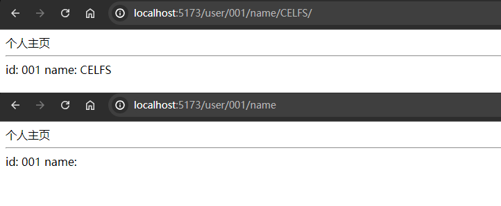
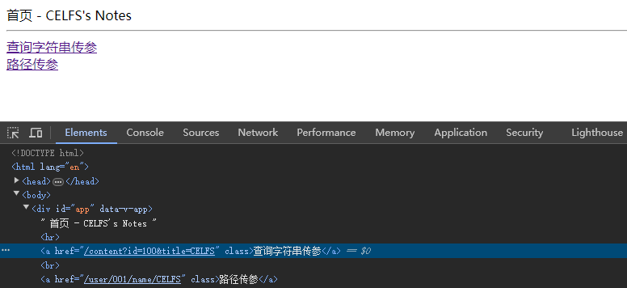
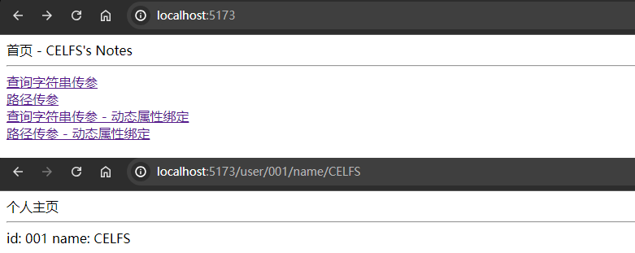
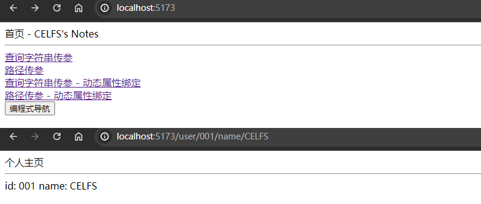
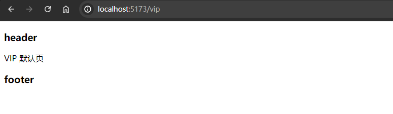
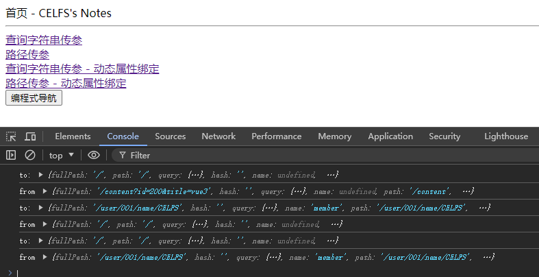
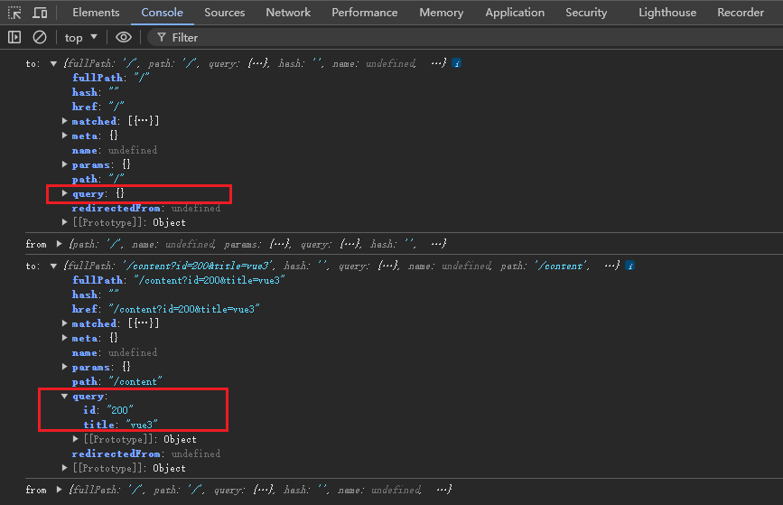
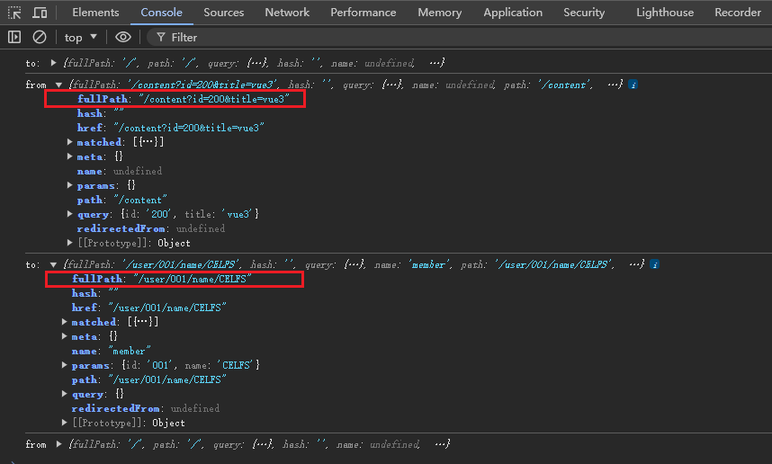

## 02 Task Vue Router4

Date：2024/07/06 15:40:10

------


[TOC]


------


### 00 进度

* 开始课程（2024/07/06）
* 完成课程（2024/07/06）


------


### 00 信息补充

* 原型设计


------


### 01 安装和设置路由

#### 01 代码流程

* 1）安装 [Vue-router](https://router.vuejs.org/zh) 

```bash
npm install vue-router@4
```

* 2）创建目录
  * `./src/views` --> `index.vue` + `content.vue` 
  * `./src/router` --> `index.js` 
* 3）创建路由规则 + 创建路由器 `index.js` 
  * 路由规则用于创建路由器；
  * 路由器历史具有两种模式 --> 按需选择
    * 传统模式
    * Hash模式（ `/#/` 标识，与个人笔记网址后缀路径一致）
  * 导出路由器模块

```js
// import { createRouter, createWebHistory } from 'vue-router'
import { createRouter, createWebHashHistory } from 'vue-router'

// 创建路由规则（数组存储）
const routes = [
    {
        path: "/",
        component: () => import("../views/index.vue")
    },
    {
        path: "/content",
        component: () => import("../views/content.vue")
    },
];

// 创建路由器
const router = createRouter({
    // history: createWebHistory(),  // 传统模式
    history: createWebHashHistory(), // Hash模式，'#'标识，模拟 url 路径变化，不会触发页面刷新，不需服务端支持
    routes
});

// 导出路由器
export default router;
```

* 4）导入路由器模块

```javascript
// main.js
import { createApp } from 'vue';
import App from './App.vue';

import router from './router';

createApp(App).use(router).mount('#app');
```

* 5）添加路由器标签

```vue
<!-- App.vue -->
<script setup>

</script>

<template>
    <router-view />
</template>

<style scoped>

</style>
```

* 6）其余初始文件

```vue
<!-- index.vue -->
<script setup>
</script>
<template>
    首页 - CELFS's Notes
</template>
<style scoped>
</style>

<!-- content.vue -->
<script setup>
</script>
<template>
    内容页 - CELFS's Learning
</template>
<style scoped>
</style>
```

#### 02 页面效果


#### 00 疑问 / 感悟

* JS 文件以及 Vue 具体是如何协作的？为什么会有同名的不同格式文件？是一种逻辑串联上的需要？但是，例如 `index.js` 和 `index.vue`，前者负责定义路由规则与路由器，后者负责展示首页，而它们的功能完全不同。
* 除此以外，`App.vue` 与其他 `.vue` 文件的关系又是怎样的？前者相当于 `main` 入口？而其他则表示 SFC 含义下的单页面组件（文件），属于整体项目的某个页面组成？
* 如何理解 Hash 模式使用 `#` 符号模拟 URL 路径变化？为什么不会触发页面刷新？这个行为意味着什么？例如页面可能刷新后会导致某数据重置，而 Hash 模式使得页面可保持某些临时状态，并且增量加载请求的内容？
  * 如果不会刷新页面，是否意味着对局部渲染更友好？这里刷新意义，于使用 `router-link` 替换普通 `a` 标签的目的是一样的吗？
* `router-link` 相比于传统的 `a` 标签，不会刷新页面，可实现局部更新渲染。


------


### 02 配置路径别名@和VSCode路径提示

#### 01 代码流程

* 1）导入模块 `path` 
  * `demo/vite.config.js` 
  * 添加 `resolve` 参数

```javascript
// vite.config.js
import { defineConfig } from 'vite';
import vue from '@vitejs/plugin-vue';
import path from 'path'; // 导入 node.js path

// https://vitejs.dev/config/
export default defineConfig({
  plugins: [vue()],
  resolve: {
    alias: { // 配置路径别名
      '@': path.resolve(__dirname, 'src')
    }
  }
});
```

* 2）配置路径补全
  * 创建配置文件 `jsconfig.json` 
  * 若为 TS，则创建 `tsconfig.json` 
  * 若跳转页面导致路径补全失效，可添加插件 “别名路径跳转”（已安装）

```javascript
// jsconfig.json
{
    "compilerOptions": {
        "baseUrl": ".",
        "paths": {
            "@/*": [
                "src/*"
            ] // 配置 @ 符号指向 src 目录及其子目录
        }
    }
}
```

* 3）使用路径别名 `@` 导入组件

```javascript
// import { createRouter, createWebHistory } from 'vue-router'
import { createRouter, createWebHashHistory } from 'vue-router'

// 创建路由规则（数组存储）
const routes = [
    {
        path: "/",
        component: () => import("@/views/index.vue") // 路径别名
    },
    {
        path: "/content",
        component: () => import("@/views/content.vue")
    },
];

// 创建路由器
const router = createRouter({
    // history: createWebHistory(),  // 传统模式
    history: createWebHashHistory(), // Hash模式，'#'标识，模拟 url 路径变化，不会触发页面刷新，不需服务端支持
    routes
});

// 导出路由器
export default router;
```

* 页面效果（与 02 节一致）


------


### 03 使用查询字符串或路径传递参数

#### 01 代码流程

* 1）输入带参 URL

```bash
# url 带查询参数
# /xxx/pageName?str1=xxx&str2=xxx
http://localhost:5173/content?id=100&title=CELFS
```

* 2）查询字符串
  * 插值表达式 `query` 方法

```vue
<!-- content.vue -->
<script setup>
</script>

<template>
    内容页 - CELFS's Learning <hr>

    id: {{ $route.query.id }} <br>
    title: {{ $route.query.title }}
</template>

<style scoped>
</style>
```

* 3）路径传递参数
  * 添加路径，参数规则为：
    * `/user`：非带参路径
    * `/user/:id`：带一个参数，且强制使用参数
    * `/user/:id/name/:name`：带两个参数，均强制使用
    * `/user/:id/name/:name?`：带两个参数，`:name?` 参数**值可缺省** 
    * 在参数**值可缺省**的情况下，页面该参数可通过传递 URL 值**修改或更新** 
  * 使用路由的 `params` 方法

```javascript
import { createRouter, createWebHistory } from 'vue-router'
// import { createRouter, createWebHashHistory } from 'vue-router'

// 创建路由规则（数组存储）
const routes = [
    {
        path: "/",
        component: () => import("@/views/index.vue")
    },
    {
        path: "/content",
        component: () => import("@/views/content.vue")
    },
    {
        path: "/user/:id/name/:name?",
        component: () => import("@/views/user.vue")
    },
];

// 创建路由器
const router = createRouter({
    history: createWebHistory(),  // 传统模式
    // history: createWebHashHistory(), // Hash模式，'#'标识，模拟 url 路径变化，不会触发页面刷新，不需服务端支持
    routes
});

// 导出路由器
export default router;
```

```vue
<!-- user.vue -->
<script setup>
</script>

<template>
    个人主页 <hr>

    id: {{ $route.params.id }}
    name: {{ $route.params.name }}
</template>

<style scoped>
</style>
```

#### 02 页面效果

* `name` 参数具体值可缺省
* 注意，是参数的值可缺省，URL **参数名称不能缺省**，否则提示找不到路径



#### 00 疑问

* 路由 `path` 规则的设置，路径形式、参数形式 `:pathName` 与 Linux 的环境变量配置格式相当一致，是否有直接的关联？或者由于 URL 的格式标准，是基于主流服务器为 Unix 与 Linux 内核而设计的？
* 那么，Linux 环境变量路径，是否有关于 `:pathName?` 这种可缺省的语法？
* 通过几个实例，稍微能够理解路由对于页面路径管理的意义。
* 学习了这部分内容，可以优化个人网址的路径名称，同时也优化搜索插件的使用体验。


------


### 04 router-link、定义别名、定义路由名称、编程式导航

#### 01 代码流程

* 1）定义别名

```javascript
// 创建路由规则（数组存储）
const routes = [
    {
        path: "/",
        // alias: "/home",
        alias: ["/home", "/index"], // 数组存储多个别名
        component: () => import("@/views/index.vue")
    },
];
```

* 2）router-link
  * 定义 `router-link` 标签，添加 `to` 属性
    * 查询字符串传参
    * 路径传参
  * `<router-link />` VS `<a />` 
  * 动态属性绑定 `:to` 

```vue
<script setup>
</script>

<template>
    首页 - CELFS's Notes <hr>

    <router-link to="/content?id=100&title=CELFS">查询字符串传参</router-link> <br>
    <router-link to="/user/001/name/CELFS">路径传参</router-link> <br>

    <router-link :to="{path:'/content', query:{id:200, title:'vue3'}}">查询字符串传参 - 动态属性绑定</router-link> <br>
    <router-link :to="{name:'member', params:{id:'001', name:'CELFS'}}">路径传参 - 动态属性绑定</router-link> <br>
</template>

<style scoped>
</style>
```

* 3）定义路由名称
  * 定义别名 --> 定义真实路径
  * 定义路由别名 --> 不改变真实路径
  * 理解为给该路由规则的适用路径添加了唯一标识 `name: "member"` 

```javascript
// 创建路由规则（数组存储）
const routes = [
    {   // http://localhost:5173/user/001/name/CELFS
        path: "/user/:id/name/:name?", 
        name: "member",
        component: () => import("@/views/user.vue")
    },
];
```

* 4）编程式导航

```vue
<script setup>
    import { useRouter } from 'vue-router';

    const router = useRouter();

    const goTo = () => {
        // router.push("/content?id=100&title=CELFS"); // 跳转到 content 页
        router.push({name:'member', params:{id:'001', name:'CELFS'}}); // 跳转到 user 页
    };
</script>

<template>
    首页 - CELFS's Notes <hr>

    <button @click="goTo()">编程式导航</button>
</template>

<style scoped>
</style>
```

#### 02 完整代码

```javascript
// index.js
import { createRouter, createWebHistory } from 'vue-router'
// import { createRouter, createWebHashHistory } from 'vue-router'

// 创建路由规则（数组存储）
const routes = [
    {
        path: "/",
        // alias: "/home",
        alias: ["/home", "/index"],
        component: () => import("@/views/index.vue")
    },
    {   // http://localhost:5173/content?id=100&title=CELFS
        path: "/content",
        component: () => import("@/views/content.vue")
    },
    {   // http://localhost:5173/user/001/name/CELFS
        path: "/user/:id/name/:name?",
        name: "member",
        component: () => import("@/views/user.vue")
    },
];

// 创建路由器
const router = createRouter({
    history: createWebHistory(),  // 传统模式
    // history: createWebHashHistory(), // Hash模式，'#'标识，模拟 url 路径变化，不会触发页面刷新，不需服务端支持
    routes
});

// 导出路由器
export default router;
```

```vue
<!-- index.vue -->
<script setup>
    import { useRouter } from 'vue-router';

    const router = useRouter();

    const goTo = () => {
        // router.push("/content?id=100&title=CELFS"); // 跳转到 content 页
        router.push({name:'member', params:{id:'001', name:'CELFS'}}); // 跳转到 user 页
    };
</script>

<template>
    首页 - CELFS's Notes <hr>

    <router-link to="/content?id=100&title=CELFS">查询字符串传参</router-link> <br>
    <router-link to="/user/001/name/CELFS">路径传参</router-link> <br>

    <router-link :to="{path:'/content', query:{id:200, title:'vue3'}}">查询字符串传参 - 动态属性绑定</router-link> <br>
    <router-link :to="{name:'member', params:{id:'001', name:'CELFS'}}">路径传参 - 动态属性绑定</router-link> <br>

    <button @click="goTo()">编程式导航</button>
</template>

<style scoped></style>
```

#### 03 页面效果

* 1）`router-link` 实际渲染为 `<a />` 标签



* 2）动态属性绑定



* 3）编程式导航



#### 00 疑问

* 为什么在路径传参的动态属性绑定设置时，需要设置路由名称才能正确访问页面？但是查询字符串传参却能直接使用真实路径？
  * 这可能与路径传参的参数格式解析方式有关，直接解析 `path`，可能会卡在第一个参数 `:id` 的解析上，从而提示路径异常。
  * 这需要进一步了解 `name` 定义路由别名之后，更具体地指定了路径传参时，相应的路由规则，从而使得 `router-link` 唯一定位指定规则的路由器，于是 URL 正确解析，页面也正确返回。
  * 如果是为了唯一标识路径，为什么不直接使用 `id` 属性？路由器函数里是否有 `id` 参数？
    * 基于这个推测，可以将理解优化为对指定路由规则**所适用路径的唯一标识**。
  * 以上基于推测，未核实。
* ~~另外，为什么在路由规则定义同名的属性 `name` ？~~ 
  * ~~调试发现，若不使用同名，那么页面解析失败。~~ 当然失败，属性名错了。
  * 实际上，只是恰巧同名，路由规则的 `name`，是路由规则解析函数（或者创建路由器函数）`createRouter()` 规定的接口，用以定义路由名称。


* 2024/07/06 18:01:01 P1-4，2h20min

------


### 05 嵌套路由结合共享组件

#### 01 概括

* 本节以 VIP 页面为例，将若单页面组件结合起来。

#### 02 代码流程

* 1）创建 VIP 页面
  * `./src/App.vue` --> 添加 `<router-view />`（渲染子组件）
  * `./src/vip.vue` --> 添加 `<router-view />`（渲染子组件）
  * `./src/views/vip` --> `defalut.vue` + `info.vue` + `order.vue` 
  * `./src/components` --> `header.vue` + `footer.vue`（共享组件）

* 2）添加路由规则（嵌套路由）
  * 信息页 --> 订单页 --> 默认页（设为 `/vip` 下的空路径）

```javascript
import { createRouter, createWebHistory } from 'vue-router'
// import { createRouter, createWebHashHistory } from 'vue-router'

// 创建路由规则（数组存储）
const routes = [
    {
        path: "/",
        // alias: "/home",
        alias: ["/home", "/index"],
        component: () => import("@/views/index.vue")
    },
    {   // http://localhost:5173/content?id=100&title=CELFS
        path: "/content",
        component: () => import("@/views/content.vue")
    },
    {   // http://localhost:5173/user/001/name/CELFS
        path: "/user/:id/name/:name?",
        name: "member",
        component: () => import("@/views/user.vue")
    },
    {   // http://localhost:5173/vip
        path: "/vip",
        component: () => import("@/views/vip.vue"),
        children: [
            {   // http://localhost:5173/vip
                path: "",
                component: () => import("@/views/vip/default.vue")
            },
            {   // http://localhost:5173/vip/order
                path: "order",
                component: () => import("@/views/vip/order.vue")
            },
            {   // http://localhost:5173/vip/info
                path: "info",
                component: () => import("@/views/vip/info.vue")
            },
        ]
    }
];

// 创建路由器
const router = createRouter({
    history: createWebHistory(),  // 传统模式
    // history: createWebHashHistory(), // Hash模式，'#'标识，模拟 url 路径变化，不会触发页面刷新，不需服务端支持
    routes
});

// 导出路由器
export default router;
```

* 3）共享组件（共享 --> 非嵌套 --> 组件形式）
  * 导入子组件 `vip.vue` 
  * 渲染子组件
  * 注意，导入子组件的语法格式，不需要添加 `{}` 

```vue
<!-- vip.vue -->
<script setup>
    // 导入子组件
    import Header from '@/components/header.vue';
    import Footer from '@/components/footer.vue';
</script>

<template>
    <Header />

    <router-view />

    <Footer />
</template>

<style scoped></style>
```

#### 03 页面效果



#### 04 疑问

* 观察发现，父组件通常执行渲染操作，而默认页面则往往另外设置。由此，可以分解 vue-element-admin 项目的文件结构。
* 共享组件通常用作定义所有页面的公有元素，例如同一的导航栏、页面尺寸、图片限宽等？待补充。


------


### 06 重定向

#### 01 概括

* 若有新的需求，例如 SVIP 新页面仍然能够访问 VIP 页面，则可使用重定向。

#### 02 实现方式

* 1）添加重定向属性 `redirect`；
* 2）编程式导航（参数形式）。

```javascript
const routes = [
    {
        path: "/svip",
        // redirect: "/vip" // 直接添加
        redirect: { name: 'member', params: { id: '001', name: 'CELFS' } } // 编程式导航传参
    }
];
```

#### 00 疑问

* `redirect` 接收的参数与编程式导航相同，或许都是对同一个跳转方法的封装？


------


### 07 全局前置守卫

#### 01 概括

* 全局前置守卫（后端：前置中间件），用于对请求拦截。例如用户未登录，不得访问相应的订单页面、个人信息页面。
* 分类
  * 全局前置守卫（常用）
  * 全局解析守卫
  * 全局后置钩子

#### 02 经验

* 实际开发中，很少有前端去写权限判断，从安全的角度，控制台容易直接注入 JS，因此，一般的权限判断都是由后端进行拦截。

#### 02 代码流程

* 1）跟踪路由
* 2）设置拦截（点击链接 --> 未发生跳转 --> 被拦截）

```javascript
import { createApp } from 'vue';
import App from './App.vue';

import router from './router';

// createApp(App).use(router).mount('#app');
const app = createApp(App);
app.use(router);

// 全局前置守卫
router.beforeEach((to, from, next) => {
    console.log("to:", to);     // 即将进入的路由信息
    console.log("from", from);  // 即将离开的路由信息

    // next();
    if (to.name == "member") {
        next(false); // 拦截
    } else {
        next();      // 继续
    }
});

app.mount("#app");
```

#### 03 页面效果



* 1）前后传递了 `query` 参数



* 2）从子页面返回，以及进入另一个子页面



#### 00 疑问

* ~~如何实现课程演示的 to 和 from 打印？是基于router-link 标签，还是需要监听点击事件？~~ 看漏了一个步骤，这实际就是全局前置守卫的工作内容。


* 2024/07/06 19:37:27 P5-7，1h28min

------


## 本篇完