## 03 Task ElementPlus UI

Date：2024/07/07 15:15:08

------


[TOC]


------


### 00 策略

* 下一步补充
  * Node.js 以了解与后端的协作关系；
  * Vuex 对比前面学习的 Vite，可简单了解原生工具；
  * 这几天的学习内容整理、总结、复盘，建立体系关系；
  * 再之后，开始vue-admin-template；
  * 找时间补充 JS、TS 知识。

### 00 进度

* 开始课程（2024/07/07）
* 完成课程（2024/07/07）


------


### 00 信息补充

* [ElementPlus 组件](https://element-plus.org/zh-CN/component/overview.html) 
* one editor  富文本编辑器
* 如此一轮学习下来，得到了什么，又失去了什么？
  * 得到，学会了大部分的基础用法、前端组件之间的关系、方向性的内容；
  * 失去，需要用某个 API 的时候，忘记了其参数、输入的格式、属性等。不过，这种信息从不断使用当中熟悉即可，并不需要背诵。
* JS 的作用域知识


------


### 01 按钮

* 概括
  * ElementPlus 是一个基于 Vue3 的 UI 框架。
* 1）安装

```bash
 npm install element-plus --save
```

* 2）导入模块 + 注册组件
  * 整体导入（便于学习，知道组件从何来）
  * 按需导入（需安装3个插件，便于维护）（见 14 节）

```javascript
// main.js
import { createApp } from 'vue';

// 整体导入 ElementPlus 组件库
import ElementPlus from 'element-plus'; // 导入 ElementPlus 组件库的所有模块和功能
import 'element-plus/dist/index.css';   // 导入 ElementPlus 组件库所需的全局 CSS 样式

import App from './App.vue';

// createApp(App).mount('#app');
const app = createApp(App);
app.use(ElementPlus);
app.mount("#app");
```

* 3）按钮样式

```vue
<!-- App.vue -->
<script setup></script>

<template>
    <h3>celfs.github.io/Notes/#/</h3>

    <h3>按钮</h3>
    <el-button type="default">默认按钮</el-button>
    <el-button type="primary">主要按钮</el-button>
    <el-button type="success">成功按钮</el-button>
    <el-button type="info">信息按钮</el-button>
    <el-button type="warning">警告按钮</el-button>
    <el-button type="danger">危险按钮</el-button>

    <h3>按钮属性</h3>
    <el-button plain>朴素按钮</el-button>
    <el-button round>圆角按钮</el-button>
    <el-button circle>圆</el-button>
    <el-button disabled>禁用按钮</el-button>
    <el-button loading>加载中</el-button>

    <hr>
    <h3>尺寸</h3>
    <el-button size="large">大型按钮</el-button>
    <el-button>默认按钮</el-button>
    <el-button size="small">小型按钮</el-button>
</template>

<style scoped></style>
```

* 页面效果

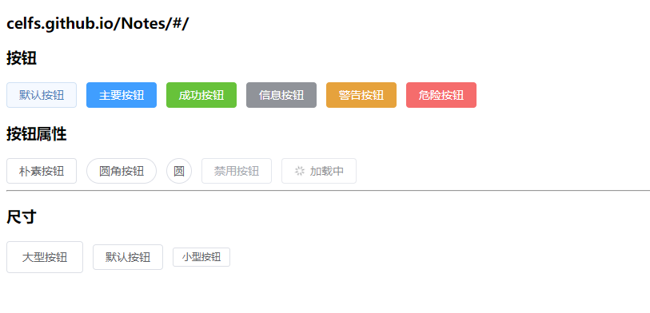

* 疑问
  * 模块的导入，没有路径补全，是否可像 Vue-Router 那样添加路径自动补全的配置信息？


------


### 02 图标

* 1）导入模块 + 注册组件

```javascript
// main.js
import { createApp } from 'vue';

// 整体导入 ElementPlus 组件库
import ElementPlus from 'element-plus'; // 导入 ElementPlus 组件库的所有模块和功能
import 'element-plus/dist/index.css';   // 导入 ElementPlus 组件库所需的全局 CSS 样式
import * as ElementPlusIconsVue from '@element-plus/icons-vue' // 导入 ElementPlus 组件库中的所有图标

import App from './App.vue';

// createApp(App).mount('#app');
const app = createApp(App);

// 注册 ElementPlus 组件库中的所有图标到全局 Vue 应用中
for (const [key, component] of Object.entries(ElementPlusIconsVue)) {
    app.component(key, component);
}
app.use(ElementPlus);

app.mount("#app");
```

* 2）图标样式
  * 图标 --> 属性 --> 按钮配合 --> 按钮组

```vue
<!-- App.vue -->
<script setup></script>

<template>
    <h3>图标</h3>
    <el-icon><Plus /></el-icon>
    <el-icon><Edit /></el-icon>
    <el-icon><Delete /></el-icon>
    <el-icon class="is-loading"><Loading /></el-icon>

    <hr>
    <h3>属性</h3>
    <el-icon size="30" color="red"><Search /></el-icon>

    <hr>
    <h3>按钮</h3>
    <el-button type="primary">
        <el-icon><Search /></el-icon>
        <span> 搜索 </span>
    </el-button>

    <el-button type="primary">
        <el-icon><Search /></el-icon>
    </el-button>

    <el-button type="primary" circle>
        <el-icon><Search /></el-icon>
    </el-button>

    <hr>
    <h3>按钮组</h3>
    <el-button-group>
        <el-button type="primary">
            <el-icon><Plus /></el-icon>
        </el-button>

        <el-button type="primary">
            <el-icon><Edit /></el-icon>
        </el-button>

        <el-button type="primary">
            <el-icon><Delete /></el-icon>
        </el-button>
    </el-button-group>
</template>

<style scoped></style>
```

* 页面效果

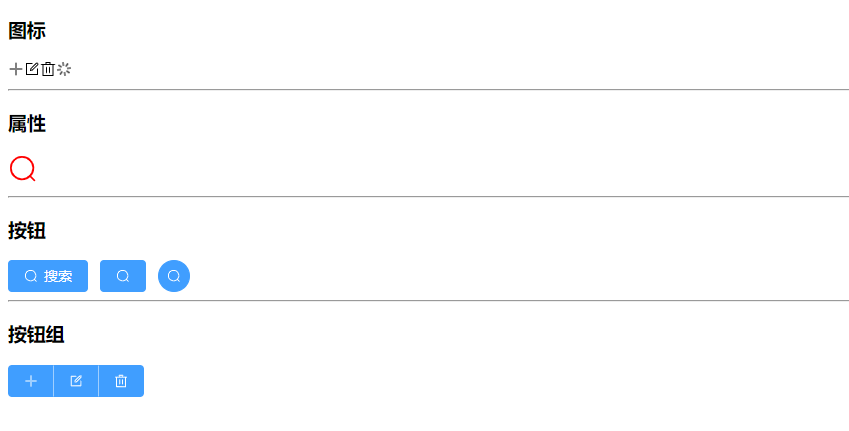


------


### 03 提示框

* 概括
  * 三种常用的提示框，分别为消息、确认、通知。

```vue
<!-- App.vue -->
<script setup>
    import { ElMessage, ElMessageBox, ElNotification } from 'element-plus';

    // 消息
    const openMsg = () => {
        ElMessage({
            type: 'success', // success | warning | info | error
            message: 'celfs.github.io/Notes/#/',
            showClose: true
        });
    };

    // 确认框
    const openConfirm = () => {
        ElMessageBox.confirm('确认删除？', '标题', {
            type: 'warning',
            confirmButtonText: '确认',
            cancelButtonText: '取消'
        }).then(() => {
            console.log('确认');
        }).catch(() => {
            console.log('取消');
        });
    };

    // 通知
    const openNotifiy = () => {
        ElNotification({
            title: '标题',
            message: 'CELFS',
            duration: 1500 // 展示时间（毫秒）
        });
    };

    // 通知2
    const openNotifiy2 = () => {
        ElNotification({
            type: 'success',
            title: '标题',
            message: 'CELFS',
            duration: 1500, // 展示时间（毫秒）
            position: 'bottom-right'
        });
    };
</script>

<template>
    <el-button @click="openMsg">消息</el-button>
    <el-button @click="openConfirm">确认框</el-button>
    <el-button @click="openNotifiy">通知</el-button>
    <el-button @click="openNotifiy2">通知2</el-button>
</template>

<style scoped></style>
```

* 页面效果

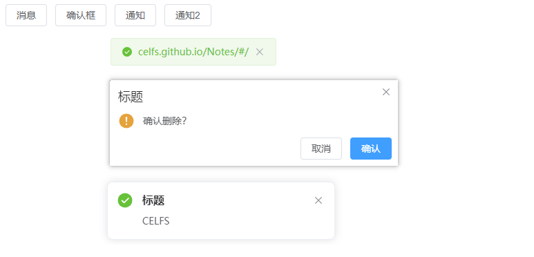

* 疑问
  * 为何此处导入模块，不再是从 `main.js` ？而是在 `App.vue` ？是否遵循了某种导入原则？
  * 为何确认框需要引入 `confirm()` 方法进行配置？不能直接使用 `ElMessageBox` 配置吗？因为使用了 `Box` ？


------


### 04 导航

#### 01 代码流程

* 1）水平导航
* 2）垂直导航
  * 删除 `mode="horizontal"` 属性
  * 定义宽度 `style="width: 200px;"` 
* 3）面包屑导航
  * 可自定义分隔符
* 4）下拉菜单

```vue
<!-- App.vue -->
<script setup>
    import { reactive, ref } from 'vue';

    // 默认选中的菜单索引
    // const selectedIndex = ref("2-2");
    const selectedIndex = ref("3");

    // 选中菜单触发的回调
    const selected = (index, indexPath) => {
        console.log("index", index, "indexPath", indexPath);
    };

    // 用户执行的命令
    const userCommand = (command) => {
        console.log("command:", command); // 点击下拉菜单触发的回调
    };
</script>

<template>

    <h3>水平导航</h3>
    <el-menu mode="horizontal" :default-active="selectedIndex" @select="selected">
        <el-menu-item index="1">CELFS</el-menu-item>
        <el-sub-menu index="2">
            <template #title>我的工作台</template>
            <el-menu-item index="2-1">选项1</el-menu-item>
            <el-menu-item index="2-2">选项2</el-menu-item>
            <el-menu-item index="2-3">选项3</el-menu-item>
        </el-sub-menu>
        <el-menu-item index="3">消息中心</el-menu-item>
        <el-menu-item index="4">订单管理</el-menu-item>
    </el-menu>

    <h3>水平导航-自定义样式</h3>
    <el-menu mode="horizontal" :default-active="selectedIndex" @select="selected" background-color="#545c64"
        text-color="#fff" active-text-color="#ffd04b" style="height: 40px; width:600px;">
        <el-menu-item index="1">CELFS</el-menu-item>
        <el-sub-menu index="2">
            <template #title>我的工作台</template>
            <el-menu-item index="2-1">选项1</el-menu-item>
            <el-menu-item index="2-2">选项2</el-menu-item>
            <el-menu-item index="2-3">选项3</el-menu-item>
        </el-sub-menu>
        <el-menu-item index="3">消息中心</el-menu-item>
        <el-menu-item index="4">订单管理</el-menu-item>
    </el-menu>
    
    <h3>垂直-自定义样式</h3>
    <el-menu :default-active="selectedIndex" @select="selected" background-color="#545c64"
        text-color="#fff" active-text-color="#ffd04b" style="width:200px;">
        <el-menu-item index="1">CELFS</el-menu-item>
        <el-sub-menu index="2">
            <template #title>我的工作台</template>
            <el-menu-item index="2-1">选项1</el-menu-item>
            <el-menu-item index="2-2">选项2</el-menu-item>
            <el-menu-item index="2-3">选项3</el-menu-item>
        </el-sub-menu>
        <el-menu-item index="3">消息中心</el-menu-item>
        <el-menu-item index="4">订单管理</el-menu-item>
    </el-menu>

    <h3>面包屑</h3>
    <el-breadcrumb separator="/">
        <el-breadcrumb-item><a href="#">首页</a></el-breadcrumb-item>
        <el-breadcrumb-item>CELFS</el-breadcrumb-item>
        <el-breadcrumb-item>celfs.github.io</el-breadcrumb-item>
    </el-breadcrumb>

    <h3>下拉菜单</h3><br>
    <el-dropdown @command="userCommand">
        <span>
            个人中心<el-icon><User /></el-icon>
        </span>
        <template #dropdown>
            <el-dropdown-menu>
                <el-dropdown-item command="order">订单</el-dropdown-item>
                <el-dropdown-item command="logout">退出</el-dropdown-item>
            </el-dropdown-menu>
        </template>
    </el-dropdown>
</template>

<style scoped></style>
```

* 5）默认展开的菜单索引

```vue
<!-- App.vue -->
<script setup>
    import { reactive, ref } from 'vue';

    // 默认选中的菜单索引
    // const selectedIndex = ref("2-2");
    const selectedIndex = ref("3");

    // 选中菜单触发的回调
    const selected = (index, indexPath) => {
        console.log("index", index, "indexPath", indexPath);
    };

    //默认展开的菜单索引
    const defaultOpeneds = ref(["1", "3"]);
</script>

<template>
    <h3>垂直-自定义样式</h3>
    <el-menu :default-active="selectedIndex" @select="selected" :default-openeds="defaultOpeneds" 
        background-color="#545c64" text-color="#fff" active-text-color="#ffd04b" style="width:200px;">
        <el-sub-menu index="1">
            <template #title>
                <el-icon><Search/></el-icon>
                <span>导航一</span>
            </template>
            <el-menu-item-group>
                <el-menu-item index="1-1">选项1</el-menu-item>
                <el-menu-item index="1-2">选项2</el-menu-item>
            </el-menu-item-group>
        </el-sub-menu>

        <el-menu-item index="2">
                <el-icon><Edit/></el-icon>
                <template #title>导航二</template>
        </el-menu-item>

        <el-sub-menu index="3">
            <template #title>
                <el-icon><Search/></el-icon>
                <span>导航三</span>
            </template>
            <el-menu-item-group>
                <el-menu-item index="3-1">选项1</el-menu-item>
                <el-menu-item index="3-2">选项2</el-menu-item>
            </el-menu-item-group>
        </el-sub-menu>

        <el-sub-menu index="4">
                <template #title>
                    <el-icon><Setting/></el-icon>
                    <span>导航四</span>
                </template>
                <el-menu-item-group>
                <el-menu-item index="4-1">选项1</el-menu-item>
                <el-menu-item index="4-2">选项2</el-menu-item>
            </el-menu-item-group>
        </el-sub-menu>
    </el-menu>

</template>

<style scoped></style>
```

#### 02 页面效果

* 1）水平导航、垂直导航、自定义样式

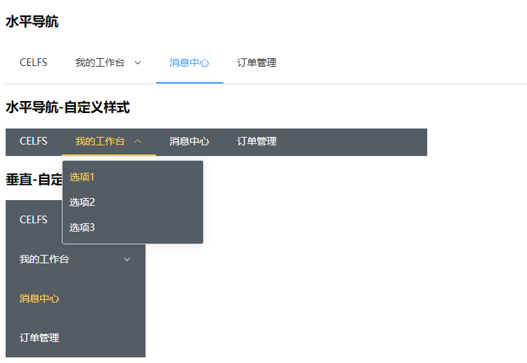

* 2）面包屑、下拉菜单

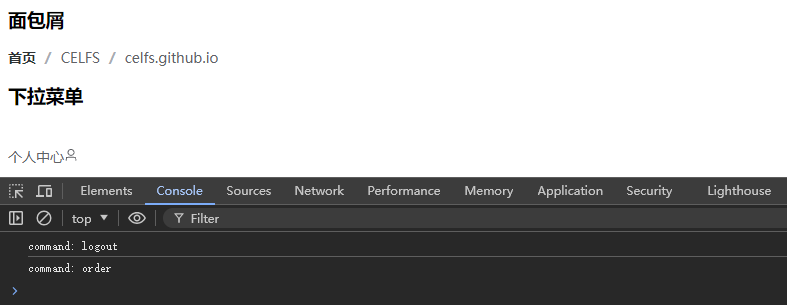

* 3）默认菜单展开

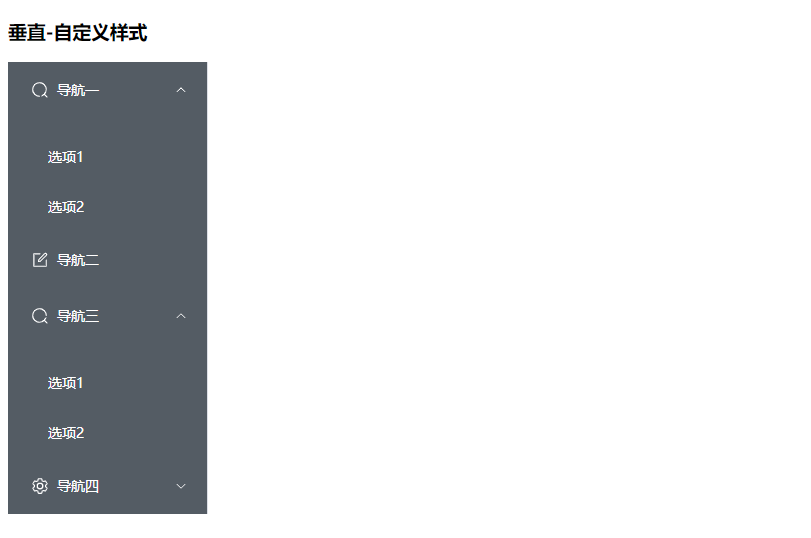

#### 00 疑问

* 需要注意标签的名称，嵌套的层级与预设的关系。
* `template` 标签在菜单标签内部使用，充当什么角色？而在 Vue 模板外层代码中，又充当什么角色？


* 2024/07/07 17:12:12 P1-4，1h57min

------


### 05 标签页

#### 01 代码流程

* 1）默认风格
* 2）卡片风格 `type="card"` 
* 3）卡片风格（边框） `type="border-card"` 
* 4）动态添加标签
* 5）动态移除标签 `closable` 

```vue
<!-- App.vue -->
<script setup>
    import { ref, reactive } from 'vue';

    // 默认选中的标签名称
    const selectedName = ref("2");

    // 选中标签触发的回调
    const tabClick = (tab, event) => {
        console.log("tab", tab.props, "event", event);
    };

    const tab = reactive({
        arr: [
            {name: "1", title: 'CELFS', content: '内容1'},
            {name: "2", title: "CELFS's Learning", content: '内容2'},
            {name: "3", title: 'celfs.github.io', content: '内容3'}
        ]
    });

    // 添加
    const tabAdd = () => {
        let index = tab.arr.length;
        index++;

        tab.arr.push({
            name: index, // 注意，index 不能用于真实项目
            title: '新选项卡' + index,
            content: '内容' + index
        });
    };
    
    // 移除
    const tabRemove = (name) => {
        console.log("name:", name);

        const index = tab.arr.findIndex((value) => {
            return value.name === name;
        });

        tab.arr.splice(index, 1); // 移除元素
    };
</script>

<template>

    <h3>celfs.github.io/Notes/#/</h3>

    <h3>标签页</h3>
    <el-tabs v-model="selectedName" @tab-click="tabClick" type="border-card">
        <el-tab-pane label="CELFS" name="1">内容1</el-tab-pane>
        <el-tab-pane label="CELFS's Learning" name="2">内容2</el-tab-pane>
        <el-tab-pane label="celfs.github.io" name="3">内容3</el-tab-pane>
    </el-tabs>

    <h3>动态添加</h3>
    <el-button @click="tabAdd">添加</el-button>

    <el-tabs v-model="selectedName" @tab-add="tabAdd" @tab-remove="tabRemove" closable type="card">
        <el-tab-pane v-for="(value, key) in tab.arr" :key="value.name" :label="value.title" :name="value.name">
            {{ value.content }}
        </el-tab-pane>
    </el-tabs>

</template>

<style scoped></style>
```

#### 02 页面效果

* 1）默认风格标签

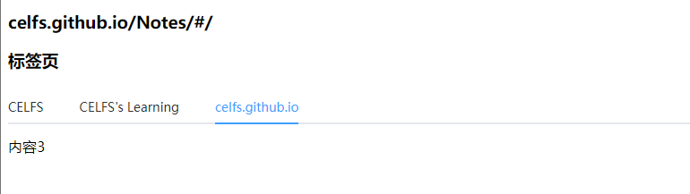

* 2）卡片风格标签

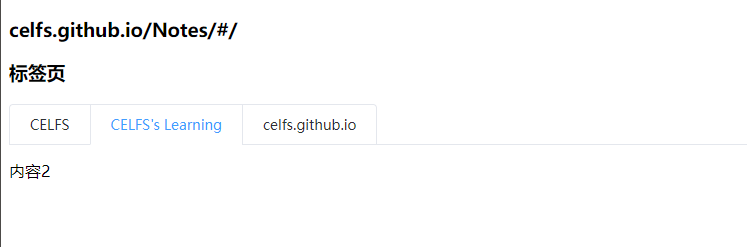

* 3）卡片风格标签（边框）

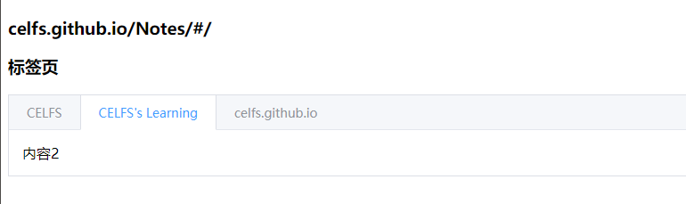

* 4）动态添加或移除标签

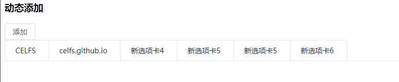

#### 00 疑问

* 实际项目中，不能把 `index` 用作 `name`，那么具体如何配置？使用字符串进行唯一标识？
* 动态移除标签后，新的选项卡编号存在重复计算，可进一步优化。


------


### 06 输入框

#### 01 代码流程

* 1）输入框、文本域
  * 一键清空属性
  * 密码显示或隐藏
  * 输入内容长度限制
* 2）输入框尺寸设置
* 3）前置、后置、前后置

```vue
<!-- App.vue -->
<script setup>
    import { ref } from 'vue';

    const name = ref('');
    const password = ref('');
    const content = ref('CELFS');
    const url = ref('celfs.github.io/Notes/#/');
    const url2 = ref('celfs.github.io');
    const email = ref('123456');
</script>

<template>

    <h3>celfs.github.io/Notes/#/</h3>

    <div style="width: 300px;">
        <!-- clearable 可一键清空 -->
        <h3>输入框</h3>
        <el-input v-model="name" clearable placeholder="请输入用户名" />

        <!-- show-password 可切换显示或隐藏密码 -->
        <h3>密码框</h3>
        <el-input v-model="password" show-password placeholder="请输入密码" />

        <h3>文本域</h3>
        <el-input type="textarea" v-model="content" rows="2" />

        <h3>输入内容长度限制 - 输入框</h3>
        <el-input v-model="name" maxlength="10" show-word-limit />

        <h3>输入内容长度限制 - 文本域</h3>
        <el-input type="textarea" v-model="content" maxlength="20" rows="3" show-word-limit />

        <h3>输入框尺寸</h3>
        大 <el-input size="large" />
        默认 <el-input />
        小 <el-input size="small" />

        <h3>前置</h3>
        <el-input v-model="url">
            <template #prepend>https://</template>
        </el-input>

        <h3>前置</h3>
        <el-input v-model="email">
            <template #append>@qq.com</template>
        </el-input>

        <h3>前置后置</h3>
        <el-input v-model="url2">
            <template #prepend>https://</template>
            <template #append>@qq.com</template>
        </el-input>

        <h3>前置后置扩展 - 搜索</h3>
        <el-input placeholder="请输入课程名称">
            <template #prepend>
                <el-select v-model="selected" placeholder="请选择" style="width: 100px;">
                    <el-option label="前端" value="1" />
                    <el-option label="后端" value="2" />
                    <el-option label="服务端" value="3" />
                </el-select>
            </template>
            <template #append>
                <el-button>
                    <el-icon><Search /></el-icon>
                </el-button>
            </template>
        </el-input>
    </div>

</template>

<style scoped>

</style>
```

#### 02 页面效果

* 1）输入框、文本域，及属性设置

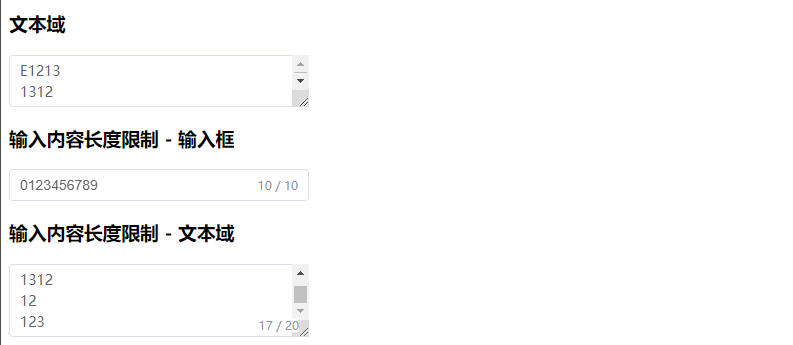

* 2）输入框尺寸

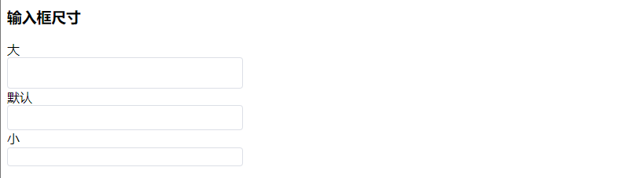

* 3）前置、后置，及扩展搜索

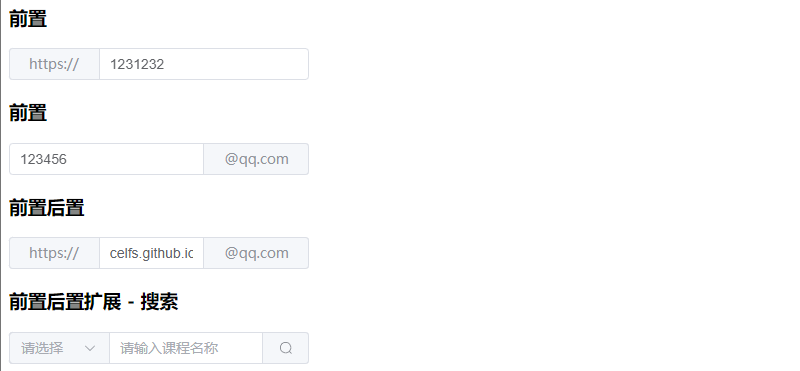


------


### 07 单选框、复选框

#### 01 代码流程

* 1）单选框 --> 单选框事件绑定 --> 单选框组
* 2）复选框 --> 复选框事件绑定

```vue
<!-- App.vue -->
<script setup>
	import { ref } from 'vue';

    // 单选框
    const radio = ref('3');
    const radio2 = ref('b');
    const radio3 = ref('C');

    const radioChange = (val) => {
        console.log("radioChange:", val);
    };

    const radioGroupChange = (val) => {
        console.log("radioGroupChange:", val);
    };

    // 复选框
    const checked = ref(["1", "2"]);
    const checked2 = ref([]);

    const checkboxGroupChange = (val) => {
        console.log("checkboxGroupChange:", val);
    };
</script>

<template>

    <h3>单选框</h3>
    <el-radio v-model="radio" value="1">前端</el-radio>
    <el-radio v-model="radio" value="2">后端</el-radio>
    <el-radio v-model="radio" value="3">服务端</el-radio>

    <h3>单选框 - 事件绑定</h3>
    <el-radio v-model="radio2" value="a" @change="radioChange">前端</el-radio>
    <el-radio v-model="radio2" value="b" @change="radioChange">后端</el-radio>
    <el-radio v-model="radio2" value="c" @change="radioChange">服务端</el-radio>

    <h3>单选框组 - 避免了重复标签</h3>
    <el-radio-group v-model="radio3" @change="radioGroupChange">
        <el-radio value="A">前端</el-radio>
        <el-radio value="B">后端</el-radio>
        <el-radio value="C">服务端</el-radio>
    </el-radio-group>

    <h3>复选框</h3>
    <el-checkbox-group v-model="checked">
        <el-checkbox value="1">前端</el-checkbox>
        <el-checkbox value="2">后端</el-checkbox>
        <el-checkbox value="3">服务端</el-checkbox>
    </el-checkbox-group>

    
    <h3>事件绑定</h3>
    <el-checkbox-group v-model="checked2" @change="checkboxGroupChange">
        <el-checkbox value="1">前端</el-checkbox>
        <el-checkbox value="2">后端</el-checkbox>
        <el-checkbox value="3">服务端</el-checkbox>
    </el-checkbox-group>

</template>

<style scoped></style>
```

#### 02 页面效果

* 1）单选框、事件绑定、单选框组

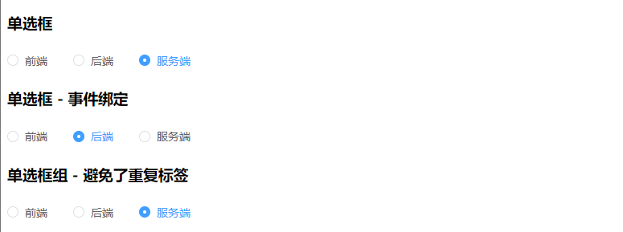

* 2）复选框、事件绑定

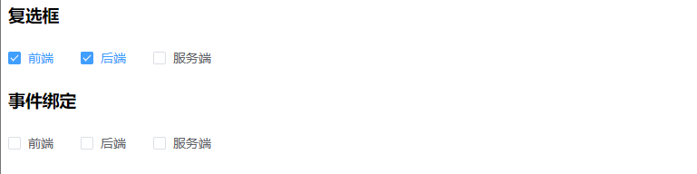

#### 00 疑问

* 复选框的事件绑定，主要是在控制台打印了相应的选项，实际开发时，可结合 API 或者界面元素的修改进行配置业务逻辑。


------


### 08 下拉框

#### 01 代码流程

* 1）下拉框 --> 下拉框事件绑定
* 2）动态下拉框（格式化生成）
* 3）多选 `multiple` 

```vue
<!-- App.vue -->
<script setup>
    import { ref, reactive } from 'vue';

    const selected = ref('2');
    const selected2 = ref('');
    const selected3 = ref('C');
    const selected4 = ref(['1', '3']);

    const data = reactive({
        options: [
            {value: 'A', label: '前端', },
            {value: 'B', label: '后端', },
            {value: 'C', label: '服务端', }
        ]
    });

    // 回调
    const selectChange = (val) => {
        console.log("selectChange:", val);
    };
</script>

<template>

    <div style="width: 300px;">
        <h3>下拉框</h3>
        <el-select v-model="selected" placeholder="请选择">
            <el-option value="1" label="前端"/>
            <el-option value="2" label="后端"/>
            <el-option value="3" label="服务端"/>
        </el-select>

        <h3>下拉框 - 事件绑定</h3>
        <el-select v-model="selected2" @change="selectChange" placeholder="请选择">
            <el-option value="" label=""/>
            <el-option value="a" label="前端"/>
            <el-option value="b" label="后端"/>
            <el-option value="c" label="服务端"/>
        </el-select>

        <h3>动态下拉框</h3>
        <el-select v-model="selected3" placeholder="请选择">
            <el-option v-for="item in data.options"
            :value="item.value"
            :label="item.label"
            :key="item.value" />
        </el-select>

        <h3>多选 - mutiple</h3>
        <el-select v-model="selected4" multiple @change="selectChange" placeholder="请选择">
            <el-option value="1" label="前端"/>
            <el-option value="2" label="后端"/>
            <el-option value="3" label="服务端"/>
        </el-select>
    </div>

</template>

<style scoped></style>
```

#### 02 页面效果

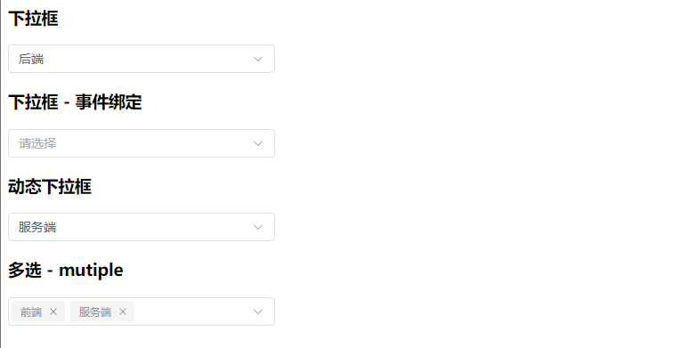


------


### 09 日期选择器

#### 01 代码流程

* 1）日期
* 2）日期 + 时分秒
* 3）日期格式自定义

```vue
<!-- App.vue -->
<script setup>
    import { ref } from 'vue';

    const date = ref('');

    const dateChange = (val) => {
        console.log("dateChange:", val);
    };
</script>

<template>

    <h3>日期 - date</h3>
    <el-date-picker v-model="date" type="date" placeholder="请选择" />

    <h3>日期 - datetime</h3>
    <el-date-picker v-model="date" type="datetime" placeholder="请选择" />

    <h3>事件绑定 + 修改日期格式</h3>
    <el-date-picker v-model="date" type="date" value-format="YYYY-MM-DD HH:mm:ss" @change="dateChange" />

</template>

<style scoped></style>
```

* 4）导入中文语言包

```javascript
// main.js
import { createApp } from 'vue';

// 整体导入 ElementPlus 组件库
import ElementPlus from 'element-plus'; // 导入 ElementPlus 组件库的所有模块和功能
import 'element-plus/dist/index.css';   // 导入 ElementPlus 组件库所需的全局 CSS 样式
import * as ElementPlusIconsVue from '@element-plus/icons-vue' // 导入 ElementPlus 组件库中的所有图标
import zhCn from 'element-plus/dist/locale/zh-cn.mjs'; // 导入 ElementPlus 组件库的中文语言包


import App from './App.vue';

// createApp(App).mount('#app');
const app = createApp(App);

// 注册 ElementPlus 组件库中的所有图标到全局 Vue 应用中
for (const [key, component] of Object.entries(ElementPlusIconsVue)) {
    app.component(key, component);
}

// app.use(ElementPlus);  //将 ElementPlus 插件注册到 Vue 应用中s
app.use(ElementPlus, {
    locale: zhCn // 设置 ElementPlus 组件库的区域语言为中文简体
});

app.mount("#app");
```

#### 02 页面效果

* 1）日期、时分秒、格式修改

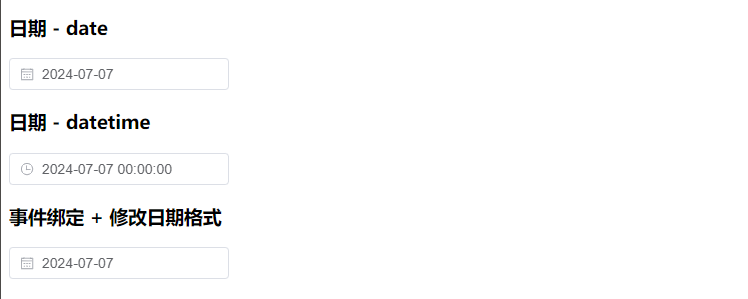

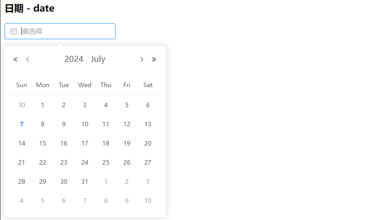

* 2）导入中文语言包

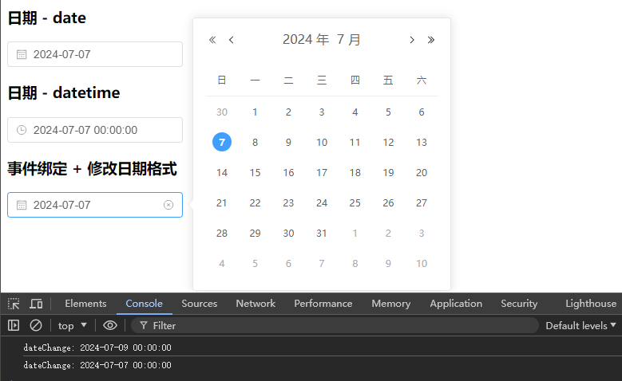


------


### 10 表单

* 概括：将之前所需界面元素做一次融合。

#### 01 代码流程

* 1）定义 `data` 数组，用于存储表单内容
* 2）定义 `add` 与 `reset` 事件
* 3）使用 `el-form` 定义表单范围
* 4）使用 `el-form-item` 定义表单内容
* 5）添加表单内容即可

```vue
<!-- App.vue -->
<script setup>
    import { ref } from 'vue';

    const data = ref({
        name: '',
        radio: '',
        checkbox: [],
        date: '',
        select: '',
        multipleSelect: [],
        textarea: ''
    });

    const add = () => {
        console.log(data.value);
    };

    const reset = () => {
        data.value = {
            name: '',
            radio: '',
            checkbox: [],
            date: '',
            select: '',
            multipleSelect: [],
            textarea: ''
        };
    };
</script>

<template>

    <el-form label-width="80" style="width: 400px;">
        <el-form-item label="文本框">
            <el-input v-model="data.name" placeholder="请填写名称" />
        </el-form-item>

        <el-form-item label="单选框">
            <el-radio-group v-model="data.radio">
                <el-radio value="1">前端</el-radio>
                <el-radio value="2">后端</el-radio>
                <el-radio value="3">服务端</el-radio>
            </el-radio-group>
        </el-form-item>

        <el-form-item label="复选框">
            <el-checkbox-group v-model="data.checkbox">
                <el-checkbox value="a">前端</el-checkbox>
                <el-checkbox value="b">后端</el-checkbox>
                <el-checkbox value="c">服务端</el-checkbox>
            </el-checkbox-group>
        </el-form-item>

        <el-form-item label="日期时间">
            <el-date-picker v-model="data.date" type="datetime" value-format="YYYY-MM-DD HH:mm:ss" />
        </el-form-item>
        
        <el-form-item label="下拉框">
            <el-select v-model="data.select" placeholder="请选择">
                <el-option value="A" label="前端" />
                <el-option value="B" label="后端" />
                <el-option value="C" label="服务端" />
            </el-select>
        </el-form-item>
        
        <el-form-item label="多选框">
            <el-select v-model="data.multipleSelect" multiple placeholder="请选择">
                <el-option value="AA" label="前端" />
                <el-option value="BB" label="后端" />
                <el-option value="CC" label="服务端" />
            </el-select>
        </el-form-item>
        
        <el-form-item label="文本域">
            <el-input type="textarea" v-model="data.textarea" rows="2" placeholder="请填写内容" />
        </el-form-item>
        
        <el-form-item>
            <el-button type="primary" @click="add">添加</el-button>
            <el-button @click="reset">重置</el-button>
        </el-form-item>
    </el-form>

</template>

<style scoped></style>
```

#### 02 页面效果

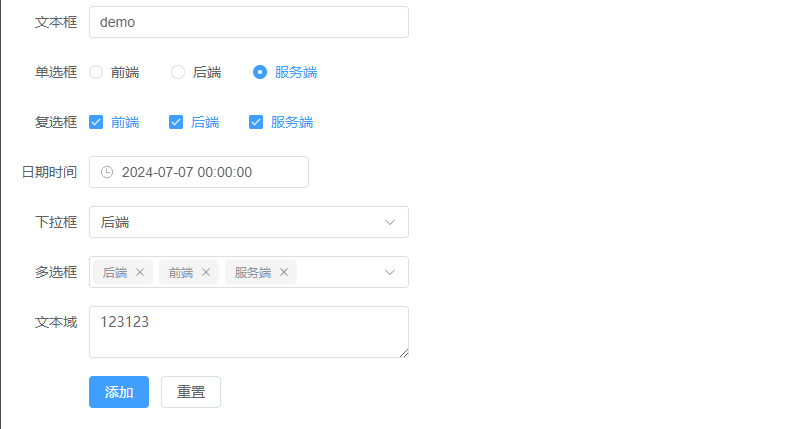

#### 00 疑问

* 注意，复选框和下拉框的多选是不同的。
* 如何更科学地管理 `el-option` 的 `value` 属性？即在避免冲突的情况下，名称标识的规范性。
* 后续可优化，例如 `add` 操作，对接持久化存储。


* 2024/07/07 19:19:44 P5-10，2h7min

------


### 11 对话框

* 概括：在 P10 节代码基础上，添加 `dialog` 标签，以及 `draggable` 属性

#### 01 代码流程

* 1）定义对话框接收变量 `dialog` 
* 2）定义 `dialogClose` 事件
* 3）定义对话框标签 `el-dialog` 
* 4）添加允许拖拽属性 `draggable` 

```vue
<!-- App.vue -->
<script setup>
    import { ref } from 'vue';

    const data = ref({
        name: '',
        radio: '',
        checkbox: [],
        date: '',
        select: '',
        multipleSelect: [],
        textarea: ''
    });

    const add = () => {
        console.log(data.value);
    };

    const reset = () => {
        data.value = {
            name: '',
            radio: '',
            checkbox: [],
            date: '',
            select: '',
            multipleSelect: [],
            textarea: ''
        };
    };

    // 对话框
    const dialog = ref(false);

    const dialogClose = () => {
        console.log("关闭");
    };
</script>

<template>
    <h3>celfs.github.io</h3>

    <el-button @click="dialog = true">打开</el-button>

    <!-- draggable 允许拖拽 -->
    <el-dialog v-model="dialog" width="500" title="标题" draggable @close="dialogClose">
        <el-form label-width="80">
            <el-form-item label="文本框">
                <el-input v-model="data.name" placeholder="请填写名称" />
            </el-form-item>

            <el-form-item label="单选框">
                <el-radio-group v-model="data.radio">
                    <el-radio value="1">前端</el-radio>
                    <el-radio value="2">后端</el-radio>
                    <el-radio value="3">服务端</el-radio>
                </el-radio-group>
            </el-form-item>

            <el-form-item label="复选框">
                <el-checkbox-group v-model="data.checkbox">
                    <el-checkbox value="a">前端</el-checkbox>
                    <el-checkbox value="b">后端</el-checkbox>
                    <el-checkbox value="c">服务端</el-checkbox>
                </el-checkbox-group>
            </el-form-item>

            <el-form-item label="日期时间">
                <el-date-picker v-model="data.date" type="datetime" value-format="YYYY-MM-DD HH:mm:ss" />
            </el-form-item>
            
            <el-form-item label="下拉框">
                <el-select v-model="data.select" placeholder="请选择">
                    <el-option value="A" label="前端" />
                    <el-option value="B" label="后端" />
                    <el-option value="C" label="服务端" />
                </el-select>
            </el-form-item>
            
            <el-form-item label="多选框">
                <el-select v-model="data.multipleSelect" multiple placeholder="请选择">
                    <el-option value="AA" label="前端" />
                    <el-option value="BB" label="后端" />
                    <el-option value="CC" label="服务端" />
                </el-select>
            </el-form-item>
            
            <el-form-item label="文本域">
                <el-input type="textarea" v-model="data.textarea" rows="2" placeholder="请填写内容" />
            </el-form-item>
            
            <el-form-item>
                <el-button type="primary" @click="add">添加</el-button>
                <el-button @click="reset">重置</el-button>
            </el-form-item>
        </el-form>
    </el-dialog>

</template>

<style scoped></style>
```

#### 02 页面效果

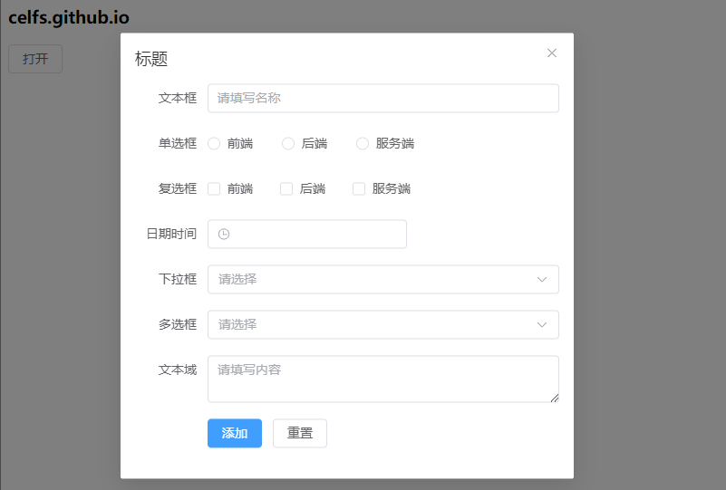

#### 00 疑问

* 如何理解对话框的语法？只是用一个变量接收了 `el-dialog` 标签的对象？


* 2024/07/07 19:31:26 P11，12min

------


### 12 分页

#### 01 代码流程

* 一下均为 `el-pagination` 的属性
  * 1）每页显示记录数 `page-size`、总记录数 `total` 
  * 2）显示背景 `background` （页码背景）
  * `layout` 属性
    * 3）显示总数 `total` 
    * 4）页码跳转 `jumper` 
  * 5）事件绑定
    * 例如识别当前页，并进行所需的处理

```vue
<!-- App.vue -->
<script setup>
    const currentPage = (val) => {
        console.log("currentPage:", val);
    };
</script>

<template>
    
    <h3>page-size: 每页显示记录数 total: 总记录数</h3>
    <el-pagination layout="prev, pager, next" :page-size="10" :total="50" />

    <h3>background: 显示背景</h3>
    <el-pagination layout="prev, pager, next" :page-size="5" :total="50" background />

    <h3>layout="total" 显示总数</h3>
    <el-pagination layout="prev, pager, next, total" :page-size="5" :total="50" />

    <h3>layout="jumper" 跳转</h3>
    <el-pagination layout="prev, pager, next, jumper, total" :page-size="5" :total="50" />

    <h3>事件绑定</h3>
    <el-pagination layout="prev, pager, next" :page-size="5" :total="50" @current-change="currentPage" />

</template>

<style scoped></style>
```

#### 02 页面效果

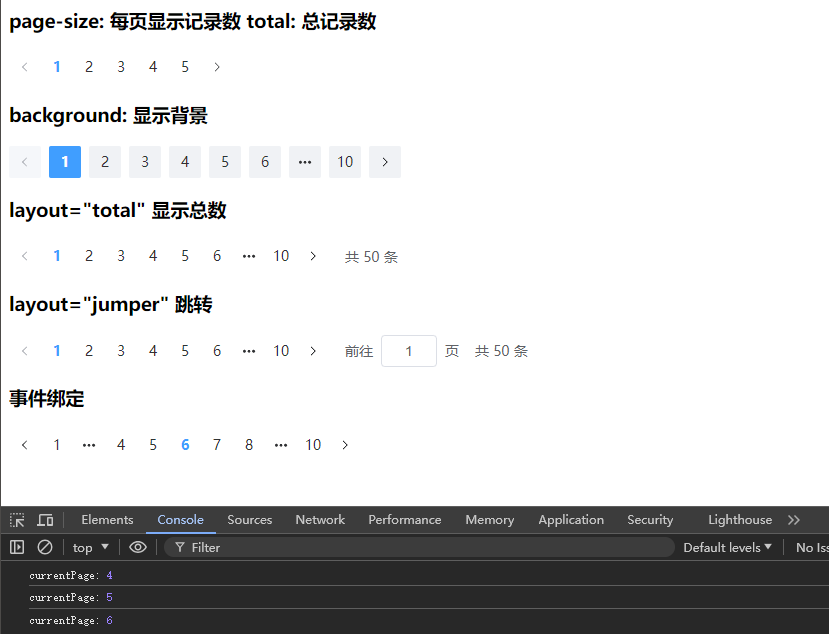

#### 00 疑问

* 如何理解 `:page-size="5"` 属性（每页显示记录数）？太大则会覆盖，太小则显示缩略？
* 如何更便捷地管理不同方法的多种属性？即需要某个标签，它旗下定义了哪些标签，这个内容是否涉及源码？是否有便于查询的插件或文档？


------


### 13 表格

#### 01 代码流程

* 1）定义表格 `el-table` 
  * `prop` 指定表格对象中对应的属性名（用属性名建立与数据列的关联）
  * `label` 列名
  * `border` 添加边框
* 2）表格多选
* 3）添加按钮
* 4）实现按钮事件函数
* 5）`edit` 方法 `scope` 参数
  * `scope` 作用于插槽的参数
  * `scope.$index` 及 `scope.row` 分别表示当前行索引的数据对象
* 6）表格分页 + 事件绑定（课程未实现，需重点补充）

```vue
<!-- App.vue -->
<script setup>
    import { ref } from 'vue'

    const data = ref({
        arr: [
            { id: '1', name: 'CELFS', web: 'celfs.github.io', date: '2024-07-07' },
            { id: '2', name: 'Hilbert', web: 'www.celfs.github.io', date: '2024-07-06' },
            { id: '3', name: 'Michael', web: 'celfs.github.io/Notes', date: '2024-07-05' },
            { id: '4', name: 'Luna', web: 'celfs.github.io/Notes/#/', date: '2024-07-04' }
        ]
    });

    let idArr = [];
    const selected = (data) => {
        console.log("selected:", data);

        idArr = []; // 重置

        data.forEach((value) => {
            idArr.push(value.id);
        });

        console.log("idArr:", idArr);
    };

    //删除
    const del = () => {
        console.log("del:", idArr)
    }

    //编辑
    const edit = (index, row) => {
        console.log("index:", index, "row:", row)
    }  
</script>

<template>

    <h3>表格</h3>
    <el-table :data="data.arr" style="width: 800px;">
        <el-table-column prop="id" label="编号" width="80" />
        <el-table-column prop="name" label="姓名" />
        <el-table-column prop="web" label="网站" width="300" />
        <el-table-column prop="date" label="日期" />
    </el-table>

    <h3>带边框表格</h3>
    <el-table :data="data.arr" border style="width: 800px;">
        <el-table-column prop="id" label="编号" width="80" />
        <el-table-column prop="name" label="姓名" />
        <el-table-column prop="web" label="网站" width="300" />
        <el-table-column prop="date" label="日期" />
    </el-table>

    <h3>设置高度固定表头 - 过长则滚轮查阅</h3>
    <el-table :data="data.arr" border height="120" style="width: 800px;">
        <el-table-column prop="id" label="编号" width="80" />
        <el-table-column prop="name" label="姓名" />
        <el-table-column prop="web" label="网站" width="300" />
        <el-table-column prop="date" label="日期" />
    </el-table>

    <h3>type="selection" 多选</h3>
    <el-table :data="data.arr" border style="width: 800px;">
        <el-table-column type="selection" width="55" />

        <el-table-column prop="id" label="编号" width="80" />
        <el-table-column prop="name" label="姓名" />
        <el-table-column prop="web" label="网站" width="300" />
        <el-table-column prop="date" label="日期" />
    </el-table>

    <h3>按钮</h3>
    <el-button type="primary" @click="del">删除</el-button>

    <el-table :data="data.arr" @selection-change="selected" border style="width: 900px; margin: 3px 0;">
        <el-table-column type="selection" width="55" />

        <el-table-column prop="id" label="编号" width="80" />
        <el-table-column prop="name" label="姓名" />
        <el-table-column prop="web" label="网站" width="300" />
        <el-table-column prop="date" label="日期" />

        <el-table-column label="操作" width="150">
            <template #default="scope">
                <el-button size="small" type="primary" @click="edit(scope.$index, scope.row)">
                    编辑
                </el-button>
                <el-button size="small" @click="del">删除</el-button>
            </template>
        </el-table-column>
    </el-table>

    <el-pagination layout="prev, pager, next, jumper, total" :page-size="5" :total="50" />
</template>

<style scoped></style>
```

#### 02 页面效果

* 1）表格、边框表格

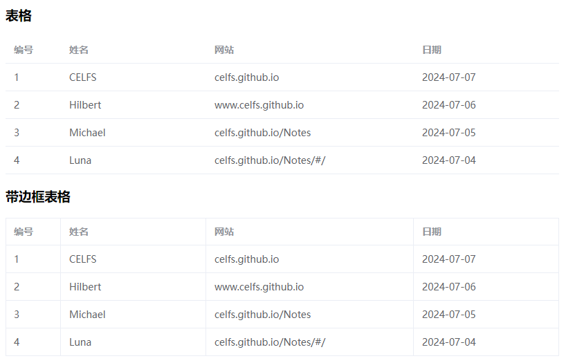

* 2）固定表头高度 --> 滚轮查阅

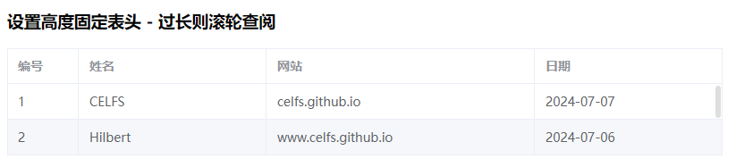

* 3）多选

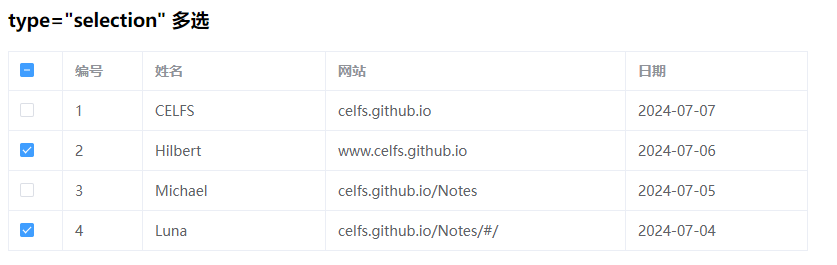

* 4）按钮 + 分页配合（重点操作）

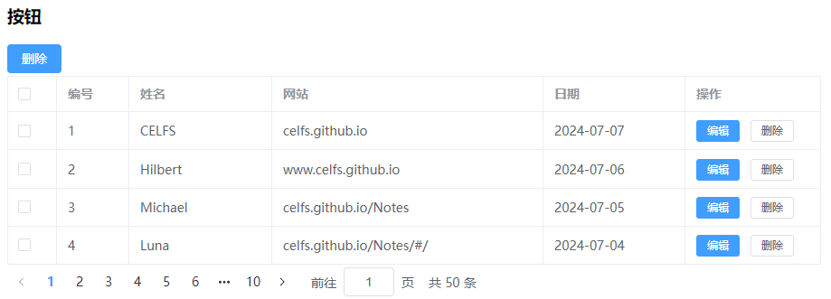

#### 00 疑问

* 如何理解 `scope` 和 `$` 在不同语境下的作用？为何有些参数需要加 `$`，有些则不需要？
* 需补充分页表格的知识，可以从 vue-element-admin 中找找实例。


------


### 14 按需导入

* 概括
  * 按需导入相当于整体导入的一个**减法**。
  * 整体导入（见 01 节）

#### 01 代码流程

* 1）安装插件（自动导入）

```bash
npm install -D unplugin-vue-components unplugin-auto-import
```

* 2）注释整体导入的代码（见 01 节）
* 3）配置文件

```javascript
// main.js
import { createApp } from 'vue';

/*
// 整体导入 ElementPlus 组件库
import ElementPlus from 'element-plus'; // 导入 ElementPlus 组件库的所有模块和功能
import 'element-plus/dist/index.css';   // 导入 ElementPlus 组件库所需的全局 CSS 样式
import * as ElementPlusIconsVue from '@element-plus/icons-vue' // 导入 ElementPlus 组件库中的所有图标
import zhCn from 'element-plus/dist/locale/zh-cn.mjs'; // 导入 ElementPlus 组件库的中文语言包
*/

import App from './App.vue';

// createApp(App).mount('#app');
const app = createApp(App);

/*
// 注册 ElementPlus 组件库中的所有图标到全局 Vue 应用中
for (const [key, component] of Object.entries(ElementPlusIconsVue)) {
    app.component(key, component);
}

// app.use(ElementPlus);  //将 ElementPlus 插件注册到 Vue 应用中s
app.use(ElementPlus, {
    locale: zhCn // 设置 ElementPlus 组件库的区域语言为中文简体
});
*/

app.mount("#app");
```

* 3）安装插件（自动导入图标）

```bash
npm install -D unplugin-icons
```

* 5）配置文件
  * 导入 `unplugin` 模块
  * 添加 `AutoImport` 和 `Components` 配置
  * 导入图标模块
  * 添加 `IconsResolver` 配置
  * 将 `Icons` 设为自动安装 --> 等待安装完成

```javascript
import { defineConfig } from 'vite';
import vue from '@vitejs/plugin-vue';

import path from 'path'; // 导入 node.js path

//unplugin
import AutoImport from 'unplugin-auto-import/vite'
import Components from 'unplugin-vue-components/vite'
import { ElementPlusResolver } from 'unplugin-vue-components/resolvers'
import Icons from 'unplugin-icons/vite' // 图标
import IconsResolver from 'unplugin-icons/resolver'

// https://vitejs.dev/config/
export default defineConfig({
  plugins: [
    vue(),

    AutoImport({
      // 自动导入 Vue 相关函数，如 ref, reactive, toRef 等
      imports: ['vue'],

      resolvers: [
        ElementPlusResolver(),
        // 自动导入图标组件
        IconsResolver(),
      ],
    }),
    Components({
      resolvers: [
        ElementPlusResolver(),
        // 自动注册图标组件
        IconsResolver({
          enabledCollections: ['ep'],
        }),
      ],
    }),
    Icons({
      autoInstall: true,
    }),
  ],
  resolve: {
    alias: { // 配置路径别名
      '@': path.resolve(__dirname, 'src')
    }
  }
});
```

* 4）修改图标前缀
  * 安装完成三个插件，并完成了相关的配置，还需要使用约定的前缀对标签进行引用 --> 修改引用标签
  * 三种**前缀规范**形式
    * `<i-ep->` 
    * `IEp` 
    * `iEp` 

```vue
<!-- App.vue -->
<script setup>
    // 消息
    const openMsg = () => {
        ElMessage({
            type: 'success', // success | warning | info | error
            message: 'celfs.github.io',
            showClose: true
        })
    }

    // 确认框
    const openConfirm = () => {
        ElMessageBox.confirm('确认删除?', '标题', {
            type: 'warning',
            confirmButtonText: '确认',
            cancelButtonText: '取消'
        }).then(() => {
            console.log('确认')
        }).catch(() => {
            console.log('取消')
        })
    }

    // 通知
    const openNotifiy = () => {
        ElNotification({
            title: '标题',
            message: 'CELFS Learning',
            duration: 1500 // 展示时间 [单位:毫秒]
        })
    }

    // 通知2
    const openNotifiy2 = () => {
        ElNotification({
            type: 'success', // success | warning | info | error
            title: '标题',
            message: 'www.celfs.github.io',
            duration: 1500,
            position: 'bottom-right'
        })
    }

    const url = ref('celfs.github.io')
</script>

<template>
    <h3>按钮</h3>
    <el-button>默认按钮</el-button>
    <el-button type="primary">主要按钮</el-button>
    <el-button type="success">成功按钮</el-button>
    <el-button type="info">信息按钮</el-button>
    <el-button type="warning">警告按钮</el-button>
    <el-button type="danger">危险按钮</el-button>

    <h3>图标</h3>
	<!-- 修改图标导入前缀（按照规范形式） -->
    <!-- <el-icon><Plus /></el-icon> -->
    <el-icon><i-ep-Plus /></el-icon> <!-- i-ep- -->
    <el-icon><IEpEdit /></el-icon> <!-- IEp- -->
    <el-icon><IEpDelete /></el-icon>
    <el-icon class="is-loading"><IEpLoading /></el-icon>

    <h3>提示框</h3>
    <el-button @click="openMsg">消息</el-button>
    <el-button @click="openConfirm">确认框</el-button>
    <el-button @click="openNotifiy">通知</el-button>
    <el-button @click="openNotifiy2">通知2</el-button>

    <h3>输入框</h3>
    <el-input v-model="url" placeholder="请输入网址" />
</template>

<style scoped>

</style>
```

#### 02 页面效果

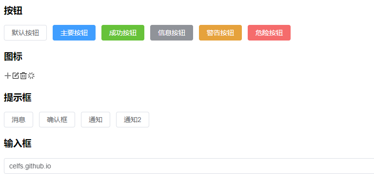


* 2024/07/07 21:15:42 P12-14，1h27min，完成

------

## 本篇完


