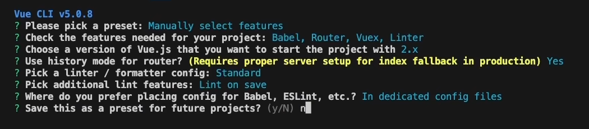
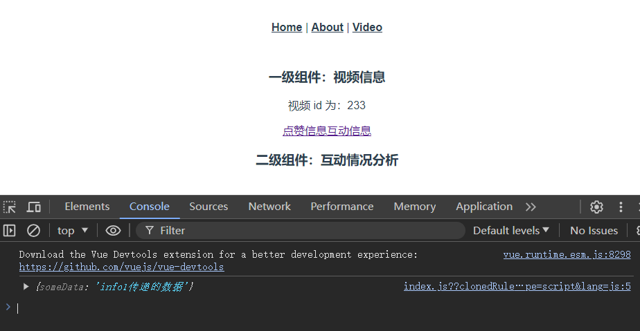
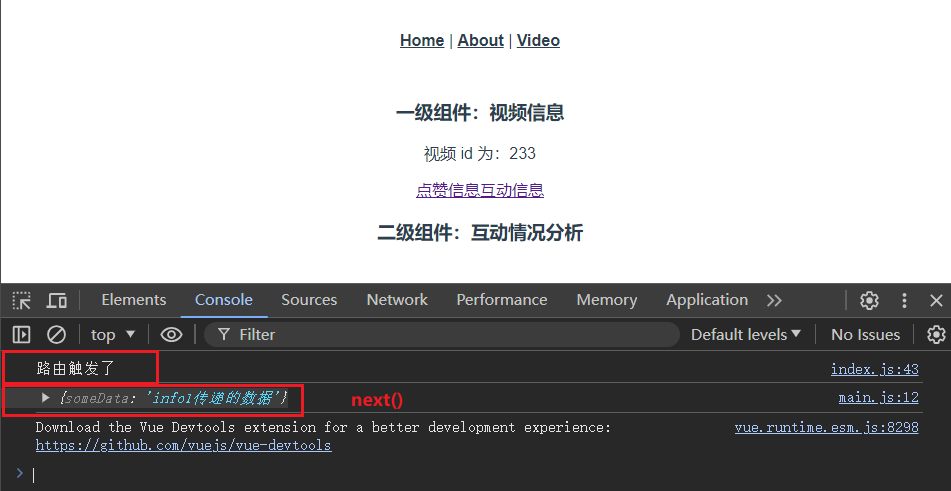
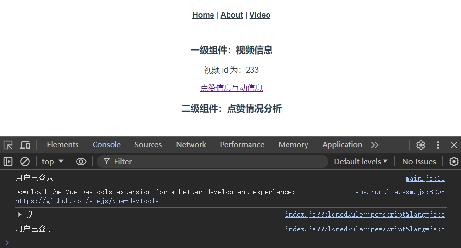
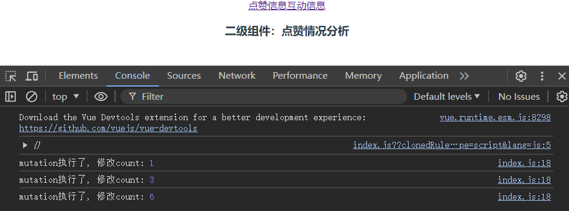

## 05 Task Vue Router & Vuex

Date：2024/07/08 21:59:24

------


[TOC]


------


### 00 进度

* 背景

  * 阅读 Vue-element-admin 登录权限的代码时，遇到了 Vuex 相关的语法与结构对象，避免因为语法问题而耽误理解相关代码模块，这里进行补充。

  * **Vuex 的最新版即 Pinia**，前面课程先学习了 Pinia，但由于 Vue 2 和 Vue 3 存在较大的 API 差异，在阅读使用 Vue 2 开发的项目源码或使用支持 Vue 2 的脚手架或组件开发时，需要 Vue 2 的相关知识，有助于扫清代码障碍。
  * 本课程基于 Vue 2

* 下一步

  * 1）了解从 Vuex 到 Pinia 的过渡；
  * ~~2）路由挂载问题；~~ 
    * 在前端开发中，“挂载”（Mounting）通常指的是将一个组件或应用程序实例连接到 DOM 树中的某个特定节点上的过程。
    * 在 Vue.js 中，挂载是将 Vue 实例及其相关的组件树转换为实际 DOM 元素并将其插入到页面的过程。
  * 3）基于第 2 点，需补充 DOM 相关知识；
  * 4）全局钩子与挂载的关系；
  * 5）`modules` 目录的文件结构。


* 2024/07/09 00:01:10 step 0-11，2h3min
* 2024/07/09 03:15:28 完成，1h53min
* 2024/07/09 03:36:48 部分答疑AI，20min

------


### 00 概要

* 安装 [Vue Devtools 浏览器插件](https://devtools.vuejs.org/guide/installation.html) 
* 单页面应用程序（Single Page Application，SPA）
  * Vue 以单页面模拟多页面的变化，实际上通过 URL 的改变来实现。
  * SPA 的特点是页面加载一次，通过局部更新实现页面之间的切换，而不是每次都从服务器请求新的页面。
* Vue 就是一张桌子，上面放着任意的东西，通过改变桌面的东西，来适应不同的工作环境。
  * 每当需要在桌子上做点什么时（点击 --> 触发路由 --> 改变 URL --> 解析 URL），就撤下一些东西（移除组件），又放上去另一些东西（添加组件）；由此组成了当前工作所需的桌子（当前 URL 所对应的页面内容）。
  * 而当这张桌子满足不了工作需求的时候，就可以跳到外面（访问外链），用其他的工作空间。
  * 那么，跳到外面的操作，与单页面应用程序的机制，是如何兼容配合的呢？
    * `<a href="https://example.com" target="_blank">外部链接</a>` 
    * JS 的 `window.open()` 方法，直接打开外部链接；
    * Vue 可结合 `window.open()` 方法，通过事件处理器实现相同功能；
    * 另外，注意安全问题，防止新窗口被劫持：
      * `<a rel="noopener noreferrer">...</a>` 添加属性；
      * `window.open('url', '_blank', 'noopener');` 添加参数。
* Vue 核心
  * 响应式数据绑定（数据绑定 + 观察者模式 --> 数据 + 视图自动同步）
  * 组件化（开发方式 --> 每个组件封装自身模板、逻辑、样式）
  * 路由（SPA --> 路由管理 + 状态维护 --> 组件切换）
  * 单文件组件（SFC --> 模板、逻辑、样式集中一个文件）


------


### 01 初始化

#### 0）整体流程

* 配路由 --> 定义组件 --> 导入组件

#### 1）创建项目 Vue 2

* 注意，选用了 Standard 代码规范，与前面课程的规范不同，比较严格，例如缩进、多余的分号等，都会导致编译报错（eslint 规范错误）
* 这里，可考虑换一个宽松的标准，不然如果设置了保存即格式化，就需要额外配置了。

```bash
vue create learning_vuex
```



#### 2）运行项目

```bash
cd learning_vuex

npm run serve
```

### 02 Vue Router

* [官方文档](https://router.vuejs.org/zh/) 

#### 3）解读 Vue Router 路由表 / 路由规则

```javascript
// ./src/router/index.js
import Vue from 'vue'
import VueRouter from 'vue-router'
import HomeView from '../views/HomeView.vue'

Vue.use(VueRouter)

const routes = [
  {
    path: '/',			// 当前页面 URL 路径
    name: 'home',		// 如果 URL 太长，则可别称 (alias 类似)
    component: HomeView	// 决定当前页面加载哪些组件
  },
  {
    path: '/about',
    name: 'about',
    // route level code-splitting
    // this generates a separate chunk (about.[hash].js) for this route
    // which is lazy-loaded when the route is visited.
    component: () => import(/* webpackChunkName: "about" */ '../views/AboutView.vue') // 如果组件很多，则以组件包表示
  }
]

const router = new VueRouter({
  // mode: 'history', // 默认 hash 模式，即/#/
  base: process.env.BASE_URL,
  routes
})

export default router
```

#### 4）Vue Router 通过两个标签切换页面

* `<router-link />` 修改路由地址
* `<router-view />` 说明组件显示的位置

```vue
// App.vue
<template>
  <div id="app">
    <nav>
      <router-link to="/">Home</router-link> |
      <router-link to="/about">About</router-link> |
      <router-link :to="{ name: 'about'}">about</router-link>
    </nav>
    <router-view/>
  </div>
</template>
```

#### 5）添加页面文件

* `VideoView.vue` 

```vue
<script>
export default {
  name: 'VideoView'
}
</script>

<template>
    <h3>一级组件：视频信息</h3>
</template>

<style></style>
```

```vue
// App.vue
<template>
  <div id="app">
    <nav>
      <router-link to="/">Home</router-link> |
      <router-link to="/about">About</router-link> |
      <router-link :to="{ name: 'video'}">Video</router-link>
    </nav>
    <router-view/>
  </div>
</template>
```

### 03 动态路由

#### 6）添加动态路由

* `/vide/:id` 中的 `:` 属性，为动态内容，因此称作动态路由
* `props: true` 使得组件内部可访问该动态路由

```javascript
import Vue from 'vue'
import VueRouter from 'vue-router'
import HomeView from '../views/HomeView.vue'
import VideoView from '../views/VideoView.vue'

Vue.use(VueRouter)

const routes = [
  {
    path: '/video/:id',
    name: 'video',
    component: VideoView,
    props: true
  }
]

const router = new VueRouter({
  // mode: 'history', // 默认 hash 模式，即/#/
  base: process.env.BASE_URL,
  routes
})

export default router
```

#### 7）组件内部接收 `id` 属性

* `props` 进行属性接收

```vue
<script>
export default {
  name: 'VideoView',
  props: ['id']
}
</script>

<template>
    <div class="video">
        <h3>一级组件：视频信息</h3>
        <p>视频 id 为：{{ id }}</p>
    </div>
</template>

<style></style>
```

#### 8）使用 `id` 属性

* 修改 `router-link`，有两种方式
  * 直接 URL 赋值；
  * 动态属性绑定（适合 URL 过长的情况）

```vue
// App.vue
<template>
  <div id="app">
    <nav>
      <router-link to="/">Home</router-link> |
      <router-link to="/about">About</router-link> |
      <router-link to="/video/30">Video</router-link> |
      <router-link :to="{ name: 'video', params: { id: 28 }}">Video</router-link>
    </nav>
    <router-view/>
  </div>
</template>
```

### 04 嵌套路由

#### 9）嵌套路由

* 定义嵌套路由（children）属性
* 导入子组件

```javascript
// index.js
import VideoInfo1 from '../views/video/VideoInfo1.vue'
import VideoInfo2 from '../views/video/VideoInfo2.vue'

const routes = [
  {
    path: '/video/:id',
    name: 'video',
    component: VideoView,
    children: [
      { path: 'info1', name: 'video-info1', component: VideoInfo1 },
      { path: 'info2', name: 'video-info2', component: VideoInfo2 }
    ],
    props: true
  }
]
```

#### 10）定义子组件

* 子组件能够 “继承” 父组件 props 属性

```vue
// VideoInfo1.vue
<script>
export default {
  name: 'VideoInfo1'
}
</script>

<template>
  <div class="video-info1">
    <h3>二级组件：点赞情况分析</h3>
  </div>
</template>
```

```vue
// VideoInfo2.vue
<script>
export default {
  name: 'VideoInfo2'
}
</script>

<template>
  <div class="video-info2">
    <h3>二级组件：互动情况分析</h3>
  </div>
</template>
```

#### 11）渲染子组件

* 两个标签的使用（定义路由地址 + 子组件渲染）；
* 注意，需要将子组件包括在同一个  `div` 标签内，否则报错。

```vue
<script>
export default {
  name: 'VideoView',
  props: ['id']
}
</script>

<template>
    <div class="video">
        <h3>一级组件：视频信息</h3>
        <p>视频 id 为：{{ id }}</p>
        <router-link :to="{ name: 'video-info1', params: { id: 233 }}">点赞信息</router-link>
        <router-link :to="{ name: 'video-info2', params: { id: 22 }}">互动信息</router-link>
        <router-view />
    </div>
</template>
```

* 页面效果


### 05 编程式导航

* 前面的操作，都是需要用户点击交互之后实现的组件加载或页面跳转；而例如登录信息失效，应当有自动跳转到首页的类似功能，这种自动触发的跳转，称为编程式导航。

#### 12）路由器实例（自动跳转）

* 效果：点击 `info1` 的 3 秒后，自动跳转到首页；
* `$router` 
  * `router` 路由操作的工具，例如进行一些动作；
  * 可使用路由器实例，其中定义了多种操作方法，可自行查阅[官方文档](https://router.vuejs.org/zh/api/interfaces/Router.html)。

```vue
// VideoInfo1.vue
<script>
export default {
  name: 'VideoInfo1',
  created () {
    setTimeout(() => {
      this.$router.push({ name: 'home' })// 指向路由实例，实现编程式导航（自动跳转）
    }, 3000)
  }
}
</script>

<template>
  <div class="video-info1">
    <h3>二级组件：点赞情况分析</h3>
  </div>
</template>
```

### 06 路由传参与导航守卫

#### 13）路由器实例（自动跳转 + 数据传递）

* `$route` 
  * `route` 查阅路由数据，例如地址、参数。

```vue
// VideoInfo1.vue
<script>
export default {
  name: 'VideoInfo1',
  created () {
    setTimeout(() => {
      this.$router.push({ name: 'video-info2', query: { someData: 'info1传递的数据' } })
    }, 3000)
  }
}
</script>
```

```vue
// VideoInfo2.vue
<script>
export default {
  name: 'VideoInfo2',
  created () {
    console.log(this.$route.query)
  }
}
</script>
```

* 运行效果



#### 14）导航守卫（统一干预）

* 例如某些页面切换，都需要加载进度条等效果，则可以在每一次路由被触发之前，优先触发全局导航守卫（类似拦截）。
* 注意，`next()` 可能有漏洞风险（来源 vue-ele-adm 文章 02）
  * `router.addRoutes` 之后 `next()` 可能失效；
  * 因为可能 `next()` 的时候路由并没有完全 `add` 完成；
  * 文档提供了解决办法，使用 `next(to)` 。

```javascript
// index.js
router.beforeEach((to, from, next) => {
  console.log('路由触发了')
  next()
})
```




------


### 07 Vuex

* Vuex 只是一个统一的数据存储方式。

#### 1）查询数据定义

* 提供**全局共享数据**的存储（组件访问）；
* 建议将属性改为函数的形式；

```javascript
// ./src/store/index.js
import Vue from 'vue'
import Vuex from 'vuex'

Vue.use(Vuex)

export default new Vuex.Store({
  state: {
  },
  getters: {
  },
  mutations: {
  },
  actions: {
  },
  modules: {
  }
})
```

#### 2）全局数据访问

* 将属性修改为函数返回值的形式；
* 使用 `$state` 实例进行数据访问。

```javascript
// ./src/store/index.js
export default new Vuex.Store({
  state () {
    return {
      loginStatus: '用户已登录'
    }
  },
})
```

```vue
<script>
export default {
  name: 'VideoInfo1',
  created () {
    console.log(this.$store.state.loginStatus)
  }
}
</script>
```

* 运行效果



### 08 mutations & acitons

#### 3）全局修改状态（mutations）

* `mutaitons` 
  * 建议在其**属性内部进行所有的修改操作**，而不是在某个组件内修改（理论上可行，但非常难以维护）；
  * `mutaitons` 通过 `commit` 进行提交；
  * `mutaitons` 必须是同步的（Dev Tools 插件统计时间需要，如果是异步提交，则只能记录最终的结果）

```javascript
export default new Vuex.Store({
  state () {
    return {
      loginStatus: '用户已登录',
      count: 0
    }
  },
  getters: {
  },
  mutations: {
    changeCount (state, num) {
      state.count += num
      console.log('mutation执行了, 修改count:', state.count)
    }
  },
})
```

```vue
<script>
export default {
  name: 'VideoInfo1',
  created () {
    this.handler()
  },
  methods: {
    handler () {
      this.$store.commit('changeCount', 1)
      this.$store.commit('changeCount', 2)
      this.$store.commit('changeCount', 3)
    }
  }
}
</script>
```

* 运行效果



#### 4）异步操作（actions）

* `actions` 用于进行异步包装；
* 使用时，需要在 `mutations` 外面包一层，并且使用 `commit` 提交。

```javascript
export default new Vuex.Store({
  state () {
    return {
      loginStatus: '用户已登录',
      count: 0
    }
  },
  getters: {
  },
  mutations: {
    changeCount (state, num) {
      state.count += num
      console.log('mutation执行了, 修改count:', state.count)
    }
  },
  actions: {
    delayChangeCount (store, num) {
      setTimeout(() => {
        store.commit('changeCount', num)
      }, 2000)
    }
  },
  modules: {
  }
})
```

```vue
<script>
export default {
  name: 'VideoInfo1',
  created () {
    this.handler()
  },
  methods: {
    handler () {
      this.$store.commit('changeCount', 1)
      this.$store.commit('changeCount', 2)
      this.$store.dispatch('delayChangeCount', 5)
      this.$store.commit('changeCount', 3)
    }
  }
}
</script>
```

### 09 getter & modules

#### 5）getter

* `getter` 相当于计算属性 `computed`；
* 具有缓存功能。

```javascript
export default new Vuex.Store({
  state () {
    return {
      loginStatus: '用户已登录',
      count: 0
    }
  },
  getters: {
    len (state) {
      console.log('getters执行了')
      return state.loginStatus.length
    }
  },
})
```

```vue
<script>
export default {
  name: 'VideoInfo1',
  created () {
    this.handler()
  },
  methods: {
    handler () {
      this.$store.commit('changeCount', 1)
      this.$store.commit('changeCount', 2)
      this.$store.dispatch('delayChangeCount', 10)
      this.$store.commit('changeCount', 3)
      console.log(this.$store.getters.len)
      console.log(this.$store.getters.len)
      console.log(this.$store.getters.len)
      console.log(this.$store.getters.len)
      console.log(this.$store.getters.len)
      console.log(this.$store.getters.len)
    }
  }
}
</script>
```

* 疑问
  * 这个调试没能感受到缓存的功能，输出的是固定长度的字符串的长度，每次刷新当然是一致的？

#### 6）modules

* 便于管理全局数据，例如有用户模块、登录模块，它们使用的全局信息不同，则可以独立命名，指示不同模块内具有哪些属性。
* 创建 `./src/store/modules` 目录，统一管理模块（具体查阅项目文件）；
* 调用时，中间添加模块名 `$store.a.getters.xx` 。

```javascript
export default new Vuex.Store({
  modules: {
    a: {
      state,
      getters,
      mutations
    },
    b: {
      state,
      mutations,
      actions
    }
  }
})
```

```vue
<script>
export default {
  name: 'VideoInfo1',
  created () {
    this.handler()
  },
  methods: {
    handler () {
      console.log(this.$store.a.getters.len)
      console.log(this.$store.b.getters.len)
    }
  }
}
</script>
```


* 2024/07/09 03:15:18

------

## 本篇完

