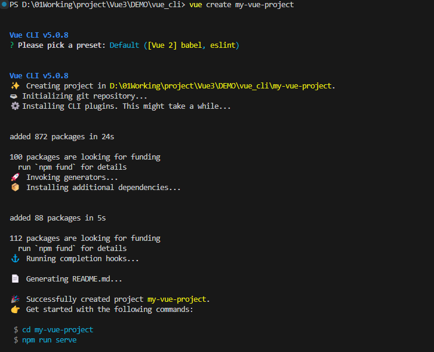
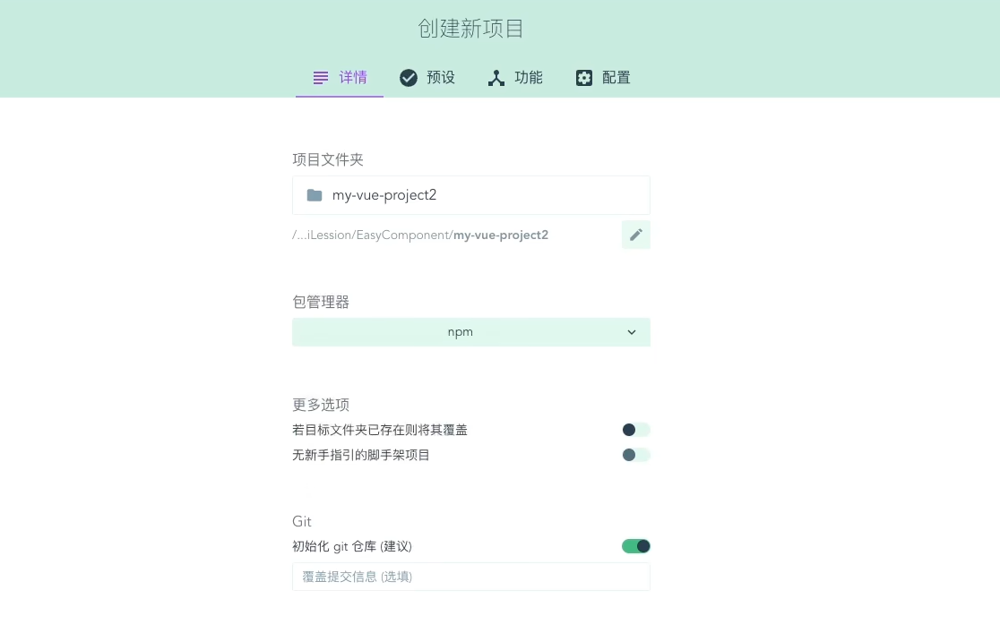
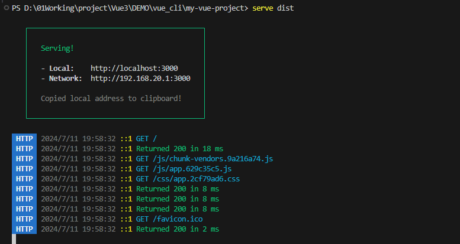
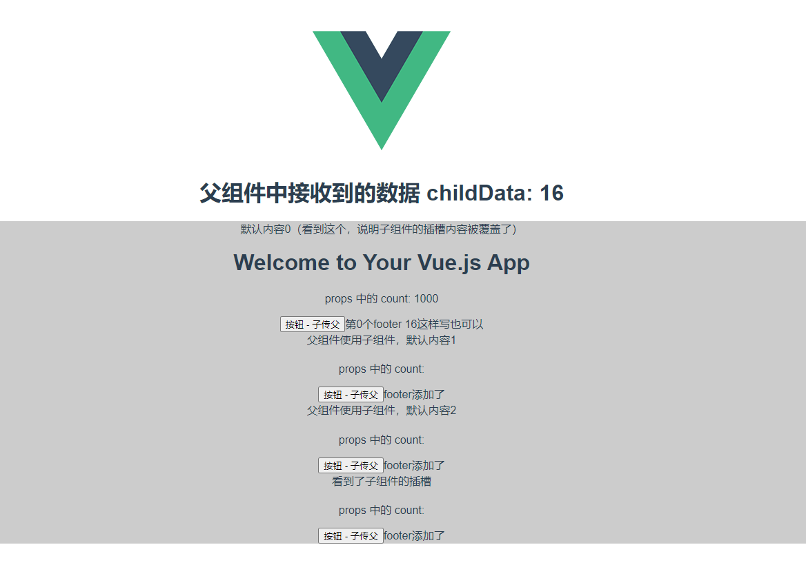

## 06 Task Vue CLI + 组件化开发

Date：2024/07/11 19:36:08

------


[TOC]


------


### 00 进度

* 开始课程（2024/07/11）--> 完成课程（2024/07/11）


------


### 01 Vue CLI

* 基于 webpack 打造的脚手架工具，用于快速创建 Vue 项目。

#### 01 创建项目

* 1）安装
  * Node.js
  * Vue CLI

```bash
# 安装到全局
npm i @vue/cli -g
```

* 2）创建项目

```bash
# 方式一（常用）
vue create my-vue-project

# 方式二：UI
vue ui
```

* 运行效果



* UI 创建项目



#### 02 项目结构

* 0）分析项目
  * `package.json` 配置文件，提供项目运行、打包等方法
  * `node_modules` 第三方工具
  * `public` 图标等不参与编译的资源
  * `src` 参与编译的资源
    * `assets` 例如 `logo.png` --> `base64` 
  * `components` 所有自定义组件
    * `App.vue` 根组件
    * `main.js` Vue 应用的入口文件（Vue 基础配置，例如 Vue 实例）
  * 其他文件
    * `babel.config.js` 即 babel 配置文件
    * `vue.config.js` 即 Vue CLI 配置文件
* 1）运行项目

```bash
npm run serve
```

* 2）项目打包
  * `build` 项目打包 --> `dist` 目录（用于项目上线）

```
npm run bulid
```

* 3）`dist` 项目运行（运行打包的项目）

```bash
npm i serve -g

serve dist
```

* 运行效果




------


### 02 组件化开发

#### 01 组件的作用与本质

* 组件是封装页面部分功能的一种方式，封装结构、样式、逻辑三部分。
  * 例如四个并排结构相似的标签，即可以一个组件为模板，创建 4 个标签实例。
  * 合理划分组件的层级（大中小等），有利于项目维护及专注业务逻辑。


------


#### 02 组件的使用（+ 组件导入机制分析）

* `.vue` 后缀（SFC）
* 定义组件 --> 导入组件

```vue
<script>
import HelloWorld from './components/HelloWorld.vue'

export default {
  name: 'App',
  components: {
    HelloWorld
  }
}
</script>
```

* 实际上，组件相当于定义了相应名称的 HTML 标签
  * 如下，定义同名标签即可使用组件

```vue
<template>
  <div id="app">
    
    <HelloWorld msg="Welcome to Your Vue.js App"/>
  </div>
</template>
```

* `import` **引入组件的机制**
  * 组件内导出一个配置对象；
  * 当 `build` 执行，会对比内置的 HTML 标签，若属性组件标签，则寻找该标签（的配置对象），找到配置对象后，会进行 `new Vue()` 操作；
    * 例如 `App.vue` 根组件并没有父组件，它会在 `main.js` 入口中进行 `new Vue()` 创建。
    * 这种组件化处理方式是统一的，这意味着，每一个 Vue 组件，都是一个独立的 Vue 实例。
  * 总结
    * 1）使用上，**每一个 Vue 组件都是一个自定义 HTML 标签**；
    * 2）实质上，**每一个 Vue 组件都是一个单独的 Vue 实例**。
    * 在编译环节，组件进行结构生成，替换所在的自定义 HTML 标签。
  * 注意
    * 除了 `el` 属性只能在根组件进行设置，子组件并不需要设置 `el` 属性，因为内部子组件取决于实际写标签的位置，而不是挂载到某个特定的位置上。


------


#### 03 组件关联

* 虽然说组件之间是相互独立的，但组件之间也是具有关联性的，这种关联由数据交互体现。
* 这种组件通信的方式，是组件开发**最常用的方式**。

* 1）父传子 `props` 
  * 父组件向子组件传值使用 `props`（子组件接收）
  * `required` 不可缺省（例如，子组件本身是接收父组件某个核心数据，并且做后续逻辑处理的任务，那么这个数据就是必选的）

* 2）子传父
  * 子组件向父组件传递数据，使用**自定义事件**
  * 例如，购物车功能，不同类型的商品加入购物车，需要汇总到整体购物车组件中，而不同类型的商品之间，是不可能知道各自价格的，那么就需要将自己的价格统计结果，各自传递给购物车父组件。
  * 具体机制（kebab-case 风格命名）
    * 子组件自定义一个事件；
    * 父组件监听该事件；
    * 子组件调用 `this.$emit` 触发事件。
* 3）同级互传
  * 父中转（子1 --> 父 --> 子2）
  * `EventBus`（一个额外 Vue 实例，用作数据存储）
* 4）长距离通信
  * 不建议使用上述方法，而使用 Vuex 进行全局状态管理

```vue
<!-- HelloWorld.vue -->
<template>
  <div class="hello">
    <h1>{{ msg }}</h1>
    <p>props 中的 count: {{ count }}</p>
    <button @click="handler">按钮 - 子传父</button>
  </div>
</template>

<script>
export default {
  name: 'HelloWorld',
  // 组件通信
  // 1）父传子：通过 props 进行处理
  // 2）子传父：通过自定义事件处理
  props: {
    msg: String,
    count: {
      type: [String, Number], // 多类型兼容
      // default: 100 // 可选
      required: true  // 必选
    }
  },
  data () {
    return {
      childCount: 0
    }
  },
  methods: {
    handler () {
      this.childCount++;
      this.$emit('child-count-change', this.childCount)
    }
  }
}
</script>

<!-- Add "scoped" attribute to limit CSS to this component only -->
<style scoped>
.hello {
  background-color: #ccc;
}
h3 {
  margin: 40px 0 0;
}
ul {
  list-style-type: none;
  padding: 0;
}
li {
  display: inline-block;
  margin: 0 10px;
}
a {
  color: #42b983;
}
</style>
```

```vue
<!-- App.vue -->
<template>
  <div id="app">
    
    <h1>父组件中接收到的数据 childData: {{ childData }}</h1>
    <HelloWorld
      msg="Welcome to Your Vue.js App"
      :count="parentCount"
      @child-count-change="handler"
    ></HelloWorld>
  </div>
</template>

<script>
import HelloWorld from './components/HelloWorld.vue'

export default {
  name: 'App',
  components: {
    HelloWorld
  },
  data () {
    return {
      parentCount: 1000,
      childData: 0
    }
  },
  methods: {
    handler (childCount) {
      this.childData = childCount;
    }
  }
}
</script>

<style>
#app {
  font-family: Avenir, Helvetica, Arial, sans-serif;
  -webkit-font-smoothing: antialiased;
  -moz-osx-font-smoothing: grayscale;
  text-align: center;
  color: #2c3e50;
  margin-top: 60px;
}
</style>
```


* 2024/07/11 21:34:17 2h4min

------


### 03 组件插槽

* 插槽
  * 可理解为占位符，是提供给父组件使用子组件时，一个**开放的区域**（组件标签内部，例如插入小段 html 内容）。这种方式，比起 `props` 要简洁许多。
  * 利用组件的双标签形式，可在父组件定制不同内容。
  * 子组件设置插槽 `slot` 标签，实际是一个占位符，用以表示父组件在使用子组件时，所设置的默认插槽内容。
  * 分类
    * 匿名插槽
    * 具名插槽
    * 作用域插槽（用于接收数据）
* 注意
  * 子组件标签内部的内容，也属于子组件，即使内容由父组件指定。
  * 因此，如果父组件想要使用子组件标签内的内容，则需要通过**作用域插槽**的方式进行设置。

```vue
<!-- HelloWorld.vue -->
<template>
  <div class="hello">
    <slot>看到了子组件的插槽</slot>
    <h1>{{ msg }}</h1>
    <p>props 中的 count: {{ count }}</p>
    <button @click="handler">按钮 - 子传父</button>
    <!-- <slot name="footer">footer添加了</slot> -->
    <slot name="footer" :childCount="childCount">footer添加了</slot>
  </div>
</template>

<script>
export default {
  name: 'HelloWorld',
  // 组件通信
  // 1）父传子：通过 props 进行处理
  // 2）子传父：通过自定义事件处理
  props: {
    msg: String,
    count: {
      type: [String, Number], // 多类型兼容
      // default: 100 // 可选
      required: true  // 必选
    }
  },
  data () {
    return {
      childCount: 0
    }
  },
  methods: {
    handler () {
      this.childCount++;
      this.$emit('child-count-change', this.childCount)
    }
  }
}
</script>

<!-- Add "scoped" attribute to limit CSS to this component only -->
<style scoped>
.hello {
  background-color: #ccc;
}
h3 {
  margin: 40px 0 0;
}
ul {
  list-style-type: none;
  padding: 0;
}
li {
  display: inline-block;
  margin: 0 10px;
}
a {
  color: #42b983;
}
</style>
```

```vue
<!-- App.vue -->
<template>
  <div id="app">
    
    <h1>父组件中接收到的数据 childData: {{ childData }}</h1>
    <HelloWorld
      msg="Welcome to Your Vue.js App"
      :count="parentCount"
      @child-count-change="handler"
    >默认内容0（看到这个，说明子组件的插槽内容被覆盖了）
      <!-- <template v-slot:footer>第0个footer</template> -->
      <!-- <template #footer>第0个footer，这样写也可以</template> -->
      <!-- <template #footer="dataObj">第0个footer {{ dataObj }}这样写也可以</template> -->
      <template #footer="{ childCount }">第0个footer {{ childCount }}这样写也可以</template>
    </HelloWorld>
    <HelloWorld>父组件使用子组件，默认内容1</HelloWorld>
    <HelloWorld>父组件使用子组件，默认内容2</HelloWorld>
    <HelloWorld></HelloWorld>
  </div>
</template>

<script>
import HelloWorld from './components/HelloWorld.vue'

export default {
  name: 'App',
  components: {
    HelloWorld
  },
  data () {
    return {
      parentCount: 1000,
      childData: 0
    }
  },
  methods: {
    handler (childCount) {
      this.childData = childCount;
    }
  }
}
</script>

<style>
#app {
  font-family: Avenir, Helvetica, Arial, sans-serif;
  -webkit-font-smoothing: antialiased;
  -moz-osx-font-smoothing: grayscale;
  text-align: center;
  color: #2c3e50;
  margin-top: 60px;
}
</style>
```

* 运行效果




* 2024/07/11 22:03:03 25min

------

## 本篇完


