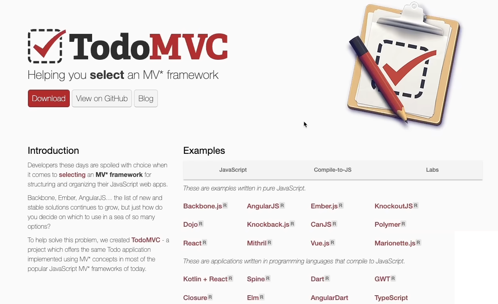
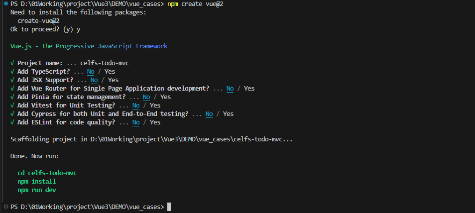
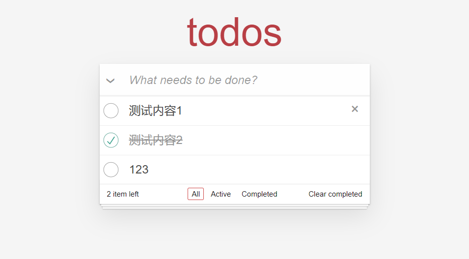

## 07 Task Vue2 综合案例

Date：2024/07/14 18:53:52

------


[TOC]


------


### 00 进度

* 开始课程（2024/07/14）--> 完成课程（2024/07/14）


* 2024/07/14 20:17:37 48min
* 2024/07/14 22:34:46 1h39min

------


### 01 案例

* 待办事项 [TodoMVC](todomvc.com) 




------


### 02 内容

* 1）创建项目

```bash
npm create vue@2
```



* 2）配置基础结构
  * 官方 CSS
  * index.html --> App.vue


------


### 03 功能实现

* 1）实现 todo 全选或取消
  * 看得有点云里雾里，可能因为没有看过 Vue 2 的语法。
  * 现在两种选择：1）马上补 Vue 2；2）先敲完代码，再 AI 答疑，最后补语法。我选择后者 --> 后来发现，只要继续深入认真地分析这个不懂的内容，才发现这是不难理解的（详见疑问一节），那么，当时阻碍我去理解的东西是什么？

* 2）实现激活状态过滤器
  * hash 值监控
  * 监控的位置（元素挂载完毕，mounted 钩子里操作）
  * 完成监控函数
  * 根据 `visibility` 筛选 `todos` 
  * 使用计算属性筛选 `todos` 
  * 将列表遍历属性 `v-for` 设为使用过滤器
* 3）实现列表项统计
* 4）实现列表项新增
* 5）实现列表项删除
* 6）实现一键清理完成项

```vue
<script>
export default {
  data () {
    return {
      todos: [
        {
          id: 123456,
          title: '测试内容1',
          completed: false
        },
        {
          id: 661233,
          title: '测试内容2',
          completed: true
        },
      ],
      visibility: 'all'
    }
  },
  computed: {
    filteredTodos () {
      switch (this.visibility) {
        case 'all':
          return this.todos;
        case 'active':
          return this.todos.filter(todo => !todo.completed);
        case 'completed':
          return this.todos.filter(todo => todo.completed);
      }
    },
    remaining () {
      return this.todos.filter(todo => !todo.completed).length;
    }
  },
  methods: {
    toggleAll (e) {
      this.todos.forEach(todo => {
        todo.completed = e.target.checked;
      })
    },
    onHashChange () {
      const hash = window.location.hash.replace(/#\/?/, '');
      if (['all', 'active', 'completed'].includes(hash)) {
        this.visibility = hash;
      } else {
        window.location.hash = '';
        this.visibility = 'all';
      }
    },
    addTodo (e) {
      const title = e.target.value.trim();
      if (!title) {
        return;
      }
      this.todos.push({
        id: Date.now(),
        title,
        completed: false
      });
      e.target.value = '';
    },
    removeTodo (todo) {
      this.todos.splice(this.todos.indexOf(todo), 1);
    },
    clearCompleted () {
      this.todos = this.todos.filter(todo => !todo.completed);
    }
  },
  mounted () {
    window.addEventListener('hashchange', this.onHashChange);
    this.onHashChange();
  }
}

</script>

<template>
  		<section class="todoapp">
			<header class="header">
				<h1>todos</h1>
				<input @keyup.enter="addTodo" class="new-todo" placeholder="What needs to be done?" autofocus>
			</header>
			<!-- This section should be hidden by default and shown when there are todos -->
			<section class="main">
				<input id="toggle-all" class="toggle-all" type="checkbox" @click="toggleAll">
				<label for="toggle-all">Mark all as complete</label>
				<ul class="todo-list">
					<!-- These are here just to show the structure of the list items -->
					<!-- List items should get the class `editing` when editing and `completed` when marked as completed -->
					<li
            v-for="todo in filteredTodos"
            :key="todo.id" 
            :class="{ completed: todo.completed }"
            >
						<div class="view">
							<input class="toggle" type="checkbox" v-model="todo.completed">
							<label v-text="todo.title"></label>
							<button class="destroy" @click="removeTodo(todo)" ></button>
						</div>
						<input class="edit" value="Create a TodoMVC template">
					</li>
				</ul>
			</section>
			<!-- This footer should be hidden by default and shown when there are todos -->
			<footer class="footer">
				<!-- This should be `0 items left` by default -->
				<span class="todo-count">
          <strong>{{ remaining }}</strong>
          item left
        </span>
				<!-- Remove this if you don't implement routing -->
				<ul class="filters">
					<li>
						<a :class="{ selected: visibility === 'all' }" href="#/all">All</a>
					</li>
					<li>
						<a :class="{ selected: visibility === 'active' }" href="#/active">Active</a>
					</li>
					<li>
						<a :class="{ selected: visibility === 'completed' }" href="#/completed">Completed</a>
					</li>
				</ul>
				<!-- Hidden if no completed items are left ↓ -->
				<button class="clear-completed" @click="clearCompleted">Clear completed</button>
			</footer>
		</section>
</template>

<style>
@import "https://unpkg.com/todomvc-app-css@2.4.1/index.css";
</style>
```

* 优化方向
  * 1）全部清除时，底部 `footer` 应当隐藏，可用 `v-show` 实现；
  * 2）当列表项大于1时，`item` 应该为复数形式 `items`； 
  * 3）双击列表项，应当可以编辑内容，使用 `dbclick` 进入内容，使用 `v-model` 实现内容控制；
  * 4）本地化存储，例如记录已完成并清理的列表项；

* 页面效果



* 疑问

  * 0）为什么 `export default ` 内部会是响应式数据？这不是模块导出的语法吗？那么它导出给谁用了？又是如何响应的？具体又响应了什么？
  * ~~1）一时间反应不过来~~【已解决】
  * `e.target.checked` 这个值用来改变 `todos` 列表的完成状态，于是将其赋值给 `todo.completed`；
  * 由于赋值操作是对 `todos` 遍历进行的，因此将赋值给列表中的所有对象，于是 `toggleAll` 实现了事件触发后，将所有 `todo` 项都同一标记为完成或未完成。

  ```vue
  toggleAll (e) {
  	this.todos.forEach(todo => {
  		todo.completed = e.target.checked;
  	})
  }
  ```
  * 2）如何理解 “这个 hash 肯定不是在生命周期钩子里面实现的，而是通过一个方法” ？为什么要用 `mounted` 方法？不是用在挂载的吗？
  * 3）如何理解 “筛选的时候，为了让它不是每次都重新做操作，我们直接使用计算属性” ？
  * 4）如何理解刷新后，若想保持选中的类别，则在挂载时主动调用一次 `this.onHashChange();` ？不是没有做本地存储吗？为什么调用一次之后，刷新也不会重置选中状态？是因为 `hash` 值不会随着刷新而变？或者在刷新操作前后，上一次的 `hash` 被截获了？
    * 视频的解释为，刷新会重新加载事件的状态，也就不再是之前的 `hashchange` 状态了，那么可以在挂载时，调用一次 `onHashChange()`，使得事件状态重新变为 `hashchange` 


------

## 本篇完


