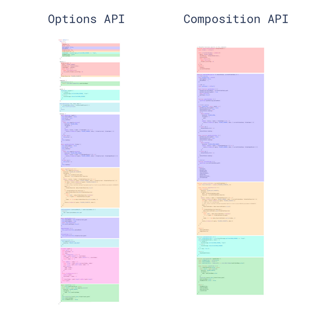
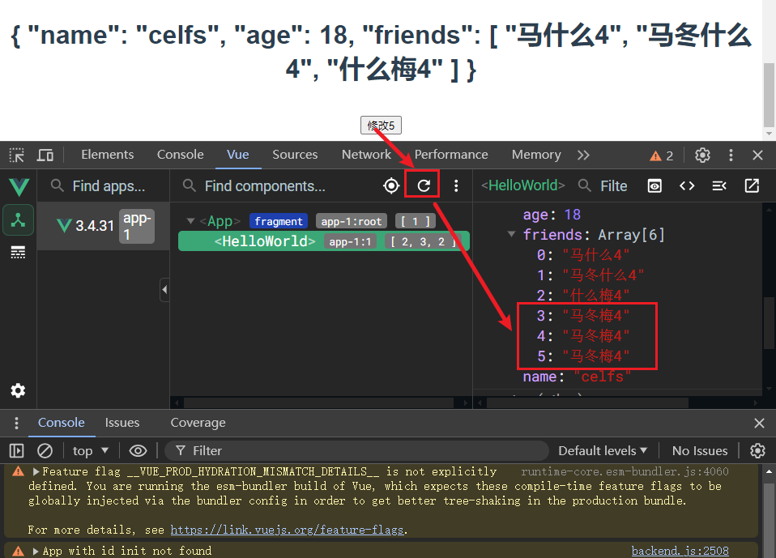
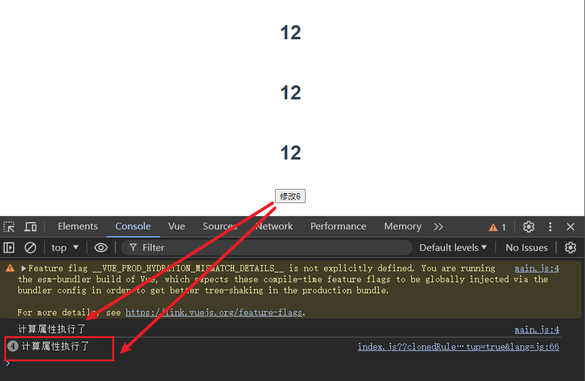
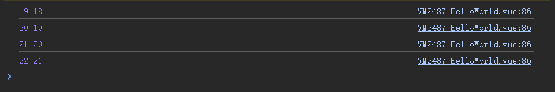
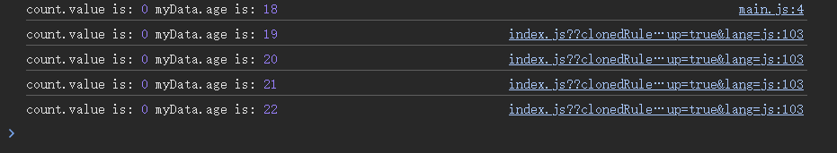

## 08 Task Vue 3 核心语法

Date：2024/07/16 17:16:13

------


[TOC]


------


### 00 进度

* 开始课程（2024/07/16）--> 完成课程（2024/07/16）


* 2024/07/16 19:14:32 2h

* 2024/07/16 21:15:17 1h14min

------


### 01 Vue 3 新特性

* 选项式 API --> 组合式 API

  * 选项式 data、method、computed 等，使用响应式数据时，需要在相关选项进行配置（ `export default` 内部）

  * 组合式

    * [什么是组合式 API，它解决了什么问题](https://cn.vuejs.org/guide/extras/composition-api-faq.html) 

    

  * 学习目标
    * 1）知道不同的声明方式；
    * 2）深刻理解并运用组合式 API 进行相应的逻辑处理。

* 经验

  * 由 Vue 语义逻辑色块标注引发的思考
    * 将相连逻辑的代码，以相同色块标记，便于了解单一逻辑在不同代码片段中的分布情况，从而可以将相关的逻辑统一进行理解。
    * 尝试寻找类似的插件（基于语义逻辑标注），仅找到对相同缩进级别的色块标记。即便没有色块的，**是否有比较好的插件或者好的方法，实现语义逻辑之间的相互跳转**？或者**对于语义逻辑的合适的管理方法**？
    * 可能这个功能难以实现，于是才有了架构层面的调整，即组合式 API 的诞生。
    * **如果能够找到这样一个功能插件，那对于分解项目、理解项目会有很多的帮助，可以沿着一个功能点，直接梳理其逻辑树，于是就掌握了它相关的所有代码与逻辑关系了**。
    * 或许，未来可以自己写一个。
  * 建议先学习 Vue 2，再学习 Vue 3，否则很容易产生一些自由度过高的面条代码，使得混合使用选项式与组合式。


------


### 02 创建项目

```bash
vue creat vue3-core-grammar

cd vue3-core-grammar

npm run serve
```


### 03 Vue 3 文件与入口区别

* `main.js` 
  * Vue 2：使用 `new Vue()` 
  * Vue 3：使用 `createApp()` 
* `App.vue` 
  * Vue 3：不再需要单独的根标签（不必在组件外部套一层空的 div）
  * 注册
    * Vue 2：使用 `export default` 及内部选项进行属性的注册；
    * Vue 3：可兼容 `setup`（选项式）注册，更好的办法是 `<script setup>`（组合式语法糖）
      * `setup` 内部导入的组件，会自动成为当前页面的子组件；
* BUG
  * 使用 Vue 3 时，虽然语法已经支持模板下同时存在多个根标签，但 Error Lens 插件还是会以 Vue 2 的规则进行判断，于是报错。尝试修改配置文件，也未能消除报错。可能还需要在全局的配置中进行设置。
    * setting --> ESLint --> Vetur --> disable (Template) --> 提示消失


------


### 04 响应式数据声明

* `reactive` 
  * 可接收任意**对象**（数组、对象、set对象、map对象）；
  * 可对数据进行**全响应式**的处理；
  * 支持多维数据；
  * 底层实现：基于 ES6 的 proxy，而 proxy 只支持对象参数。
* `shallowReactive` 
  * 浅响应式（根属性为响应式，内层属性为非响应式）；
* `ref` 
  * 适用非对象值，即基本类型值的操作，基于原理，也适用于对象；
  * 底层实现：同样基于 proxy，创建一个空对象，并将 `ref(val)` 的 `val` 值挂在这个对象的 `value` 属性上，从而间接借助对象实现响应式处理。

```vue
<template>
  <div class="hello">
    <h1>{{ myData }}</h1>
    <h1>{{ myData2 }}</h1> <br>
    <button @click="clickHandler">修改</button>
    <button @click="clickHandler2">修改2</button> <br> <hr>
    <h1>{{ count }}</h1> <br>
    <button @click="clickHandler3">修改3</button> <br> <hr>
  </div>
</template>

<script setup>
import { reactive, ref, shallowReactive } from 'vue';

// 1-1）reactive
const myData = reactive([1, 2, 3]);

function clickHandler () {
  myData.push(10);
}

// 1-2）shallowReactive
const myData2 = shallowReactive({
  name: 'celfs',
  age: 18,
  friends: ['马什么', '马冬什么', '什么梅']
});

function clickHandler2 () {
  myData2.friends.push('马冬梅'); // 如果只改内层属性，则不会生效，但若同时修改外层属性，则内层修改可间接生效
  // myData2.age++;
}

// 2）ref
const count = ref(0);

function clickHandler3 () {
  count.value++;
}
</script>

<!-- Add "scoped" attribute to limit CSS to this component only -->
<style scoped>
  h3 {
    margin: 40px 0 0;
  }
  ul {
    list-style-type: none;
    padding: 0;
  }
  li {
    display: inline-block;
    margin: 0 10px;
  }
  a {
    color: #42b983;
  }
</style>
```


------


### 05 非响应式数据声明

* `readonly` 
  * 不可修改，因此也不支持响应式处理，则存储的是非响应式数据。

* `shallowReadonly` 
  * 根属性只读，内部属性非只读；
  * 当修改内部属性时（例如二维内容），修改后需手动刷新才能看到结果，因为这不是响应式的。

```vue
<template>
  <div class="hello">
    <h1>{{ myData3 }}</h1> <br>
    <button @click="clickHandler4">修改4</button> <br> <hr>
    <h1>{{ myData4 }}</h1> <br>
    <button @click="clickHandler5">修改5</button>
  </div>
</template>

<script setup>
import { readonly, shallowReadonly } from 'vue';

// 3）readonly
const myData3 = readonly({
  name: 'celfs',
  age: 18,
  friends: ['马什么3', '马冬什么3', '什么梅3']
});

function clickHandler4 () {
  myData3.age++;
}

// 3）shallowReadonly
const myData4 = shallowReadonly({
  name: 'celfs',
  age: 18,
  friends: ['马什么4', '马冬什么4', '什么梅4']
});

function clickHandler5 () {
  // myData4.friends.push('马冬梅4'); // 内层属性可改
  myData4.age++; // 浅层属性不可改
}

</script>

<!-- Add "scoped" attribute to limit CSS to this component only -->
<style scoped>
  h3 {
    margin: 40px 0 0;
  }
  ul {
    list-style-type: none;
    padding: 0;
  }
  li {
    display: inline-block;
    margin: 0 10px;
  }
  a {
    color: #42b983;
  }
</style>

```

* 运行效果




------


### 06 声明计算属性

* `computed` 
  * 每次调用，创建一个计算属性；
  * 具有缓存功能，例如下面代码调用了三次，而一次修改，同时生效，那么只需要将一次修改的结果缓存起来，第二三次调用直接使用缓存的结果，避免了重复计算。

```vue
<template>
  <div class="hello">
    <h1>{{ getLen }}</h1> <br>
    <h1>{{ getLen }}</h1> <br>
    <h1>{{ getLen }}</h1> <br>
    <button @click="clickHandler6">修改6</button>
  </div>
</template>

<script setup>
import { ref, computed } from 'vue';

// 4）computed
const content = ref('这是一段测试内容');
const getLen = computed(() => {
  console.log('计算属性执行了');
  return content.value.length;
});

function clickHandler6 () {
  content.value += '!';
}

</script>

<!-- Add "scoped" attribute to limit CSS to this component only -->
<style scoped>
</style>
```

* 运行效果




### 07 侦听器

* `watch` 
  * 可侦听值的变化，记录新值和旧值，基于变化情况，做一些侦听后的处理。
  * 适用于侦听单一数据的变化。
  * 侦听目标（都是对象本身）
    * `ref` 数据
    * `reactive` 数据
      * 若需要侦听对象的某一属性，需以函数进行包裹，否则不符合侦听的规则。

```vue
<template>
  <div class="hello">
    <h1>{{ count }}</h1> <br>
    <button @click="clickHandler">修改</button>
    <h1>{{ myData }}</h1> <br>
    <button @click="clickHandler">修改</button>
  </div>
</template>

<script setup>
import { reactive, ref, watch} from 'vue';

// 5）watch
const count = ref(0);
watch(count, (newValue, oldValue) => {
  console.log('watch执行了');
  console.log(newValue, oldValue);
});

const myData = reactive({
  name: 'celfs',
  age: 18,
  friends: ['马什么', '马冬什么', '什么梅']
});
watch(() => myData.age, (newValue, oldValue) => { // 侦听对象属性，需以函数包裹
  console.log(newValue, oldValue);
});

function clickHandler () {
  // count.value++;
  myData.age++;
}
</script>

<!-- Add "scoped" attribute to limit CSS to this component only -->
<style scoped>
</style>
```

* 运行效果




------


### 08 副作用函数

* `watchEffect` 
  * 用法相对简单，内部可设置任意内容，若其中有响应式数据发生变化，则都会触发副作用函数。
  * 适用于侦听一段逻辑，该逻辑可能依赖于多个响应式数据。

```vue
<template>
  <div class="hello">
    <h1>{{ count }}</h1> <br>
    <button @click="clickHandler">修改</button>
    <h1>{{ myData }}</h1> <br>
    <button @click="clickHandler">修改</button>
  </div>
</template>

<script setup>
import { reactive, ref, watchEffect} from 'vue';

// 6）watchEffect
const count = ref(0);
const myData = reactive({
  name: 'celfs',
  age: 18,
  friends: ['马什么', '马冬什么', '什么梅']
});

watchEffect(() => {
  console.log('count.value is:', count.value, 'myData.age is:', myData.age);
  console.log();
});

function clickHandler () {
  // count.value++;
  myData.age++;
}
</script>

<style scoped>
</style>
```

* 运行效果




------

## 本篇完