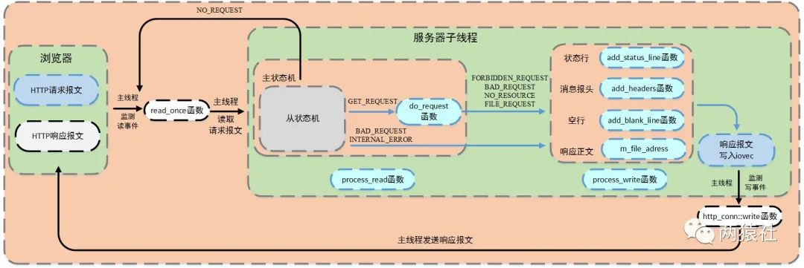

### TinyWebServer

Date：2023/07/30 22:59:14

------


[TOC]


------


### 配套资源

* [讲解文章 01](https://huixxi.github.io/2020/06/02/%E5%B0%8F%E7%99%BD%E8%A7%86%E8%A7%92%EF%BC%9A%E4%B8%80%E6%96%87%E8%AF%BB%E6%87%82%E7%A4%BE%E9%95%BF%E7%9A%84TinyWebServer/#more)
* [开源项目地址](https://github.com/qinguoyi/TinyWebServer)


### 项目分析

* 对象：服务器、客户端、数据库、前端、后端
* 预备知识


------


### 分析 / 疑问

* 如何阅读这个项目？先读哪部分？
  * 应当先有一个总体认知（框架图、新旧版本、资源、背景），并且结合前置知识开始观察
  * 问 ChatGPT 切入点
  * 知识星球项目学习得章法
* 如何读框架图？如何从框架图识别项目主体？
  * 看框架图，各部分都像是耦合的，感觉可以根据框框连接的节点数，来判断权重？
  * 或者尝试跟踪输入，找到项目入口和出口
* 如何制作框架图？
  * 之前要了解过 UML 图（名字不一定对），有相关软件，但觉得不好用
* 学习辅助要求
  * 了解各部分的定位、需求、实现方式
  * 列出陌生词汇、重复出现的词汇
  * 列出各种怀疑、疑问、不清晰的内容
  * 配好合适的开发环境
* 态度 / 要求
  * 能够知道自己在做什么
  * 能够知道项目在做什么
  * 能够指出项目的难点、优点、缺点
  * 能够化为自己的项目
  * 提高动手实践能力
* prompt 句式
  * 下面是XX的代码，请留意 “// -- 问题?” 这样的注释，里面是我解读这个代码的疑问，请一一作答。

### Carl 项目建议

* Carl 阅读开源项目 https://wx.zsxq.com/dweb2/index/topic_detail/218258225454451
  * （1）运行，跑起来，用起来，知道这个项目有什么功能，满足什么需求
  * （2）找到项目入口 main 函数
  * （3）拆解项目模块，都有哪些功能，哪些模块
  * （4）一个模块一个模块去看代码，而不是囫囵吞枣
  * （5）修改部分代码，重新跑项目，看看有哪些变动
  * （6）完成这个项目代码的阅读
* Carl 看视频做项目
  * 绝对不能代码和视频一样，而要自己理解、优化，体现差别


------


### 框架分析


* 问题（3W等原则的应用）
  * 谁是主体？这个主体由什么决定？
  * 输入和输出是什么？输入是如何演变的？
  * 涉及哪些数据结构和算法？
  * 涉及哪些 API ？能否快速找到 API 的文档？
  * 哪些概念不清楚？能找到印象中概念的出处吗？
* 开始调试——疑问
  * ~~项目怎么动起来？端口在哪？~~【相见下文代码调试部分】
  * MySQL 命令行模式怎么换行？
* 本质：项目结构梳理能力
* 总结
  * 整体采用声明+实现分离的文件结构
    * 直接看头文件即可了解模块的整体结构


------


### 代码调试

* 根据旧版 REMEDE 文档，运行环境
  * https://github.com/qinguoyi/TinyWebServer/tree/eee776a98f2ebffbdba5642196d35ae343c093c4
  * 具体如下
    * 根据上述文档，直至生成 server 可执行文件
    * 下次运行，只需运行可执行文件
* 在 Ubuntu 部署 MySQL
  * 安装 MySQL https://zhuanlan.zhihu.com/p/137339787
  * root 用户设置密码 https://blog.csdn.net/m0_70885101/article/details/127414184
* 思路参考
  * https://blog.csdn.net/BinBinCome/article/details/130000863
* 项目运行

```bash
sudo service mysql start

./server
```

* 问题记录
  * Windows 下，头文件基本报错，后来安装要求，使用 Linux
  * fatal error: mysql/mysql.h: No such file or directory
    * 补充了相关链接库 https://blog.csdn.net/p1279030826/article/details/115600302
    * 依然有 warning，但至少已经生成了 server 可执行文件


* 通过虚拟机的临时桥接 ip + 文档给定的 9006 端口，可以在本地浏览器进行访问了
  * http://192.168.20.150:9006/ （虚拟机已设静态IP地址）


* 注册功能也能正常运行了，现在开始研究一下 Linux 中的数据库情况


* 发现
  * 当 Linux 将 server 挂起之后，网页是无法访问的，那么该如何及时获得调试反馈呢？
    * 还好，把任务切换回前台即可


* ~~创建了两个账号，那么数据存在哪里？~~
  * 更换浏览器后，账号依然能够登录，说明数据不在浏览器。
  * 查询 sql 可知，已注册信息正确存储


* 说实话，这个项目感觉门面很小，都看不出工作量，那么该如何充分发挥这个项目的意义呢？
* 日志文件的时间，为什么怪怪的？并不是我创建用户的时间，也不是我成功连接的时间？


------


### 【内容拆解】

### 文件树 & 内容统计

* 共计x种模块

```bash
TinyWebServer-master/
├── 2023_08_01_ServerLog
├── 2023_11_21_ServerLog
├── build.sh
├── CGImysql
├── config.cpp
├── config.h
├── http
├── images
├── LICENSE
├── lock
├── log
├── main.cpp
├── makefile
├── README.md
├── root
├── server
├── test_pressure
├── threadpool
├── timer
├── webserver.cpp
└── webserver.h
```

```bash
TinyWebServer-master/
├── 2023_08_01_ServerLog
├── 2023_11_21_ServerLog
├── build.sh
├── CGImysql
│   ├── README.md
│   ├── sql_connection_pool.cpp
│   └── sql_connection_pool.h
├── config.cpp
├── config.h
├── http
│   ├── http_conn.cpp
│   ├── http_conn.h
│   └── README.md
├── images
│   └── README
├── LICENSE
├── lock
│   ├── locker.h
│   └── README.md
├── log
│   ├── block_queue.h
│   ├── log.cpp
│   ├── log.h
│   └── README.md
├── main.cpp
├── makefile
├── README.md
├── root
│   ├── fans.html
│   ├── favicon.ico
│   ├── frame.jpg
│   ├── judge.html
│   ├── logError.html
│   ├── log.html
│   ├── login.gif
│   ├── loginnew.gif
│   ├── picture.gif
│   ├── picture.html
│   ├── README.md
│   ├── registerError.html
│   ├── register.gif
│   ├── register.html
│   ├── registernew.gif
│   ├── test1.jpg
│   ├── video.gif
│   ├── video.html
│   ├── welcome.html
│   ├── xxx.jpg
│   └── xxx.mp4
├── server
├── test_pressure
│   ├── README.md
│   └── webbench-1.5
├── threadpool
│   ├── README.md
│   └── threadpool.h
├── timer
│   ├── lst_timer.cpp
│   ├── lst_timer.h
│   └── README.md
├── webserver.cpp
└── webserver.h
```

### 【文件内容 -> 任何疑问】

#### CGImysql

```bash
CGImysql
	# 为何 initmysql_result() 在 http_conn.cpp 内？
	# 【解】已注册账号数据，存在哪里？浏览器客户端？或者 mysql 软件内？
		- 更换浏览器，正常登录，说明数据并非存于浏览器
		- 直接办法是查看 sql 数据库，已找到数据位置
sql_connection_pool.h 60
	# 单例模式属于哪个层次的内容？还有哪些模式？
		- 设计模式的一种，为了确保一个类只有一个实例，所以声明使用了 static 的简单封装（log.h 也有类似的疑问，其使用 static 的目的相似）
	# GetInstance 定义里面，还有这个类本身的名字，是什么语法？不会导致类似循环嵌套的问题吗？
		- 得益于静态成员函数的属性，此时类名被视为可见符号
		- 在 C++ 中，静态成员函数属于类本身，而不是类的实例，因此可使用类名直接访问
		- 为什么要这样设计？会不会导致什么意外？
			- 目的之一是提供更清晰和更简洁的类声明，将其与类定义联系一起，便于说明其属于类本身，而不是类的实例。
			- 不会导致意外，静态的特性决定其与类的实例无关：静态成员函数不依赖于类的实例，因此它们无法直接访问非静态成员变量或非静态成员函数。它们只能访问其他静态成员变量或函数，因为它们是与类本身关联的，而不是特定的实例。
			- 不必初始化即可使用，注意实例之间共享此类静态对象，因此，通常不在访问特定实例的情况下使用
sql_connection_pool.cpp 143
	# connectionRAII 类的设计是一种资源获取即初始化（Resource Acquisition Is Initialization, RAII）的技术，RAII 是 C++ 的一种编程习惯
```

#### config

```bash
config.cpp 90
	# 【解】这里定义相当于初始化一个默认的类？
		- 就是类的实现，声明在头文件，类的实现(包括类方法)，在.cpp进行
	# 【解】如何理解此处作用域解析运算符::的作用？
		- CPP20，P34，第二种初始化方法，构造函数实现
		- 类名::构造函数名(){}
    # 由于导入的头文件与 main 一致，编译的时候需要把源文件进行链接，而这个操作，以及其余类似源文件的链接，都由 makefile 实现
    # .parse_arg() 包含 Config 的 8 个参数。其中传入的 str 短句参数，只是做了一个 atoi() 处理，这是为什么？理解的这里应当是可选参数的加入，但好像并没有涉及参数的功能设计？
    	- atoi() 将字符串中的数字转换为整数型
    	- htonl()、ntohl()、htonls()、ntohls() 则处理大小端序
    	- 根据用户传参，进一步调整已初始化的参数
    # optarg 是 getopt() 的一个全局变量，用于存储当前选项的参数值。
    	- 需要了解 C++ 命令行参数的处理格式(p/p:)
    	- 例如 -p 9006，opt 存 -p，而 optarg 存 9006
    # 只有 LISTENTrigmode 及 CONNTrigmode 参数，未参与更新
config.h 50
	# 【结构】
	# 类声明(.h)与实现(.cpp)分开，是一种良好编程实践
		- 代码组织清晰、降低耦合性、可读性与维护性、便于增量迭代与重用
	# 【解】为何定义空的析构函数？使用默认的呢？
		- 如果建立了 socket 连接、打开了文件、分配了动态内存等
		- 空函数体或者默认析构函数，是等价的，除非函数体内有特殊定义清理
		- 这里显式列出空的析构函数，可能为了提示优化方向，便于额外加东西

```

#### http

```bash
# http 模块的代码较长，疑问大部分注释于文件中
http_conn.h
	# 为何自定义 http？对比一般意义的 http，自定义内容有何区别？
	# 找到了线程池文件中 request 的几个成员，这是模板类的用法
	# 有4个枚举类型，这些内容具体由什么决定的？
http_conn.cpp
	# 两个文件之间，有些函数只在 cpp 中出现，为何不统一在 h 文件声明？
	# 为什么没有用到锁机制？
		- 发现该文件只有少部分涉及数据库 IO 的内容用到了锁
```

#### locker

```bash
locker.h 120
	# 包含 sem、locker、cond 三个类
	# 如何加锁，才是正确的方式？并非仅仅原子性需求
		- 观测现在的锁是怎么加的，加在哪些地方
```

#### log

```bash
log.h 70
	# 【解】为何不直接使用 static Log * instance; 对 & instance->init() ？而大费周章地将其封装到 get_instance() ？
		- 为了确保单例模式的实现，通常用一个静态方法来获取对该实例的访问
		- 不必显式使用实例的名称，便于维护，便于控制对象的初始化时机，维持单例模式的控制权与封装性
		- 满足C++11之后的懒汉式/饿汉式单例模式
		- static 确保程序在运行期间，实例的值和状态保持不必，相当于只创建一次，且每次调用都返回相同对象地址
		
log.cpp 165
	# 为何日志文件内容量如此大？(开关 1 分钟，已有 400 多行)
		- 日志默认开启
	# 为何在 init 过程中，有异步的调整？为何在此处进行同步异步切换？何时适合切换到异步写入？
		- 默认同步写入方式，因此这部分代码先忽略
	# 异步的最大特征是什么，在于是否有单独线程处理？
		- 主要考虑异步时是否要访问共享资源，此时需注意并发访问的安全性
	# p+1 即指向 ServerLog，是否包含后面边界外的乱码？还是已经确定了 p+1 指向的长度？
		- 前面的 p 只是一个内存中游离的点，而边界的正确性，交给了两个 cpy 函数，利用空字符确定
		- p - file_name + 1 是 file_name 名称的功能切换，即可表示字符串首地址，也可表示字符串本身
    # 如何理解 close_log 的宏定义与参数形式？
    # 如何理解 m_mutex 在写入过程的原子性？初始化的时候为什么不用？更多是在传输的过程中，避免因为通信原因而失败吧？
    	- 临界区，避免多线程同时写入导致混乱或不完整记录
    # write_log 部分，利用 vadefs 模块处理可变参数，动态地传递参数，且便于格式化字符串若干%的参数对应
    	- 这里不完全正确，因为 vsnprintf 是在 snprintf 后面的，而后者的参数与 % 已经一一对应，那么还有什么东西，要 format 和 valst 补充？
    	- 【直接覆盖】
    	- 【解】但仍然存在问题，即 n + m 与 n + m + 1 的越界可能性
    		- 对比典型的日志内容，最长不过 100 多，这意味着日志缓冲区大小是足够大的，因此，n + m + 1 不会导致越界问题。
    # 【解】阻塞队列里面的是等待写入的日志行？
    	- 是的，而在异步情况下，有单独线程循环读取阻塞队列，并写入日志
    	- 因此，这个阻塞队列并非为了累积日志行再批量写入，而是为了利用后台程序读写日志，避免日志 I/O 影响主程序的性能
    # 对于异步执行的具体逻辑，暂时忽略
    # n + m 的设计很巧妙
    	- 没想到这个偷懒的操作，一方面扩容了格式化字符串，另一方面又省了一次申请空间和命名字符串数组，并且由于操作都是沿着 m_buf 指针所在数组的方向进行的，所以统计出来 n 和 m 之后，自然地可以线性地对索引值进行赋值，从而只用一个 m_buf 数组，就完成了处理任务
    # 为何 \n 在 \0 之前？
    	- 为了确保字符串正确终止，而 \0 在文本解释的时候，可能被忽略，从而不会影响最终的排版；但在程序层面，写入字符串必须给定结束符，所以这个写入的顺序就不奇怪了。
    # 最后为何不直接使用 m_buf，而用 log_str？
    # c_str()、fputs() 回顾

block_queue.h 215
	# 锁较多，添加的标准是什么？有些看起来只有一句话的函数，却加了锁
		- 其实并非只有一句，而是有分支内容，条件控制的结果
    # 未理解 broadcast 的唤醒原理，为什么不是在 socket 的参数当中？跟踪源码，它是 pthread_cond_broadcast 的简单封装。
    # m_cond 并未赋值，类型为 cond 类定义，为 pthread_cond_t 的封装，内容都在 locker.h 中。
```

#### main

```bash
main.cpp 40
	# 谁给 main 传入参数，并且用来初始化了 .parse_arg() ？
	# 其中的 server 调用顺序，有何讲究？
	# log_write 每次连接都会以日为单位创建文件，短短1分钟，有400多行？
```

#### makefile

```bash
build.sh 2
	# 链接、编译 server 可执行文件
makefile 15
	# make server 查找当前目录下的 makefile 文件，执行其中 server 规则
	# clean 并未执行，而且并未指定生成 .o 文件
	# make 工具语法即可
	# -O2 为 g++ 的中级优化
```

#### threadpool

```bash
threadpool.h 153
	# 为何这部分没有 .cpp 实现？
	# 为何利用 http_conn 初始化 threadpool？线程池的初始化协议？同理可以利用诸如 https 进行？
	# 这部分定义在 ifdef endif 内，从单项目的角度，这样写是否有必要？（即不存在替代的同名头文件）
	# 这部分代码风格与其他文件不一致（空行距离等，是否与ifdef有关？）
		- 并不是，对比其他头文件，本文件的类方法之间并无空行，已修改
    # append 与 append_p 功能是什么？为什么不使用重载方法？
    # 哪一部分实现了“池”的操作？其实只是利用队列，实现了取用和回收线程的逻辑？
```

#### timer

```bash
timer
	# 已读完，但记忆点不多。逻辑未清晰
```

#### webserver

```bash
webserver.cpp 430
	# config 8 + 3 db 额外信息，通过 init 初始化 server，联系传入参数与成员变量
	# WebServer::WebServer() 的构造内容，由什么决定？考虑到 init 承担了大部分成员的初始化，那么剩余的交由这个函数处理？
		- 对比 Config，本次初始化工作分散到若干函数当中
	# http_conn 类对象与线程池的实现有关？(参考CPP202，P791)
		- http_conn 存储 http 连接对象
	# root 文件夹路径什么角色？资源存储定位？对比 sql 存储的部分呢？
		- 
	# 定时器与线程池有关？猜其作为若干 user 的连接超时计数，便于及时清理
	# pipefd 用于事件、信号的处理，那么事件在服务器起到什么作用？解决了哪些问题？除了事件与信号，还能用哪些方法？(回顾《TCP/IP网络编程》)
		- 用 pipe 意味着借助 OS 进行了一部分处理(印象中实现了读写同时进行，两条管道分别实现读与写，具体需回顾书籍)
		- 信号与事件是否只需用一种？印象中都属于触发方式
    # 数据库池、线程池与整体的并发关系是什么？如何满足高并发量？(需补充)
    # trig_mode 触发组合模式的功能是什么？看到针对 Listen 与 Connect 的触发模式进行了不同的组合设计(似乎讲过类似的思想，待回顾)
    # Log::get_instance() 可从过程角度或者结果角度解释
    	- 过程角度：调用静态成员函数
    	- 结果角度：相当于一长串用来表示返回值的 ”名称“
    	- 对象指针，-> 与 *.等价
    # sql 模块，为何先执行单例模式再执行初始化？
    # sql 与 http 是如何联动的？
	
webserver.h 90
	# 【结构】绝大部分头文件声明、WebServer 类声明
	# 【结构】16 个类方法，若干类成员(以 m_name 标识)，按基础、数据库、线程池、事件、定时器 5 个板块进行分隔
```

#### 其他文件

```bash
images
LICENSE
README.md
root
server
test_pressure
```


### 模块逻辑顺序

* 图、变量跟踪


### 【记录】

* 2023/11/21 17:35:01 围绕 main，跟踪 sql 数据，找到了用户信息的存储位置，并复习整理了 MySQL 的用户管理、数据库操作语法。
* 2023/11/21 23:25:30 围绕 main 理解了 config 文件及其中初始化的方法，针对各函数、参数、代码逻辑，进行匹配理解，若干提问由 ChatGPT 获得反馈。config 的存在，其实用来统一管理**服务器初始化**所需的信息。因此，下一步分析 WebServer 的工作。这是一种 “用更高的抽象，统合若干零碎内容” 的编程思想。单独拎着一个 config 类变量，比起一次声明和实现 N 个变量，操作方便得多。
  * Config 函数的各参数，具体作用未梳理；
    * 如何确定所需参数？（架构认知、整体实现把控）
    * 如何确定所需参数是否支持？（工具认知、工具增补优化）
* 2023/11/22 17:56:24 按功能模块梳理了 WebServer 的初始化内容，列举了一系列有待探讨的问题，部分结合 ChatGPT 进行反馈，用以指引下一步对类方法具体实现的学习。
* 2023/11/22 21:13:02 梳理日志模块 init 方法的部分内容，存在较多疑惑。
* 2023/11/23-24 0:42:40 梳理 log 两个模块，逐一理解分析了其中代码实现，既对每个参数进行跟踪，也对 log 的生成、读写、异步逻辑进行了整理，基本能够理解每一变量和处理过程的意义。但对于 n + m 与 n + m + 1 可能导致的越界问题，还有待商榷。
  * 需要追踪 m_buf 的内容，以确定 n、m 之前是否有其他内容；
  * 另外，snp 和 vsnp 的准确使用，后者的范围 m_log_buf_size - n - 1 也需进一步确定。
  * 这里两种 snp 有点复杂，可变参的具体内容未能跟踪
* 2023/11/24 19:34:38 详细地分析了日志缓冲区以及 snp 与 vsnp 的越界可能性，结论是不可能越界。并且实验得出，两者都会对目标字符串进行覆盖，于是，若传入的目标字符串加上合适范围的偏移量（主要指在 m_buf 已知范围内），则有可能保持数组的逻辑连续性。另外，对数组边界进行了实验。
  * sizeof 的问题未解决，由于 m_buf 作为参数传递，会退化为指向首元素的指针，返回指针大小，而非数组大小。且在 new 或直接 C 风格数组声明得到的数组，sizeof 的结果不同。
* 2023/11/26 19:14:26 看了那么久的项目代码，才发现还没看到一个 socket ？要么我还在边缘徘徊，要么项目使用了不同实现方式。结合一部分锁内容，进一步分析了阻塞队列。
  * block_queue 有些更细节的实现未深入，如超时参数、类模板、锁的时机
* 2023/11/27 19:13:55 正在解读 sql 模块，其中涉及类模板、http 衔接、数据库池、MYSQL 库等较多概念，模块之间的耦合情况变多，项目的分析难度也随之增加。另一方面，如果觉得过于复杂，也提供了后续项目优化的方向。虽然模块交叉变多，但逐条跟进 webserver.cpp 这个主要实现即可更清晰。
  * 读代码在 VSC 进行，项目运行环境需 Linux，mysql 头文件未匹配
  * 有些资料说，MySQL Connector C++ 8.0 之后，移除了 mysql/mysql.h，用 mysqlx/xdevapi.h 取代了，但原来的问题并没有解决，因为项目能够正常运行
  * 做法是：win10 安装 mysql connector c++，将其中的相关头文件放入项目；而 linux 下，暂未生效，但项目运行正常，是否意味着编译器找到了 mysql 的路径？
* 2023/12/10 回顾+解读SQL模块。
* 2023/12/11 1:50:46 解读SQL模块，该模块适应高并发需求，采用了数据库连接池技术，解决了高并发下频繁创建和销毁数据库连接所带来的性能开销和资源浪费问题。匿名连接，组管理连接，当程序需与数据库交互，则请求空闲连接，完成后返回给连接池（清理+重置）。最后，随着程序退出，析构。
  * 数据库连接池，是阻塞还是非阻塞？暂未看到单独的线程进行后台处理。
    * 这个功能应该在线程池部分统一管理了
  * 提前完成匿名连接的初始化，在需要的时候，可直接取用
* 2023/12/13 18:50:24 跟踪变量，从线程池过渡到 http_conn 文件的解读，使用的模板类定义，很有意思的功能。
* 2023/12/18 20:53:49 http模块的分析，不能仅仅依靠声明与实现的顺序分析，前者供模块整体框架参考，后者可供模块内的具体调用作参考。
* 2023/12/19 0:26:09 至 line527。疑问仍然较多，大部分记录在代码注释，后面用 AI 统一整理。模板类、枚举类型的变量值，文件描述符的处理，ET、LT 模式……较多的内容需要补充。
  * 有趣的是，枚举类中的变量，是如何获取值的？这种定义方式与接口的协议标准有关？
  * ~~而对于 strncasecmp() ，是怎样找到像这样合适的标准函数的？平时的积累？~~还是对特定模块编程的时候，搜寻相关函数库而找到的？哪种情况更普遍？这背后涉及一个超前学习的信息积累与管理的问题。【看不懂的，其实man手册一查就有了】
  * 为什么总觉得，标准库源码里面的注释，并没有对功能的直接说明？更多只是一堆函数的声明排列，以及文件开头的版权信息。
  * ~~又发现了不少失效的头文件，为什么项目中没有额外说明？建立项目的时候，其头文件路径为何有次级目录？~~【已解决，通过虚拟机连接VSC，头文件路径也自动获取了，并且项目在何种环境运行，就**应当在那种环境下学习与调试**，否则就会有这种那种不兼容的问题出现，会浪费不少时间】是基于什么原则管理头文件的？项目相关的，但属于第三方库的头文件，需要主动管理吗？
* 2024/01/08 1:51:47 继续解读 http 模块，有些知识能够找到身影了，例如 pipe 读写的设置，写函数的 base 和 len 连同判断语句的含义。也尝试对照请求报文的格式，但似乎不能一一对应。
* 2024/01/08 22:23:56 解读 http 末尾 8 个 bool 方法，均是围绕 add_response 封装，返回请求报文中不同属性的判断结果。这样的方法，并没有找到直接调用的位置，运行过程是被谁调用的呢？被 http 协议吗？还是被之前其他文件中，引入的模板类型位置调用？
* 2024/01/09 16:53:45 解读 http 最后两个函数，process 相关，似乎根据状态类型，返回状态码及对应的说明语句，同时，将接收数据写入到某个地方。但未找到存储数据的位置，怀疑直接反馈到浏览器了。还是没有明白主从状态机与服务器、客户端的关系。读了一些timer模块。
* 2024/01/09 23:50:09 读完timer模块，涉及宏定义、计时器结构、非阻塞、ET模式。疑惑较多，例如计时器的形式为何这样设计，util_timer为何有head和tail，又是怎样的存储形式？宏定义的errno语法为何奇怪？什么是可重入性？这部分的客户端数据，有什么用？
  * 目前，始终未能打破那层迷雾，未能从结构上把握不同的模块。之前学过的，都只是看到别人在项目里用了，有点印象才想起，甚至说不清楚其用法和所在场景，更谈不上梳理模块的实现逻辑了。
* 2024/01/10 17:32:20 结合架构图、解析文章，跟踪变量，解读模块。尤其是请求报文的结构分析，对应具体代码的处理逻辑。
* 2024/01/11 23:50:52 解读解析文01及02，跟随逻辑说明与代码，记录疑问并AI反馈，整理为学习笔记。主要比对 RAII 编程思想、两种事件处理模式、同步I/O、异步I/O的详细分析。
* 2024/01/12 18:56:53 解释文03，详细分析代码的同步异步逻辑。对01-03统一概括核心内容。
* 2024/01/16 20:27:16 这几天在解读 04，涉及http为核心内容。
* 2024/01/20 00:01:14 完成解读文05。
* 2024/01/22 20:59:07 完成解读文06。至此，http模块的逻辑就变得很清晰了，还有部分报文逻辑（'/0' 和 '/8' 的8种情况那些）会在后续解读文接触到。剩余的问题或感悟还有：
  * iovec 区分缓冲区、指针的设计逻辑是什么？与 PIPE 用到的有无异同？
  * 部分留在代码注释中的提问。
  * 报文结构，还不熟练。区分请求报文和响应报文，以及在控制台得到的数据。
  * **完整性优先于细节疑问，优先专注于需要用的内容。**
  * **不懂就 man 手册，介绍很详细。**
  * 在业务上的逻辑，其实非常细致，每一次处理，如同站在一个路口，将影响下一步的分支结构。虽然可能不同的业务有其特定的逻辑，甚至难以找到共性，但这也是代码能力、工程能力之所以重要的原因之一。归结起来还是理解与分析能力，将问题想清楚，并映射为可执行的代码逻辑。**“假如把一个问题所需的所有工具都呈现在你面前，你是否能够将它们组织起来，找到一条解决问题的路径”，这便是我理解的工程能力。** 
* 2024/01/23 22:26:48 完成解读文07，完成解读文08的一半。
* 2024/01/24 21:31:42 完成解读文07、08，并完成小结与分析。
* 2024/01/25 19:59:37 完成解读文09 及笔记。
* 2024/01/25 21:08:32 完成解读文10 及笔记。
* 2024/01/27 19:16:30 完成解读文11。
* 2024/01/27 23:33:27 解读文12，解读用户名与密码解析逻辑。


------


### 项目优化

* 小问题
  * 日志文件保存路径，在根目录，改为单独一个文件夹管理
  * 登录信息，若输错密码，用户名也需要重新输入，改为不重置用户名
  * 浏览器端界面重新设计
* 潜在 BUG
  * n + m 越界问题探讨
* 功能补全
  * Web 功能扩展，考虑结合笔记建立博客（参考续加仪），服务器部署
    * GitHub Page  是否支持动态组件？
  * 开启异步，完善协调机制
* 可移植性
  * Win 平台迁移


------


### 待补充学习

* CPP 可变参数与宏定义
* 指针类型深化，两种调用方式的区别
* 格式化字符串函数对比
* STL 容器
* 触发模式
* 模板
* Linux 递归查找文件
* 《Linux高性能服务器编程》游双

```bash
locate mysql.h  # 查找 mysql.h 文件
sudo find / -name mysql.h -print 2>/dev/null  # 在整个系统中查找 mysql.h 文件并打印路径
```


### 范畴分析

* CPP语言：类、异常、名称空间、宏定义、引用、模板类型、枚举类型、静态方法、管道……
* CPP编程思想：RAII、声明实现分离、单例设计模式、线程池、锁、数据库池、压力测试、网络编程
  * 有些内容可概括为功能模块，也算作了编程思想的子集
* 数据结构：队列、数组、
* 代码风格：未知


### 复盘提问与实践回顾

* 讲述如何从零开始写出这样的项目
* 讲述项目难点，以及如何处理的
* 讲述对比实际开发的同类项目，有何异同点
* 讲述学到了什么知识，有哪些可以为长期服务的
* 实践过程的情况，如何发现了问题，如何解决的，以及为什么要这样解决
* 整体学习是否流畅，对本次学习与实践有何改进想法


### 项目业务逻辑梳理

* 这个部分分析功能板块之间的关系，解释数据从不同端之间如何衔接，并且最终如何实现前后端联动的，其中出现的技术，又是为什么选用


### 经验 & 总结

* 本项目为网络服务器，其主要功能是通过HTTP协议与客户端（通常是浏览器（Browser））进行通信，来接收，存储，处理来自客户端的HTTP请求，并对其请求做出HTTP响应，返回给客户端其请求的内容（文件、网页等）或返回一个Error信息。
* 读代码经验
  * 读模块，了解功能内容
  * 读函数、参数，找定义代码，定类型——定分支含义
  * 参数、类、结构体：可知道要的东西长什么样
* 每一个模块，都只是专注于自己的逻辑处理，但它们的整体集合，却可组成一个有机的运作关系。
* 应当从资源利用、性能、调用场景（频率）等角度去理解选择一个函数而不选择另一个函数的原因。


### 阶段小结

* 2024/01/10 0:46:44 读完了大部分的项目代码，但我想要的那种掌控感，迟迟未能获得。接下来
  * 读项目解释文件；
  * 按字母整理《TCP/IP网络编程》提到的函数；
  * AI 整理注释及笔记的提问；
  * 梳理各小模块的逻辑；
  * 补充CPP语法；
  * 侯捷视频；
  * CPP框架；
  * CPP设计模式；


### 【解释文档/文章】

#### 01 线程同步机制封装类

* [最新版Web服务器项目详解 - 01 线程同步机制封装类](https://mp.weixin.qq.com/s?__biz=MzAxNzU2MzcwMw==&mid=2649274278&idx=3&sn=5840ff698e3f963c7855d702e842ec47&chksm=83ffbefeb48837e86fed9754986bca6db364a6fe2e2923549a378e8e5dec6e3cf732cdb198e2&scene=0&xtrack=1#rd) 
  * 概括：介绍了RAII的编程思想，介绍了几种同步原语以及锁机制。
  * RAII（Resource Acquisition is Initialization）：RAII思想，资源获取即初始化，根据构造与析构的语言机制，使用类来管理资源，核心是将资源与对象的生命周期绑定。最佳例子：智能指针。
    * 将对象的创建和销毁封装在类的构造与析构函数中，就可实现RAII
  * 信号量（设为SV）：一种特殊变量，只能取自然数值且只有两者操作（等待P、信号V）
    * P：if SV > 0，P-=1；if SV=0，挂起执行
    * V：if 其他进行因等待 SV 而挂起，则唤醒；else SV+=1
    * 最常用二进制信号量0和1，sem_init、sem_destory、sem_wati、sem_post，成功返回0，失败返回errno
  * 互斥量（互斥锁）：保护关键代码段，确保独占式访问。进入关键代码段，获得互斥锁（加锁）；离开，唤醒等待该锁的线程。
    * pthread_mutex_init、pthread_mutex_destory
    * pthread_mutex_lock、pthread_mutex_unlock，成功返回0，失败返回errno
  * 条件变量：提供一种线程间的通知机制，当某个**共享数据**达到某个值时，唤醒等待这个共享数据的线程。
    * pthread_cond_init、pthread_cond_destory
    * pthread_cond_broadcast（广播唤醒所有等待目标条件变量的线程）
    * pthread_cond_wait（条件变量机制需配合锁使用，因此其内部会有一次解锁和加锁操作）
  * 锁机制：实现多线程同步，确保任一时刻只能有一个线程能进入关键代码段。
    * （这里的多线程同步，是指同一时刻只能有一个线程能够访问关键代码，避免不同线程同时修改共享资源，导致竞态条件，即确保了共享资源的安全，同一线程内部的执行是同步的、原子的（除非有特别需要等待的），并且对于不同线程需要访问共享资源的时候，也必须是同步的，这称为多线程同步。上述操作，统称“互斥同步”）
    * （在这种多线程同步的过程中，异步可以发生在不同线程访问不同代码段的时候，核心条件是它们并没有同时访问共享数据就可以随意地异步了，这里的随意异步，是指合理地提高并发性。不难推测，并发性让步于共享数据的同步性。）
  * sql_connection_pool.cpp（Line134）

```cpp
connectionRAII::connectionRAII(MYSQL **SQL, connection_pool *connPool){
	*SQL = connPool->GetConnection();
	
	conRAII = *SQL;
	poolRAII = connPool;
}

connectionRAII::~connectionRAII(){
	poolRAII->ReleaseConnection(conRAII);
}
```

* Linux下的三种锁：互斥锁、读写锁、自旋锁（Spinlocks）
* 其他的同步原语和锁：信号量（Semaphores）、条件变量、屏障（Barriers）
* 疑问：
  * 下面代码哪里体现了“类中是Linux下三种锁的封装”？
  * 以下代码并未体现互斥锁，但 sem 信号量通常与互斥锁一起使用，另外新版 locker 类是什么？

```cpp
class sem{
    public:
        //构造函数
        sem()
        {
            //信号量初始化
            if(sem_init(&m_sem,0,0)!=0){
                throw std::exception();
            }
        }
        //析构函数
        ~sem()
        {
            //信号量销毁
            sem_destroy(&m_sem);
        }
    private:
        sem_t m_sem;
};
```

* 疑问：
  * wait体现了一种条件变量锁，对比新版代码，差别还是挺大的，有些概念也对不上了。

```cpp
//条件变量的使用机制需要配合锁来使用
//内部会有一次加锁和解锁
//封装起来会使得更加简洁
bool wait()
{
    int ret=0;
    pthread_mutex_lock(&m_mutex);
    ret=pthread_cond_wait(&m_cond,&m_mutex);
    pthread_mutex_unlock(&m_mutex);
    return ret==0;
}
bool signal()
{
    return pthread_cond_signal(&m_cond)==0;
}
```


------


#### 02 半同步半反应堆线程池（上）

* [最新版Web服务器项目详解 - 02 半同步半反应堆线程池（上）](https://mp.weixin.qq.com/s?__biz=MzAxNzU2MzcwMw==&mid=2649274278&idx=4&sn=caa323faf0c51d882453c0e0c6a62282&chksm=83ffbefeb48837e841a6dbff292217475d9075e91cbe14042ad6e55b87437dcd01e6d9219e7d&scene=0&xtrack=1#rd) 
  * 概括：确定了服务器的基本框架，分析并选取了合适的 I/O 模型，同时结合事件处理模式，利用线程池划分同步层与异步层的协作方式，确定了本项目的并发编程模式为同步I/O模拟Proactor模式，即半同步/半反应堆模式，最后列举了具体的工作流程。
  * **服务器编程基本框架：** 
    * I/O单元（处理客户端连接、读写网络数据）、逻辑单元（处理业务逻辑的线程）、网络存储单元（本地数据库和文件）。
    * 单元间通信：请求队列。
  * 五种 I/O 模型：
    * 同步I/O：内核向应用程序通知的是**就绪事件**，如只通知有客户端连接，要求用户代码**自行执行**I/O操作。
      * 阻塞I/O（调用、干等，等完才能下一步）
      * 非阻塞I/O（灵活等，间隔检查I/O是否就绪，未就绪则做其他事情，总是立即返回。对于accept、recv、send，事件未发生errno通常设为eagain）
      * 信号驱动I/O（套接口、信号处理函数、非阻塞，I/O事件就绪，进程受到SIGIO信号，则处理I/O事件）
      * I/O复用（select/poll实现，阻塞，区别可同时阻塞多个I/O，可同时对多个读写操作的I/O函数进行检测，直到有数据可读或可写，才真正调用I/O操作函数。epoll也属于I/O复用，红黑树描述，**内核中维护一个就绪列表**，更高效，适配LT和ET模式，开销源于系统调用，短期活跃较多时性能不好。）
    * 异步I/O：内核向应用程序通知的是**完成事件**，如读取客户端的数据后才通知程序，由**内核完成**I/O操作。
      * aio_read告诉内核一些信息（缓冲区指针和大小、文件偏移、通知方式），其后立即返回。内核将数据拷贝到缓冲区后，再通知程序。
      * **异步I/O不成熟，实际使用较少**（好奇怎样才算成熟？有没有知名的项目使用了异步I/O？猜测受限于内核开销，还不适用于大流量的现代化的场景？问了AI，内核开销只是一个因素，而且恰恰相反，异步I/O适用于大流量的场景，最大的优势在于非阻塞、事件驱动。）
  * 事件处理模式（事件处理模型，还有很多种，需对照并非编程书籍梳理）
    * reactor模式（通常同步I/O实现）：主线程只负责监听fd上的事件，有则立即通知工作线程（I/O操作、处理连接、处理客户请求等逻辑）。
    * proactor模式（异步I/O实现）：主线程和内核负责I/O操作、处理连接，工作线程仅负责业务逻辑（处理客户请求）。
    * 区别：主线程、工作线程、内核的分工不同。
      * （根据AI回答，后者主线程的任务实际只负责启动异步I/O，任务相对较轻，但描述与项目似乎有些不符，这里需找到书籍检验）
      * （另外，**需对三部分在项目中的代码块进行区分**，主线程）
    * （由此分析，如果使用epoll这种虽然涉及内核的I/O复用工具，但其属于同步I/O的范畴，应当使用reactor模式？**但实际使用了同步I/O来模拟proactor模式，这就不得不研究两种模式的优劣势了**）
    * （才发现，这一步很自然地正在选择事件处理模式）
  * 文件操作符处理模式
    * LT、ET
  * 同步I/O模拟procator模式
    * （模拟这个模式，意思是模拟这个分工，以分割主线程的任务）
    * 工作流程：
      * 主线程往epoll内核事件表注册socket上的读就绪事件。
      * 主线程调用epoll_wait等待socket上有数据可读。
      * 当socket上有数据可读，epoll_wait通知主线程,主线程从socket循环读取数据，直到没有更多数据可读，然后将读取到的数据封装成一个请求对象并插入请求队列。（未找到这个请求对象）
      * 睡眠在请求队列上某个工作线程被唤醒，它获得请求对象并处理客户请求，然后往epoll内核事件表中注册该socket上的写就绪事件。
      * 主线程调用epoll_wait等待socket可写。
      * 当socket上有数据可写，epoll_wait通知主线程。主线程往socket上写入服务器处理客户请求的结果。
  * 并发编程模式
    * 两种实现：多进程、多线程。此处指I/O处理单元与逻辑单元的协同完成任务的方法（又偷换概念了，前面procator模式也是，并没有说清楚，本质是借用了名字，去实现类似的逻辑或者行为）
      * 半同步/半异步模式
        * 同步线程用于处理客户逻辑；异步线程用于处理I/O事件。
        * 异步线程监听到客户请求后，将其封装到成请求对象并插入请求队列。请求队列将通知某个工作在同步模式的工作线程，让它读取并处理该请求对象。
      * 领导者/追随者模式（暂无介绍）
  * 半同步/半反应堆
    * 属于半同步/半异步模式的变体，将半异步具体化为某种事件处理模式。
    * 并发模式中的同步和异步，与I/O中所指的语境不同。同步指程序完成按照代码序顺序执行；异步指程序执行需要由系统事件驱动。因此，同步和异步的术语，最核心的还是看执行顺序和控制流程，一种是呆呆地干等着，另一种是灵活地等，同时干别的事情。
    * 工作流程（以Proactor模式为例）
      * **主线程充当异步线程**，负责监听所有socket上的事件。
      * 若有新请求到来，主线程接收之以得到新的连接socket，然后往epoll内核事件表中注册该socket上的读写事件。
      * 如果连接socket上有读写事件发生，主线程从socket上接收数据，并将数据封装成请求对象插入到请求队列中。
      * 所有工作线程睡眠在请求队列上，当有任务到来时，通过竞争（如互斥锁）获得任务的接管权。
  * 线程池
    * 空间换时间；池为一组资源的集合，静态资源，服务器启动之初即完全创建并初始化。
    * 需要时可直接获取，无需动态分配；使用完可放回池中，无需刻意释放。


------


#### 03 半同步半反应堆线程池（下）

* [最新版Web服务器项目详解 - 03 半同步半反应堆线程池（下）](https://mp.weixin.qq.com/s?__biz=MzAxNzU2MzcwMw==&mid=2649274278&idx=5&sn=87470bb3ade0150bb94fcbf33c43c2f8&chksm=83ffbefeb48837e843cfc8258248a1e1b69b48ed993c51861ec63e3b0541fa4714a3846adf90&cur_album_id=1339230165934882817&scene=189#wechat_redirect) 
  
  * 概括：从静态成员变量、静态成员函数这些静态对象出发，结合 pthread_create 函数说明了这些静态对象的必要性。对比 this 指法，简要分析了静态成员函数没有 this 指针的设计考虑，同时借助指针类型的差异，指出核心代码函数原型可能存在的调用失误。最后通过线程池的类实现，展示了线程处理函数的封装逻辑、线程的基本管理方式，以及核心的插入请求、取出队列、信号量处理的逻辑，实现了线程内同步、任务间异步的协作方式。
  * 静态成员变量：
    * 有且只有一个拷贝，这种成员属于一个类，所有对象共享。编译阶段即分配了空间，先于对象的创建，在全局静态区。
    * 类内声明，类外初始化；无论公私有，都可类外定义；非静态成员不可类外初始化；数据是共享的。（此处含糊不清）
  * 静态成员函数
    * 静态成员函数可直接访问静态成员变量，不可直接访问普通成员变量，但可以参数传递的方式访问；
    * 而普通成员函数则均可直接访问两种变量；
    * **没有 this 指针**，非静态数据成员由对象单独维护，静态成员函数为共享函数，无法区分哪个对象所调用，因此不可直接访问普通成员变量，也没有 this 指针（即一对多，指明不清晰，因此禁止这种行为）
  * pthread_create 陷阱
    * 函数原型，第三个参数为函数指针，要求为静态函数。
    * 第四个参数作为第三参数的参数而传递
  
  ```cpp
  #include <pthread.h>
  int pthread_create (pthread_t *thread_tid, //返回新生成的线程的id
                      const pthread_attr_t *attr, //指向线程属性的指针,通常设置为NULL
                      void * (*start_routine) (void *), //处理线程函数的地址
                      void *arg); //start_routine()中的参数
  ```
  
  * this 指针的锅（同属指针，但指针类型不匹配）
  
    * 上一条的第三参数为**函数指针**，参数类型为 (void *)，若线程函数为类成员函数，则 this 指针会作为默认参数被传进函数中，从而和线程函数参数 (void *) **不匹配，无法编译**。而静态成员函数没有 this 指针，不会出现这个问题。
  
  * 线程池分析
  
    * 设计模式：
      * 半同步/半反应堆，反应堆具体为Proactor事件处理模式
      * 主线程：异步线程（监听fd、接收新连接，若监听的连接发生了读写事件，则任务插入到请求队列）
      * 工作线程：从请求队列获取任务，完成读写数据的处理
    * 线程池类定义
  
    ```cpp
    template<typename T>
    class threadpool{
        public:
            //thread_number是线程池中线程的数量
            //max_requests是请求队列中最多允许的、等待处理的请求的数量
            //connPool是数据库连接池指针
            threadpool(connection_pool *connPool, int thread_number = 8, int max_request = 10000);
            ~threadpool();
    
            //像请求队列中插入任务请求
            bool append(T* request);
    
        private:
            //工作线程运行的函数
            //它不断从工作队列中取出任务并执行之
            static void *worker(void *arg);
    
            void run();
    
        private:
            //线程池中的线程数
            int m_thread_number;
    
            //请求队列中允许的最大请求数
            int m_max_requests;
    
            //描述线程池的数组，其大小为m_thread_number
            pthread_t *m_threads;
    
            //请求队列
            std::list<T *>m_workqueue;    
    
            //保护请求队列的互斥锁    
            locker m_queuelocker;
    
            //是否有任务需要处理
            sem m_queuestat;
    
            //是否结束线程
            bool m_stop;
    
            //数据库连接池
            connection_pool *m_connPool;  
    };
    ```
  
    * 线程池创建与回收
      * 构造函数中创建了线程池，pthread_create 将类的对象作为参数，传递给静态函数worker，在worker中引用这个对象，并调用动态方法run（此处的“类的对象”，指的是 this）
  
    ```cpp
    template<typename T>
    threadpool<T>::threadpool( connection_pool *connPool, int thread_number, int max_requests) : m_thread_number(thread_number), m_max_requests(max_requests), m_stop(false), m_threads(NULL),m_connPool(connPool){
    
        if(thread_number<=0||max_requests<=0)
            throw std::exception();
    
        //线程id初始化
        m_threads=new pthread_t[m_thread_number];
        if(!m_threads)
            throw std::exception();
        for(int i=0;i<thread_number;++i)
        {
            //循环创建线程，并将工作线程按要求进行运行
            if(pthread_create(m_threads+i,NULL,worker,this)!=0){
                delete [] m_threads;
                throw std::exception();
            }
    
            //将线程进行分离后，不用单独对工作线程进行回收
            if(pthread_detach(m_threads[i])){
                delete[] m_threads;
                throw std::exception();
            }
        }
    }
    
    // --补充 worker
    void *threadpool<T>::worker(void *arg)
    {
        threadpool *pool = (threadpool *)arg; //--类型转换
        pool->run();
        return pool;
    }
    ```
  
    * 向请求队列中添加任务
      * list容器创建请求队列，互斥锁保线程安全，信号量提醒任务处理，注意线程同步。
      * 疑问：
        * 哪里体现了 list 容器？m_workqueue创建为std::list<T *>类型。
        * 为什么此处信号量提醒用的 post？需找找sem相关函数文档。
        * 哪里体现了要注意线程同步？此处的线程同步指哪个行为？
          * 互斥锁，能够确保当前线程插入队列这个过程的原子性，线程内是同步的。
          * 若不同线程需要访问共享资源，则需协调线程之间的异步协作，确保单一线程是同步的，防止竞态条件。
          * 但由于 post 非阻塞，立即通知，于是结束当前append代码段的同时，可以通知其他等待唤醒的线程异步执行任务处理，并且若有空闲线程以及新的任务请求插入，也可立即安排再次执行append。
          * 自然地，因为post立即返回，可以唤醒空闲线程，如果没有，则继续等待空闲线程的出现，这部分就是异步的过程，因为post返回后，append也可立即执行，但如果此时也没有空闲线程来处理append的请求，那么可能意味着服务器线程池负载满了。因此感觉为了避免这种情况，线程或线程池也可以分工分块，专门一块处理append请求，专门一块处理请求队列的任务事件等等，可根据业务流量需要进行配置。
          * 原则上append还是可以一直调用的，因为只是把新任务加入到队列的操作，而我前面考虑的情况是，没有空闲线程能够满足 append 的调用，这种情况下就感觉是设计缺陷了，因为服务器的基本功能都瘫痪了。相当于负载满到服务器都没有足够的资源进入的程度了，这本身设计时就要预留硬性的资源空间。
        * 而信号量的等待，由 run 函数的 wait 进行。
  
    ```cpp
    template<typename T>
    bool threadpool<T>::append(T* request)
    {
        m_queuelocker.lock(); // --互斥锁 locker 类型
    
        //根据硬件，预先设置请求队列的最大值
        if(m_workqueue.size()>m_max_requests)
        {
            m_queuelocker.unlock();
            return false;
        }
    
        //添加任务
        m_workqueue.push_back(request);
        m_queuelocker.unlock();
    
        //信号量提醒有任务要处理
        m_queuestat.post(); //--非阻塞，立即返回，可唤醒空闲线程
        return true;
    }
    ```
  
    * 线程处理函数
      * 前面也特意列出了本段代码，worker是作为静态函数传入pthread_create的，但实际上，worker的只是做了一个类型强制转换，以及把真正的线程处理工作交给了 run 执行，而run也是私有方法。这就有意思了，为什么 run 不是静态函数？为什么要层层嵌套地封装函数？
  
    ```cpp
    template<typename T>
    void* threadpool<T>::worker(void* arg){
    
        //将参数强转为线程池类，调用成员方法
        threadpool* pool=(threadpool*)arg;
        pool->run();
        return pool;
    }
    ```
  
    * run 执行任务
      * 工作线程从请求队列取出某个任务，并处理。线程同步与前面插入请求队列利用互斥锁的方式一致。
      * 为什么插入请求的时候，已经是 T 类型了，此处从队列获取元素（即获取任务对象），还需要 T* 声明一个 request？是因为这个处理函数，没有传参，没有返回，但为了接收元素，就得在函数作用域内，申请一个 T 类型的指针。
      * m_connPool 属于 WebServer 类的成员，接收sql数据库池的实例，并作为参数之一，传给线程池的实例。
      * !m_stop何时改变而退出循环？
  
    ```cpp
    template<typename T>
    void threadpool<T>::run()
    {
        while(!m_stop)
        {    
            //信号量等待
            m_queuestat.wait();
    
            //被唤醒后先加互斥锁
            m_queuelocker.lock();
            if(m_workqueue.empty())
            {
                m_queuelocker.unlock();
                continue;
            }
    
            //从请求队列中取出第一个任务
            //将任务从请求队列删除
            T* request=m_workqueue.front();
            m_workqueue.pop_front();
            m_queuelocker.unlock();
            if(!request)
                continue;
    
            //从连接池中取出一个数据库连接
            request->mysql = m_connPool->GetConnection();
    
            //process(模板类中的方法,这里是http类)进行处理
            request->process();
    
            //将数据库连接放回连接池
            m_connPool->ReleaseConnection(request->mysql);
        }
    }
    
    // --数据库池的实例，作为参数传给线程池的实例
    void WebServer::thread_pool()
    {
        //线程池
        m_pool = new threadpool<http_conn>(m_actormodel, m_connPool, m_thread_num);
    }
    ```


#### 04 http连接处理（上）

* [最新版Web服务器项目详解 - 04 http连接处理（上）](https://mp.weixin.qq.com/s?__biz=MzAxNzU2MzcwMw==&mid=2649274278&idx=6&sn=b0a34b4f59f28b0619dcc72f3fcc2243&chksm=83ffbefeb48837e8ae419ae1cbf61b112f24378c6db96a943c5f6671b1e4ab16ea83b4302a1e&cur_album_id=1339230165934882817&scene=189#wechat_redirect) 

  * 概括：“梳理基础知识，结合代码分析http类及请求接收。”

  * epoll

    * epoll_create函数：创建指示epoll内核事件的fd，用于其他epoll系统调用的第一个参数，size不起作用（why？）

    ```cpp
    #include <sys/epoll.h>
    int epoll_create(int size);
    ```

    * epoll_ctl函数：用于操作（注册、修改、删除）内核事件表监控的fd上的事件。
      * epfd（第一参数，即epoll_create创建的fd）
      * op（对应3种操作）：EPOLL_CTL_ADD、EPOLL_CTL_MOD、EPOLL_CTL_DEL
      * fd（暂无介绍?）
      * event（内核需监听的事件）
      * events（描述事件类型）：
        * EPOLLIN（可读）、EPOLLOUT（可写）、EPOLLPRI（紧急数据可读，带外数据）、EPOLLERR（错误）、EPOLLHUP（挂起）
        * EPOLLET（Edge Triggered，相对于 Level Triggered）
        * EPOLLONESHOT（只监听一次事件，完成后，若需继续监听同一socket，需将socket再次加入EPOLL队列）（如果不是ONESHOT，那么正常会继续监听？而设置这个模式，相当于把原来流程分割？）

    ```cpp
    #include <sys/epoll.h>
    int epoll_ctl(int epfd, int op, int fd, struct epoll_event *event)
    
    // struct of event
    struct epoll_event {
        __uint32_t events; /* Epoll events */
        epoll_data_t data; /* User data variable */
    };
    ```

    * epoll_wait函数
    * 等待所监控fd上有事件产生，返回就绪fd的个数。
      * events（存内核得到事件的集合）、maxevents（告知内核events大小，不可超过epoll_creste的size）、timeout（-1 阻塞，0 非阻塞，>0 指定毫秒）
      * 返回值：成功（fd就绪个数）、超时（0），错误（-1）

    ```cpp
    #include <sys/epoll.h>
    int epoll_wait(int epfd, struct epoll_event *events, int maxevents, int timeout)
    ```

    * select/poll/epoll

  |                    |                         select/poll                          |                            epoll                             |
  | :----------------: | :----------------------------------------------------------: | :----------------------------------------------------------: |
  |      调用函数      |                           一个函数                           |           一组函数（指若干epoll_前缀函数的调用？）           |
  |       fd数量       |                      线性表/链表…局限性                      |                           红黑树…                            |
  | 将fd从用户传给内核 |              all fd copy至内核，每次调用都copy               |  epoll_create建立一颗红黑树，epoll_ctl将监听的fd注册到树上   |
  |   内核判断就绪fd   |                          遍历fd集合                          | 随同_create，创建list链表存储就绪事件，调用 _wait 仅需观察list。根据每个fd的回调函数判断，只有发生事件的socket才会主动调用回调函数，空闲socket则不会，若就绪，插入list |
  | 应用程序索引就绪fd |          只返回发生事件fd个数，若需确定具体fd，遍历          | 返回发生事件个数和结构体数组，后者含socket信息，直接处理数组即可 |
  |      工作模式      |                           仅低效LT                           | 高效ET、EPOLLONESHOT（可进一步减少可读、可写、异常事件被触发的次数） |
  |      应用场景      | 若所有fd为活连接，需建立文件系统，红黑树效率低；监听fd数目较小、都较活跃时 | fd数目非常大，成千上万，单位时间只有部分fd就绪，则epoll性能显著 |

  

  * ET、LT、EPOLLONESHOT
      * LT（Level Triggered 水平触发模式）：_wait检测——通知——可搁置——再次报告——直到被处理
      * ET（Edge Triggered 边缘触发模式）：_wait检测——通知——必须立即处理。**必须一次性读完数据，非阻塞I/O**，读取到出现eagain
      * EPOLLONESHOT：
        * 一个线程读取并正在处理某一socket的数据，过程中新数据被socket接收，另一线程被唤醒读取同一socket，将导致竞态条件。
        * 避免竞态条件，期望任一socket在任一时刻，都只有一个线程处理。注册为 EPOLLONESHOT 类型，可确保单个线程同步，处理完成后，需 epoll_ctl 重置EPOLLONESHOT事件。

* HTTP报文格式
  
    * 请求报文（Client->Server）：GET、POST
      * 四部分：request line（类型、资源、版本）、request header（附加信息，8条）、space（必须）、request data
    * 响应报文（Server->Client）
      * 四部分：状态行（版本、状态码、状态消息）、消息报头（附加信息）、空行、响应正文（html）
    
    ```cpp
    HTTP/1.1 200 OK
    Date: Fri, 22 May 2009 06:07:21 GMT
    Content-Type: text/html; charset=UTF-8
    空行
    <html>
          <head></head>
          <body>
                <!--body goes here-->
          </body>
    </html>
    ```
    
* HTTP状态码（5种）：1XX（指示）、2XX（成功）、3XX（重定向）、4XX（客户端错误）、5XX（服务器端错误）
  
* 有限状态机（状态封装的代码）
  
    * 一种理论抽象模型，把有限个变量描述的状态变化过程，以可构造可验证的方式呈现（如封闭有向图）。可通过 if-else、switch-case、函数指针来实现，工程角度主要为了封装逻辑。
    
      ```cpp
      // 带有状态转移的有限状态机 demo
      STATE_MACHINE(){
          State cur_State = type_A; // start state
          while(cur_State != type_C){ // end state
              Package _pack = getNewPackage();
              switch(){
                  case type_A:
                      process_pkg_state_A(_pack);
                      cur_State = type_B;
                      break;
                  case type_B:
                      process_pkg_state_B(_pack);
                      cur_State = type_C;
                      break;
              }
          }
      }
      ```
  ```
  
  ```
  
* http处理流程
  
    * http报文处理流程
      * 主线程——创建http对象接收请求、所有数据读入对应buffer——将对象插入队列——工作线程取出任务
    * http类（read_once解读，非阻塞ET，一次性读完数据）
    * epoll相关代码
      * 非阻塞模式（setnonblocking）、内核事件表注册事件（addfd）、内核事件表删除事件（removefd）、重置EPOLLONESHOT事件（modfd）
    * 服务器接收http请求
      * 创建http对象、创建并注册内核内核事件、就绪事件处理（分支判断类型，对应处理）


------


#### 05 http连接处理（中）

* [最新版Web服务器项目详解 - 05 http连接处理（中）](https://mp.weixin.qq.com/s?__biz=MzAxNzU2MzcwMw==&mid=2649274278&idx=7&sn=d1ab62872c3ddac765d2d80bbebfb0dd&chksm=83ffbefeb48837e808caad089f23c340e1348efb94bef88be355f4d9aedb0f9784e1f9e072b1&cur_album_id=1339230165934882817&scene=189#wechat_redirect) 
  
  * 概括：“结合代码分析请求报文解析。”本节从结构上分析了主从状态机的执行流程，结合流程图的说明方式，可以非常清晰地定位到对应代码段。本篇紧扣主从状态机的**状态转移**，结合报文解析的逻辑顺序层层分析代码块的条件语句。
  * 流程图与状态机
    * 主状态机（解析该行数据，内部调用从状态机）
    * 从状态机（读取报文一行，驱动主状态机）
    * 状态结构：状态组成、状态数目、对应处理逻辑、状态确定方式
  
  
  
  * 代码分析-http报文解析
    * HTTP_CODE 含义
    * 解析报文整体流程（主从6种状态与响应码的逻辑配合，实现了报文解析功能）
    * 从状态机逻辑
    * 主状态机逻辑


------


#### 06 http连接处理（下）

* [最新版Web服务器项目详解 - 06 http连接处理（下）](https://mp.weixin.qq.com/s?__biz=MzAxNzU2MzcwMw==&mid=2649274278&idx=8&sn=a6b011ad877d865608dcec7130df0c2f&chksm=83ffbefeb48837e838ec4e001e5ad05dd1930d821ad4114c10d4b59bfabb166bc25b0db1f71b&cur_album_id=1339230165934882817&scene=189#wechat_redirect) 
  
  * 概括：
  
    * “结合代码分析请求报文响应。
    * ” 对比中篇“报文解析”，本篇正是报文响应的详细逻辑分析，其中包括需要事先了解的API、流程图，以及几段核心处理代码。绝大部分处理，都是在服务器的子线程中进行的，而通过do_request 的返回值，可进行跳转至主线程。
    * 通过中篇 process_read 报文解析的返回结果，process_write 可严格地构建响应报文。这种构建，基于 process_write 中调用的表示报文元素的 bool 类型 add_ 函数簇，它们的写入，由 add_response 函数统一控制，每完成一条元素的写入，写指针偏移到下一个起始地址，以此实现了遵循报文格式的逻辑构建过程。这些写入结果，实际上利用 m_write_idx 和 m_write_buf 更新了 iovec 元素，由此将 http::process_write 与 http::write 函数联系起来，当然，其中还有 http::process 函数，但不过是多做了一层逻辑封装，使得封装在内的代码逻辑更明确，最后由 webserver.cpp 在 dealwithwrite 中 proactor 模式下调用 users[sockfd].write()（这应该算作主线程的内容？），以处理当前事件，其后便激活了子线程上述的循环读写逻辑。
  
  * 基础API
  
    * stat（获取文件属性）、mmap（内存映射、加速访问）、iovec（向量元素，作为writev的计量单位）、writev（聚集写，注意order specified）
    
  * 流程图
  
    
  
    * HTTP_CODE含义
  
  * 代码分析
  
    * do_request
    * process_write
    * http_conn::write


2024/01/22 21:21:48

------


#### 07 定时器处理非活动连接（上）

* [最新版Web服务器项目详解 - 07 定时器处理非活动连接（上）](https://mp.weixin.qq.com/s?__biz=MzAxNzU2MzcwMw==&mid=2649274288&idx=4&sn=87a870ca755a02ab8590e4ef64d6d129&chksm=83ffbee8b48837fe0ee58255d398f82b4de34b04846d47fdb7e59809b4d37f4dd764b35638c4&cur_album_id=1339230165934882817&scene=189#wechat_redirect) 

  * 概括：“介绍定时方法与信号通知流程”。定时器是一种定时处理资源的机制，这种机制渗透在需要定时的方方面面，更合适的视角是“统一事件源”，以“事件”为基本的逻辑计量单位，讨论在不同类型事件中，某个流程是否需要定时器、何时需要定时器，以及如何实现所需的定时效果。

  * 基础知识：非活跃、定时事件、定时器、定时器容器

  * 整体概述

    * 主循环-定时器-每个连接定时，升序时间链表，依次执行定时任务。
  * Linux三种定时方法：
      - socket选项SO_RECVTIMEO和SO_SNDTIMEO
      - SIGALRM信号（本项目）
      - I/O复用系统调用的超时参数

  * 基础API：

    * sigaciton (struct)、sigaciton、sigfillset
    * SIGALRM、SIGTERM
  * alarm、socketpair、send
  
* 信号通知流程
  
  * 统一事件源（正是因为这种统一，我们能看到定时器的代码出现在不同逻辑事件的具体处理流程当中，由此涌现了一种“高耦合”的些许理解上的混乱。这何尝不是一种“需要与不需要”的编程实现思想的界定？如同并非任何模块都需要用到锁机制，定时器机制也是在需要的时候才被用到。为了解耦并理解这种高耦合的信息，可以找到合适的逻辑计量单位，顺着该机制（如定时器机制）对该逻辑单位（如事件）的供需关系进行解读。这也似乎解释了，08文为何大部分集中在逻辑与代码实现的内容）
    * 信号处理机制
  
    
  
  * 代码分析
  
    * 信号处理函数
    * 信号通知逻辑
    * 代码分析


------


#### 08 定时器处理非活动连接（下）

* [最新版Web服务器项目详解 - 08 定时器处理非活动连接（下）](https://mp.weixin.qq.com/s?__biz=MzAxNzU2MzcwMw==&mid=2649274288&idx=1&sn=271cf60a4d6078f476c33ac106a4826f&chksm=83ffbee8b48837fe7fb931280d5194cfe8a828ff8ec3aa31a860961fdbcb13bbadb357b14376&cur_album_id=1339230165934882817&scene=189#wechat_redirect) 
  * 概括：“定时器及其容器设计、定时任务的处理”。
    * 本篇详细介绍了定时器涉及的代码逻辑，展示了哪些具体流程用到了定时器机制。
    * 定时器的两篇，文风与前面有些不同，体现为多次出现“具体”一词，并且往往一次性列出大量细节，随后便接上一大段代码。虽然详尽地列出对理解逻辑细节是有益的，但相应地“为什么要这么做”的解释就减少了，而这两者并不冲突，否则容易陷入细节当中。我认为更合适的方式，可以把每一点的流程分开以及将大段代码分割，两者对应起来，采用“小批量”的形式，更好地理解大段代码的耦合关系。
    * 奇怪的是，前面几篇也有简单分析后贴一大段代码的情况，但并没有这篇理解那么吃力。整体感觉信息太多，解释太少（解释集中在07文，08则多为信息与代码实现），即列出了很多具体的过程以及“怎么做”，但对“为什么”的解释不足。另外，也有一部分障碍源于是我对定时器的背景知识了解不够，参考游双的书籍（Ch11）。
    * 因此，需要对07-08文做一个梳理（例如新增的概念术语、设计考虑的策略选择、数据处理的不同方式及原因、容器等数据结构的设计与选择、模块与函数等之间的关系、链表节点管理、流程图）。
    * 其实所需解决的问题是：“何时以及在何处使用定时器？为什么此时需要使用定时器？定时器为何与信号一起讨论？定时器在用户态与内核态的切换过程中/条件触发过程中，做了怎样的工作？（需流程可视化）”。结合背景补充相关需要用的信息即可（这番思考之后，又分析了的“高耦合信息”的解耦思考，写在了07文中）
  * 定时器设计
  * 定时器容器设计
  * 定时任务处理函数
  * 代码分析-如何使用定时器
* 07-08 整合与感悟
  * 两篇讲述了定时器机制，目的是及时处理不活动的内容，释放它们占用的资源。何时使用定时器？需要监测资源活动情况（实际上是监测相关信号），以恰当地更新定时器，这通过设置Linux的SIGALRM信号实现。
  * 由于服务器项目里涉及到若干种资源，例如连接资源、异常处理、I/O操作，甚至信号管理等等，这些资源都有它们相应的生命周期。而为了更好地管理与讨论这些资源，设计上我们将“事件”作为不同模块之间耦合处理的逻辑单元，换句话说，我们讨论本程序中的资源利用，都是围绕“事件”进行的。
  * 就好比文件句柄，实质不过是一个文件描述符，但是它可以通过特定的数据结构（文件属性表），对一系列有关的系统资源进行统合，由此我们很多操作，都只需要围绕文件句柄的层面进行。
  * 其实不单单是句柄，那些抽象类型或者数据结构的本质思想，也是**用一层更广义的抽象，来统筹其中的各种相关性**，我们只需要聚焦在这一抽象层展开相关工作，从而将我们程序员的注意力从庞杂的细节当中解放，做更有针对性的工作。
  * 虽然有点“专心拧螺丝”的味道，但这有利于集中力量，实现单点突破，而后便可以将注意力放置于横向移动，解决更广泛的问题，又或者转换视角纵向移动，跃迁到其他抽象层。总归两种视角应当是配合着循环迭代着使得整体前进的，这确保了既有广度又有深度的锻炼。


------


#### 09 日志系统（上）

* [最新版Web服务器项目详解 - 09 日志系统（上）](https://mp.weixin.qq.com/s/IWAlPzVDkR2ZRI5iirEfCg) 
  * 概括：本篇讲述了单例模式，以及用生产者-消费者模型实现的阻塞队列。未对日志生效位置作说明，可能留在10文。

  * 基础知识：

    * 日志、同步日志（写入函数与工作线程串行执行）、异步日志（阻塞队列，写线程取出处理）、生产者-消费者模型、阻塞队列、单例模式、C++0X（2009）

  * 单例模式：

    * 懒汉模式（线程安全）：经典实现（双检测）、局部静态变量实现（不必检测，不必加解锁，更优雅）
    * 饿汉模式（不加锁也线程安全，但可能面临未定义行为，导致报错）

    * 实现：私有化构造函数——使用类的私有静态指针变量指向唯一的实例——使用公有静态方法获取该实例

  * 条件变量与生产者-消费者模型
    * 条件变量API与陷阱（pthread_cond_wait内部锁、判断条件while与if）
    * 生产者-消费者模型
      * 互斥关系：缓冲区访问互斥
      * 协作同步关系：先生产，后消费（《UNIX环境高级编程》 CH11）
    
  * 阻塞队列代码分析
    
    * 自定义队列（循环数组模拟队列）


------


#### 10 日志系统（下）

* [最新版Web服务器项目详解 - 10 日志系统（下）](https://mp.weixin.qq.com/s/f-ujwFyCe1LZa3EB561ehA) 

  * 概括：“日志类的定义与使用”。整体实现还是比较清晰的，尤其日志的分级以及对应的工作流程，但对于日志获取的信息、严格的格式化处理，不熟练，因为没有研究过不同分级下相关的输入输出流。

  * 基础API

    * fputs（将字符序列 / 流写入指定文件）
    * 可变参数宏 `__VA_ARGS__` （省略号、宏参数前通常加`##` 以消除可变参数目为0时末尾的逗号）
    * fflush（强制将缓冲区数据写到指定文件，相当于刷新缓冲区）

  * 流程图与日志类定义

    * 流程图
    * 局部懒汉模式获取实例——生成日志文件——判断异步或同步写入——是否分文件——后续操作：同步（直接写入）或异步（写入阻塞队列，创建写线程，回调函数调用私有成员方法取出队列元素，其后完成写入）
  
  
  
  * 日志类定义（不同宏定义，对应不同类型日志输出，由日志分级决定）
  
* 功能实现
  
    * 生成日志文件 && 判断写入方式（根据阻塞队列长度判断）
    * 日志分级（一般五级）与分文件（时间、最大行数的倍数）


------


#### 11 数据库连接池

* [最新版Web服务器项目详解 - 11 数据库连接池](https://mp.weixin.qq.com/s?__biz=MzAxNzU2MzcwMw==&mid=2649274326&idx=1&sn=5af78e2bf6552c46ae9ab2aa22faf839&chksm=83ffbe8eb4883798c3abb82ddd124c8100a39ef41ab8d04abe42d344067d5e1ac1b0cac9d9a3&token=1450918099&lang=zh_CN#rd) 
  * 概括：本篇展示了局部静态变量懒汉模式的单例，该模式用以创建连接池，连接池则利用信号量获取和释放连接，这些连接使用stl_list进行存储。整个模块贯彻了 RAII 的编程范式，即在构造函数和析构函数中，完成相关资源的获取以及释放，将资源与模块程序的生命周期捆绑起来管理，实现自动创建和释放资源。
  * 单例模式创建
  * 连接池代码实现
    * 初始化
    * 获取、释放连接
    * 销毁连接池
  * RAII机制释放数据库连接
    * 定义
    * 实现


------


#### 12 注册登录

* [最新版Web服务器项目详解 - 12 注册登录](https://mp.weixin.qq.com/s?__biz=MzAxNzU2MzcwMw==&mid=2649274431&idx=4&sn=7595a70f06a79cb7abaebcd939e0cbee&chksm=83ffb167b4883871ce110aeb23e04acf835ef41016517247263a2c3ab6f8e615607858127ea6&token=1686112912&lang=zh_CN#rd) 
  * 概括：
    * 结合文04-06解读，本篇详细分析了用户信息的校验模块，从数据库载入到程序校验相关信息，其后根据客户端（浏览器）的交互行为，更新后台目录的访问路径，从而将对应的文件数据发送给客户端，以完成数据通信。
    * 这个模块很有意思，基本上是与前端交互最直接的部分，在服务器解析了客户端发来的请求报文之后，准确定位了其中的信息，找到了所需的数据文件，从而浏览器接收响应报文后，又进行解析，从而改变了客户端的显示页面。
    * 刚开始接触这个项目的时候，运行起来觉得“啊，怎么看上去那么简陋的项目”，甚至对能够从中学到什么而产生疑惑。经过一段时间的深入学习，这个项目给我带了非常多的实践与思考。原来，这个项目的核心在于优雅地完成了客户端与服务器的通信。
    * 刚开始看到的简陋，不过是前端部分没有完善，但核心组件已经布局好了，单单是这些典型的组件的数据传输（文本、图片、视频的例子），就有很多东西可以学习的。
    * 其实，这个项目还仅仅是解决了利用报文完成的数据传输，并且利用多线程实现了不同模块的工作流程划分，从而能够在一定压力情况下，也有比较好的性能表现。
    * 不过，这个项目未对不同类型数据具体如何传输、如何优雅地传输进行展开，因为这是不同类型的项目。具体的数据传输，需要对TCP/IP协议的数据包运输原理、运输逻辑，以及不同类型数据的分解、合并、完整性校验进行剖析，想想真是有趣，希望早点能接触到。
    * 这个项目总是解读完了，现在有一种无比清晰的感觉，明白自己学到了什么，明白自己还有什么不理解的，下一步便是针对这些疑惑进行优化，并且在合适的代码优化方式的指导下，完成这个项目的扩展。
    * 最大的感受是：“原来这一切都是信息的通信”。内心又燃起一团火，希望早日系统地学习《信息论基础》，窥见通信世界的奥妙。
  * 流程图
  
  
  
  * 载入数据库表
    * 提取用户名和密码
  * 同步线程登录注册
  * 页面跳转
  * 【可能优化】
    * 加长用户名、密码可兼容的长度
    * 数据库加载用户名与密码表到服务器，若用户量庞大，可能需优化加载的性能开销


------


#### 13 踩坑和面试题

* [最新版Web服务器项目详解 - 13 踩坑和面试题](https://mp.weixin.qq.com/s?__biz=MzAxNzU2MzcwMw==&mid=2649274431&idx=1&sn=2dd28c92f5d9704a57c001a3d2630b69&chksm=83ffb167b48838715810b27b8f8b9a576023ee5c08a8e5d91df5baf396732de51268d1bf2a4e&token=1686112912&lang=zh_CN#rd) 
  * 概括：


------


### 【解析文档-大疑问】

* 受限于项目迭代，有两版变动较大的代码和文档，解释文多以旧版代码为准
  * [Raw Document](https://github.com/qinguoyi/TinyWebServer/tree/raw_version) 
  * 碰到此类问题，先浏览、记录，大致有个印象，接着往下看。
* 01 代码并没有体现明显的三种锁。
* 02 两种事件处理模式，教程和 AI 的回答都不够清晰。
* 02 未确定主线程具体是哪个。
* 02 同步 I/O 模拟 proactor 模式，工作流程描述找不到清晰对应的代码。
* 02 在半同步/半反应堆模式下，根据事件处理模式来分配同步层与异步层？
* 02 根据半同步/半反应堆模式的工作流程描述，感觉主线程的工作量太大了，但AI回复下，proactor不应该是这样瓶颈的，反而是reactor只负责监听，导致出现性能瓶颈。因此前面才说教程和AI的回答都不清晰，需要找到书籍和文献核查。
* 02 反应堆指的应当是“事件循环”逻辑，但想更具体清晰地认识它。
* 03 如何理解 “无论公有，私有，静态成员都可以在类外定义，但私有成员仍有访问权限。” 以及 “非静态成员类外不能初始化。”？
* 04 如何理解 “可读，包括对端SOCKET正常关闭” ？何为 “带外数据”？
* 04 就绪事件的类型由 epoll_ctl 确定？由此传递给处理逻辑，根据 bool 确定处理的分支。
* 04 如何理解 sockfd == listenfd？
* 07 信号处理机制图，进程在用户态与内核态之间切换的线接线，为什么不是垂直线？切换的开销由其他程序负责？例如PIPE、信号队列，那么有开销意味着其他程序担任了“中间态”的角色，待检验。但后面所谓的开销，都可看作是内核的内容吧？因此还是偏向于认为两种态，连接为垂线。问了GPT，也更偏向于二分的状态。
* 09 单例模式的具体实现步骤，未理解，部分解释与代码实现未一致。
* ~~09 为何局部变量的懒汉模式，在不用锁的情况下，也可线程安全？~~【答：这是C++0X之后的要求，要确保内部静态变量的线程安全；若次标准前，则仍需加锁】


### 【程序运行资源统计】

* 一次连接——多少资源
* 默认初始连接——多少资源
* 使用过程资源变动、生命周期与宏观流程的关系
* 如何统计这些资源（分模块计算，再合并计算）
* 如何管理这些资源
* 如何可视化这些资源（html升级为监控平台）
* 如何优化这些资源
* 资源的分级情况（临时对象、静态对象、内联、宏、动态对象）
* 资源的回收情况（RAII）


