## 00 Task C++后台服务器开发 Ch07~Ch10 总结

Date：2024/05/25 16:09:47

------


[TOC]


------


### 00 进度

* 经历了 Qt 的项目训练，正式从 51 节开始本项目（2024/05/26）
* 完成第七章（49、50节未重新整理，2024/05/29）
* 开始第八章（2024/05/29）
* 完成第八章（2024/06/04）
* 完成第九章（2024/06/12）
* 开始第十章（2024/06/13）
* 完成第十章（）


------


## 第七章 生成测试数据

### 49 测试数据的业务需求

* 不同业务，不同流程，熟悉流程是首要的
* 数据开放平台，用例：
    * 全国气象站点参数
    * 全国气象站点观测数据
* 介绍并展示了 csv、xml、Json 格式，不必拘泥于标准形式，可学习它们的思想，围绕业务重点定制即可
* xml 常用于后端，本项目的具体业务、数据的情况
* 2024/03/07 21:43:29


------


### 50 搭建程序的框架

* 代码流程：
    * 目录创建 bin、cpp、crtsurfdata.cpp（main、帮助文档、日志信息、参数提示、一步一调试、log 授权、忽略全部信号、信号2/15特殊处理、信号处理函数）
    * 调试
      * 可执行文件 + 参数
    * `makefile`（？链接库，便于调试）、每节源代码备份、也便于 debug
    * 日志编写、调试（查看日志 cat ../../log/idc/crtsurfdata.log ）
    * 服务程序退出信号、声明信号处理函数、实现信号处理函数（写入日志）
    * 代码备份：bak，便于对比源代码，debug
* 学习方法：优先看完一节视频，不理解也没关系；把代码默写，编译、调试、实现功能；
* 标准做法
    * main 返回 0 或者 -1
    * 参数非法，给出帮助文档
    * 0、NULL、nullptr 没多大区别，只是哪种语境更标准
* 养成编写一部分代码，暂停，编译检查，之后再继续的习惯
* 每节课代码做备份，要看源代码，就看备份的文件，不同课共同维护一个最终版本的


* 2024/03/07 22:12:17，2024/04/28 18:41:19，2024/04/29 22:34:24

------


### 51 加载站点参数

* 代码流程：
    * 程序流程、站点参数结构体（粘贴参数，确定内容）
    * 声明容器、声明加载函数：站点数据存储、站点参数文件加载到容器
    * 实现 `loadstcode()` 函数
      * EXIT、日志、c风格字符串转换 `.c_str()`、使用开发框架中的类
      * 拆分从文件读取的每一行
        * 循环体、拆分字符串
        * 结构体初始化
        * 存放字符串 `getvalue()` 
        * 结构体放入容器中 `stlist.push_back(stcode)` 
        * 调试代码
    
* 经验
    * C++中结构体的 struct 关键字可以不写
    * 解释了站点参数结构体不使用 string 的原因：没有优势（操作方便、自动扩容，由于涉及操作很简单，这些都用不上。并且，操作数据库，string 没有优势，C 风格字符串更合适 | 如果公司要求使用 sting，也可以）
    * 结构体添加前缀 `st_`，提高可读性。
    * 实际开发中，代码几行或十几行就进行调试。
    * 若干参数传入 `logfile.write()` ，注意检查参数数量是否与占位符一致，如果不一致，**可能不会报错**，但得到的结果会错乱。**警惕 C++ 中的一切不会报错的错误**。
    
* BUG

    * ~~**读取站点参数文件，乱码**。尝试了很多方法，也试了直接运行课程代码，还是乱码。~~ 
        * 晕了，低级错误。`argv[]` 传入的参数，从 1 开始计数。于是，我要处理的文件错了，导致浪费了很多时间。
        * `argv[0]` 即可执行文件本身
    * **搞清楚输入十分重要**，不要看似繁琐就偷懒，打印出来就知道了。
    
    ```bash
    ./crtsurfdata
    argv[1] = ../../idc/bin/crtsurfdata
    argv[2] = ../../idc/ini/stcode.ini
    argv[3] = ../../log/idc/crtsurfdata.log
    ```
    
    * ~~读取到的文件（1296），行数多于站点参数文件（841行）~~ 
      * 同一个因素导致的，读到的是别的文件，行数自然不同。


* 2024/05/26 21:29:20 debug，低级错误
* 2024/05/28 20:59:34 完成

------


### 52 模拟观测数据

* 代码流程（根据 `stlist` 中的站点数据，生成站点观测数据，并存储）
    * 定义观测数据结构体 `struct st_surfdata` 
    * 声明存放观测数据的容器 `datalist` 
    * 声明处理函数 `crtsurfdata()` 
    * 实现 `crtsurfdata()` 函数
      * 随机数种子
      * 获取观测数据的时间（声明为全局变量，代码移动至  `main` 中）
      * 声明存储的容器（结构体）
      * 遍历站点数据，生成随机观测数据
      * 存储观测数据

```cpp
// 气象站观测数据的结构体
struct st_surfdata {
    char obtid[11];     // 站点代码
    char ddatetime[15]; // 数据时间：格式 yyyymmddhh24miss，精确到分钟，秒固定填00
    int t;              // 气温：0.1摄氏度
    int p;              // 气压：0.1百帕
    int u;              // 相对湿度，0-100之间
    int wd;             // 风向，0-360之间
    int wf;             // 风速：0.1m/s
    int r;              // 降雨量：0.1mm
    int vis;            // 能见度：0.1米
};
list<struct st_surfdata> datalist;      // 存放观测数据的容器
void crtsurfdata();                     // 根据 stlist 容器中的站点参数，生成站点观测数据，存放于 datalist 中

char strddatetime[15];

int main(int argc, char *argv[]) {
	/* ... */
    // 获取观测数据的时间
    memset(strddatetime, 0, sizeof(strddatetime));
    ltime(strddatetime, "yyyymmddhh24miss"); // 获取系统当前时间
    strncpy(strddatetime + 12, "00", 2);     // 把数据时间中的秒固定填00

    // 2) 根据站点参数，生成站点观测数据（随机数）；
    crtsurfdata();
}

void crtsurfdata() {

    srand(time(0));

    st_surfdata stsurfdata;

    for (auto &aa : stlist) {
        memset(&stsurfdata, 0, sizeof(st_surfdata));

        // 填充观测数据的结构体的成员
        strcpy(stsurfdata.obtid, aa.obtid);             // 站点代码
        strcpy(stsurfdata.ddatetime, strddatetime);     // 数据时间
        stsurfdata.t    = rand() % 350;                 // 气温
        stsurfdata.p    = rand() % 265 + 10000;         // 气压
        stsurfdata.u    = rand() % 101;                 // 相对湿度
        stsurfdata.wd   = rand() % 360;                 // 风向
        stsurfdata.wf   = rand() % 150;                 // 风速
        stsurfdata.r    = rand() % 16;                  // 降雨量
        stsurfdata.vis  = rand() % 5001 + 100000;       // 能见度

        datalist.push_back(stsurfdata);                 // 把观测数据的结构体放入 datalist 容器
    }

    for (auto &aa : datalist) {
        logfile.write("%s, %s, %.1f, %.1f, %d, %d, %.1f, %.1f, %.1f\n",\
                        aa.obtid, aa.ddatetime, aa.t/10.0, aa.p/10.0, aa.u, aa.wd, aa.wd/10.0, aa.r/10.0, aa.vis/10.0);
    }
}
```

* 经验
    * 少犯错，可犯可不犯的错误不要犯（例如模拟数据在合适的范围，而气温100度就离谱）
    * 初始化是一个好习惯（若不初始化，容易产生低级错误）


* 2024/05/28 22:00:52

------


### 53 把数据写入文件

* 代码流程（将上一节模拟数据写入文件）
    * 修改 `main` 参数规模（添加 `datafmt` 格式指示）
* 声明写入函数
    * `main` 添加三种文件格式的判断
    * 实现写入函数
        * 拼接指定格式的文件名（路径 / 约定名 / 日期 / 时间 / 线程号 / .格式）
        * 写入数据格式化（csv）
        * 测试输出
        * 实现格式支持（xml、json）

```cpp
// 把 datalist 中的气象观测数据写入文件，outpath数据文件存放的根目录；datafmt数据文件格式，取csv、xml、json
bool crtsurffile(const string& outpath, const string& datafmt);

int main(int argc, char *argv[]) {

    // 站点参数文件  生成的测试数据存放的目录 本程序运行的日志 输出数据文件的格式
    if (argc!=5)
    {
        // 如果参数非法，给出帮助文档。
        cout << "Using: ./crtsurfdata inifile outpath logfile datafmt\n";
        cout << "Examples: ../bin/crtsurfdata ../ini/stcode.ini ../../tmp/idc/surfdata ../../log/idc/crtsurfdata.log csv,xml,json\n\n";

        // cout << "本程序用于生成气象站点观测的分钟数据，程序每分钟运行一次，由调度模块启动。\n";
        cout << "inifile  气象站点参数文件名。\n";
        cout << "outpath  气象站点数据文件存放的目录。\n";
        cout << "logfile  本程序运行的日志文件名。\n";
        cout << "datafmt  输出数据文件的格式，支持csv、xml和json，中间用逗号分隔。\n\n";

        return -1;
    }

    /* ... */

    // 3) 把 datalist 中的气象观测数据写入文件，outpath数据文件存放的根目录；datafmt数据文件格式，取csv、xml、json
    if (strstr(argv[4], "csv") != 0) crtsurffile(argv[2], "csv");
    if (strstr(argv[4], "xml") != 0) crtsurffile(argv[2], "xml");
    if (strstr(argv[4], "json") != 0) crtsurffile(argv[2], "json");

    logfile.write("crtsurfdata 运行结束。\n");

    return 0;
}


bool crtsurffile(const string& outpath, const string& datafmt) {

    // 拼接生成数据的文件名，例如：../../tmp/idc/surfdata/SURF_ZH_20240529183840_2333.csv
    string strfilename = outpath + "/" + "SURF_ZH_" + strddatetime + "_" + to_string(getpid()) + "." + datafmt;

    cofile ofile; // 写入数据文件的对象

    if (ofile.open(strfilename) == false) {
        logfile.write("ofile.open(%s) failed.\n", strfilename.c_str());
        return false;
    }

    // 观测数据写入文件
    if (datafmt == "csv") ofile.writeline("站点代码，数据时间，气温，气压，相对湿度，风向，风速，降雨量，能见度\n");
    if (datafmt == "xml") ofile.writeline("<data>\n");
    if (datafmt == "json") ofile.writeline("{\"data\":[\n");

    // 遍历存放观测数据的 datalist 容器
    for (auto &aa : datalist) {
        if (datafmt == "csv")
            ofile.writeline("%s, %s, %.1f, %.1f, %d, %d, %.1f, %.1f, %.1f\n",\
                            aa.obtid, aa.ddatetime, aa.t/10.0, aa.p/10.0, aa.u, aa.wd, aa.wf/10.0, aa.r/10.0, aa.vis/10.0);
        
        if (datafmt == "xml")
            ofile.writeline("<obtid>%s</obtid> <ddatetime>%s</ddatetime> <t>%.1f</t> <p>%.1f</p> <u>%d</u>"\
                             "<wd>%d</wd> <wf>%.1f<wf> <r>%.1f</r> <vis>%.1f</vis><endl/>\n",\
                            aa.obtid, aa.ddatetime, aa.t/10.0, aa.p/10.0, aa.u, aa.wd, aa.wf/10.0, aa.r/10.0, aa.vis/10.0);
        
        if (datafmt == "json") {
            ofile.writeline("{\"obtid\":\"%s\", \"ddatetime\":\"%s\", \"t\":\"%.1f\", \"p\":\"%.1f\", \"u\":\"%d\","\
                             "\"wd\":\"%d\", \"wf\":\"%.1f\", \"r\":\"%.1f\", \"vis\":\"%.1f\"}",\
                            aa.obtid, aa.ddatetime, aa.t/10.0, aa.p/10.0, aa.u, aa.wd, aa.wf/10.0, aa.r/10.0, aa.vis/10.0);
            // json 文件最后一条记录不需要都逗号，下面特殊处理
            static int count = 0;
            if (count < datalist.size() - 1) {
                ofile.writeline(",\n"); count++;
            } else {
                ofile.writeline("\n");
            }
        }
    }

    if (datafmt == "xml") ofile.writeline("</data>\n");
    if (datafmt == "json") ofile.writeline("]}\n");

    ofile.closeandrename(); // 关闭临时文件，并改名为正式的文件

    logfile.write("生成数据文件 %s 成功，数据时间 %s，记录数 %d。\n", strfilename.c_str(), strddatetime, datalist.size());
}
```

* 思考
    * 为什么格式化字符串，输出的值要除以 `10.0` 而不是 `10` ？
* 感悟
    * 一些约定性质的内容，应当借鉴团队的规范、看优秀代码的统一风格等（多看就知道哪些好了），例如形参 `string& outpath` 的引用运算符，是与类型贴着还是与变量名贴着；又如花括号，是另起一行还是贴着定义语句。


* 2024/03/15 21:28:04，2024/05/29 19:56:31

------


## 第八章 服务程序的监控和调度

### 54 监控和调度的业务需求

* 概括
  * 本节介绍了 “服务程序会僵死” 这一普遍现象，引出了对服务程序进行监控和调度的必要性。
* 服务程序会僵死
  * 僵死往往并非程序员水平不够，例如微软产品，程序员水平肯定不低，而且每行代码都经过严格审查 --> 因此，真正的原因是复杂的而难以清晰化的；根据经验，通常网络服务程序更容易僵死。
  * 程序如人生，都有些小性子
    * 对于**一般程序**，重启、重装能够解决99%问题。
    * 对于**服务程序**，往往作为后台服务，人工干预不现实，于是需要服务程序的监控和调度
      * 周期性运行
      * 检测存活 --> 未存活 --> 终止
      * 终止 --> 重启


------


### 55 调度模块

* 概括
    * 本节先介绍了服务程序的两种运行方式，分别为周期性启动、终止立即重启。其后创建了相关的文件目录，并直接给出了守护程序的代码，先带着体验了调度程序的功能，而后详细地分析源代码。
* 服务程序的两种运行方式
    * 周期性运行的服务程序 --> （周期性）启动
        * 例如，生成测试数据的程序
    * 常驻内存中的服务程序 --> （正常 / 异常）终止 --> （立即）重启
        * 例如，网络通讯服务端程序
* 代码流程
    * `tools` 存放本项目**通用模块** （创建目录、相关文件夹）
    * `procctl.cpp` 文件 --> `makefile` 
    * 查找进程 `ps -ef | grep procctl` 
    * 结束进程 `killall -9 procctl` 
    * 逐行解释代码（按功能模块）
      * 调度程序关闭 I/O、运行周期的设置
      * 调度程序由系统 1 号进程托管（`fork() != 0 ` 将父进程退出）

```makefile
# makefile
all: procctl

procctl:procctl.cpp
		g++ -g -o procctl procctl.cpp
		cp -f procctl ../bin/.

clean:
		rm -rf procctl
```

* 代码结构
  * 头文件 --> `main` 
    * 参数少于 3 个 `argc < 3`，返回提示，否则大于等于3个，合法执行
      * 参数组成（本程序0、运行周期1、调度程序2、可变参3...）
    * 处理信号和 I/O（部分屏蔽）
    * 生成子进程，退出父进程（守护进程 --> 后台运行 --> 系统1进程托管）
    * 子进程退出信号恢复（使得父进程可 `wait()` 捕获）
    * 将部分 `argv` 存于指针数组，传递给 `execv()` （调度程序名 + 可变参）
    * 循环体（调度程序的核心）
      * 子进程运行调度程序
      * 父进程阻塞等待子进程终止（状态捕获 or 忽略）

```cpp
// 本程序不需要包含_public.h，没必要依赖那么多头文件。
#include <cstdio>
#include <stdlib.h>
#include <string.h>
#include <unistd.h>
#include <sys/types.h>
#include <sys/wait.h>

int main(int argc, char *argv[]) {

    if (argc < 3) {
        printf("Using: ./procctl timetvl program argv ...\n");
        printf("Example: ../../tools/bin/procctl 10 /usr/bin/tar zcvf /tmp/tmp.tgz /usr/include\n");
  	    printf("Example: ../../tools/bin/procctl 60 ../../idc/bin/crtsurfdata ../../idc/ini/stcode.ini ../../tmp/idc/surfdata ../../log/idc/crtsurfdata.log csv,xml,json\n");

        printf("本程序是服务程序的调度程序，周期性启动服务程序或shell脚本。\n");
        printf("timetvl 运行周期，单位：秒。\n");
        printf("        被调度的程序运行结束后，在timetvl秒后会被procctl重新启动。\n");
        printf("        如果被调度的程序是周期性的任务，timetvl设置为运行周期。\n");
        printf("        如果被调度的程序是常驻内存的服务程序，timetvl设置小于5秒。\n");
        printf("program 被调度的程序名，必须使用全路径。\n");
        printf("...     被调度的程序的参数。\n");
        printf("注意，本程序不会被kill杀死，但可以用kill -9强行杀死。\n\n\n");

        return -1;
    }

    // 关闭信号和I/O，本程序不希望被打扰。
    // 注意：1）为了防调度程序被误杀，不处理退出信号；
    //       2）如果忽略和信号和关闭了I/O，将影响被调度的程序（也会忽略和信号和关闭了I/O）。 why？因为被调度的程序取代了子进程，子进程会继承父进程的信号处理方式和I/O。
    for (int ii = 0; ii < 64; ii++) {
        signal(ii, SIG_IGN);
        close(ii);
    }

    // 生成子进程，父进程退出，让程序运行在后台，由系统1号进程托管，不受shell的控制。
    if (fork() != 0) exit(0);

    // 把子进程退出的信号SIGCHLD恢复为默认行为，让父进程可以调用wait()函数等待子进程退出。
    signal(SIGCHLD, SIG_DFL);

    // 定义一个和argv一样大的指针数组，存放被调度程序名及其参数。
    char *pargv[argc];
    for (int ii = 2; ii < argc; ii++)
        pargv[ii - 2] = argv[ii];

    pargv[argc - 2] = nullptr; // 空表示参数已结束。

    while (true) {
        if (fork() == 0) {
            // 子进程运行被调度的程序。
            execv(argv[2], pargv);
            exit(0);  // 如果被调度的程序运行失败，才会执行这行代码。
        } else {
            // 父进程等待子进程终止（被调度的程序运行结束）。
            //int status;
            //wait(&status);           // wait()函数会阻塞，直到被调度的程序终止。
            wait(nullptr);           // wait()函数会阻塞，直到被调度的程序终止。
            sleep(atoi(argv[1]));  // 休眠timetvl秒，然后回到循环。
        }
    }
}
```

* 终止服务程序
    * 周期性程序 `killall -9` 
    * 常驻内存程序：同时把服务、调度程序 `killall -9` 

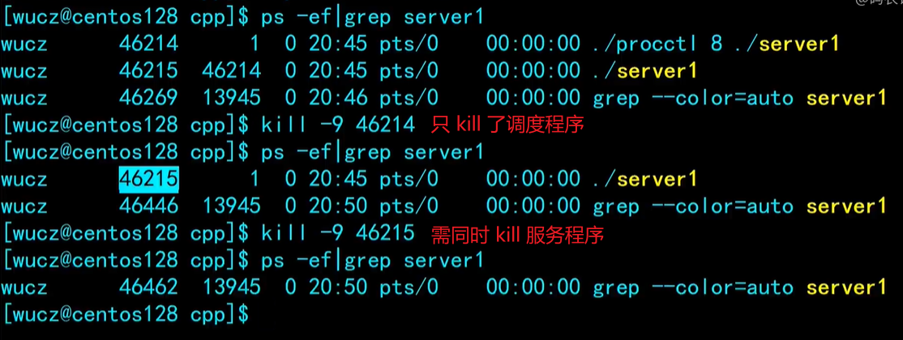

* 相关章节
    * 314，`exec` 函数簇
* 经验
    * 本节直接给出代码，并未从零开始写，这对于掌握整体的代码构建思路不友好，因为看到的代码是最终版本，即多次思维 + 代码迭代的结果。而若想更好地提高代码能力，必须要了解代码构建的具体过程，顺着作者的思路，思考为什么要以这样的逻辑顺序构建，先处理了什么，后处理了什么，这些都很重要。
        * 对于未提供代码构建过程的内容，可以先**总览代码**，**概括**为不同模块，总结出模块的**逻辑关系**，而后自己按照这个关系，**整理代码思路**，并写出相应的**实现**（总览 --> 概括 --> 逻辑 --> 思路 --> 尝试实现）
    * 调度程序代码虽然简单，但一定要自己写出来，写过和没写过效果完全不同。
* 疑问
    * ~~如何确定进程相关的子进程、子线程完全退出？~~ 
        * 使用 `waitpid()` 或 `wait()` 等系统调用，检查子进程退出状态，可确保所有子进程都已终止。
    * ~~`ps` 指令可否完全查到？~~ 
        * `ps` 可列出所有进程，通过 `ps -ef` 或 `ps aux` 可看到详细进程信息。
        * 值得注意的是，调度程序、服务程序可由其执行时的名称确定（例如调度程序使用 `./procctl 8 ./server1` 的执行指令作为其进程名称）
    * ~~如何清晰地理解 “生成子进程，退出父进程，后台托管” 的操作？这一步退出的是 `procctl` ？那么父进程退出后，下面的代码由子进程拷贝的空间执行？~~
        * 生成子进程 `fork()` ；
        * 退出 `procctl` 的父进程 `exit(0)` ；
        * 后台托管：子进程被 1 号进程 `init` 或 `systemd` 收养，变成**孤儿进程**，脱离终端控制，成为后台进程；
        * **子进程（成为新的父进程）继续执行**下面的代码。
    * (2.4)但为什么在进入循环体之前，还需要把子进程的退出信号恢复默认？(2.4.2)此时的子进程，依然叫做 `procctl`？(2.5)父进程都退出了，还怎么处理子进程的信号？
        * 确保在**新的子进程**退出时，**新的父进程**可以 `wait()` 捕获 `SIGCHLD` 信号，以正确处理子进程的退出状态；
        * 依然叫做 `procctl`，最初生成的子进程继承了该进程的名称，成为新的父进程；
        * 由**新的父进程**处理**后面生成的子进程**信号。
    * ~~基于上面几个关于父子进程的问题，如何理解循环体内继续生成的子进程和父进程？这里的父子进程应当是循环体**之前生成的子进程的分支**吧？所以父进程指的是前面第一次生成的子进程了？~~
        * 循环体内的 `fork()` 调用**每次都会生成一个新的子进程**，父进程等待子进程结束，然后继续下一轮循环；
        * 显然，最初生成的子进程成为了新的父进程。


* 2024/05/30 17:08:10，2024/05/30 20:56:03 分析代码，疑问解答

------


### 56 进程的心跳

* 协调工作：调度模块、进程心跳、进程监控
* 进程心跳
    * 实际开发中，心跳机制很重要，用于检测进程是否存活。
    * 共享内存 --> 结构体数组

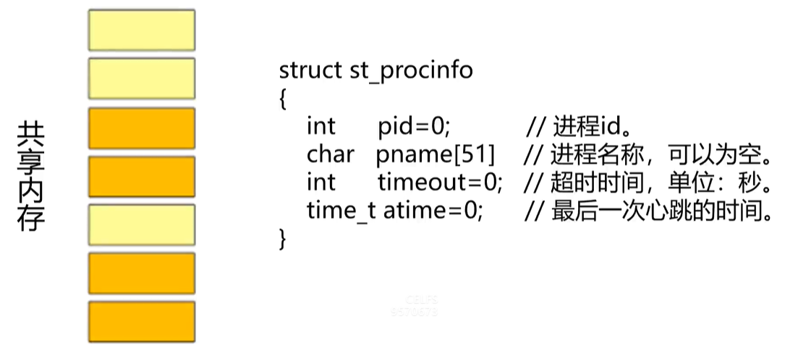

* 代码流程
  
    * 包含头文件
    * 定义进程心跳信息结构体
    * 声明共享内存 id 与地址空间
    * `main` 添加代码流程，准备实现各功能
        * 处理程序退出信号
        * 共享内存：
            * 创建 --> 连接 --> 初始化（以构造函数的形式） -->
            * 内存添加（寻找空位置 --> 保存）
        * 循环体
            * 更新进程心跳信息（设置 `sleep()` 及添加当前时间）
    * 实现信号处理函数 `EXIT()` 
        * 将 `int m_pos = -1;` 置为全局变量；
        * 共享内存数据处理（删除心跳信息、共享内存分离）
    * 调试
        * 查询 `ipcs -m` 、移除 `ipcrm -m pid` 
        * 共享内存位置选择、删除等操作调式
        * 共享内存信息打印，便于调试（该场景比 gdb 更便捷）
    * 处理存在的两个问题
        * （1）`EXIT` 若程序正常退出，则正常删除共享内存中的信息；若异常退出（kill -9 或段错误等），则当前进行的信息会**残留在共享内存**中 --> 旧位置重用
        * （2）多进程同时操作共享内存，存在安全问题 --> 加锁（信号量） --> 先明确代码中对共享内存的操作有哪些，再考虑怎样加锁，共有三种操作：
            * 1）在共享内存中寻找一个空位置，把当前进程的结构体写入共享内存 --> 两个步骤，如果出现多个进程找到同一个空位置，那么会产生竞态，因此需要加锁
            * 2）更新自己在共享内存中的结构体心跳时间 --> 确定进程后，每个进程只会操作自己的结构体，因此不必加锁
            * 3）在共享内存中删除自己 --> 同理，每个进程只会操作自己的结构体，因此不必加锁
    * 把进程心跳**封装成通用的类**
        * 先实现功能，再组装成类
        * 具体在 `_public.cpp`，做了简单优化、构造函数、析构函数等，并且引入了类似 “单例” 的思想，确保心跳程序只有一个
    * 把参数写死的意义与可行性（宏定义硬编码）

```cpp
#include "../../public/_public.h"
using namespace idc;

// 进程心跳信息的结构体
struct stprocinfo {
    int    pid = 0;           // 进程id
    char   pname[51] = {0};   // 进程名称，可为空
    int    timeout = 0;       // 超时时间，秒
    time_t atime = 0;         // 最后一次心跳时间，整数表示
    stprocinfo() = default;   // 启用默认构造函数（有自定义构造函数，则编译器不提供默认构造函数，需手动启用）
    stprocinfo(const int in_pid, const string & in_pname, const int in_timeout, const time_t in_atime)
                :pid(in_pid), timeout(in_timeout), atime(in_atime)
    {
        strncpy(pname, in_pname.c_str(), 50);
    }  
};

int m_shmid = -1;            // 共享内存的id
stprocinfo *m_shm = nullptr; // 指向共享内存的地址空间
int m_pos = -1;              // 用于存放当前进程在数组中的下标

void EXIT(int sig);          // 退出信号处理函数

int main() {
   
    // 处理程序的退出信号
    signal(SIGINT, EXIT);
    signal(SIGTERM, EXIT);

    // 创建/获取共享内存
    if ((m_shmid = shmget((key_t)0x5095, 1000 * sizeof(struct stprocinfo), 0666 | IPC_CREAT)) == -1) {
        printf("创建/获取共享内存 (%x) 失败。\n", 0x5095);
        return -1;
    }

    // 将共享内存连接到当前进程的地址空间
    m_shm = (struct stprocinfo*)shmat(m_shmid, 0, 0);

    // 把共享内存中全部进程的信息显示出来，用于调试
    for (int i = 0; i < 1000; i++) {
        if (m_shm[i].pid != 0) {
            printf("i = %d, pid = %d, pname = %s, timeout = %d, atime = %ld\n",
            i, m_shm[i].pid, m_shm[i].pname, m_shm[i].timeout, m_shm[i].atime);
        }
    }

    // 把当前进程的信息填充到结构体中
    // stprocinfo procinfo;
    // memset(&procinfo, 0, sizeof(struct stprocinfo));
    // procinfo.pid = getpid();
    // strncpy(procinfo.pname, "server1", 50);
    // procinfo.timeout = 30;
    // procinfo.atime = time(0);               // 用当前时间填充最后一次心跳的时间
    stprocinfo procinfo(getpid(), "server1", 30, time(0));

    csemp semlock; // 用于给共享内存加锁的信号量 id

    if (semlock.init(0x5095) == false) {
        printf("创建/获取信号量 (%d) 失败", 0x5095);
        EXIT(-1);
    }

    semlock.wait(); // 给共享内存加锁

    // 进程 id 是循环使用的，如果曾经有一个进程异常退出，没有清理自己的心跳信息，
    // 它的进程信息将残留在共享内存中，不巧的是，如果当前进程重用了它的 id，
    // 所以，如果共享内存中已存在当前进程编号，一定是其他进程残留的信息，当前进程应该重用这个位置
    for (int i = 0; i < 1000; i++) {
        if (m_shm[i].pid == procinfo.pid) {
            m_pos = i;
            printf("找到旧位置 i = %d\n", i);
            break;
        }
    }

    if (m_pos == -1) {
        // 共享内存中寻找一个空的位置，把当前位置的结构体保存到共享内存中
        for (int i = 0; i < 1000; i++) {
            if (m_shm[i].pid == 0) { // 数组表示法，指针表示法 (m_shm + i)->pid == 0
                m_pos = i;
                printf("找到新位置 i = %d\n", i);
                break;
            }
        }
    }

    // 如果 m_pos == -1，表示没有找到空位置，说明共享内存的空间已用完
    if (m_pos == -1) {
        semlock.post(); // 共享内存用完，解锁
        printf("共享内存空间已用完。\n");
        EXIT(-1);
    }

    // 把当前进程的结构体保存到共享内存中
    // memcpy(m_shm + m_pos, &procinfo, sizeof(struct st_procinfo)); // 指针表示法
    memcpy(&m_shm[m_pos], &procinfo, sizeof(struct st_procinfo)); // 数组表示法

    semlock.post(); // 找到了位置，解锁

    while(1) {
        printf("服务程序运行中...\n");

        // 更新进程的心跳信息
        sleep(25); // 不可超过进程心跳超时时间，否则心跳信息无效
        m_shm[m_pos].atime = time(0);
        sleep(25);
        m_shm[m_pos].atime = time(0);
    }

    return 0;
}

void EXIT(int sig) {
    
    printf("sig = %d\n", sig);

    // 从共享内存中删除当前进程的心跳信息
    if (m_pos != -1) memset(m_shm + m_pos, 0, sizeof(struct stprocinfo));

    // 把共享内存从当前进程分离
    if (m_shm != 0) shmdt(m_shm);

    exit(0);
}
```

* 经验 / 感悟

    * 可以先把功能实现，后面再问有什么用、为什么这样做。
    * 一般来说，服务程序都需要处理退出信号（纳入一般代码流程）
    * 放在死循环下面的代码，不会执行，因此，可以通过处理退出信号，将需要执行的代码，放到信号处理函数中。
    * 共享内存的代码，记不住也没关系，需要的时候找到笔记抄回来即可，重要的是对概念和用法有印象，重新抄代码就容易很多。
    * C++ 中，结构体和类是同一个东西，如果想强调结构体的语义，可以写上 `struct` 关键字。
    * 进程名 + 其他东西 --> 可区分不同进程。实际开发中，同一个进程可能以不同的参数运行多个副本，因此同一进程的不同名称可用于区分。
    * 进程超时时间 --> 看具体业务需求
    * 计算机中，时间用整数更方便，需要时转换才考虑字符串。
    * 若自定义了构造函数，编译器将不提供默认构造函数，因此需手动启用默认构造函数。
    * 补充两种表示法
        * 指针表示法 `(m_shm + ii)->pid == 0` 、`&m_shm[m_pos]` 
        * 数组表示法 `m_shm[ii].pid == 0` 、`m_shm + m_pos` 
    * 需要做到看到某个概念，就想到它**对应的结构、对应的图像**。例如共享内存，就想到进程的内存空间结构图，知道哪些变量、哪些操作占用哪部分的空间。
    * 实际开发中，如果要把**一个功能封装成类**，一般不会从类开始写代码，而是先把它的**功能实现**，然后才**组装成类**。
    * 这一节代码比较简单，需要自己写出来。如果不练、写不出来，后面代码更复杂了，就可能跟不上课程。

* 疑问

    * 为什么自定义了构造函数，还要启用默认构造函数？取决于默认构造函数是否有额外的工作？如果默认构造函数为空，则无需调用？还是说，默认构造函数有什么特殊的内置处理？
        * 据视频解释，本代码中，若不启用默认构造函数，则代码 `stprocinfo procinfo;` 语句会报错。为什么会报错？待仔细分析。
    * 共享内存的删除，仅仅用 `memset()` 置为 0 就行？为什么不是整块内存释放？待回顾共享内存用法。
* ~~为何程序能识别已经有打开的进程，但无法 kill 呢？难道因为查到的是共享内存中的东西？~~ 
        * 果然，使用 `ipcrm -m pid` 之后，已经打开的两个进程都成功清理了。
    * 不调试不知道，这样操作之后，才能更清晰地理解 “共享内存” 的行为和作用（真切理解了在共享内存中的进程与在 shell 能识别的进程的差别），**这种调试收获很大，必须重视那些看起来不起眼的问题**，动手实践才有收获。
      
            * 这种问题的研究，就像摸着石头过河，你不知道河底有什么、不知道结构怎么样，只能碰到一个茬，解决一个茬。就算理论看了百遍，把现象描述得多么真实，都不如亲身碰到一次来得深刻，所谓百闻不如一见。即便文字上将一个概念的全部都呈现给你，当你真正遇到它的时候，或许是千变万化的面孔，你很难认出是它，倒不如摸着石头，调试代码，从调试过程的种种迹象，在脑海里构建出属于它的立体形象，于是，你就知道了共享内存的一些行为是怎样的，于是想起了以前看过的文字描述，于是，与这个技术点完成了一次更深入的邂逅。实践果然出真知。
        
        * 另外，由于程序的问题，进程异常退出会**残留**在共享内存中，于是产生了这个现象。
    
    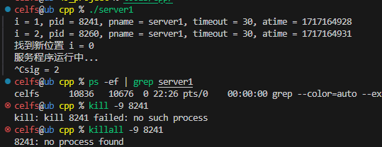
    
    * 如果进程在共享内存中，使用 `ps` 就不能找到它们吗？为什么没有显示相应的进程 id？是因为它们所管辖的内存空间不同？
    * 将功能封装到类，这个过程是如何确保有多个程序产生的？我的意思是，一个通用类文件里面有若干个类，这些类是怎样独立于它所在的进程与其他进程的？因为是独立实现的，封装的时候放在一起，就产生了这个疑问。就好像原本自己有一个蛋糕，现在送到蛋糕厂了，在需要的时候，怎么把自己那个蛋糕拿到手，确保这个蛋糕还是跟原来的一样？
    
* BUG

    * ~~` printf("服务程序运行中...\n");` 遗漏了一个 `\n`，就不输出了，为什么？~~
    * ~~在打印共享内存的进程信息时，没有显示内容。而如果 `pid == 0`，则有内容。会不会是共享内存的问题？~~ 
        * 测试了教程代码，有同样的问题。
        * 视频调试中，`i` 有 0 到 2 三个，会不会是打开的进程数量？
        * 果然，需要先多开几个进程，才能实现相同效果。

    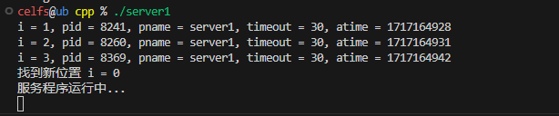

    * `time_t` 类型的 `atime` 变量，课程 `printf` 为 `%d` 类型，而实际编译需要 `%ld` 类型，方能通过编译。 


* 2024/05/31 22:38:59 详细 debug，理解共享内存的行为
* 2024/05/31 23:43:23 模仿 + 笔记，未独立实现代码

------


### 57 守护模块

* 作用
  * 检查进程心跳，超时终止；其后由调度模块重启
* 代码流程
  * 设计为通用模块 `checkproc.cpp` 
  * 添加帮助信息
  * 列出程序流程
    * 打开日志文件
    * 处理共享内存逻辑（创建/获取、连接、分离）
    * 遍历共享内存记录
  * 1）添加 `demo02.cpp` 测试模块（注意全局对象），调试
    * （1窗口）`checkproc` **手动启动**调度程序 
      * `../../tools/bin/checkproc ../../tmp/log/checkproc.log` 
    * （3-5窗口）运行 3 个 `demo02` 
    * 查阅日志 `cat ../tmp/log/checkproc.log` 
    * 终止窗口3，再次运行守护程序，查阅日志 --> 剩余两个 demo02
  * 继续完成心跳检测逻辑
    * 获取当前时间 --> 判断是否超时 --> 超时终止信号
  * 2）调试
    * 加入超时参数 --> （**持续**或等待）执行守护程序 --> 判断超时 --> 执行清理
  * 添加条件（若进程已不存在，需处理共享内存中残留的心跳信息）
    * `kill` 发送信号 `0`，捕获返回信号（用变量接收）
    * 判断返回值，若为 -1，则说明进程不存在
    * 删除该进程在共享内存中的心跳记录
  * 3）调试
    * （3-5窗口）两个超时，一个不超时
    * `kill -9` 其中一个超时任务，使得进程残留在共享内存中
    * 执行守护程序 --> 执行清理（清理超时进程、清理残留进程）
    * 查阅日志 --> 查阅进程 --> 已全部回收
  * 继续优化守护程序
    * 若已超时的进程，无法响应信号15，会发生什么？
    * 需要先发送信号15，若无法终止该进程，则应当发送信号9，强制终止
    * 再发送信号15后，加入动态时长，判断进程是否退出（上限 + 累计）
    * 实现强制终止逻辑
  * 4）调试
    * （3-5窗口）两个超时，一个不超时
    * 执行守护程序 --> 守护程序被终止
    * 查看进程 --> 仍有两个（一个被清理，一个未被清理，自己也被清理）
    * （守护进程清理自己）原因
      * `kill` 中的进程编号，在执行中变成了0，最终执行了 `kill(0, 9);` 
  * 处理自清理问题
    * 使用临时变量备份结构体（不直接使用共享内存的值）
    * 修改 demo02 为仅能被信号9杀死
  * 最终优化
    * 守护程序忽略全部信号与I/O

```makefile
# 开发框架头文件路径
PUBINCL = -I../../public

# 开发框架 cpp 文件名，直接和程序的源代码一起编译，没有采用链接库，为了方便调试
PUBCPP = ../../public/_public.cpp

# 编译选项
CFLAGS = -g
# CFLAGS = -O2

all: procctl checkproc

procctl:procctl.cpp
		g++ -g -o procctl procctl.cpp
		cp -f procctl ../bin/.

checkproc: checkproc.cpp
		g++ $(CFLAGS) -o checkproc checkproc.cpp $(PUBINCL) $(PUBCPP)
		cp -f checkproc ../bin/.

clean:
		rm -rf procctl checkproc
```

```cpp
// checkproc.cpp
// 守护程序：检查共享内存中进程的心跳，如果超时，则终止进程
#include "../../public/_public.h"
using namespace idc;

int main(int argc, char *argv[]) {

    // 程序的帮助。
    if (argc != 2) {
        printf("\n");
        printf("Using:./checkproc logfilename\n");

        printf("Example:../../tools/bin/procctl 10 ../../tools/bin/checkproc ../../tmp/log/checkproc.log\n\n");

        printf("本程序用于检查后台服务程序是否超时，如果已超时，就终止它。\n");
        printf("注意：\n");
        printf("  1）本程序由procctl启动，运行周期建议为10秒。\n");
        printf("  2）为了避免被普通用户误杀，本程序应该用root用户启动。\n");
        printf("  3）如果要停止本程序，只能用killall -9 终止。\n\n\n");

        return 0;
    }

    // 忽略全部信号和I/O，不处理程序的退出信号
    closeioandsignal(true);

    // 打开日志文件
    clogfile logfile;
    if (logfile.open(argv[1]) == false) {
        printf("logfile.open(%s) failed.\n", argv[1]);
        return -1;
    }

    // 创建/获取共享内存，键值为 SHMKEYP，大小为 MAXNUMP 个 st_procinfo 结构体的大小
    int shmid = 0;
    if ((shmid = shmget((key_t)SHMKEYP, MAXNUMP*sizeof(struct st_procinfo), 0666|IPC_CREAT)) == -1) {
        logfile.write("创建/获取共享内存 (%x) 失败。\n", SHMKEYP);
        return false;
    }

    // 将共享内存连接到当前进程的地址空间
    struct st_procinfo *shm = (struct st_procinfo *)shmat(shmid, 0, 0);

    // 遍历共享内存中全部的记录，如果进程已超时，终止它
    for (int i = 0; i < MAXNUMP; i++) {

        // 如果记录的 pid == 0，表示空记录，continue
        if (shm[i].pid == 0) continue;

        // 如果记录的 pid ！= 0，表示是服务程序的心跳记录

        // 显示进程信息，程序稳定运行后，以下两行代码可注释
        // logfile.write("i = %d, pid = %d, pname = %s, timeout = %d, atime = %ld\n",\
        //                i, shm[i].pid, shm[i].pname, shm[i].timeout, shm[i].atime);
        
        // 如果进程已经不存在，共享内存中是残留的心跳信息
        // 向进程发送信号0，判断它是否还存在，若不存在，从共享内存中删除该记录
        int iret = kill(shm[i].pid, 0);
        if (iret == -1) {
            logfile.write("进程 pid = %d (%s) 已经不存在。\n", shm[i].pid, shm[i].pname);
            memset(&shm[i], 0, sizeof(struct st_procinfo)); // 从共享内存中删除该记录
            continue;
        }

        // 判断进程的心跳是否超时，如果超时，则终止它
        time_t now = time(0); // 获取当前时间

        // 如果进程未超时
        if (now - shm[i].atime < shm[i].timeout) continue;

        // 一定要把进程的结构体备份，不能直接使用共享内存中的值
        struct st_procinfo tmp = shm[i];
        if (tmp.pid == 0) continue;

        // 如果进程已超时
        logfile.write("进程 pid = %d (%s) 已经超时。\n", tmp.pid, tmp.pname);

        // 发送信号 15，尝试正常终止已超时的进程
        kill(tmp.pid, 15);

        // 每隔1秒判断一次进程是否存在，累计5秒，一般5秒足够让进程退出（若立即执行，则太心急；若等太久，时间又浪费；于是给一个上限，再动态地判断）
        for (int j = 0; j< 5; j++) {
            sleep(1);
            iret = kill(tmp.pid, 0); // 向进程发送信号0，判断它是否存在
            if (iret == -1) break;      // 进程已退出
        }

        if (iret == -1) {
           logfile.write("进程 pid = %d (%s) 已经正常终止。\n", tmp.pid, tmp.pname);
        } else {
            // 若进程仍存在，则发送信号9，强制终止它
            kill(tmp.pid, 9);
            logfile.write("进程 pid = %d (%s) 已经强制终止。\n", tmp.pid, tmp.pname);

            // 从共享内存删除已超时的心跳记录
            memset(shm + i, 0, sizeof(struct st_procinfo));
        }
    }

    // 把共享内存从当前进程中分离
    shmdt(shm);

    return 0;
}
```

```cpp
// demo02.cpp
#include "../../public/_public.h"
using namespace idc;

cpactive pactive;       // 进程心跳，用全局对象（保证析构函数会被调用）

void EXIT(int sig) {    // 程序退出和信号2/15的处理函数
    
    printf("sig = %d\n", sig);

    exit(0);
}

int main(int argc, char *argv[]) {

    // 处理程序的退出信号
    // signal(SIGINT, EXIT); signal(SIGTERM, EXIT);
    closeioandsignal(true);

    pactive.addpinfo(atoi(argv[1]), "demo02"); // 把当前进程的信息加入共享内存进程组中

    while (1) {
        sleep(atoi(argv[2]));
        pactive.uptatime(); // 更新进程的心跳
    }

    return 0;
}
```

* 1）demo02模块调试

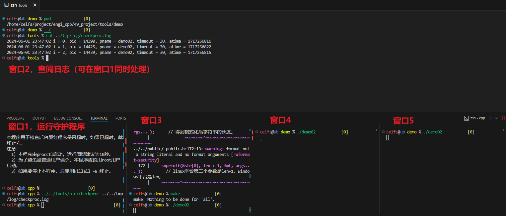

* 1）进程正常退出（终止了一个进程）

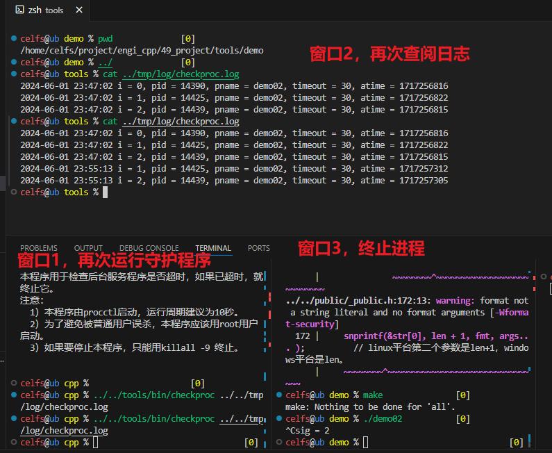

* 2）进程未超时 VS 进程超时

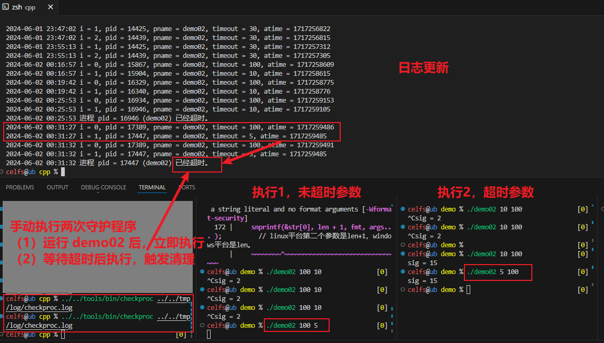

* 3）处理共享内存残留信息

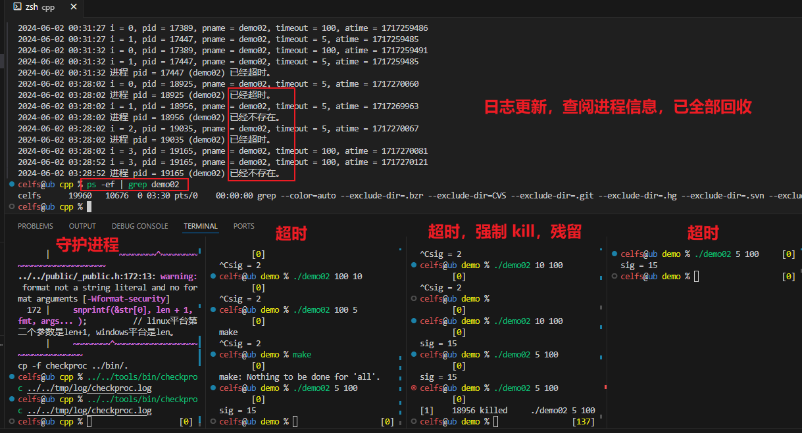

* 4）守护进程仅完成部分任务后被清理

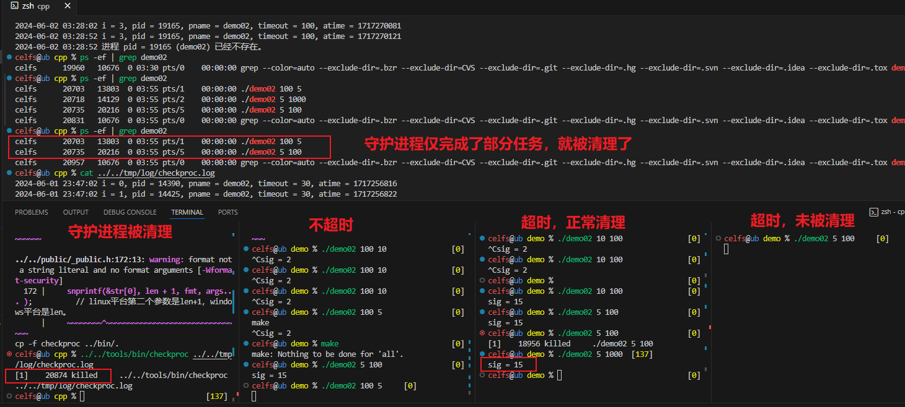

* 守护进程正确处理（demo02 未忽略信号15）

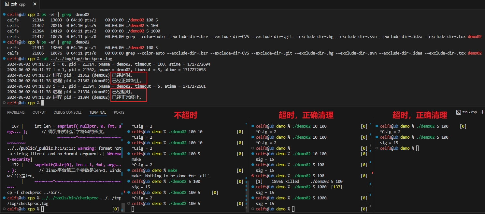

* 守护进程正确处理（demo02 忽略信号15）

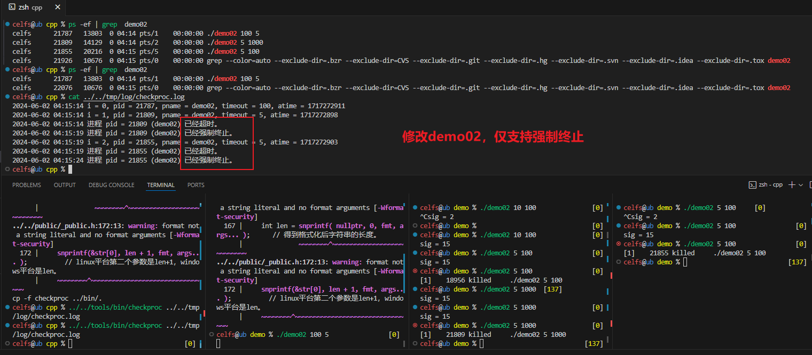

* 疑问
  * 为什么不采用链接库，可以方便调试？
  * 为什么感觉只是用一个变量存储了之前的路径和文件名？这就不是采用链接库？感觉语句都是一样的。
  * 如何理解 `main` 的参数 `char *argv[]` ？
  * 回顾 `kill()` 函数的返回值，本例使用该函数，发送信号0，以截获返回值，进而判断与处理特定的逻辑。
  * 为什么用临时备份的结构体，操作并清理已终止进程后，不会影响守护进程？是否还有 `kill 0` 的逻辑？
* 经验
  * 应当要有一个针对开发框架模块的地图，在需要相应功能的时候，找找是否有对应的模块。
  * 若 `pactive` 定义为 `main` 的局部对象，则调用 `exit` 时，不会调用其析构函数，因此为了能够正确释放资源，需要将其定义为全局对象。
* 注意
  * 需仔细理解 “手动启动守护程序” 的调试过程。原本守护程序由调度程序进行控制，周期性启动，从而执行心跳检测与进程终止的任务。于是，上面第二次调试时（加入超时参数的操作），需执行 demo02 之后，等待进程超时，然后启动守护程序（其实可以反复手动执行，只不过只有时间限制到了，才能发挥清理作用），检测到存在超时行为，于是对进程终止。
* 相关章节
  * 313，进程终止。`exit()` 表示终止进程，不会调用局部对象的析构函数，只调用全局对象的析构函数。


* 2024/03/16 23:08:32，2024/06/01 17:57:42
* 2024/06/02 4:22:20，完成代码 + 所有调试

------


### 58 服务程序的运行策略

* 服务程序：使用心跳机制（调度模块、守护模块除外）
* 调度模块 `procctl` （启动、重启服务程序）
* 守护模块 `checkproc` （终止超时的服务程序）
* 代码流程（完善 `crtsurfdata.cpp` ）
  * 测试 VS 正式：手动运行 --> 调度模块运行
  * 修改 `main` 参数及判断：添加调度模块路径、添加帮助文档
  * 增加心跳（声明） --> 将心跳加入共享内存（ `addpinfo` ）
* 调试
  * 查看日志 `tail -f path_name` 
  * 查看进程
  * 终止调度程序 `killall - 9 procctl` 
* 编写脚本（启动 / 终止服务程序）
  * `start.sh` （调度启动 `checkproc` 和 `crtsurfdata` ）--> `chmod +x` 添加可执行权限
  * `stop.sh` 
* 开机启动服务程序 `/etc/rc.local` （Ubuntu 需额外配置）
  * `su -` 切换 `root` 用户（若提示失败，可 `sudo passwd root` 重置密码）
  * 用 `root` 用户启动守护进程（注释 `start.sh` 的一行）
  * 配置开机启动

```cpp
cpactive pactive; // 添加心跳机制

int main(int argc, char *argv[]) {
    /* ... */
    pactive.addpinfo(10, "crtsurfdata"); // 把当前进程的心跳加入共享内存
}
```

```bash
# start.sh
#!/bin/bash

# 启动守护模块（使用 root 启动，修改 rc.local）
# ../../tools/bin/procctl 10 ../../tools/bin/checkproc ../../tmp/log/checkproc.log

# 生成气象站点观测的分钟数据，程序每分钟运行一次
../../tools/bin/procctl 60 ../../idc/bin/crtsurfdata ../../idc/ini/stcode.ini ../../tmp/idc/surfdata ../../log/idc/crtsurfdata.log csv,xml,json
```

```shell
# stop.sh
#!/bin/bash

# 此脚本用于停止数据共享平台全部的服务程序
# 停止调度程序
killall -9 procctl

# 停止其他的服务程序
# 尝试让其他服务程序正常终止
killall crtsurfdata

# 让其他服务程序有足够的时间退出
sleep 5 

# 不管服务程序有没有限制，都强制杀死
killall -9 crtsurfdata
```

```shell
## Ubuntu 配置 rc.local
## 服务显示状态
systemctl status rc-local.service

## 启动服务
systemctl start rc-local.service
 
## 重启服务
systemctl restart rc-local

## 服务停止
systemctl stop rc-local.service

## 开机生效
systemctl enable rc-local.service
```

```shell
sudo vim /lib/systemd/system/rc-local.service

## 添加 [Install]（注意大写字母）
[Install]
WantedBy=multi-user.target
```

```shell
# rc.local
#!/bin/bash

# 启动守护模块
/home/celfs/project/engi_cpp/49_project/tools/bin/procctl 10 /home/celfs/project/engi_cpp/49_project/tools/bin/checkproc /home/celfs/project/engi_cpp/49_project/tmp/log/checkproc.log

# 启动数据共享平台的服务程序
su - celfs -c "/home/celfs/project/engi_cpp/49_project/idc/cpp/start.sh"
```

* 参考文章

  * [大概借鉴](https://blog.csdn.net/qz652219228/article/details/125107694) 
  * [最终生效](https://blog.csdn.net/weixin_44654533/article/details/87190638) 

```bash
celfs@ub engi_cpp % ps -ef | grep checkproc                                                        [0]
root         908       1  0 19:11 ?        00:00:00 /home/celfs/project/engi_cpp/49_project/tools/bin/procctl 10 /home/celfs/project/engi_cpp/49_project/tools/bin/checkproc /home/celfs/project/engi_cpp/49_project/tmp/log/checkproc.log
celfs       1672    1451  0 19:12 pts/1    00:00:00 grep --color=auto --exclude-dir=.bzr --exclude-dir=CVS --exclude-dir=.git --exclude-dir=.hg --exclude-dir=.svn --exclude-dir=.idea --exclude-dir=.tox checkproc
```

* 调试

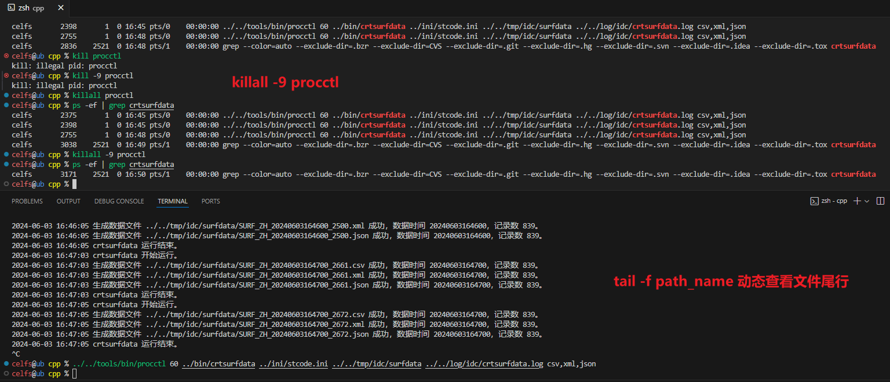

* 脚本启动所有服务程序

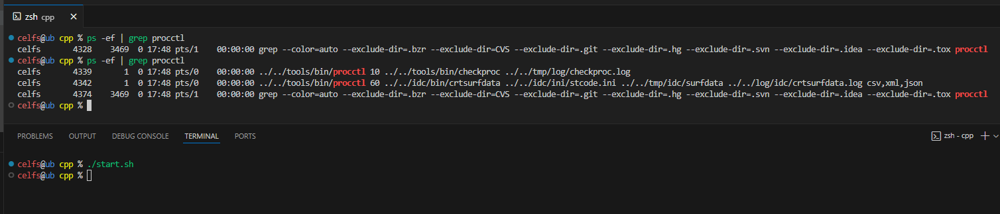

* 经验
  * 实际开发中，服务程序通常有很多个，如果每一个都像演示的手动删除调度程序，就不现实，于是需要脚本批处理。
  * 脚本文件的运行（赋可执行权限 `chmod +x xx.sh`、运行 `sh xx.sh` ）
  * 越复杂的程序，越容易挂掉，尤其是用到网络通讯的程序。
  * 实际开发中，把系统分解成简单的模块是明智的选择。
* BUG（本章节编译警告，未处理）
  * `[-Wreturn-type]` ：函数有无返回值以及返回值类型不匹配；
  * `[-Wformat-security]` ：C风格输出与输入格式字符串使用不当；

```bash
celfs@ub cpp % make

g++ -g -o crtsurfdata crtsurfdata.cpp -I../../public ../../public/_public.cpp -lm -lc
In file included from crtsurfdata.cpp:4:
../../public/_public.h: In instantiation of ‘std::string idc::sformat(const char*, Args ...) [with Args = {}; std::string = std::__cxx11::basic_string<char>]’:
../../public/_public.h:493:43:   required from ‘bool idc::clogfile::write(const char*, Args ...) [with Args = {}]’
crtsurfdata.cpp:84:50:   required from here
../../public/_public.h:167:23: warning: format not a string literal and no format arguments [-Wformat-security]
  167 |     int len = snprintf( nullptr, 0, fmt, args... );      // 得到格式化后字符串的长度。
      |               ~~~~~~~~^~~~~~~~~~~~~~~~~~~~~~~~~~~~
../../public/_public.h:172:13: warning: format not a string literal and no format arguments [-Wformat-security]
  172 |     snprintf(&str[0], len + 1, fmt, args... );          // linux平台第二个参数是len+1，windows平台是len。
      |     ~~~~~~~~^~~~~~~~~~~~~~~~~~~~~~~~~~~~~~~~~
crtsurfdata.cpp: In function ‘bool crtsurffile(const string&, const string&)’:
crtsurfdata.cpp:239:1: warning: control reaches end of non-void function [-Wreturn-type]
  239 | }
      | ^
In file included from ../../public/_public.cpp:6:
../../public/_public.h: In instantiation of ‘std::string idc::sformat(const char*, Args ...) [with Args = {}; std::string = std::__cxx11::basic_string<char>]’:
../../public/_public.h:493:43:   required from ‘bool idc::clogfile::write(const char*, Args ...) [with Args = {}]’
../../public/_public.cpp:1690:74:   required from here
../../public/_public.h:167:23: warning: format not a string literal and no format arguments [-Wformat-security]
  167 |     int len = snprintf( nullptr, 0, fmt, args... );      // 得到格式化后字符串的长度。
      |               ~~~~~~~~^~~~~~~~~~~~~~~~~~~~~~~~~~~~
../../public/_public.h:172:13: warning: format not a string literal and no format arguments [-Wformat-security]
  172 |     snprintf(&str[0], len + 1, fmt, args... );          // linux平台第二个参数是len+1，windows平台是len。
      |     ~~~~~~~~^~~~~~~~~~~~~~~~~~~~~~~~~~~~~~~~~
cp -f crtsurfdata ../bin/.
```

* 疑问

  * 查看进程后，那个时间后面的问号 `?` 是什么意思？为什么会变成问号？而其他的是 `pts/1` 这样的？

    * 在 `ps` 命令的输出中，时间后面的问号 “?” 表示该进程没有与任何终端（TTY，Teletypewriter）关联。TTY 是指用户登录的终端设备，通常是 `pts/1` 这样的表示方式。
    * `?` 通常出现在**系统守护进程**、**后台进程**或者一些**启动时没有终端的进程**中。

    ```bash
    celfs  1672  1451  0  19:12 pts/1  00:00:00  grep --color=auto --exclude-dir=.bzr --exclude-dir=CVS --exclude-dir=.git --exclude-dir=.hg --exclude-dir=.svn --exclude-dir=.idea --exclude-dir=.tox checkproc
    ```

    * `celfs` 是进程的所有者用户。
    * `1672` 是进程的 PID。
    * `1451` 是父进程的 PID。
    * `0` 是 CPU 使用率。
    * `19:12` 是进程的启动时间。
    * `pts/1` 表示进程是通过伪终端（pseudo-terminal） 1 启动的。
    * `00:00:00` 是 CPU 占用时间。
    * `grep --color=auto --exclude-dir=.bzr --exclude-dir=CVS --exclude-dir=.git --exclude-dir=.hg --exclude-dir=.svn --exclude-dir=.idea --exclude-dir=.tox checkproc` 是进程启动的命令和参数。


* 2024/06/03 19:19:45，2024/06/03 22:14:14

------


### 59 小工具-清理文件

* 清理文件：删除指定目录中的历史数据文件。
* 代码流程
  * 前面将守护程序等设置为开机启动，将在 `../../tmp/idc/surfdata` 持续产生若干文件，并且不做清理，这可能导致磁盘空间被占满。
  * `deletefiles.cpp` 文件
  * `makefile` 补充
  * 列出 `deletefiles.cpp` 流程
    * 修改参数帮助文档
    * 忽略信号与 I/O（调试阶段需打开 I/O）
    * 定义删除文件的时间点（单位：天，1小时约0.04天；1则删除1天前文件）
    * 使用开发框架 `cdir` 打开目录
    * 遍历目录，寻找判定为历史数据的文件，并删除
  * 调试
    * `ls ../../tmp/idc/surfdata/` 查看目录（每 60 秒生成 3 个文件）
    * `ll ../../tmp/idc/surfdata/ | wc` 统计文件数量
    * `"*.xml,*.json,*.csv"` 以正确的参数删除超时文件
  * 继续完善代码
    * 添加心跳机制
    * 添加到启动脚本 `start.sh`  
    * 添加到终止脚本 `stop.sh` 
  * 调试
    * 停止全部服务程序
    * 启动全部服务程序

```makefile
# 开发框架头文件路径
PUBINCL = -I../../public

# 开发框架 cpp 文件名，直接和程序的源代码一起编译，没有采用链接库，为了方便调试
PUBCPP = ../../public/_public.cpp

# 编译选项
CFLAGS = -g
# CFLAGS = -O2

all: procctl checkproc deletefiles

procctl:procctl.cpp
		g++ -g -o procctl procctl.cpp
		cp -f procctl ../bin/.

checkproc: checkproc.cpp
		g++ $(CFLAGS) -o checkproc checkproc.cpp $(PUBINCL) $(PUBCPP)
		cp -f checkproc ../bin/.

deletefiles: deletefiles.cpp
		g++ $(CFLAGS) -o deletefiles deletefiles.cpp $(PUBINCL) $(PUBCPP)
		cp -f deletefiles ../bin/.

clean:
		rm -rf procctl checkproc deletefiles
```

```bash
# start.sh
#!/bin/bash

BASE_DIR="/home/celfs/project/engi_cpp/49_project"

# 启动守护模块
#../../tools/bin/procctl 10 ../../tools/bin/checkproc ../../tmp/log/checkproc.log

# 生成气象站点观测的分钟数据，程序每分钟运行一次
$BASE_DIR/tools/bin/procctl 60 \
$BASE_DIR/idc/bin/crtsurfdata \
$BASE_DIR/idc/ini/stcode.ini \
$BASE_DIR/tmp/idc/surfdata \
$BASE_DIR/log/idc/crtsurfdata.log csv,xml,json

# 清理原始的气象观测数据目录（/tmp/idc/surfdata）中的历史数据文件
$BASE_DIR/tools/bin/procctl 300 \
$BASE_DIR/tools/bin/deletefiles \
$BASE_DIR/tmp/idc/surfdata "*" 0.02
```

```cpp
#include "../../public/_public.h"
using namespace idc;

cpactive pactive;

void EXIT(int sig);

int main(int argc, char *argv[]) {
    
    // 程序的帮助
    if (argc != 4) {
        printf("\n");
        printf("Using:   ../../tools/bin/deletefiles pathname matchstr timeout\n\n");

        printf("Example: ../../tools/bin/deletefiles ../../tmp/idc/surfdata \"*.xml,*.json\" 0.01\n");
        cout << R"(         ../../tools/bin/deletefiles ../../log/idc "*.log.20*" 0.02)" << endl;
        printf("         ../../tools/bin/procctl 300 ../../tools/bin/deletefiles ../../log/idc \"*.log.20*\" 0.02\n");
        printf("         ../../tools/bin/procctl 300 ../../tools/bin/deletefiles ../../tmp/idc/surfdata \"*.xml,*.json\" 0.01\n\n");

        printf("这是一个工具程序，用于删除历史的数据文件或日志文件。\n");
        printf("本程序把pathname目录及子目录中timeout天之前的匹配matchstr文件全部删除，timeout可以是小数。\n");
        printf("本程序不写日志文件，也不会在控制台输出任何信息。\n\n\n");

        return -1;
	}

    // 忽略全部的信号和关闭 I/O，设置信号处理函数
    closeioandsignal(true);
    signal(SIGINT, EXIT); signal(SIGTERM, EXIT);

    pactive.addpinfo(30,"deletefiles");

    // 获取被定义为历史数据文件的时间点
    // string strtimeout = ltime1("yyyymmddhh24miss", 0 - (int)(atof(argv[3]) * 24 * 60 * 60)); // 实验1：不转换类型；实验2：不用0减
    string strtimeout = ltime1("yyyymmddhh24miss", 0 - (int)(atof(argv[3]) * 24 * 60 * 60));
    cout << "strtimeout = " << strtimeout << endl;

    // 打开目录
    cdir dir;
    if (dir.opendir(argv[1], argv[2], 10000, true) == false) {
        printf("dir.opendir(%s) failed.\n", argv[1]);
        return -1;
    }

    // 遍历目录中的文件，如果是历史数据文件，删除它
    while (dir.readdir() == true) {
        // 把文件的时间与历史文件的时间点比较，如果更早，则需要删除
        if (dir.m_mtime < strtimeout) {
            if (remove(dir.m_ffilename.c_str()) == 0) {
                cout << "remove(" << dir.m_ffilename << ") OK.\n";
            } else {
                cout << "remove(" << dir.m_ffilename << ") failed.\n";
            }
        }
    }

    return 0;

}

void EXIT(int sig) {

    printf("程序退出，sig = %d\n\n", sig);

    exit(0);
}
```

* 调试（停止 + 启动服务程序）

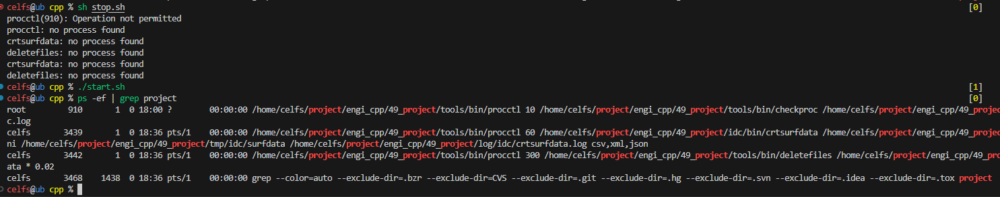

* 疑问

  * 定义为历史时间点的单位，为什么用 “天”？1 / 24 不是除不尽吗？除不尽会不会导致后面出现意想不到的行为？

  * 如何理解 `ltime()` 中将时间转换为秒之后，强制类型转换为 `int`，并且用 `0 - x` 的操作？一定要用 0 去减吗？实验看看不减会怎样。另外，为什么 0 减去一个正数？

  * 关于文件最后一次修改的时间，对比超时时间点，如果更早，则说明文件超时，需删除文件。突然理解了为什么之前 HTTP 协议里面的 **HTTP 缓存超时时间的表述**，因为用的是时间戳，时间戳是递增的，因此如果最后一次修改时间小于当前划定的超时时间点，则说明是这个时间点之前的文件，判定为超时，则删除。

  * 程序的心跳，应该添加到程序的哪一部分？是否有顺序要求？

  * 程序的心跳由哪几部分组成？哪些是必须的，哪些是可选的？何时需要在循环体中也更新心跳信息？

  * ~~为什么 `sh stop.sh` 无法停止 `checkproc` 进程？是信号没有正确处理？~~ 

  * ~~为什么 `sh stop.sh` 的第一条内容是 “不允许的操作”？这是对守护进程（910）而言的，即前面的  `checkproc` 进程。~~ 

    

    * 验证发现，守护进程只能用 `sudo` 权限杀死，这是因为守护进程设置了随系统启动，由超级用户启动。
    * 并且，如果手动杀死了守护进程，也只能手动重启服务（只需要读取 `rc.local` 中的相应指令，手动运行即可，但这样启动的服务，不会周期性重启），因此还是重启系统来解决（或者重启 `rc.local` 服务）。

* BUG

  * ~~测试发现，后面补充的 `*.csv` 格式参数，若写在 `*.xml, *.json` 后面，则无法正确删除对应的历史文件。而如果只输入 `*.csv` 文件，则正确处理。这可能意味着某个代码逻辑具有顺序中断关系，需要进一步排查。~~ 
    * 排查发现，是输入格式问题，多了一个空格 `"*.xml,*.json, *.csv"`，而正确的格式为 `"*.xml,*.json,*.csv"`，其中不得有空格。
    * 为了提高程序的鲁棒性，后续可以针对空格进行特殊处理。


* 2024/06/04 18:55:21

------


### 60 小工具-压缩文件

* 压缩文件：压缩指定目录中的历史数据文件。
* 代码流程（与上一节逻辑类似）
  * `gzipfiles.cpp` （复制上一节代码，修改）
    * 修改参数注释
    * 判断是否过期 + 判断是否为压缩文件
    * 系统调用 `gzip` 
    * 定向输出 `1>/dev/null` 与 `2>/dev/null` 
  * 修改 `makefile` 
  * 调试
    * 测试 `gzip` 功能是否正常运行
  * 继续完善代码
    * 添加到 `start.sh` 
    * 添加到 `stop.sh` 
    * 循环体需更新进程心跳，并增加心跳超时时间（30s --> 120s）

```cpp
#include "../../public/_public.h"
using namespace idc;

cpactive pactive;

void EXIT(int sig);

int main(int argc, char *argv[]) {
    
    // 程序的帮助
    if (argc != 4) {
        printf("\n");
        printf("Using:   ../../tools/bin/gzipfiles pathname matchstr timeout\n\n");

        printf("Example: /home/celfs/project/engi_cpp/49_project/tools/bin/gzipfiles /home/celfs/project/engi_cpp/49_project/tmp/idc/surfdata \"*.xml,*.json\" 0.01\n");
        cout << R"(         ../../tools/bin/gzipfiles ../../log/idc "*.log.20*" 0.02)" << endl;
        printf("         ../../tools/bin/procctl 300 ../../tools/bin/gzipfiles ../../log/idc \"*.log.20*\" 0.02\n");
        printf("         ../../tools/bin/procctl 300 ../../tools/bin/gzipfiles ../../tmp/idc/surfdata \"*.xml,*.json\" 0.01\n\n");

        printf("这是一个工具程序，用于压缩历史的数据文件或日志文件。\n");
        printf("本程序把pathname目录及子目录中timeout天之前的匹配matchstr文件全部压缩，timeout可以是小数。\n");
        printf("本程序不写日志文件，也不会在控制台输出任何信息。\n");
        printf("本程序调用/usr/bin/gzip命令压缩文件。\n\n\n");

        return -1;
	}

    // 忽略全部的信号和关闭 I/O，设置信号处理函数
    // closeioandsignal(true);
    signal(SIGINT, EXIT); signal(SIGTERM, EXIT);

    pactive.addpinfo(120,"gzipfiles");

    // 获取被定义为历史数据文件的时间点
    // string strtimeout = ltime1("yyyymmddhh24miss", 0 - (int)(atof(argv[3]) * 24 * 60 * 60)); // 实验1：不转换类型；实验2：不用0减
    string strtimeout = ltime1("yyyymmddhh24miss", 0 - (int)(atof(argv[3]) * 24 * 60 * 60));
    cout << "strtimeout = " << strtimeout << endl;

    // 打开目录
    cdir dir;
    if (dir.opendir(argv[1], argv[2], 10000, true) == false) {
        printf("dir.opendir(%s) failed.\n", argv[1]);
        return -1;
    }

    // 遍历目录中的文件，如果是历史数据文件，压缩它
    while (dir.readdir() == true) {
        // 把文件的时间与历史文件的时间点比较，如果更早，并且不是压缩文件，则需要压缩
        if ((dir.m_mtime < strtimeout) && (matchstr(dir.m_ffilename, "*.gz") == false)) {

            // 压缩文件，调用系统的 gzip 命令
            string strcmd = "/usr/bin/gzip -f " + dir.m_ffilename + " 1>/dev/null 2>/dev/null";
            if (system(strcmd.c_str()) == 0) {
                cout << "gzip " << dir.m_ffilename << " OK.\n";
            } else {
                cout << "gzip " << dir.m_ffilename << " failed.\n";
            }

            // 如果压缩的文件比较大，有几个G，需要时间可能比较长，因此需更新心跳信息
            pactive.uptatime();
        }
    }

    return 0;

}

void EXIT(int sig) {

    printf("程序退出，sig = %d\n\n", sig);

    exit(0);
}
```

```shell
#!/bin/bash

BASE_DIR="/home/celfs/project/engi_cpp/49_project"

# 启动守护模块
#../../tools/bin/procctl 10 ../../tools/bin/checkproc ../../tmp/log/checkproc.log

# 生成气象站点观测的分钟数据，程序每分钟运行一次
$BASE_DIR/tools/bin/procctl 60 \
$BASE_DIR/idc/bin/crtsurfdata \
$BASE_DIR/idc/ini/stcode.ini \
$BASE_DIR/tmp/idc/surfdata \
$BASE_DIR/log/idc/crtsurfdata.log csv,xml,json

# 清理原始的气象观测数据目录（/tmp/idc/surfdata）中的历史数据文件
$BASE_DIR/tools/bin/procctl 300 \
$BASE_DIR/tools/bin/deletefiles \
$BASE_DIR/tmp/idc/surfdata "*" 0.02

# 压缩后台服务程序的备份日志
$BASE_DIR/tools/bin/procctl 300 \
$BASE_DIR/tools/bin/gzipfiles \
$BASE_DIR/tmp/idc/surfdata "*.log.20*" 0.02
```

* 经验
  * 实际开发中，压缩文件的功能经常用到。
* 疑问
  * ~~在 `.sh` 文件中，如何表示行继续？想要类似 Cpp `\` 的换行功能。~~ 
    * 确保**反斜杠后面没有多余的空格**，否则会导致语法错误。
  * 如何理解 `start.sh` 中的命名语法？即 ` "*.log.20*"` ，这个类似正则表达式的语法。为什么用 `*` 占位即可实现按时间命名？还是说，我忘记了哪里的逻辑？
  * 如何确定给进程心跳预留的超时时长？只能从实际运行中反馈调节？
* BUG
  * ~~`gzip` 压缩失败，第一次发现输出路径写错了；第二次发现条件写错了，其中 `(matchstr(dir.m_ffilename, "*.gz") == false)` 的括号位置错误（但这个错误并不影响代码逻辑）；第三次，调试发现，直接使用 I/O 的指令，可以正常压缩，但使用文件自动执行的，则失败？~~**又是遗漏了必要的空格**。
    * `string strcmd = "/usr/bin/gzip -f " + dir.m_ffilename + " 1>/dev/null 2>/dev/null";` 这一句代码，极其容易遗留需要的空格，而打印的信息是正确的，因此正常执行。
    * 这都算不上是 BUG，而是不注意检查代码指令的正确性，并且误将打印的格式与交给系统执行的格式混淆了！


* 2024/03/17 21:06:32，2024/06/04 20:28:13 完成

------


## 第九章 基于ftp协议的文件传输模块

### 61 ftp传输文件的业务需求

* 背景
  * FTP（File Transfer Protocol），习惯上为了保持统一，使用小写 ftp
  * 三种应用层协议（408）：文件传输、电子邮件、万维网
  * 类比：防盗门 VS 房间门
  * 虽然古老，但还有实用价值。
* 功能需求
  * 文件下载模块：从 ftp 服务端下载文件
  * 文件上传模块：把本地文件上传到 ftp 服务端


------


### 62 配置ftp服务

* 两种配置方式：本地服务器（至第五步 `active(running)` ）、云服务器（还需配置云平台的访问策略）

* 代码流程

  * 1）安装 ftp 服务端、客户端
  * 2）`SELINUX = disabled` 等系列操作（Ubuntu 没有该文件，已安装解决）
  * 3）配置 ftp 数据端口参数 `vim /etc/vsftpd.conf` 
    * 文件尾部指定数据端口范围（两行代码）
  * 4）开通防火墙（Ubuntu 需安装 `firewall` ）
  * 5）启动 `vsftpd` 服务

* 配置过程

  * 1）安装 ftp 服务端、客户端

  ```bash
  # ftp 服务端
  sudo apt install vsftpd
  
  # ftp 客户端（提示已安装）
  sudo apt install ftp
  ```

  * ftp 传输模式
    * 被动模式（默认 / 缺省，下面基于被动模式进行配置）
    * 主动模式
  * 2）~~Ubuntu 没有 `/etc/selinux/config` 文件，可能需要像 `rc.local` 一样设置，不过也可以先尝试跳过该设置，测试能否正常搭建 ftp 传输环境。~~ 
    * 查询发现，`selinux` 没有安装或者被禁用，下面解决这个问题

  ```bash
  # 移除 Apparmor
  sudo systemctl stop apparmor
  sudo apt-get purge apparmor
  
  # 安装 selinux
  sudo apt-get install policycoreutils 
  sudo apt-get install selinux-utils
  sudo apt-get install selinux-basics
  
  # 初次启动配置
  sudo selinux-activate
  
  # 查看 selinux 状态
  sestatus
  
  # 修改 selinux 配置文件
  sudo vim /etc/selinux/config
  
  # 配置生效
  sudo setenforce 0
  ```

  * 出现 `Relabeling` 信息

  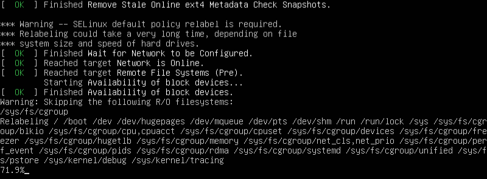

  * 初次配置 `selinux`，重启后

  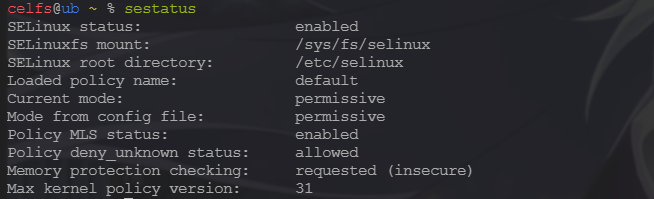

  * 配置 `/etc/selinux/config` 
    * `permissive` --> `disabled` 

  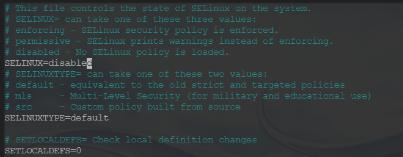

  * 3）指定数据端口范围 `vim /etc/vsftpd.conf` 

  

  * 4）开通防火墙

  ```bash
  # 安装 firewalld
  sudo apt update
  sudo apt install firewalld
  
  # 方法一：开通 ftp 服务
  sudo firewall-cmd --zone=public --add-service=ftp --permanent
  
  # 方法二：开通 ftp 服务需要的端口（21控制端口，5000-5500数据端口范围）
  sudo firewall-cmd --zone=public --add-port=21/tcp --permanent
  
  sudo firewall-cmd --zone=public --add-port=5000-5500/tcp --permanent
  
  # 重启防火墙
  systemctl restart firewalld.service
  ```

  * 报错（需要使用 `sudo` 操作）

  

  * 执行完毕

  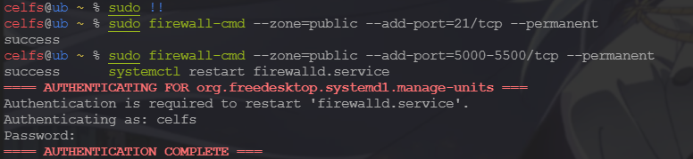

  * 5）启动 `vsftpd` 服务

  ```bash
  systemctl start   vsftpd   # 启动服务。
  systemctl stop    vsftpd    # 停止服务。
  systemctl restart vsftpd    # 重启服务。
  systemctl status  vsftpd    # 查看服务状态。
  systemctl enable  vsftpd    # 启用开机自启动vsftpd服务。
  systemctl disable vsftpd    # 禁用开机自启动vsftpd服务。
  ```

  * `start` --> `status` （至此，本地服务器配置完成）

  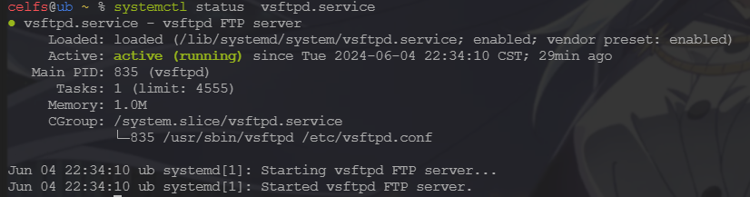

  * 配置云服务访问策略（阿里云为例）
    * 网络和安全组 --> 安全组配置 --> 配置规则 --> 手动添加（如下）

  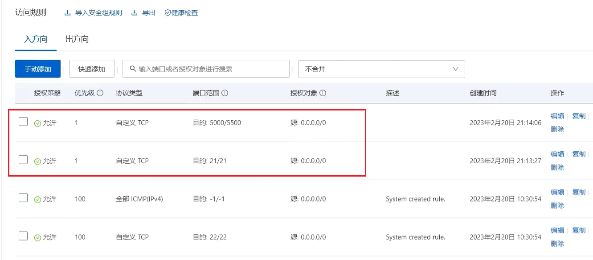

* 进一步介绍（ftp 传输模式）

  * 背景
    * 早期的计算机都有一个 IP 地址，ftp 只有主动模式，后来出现了共享上网技术。主动模式，仅支持两个相对的端口，若使用命令端口 `n`，则数据端口为 `n - 1`，操作简单，用于内网环境配置防火墙十分方便。被动模式，默认命令端口 21，数据端口则随机分配，但数据端口的范围可以配置，防火墙也可以配置相应的端口范围。
  * 主动模式（port 模式）
    * 只能用于内网，此时客户端与服务端可以互相访问
    * 仅使用 21 与 20 端口
    * 发送 ftp 请求时，由客户端 TCP 连接；传输数据时，TCP 连接由服务端发起

  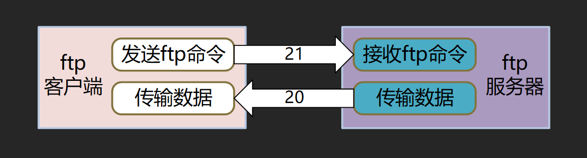

  * 被动模式（pasv 模式，默认 / 缺省）
    * 使用高端口

  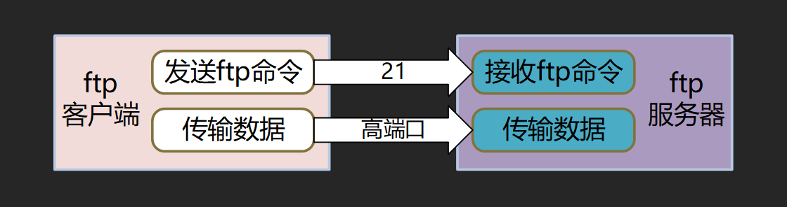

  * 区别与联系
    * 数据传输所用端口不同（固定端口 VS 随机高端口）
    * 主动模式由客户端经 21 端口发起 TCP 请求
    * 被动模式由客户端经 21 端口发起命令，待服务器收到请求后，打开一个闲置的高端口，并告知客户端该端口，由客户端向该高端口发起 TCP 连接
  * 理解
    * 两种模式下，21端口都是服务器始终敞开的，这就好像银行的大门在工作日始终开放。
    * 不同的是，主动模式就像银行只有一个业务窗，每次客户都是从银行大门进去，要办业务就只能在同一个业务窗进行。
      * 请注意，20端口是客户端的，因此在这个例子中，业务窗本来应当是每个客户自己带着的，但这显然不符合实际。虽然这个例子并不十分准确，但足以说明端口单一所带来的麻烦，而且这种冲突也与早期计算机在共享上网技术上，由于公网转换所带来的无法准确识别对应客户的 20 端口的问题。
      * 就好比我在家有一个 20 端口，你在家也有一个 20 端口，而我们先后到银行，同一间银行代表我们的目的地相同，而这个目的地被转换为同一个公网 IP。
      * 按照设计，我们本身都不需要排队，但由于服务窗口只有一个，我们产生了设计以外的排队等待行为，这种意外就相当于给计算机下了一个有歧义的命令，这直接违背了计算机的顶层设计，自然地，命令就不会执行了。当然，也可能会执行，但可能产生未定义的行为，导致意外的发生。而这种模式，并不适合共享上网的环境，于是诞生了被动模式
    * 被动模式就像银行由很多个业务窗，每次客户不光可以进入银行，而且可以在门口取个号，就能知道自己该去哪个业务窗排队。

* 经验

  * 主动模式与被动模式的原理，**一定要搞清楚**，否则很多问题会想不明白。

* 疑问

  * 还是没有理解主动模式与被动模式，以及它们的传输方式对应的图的关系。
  * ~~如何理解 TCP 请求在 ftp 传输当中的角色？为什么是 TCP 连接，而不是别的？ftp 没有自己的传输连接对象吗？~~ 
    * TCP 是传输层协议，而 ftp 是应用层协议，前者为后者提供可靠、有序的数据传输，即后者依赖于前者。
    * FTP本身是应用层协议，**没有独立的传输机制**。它依赖于TCP提供的传输服务。ftp 使用 TCP 连接来实现命令通道和数据通道的传输。
  * ~~既然 ftp 使用了 TCP 连接，这是否可以说 ftp 相当于一种特殊的 TCP 协议？~~ 
    * 可以这么理解。TCP 提供可靠的传输，而 ftp 定义了文件传输的具体操作和格式。但值得注意的是，它们所处的协议层级不同。


* 2024/06/04 23:54:02，2024/06/05 17:13:13，GPT 答疑

------


### 63 手工执行ftp命令

* 概括

  * 本节介绍了 ftp 的常用命令，演示了如何登录 ftp 服务器、如何操作工作目录，以及如何下载与上传文件，并且简要测试了 Linux 下的 ftp 与 Windows 下的 ftp 的操作。涉及的内容均可根据课程文档进行实验。

* 测试

  * 使用云服务器与本地服务器进行 ftp 连接

* 代码流程

  * ftp 用户（缺省下，用户名/密码同当前 OS 的用户名/密码）

  * 登录服务器

    * 可输入虚拟机IP --> 提示 Linux 用户名 + 密码 --> 登录（三种方式如下）

    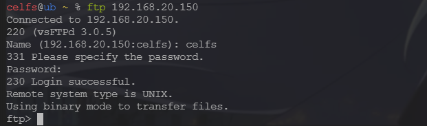

    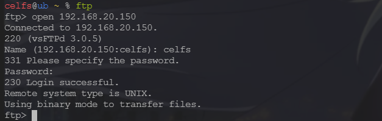

    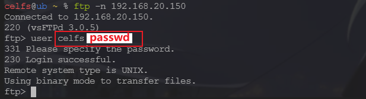

* 登录、目录、文件相关指令调试

```bash
## 登录服务器
zsh$ ftp 192.168.20.150		# 方法一
ftp> open 192.168.20.150 	# 方法二
zsh$ftp -n 192.168.20.150 	# 方法三
ftp> user oracle pwd_oracle

# 退出 ftp 服务器
ftp> quit


## 切换工作目录
# 查看服务器工作目录
ftp> pwd

# 切换服务器工作目录
ftp> cd dir_path

# 切换本地工作目录
ftp> lcd dir_path


## 查看服务器的目录和文件
ftp> ls dir_name | file_name
ftp> dir dir_name | file_name

# 列出目录下的匹配文件名 *.h 的信息，可重定向输出到文件
ftp> nlist dir_name/*.h
```

* **FTP 文件传输模式** 
  * 二进制模式：任何文件（压缩包、可执行程序、图片、视频、音频… --> 实际开发使用）
  * ASCII 码模式：仅支持 `.txt`、`.html` 等 ASCII 码文件（文件文件）

```bash
# 查看当前传输模式
ftp> type

# 切换传输模式
ftp> bin
ftp> ascii
```

* 传输模式切换

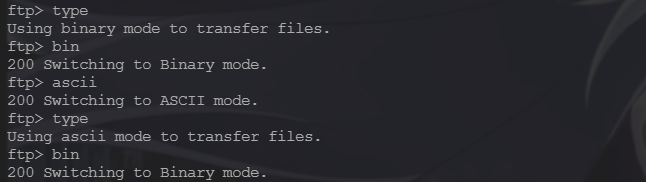

* Windows 使用 ftp 访问虚拟机

  * 访问方式与局域网内其他可发现设备一致。
  * 输入 `ftp://192.168.20.150/` 
  * 提示输入用户名和密码（缺省为 Ubuntu 虚拟机的用户名和密码）
  * 登录成功，可以看到登录在虚拟机的 `/home/celfs` 路径

  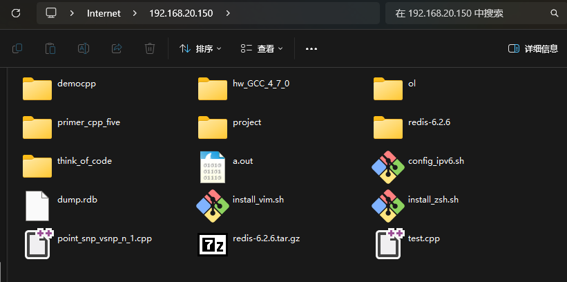

  * 测试文件操作权限1（主机 --> 拖动文件 --> 虚拟机 | 权限不足 | 已解决）

  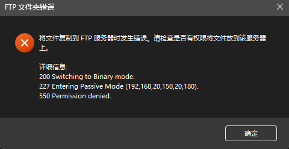

  * 测试文件操作权限2（虚拟机--> 拖动文件 --> 主机 | 权限满足）

  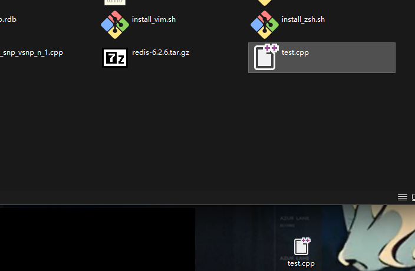

  * ~~文件的双向传输（未实现，待处理，可参考 Electerm 的 Sftp）~~ 
    * 可能需要在虚拟机系统开放相应的访问与文件操作权限；
    * 可能仅需要在虚拟机的 ftp 服务器设置相应权限；
    * ~~可能仅需要建立主机与虚拟机的 ftp 连接，而不用上述访问方式；~~ 
    * 可能仅需要切换为 root 用户访问；
    * 报错信息 ：`200, 227, 550` 
  * **问题解决**（修改写入权限即可 | 默认注释，即关闭写）

  ```bash
  sudo vim /etc/vsftpd.conf
  ```

  

  * 写入成功

  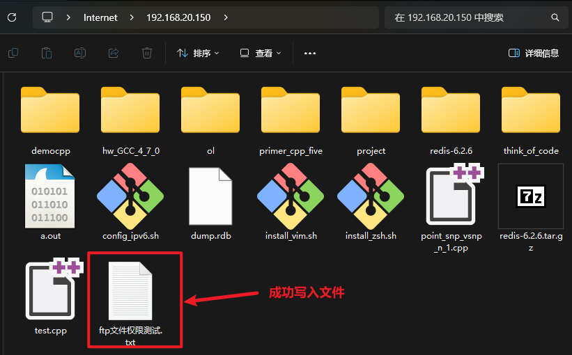

  * Windows 命令行模式 ftp 连接

  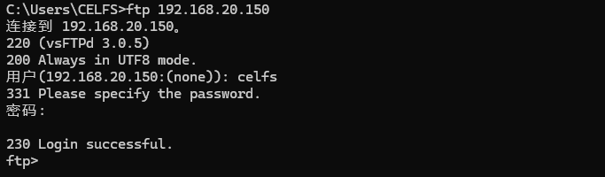

  * 从服务端下载文件到主机

  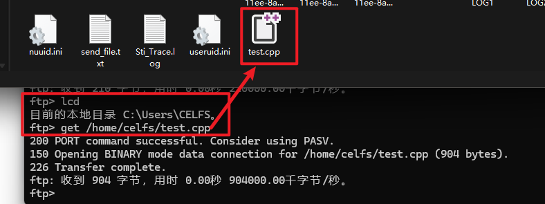

  * 从主机本地目录上传文件到服务端

  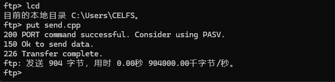

  * 测试
    * 可多端开启 ftp 访问（主机、本地服务器同时访问）
    * 无法从虚拟机内部 ftp 到主机 `ftp: connect: Connection refused` （问题未解决）
    * 命令行连接，使用 `lcd` 双向传输文件

* **ftp 操作权限**（经验证，上述问题由用户权限导致，添加写入权限即可解决）

  * 对**本地**目录和文件的操作权限，由执行 ftp 命令的用户权限决定。
  * 对**服务端**目录和文件的操作权限，由**登录用户的权限**决定。

* 下载文件

  * 单文件下载
    * `get` 或 `recv` 等价
    * 文件不允许通配符，如 `*, ?` 
    * 路径缺省，表示当前工作目录；文件名缺省，表示同名
  * 多文件下载
    * `mget` （实际开发基本不用）
    * 支撑通配符
    * 默认存到于当前工作目录，各文件一一提示，可关闭提示

```bash
# 下载单个文件，等价语法如下
get /home/celfs/test.cpp /home/celfs/ttdir/ok.cpp
recv /home/celfs/test.cpp /home/celfs/ttdir/ok.cpp

# 下载多个文件，一一提示
mget 服务端文件1 服务端文件2 服务端文件3 …… 服务端文件n
# 关闭提示
prompt
```

* 上传文件
  * 单文件上传（规则与下载一致）

```bash
# 上传单个文件，等价语法如下
put /home/celfs/test.cpp /home/celfs/ttdir/ok.cpp
send /home/celfs/test.cpp /home/celfs/ttdir/ok.cpp

# 上传多个文件，一一提示
mput 本地文件1 本地文件2 本地文件3 …… 本地文件n
# 关闭提示
prompt
```

* 其他 ftp 命令
  * 1、2、4 常用

```bash
# 1）重命名ftp服务端的文件
rename 旧文件名 新文件名

# 2）删除ftp服务端上单个文件
delete 文件名

# 3）删除ftp服务端的多个文件。
mdelete 文件名1 文件名2 文件名3 …… 文件名n

# 4）在ftp服务端上创建目录。
mkdir pathname

# 5）删除ftp服务端上的目录。
rmdir pathname

# 6）切换传输模式。
passive

# 7）显示帮助信息。
help [命令名]
# 显示ftp命令的帮助信息，如果不输入命令名，则显示全ftp命令的帮助信息。

# 8）退出ftp。
bye
```

* 延伸 / 感悟
  * 也可以使用同一台虚拟机，在其中区分客户端与服务端。
  * 可以尝试虚拟机与本机系统 ftp 连接，并且尝试实现虚拟机的文件共享功能？
  * Electerm 这个 shell，使用的 Sftp 进行传输。
  * 通过 ftp 直接访问虚拟机，发现数据传输是多么的便捷，就好像打开了一座牢笼的通道。原本以为虚拟机与主机的资源访问很麻烦，现在看来，十分便捷。但这只是打开了端口，文件操作权限不一定正确。
* 经验
  * 测试文件可用 `/tmp/filename` 路径，因为会定期清理。
* 疑问
  * 为什么 “root用户的权限过大，不允许登录 ftp 服务器” ？避免越权访问到系统重要文件，从而确保传输通道安全？
  * ftp 的 timeout 默认值为多少？为什么要设置超时时间？考虑到 ftp 传输机制基于 TCP，是否意味着这个超时时间为 2MSL？其传输行为是否都与 TCP 一致？
  * ~~ftp `Timeout` 之后，如何重新登录？必须要退出 ftp 吗？~~ 
    * 并不需要。这也是为什么，登录 ftp 服务器的方式有三种。仅需使用已进入 ftp 服务器界面的登录语句，重新 `open IP` 登录即可。
  * 是否有更好的 shell 来控制 ftp 服务器？类似 MySQL 的代码补全 shell。
  * 为什么会有 `lcd` 这种目录切换模式？对比 ftp 中的 `cd` 有何区别？此时的 “服务器” 与 “本地”，分别指的是哪个对象？
  * ftp 记录了登录的用户名和密码，如何切换 root 用户重新登录？
  * ftp 的文件下载与上传，之所以有 `recv` 和 `send`，离不开 `socket` 底层实现的这两个函数？也因为基于 TCP 连接的传输，方法一样就不奇怪了。


* 2024/06/05 17:35:40，2024/06/05 19:51:45
* 2024/06/06 19:31:03，多种代码实现，测试 ftp 双向传输，debug 等

------


### 64 封装ftp客户端

* 背景
  
  * FTP 协议最底层是 TCP 报文，但如果从 `socket` 开始编程，工作量巨大。因此，好的办法是寻找 FTP 客户端的开源库（ `ftplib` ），封装成简单易用的类 `cftp` 。
* 概括
  
  * 演示了如何从下载开源文件到一步步封装的过程。强调要抓重点来使用开源库，用起来，而不必搞清楚每个细节。介绍了封装的细节，思路是将结构体与若干功能函数整合起来。
* 流程

  * 介绍 FTP 及响应码
  * 查找开源库 `ftplib` （C 语言版本演示）
  * `makefile` 将其编译为静态库与动态库
  * 封装为 `.cpp` （三个 demo，**先测试功能，搞懂用法，不管细节**）
    * demo50
      * 演示了获取 FTP 服务端目录下的文件以及文件时间与大小
      * 四个成员函数 `.login(), .nlist(), .mtime(), .size()` 
    * demo51
      * 演示了采用开发框架 `cftpclient` 类上传文件
      * 使用成员函数 `.login(), .mkdir(), .chdir(), .put()` 
    * demo52
      * 演示了采用开发框架 `cftpclient` 类下载文件
      * 使用成员函数 `.login(), .get()` 
  * 介绍 `ftplib.h` 、 `_ftp.h` 及 `_ftp.cpp` 的封装细节
    * 支持 Linux 及 Windows
    * 重点（一个结构体 + 一些函数 --> 整合即封装思路）
    * 详细介绍 `get` 及 `put` 函数
      * `bcheckmtime` 参数通过检查传输前后时间，校验文件完整性（下载）
      * `bchecksize` 参数核对文件大小，校验文件完整性（上传）
      * 下载过程中，生成本地文件的临时文件名（防止下载途中被读取）
      * 传输完成 --> 修改文件时间 --> 文件正式命名
* 代码分析
  * 修改路径
  * `ftplib.h` 
    * 代码规模：121 Line
    * 主要内容
      * 兼容性：`__unix__` 和 `_WIN32` 
      * 结构体：`netbuf` 
      * 1）定义了一些代码版本分支兼容的语句；
      * 2）声明了若干功能函数所需的宏定义参数，例如访问类型、访问模式、连接模式、连接选项名；
      * 3）声明了若干 FTP 功能函数，包括初始化、响应、连接、回调、登录、访问、文件读写、目录切换、目录查阅、完整性校验、上传下载、重命名、删除、退出等。
  * `ftplib.c` 
    * 代码规模：1456 Line
    * 主要内容（具体实现）
      * 兼容性定义 --> 结构体定义 --> 
      * 若干重载方法（to 407，辅助函数） --> 
      * 实现功能函数（按声明顺序 + 辅助函数）
  * `_ftp.h` 
    * 代码规模：118 Line
    * 主要内容
      * 声明 `cftpclient` 类
      * 声明 FTP 常用命令 `get, put, nlist, size, mtime, chdir, site` 等 
  * `_ftp.cpp` 
    * 代码规模：233 Line
    * 主要内容（具体实现）
      * 基于 `ftplib.c` 的封装
      * 核心为 `get` 与 `put` 的实现，从形参可知，其操作与 ftp 保持一致

```cpp
bool cftpclient::get(const string &remotefilename,const string &localfilename,const bool bcheckmtime)
{
    if (m_ftpconn == 0) return false;

    // 创建本地文件目录。
    newdir(localfilename);

    // 生成本地文件的临时文件名。
    string strlocalfilenametmp=localfilename+".tmp";

    // 获取远程服务器的文件的时间。
    if (mtime(remotefilename) == false) return false;

    // 取文件。
    if (FtpGet(strlocalfilenametmp.c_str(),remotefilename.c_str(),FTPLIB_IMAGE,m_ftpconn) == false) return false;
  
    // 判断文件下载前和下载后的时间，如果时间不同，表示在文件传输的过程中已发生了变化，返回失败。
    if (bcheckmtime==true)
    {
        string strmtime=m_mtime;

        if (mtime(remotefilename) == false) return false;

        if (m_mtime!=strmtime) return false;
    }

    // 重置文件时间。
    setmtime(strlocalfilenametmp,m_mtime);

    // 改为正式的文件。
    if (rename(strlocalfilenametmp.c_str(),localfilename.c_str()) != 0) return false; 

    // 获取文件的大小。
    m_size=filesize(localfilename);

    return true;
}


bool cftpclient::put(const string &localfilename,const string &remotefilename,const bool bchecksize)
{
    if (m_ftpconn == 0) return false;

    // 生成服务器文件的临时文件名。
    string strremotefilenametmp=remotefilename+".tmp";

    string filetime1,filetime2;
    filemtime(localfilename,filetime1);   // 获取上传文件之前的时间。

    // 发送文件。
    if (FtpPut(localfilename.c_str(),strremotefilenametmp.c_str(),FTPLIB_IMAGE,m_ftpconn) == false) return false;

    filemtime(localfilename,filetime2);   // 获取上传文件之后的时间。

    // 如果文件上传前后的时间不一致，说明本地有修改文件，放弃本次上传。
    if (filetime1!=filetime2) { ftpdelete(strremotefilenametmp); return false; }
    
    // 重命名文件。
    if (FtpRename(strremotefilenametmp.c_str(),remotefilename.c_str(),m_ftpconn) == false) return false;

    // 判断已上传的文件的大小与本地文件是否相同，确保上传成功。
    // 一般来说，不会出现文件大小不一致的情况，如果有，应该是服务器方的原因，不太好处理。
    if (bchecksize==true)
    {
        if (size(remotefilename) == false) return false;

        if (m_size != filesize(localfilename)) { ftpdelete(remotefilename); return false; }
    }

    return true;
}
```

* 调试

  * `demo50.cpp` （42 Line）
    * 修改 `login` 信息
    * 修改 I/O 路径（绝对路径，否则报错；因为启动 ftp 默认在 `/home/usr` ）
    * 编译 --> 执行 --> `ret = 226 Transfer done (but failed to open directory).` （相对路径，导致输入的路径不存在）
    * 修改为绝对路径，成功运行

  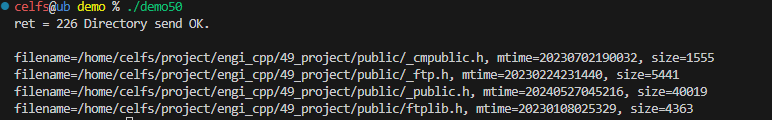

  * `demo51.cpp` （33 Line）
    * 修改登录信息 --> 修改路径 --> 成功切换目录 + 上传文件

  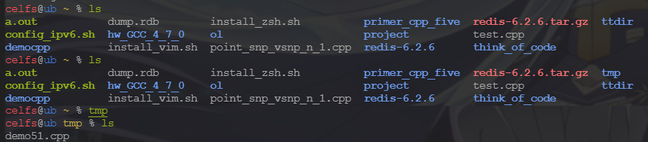

  * `demo52.cpp` （37 Line）
    * 修改登录信息 --> 修改路径 --> 成功下载文件

  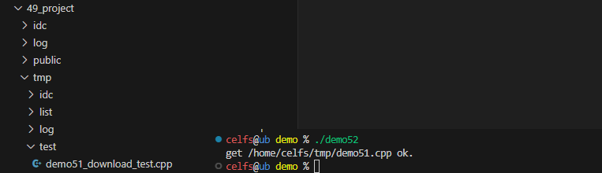

* 经验

  * 在服务端创建目录，不容易处理。因为每个 FTP 命令都需要在底层进行一次 TCP 通讯，向服务端发送一个报文，再接收回应，时间开销比较大。如果每次上传文件之前，都要进行额外的 TCP 通讯，则影响时间并影响性能。如果需要在服务端创建目录，只能再程序中用代码创建。（这个过程理解不够清晰）
  * 实际开发中，`response()` 函数可用于获取错误的原因。
  * 上述封装的函数，**不管有没有疑问，都要动手测试**，避免得过且过，影响后面的理解。
  * 抓重点使用开源库，用起来，而不必搞清楚每个细节。按模块整体理解，忽略部分细节。
  * 读千行代码 `ftplib.cpp` 发现，若干重载或者不在头文件定义的函数，都是为功能函数的实现准备的，这种额外定义的函数，有的会很长，具体需要根据功能函数的实现逻辑与模块分割来确定。起码知道了一些代码搭建的经验。
    * 另外，若属于大部分功能函数需要的额外函数，则在文件开头定义与实现，若仅属于个别功能函数，则在其前面邻近位置定义与实现。

* 感悟

  * 介绍了 FTP 与 TCP 的关系，及其响应码。回过头来想，响应码不过是 “一个萝卜一个坑” 压出来的坑，每个操作背后都有所属类别的响应码，响应即回响，即一种状态反馈罢了，并不是什么神秘的东西，它们就好像那些相关操作的影子。

* 疑问

  * 本节没有代码实现过程，仅仅介绍与讲述了3个demo文件，4个开源文件的具体内容。那么该如何消化这种形式输入的信息？如何更有效地学习这几个文件？动手测试，搞懂功能与用法。
  * 不熟悉动态库与静态库的编译语法，需要整理 + 回顾。

  ```makefile
  # 动态库与静态库编译
  libftp.a:ftplib.h ftplib.c
  	gcc -c -o libftp.a ftplib.c 
  
  libftp.so:ftplib.h ftplib.c
  	gcc -fPIC -shared -o libftp.so ftplib.c 
  ```

  * 为什么要多次宏定义同一个内容？类似多次 `typedef` 增加可读性？

  ```cpp
  /* FtpAccess() mode codes */
  #define FTPLIB_ASCII 'A'
  #define FTPLIB_IMAGE 'I'
  #define FTPLIB_TEXT FTPLIB_ASCII
  #define FTPLIB_BINARY FTPLIB_IMAGE
  ```

  * 如何理解头文件的兼容性语句？通过不同平台的标识宏，来区分当前程序所处的平台？进而控制代码的生效分支？
  * ~~如何理解下方语法？为什么只有半个花括号？~~ 
    * 并非半个花括号，而是将一完整语句分开定义了，这种用法在前面某个 demo 也用过（用来充当注释，其实是按情况控制分支）。

  ```cpp
  #ifdef __cplusplus
  extern "C" {
  #endif
      
  #ifdef __cplusplus
  };
  #endif
  ```

  * 为什么开源库有的代码格式十分不规范？例如类似 K&R 风格，但又不遵循缩进的原则（1104 Line）。会不会是因为格式化了代码，导致的错乱？

  ```cpp
  GLOBALDEF int FtpSysType(char *buf, int max, netbuf *nControl)
  {
      int l = max;
      char *b = buf;
      char *s;
      if (!FtpSendCmd("SYST",'2',nControl))
  	return 0;
      s = &nControl->response[4];
      while ((--l) && (*s != ' '))
  	*b++ = *s++;
      *b++ = '\0';
      return 1;
  }
  ```

  

* 2024/06/05 17:46:55，2024/06/07 1:33:22 视频 + 笔记，未调试代码
* 2024/06/07 17:07:17 解读两个开源库
* 2024/06/07 19:22:40 完成代码解读 + 代码调试

------


### 65 文件下载模块（一）

* 背景
  
  * 通用模块，在实际开发中很常用，不局限于某个项目。本节程序较为复杂，完成练习可以有效提高代码能力。
  
* 代码流程
  * 任务
    
    * 1）从服务器某个目录下载文件，可指定文件匹配的规则
    
  * `ftpgetfiles.cpp` 

    * 创建文件
    * 基本框架（头文件、命名空间、信号处理函数、主函数）
    * `makefile` 增加编译指令（ `ftpgetfiles` + 链接库）
    * `main` 优化参数表示（ `xml` 标签提高可读性、可扩展性）
    * 调试 --> 将参数封装到子函数 `_help()` --> 调试 --> 绝对路径

  * 分步实现 --> 列出具体流程 --> 实现子流程

    * 1）从服务器某个目录下载文件，可指定文件匹配的规则

      * 1.1）打开日志文件
        * 声明日志对象 --> 引入日志结构体 + 全局日志对象 --> 打开日志
      * 1.2）解析 `xml`，得到程序运行的参数
        * 声明子函数 `_xmltoarg()` --> 调用代码 -->
        * 实现函数功能
          * 初始化结构体 --> 获取服务端 IP 及端口 --> 
          * 参数逐一实现（获取 + 判断 + 写日志）
        * `gdb` 调试
          * `make` + 获取参数 --> `gdb ftpgetfiles` -->
          * `set args params` --> 设置断点 `b 89` --> `run` --> 
          * 显示结构体 `p starg` --> 核对各成员内容 --> 退出 `q` 

      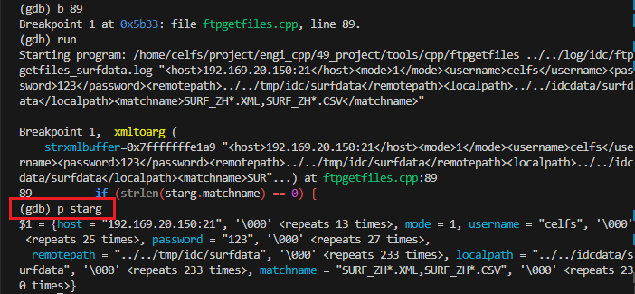

      * 1.3）登录 ftp 服务器
      * 1.4）进入 ftp 服务器存放文件的目录
      * 1.5）调用 `ftpclient.nlist()` 方法，列出服务器目录中的文件名，保存在本地文件中
        * 格式化命名输出文件 --> `.nlist` 后缀（可读性）
        * 添加日志 + 优化 `_help()` 参数（调度模块）
      * 1.6）加载到容器 `vfilelist` 
        * 定义文件信息结构体
        * 声明 `nlist` 容器
        * 声明数据加载函数 `loadlistfile()` 
        * `main` 调用
        * 实现数据加载函数
          * 清空容器 --> 打开文件 --> 
          * 按行读取文件名列表 --> 文件匹配 --> 调试

      * 1.7）遍历 `vfilelist` 容器
        * 定义两个全路径文件名的变量（服务端、本地）
        * 遍历容器 --> 拼接全路径文件名 --> 写日志 --> 下载文件
        * 切换 `root` 创建目录 `mkdor /idcdata` --> 授权普通用户 `chown -R celfs:usr_group /idcdata` （权限足够，忽略）
      * **程序备份** `ftpgetfiles.cpp65`

```cpp
#include "../../public/_public.h"
#include "../../public/_ftp.h"

using namespace idc;

void EXIT(int sig);

struct st_arg {
    char host[31];          // 远程服务端的 IP 和端口
    int mode;               // 传输模式，1-被动模式（缺省）；2-主动模式
    char username[31];
    char password[31];
    char remotepath[256];   // 远程服务端存放文件的目录
    char localpath[256];    // 本地文件存放的目录
    char matchname[256];    // 待下载文件匹配的规则
} starg;

bool _xmltoarg(const char *strxmlbuffer); // 把 xml 解析到参数 starg 结构体中

clogfile logfile;
cftpclient ftp;

void _help();

struct st_fileinfo {    // 文件信息结构体

    string filename;
    string mtime;
    st_fileinfo() = default;
    st_fileinfo(const string &in_filename, const string &in_mtime):filename(in_filename), mtime(in_mtime) {}
    void clear() {
        filename.clear();
        mtime.clear();
    }

};

vector<struct st_fileinfo> vfilelist;
bool loadlistfile();

int main(int argc, char *argv[]) {

    if (argc != 3) { _help(); return -1; }

    // closeioandsignal(true);
    signal(SIGINT, EXIT); signal(SIGTERM, EXIT);

    // 1) 从服务器某个目录下载文件，可指定文件匹配的规则

    // 打开日志文件
    if (logfile.open(argv[1]) == false) {
        printf("logfile open failed (%s).\n", argv[1]);
        return -1;
    }

    // 解析 xml，得到程序运行的参数
    if (_xmltoarg(argv[2]) == false) {
        return -1;
    }

    // 登录 ftp 服务器
    if (ftp.login(starg.host, starg.username, starg.password, starg.mode) == false) {
        logfile.write("ftp.login(%s, %s, %s) failed.\n", starg.host, starg.username, starg.password); return -1;
    }

    logfile.write("ftp.login ok.\n");

    // 进入 ftp 服务器存放文件的目录
    if (ftp.chdir(starg.remotepath) == false) {
        logfile.write("ftp.chdir(%s) failed.\n", starg.remotepath); return -1;
    }

    // 调用 ftpclient.nlist() 方法，列出服务器目录中的文件名，保存在本地文件中
    if (ftp.nlist(".", sformat("/home/celfs/project/engi_cpp/49_project/tmp/nlist/ftpgetfiles_%d.nlist", getpid())) == false) {
        logfile.write("ftp.nlist(%s) failed.\n", starg.remotepath); return -1;
    }
    logfile.write("nlist(%s) ok.\n", sformat("/home/celfs/project/engi_cpp/49_project/tmp/nlist/ftpgetfiles_%d.nlist", getpid()).c_str());
    

    // 把 ftpclient.nlist() 方法获取到的 list 文件，加载到容器 vfilelist 中
    if (loadlistfile() == false) {
        logfile.write("loadlistfile() failed.\n"); return -1;
    }

    string strremotefilename, strlocalfilename;
    // 遍历 vfilelist 容器
    for (auto &aa : vfilelist) {

        sformat(strremotefilename, "%s/%s", starg.remotepath, aa.filename.c_str());     // 拼接服务端全路径的文件名
        sformat(strlocalfilename, "%s/%s", starg.localpath, aa.filename.c_str());       // 拼接本地全路径的文件名

        logfile.write("get %s ...", strremotefilename.c_str());
        // 调用 ftpclient.get() 方法下载文件
        if (ftp.get(strremotefilename, strlocalfilename) == false) {
            logfile << "failed.\n"; return -1;
        }

        logfile << "ok.\n";
    }

    return 0;
}

bool _xmltoarg(const char *strxmlbuffer) {

    memset(&starg, 0, sizeof(struct st_arg));

    getxmlbuffer(strxmlbuffer, "host", starg.host, 30);
    if (strlen(starg.host) == 0) {
        logfile.write("host is null.\n"); return false;
    }

    getxmlbuffer(strxmlbuffer, "mode", starg.mode);
    if (starg.mode != 2) starg.mode = 1;

    getxmlbuffer(strxmlbuffer, "username", starg.username, 30);
    if (strlen(starg.username) == 0) {
        logfile.write("username is null.\n"); return false;
    }

    getxmlbuffer(strxmlbuffer, "password", starg.password, 30);
    if (strlen(starg.password) == 0) {
        logfile.write("password is null.\n"); return false;
    }

    getxmlbuffer(strxmlbuffer, "remotepath", starg.remotepath, 255);
    if (strlen(starg.remotepath) == 0) {
        logfile.write("remotepath is null.\n"); return false;
    }

    getxmlbuffer(strxmlbuffer, "localpath", starg.localpath, 255);
    if (strlen(starg.localpath) == 0) {
        logfile.write("localpath is null.\n"); return false;
    }

    getxmlbuffer(strxmlbuffer, "matchname", starg.matchname, 100);
    if (strlen(starg.matchname) == 0) {
        logfile.write("matchname is null.\n"); return false;
    }

    return true;
}

void EXIT(int sig) {
    
    printf("程序退出，sig = %d\n\n", sig);

    exit(0);
}

void _help() {

    printf("\n");
    printf("Using: ../../tools/bin/ftpgetfiles logfilename xmlbuffer\n\n");
    printf("Sample: /home/celfs/project/engi_cpp/49_project/tools/bin/procctl 30 /home/celfs/project/engi_cpp/49_project/tools/bin/ftpgetfiles /home/celfs/project/engi_cpp/49_project/log/idc/ftpgetfiles_surfdata.log " \
            "\"<host>192.168.20.150:21</host><mode>1</mode>"\
            "<username>celfs</username><password>123</password>"\
            "<remotepath>/home/celfs/project/engi_cpp/49_project/tmp/idc/surfdata</remotepath><localpath>/home/celfs/project/engi_cpp/49_project/idcdata/surfdata</localpath>"\
            "<matchname>SURF_ZH*.XML,SURF_ZH*.CSV</matchname>\"\n\n");

    printf("本程序是通用的功能模块，用于把远程ftp服务端的文件下载到本地目录。\n");
    printf("logfilename是本程序运行的日志文件。\n");
    printf("xmlbuffer为文件下载的参数，如下：\n");
    printf("<host>192.168.150.128:21</host> 远程服务端的IP和端口。\n");
    printf("<mode>1</mode> 传输模式，1-被动模式，2-主动模式，缺省采用被动模式。\n");
    printf("<username>wucz</username> 远程服务端ftp的用户名。\n");
    printf("<password>oraccle</password> 远程服务端ftp的密码。\n");
    printf("<remotepath>/tmp/idc/surfdata</remotepath> 远程服务端存放文件的目录。\n");
    printf("<localpath>/idcdata/surfdata</localpath> 本地文件存放的目录。\n");
    printf("<matchname>SURF_ZH*.XML,SURF_ZH*.CSV</matchname> 待下载文件匹配的规则。"\
            "不匹配的文件不会被下载，本字段尽可能设置精确，不建议用*匹配全部的文件。\n");

}

bool loadlistfile() {
    vfilelist.clear();

    cifile ifile;
    if (ifile.open(sformat("/home/celfs/project/engi_cpp/49_project/tmp/nlist/ftpgetfiles_%d.nlist", getpid())) == false) {
        logfile.write("ifile.open(%s) failed.\n", sformat("/home/celfs/project/engi_cpp/49_project/tmp/nlist/ftpgetfiles_%d.nlist", getpid())); return false;
    }

    string strfilename;

    while (true) {
        if (ifile.readline(strfilename) == false) break;

        if (matchstr(strfilename, starg.matchname) == false) continue;

        vfilelist.emplace_back(strfilename, "");
    }

    ifile.closeandremove();

    for (auto &aa : vfilelist) {
        logfile.write("filename = %s\n", aa.filename.c_str());
    }

    return true;
}
```

```makefile
# 开发框架头文件路径
PUBINCL = -I../../public

# 开发框架 cpp 文件名，直接和程序的源代码一起编译，没有采用链接库，为了方便调试
PUBCPP = ../../public/_public.cpp

# 编译选项
CFLAGS = -g
# CFLAGS = -O2

all: ftpgetfiles

ftpgetfiles: ftpgetfiles.cpp
		g++ $(CFLAGS) -o ftpgetfiles ftpgetfiles.cpp $(PUBINCL) $(PUBCPP) ../../public/libftp.a ../../public/_ftp.cpp
		cp -f ftpgetfiles ../bin/.

clean:
		rm -rf ftpgetfiles
```

* 经验
  * 要做稳定可靠的程序员，**不要做浮躁的程序员**。参数测试步骤比较繁琐，但这正是提高工作能力的机会。就算技术再好，做不到认真负责，那么工作能力也大打折扣。能力不仅仅是技术，认真、细心、负责、耐心同样重要。
  * 比较啰嗦的内容，都放到单独的子函数中。
  * 在使用 ftp 切换目录时，**绝对路径**很重要。
* 思考
  * 如果不使用 `chdir` 而直接进入当前工作目录，程序逻辑是否有问题？
    * 区别：获取的文件名称不包含目录 VS 包含目录 --> 额外传输 + 多余路径
* 感悟
  * 当思考 / 回忆一个算法的时候，脑子里想到的是模糊的代码，这样是一定学不会的。因为回忆代码意味着未理解算法的逻辑，未理解如何实现算法的具体逻辑分点。因此，这是一种错误方法的警示。正确地习得算法，应当是能够将该算法的流程分块、清晰列出。继续针对不同分块，懂得如何实现相应的功能。

* 疑问
  * 什么是原地构造的方法？例如原本要传入某个格式的字符串，直接在函数调用时，将这个格式构造出来，全部传给该函数？
  * 声明结构体时，若在结尾添加名称，实际同时创建了该名称的全局结构体变量。以前还纳闷为什么要这样写，被同名的变量误导了。
  * 如何理解见过几种不同用法，使用容器之前都进行 `clear` 清空？具体什么时候需要清空容器，什么时候不必？
  * 文件授权命令中的参数 `celfs:dba`，后面的 `dba` 是什么意思？
    * `dba` 表示用户组名，本用户 `celfs` 在 `sudo` 组，因此不必额外授权。
    * 完整命令示例如下 `chown -R usr_name:usr_group /dir_name` 


* 2024/06/08 21:24:05 完成代码练习，1h51min

------


### 66 文件下载模块（二）

* 代码流程

  * 任务
    * 2）下载文件后，删除 ftp 服务器上的文件；
    * 3）下载文件后，把 ftp 服务器上的文件移动到备份目录。

  * 增加参数 + 成员

    * 增加参数（处理方式、备份目录；补充 `xml` 参数）
    * 增加结构体成员
    * 增加解析参数的函数

  * `main` 增加判断逻辑（ `ptype == 2 || 3` ）

  * 日志优化

    * 全部添加服务端返回信息 `ftp.response()` 

  * 备份（ `.cpp66` ）

  * 调试

    * `<ptype>2</ptype>` 验证三个目录的文件 --> 成功（删除了 `json` 以外的文件）

    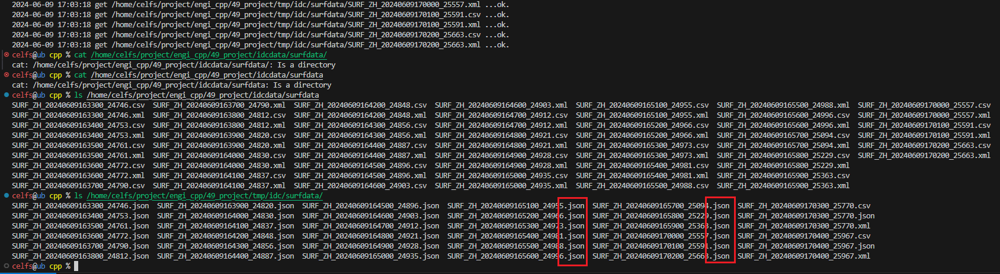

    * `<ptype>3</ptype>` 
      * 清除日志 --> 删除相关目录 --> 执行
      * ~~区别：不会在服务端自动创建目录，因此需手动创建。（本机测试没有出现这个问题，可能是因为 `celfs` 普通用户在 `sudo` 组）~~ 错了，只是因为 `ptype` 没有改成 3，因此，需要手动创建目录。

    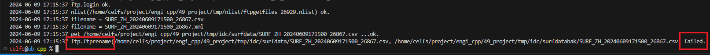

    ```bash
    mkdir ../../tmp/idc/surfdatabak
    ```

    * 成功取走 `csv` 及 `xml` 文件，成功备份目录

    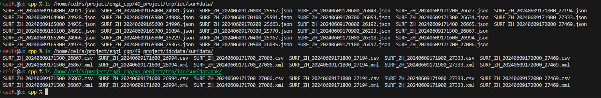

    * **两种报错验证方法** 
      * 1）登录 ftp 服务端，手动执行相同 ftp 命令
      * 2）程序中显示服务端返回的信息 `ftp.response()` 
      * 注意，演示将备份目录更改为 `/root` 目录，操作失败，因为登录 ftp 的用户没有相关权限，本机测试同样操作失败。

    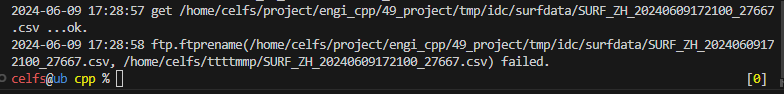

    * 显示一致

    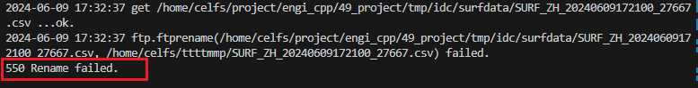

* 经验

  * 帮助文档非常重要，如果把文字理清晰了，设计思路也就基本清晰。
  * 使用 `xml` 处理参数，可便于参数扩展。
  * 记住，完成一节，**备份程序**。


* 2024/06/09 17:38:34 完成视频 + 代码 + 调试 + 笔记，1h20min

------


### 67 文件下载模块（三）

* 代码流程

  * 任务
    
    * 4）增量下载文件，每次只下载新增的和修改过的文件
    
  * 思路

    * 根据文件修改时间，判断文件是否更改
    * 两个目录 `client` 和 `server`，其中文件均从服务端下载

    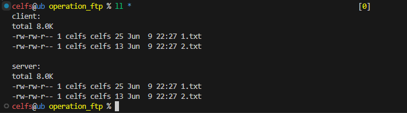

    * 设计 4 个容器（存储文件名 + 文件时间）
      * 容器1：历史文件 --> 已下载
        * （1）客户端本地目录，加载目录文件（每次扫描，时间开销）
        * （2）从容器3和容器4，增量加载数据
      * 容器2：服务器目录文件名（由 `ftp.nlist()` ）
      * 容器3：未改动文件 --> 不需下载（由容器1）
      * 容器4：已改动文件（新增、修改） --> 需下载（由容器1）

    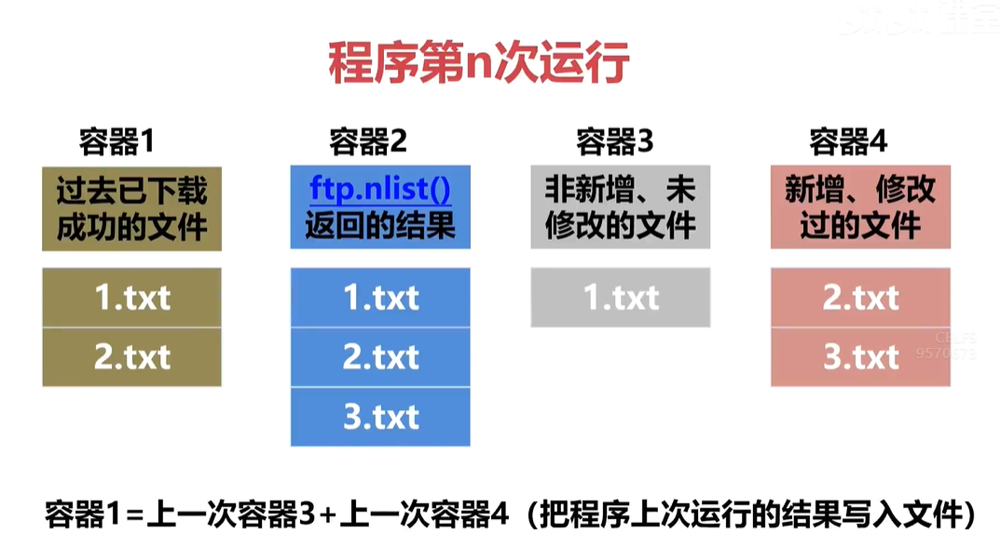

  * 添加参数（ `okfilename`、`checkmtime` ）

    * 增加结构体成员
    * 增加帮助文档参数
    * 增加参数的解析函数

  * **创建 4 个容器** 

    * 1）确定容器类型（仅遍历 --> 链表；需查找 --> 二叉树map）

    ```cpp
    map<string, string> mfromok;           // 容器1：存放已下载成功文件，从okfilename参数指定的文件中加载
    list<struct st_fileinfo> vfromnlist;   // 容器2：下载前列出服务端文件名的容器，从nlist文件中加载
    list<struct st_fileinfo> vtook;        // 容器3：本次不需要下载的文件的容器
    list<struct st_fileinfo> vdownload;    // 容器4：本次需要下载的文件的容器
    ```

    * 2）声明 4 个容器 --> 修改原容器为 `vfromnlist` 
    * 准备容器2
      * 3）修改 `loadlistfile()`，加入文件时间判断逻辑
      * 4）调试
    * 准备容器1
      * 5）创建 + 实现 `loadokfile()` 
        * 用以加载文件到容器1。
      * 6）`main` 相应调用与判断条件
        * 列出程序流程
        * 思考：容器2与容器4，根据 `ptype` 是否等于1，将分别从容器4与容器2获取下载文件。分两种情况下载文件比较麻烦，因此增加代码，根据 `ptype` 条件，按需**交换容器2与容器4的内容**。
        * 将后续容器改为容器4 `vdownload` （待验证，目前改了一组）
      * 7）创建 + 实现 `compmap()` 
        * 用以比较容器2和容器1，得到容器3和容器4。
      * 8）创建 + 实现 `writetookfile()` 
        * 用以将容器3数据写入 `okfilename`，覆盖旧文件。
    * 修改 `main` 遍历容器
      * 9）增加时间参数
      * 10）实现 `starg.ptype == 1` 逻辑
      * 11）创建 + 实现 `appendtookfile()` 
    * 调试
      * 目录状态
        * `client` 空
        * `server` `1.txt 2.txt 3.txt` 
      * 编译 --> 移除日志 --> 运行
      * 目录状态
        * `client`  `1.txt 2.txt 3.txt` 
        * `server` `1.txt 2.txt 3.txt` 
      * 再次删除 `client` 文件，程序不运行（详见下文 BUG 记录）
      * 新增 `4.txt 5.txt`，修改文件 `3.txt` --> 测试
      * 参数 `checkmtime` --> `false` --> 测试
    * 12）增加心跳机制（背景：网络服务程序容易死机）
      * 确定超时时间：业务需要 + 网络环境
      * 增加参数
      * 修改帮助文档
      * 在合适位置更新进程心跳
        * 1）登录 ftp 服务器前，加入心跳信息（避免登录时死机，心跳刷新导致程序陷入死循环）
        * 2）登录 ftp 服务器时，在消耗时间较长的操作后，更新心跳信息
          * 调用 `ftp.nlist()` 保存目录文件名后（若几万个文件）
          * 加载文件到容器后（这个过程一般比较快，加不加心跳都行，花销基本可以忽略不计）
          * 每次下载文件后（原因同保存目录的操作）


```cpp
#include "/home/celfs/project/engi_cpp/49_project/public/_public.h"
#include "/home/celfs/project/engi_cpp/49_project/public/_ftp.h"

using namespace idc;

// 程序退出和信号2、15的处理函数。
void EXIT(int sig);

// 程序运行参数的结构体。
struct st_arg {
    char host[31];            // 远程服务端的 IP 和端口
    int  mode;                // 传输模式，1-被动模式（缺省）；2-主动模式
    char username[31];
    char password[31];
    char remotepath[256];     // 远程服务端存放文件的目录
    char localpath[256];      // 本地文件存放的目录
    char matchname[256];      // 待下载文件匹配的规则
    int  ptype;               // 下载后服务端文件的处理方式：1-空；2-删除；3-备份；
    char remotepathbak[256];  // 下载后服务端文件的备份目录
    char okfilename[256];     // 已下载成功文件信息存放的文件  
    bool checkmtime;          // 是否需要检查服务端文件的时间，true-需要；false-不需要（缺省）
    int  timeout;             // 进程心跳超时时间
    char pname[51];           // 进程名，建议用 “ftpgetfiles_后缀” 的方式
} starg;

bool _xmltoarg(const char *strxmlbuffer); // 把 xml 解析到参数 starg 结构体中

clogfile   logfile;   // 日志文件对象
cftpclient ftp;       // 创建 ftp 客户端对象
cpactive   pactive;   // 进程心跳的对象

void _help();       // 显示帮助文档

struct st_fileinfo {    // 文件信息结构体

    string filename;    // 文件名
    string mtime;       // 文件时间
    st_fileinfo() = default;
    st_fileinfo(const string &in_filename, const string &in_mtime):filename(in_filename), mtime(in_mtime) {}
    void clear() { filename.clear(); mtime.clear(); }

};

map<string, string> mfromok;           // 容器1：存放已下载成功文件，从okfilename参数指定的文件中加载
list<struct st_fileinfo> vfromnlist;   // 容器2：下载前列出服务端文件名的容器，从nlist文件中加载
list<struct st_fileinfo> vtook;        // 容器3：本次不需要下载的文件的容器list<struct st_fileinfo> vdownload;
list<struct st_fileinfo> vdownload;    // 容器4：本次需要下载的文件的容器

bool loadokfile();          // 加载 okfilename 文件中的内容到容器 vfromok 中
bool loadlistfile();        // 把ftpclient.nlist() 方法获取到的list文件加载到容器vfromnlist中
bool compmap();             // 比较 vfromnlist 和 mfromok，得到 vtook 和 vdownload
bool writetookfile();       // 把容器 vtook 中的数据写入 okfilename 文件，覆盖旧文件
bool appendtookfile(struct st_fileinfo &stfileinfo);      // 把下载成功的文件记录追加到 okfilename 文件中

int main(int argc, char *argv[]) {

    // 1) 从服务器某个目录下载文件，可指定文件匹配的规则
    if (argc != 3) { _help(); return -1; }

    // 设置信号,在shell状态下可用 "kill + 进程号" 正常终止些进程。
    // 但请不要用 "kill -9 +进程号" 强行终止。
    // closeioandsignal(true);       // 关闭0、1、2和忽略全部的信号，在调试阶段，这行代码可以不启用。
    signal(SIGINT, EXIT); signal(SIGTERM, EXIT);

    // 打开日志文件
    if (logfile.open(argv[1]) == false) {
        printf("logfile open failed (%s).\n", argv[1]);
        return -1;
    }

    // 解析 xml，得到程序运行的参数
    if (_xmltoarg(argv[2]) == false) return -1;

    pactive.addpinfo(starg.timeout, starg.pname); // 把进程心跳信息写入共享内存

    // 登录 ftp 服务器
    if (ftp.login(starg.host, starg.username, starg.password, starg.mode) == false) {
        logfile.write("ftp.login(%s, %s, %s) failed.\n%s\n", starg.host, starg.username, starg.password, ftp.response()); return -1;
    }

    // logfile.write("ftp.login ok.\n");

    // 进入 ftp 服务器存放文件的目录
    if (ftp.chdir(starg.remotepath) == false) {
        logfile.write("ftp.chdir(%s) failed.\n%s\n", starg.remotepath, ftp.response()); return -1;
    }

    // 调用 ftpclient.nlist() 方法，列出服务器目录中的文件名，保存在本地文件中
    if (ftp.nlist(".", sformat("/home/celfs/project/engi_cpp/49_project/tmp/nlist/ftpgetfiles_%d.nlist", getpid())) == false) {
        logfile.write("ftp.nlist(%s) failed.\n%s\n", starg.remotepath, ftp.response()); return -1;
    }
    logfile.write("nlist(%s) ok.\n", sformat("/home/celfs/project/engi_cpp/49_project/tmp/nlist/ftpgetfiles_%d.nlist", getpid()).c_str());
    
    pactive.uptatime(); // 更新进程的心跳

    // 把 ftpclient.nlist() 方法获取到的 list 文件，加载到容器 vfromnlist 中
    if (loadlistfile() == false) {
        logfile.write("loadlistfile() failed.\n%s\n", ftp.response()); return -1;
    }

    if (starg.ptype == 1) {
        // 加载 okfilename 文件中的内容到容器 mfromok 中
        loadokfile();

        // 比较 vfromnlist 和 mfromok，得到 vtook 和 vdownload
        compmap();

        // 把容器 vtook 中的数据写入 okfilename 文件，覆盖之前的旧 okfilename 文件
        writetookfile();
    } else {
        vfromnlist.swap(vdownload);
    }

    pactive.uptatime(); // 更新进程的心跳

    string strremotefilename, strlocalfilename;
    // 遍历 vdownload 容器
    for (auto &aa : vdownload) {

        sformat(strremotefilename, "%s/%s", starg.remotepath, aa.filename.c_str());     // 拼接服务端全路径的文件名
        sformat(strlocalfilename, "%s/%s", starg.localpath, aa.filename.c_str());       // 拼接本地全路径的文件名

        logfile.write("get %s ...\n", strremotefilename.c_str());
        // 调用 ftpclient.get() 方法下载文件
        if (ftp.get(strremotefilename, strlocalfilename, starg.checkmtime) == false) {
            logfile << "failed.\n" << ftp.response() << "\n"; return -1;
        }

        // logfile << "ok.\n";

        pactive.uptatime(); // 更新进程的心跳

        // ptype == 1，增量下载文件
        if (starg.ptype == 1) appendtookfile(aa);

        // ptype == 2，删除服务端的文件
        if (starg.ptype == 2) {
            if (ftp.ftpdelete(strremotefilename) == false) {
                logfile.write("ftp.ftpdelete(%s) failed.\n%s\n", strremotefilename.c_str(), ftp.response()); return -1;
            }
        }

        // ptype == 3，备份服务端的文件
        if (starg.ptype == 3) {
            string strremotefilenamebak = sformat("%s/%s", starg.remotepathbak, aa.filename.c_str());
            if (ftp.ftprename(strremotefilename, strremotefilenamebak) == false) {
                logfile.write("ftp.ftprename(%s, %s) failed.\n%s\n", strremotefilename.c_str(), strremotefilenamebak.c_str(), ftp.response()); return -1;
            }
        }
    }

    return 0;
}

void _help() {

    printf("\n");
    printf("Using: ../../tools/bin/ftpgetfiles logfilename xmlbuffer\n\n");
    // printf("Sample: /home/celfs/project/engi_cpp/49_project/tools/bin/procctl 30 /home/celfs/project/engi_cpp/49_project/tools/bin/ftpgetfiles /home/celfs/project/engi_cpp/49_project/log/idc/ftpgetfiles_surfdata.log " \
    //         "\"<host>192.168.20.150:21</host><mode>1</mode>"\
    //         "<username>celfs</username><password>123</password>"\
    //         "<remotepath>/home/celfs/project/engi_cpp/49_project/tmp/idc/surfdata</remotepath><localpath>/home/celfs/project/engi_cpp/49_project/idcdata/surfdata</localpath>"\
    //         "<matchname>SURF_ZH*.XML,SURF_ZH*.CSV</matchname>"\
    //         "<ptype>1</ptype>"\
    //         "<remotepathbak>/home/celfs/project/engi_cpp/49_project/tmp/idc/surfdatabak</remotepathbak>"\
    //         "<okfilename>/home/celfs/project/engi_cpp/49_project/idcdata/ftplist/ftpgetfiles_test.xml</okfilename>"
    //         "<checkmtime>true</checkmtime>\"\n\n");

    printf("Sample: /home/celfs/project/engi_cpp/49_project/tools/bin/procctl 30 /home/celfs/project/engi_cpp/49_project/tools/bin/ftpgetfiles /home/celfs/project/engi_cpp/49_project/log/idc/ftpgetfiles_surfdata.log " \
        "\"<host>192.168.20.150:21</host><mode>1</mode>"\
        "<username>celfs</username><password>123</password>"\
        "<remotepath>/home/celfs/project/engi_cpp/49_project/tmp/ftp/server</remotepath><localpath>/home/celfs/project/engi_cpp/49_project/tmp/ftp/client</localpath>"\
        "<matchname>*.TXT</matchname>"\
        "<ptype>1</ptype>"\
        "<okfilename>/home/celfs/project/engi_cpp/49_project/idcdata/ftplist/ftpgetfiles_test.xml</okfilename>"
        "<checkmtime>true</checkmtime>"\
        "<timeout>30</timeout><pname>ftpgetfiles_test</pname>\"\n\n");

    printf("本程序是通用的功能模块，用于把远程ftp服务端的文件下载到本地目录。\n");
    printf("logfilename是本程序运行的日志文件。\n");
    printf("xmlbuffer为文件下载的参数，如下：\n");
    printf("<host>192.168.150.128:21</host> 远程服务端的IP和端口。\n");
    printf("<mode>1</mode> 传输模式，1-被动模式，2-主动模式，缺省采用被动模式。\n");
    printf("<username>celfs</username> 远程服务端ftp的用户名。\n");
    printf("<password>123</password> 远程服务端ftp的密码。\n");
    printf("<remotepath>/tmp/idc/surfdata</remotepath> 远程服务端存放文件的目录。\n");
    printf("<localpath>/idcdata/surfdata</localpath> 本地文件存放的目录。\n");
    printf("<matchname>SURF_ZH*.XML,SURF_ZH*.CSV</matchname> 待下载文件匹配的规则。"\
            "不匹配的文件不会被下载，本字段尽可能设置精确，不建议用*匹配全部的文件。\n");
    printf("<ptype>1</ptype> 文件下载成功后，远程服务端文件的处理方式："\
            "1-什么也不做；2-删除；3-备份，如果为3，还要指定备份的目录。\n");
    printf("<remotepathbak>/tmp/idc/surfdatabak</remotepathbak> 文件下载成功后，服务端文件的备份目录，"\
            "此参数只有当ptype=3时才有效。\n");
    printf("<okfilename>/idcdata/ftplist/ftpgetfiles_test.xml</okfilename> 已下载成功文件名清单，"\
            "此参数只有当ptype=1时才有效。\n");
    printf("<checkmtime>true</checkmtime> 是否需要检查服务端文件的时间，true-需要，false-不需要，"\
            "此参数只有当ptype=1时才有效，缺省为false。\n");
    printf("<timeout>30</timeout> 下载文件超时时间，单位：秒，视文件大小和网络带宽而定。\n");
    printf("<pname>ftpgetfiles_test</pname> 进程名，尽可能采用易懂的、与其它进程不同的名称，方便故障排查。\n\n\n");

}

// 把 xml 解析到参数 starg 结构中
bool _xmltoarg(const char *strxmlbuffer) {

    memset(&starg, 0, sizeof(struct st_arg));

    getxmlbuffer(strxmlbuffer, "host", starg.host, 30);            // 远程服务端的IP和端口。
    if (strlen(starg.host) == 0) {
        logfile.write("host is null.\n"); return false;
    }

    getxmlbuffer(strxmlbuffer, "mode", starg.mode);     // 传输模式，1-被动模式，2-主动模式，缺省采用被动模式。
    if (starg.mode != 2) starg.mode = 1;

    getxmlbuffer(strxmlbuffer, "username", starg.username, 30);    // 远程服务端ftp的用户名。
    if (strlen(starg.username) == 0) {
        logfile.write("username is null.\n"); return false;
    }

    getxmlbuffer(strxmlbuffer, "password", starg.password, 30);    // 远程服务端ftp的密码。
    if (strlen(starg.password) == 0) {
        logfile.write("password is null.\n"); return false;
    }

    getxmlbuffer(strxmlbuffer, "remotepath", starg.remotepath, 255);    // 远程服务端存放文件的目录
    if (strlen(starg.remotepath) == 0) {
        logfile.write("remotepath is null.\n"); return false;
    }

    getxmlbuffer(strxmlbuffer, "localpath", starg.localpath, 255);      // 本地文件存放的目录
    if (strlen(starg.localpath) == 0) {
        logfile.write("localpath is null.\n"); return false;
    }

    getxmlbuffer(strxmlbuffer, "matchname", starg.matchname, 100);      // 待下载文件匹配的规则
    if (strlen(starg.matchname) == 0) {
        logfile.write("matchname is null.\n"); return false;
    }

    // 下载后服务端文件的处理方式：1-什么也不做；2-删除；3-备份。
    getxmlbuffer(strxmlbuffer, "ptype", starg.ptype);
    if ((starg.ptype != 1) && (starg.ptype != 2) && (starg.ptype != 3)) {
        logfile.write("ptype is error.\n"); return false;
    }

    // 下载后服务端文件的备份目录
    if (starg.ptype == 3) {
        getxmlbuffer(strxmlbuffer, "remotepathbak", starg.remotepathbak, 255);
        if (strlen(starg.remotepathbak) == 0) { logfile.write("remotepathbak is null.\n"); return false; }
    }

    // 增量下载文件
    if (starg.ptype == 1) {

        getxmlbuffer(strxmlbuffer, "okfilename", starg.okfilename, 255);    // 已下载成功文件名清单
        if (strlen(starg.okfilename) == 0) { logfile.write("okfilename is null.\n"); return false; }

        // 是否需要检查服务端文件的时间，true-需要，false-不需要，此参数只有当 ptype == 1 时才有效，缺省为 false。
        getxmlbuffer(strxmlbuffer, "checkmtime", starg.checkmtime);
    }

    getxmlbuffer(strxmlbuffer, "timeout", starg.timeout);   // 进程心跳的超时时间
    if (starg.timeout == 0) { logfile.write("timeout is null.\n"); return false; }

    getxmlbuffer(strxmlbuffer, "pname", starg.pname, 50);   // 进程名
    // if (strlen(starg.pname) == 0) { logfile.write("pname is null.\n"); return false; }

    return true;
}

void EXIT(int sig) {
    
    printf("程序退出，sig = %d\n\n", sig);

    exit(0);
}

// 把 ftp.nlist() 方法获取到的 list 文件加载到容器 vfromnlist 中。
bool loadlistfile() {
    vfromnlist.clear();

    cifile ifile;
    if (ifile.open(sformat("/home/celfs/project/engi_cpp/49_project/tmp/nlist/ftpgetfiles_%d.nlist", getpid())) == false) {
        logfile.write("ifile.open(%s) failed.\n", sformat("/home/celfs/project/engi_cpp/49_project/tmp/nlist/ftpgetfiles_%d.nlist", getpid())); return false;
    }

    string strfilename;

    while (true) {
        if (ifile.readline(strfilename) == false) break;

        if (matchstr(strfilename, starg.matchname) == false) continue;

        if ((starg.ptype == 1) && (starg.checkmtime == true)) {
            // 获取 ftp 服务端文件时间
            if (ftp.mtime(strfilename) == false) {
                // printf("mtime = %s", ftp.m_mtime);
                logfile.write("ftp.mtime(%s) failed.\n", strfilename.c_str()); return false;
            }
        }

        vfromnlist.emplace_back(strfilename, ftp.m_mtime);
    }

    ifile.closeandremove();

    // for (auto &aa : vfromnlist) {
    //     logfile.write("filename = %s, mtime = %s\n", aa.filename.c_str(), aa.mtime.c_str());
    // }

    return true;
}

// 加载 okfilename 文件中的内容到容器 mfromok 中
bool loadokfile() {

    if (starg.ptype != 1) return true;

    mfromok.clear();

    cifile ifile;

    // 如果程序首次运行，starg.okfilename 不存在，并非错误，所以应当返回 true
    if ((ifile.open(starg.okfilename)) == false) return true;

    string strbuffer;

    struct st_fileinfo stfileinfo;

    while (true) {
        stfileinfo.clear();

        if (ifile.readline(strbuffer) == false) break;

        getxmlbuffer(strbuffer, "filename", stfileinfo.filename);
        getxmlbuffer(strbuffer, "mtime", stfileinfo.mtime);

        mfromok[stfileinfo.filename] = stfileinfo.mtime;
    }

    for (auto &aa : mfromok)
       logfile.write("filename=%s, mtime=%s\n", aa.first.c_str(), aa.second.c_str());

    return true;
}

// 比较 vfromnlist 和 mfromok，得到 vtook 和 vdownload
bool compmap() {

    vtook.clear();
    vdownload.clear();

    // 遍历 vfromnlist
    for (auto &aa : vfromnlist) {

        auto it = mfromok.find(aa.filename);    // 在容器1中用文件名查找
        if (it != mfromok.end()) {
            // 若找到文件，则判断文件时间
            if (starg.checkmtime == true) {
                
                // 若文件时间也相同，则不需重新下载，否则重新下载
                if (it->second == aa.mtime) vtook.push_back(aa);    // 文件时间没有变化，不需下载
                else vdownload.push_back(aa);    // 需重新下载

            } else {
                vtook.push_back(aa);    // 不需重新下载
            }
        } else {
            // 若未找到文件，把记录放入 vdownload 容器
            vdownload.push_back(aa);
        }

    }

    return true;
}

// 把容器 vtook 中的数据写入 okfilename 文件，覆盖旧文件
bool writetookfile() {

    cofile ofile;

    if (ofile.open(starg.okfilename) == false) {
        logfile.write("file.open(%s) failed.\n", starg.okfilename); return false;
    }

    for (auto &aa : vtook) {
        ofile.writeline("<filename>%s</filename><mtime>%s</mtime>\n", aa.filename.c_str(), aa.mtime.c_str());
    }

    ofile.closeandrename();

    return true;
}

// 把下载成功的文件记录追加到 okfilename 文件中
bool appendtookfile(struct st_fileinfo &stfileinfo) {

    cofile ofile;

    // 以追加方式打开文件，注意第二个参数要 false
    if (ofile.open(starg.okfilename, false, ios::app) == false) {
        logfile.write("file.open(%s) failed.\n", starg.okfilename); return false;
    }

    ofile.writeline("<filename>%s</filename><mtime>%s</mtime>\n", stfileinfo.filename.c_str(), stfileinfo.mtime.c_str());

    return true;
}
```

* 经验
  
  * 可以模仿上述容器分析的图，用以分析程序的结构与工作空间。
  * 更新进程心跳，实际是修改内存变量中的值，多写几次开销也不大。
    * **进程心跳就是用来提示守护进程**：这个程序**还活着**。自然地，若下一步操作可能导致死机，就不能在该操作之后更新心跳，否则陷入死循环；或者下一步操作时间可能较长，就应该在它之后更新心跳，刷新共享内存，告诉守护进程，这个程序只是执行了一个长操作，还活着。
    * 从这个角度分析，就能够理解心跳进程的意义，以及心跳信息应当在何时刷新。
  
* 疑问
  
  * 对于容器1、3、4，它们之间的数据获得关系不够清晰。如何更清晰地理解与构建相应的容器？
  * 以往操作 1 个容器，现在操作 4 个容器，需多加练习才能习惯与熟练。这种层面的多容器操作，对比以前做算法题的多容器操作，更为复杂。
  * ~~如何理解确定四个容器后，最开始 `vfromok` 的含义？为什么还要与之比较？不是已经不再使用这个变量了吗？~~ 
    * 对比发现，应当是笔误，实际是	 `mfromok`。
  * 程序的代码量上去之后（添加到第二个容器时，函数 `loadokfile` ），脑子有点跟不过来，不能第一时间反应函数的功能，不能及时明白正在进行代码实现过程。
    * 这种情况，应当**立即停下，先整理分散的思路 + 当前学习状态分析，其次再分析代码的功能，明白正在做什么**。
    * **造成这种认知阻碍的原因是什么？** 
      * 1）分心（脑子里冒出来今天早上维修网络的反馈，有很多吐槽的地方，也对无法获得有效的问题反馈信息的不满；别人敷衍地维修，导致后面网络问题依然存在，又耽误时间，又需要重新观察和预约）；
      * 2）没有记住刚创建的几个容器的名字，使用它们的时候，一时间想不起来，以为是遗漏了什么信息（此时利用 VSC 的提示功能即可，另外应当知道容器的命名 `m_from_ok` 的含义，教程将它们连在一起，有点影响理解）；
      * 3）虽然将代码流程分步列出，但有点机械地列步骤，没有紧扣步骤来问自己正在学什么，正在实现什么；
      * 4）休息不够 + 有别的事情要做但未做（与其让别的事情使得学习分心，不如先处理那些破事，回来安安稳稳地继续）；
      * 5）代码跨度较大，还不习惯这种规模的不断在原有代码上更改与迭代的复杂代码；
      * 6）这个环节的内容，本身是有难度的，学习没那么顺利很正常，不必妄自菲薄，多加耐心地处理代码，做好记录与总结；
      * 7）实在难理解，则可以将程序流程列出，按每一步理解与实现；
      * 8）四个容器的代码实现，具有很强的业务性质，迎难而上方能突破。
  
* BUG

  * Linux 粘贴指令，总是出现 prompt 消失的现象。

  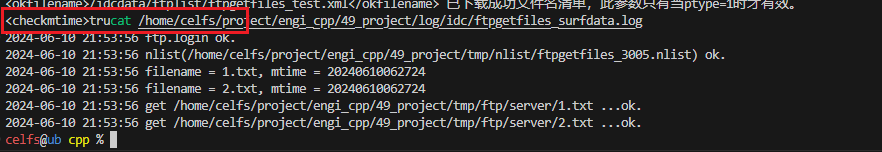

  * Linux 粘贴命令时，呈现逐个字符输入的粘贴动画，对于长指令，则需等待许久。
  * 关于粘贴的 BUG，在不同的 shell 界面同样存在，BUG 行为一致。
  * Linux 在 VSC 下，ctrl + k 可能热键冲突，导致无法正确消除当前行指令。
  * 需补充 Linux 命令行的操作知识，例如跳转行首、跳转到参数等。
  * ~~文件成功下载，但**修改时间不统一**；文件时间一侧的**编号也不一致**。~~ 
    * ~~可能是下载后时间更新的代码出错了。~~ 

  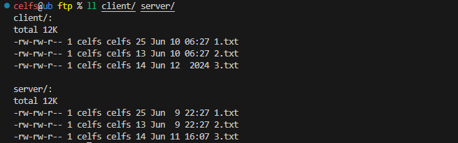

  * ~~程序仅能在 `server` 文件发生修改时，更新已修改的文件。若保持 `server`  不变，再次将 `client` 清空，程序则不再执行。~~ 
    * ~~这可能由于程序仅以文件修改时间作为判断依据有关。~~ 
      * 这个想法是错误的，逻辑是先判断文件是否存在，若存在，才比较文件修改时间，因此更新的逻辑没有问题。
      * 但是缺少了清除已下载文件清单的功能，导致清空文件后，若清单存在，重新运行程序时，不会再次执行下载。
      * 这样的程序逻辑，不能满足业务需求，是过于简单的判断场景。

* DEBUG

  * 1）排除粗心问题：对比 demo 代码

    * 遗漏判断条件（L295 - 300）

    ```cpp
    if ((starg.ptype == 1) && (starg.checkmtim == true)) { // 遗漏判断条件
        // 获取 ftp 服务端文件时间
        if (ftp.mtime(strfilename) == false) {
            logfile.write("ftp.mtime(%s) failed.\n", strfilename.c_str()); return false;
        }
    }
    ```

  * 2）排除粗心问题：检查调用参数（暂未发现问题）

  * 3）追溯重置文件时间的代码

  * 4）调试课程代码，对比输出结果（调试由于路径和代码迭代的版本，难以直接调试，最后是直接在我的代码基础上调试，并且解决了两个 BUG）

  * 5）补充注释 + 调整格式 + 调整声明与实现顺序

  * 6）优化方向

    * ~~已下载成功文件的清单，判断逻辑可能导致再次执行程序不再下载文件，可检查该路径文件（L257）~~ 
    * ~~`compmap()` 增加判断逻辑，不仅仅使用文件修改时间。但这个逻辑明明是先判断文件是否存在，再判断文件时间是否发生变化，为何会出现前面的问题？~~ 问题是 make 不能同步 `_ftp.cpp` 的修改导致的，并且 make 路径有错。
    * ~~是否可能因为 `swap` 两个容器的逻辑导致的？~~ 分析发现，与此无关。
    * ~~而且在 `writetookfile()` 中使用了覆盖的逻辑，为什么还不更新？难道覆盖的权限不够？~~ 无关，权限足够。
    * 检查 `okfilename` 清单
      * 再次运行程序前，仅需删除该清单，方可将清空的文件重新下载
      * 优化：在下载文件前，可读取清单，判断其中文件是否已删除

    ```bash
    rm -rf /home/celfs/project/engi_cpp/49_project/idcdata/ftplist/ftpgetfiles_test.xml
    ```

    * ~~文件时间 BUG（问题已解决）~~ 
      * 调试发现，文件时间按照读取的时分写入，而这个读取的时间间隔存在问题，相差 8 小时，可能是系统时区与开发框架获取的有冲突时间。
      * 修改 `_ftp.cpp` 的 `bool cftpclient::mtime()` 函数
      * 修改其中 `addtime()` 的时间偏移量，几次修改，未生效，反复重新编译，时间变正确了。
      * ~~但实际情况是，莫名其妙地时间对了。难道是动态库的编译问题？~~ 是的，就是动态库的链接更新问题。
      * 终于发现问题，确实就是 `_ftp.cpp` 文件，修改了 `makefile` 为绝对路径，并且将时间偏移量设置为 0，即可获得正确的文件修改时间（因为默认的时间偏移量是将系统时间从 UST 转换为 CST，而我的系统设置了 CST 时间，两次转换得到的时间自然错误）。
      * 现在的主要问题是，如何把 `_ftp.cpp` 的修改，正确地同时编译起来，或者说使得更改立即生效。
      * 另外，发现  `makefile` 的路径写错了，多了一个 `//public` 符号，但是编译没有报错，这个问题还挺隐秘的。以后也要更认真地对待 make 的路径。
      * 经测试，只要成功触发了 make，即可同步修改该时间偏移量，而由于  `_ftp.cpp` 的链接方式，修改后不会触发 make，因此可以修改 `ftpgetfiles.cpp`，例如增加空格后删除，触发文件保存。

    ```cpp
    bool cftpclient::mtime(const string &remotefilename)
    {
        if (m_ftpconn == 0) return false;
      
        m_mtime.clear();
      
        string strmtime;
        strmtime.resize(14);
    
        if (FtpModDate(remotefilename.c_str(),&strmtime[0],14,m_ftpconn) == false) return false;
    
        // 把UTC时间转换为本地时间。
        // closeioandsignal(false);
        // printf("strmtime = %s\n", strmtime);
        addtime(strmtime, m_mtime, 0, "yyyymmddhh24miss");
        // addtime(strmtime, m_mtime, 0-8*60*60, "yyyymmddhh24miss");
    
        return true;
    }
    ```

* BUG 反思

  * 搞清楚编译器的链接、链接的更新方式，十分重要。因此，学完 68 节后，是时候要梳理这个知识点了，顺便把之前的相关笔记整理一下，放到 Typora。
  * 另外，一定要认真核对 make 路径，并且使用绝对路径。


* 2024/06/10 23:31:52 代码实现 + 问题记录 + 状态分析，2h44min
* 2024/06/11 18:10:16 代码完善 + 详细调试，2h20min
* 2024/06/11 21:36:44 完成 debug，21min + 2h10min

------


### 68 文件上传模块

* 代码流程

  * 任务：ftp 客户端文件上传到 ftp 服务端。
  * 文件行为
    * 1）上传文件后，删除 ftp 客户端的文件。
    * 2）上传文件后，把 ftp 客户端的文件移动到备份目录。
    * 3）增量上传文件，每次只上传新增的和修改过的文件。
  * 容器分析
    * 容器1 = 上一次容器3 + 上一次容器4（将程序上次运行结果写入文件）

  

  * 复制下载模块代码 --> 修改为上传模块（增量修改、替换）
  * 细节补充
    * 获取文件时间的参数，要进行 TCP 通讯，会消耗时间，若服务端的文件只会更新不会修改，则不需要核对时间。
    * 上传模块中，核对时间是本地操作，不需要 TCP 通讯，不消耗网络资源，则缺省做法为核对时间（ `_ftp.cpp` 的 `put` 缺省即可，因此 `put` 模块中不需要写）
  * 脚本更新
    * `start.sh` 运行下载模块 + 运行上传模块
    * `stop.sh` 

* 具体实现

  * 拷贝文件 --> “下载 --> 上传” --> “服务端 <--> 客户端”
  * 模块化更改
    * `get()` --> `put()` 
    * 程序参数、参数路径、参数顺序
    * 部分代码逻辑修改
    * `makefile` 
  * 修改的疑问
    * 是否仍需创建 ftp 客户端对象？此处的 put 是从客户端发起传输请求，并发送数据。于服务端而言，创建客户端依然是必要的。客户端对象与在客户端运行的代码是不同的东西。

```cpp
#include "/home/celfs/project/engi_cpp/49_project/public/_public.h"
#include "/home/celfs/project/engi_cpp/49_project/public/_ftp.h"
using namespace idc;

// 程序运行参数的结构体。
struct st_arg {
    char host[31];            // 远程服务端的 IP 和端口
    int  mode;                // 传输模式，1-被动模式（缺省）；2-主动模式
    char username[31];
    char password[31];
    char remotepath[256];     // 远程服务端存放文件的目录
    char localpath[256];      // 本地文件存放的目录
    char matchname[256];      // 待上传文件匹配的规则
    int  ptype;               // 上传后客户端文件的处理方式：1-空；2-删除；3-备份；
    char localpathbak[256];   // 上传后客户端文件的备份目录
    char okfilename[256];     // 已上传成功文件名清单
    int  timeout;             // 进程心跳超时时间
    char pname[51];           // 进程名，建议用 “ftpputfiles_后缀” 的方式
} starg;

struct st_fileinfo {    // 文件信息结构体

    string filename;    // 文件名
    string mtime;       // 文件时间
    st_fileinfo() = default;
    st_fileinfo(const string &in_filename, const string &in_mtime):filename(in_filename), mtime(in_mtime) {}
    void clear() { filename.clear(); mtime.clear(); }

};

map<string, string> mfromok;           // 容器1：存放已上传成功文件，从 starg.okfilename 中加载
list<struct st_fileinfo> vfromdir;     // 容器2：客户端目录中的文件名
list<struct st_fileinfo> vtook;        // 容器3：本次不需上传的文件
list<struct st_fileinfo> vupload;      // 容器4：本次需要上传的文件

clogfile   logfile;   // 日志文件对象
cftpclient ftp;       // 创建 ftp 客户端对象
cpactive   pactive;   // 进程心跳的对象

bool loadlocalfile();       // 加载 starg.localpath 目录下的文件列表，到容器 vfromdir 中
bool loadokfile();          // 加载 starg.okfilename 文件中的内容，到容器 mfromok 中
bool compmap();             // 比较 vfromnlist 和 mfromok，得到 vtook 和 vdownload
bool writetookfile();       // 把容器 vtook 中的内容写入 starg.okfilename 文件，覆盖旧文件
bool appendtookfile(struct st_fileinfo &stfileinfo);      // 若 starg.ptype == 1，把上传成功的文件记录追加到 okfilename 文件中
bool _xmltoarg(const char *strxmlbuffer);                 // 把 xml 解析到参数 starg 结构体中

void EXIT(int sig);         // 程序退出和信号2、15的处理函数。
void _help();               // 显示帮助文档

int main(int argc, char *argv[]) {

    // 1) 从客户端某个目录上传文件，可指定文件匹配的规则
    if (argc != 3) { _help(); return -1; }

    // 设置信号，在shell状态下可用 "kill + 进程号" 正常终止些进程。
    // 但请不要用 "kill -9 +进程号" 强行终止。
    // closeioandsignal(true);       // 关闭0、1、2和忽略全部的信号，在调试阶段，这行代码可以不启用。
    signal(SIGINT, EXIT); signal(SIGTERM, EXIT);

    // 打开日志文件
    if (logfile.open(argv[1]) == false) {
        printf("logfile open failed (%s).\n", argv[1]);
        return -1;
    }

    // 解析 xml，得到程序运行的参数
    if (_xmltoarg(argv[2]) == false) return -1;

    pactive.addpinfo(starg.timeout, starg.pname); // 把进程心跳信息写入共享内存

    // 登录 ftp 服务器
    if (ftp.login(starg.host, starg.username, starg.password, starg.mode) == false) {
        logfile.write("ftp.login(%s, %s, %s) failed.\n%s\n", starg.host, starg.username, starg.password, ftp.response()); return -1;
    }

    logfile.write("ftp.login ok.\n");

    // 把 starg.localpath 目录下的文件列表加载到 vfromdir 容器中
    if (loadlocalfile() == false) {
        logfile.write("loadlocalfile() failead.\n"); return -1;
    }

    pactive.uptatime(); // 更新进程的心跳

    if (starg.ptype == 1) {
        // 加载 okfilename 文件中的内容到容器 mfromok 中
        loadokfile();

        // 比较 vfromdir 和 mfromok，得到 vtook 和 vdownload
        compmap();

        // 把容器 vtook 中的数据写入 okfilename 文件，覆盖之前的旧 okfilename 文件
        writetookfile();
    } else {
        vfromdir.swap(vupload);
    }

    pactive.uptatime(); // 更新进程的心跳

    string strremotefilename, strlocalfilename;
    // 遍历 vupload 容器【改】
    for (auto &aa : vupload) {

        sformat(strremotefilename, "%s/%s", starg.remotepath, aa.filename.c_str());     // 拼接服务端全路径的文件名
        sformat(strlocalfilename, "%s/%s", starg.localpath, aa.filename.c_str());       // 拼接本地全路径的文件名

        logfile.write("put %s ...\n", strremotefilename.c_str());

        // 调用 ftpclient.put() 方法上传文件到服务端，参数三 true 用以核对文件大小，确保上传成功
        if (ftp.put(strlocalfilename, strremotefilename, true) == false) {
            logfile << "failed.\n" << ftp.response() << "\n"; return -1;
        }

        logfile << "ok.\n";

        pactive.uptatime(); // 更新进程的心跳

        // ptype == 1，增量上传文件
        if (starg.ptype == 1) appendtookfile(aa);

        // ptype == 2，删除客户端的文件
        if (starg.ptype == 2) {
            if (remove(strlocalfilename.c_str()) != 0) {
                logfile.write("remove(%s) failed.\n%s\n", strlocalfilename.c_str()); return -1;
            }
        }

        // ptype == 3，备份客户端的文件
        if (starg.ptype == 3) {
            string strlocalfilenamebak = sformat("%s/%s", starg.localpathbak, aa.filename.c_str());
            if (renamefile(strlocalfilenamebak, strremotefilename) == false) {
                logfile.write("renamefile(%s, %s) failed.\n%s\n", strlocalfilenamebak.c_str(), strremotefilename.c_str()); return -1;
            }
        }
    }

    return 0;
}

void EXIT(int sig) {
    
    printf("程序退出，sig = %d\n\n", sig);

    exit(0);
}

void _help() {

    printf("\n");
    printf("Using: ../../tools/bin/ftpputfiles logfilename xmlbuffer\n\n");

    printf("Sample: /home/celfs/project/engi_cpp/49_project/tools/bin/procctl 30 /home/celfs/project/engi_cpp/49_project/tools/bin/ftpputfiles /home/celfs/project/engi_cpp/49_project/log/idc/ftpputfiles_surfdata.log " \
        "\"<host>127.0.0.1:21</host><mode>1</mode>"\
        "<username>celfs</username><password>123</password>"\
        "<localpath>/home/celfs/project/engi_cpp/49_project/tmp/idc/surfdata</localpath><remotepath>/home/celfs/project/engi_cpp/49_project//idcdata/surfdata</remotepath>"\
        "<matchname>SURF_ZH*.JSON</matchname>"\
        "<ptype>1</ptype>"\
        "<localpathbak>/home/celfs/project/engi_cpp/49_project/tmp/idc/surfdatabak</localpathbak>"\
        "<okfilename>/home/celfs/project/engi_cpp/49_project/idcdata/ftplist/ftpputfiles_surfdata.xml</okfilename>"\
        "<timeout>80</timeout><pname>ftpputfiles_surfdata</pname>\"\n\n");

    printf("本程序是通用的功能模块，用于把本地目录中的文件上传到远程的ftp服务器。\n");
    printf("logfilename是本程序运行的日志文件。\n");
    printf("xmlbuffer为文件上传的参数，如下：\n");
    printf("<host>127.0.0.1:21</host> 远程服务端的IP和端口。\n");
    printf("<mode>1</mode> 传输模式，1-被动模式，2-主动模式，缺省采用被动模式。\n");
    printf("<username>celfs</username> 远程服务端ftp的用户名。\n");
    printf("<password>123</password> 远程服务端ftp的密码。\n");
    printf("<remotepath>/tmp/ftpputest</remotepath> 远程服务端存放文件的目录。\n");
    printf("<localpath>/tmp/idc/surfdata</localpath> 本地文件存放的目录。\n");
    printf("<matchname>SURF_ZH*.JSON</matchname> 待上传文件匹配的规则。"\
            "不匹配的文件不会被上传，本字段尽可能设置精确，不建议用*匹配全部的文件。\n");
    printf("<ptype>1</ptype> 文件上传成功后，本地文件的处理方式："\
            "1-什么也不做；2-删除；3-备份，如果为3，还要指定备份的目录。\n");
    printf("<localpathbak>/tmp/idc/surfdatabak</localpathbak> 文件上传成功后，本地文件的备份目录，"\
            "此参数只有当ptype=3时才有效。\n");
    printf("<okfilename>/idcdata/ftplist/ftpputfiles_surfdata.xml</okfilename> 已上传成功文件名清单，"\
            "此参数只有当ptype=1时才有效。\n");
    printf("<checkmtime>true</checkmtime> 是否需要检查服务端文件的时间，true-需要，false-不需要，"\
            "此参数只有当ptype=1时才有效，缺省为false。\n");
    printf("<timeout>80</timeout> 上传文件超时时间，单位：秒，视文件大小和网络带宽而定。\n");
    printf("<pname>ftpputfiles_surfdata</pname> 进程名，尽可能采用易懂的、与其它进程不同的名称，方便故障排查。\n\n\n");

}

// 把 xml 解析到参数 starg 结构中
bool _xmltoarg(const char *strxmlbuffer) {

    memset(&starg, 0, sizeof(struct st_arg));

    getxmlbuffer(strxmlbuffer, "host", starg.host, 30);            // 远程服务端的IP和端口。
    if (strlen(starg.host) == 0) {
        logfile.write("host is null.\n"); return false;
    }

    getxmlbuffer(strxmlbuffer, "mode", starg.mode);     // 传输模式，1-被动模式，2-主动模式，缺省采用被动模式。
    if (starg.mode != 2) starg.mode = 1;

    getxmlbuffer(strxmlbuffer, "username", starg.username, 30);    // 远程服务端ftp的用户名。
    if (strlen(starg.username) == 0) {
        logfile.write("username is null.\n"); return false;
    }

    getxmlbuffer(strxmlbuffer, "password", starg.password, 30);    // 远程服务端ftp的密码。
    if (strlen(starg.password) == 0) {
        logfile.write("password is null.\n"); return false;
    }

    getxmlbuffer(strxmlbuffer, "remotepath", starg.remotepath, 255);    // 远程服务端存放文件的目录
    if (strlen(starg.remotepath) == 0) {
        logfile.write("remotepath is null.\n"); return false;
    }

    getxmlbuffer(strxmlbuffer, "localpath", starg.localpath, 255);      // 本地文件存放的目录
    if (strlen(starg.localpath) == 0) {
        logfile.write("localpath is null.\n"); return false;
    }

    getxmlbuffer(strxmlbuffer, "matchname", starg.matchname, 100);      // 待上传文件匹配的规则
    if (strlen(starg.matchname) == 0) {
        logfile.write("matchname is null.\n"); return false;
    }

    // 上传后客户端文件的处理方式：1-什么也不做；2-删除；3-备份。
    getxmlbuffer(strxmlbuffer, "ptype", starg.ptype);
    if ((starg.ptype != 1) && (starg.ptype != 2) && (starg.ptype != 3)) {
        logfile.write("ptype is error.\n"); return false;
    }

    // 上传后客户端文件的备份目录
    if (starg.ptype == 3) {
        getxmlbuffer(strxmlbuffer, "localpathbak", starg.localpathbak, 255);
        if (strlen(starg.localpathbak) == 0) { logfile.write("localpathbak is null.\n"); return false; }
    }

    // 增量上传文件
    if (starg.ptype == 1) {
        getxmlbuffer(strxmlbuffer, "okfilename", starg.okfilename, 255);    // 已上传成功文件名清单
        if (strlen(starg.okfilename) == 0) { logfile.write("okfilename is null.\n"); return false; }
    }

    getxmlbuffer(strxmlbuffer, "timeout", starg.timeout);   // 进程心跳的超时时间
    if (starg.timeout == 0) { logfile.write("timeout is null.\n"); return false; }

    getxmlbuffer(strxmlbuffer, "pname", starg.pname, 50);   // 进程名
    // if (strlen(starg.pname) == 0) { logfile.write("pname is null.\n"); return false; }

    return true;
}

// 把 starg.localpath 目录下的文件列表加载到容器 vfromdir 中。
bool loadlocalfile() {
    vfromdir.clear();

    cdir dir;
    if (dir.opendir(starg.localpath, starg.matchname) == false) {
        logfile.write("dir.opendir(%s) failed.\n", starg.localpath); return false;
    }

    while (true) {
        if (dir.readdir() == false) break;

        vfromdir.emplace_back(dir.m_filename, dir.m_mtime);
    }

    return true;
}

// 加载 starg.okfilename 文件中的内容到容器 mfromok 中
bool loadokfile() {

    mfromok.clear();

    cifile ifile;

    // 如果程序首次上传文件，starg.okfilename 不存在，并非错误，所以应当返回 true
    if ((ifile.open(starg.okfilename)) == false) return true;

    string strbuffer;

    struct st_fileinfo stfileinfo;

    while (true) {
        stfileinfo.clear();

        if (ifile.readline(strbuffer) == false) break;

        getxmlbuffer(strbuffer, "filename", stfileinfo.filename);
        getxmlbuffer(strbuffer, "mtime", stfileinfo.mtime);

        mfromok[stfileinfo.filename] = stfileinfo.mtime;
    }

    for (auto &aa : mfromok)
       logfile.write("filename=%s, mtime=%s\n", aa.first.c_str(), aa.second.c_str());

    return true;
}

// 比较 vfromdir 和 mfromok，得到 vtook 和 vupload
bool compmap() {

    vtook.clear();
    vupload.clear();

    // 遍历 vfromdir
    for (auto &aa : vfromdir) {

        auto it = mfromok.find(aa.filename);    // 在容器1中用文件名查找
        if (it != mfromok.end()) {
            // 若找到文件，且时间也相同，则不需重新上传，否则重新上传
            if (it->second == aa.mtime) vtook.push_back(aa);    // 文件时间没有变化，不需上传
            else vupload.push_back(aa);    // 需重新上传
        } else {
            // 若未找到文件，把记录放入 vupload 容器
            vupload.push_back(aa);
        }

    }

    return true;
}

// 把容器 vtook 中的数据写入 okfilename 文件，覆盖旧文件
bool writetookfile() {

    cofile ofile;

    if (ofile.open(starg.okfilename) == false) {
        logfile.write("file.open(%s) failed.\n", starg.okfilename); return false;
    }

    for (auto &aa : vtook) {
        ofile.writeline("<filename>%s</filename><mtime>%s</mtime>\n", aa.filename.c_str(), aa.mtime.c_str());
    }

    ofile.closeandrename();

    return true;
}

// 把上传成功的文件记录追加到 okfilename 文件中
bool appendtookfile(struct st_fileinfo &stfileinfo) {

    cofile ofile;

    // 以追加方式打开文件，注意第二个参数要 false
    if (ofile.open(starg.okfilename, false, ios::app) == false) {
        logfile.write("file.open(%s) failed.\n", starg.okfilename); return false;
    }

    ofile.writeline("<filename>%s</filename><mtime>%s</mtime>\n", stfileinfo.filename.c_str(), stfileinfo.mtime.c_str());

    return true;
}
```

* 优化方向
  
  * 经过 67 节代码 debug 的洗礼，感觉文件行为可以扩展多几种。例如增量上传的同时，检测客户端文件是否被删除，若删除，则重新下载。当然，正常来说，除非是需要服务端与客户端的文件完全同步，否则并不需要改变客户端的文件操作。
    * 例子一（不需检测）：假设用户从网盘下载了文件，然后用完了、删除了该文件，服务端不可能说核对后重传，强制用户保留该文件；所以，这些文件行为是有一定适用范围的。
    * 例子二（需检测）：假设服务端与客户端文件需要完全同步，否则不支持连接建立。例如游戏客户端，文件校验发现存在残缺，就必然需要增量下载残缺的文件，以保持两端资源数据一致，避免意外和非法访问的产生。
  * 尝试宏定义长路径，在 `.cpp` 优化路径参数。
* 优化 `start.sh` 
  * 还可进一步将 `idc, tmp, tools ` 等目录整合到变量，这里避免诸如 `idc` 在不同层级子目录下的歧义，就不再细化整理。

```bash
#!/bin/bash

# 长路径变量
BASE_DIR="/home/celfs/project/engi_cpp/49_project"
BIN_PROCCTL="$BASE_DIR/tools/bin/procctl"

REMOTE_HOST="192.168.20.150:21"

# 启动守护模块
#$BIN_PROCCTL 10 $BASE_DIR/tools/bin/checkproc $BASE_DIR/tmp/log/checkproc.log

# 生成气象站点观测的分钟数据，程序每分钟运行一次
$BIN_PROCCTL 60 \
$BASE_DIR/idc/bin/crtsurfdata \
$BASE_DIR/idc/ini/stcode.ini \
$BASE_DIR/tmp/idc/surfdata \
$BASE_DIR/log/idc/crtsurfdata.log csv,xml,json

# 清理原始的气象观测数据目录（/tmp/idc/surfdata）中的历史数据文件
$BIN_PROCCTL 300 \
$BASE_DIR/tools/bin/deletefiles \
$BASE_DIR/tmp/idc/surfdata "*" 0.02

# 压缩后台服务程序的备份日志
$BIN_PROCCTL 300 \
$BASE_DIR/tools/bin/gzipfiles \
$BASE_DIR/tmp/idc/surfdata "*.log.20*" 0.02

# 从（/tmp/idc/surfdata）目录下载原始的气象观测数据文件，存放在（/idcdata/surfdata）目录
$BIN_PROCCTL 30 \
$BASE_DIR/tools/bin/ftpgetfiles \
$BASE_DIR/log/idc/ftpgetfiles_surfdata.log \
"<host>$REMOTE_HOST</host><mode>1</mode>\
<username>celfs</username><password>123</password>\
<localpath>$BASE_DIR/idcdata/surfdata</localpath>\
<remotepath>$BASE_DIR/tmp/idc/surfdata</remotepath>\
<matchname>*.TXT</matchname><ptype>1</ptype>\
<okfilename>$BASE_DIR/idcdata/ftplist/ftpgetfiles_test.xml</okfilename>\
<checkmtime>true</checkmtime>\
<timeout>30</timeout><pname>ftpgetfiles_test</pname>"

# 清理（/tmp/idc/surfdata）目录中 0.04 天之前的文件
$BIN_PROCCTL 300 \
$BASE_DIR/tools/bin/deletefiles \
$BASE_DIR/idcdata/surfdata "*" 0.04

# 把（/tmp/idc/surfdata）目录的原始气象观测数据文件上传到（/tmp/ftpputtest）目录
# 注意，先创建好服务端的目录：mkdir /tmp/ftpputtest
$BIN_PROCCTL 30 \
$BASE_DIR/tools/bin/ftpputfiles \
$BASE_DIR/log/idc/ftpputfiles_surfdata.log \
"<host>127.0.0.1:21</host><mode>1</mode>\
<username>celfs</username><password>123</password>\
<localpath>$BASE_DIR/tmp/idc/surfdata</localpath>\
<remotepath>$BASE_DIR/tmp/ftpputtest</remotepath>\
<matchname>SURF_ZH*.JSON</matchname><ptype>1</ptype>\
<localpathbak>$BASE_DIR/tmp/idc/surfdatabak</localpathbak>\
<okfilename>$BASE_DIR/idcdata/ftplist/ftpputfiles_surfdata.xml</okfilename>\
<timeout>80</timeout><pname>ftpputfiles_surfdata</pname>"

# 清理（/tmp/ftpputest）目录中 0.04 天 之前的文件
$BIN_PROCCTL 300 \
$BASE_DIR/tools/bin/deletefiles \
$BASE_DIR/tmp/ftpputtest "*" 0.04
```

* 疑问

  * 为什么一般宽带的上传速度和下载速度差别能有一个数量级之大？
  * 上传文件中，核对时间是本地的操作，不需要 TCP 通讯。如何理解这一步？
  * ~~使用绝对路径的参数，太长，有无办法缩短？~~
    * 例如脚本语言中，将重复的长路径，定义为变量。同理，可宏定义长路径，在 `.cpp` 优化路径参数。代码如下：

  ```bash
  BASE_DIR="/home/celfs/project/engi_cpp/49_project"
  
  $BASE_DIR/tools/bin/procctl
  ```


* 2024/06/07 20:56:37 P65-68 视频
* 2024/06/11 23:25:25 视频 + 流程梳理，24min
* 2024/06/12 18:19:44 具体实现，修改代码为 put 模块，2h13min + 41min
* 2024/06/12 20:53:50 完善脚本，1h

------


### 00 复盘（C08）

* 概括
  * 
* 下载模块
  * 
* 上传模块
  * 


------


### 00 信息补充（链接、静态库、动态库、编译）

* 头文件的寻址路径
  * xx
  * 为什么直接写头文件名称，会定位到该项目所在目录的同级目录中（VSC 点击头文件跳转发现的）？
* 链接（课程 PXX，文档 XXX）
  * 静态库
  * 动态库
* 编译


------


## 第十章 基于 TCP 协议的文件传输模块

### 69 TCP 文件传输的业务需求
* 概括
  * 基于 FTP 协议的文件传输系统
    * 简单、通用
    * 效率较低（底层 TCP 通讯一问一答，交互次数过多）
    * 适用于系统之间传输文件，不适合大量文件的传输
    * 场景：
      * 下载：开通 FTP 服务 + 文件于服务器 --> 客户端按需获取
      * 上传：开通 FTP 服务 + 文件指定目录 --> 服务端自行获取
  * 基于 TCP 协议的文件传输系统
    * 自定义通讯方式
    * 效率高（FTP 的 10 倍）
    * 适用于系统内部快速高效地传输文件
* 疑问
  * 为什么既然 FTP 基于 TCP 通讯实现，它的效率比直接使用 TCP 协议要低？是因为封装延长了通讯的路径？另外，TCP 协议不是更基于 TCP 连接的通讯吗？


------


### 70 模拟网上银行APP服务端
* 概括
  
  * 本节实现网上银行APP的通讯功能，主要帮助复习前面网络编程的知识，为接下来的内容热身，也可顺便学点新知识。
* 代码流程
  * 界面
  * 功能
    * 登录业务（分析报文）
    * 查询余额
    * 转账业务
* 代码分析
  * 客户端程序 `demo03_client.cpp` 
    * 对象：客户端对象
    * 变量：发送报文缓冲区、接收报文缓冲区
    * 函数：登录、查询余额、转账子函数
    * 参数：在子函数中，直接利用 xml 传递给服务器
  * 服务端程序 `demo04_server.cpp` 
    * 对象：日志对象、服务端对象
    * 函数：父进程退出函数、子进程退出函数、业务主函数
    * 变量：发送报文缓冲区、接收报文缓冲区
    * 参数：
  * 调试
    * 运行服务端程序 --> 运行客户端程序 --> 运行成功
  
  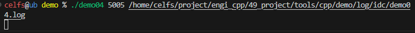
  
  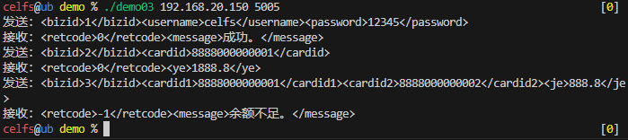

```cpp
// 模拟网上银行 APP 客户端
#include "/home/celfs/project/engi_cpp/49_project/public/_public.h"
using namespace idc;

ctcpclient tcpclient;   // 创建客户端对象

string strrecvbuffer;   // 接收报文的 buffer
string strsendbuffer;   // 发送报文的 buffer

bool biz001();          // 登录
bool biz002();          // 查询余额
bool biz003();          // 转账

int main(int argc, char *argv[]) {

    if (argc != 3) {
        printf("Using:   ./demo03 IP port\n");
        printf("Example: ./demo03 192.168.20.150 5005\n");
        return -1;
    }
    
    if (tcpclient.connect(argv[1], atoi(argv[2])) == false) {
        printf ("tcpclient.connect() failed.\n"); return -1;
    }

    biz001();          // 登录
    
    biz002();          // 查询余额
    
    biz003();          // 转账

    return 0;
}

// 登录
bool biz001() {
    strsendbuffer = "<bizid>1</bizid><username>celfs</username><password>12345</password>";
    if (tcpclient.write(strsendbuffer) == false) {
        printf("tcpclient.write() failed.\n"); return false;
    }
    cout << "发送：" << strsendbuffer << endl;

    if (tcpclient.read(strrecvbuffer) == false) {
        printf("tcpclient.read() failed.\n"); return false;
    }
    cout << "接收：" << strrecvbuffer << endl;

    return true;
}

// 查询余额
bool biz002() {
    strsendbuffer = "<bizid>2</bizid><cardid>8888000000001</cardid>";
    if (tcpclient.write(strsendbuffer) == false) {
        printf("tcpclient.write() failed.\n"); return false;
    }
    cout << "发送：" << strsendbuffer << endl;

    if (tcpclient.read(strrecvbuffer) == false) {
        printf("tcpclient.read() failed.\n"); return false;
    }
    cout << "接收：" << strrecvbuffer << endl;

    return true;
}

// 转账
bool biz003() {
    strsendbuffer = "<bizid>3</bizid><cardid1>8888000000001</cardid1><cardid2>8888000000002</cardid2><je>888.8</je>";
    if (tcpclient.write(strsendbuffer) == false) {
        printf("tcpclient.write() failed.\n"); return false;
    }
    cout << "发送：" << strsendbuffer << endl;

    if (tcpclient.read(strrecvbuffer) == false) {
        printf("tcpclient.read() failed.\n"); return false;
    }
    cout << "接收：" << strrecvbuffer << endl;

    return true;
}
```

```cpp
// 模拟网上银行 APP 服务端
#include "_public.h"
using namespace idc;

clogfile logfile;       // 创建服务端运行日志对象
ctcpserver tcpserver;   // 创建服务端对象

string strrecvbuffer;   // 接收报文的 buffer
string strsendbuffer;   // 发送报文的 buffer

bool bizmain();             // 业务办理主函数

void FatherEXIT(int sig);   // 父进程退出函数
void ChildEXIT(int sig);    // 子进程退出函数

int main(int argc, char *argv[]) {

    if (argc != 3) {
        printf("Using:   ./demo04 port logfile\n");
        printf("Example: ./demo04 5005 /home/celfs/project/engi_cpp/49_project/tools/cpp/demo/log/idc/demo04.log\n\n");
        return -1;
    }

    // closeioandsignal(true);
    signal(SIGINT, FatherEXIT); signal(SIGTERM, FatherEXIT);

    if (logfile.open(argv[2]) == false) { printf("logfile.open(%s) failed.\n", argv[2]); return -1; }

    // 服务端初始化
    if (tcpserver.initserver(atoi(argv[1])) == false) {
        logfile.write("tcpserver.initserver(%s) failed.\n", argv[1]); return -1;
    }

    while (true) {
        
        // 获取客户端的连接请求
        if (tcpserver.accept() == false) {
            logfile.write("tcpserver.accept() failed.\n"); FatherEXIT(-1);
        }

        logfile.write("客户端（%s）已连接。\n", tcpserver.getip());

        if (fork() > 0) { tcpserver.closeclient(); continue; } // 父进程继续回到 accept()，

        // 子进程重新设置退出信号
        signal(SIGINT, ChildEXIT); signal(SIGTERM, ChildEXIT);

        tcpserver.closelisten();

        while (true) {

            // 子进程与客户端进程通讯，处理业务
            if (tcpserver.read(strrecvbuffer) == false) {
                logfile.write("tcpserver.read() failed.\n"); ChildEXIT(-1);
            }

            bizmain();  // 业务处理主函数

            if (tcpserver.write(strsendbuffer) == false) {
                logfile.write("tcpserver.send() failed.\n"); ChildEXIT(-1);
            }
        }

        ChildEXIT(0);
    }
}

void FatherEXIT(int sig) {

    // 以下代码是为了防止信号处理函数在执行的过程中被信号中断。
    signal(SIGINT,SIG_IGN); signal(SIGTERM,SIG_IGN);

    logfile.write("父进程退出，sig = %d。\n",sig);

    tcpserver.closelisten();    // 关闭监听的socket。

    kill(0,15);     // 通知全部的子进程退出。

    exit(0);

}

void ChildEXIT(int sig) {

    // 以下代码是为了防止信号处理函数在执行的过程中被信号中断。
    signal(SIGINT,SIG_IGN); signal(SIGTERM,SIG_IGN);

    logfile.write("子进程退出，sig=%d。\n",sig);

    tcpserver.closeclient();    // 关闭客户端的socket。

    exit(0);

}

void biz001();   // 登录。
void biz002();   // 查询余额。
void biz003();   // 转帐。

// 业务处理主函数
bool bizmain() {

    int bizid;  // 业务代码
    getxmlbuffer(strrecvbuffer, "bizid", bizid);

    switch(bizid) {
        case 1:
            biz001();
            break;
        case 2:
            biz002();
            break;
        case 3:
            biz003();
            break;
        default:    // 非法报文
            strsendbuffer = "<retcode>9</retcode><message>业务不存在。</message>";
            break;
    }

    return true;
}

void biz001() {
    string username, password;
    getxmlbuffer(strrecvbuffer, "username", username);
    getxmlbuffer(strrecvbuffer, "password", password);

    if ((username == "celfs") && (password == "12345"))
        strsendbuffer = "<retcode>0</retcode><message>成功。</message>";
    else
        strsendbuffer = "<retcode>-1</retcode><message>用户名或密码不正确。</message>";
}

void biz002()   // 查询余额。
{
    string cardid;
    getxmlbuffer(strrecvbuffer, "cardid", cardid);  // 获取卡号。

    // 假装操作了数据库，得到了卡的余额。

    strsendbuffer = "<retcode>0</retcode><ye>1888.8</ye>";
}

void biz003() {
    string cardid1, cardid2;
    getxmlbuffer(strrecvbuffer, "cardid1", cardid1);
    getxmlbuffer(strrecvbuffer, "cardid2", cardid2);
    double je;
    getxmlbuffer(strrecvbuffer, "je", je);

    // 假装操作了数据库，更新了两个账户的金额，完成了转帐操作。

    if ( je < 100 )
        strsendbuffer = "<retcode>0</retcode><message>成功。</message>";
    else
        strsendbuffer = "<retcode>-1</retcode><message>余额不足。</message>";
}
```

* 经验
  * 若有把握，可自行写出程序。否则，可先看完视频，再自己写出来。
* 感悟 / 启发
  * 对于技术的复盘，可以参考直接实现一个小型项目，针对性地复习相应技术知识。由此，合理而准确地设计这种复盘用的小型项目十分重要，需要系统化地进行。
    * 具体地，内容可以包括复盘知识点、知识点的联系、UML、适量新知识（项目变体 / 新功能 / 优化）。
    * 无论如何，优先实现技术复盘的目标，把握好项目的复杂程度，其他的补充性、提高性的内容，应当视情况而定。
  * 列出了代码的逻辑步骤，但距离开展更具体、更有可操性的代码实现，还很远。因此，接着需要划分模块，确定所需的对象、函数资源等。例如，三种业务先定义三个子函数，从函数的参数，确定所需的对象。其后再编写代码，并且在过程中逐渐补充其他资源。
  * 对比我的实现思路，课程的代码思路十分简单，且没有实现具体的业务逻辑，参数全用 xml 解析，而且其也没有按照常规的实现逻辑，例如从客户端主函数输入信息，仅仅使用了硬编码的子函数调用三种业务。
* 疑问
  * ~~课程代码的发送与接收缓冲区变量，其注释是否弄反了？~~ 是的，已更正。
  * 为什么客户端不需要初始化？采用的缺省值？
  * 服务端的父进程，在关闭父进程的客户端后，回到其 `accept()` 后，是否会阻塞等待新的客户端连接？
    * 这个过程需要清晰地分析，难道在于理解 `fork()` 之后，程序一分为二，属于父进程或者子进程的代码，由 `fork()` 返回的 `pid` 决定。
    * 因此，需要理解 `fork()` **何时返回**，才能串联父子进程在整体代码上的逻辑关系。
  * 如何理解父进程代码关闭客户端的时机？是在子进程对业务处理完毕后？这个问题与 `fork()` 的返回时间直接相关。
* BUG
  * `logfile.open(/log/idc/demo04.log) failed.` 
    * 由于路径输入错误，应当使用 `log/idc/demo04.log` 路径，去除一个斜杠。或者使用绝对路径。
    * 另外，也可能权限原因
      * `chmod -r 777 log/idc/demo04/log` 
  * 客户端遗漏了 IP 与端口获取，漏了 `connect` 步骤，这种低级错误，太不应该了，试问只传入了参数，不使用或解析参数，怎么可能成功执行？


* 2024/06/13 18:39:49 视频 + 代码思路，1h6min
* 2024/06/13 20:56:08 客户端代码实现，1h1min
* 2024/06/13 22:04:10 服务端代码部分实现，37min
* 2024/06/14 21:12:13 服务端代码实现 + 调试，1h

------


### 71 TCP 短连接和长连接

* 概括
  * 短连接
    * 例如打电话，接通可以一直聊，聊完挂电话；下次需重新打电话。
    * 特点：使用简便，代码简洁，效率不高（断开 + 重连开销）。
  
  
  
  * 长连接
    * 例如使用APP，一会点击功能A，一会点击功能B，每点击一次功能，将建立一次 TCP 通讯；请求报文可来自 C 端和 S 端。
    * 特点：一直连接（除程序退出 / 断网），随时通讯，高效，代码复杂，需代码管理。
      * 连接建立前，区分 S 端和 C 端；
      * 连接建立后，双向通信，不区分 S 端和 C 端。
    * 管理
      * 背景：长连接涉及的中间可能环节很多，当空闲时间过长，某个环节可能断开，于是，为了避免连接断开，可以设置反空闲报文，即心跳报文，这种管理层连接的方法，即为心跳机制。
    * 心跳机制
      * 定期向连接对端发送约定格式的报文，并等待对端回应；
      * 如在约定时间内返回了报文，则连接正常，否则已经断开。
  
  
  
  * 注意，上图时间并非实际情况，仅作演示示例。
  
* 代码流程（心跳机制）
  * `demo03.cpp` --> `demo05.cpp` 
    * 添加参数
    *  `read()` 增加参数（各子函数）
  * `demo04.cpp` --> `demo06.cpp` 
    * 添加参数
    *  `read()` 增加参数
  * `makefile` 修改 --> 调试 --> 运行成功

```cpp
// 模拟网上银行 APP 客户端
#include "/home/celfs/project/engi_cpp/49_project/public/_public.h"
using namespace idc;

ctcpclient tcpclient;   // 创建客户端对象

string strrecvbuffer;   // 接收报文的 buffer
string strsendbuffer;   // 发送报文的 buffer

bool biz001(const int timeout);          // 登录
bool biz002(const int timeout);          // 查询余额
bool biz003(const int timeout);          // 转账

int main(int argc, char *argv[]) {

    if (argc != 4) {
        printf("Using:   ./demo05 IP por timeout\n");
        printf("Example: ./demo05 192.168.20.150 5005 10\n");
        return -1;
    }
    
    if (tcpclient.connect(argv[1], atoi(argv[2])) == false) {
        printf ("tcpclient.connect() failed.\n"); return -1;
    }

    biz001(atoi(argv[3]));          // 登录
    
    biz002(atoi(argv[3]));          // 查询余额

    sleep(12);      // 休眠 13 秒，让 TCP 连接超时
    
    biz003(atoi(argv[3]));          // 转账

    return 0;
}

// 登录
bool biz001(const int timeout) {
    strsendbuffer = "<bizid>1</bizid><username>celfs</username><password>12345</password>";
    if (tcpclient.write(strsendbuffer) == false) {
        printf("tcpclient.write() failed.\n"); return false;
    }
    cout << "发送：" << strsendbuffer << endl;

    if (tcpclient.read(strrecvbuffer, timeout) == false) {
        printf("tcpclient.read() failed.\n"); return false;
    }
    cout << "接收：" << strrecvbuffer << endl;

    return true;
}

// 查询余额
bool biz002(const int timeout) {
    strsendbuffer = "<bizid>2</bizid><cardid>8888000000001</cardid>";
    if (tcpclient.write(strsendbuffer) == false) {
        printf("tcpclient.write() failed.\n"); return false;
    }
    cout << "发送：" << strsendbuffer << endl;

    if (tcpclient.read(strrecvbuffer, timeout) == false) {
        printf("tcpclient.read() failed.\n"); return false;
    }
    cout << "接收：" << strrecvbuffer << endl;

    return true;
}

// 转账
bool biz003(const int timeout) {
    strsendbuffer = "<bizid>3</bizid><cardid1>8888000000001</cardid1><cardid2>8888000000002</cardid2><je>888.8</je>";
    if (tcpclient.write(strsendbuffer) == false) {
        printf("tcpclient.write() failed.\n"); return false;
    }
    cout << "发送：" << strsendbuffer << endl;

    if (tcpclient.read(strrecvbuffer, timeout) == false) {
        printf("tcpclient.read() failed.\n"); return false;
    }
    cout << "接收：" << strrecvbuffer << endl;

    return true;
}
```

```cpp
// 模拟网上银行 APP 服务端
#include "_public.h"
using namespace idc;

clogfile logfile;       // 创建服务端运行日志对象
ctcpserver tcpserver;   // 创建服务端对象

string strrecvbuffer;   // 接收报文的 buffer
string strsendbuffer;   // 发送报文的 buffer

bool bizmain();             // 业务办理主函数

void FatherEXIT(int sig);   // 父进程退出函数
void ChildEXIT(int sig);    // 子进程退出函数

int main(int argc, char *argv[]) {

    if (argc != 4) {
        printf("Using:   ./demo06 port logfile timeout\n");
        printf("Example: ./demo06 5005 /home/celfs/project/engi_cpp/49_project/tools/cpp/demo/log/idc/demo06.log 10\n\n");
        return -1;
    }

    // closeioandsignal(true);
    signal(SIGINT, FatherEXIT); signal(SIGTERM, FatherEXIT);

    if (logfile.open(argv[2]) == false) { printf("logfile.open(%s) failed.\n", argv[2]); return -1; }

    // 服务端初始化
    if (tcpserver.initserver(atoi(argv[1])) == false) {
        logfile.write("tcpserver.initserver(%s) failed.\n", argv[1]); return -1;
    }

    while (true) {
        
        // 获取客户端的连接请求
        if (tcpserver.accept() == false) {
            logfile.write("tcpserver.accept() failed.\n"); FatherEXIT(-1);
        }

        logfile.write("客户端（%s）已连接。\n", tcpserver.getip());

        if (fork() > 0) { tcpserver.closeclient(); continue; } // 父进程继续回到 accept()，

        // 子进程重新设置退出信号
        signal(SIGINT, ChildEXIT); signal(SIGTERM, ChildEXIT);

        tcpserver.closelisten();

        while (true) {

            // 子进程与客户端进程通讯，处理业务
            if (tcpserver.read(strrecvbuffer, atoi(argv[3])) == false) {
                logfile.write("tcpserver.read() failed.\n"); ChildEXIT(0);
            }

            bizmain();  // 业务处理主函数

            if (tcpserver.write(strsendbuffer) == false) {
                logfile.write("tcpserver.send() failed.\n"); ChildEXIT(0);
            }
        }

        ChildEXIT(0);
    }
}

void FatherEXIT(int sig) {

    // 以下代码是为了防止信号处理函数在执行的过程中被信号中断。
    signal(SIGINT,SIG_IGN); signal(SIGTERM,SIG_IGN);

    logfile.write("父进程退出，sig = %d。\n",sig);

    tcpserver.closelisten();    // 关闭监听的socket。

    kill(0,15);     // 通知全部的子进程退出。

    exit(0);

}

void ChildEXIT(int sig) {

    // 以下代码是为了防止信号处理函数在执行的过程中被信号中断。
    signal(SIGINT,SIG_IGN); signal(SIGTERM,SIG_IGN);

    logfile.write("子进程退出，sig=%d。\n",sig);

    tcpserver.closeclient();    // 关闭客户端的socket。

    exit(0);

}

void biz001();   // 登录。
void biz002();   // 查询余额。
void biz003();   // 转帐。

// 业务处理主函数
bool bizmain() {

    int bizid;  // 业务代码
    getxmlbuffer(strrecvbuffer, "bizid", bizid);

    switch(bizid) {
        case 1:
            biz001();
            break;
        case 2:
            biz002();
            break;
        case 3:
            biz003();
            break;
        default:    // 非法报文
            strsendbuffer = "<retcode>9</retcode><message>业务不存在。</message>";
            break;
    }

    return true;
}

void biz001() {
    string username, password;
    getxmlbuffer(strrecvbuffer, "username", username);
    getxmlbuffer(strrecvbuffer, "password", password);

    if ((username == "celfs") && (password == "12345"))
        strsendbuffer = "<retcode>0</retcode><message>成功。</message>";
    else
        strsendbuffer = "<retcode>-1</retcode><message>用户名或密码不正确。</message>";
}

void biz002()   // 查询余额。
{
    string cardid;
    getxmlbuffer(strrecvbuffer, "cardid", cardid);  // 获取卡号。

    // 假装操作了数据库，得到了卡的余额。

    strsendbuffer = "<retcode>0</retcode><ye>1888.8</ye>";
}

void biz003() {
    string cardid1, cardid2;
    getxmlbuffer(strrecvbuffer, "cardid1", cardid1);
    getxmlbuffer(strrecvbuffer, "cardid2", cardid2);
    double je;
    getxmlbuffer(strrecvbuffer, "je", je);

    // 假装操作了数据库，更新了两个账户的金额，完成了转帐操作。

    if ( je < 888.8 )
        strsendbuffer = "<retcode>0</retcode><message>成功。</message>";
    else
        strsendbuffer = "<retcode>-1</retcode><message>余额不足。</message>";
}
```

* 疑问
  * 为何子进程的退出函数，在异常时，其调用改为了填入 0？


* 2024/06/14 21:45:09 31min，2024/06/14 22:37:58 30min

------


### 72 上传文件（一）

* FTP 与 TCP 协议
  * FTP 通常只需实现客户端，Linux 自带其服务端，其底层基于 TCP 连接；
  * TCP 需定义客户端以及服务端，其底层基于自定义的通信协议。
* 代码流程（搭建程序框架 + 心跳机制）
  * 
  * 
* 经验
  * 本章不会先介绍程序的流程和功能，将从简单模块开始，一步步达到目标。整体着重当下，搞清楚每节课内容即可，学完自然能够理解程序的流程和功能。
  * 网络通讯程序的开发，通常是客户端和服务端一起写、一起调试，边写边调试。
* 疑问
  * `fileserver.cpp` 中，`listen()` 操作是在哪个环节进行的？为什么只看到了 `clostlisten()` ？


* 2024/06/15 1:26:46 完成代码，1h3min

------


### 73 上传文件（二）

* 代码增量
  * 参数结构体（搞懂参数含义 --> 习得程序流程）
  * 声明函数（帮助文档函数、 `xml` 解析函数、登录函数）
  * `main` 
    * 客户端、服务端逻辑
      * 信号、日志、参数解析、连接、登录、心跳
      * 信号、日志、初始化、等待连接、父进程（关闭客户端）、子进程（关闭监听、信号重置、处理报文、上传文件、信号退出）
  * 实现子函数
    * 心跳报文、退出函数、帮助文档、参数解析、登录
    * 父进程退出函数、子进程退出函数、处理文件报文、处理登录报文（根据客户端类型，选取合适的代码调用，防止非法访问）

```cpp
// 基于 TCP 协议的文件上传模块
#include "/home/celfs/project/engi_cpp/49_project/public/_public.h"
using namespace idc;

// 程序运行的参数结构体
struct st_arg {
    int  clienttype;         // 客户端类型，1-上传文件；2-下载文件，本程序固定填1
    char ip[31];             // 服务端的 IP 地址
    int  port;               // 服务端的端口
    char clientpath[256];    // 本地文件存放的目录 /data /data/dir1 /data/dir2
    int  ptype;              // 文件上传成功后，本地文件的处理方式：1-删除文件；2-移动到备份目录
    char clientpathbak[256]; // 文件上传成功后，本地文件的备份根目录，当 ptype == 2 时有效
    bool andchild;           // 是否上传 clientpath 目录下各级子目录的文件
    char matchname[256];     // 待上传文件名的匹配规则。如 "*.TXT,*.XML"
    char srvpath[256];       // 服务端文件存放的根目录，控制是否递归访问子目录
    int  timetvl;            // 扫描本地目录文件的时间间隔（执行文件上传任务的时间间隔），单位：秒
    int  timeout;            // 进程心跳的超时时间
    char pname[51];          // 进程名，建议用 “tcpputfiles_后缀” 的方式
} starg;

// 帮助文档
void _help();

// 把 xml 解析到参数 starg 结构中
bool _xmltoarg(const char *strxmlbuffer);

clogfile logfile;       // 创建日志对象
ctcpclient tcpclient;   // 创建 TCP 通讯的客户端对象

// 程序退出信号2、15的处理函数
void EXIT(int sig);

bool activetest();      // 心跳

string strsendbuffer;   // 发送报文的 buffer
string strrecvbuffer;   // 接收报文的 buffer

// 向服务端发送登录报文，把客户端程序的参数传递给服务端
bool login(const char *argv);

int main(int argc, char *argv[]) {

    if (argc != 3) {
        _help();
        return -1;
    }

    // 关闭全部的信号和输入输出。
    // 设置信号,在shell状态下可用 "kill + 进程号" 正常终止些进程。
    // 但请不要用 "kill -9 +进程号" 强行终止。
    // 在网络通讯程序中，一般不关IO，因为某些函数可能会往1和2中输出信息
    // 如果关了1和2，那么1和2会被socket重用，向1和2输出的信息会发送到网络中。
    // closeioandsignal(true);
    signal(SIGINT, EXIT); signal(SIGTERM, EXIT);

    // 打开日志文件
    if (logfile.open(argv[1]) == false) {
        printf("打开日志文件失败（%s）。\n",argv[1]); return -1;
    }

    if (_xmltoarg(argv[2]) == false) return -1;

    // 向服务端发起连接请求
    if (tcpclient.connect(starg.ip, starg.port) == false) {
        logfile.write("tcpclient.connect(%s, %d) failed.\n", starg.ip, starg.port); EXIT(-1);
    }

    if (login(argv[2]) == false) { logfile.write("login() failed.\n"); EXIT(-1); }

    while (true) {

        sleep(10);

        // 发送心跳报文
        if (activetest() == false) break;

    }

    EXIT(0);
}

// 心跳
bool activetest() {

    strsendbuffer = "<activetest>ok</activetest>";
    logfile.write("发送：%s\n", strsendbuffer.c_str());
    if (tcpclient.write(strsendbuffer) == false) return false;      // 向服务端发送请求报文

    if (tcpclient.read(strrecvbuffer, 60) == false) return false;   // 接收服务端的回应报文
    logfile.write("接收：%s\n", strsendbuffer.c_str());

    // 心跳机制的代码可简单化处理，只需要收到对端的回应就行了，不必判断回应的内容

    return true;
}

void EXIT(int sig) {

    logfile.write("程序退出，sig = %d\n\n", sig);

    exit(0);
}

void _help() {

    string base_bin = "/home/celfs/project/engi_cpp/49_project";

    printf("\n");
    printf("Using: %s/tools/bin/tcpputfiles logfilename xmlbuffer\n\n", base_bin.c_str());
    printf(
        "Example: %s/tools/bin/procctl 20 %s/tools/bin/tcpputfiles %s/log/idc/tcpputfiles_surfdata.log "\
        "\"<ip>192.168.20.150</ip><port>5005</port>"\
        "<clientpath>%s/tmp/client</clientpath><ptype>1</ptype>"\
        "<srvpath>%s/tmp/server</srvpath>"\
        "<andchild>true</andchild><matchname>*.xml,*.txt</matchname><timetvl>10</timetvl>"\
        "<timeout>50</timeout><pname>tcpputfiles_surfdata</pname>\"\n\n", 
        base_bin.c_str(), base_bin.c_str(), base_bin.c_str(), base_bin.c_str(), base_bin.c_str()
    ); 

    printf("本程序是数据中心的公共功能模块，采用tcp协议把文件上传给服务端。\n");
    printf("logfilename   本程序运行的日志文件。\n");
    printf("xmlbuffer     本程序运行的参数，如下：\n");
    printf("ip            服务端的IP地址。\n");
    printf("port          服务端的端口。\n");
    printf("ptype         文件上传成功后的处理方式：1-删除文件；2-移动到备份目录。\n");
    printf("clientpath    本地文件存放的根目录。\n");
    printf("clientpathbak 文件成功上传后，本地文件备份的根目录，当ptype==2时有效。\n");
    printf("andchild      是否上传clientpath目录下各级子目录的文件，true-是；false-否，缺省为false。\n");
    printf("matchname     待上传文件名的匹配规则，如\"*.TXT,*.XML\"\n");
    printf("srvpath       服务端文件存放的根目录。\n");
    printf("timetvl       扫描本地目录文件的时间间隔，单位：秒，取值在1-30之间。\n");
    printf("timeout       本程序的超时时间，单位：秒，视文件大小和网络带宽而定，建议设置50以上。\n");
    printf("pname         进程名，尽可能采用易懂的、与其它进程不同的名称，方便故障排查。\n\n");
}

bool _xmltoarg(const char *strxmlbuffer) {

    memset(&starg, 0, sizeof(struct st_arg));

    getxmlbuffer(strxmlbuffer, "ip", starg.ip);
    if (strlen(starg.ip) == 0) { logfile.write("ip is null.\n"); return false; }

    getxmlbuffer(strxmlbuffer, "port", starg.port);
    if (starg.port == 0) { logfile.write("port is null.\n"); return false; }

    getxmlbuffer(strxmlbuffer, "ptype", starg.ptype);
    if ((starg.ptype != 1) && (starg.ptype != 2)) { logfile.write("ptype not in (1, 2).\n"); return false; }

    getxmlbuffer(strxmlbuffer, "clientpath", starg.clientpath);
    if (strlen(starg.clientpath) == 0) { logfile.write("clientpath is null.\n"); return false; }

    getxmlbuffer(strxmlbuffer, "clientpathbak", starg.clientpathbak);
    if ((starg.ptype == 2) && (strlen(starg.clientpathbak) == 0)) { logfile.write("clientpathbak is null.\n"); return false; }

    getxmlbuffer(strxmlbuffer, "andchild", starg.andchild);

    getxmlbuffer(strxmlbuffer, "matchname", starg.matchname);
    if (strlen(starg.matchname) == 0) { logfile.write("matchname is null.\n"); return false; }

    getxmlbuffer(strxmlbuffer, "srvpath", starg.srvpath);
    if (strlen(starg.srvpath) == 0) { logfile.write("srvpath is null.\n"); return false; }

    getxmlbuffer(strxmlbuffer, "timetvl", starg.timetvl);
    if (starg.timetvl == 0) { logfile.write("timetvl is null.\n"); return false; }

    // 扫描本地目录文件的时间间隔（执行上传任务的时间间隔），单位：秒
    // starg.timetvl没有必要超过30秒
    if (starg.timetvl > 30) starg.timetvl = 30;

    // 进程心跳的超时时间，一定要大于 starg.timetvl
    getxmlbuffer(strxmlbuffer, "timeout", starg.timeout);
    if (starg.timeout == 0) { logfile.write("timeout is null.\n"); return false; }
    if (starg.timeout <= starg.timetvl) { logfile.write("starg.timeout(%d) <= starg.timetvl(%d)\n", starg.timeout, starg.timetvl); return false; }

    getxmlbuffer(strxmlbuffer, "pname", starg.pname, 50);
    //if (strlen(starg.pname) == 0) { logfile.write("pname is null.\n"); return false; }

    return true;
}

// 向服务端发送登录报文，把客户端程序的参数传递给服务端
bool login(const char *argv) {

    sformat(strsendbuffer, "%s<clienttype>1</clienttype>", argv);
    logfile.write("发送：%s\n", strsendbuffer.c_str());
    if (tcpclient.write(strsendbuffer) == false) return false;      // 向服务端发送请求报文

    if (tcpclient.read(strrecvbuffer, 20) == false) return false;  // 接收服务端的回应报文
    logfile.write("接收：%s\n", strrecvbuffer.c_str());

    logfile.write("登录(%s:%d)成功。\n", starg.ip, starg.port);

    return true;
}
```

```cpp
#include "/home/celfs/project/engi_cpp/49_project/public/_public.h"
using namespace idc;

// 程序运行的参数结构体。
struct st_arg
{
    int  clienttype;           // 客户端类型，1-上传文件；2-下载文件，本程序固定填1。
    char ip[31];               // 服务端的IP地址。
    int  port;                 // 服务端的端口。
    char clientpath[256];      // 本地文件存放的根目录。 /data /data/aaa /data/bbb
    int  ptype;                // 文件上传成功后本地文件的处理方式：1-删除文件；2-移动到备份目录。
    char clientpathbak[256];   // 文件成功上传后，本地文件备份的根目录，当ptype==2时有效。
    bool andchild;             // 是否上传clientpath目录下各级子目录的文件，true-是；false-否。
    char matchname[256];       // 待上传文件名的匹配规则，如"*.TXT,*.XML"。
    char srvpath[256];         // 服务端文件存放的根目录。/data1 /data1/aaa /data1/bbb
    int  timetvl;              // 扫描本地目录文件的时间间隔（执行文件上传任务的时间间隔），单位：秒。 
    int  timeout;              // 进程心跳的超时时间。
    char pname[51];            // 进程名，建议用"tcpputfiles_后缀"的方式。
} starg;

clogfile logfile;        // 服务程序的运行日志
ctcpserver tcpserver;    // 创建tcp通讯的服务端对象

void FathEXIT(int sig);  // 父进程退出函数
void ChldEXIT(int sig);  // 子进程退出函数

// 处理登录客户端的登录报文。
bool clientlogin();

// 上传文件的主函数
void recvfilesmain();

string strsendbuffer;    // 发送报文的buffer
string strrecvbuffer;    // 接收报文的buffer

int main(int argc, char *argv[]) {

    if (argc != 3) {
        printf("Using:./fileserver port logfile\n");
        printf("Example:./fileserver 5005 /home/celfs/project/engi_cpp/49_project/log/idc/fileserver.log\n"); 
        printf("         /home/celfs/project/engi_cpp/49_project/tools/bin/procctl 10 /home/celfs/project/engi_cpp/49_project/tools/bin/fileserver 5005 /home/celfs/project/engi_cpp/49_project/log/idc/fileserver.log\n\n\n"); 
        return -1;
    }

    // 关闭全部的信号和输入输出。
    // 设置信号,在shell状态下可用 "kill + 进程号" 正常终止些进程
    // 但请不要用 "kill -9 +进程号" 强行终止
    //closeioandsignal(false); 
    signal(SIGINT,FathEXIT); signal(SIGTERM,FathEXIT);

    if (logfile.open(argv[2]) == false) {
        printf("logfile.open(%s) failed.\n", argv[2]); return -1;
    }

    // 服务端初始化。
    if (tcpserver.initserver(atoi(argv[1]))==false) {
      logfile.write("tcpserver.initserver(%s) failed.\n",argv[1]); return -1;
    }

    while (true) {

        // 等待客户端的连接请求
        if (tcpserver.accept() == false) {
            logfile.write("tcpserver.accept() failed.\n"); FathEXIT(-1);
        }

        logfile.write("客户端（%s）已连接。\n", tcpserver.getip());

        if (fork() > 0) { tcpserver.closeclient(); continue; }   // 父进程继续回到Accept()

        // 子进程重新设置退出信号
        signal(SIGINT,ChldEXIT); signal(SIGTERM,ChldEXIT);

        tcpserver.closelisten();

        // 子进程与客户端进行通讯，处理业务。

        // 处理登录客户端的登录报文。
        if (clientlogin()==false) ChldEXIT(-1);

        // 如果starg.clienttype==1，调用上传文件的主函数。
        if (starg.clienttype==1)  recvfilesmain();  

        // 如果starg.clienttype==2，调用下载文件的主函数。
        // if (starg.clienttype==2) sendfilesmain();

        ChldEXIT(0);
    }
}

void FathEXIT(int sig) {

    // 以下代码是为了防止信号处理函数在执行的过程中被信号中断
    signal(SIGINT, SIG_IGN); signal(SIGTERM, SIG_IGN);

    logfile.write("父进程退出，sig = %d。\n", sig);

    tcpserver.closelisten();    // 关闭监听的socket

    kill(0, 15);     // 通知全部的子进程退出

    exit(0);

}

void ChldEXIT(int sig) {

    // 以下代码是为了防止信号处理函数在执行的过程中被信号中断
    signal(SIGINT, SIG_IGN); signal(SIGTERM, SIG_IGN);

    logfile.write("子进程退出，sig = %d。\n", sig);

    tcpserver.closeclient();    // 关闭客户端的socket

    exit(0);

}

void recvfilesmain() {

    while (true) {

        // 接收客户端的报文
        if (tcpserver.read(strrecvbuffer, 60) == false) {
            logfile.write("tcpserver.read() failed.\n"); return;
        }
        logfile.write("strrecvbuffer = %s\n", strrecvbuffer.c_str());

        // 处理心跳报文
        if (strrecvbuffer == "<activetest>ok</activetest>") {

            strsendbuffer = "ok.";
            logfile.write("strsendbuffer = %s\n", strsendbuffer.c_str());
            if (tcpserver.write(strsendbuffer) == false) {
                logfile.write("tcpserver.write() failed.\n"); return;
            }
        }
    }

}

// 处理登录客户端的登录报文。
bool clientlogin()
{
    // 接收客户端的登录报文。
    if (tcpserver.read(strrecvbuffer,20)==false)
    {
        logfile.write("tcpserver.read() failed.\n"); return false;
    }
    logfile.write("strrecvbuffer=%s\n",strrecvbuffer.c_str());

    // 解析客户端登录报文，不需要对参数做合法性判断，客户端已经判断过了。
    memset(&starg,0,sizeof(struct st_arg));
    getxmlbuffer(strrecvbuffer,"clienttype",starg.clienttype);
    getxmlbuffer(strrecvbuffer,"clientpath",starg.clientpath);
    getxmlbuffer(strrecvbuffer,"srvpath",starg.srvpath);

    // 为什么要判断客户端的类型？不是只有1和2吗？ 防止非法的连接请求。
    if ( (starg.clienttype!=1) && (starg.clienttype!=2) )
        strsendbuffer="failed";
    else
        strsendbuffer="ok";

    if (tcpserver.write(strsendbuffer)==false)
    {
        logfile.write("tcpserver.write() failed.\n"); return false;
    }

    logfile.write("%s login %s.\n",tcpserver.getip(),strsendbuffer.c_str());

    return true;
}
```

* 经验
  
  * 多进程的代码，用 GDB 调试比较麻烦，现阶段可以将其注释掉，让程序变成单进程，便于调试（可写日志、GDB）
  
* 疑问
  
  * `printf()` 中，若连续多个占位符对应的变量都是同一个，是否有便捷的写法？
  * ~~如何理解 “进程心跳的超时时间，一定要大于扫描目录文件的时间间隔”？~~ 
    * 如果心跳超时时间比任务所需时间还短，那么任务还没结束，就已经被心跳终止了。
  
* BUG

  * ~~I have checked several times, but could not find the cause of the bug.~~ OK.

    * A segmentation fault typically indicates that your program is trying to access a memory location that it's not allowed to access. 

    ```bash
    /home/celfs/project/engi_cpp/49_project/tools/bin/tcpputfiles /home/celfs/project/engi_cpp/49_project/log/idc/tcpputfiles_surfdata.log "<ip>192.168.20.150</ip><port>5005</port><clientpath>/home/celfs/project/engi_cpp/49_project/tmp/client</clientpath><ptype>1</ptype><srvpath>/home/celfs/project/engi_cpp/49_project/tmp/server</srvpath><andchild>true</andchild><matchname>.xml,.txt</matchname><timetvl>10</timetvl><timeout>50</timeout><pname>tcpputfiles_surfdata</pname>"
    [1] 2245 segmentation fault /home/celfs/project/engi_cpp/49_project/tools/bin/tcpputfiles
    ```

  * GDB

    * `run` --> `backtrace` --> `0x00005555555595e9 in main` --> 成功定位问题 --> 由 `atoi(argv[3])` 的合法性导致

  ```bash
  (gdb) run
  Starting program: /home/celfs/project/engi_cpp/49_project/tools/bin/tcpputfiles /home/celfs/project/engi_cpp/49_project/log/idc/tcpputfiles_surfdata.log "<ip>192.168.20.150</ip><port>5005</port><clientpath>/home/celfs/project/engi_cpp/49_project/tmp/client</clientpath><ptype>1</ptype><srvpath>/home/celfs/project/engi_cpp/49_project/tmp/server</srvpath><andchild>true</andchild><matchname>*.xml,*.txt</matchname><timetvl>10</timetvl><timeout>50</timeout><pname>tcpputfiles_surfdata</pname>"
  
  Program received signal SIGSEGV, Segmentation fault.
  __GI_____strtol_l_internal (nptr=0x0, endptr=endptr@entry=0x0, base=base@entry=10, group=group@entry=0, 
      loc=0x7ffff7d294a0 <_nl_global_locale>) at ../stdlib/strtol_l.c:292
  292     ../stdlib/strtol_l.c: No such file or directory.
  
  
  (gdb) backtrace
  #0  __GI_____strtol_l_internal (nptr=0x0, endptr=endptr@entry=0x0, base=base@entry=10, group=group@entry=0, 
      loc=0x7ffff7d294a0 <_nl_global_locale>) at ../stdlib/strtol_l.c:292
  #1  0x00007ffff7b84ab6 in __strtol (nptr=<optimized out>, endptr=endptr@entry=0x0, base=base@entry=10)
      at ../stdlib/strtol.c:106
  #2  0x00007ffff7b805c4 in __GI_atoi (nptr=<optimized out>) at atoi.c:27
  #3  0x00005555555595e9 in main (argc=3, argv=0x7fffffffdea8) at tcpputfiles.cpp:64
  ```

  * 代码修改

  ```cpp
  // 向服务端发起连接请求
  if (tcpclient.connect(argv[2], atoi(argv[3])) == false) {
      logfile.write("tcpclient.connect(%s, %d) failed.\n", argv[2], atoi(argv[3])); EXIT(-1);
  }
  
  // 修改后
  // 向服务端发起连接请求。
  if (tcpclient.connect(starg.ip, starg.port) == false) {
      logfile.write("tcpclient.connect(%s, %d) failed.\n", starg.ip, starg.port); EXIT(-1);
  }
  ```

  * 经过这次使用 GDB，才感觉到这是个神器，必须好好掌握。
  * 可见，参数的一致性、明白数据存储、输入的结构，十分重要。
    * 本节的参数传递，服务端参数由客户端决定，因此，将客户端的所有 xml 参数都通过 `login` 传递。


* 2024/06/15 13:27:42 代码，1h35min
* 2024/06/15 21:17:17 完成代码，debug，15min
* 2024/06/16 17:26:55 debug 完成，1h4min

------


### 74 上传文件（三）

* 代码流程

  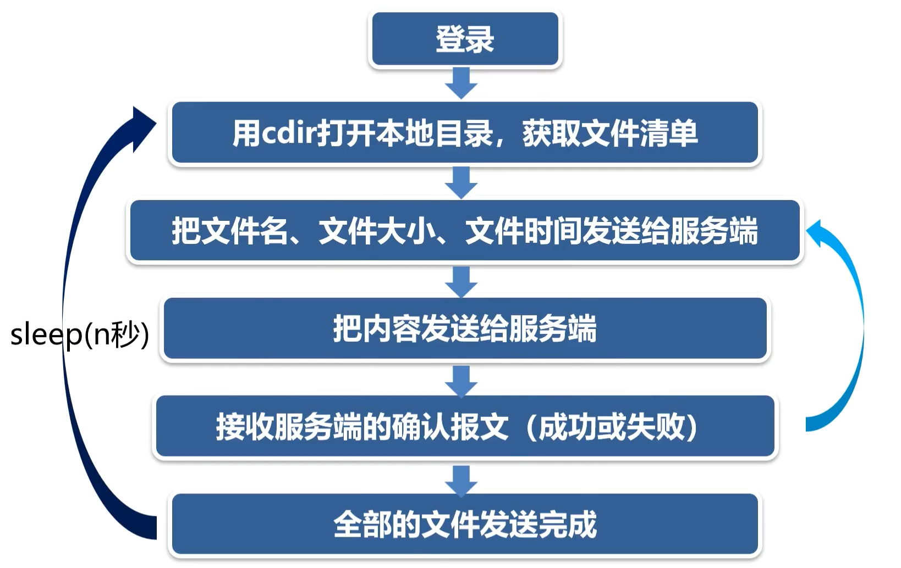

  * 客户端
    * 文件上传主函数 --> `main` 调用 --> 
    * 实现上传主函数
      * 打开目录 --> 遍历目录 -->
      * 构造文件名、修改时间、文件大小 --> 发送到对端
      * 接收确认报文
  * 服务端
    * 完善文件接收函数
    * 处理服务端确认报文
      * `ptype == 1` 及 `ptype == 2` 的情况 
  * 调试
    * 两个目录 `/tmp/client`（ `1.txt, 2.xml` ） 和 `/tmp/server` 
    * 运行服务端程序
    * 运行客户端程序
    * 完成报文确认后，调试 --> 未实现服务端接收文件的逻辑

```cpp
// 基于 TCP 协议的文件上传模块
#include "/home/celfs/project/engi_cpp/49_project/public/_public.h"
using namespace idc;

// 程序运行的参数结构体
struct st_arg {
    int  clienttype;         // 客户端类型，1-上传文件；2-下载文件，本程序固定填1
    char ip[31];             // 服务端的 IP 地址
    int  port;               // 服务端的端口
    char clientpath[256];    // 本地文件存放的目录 /data /data/dir1 /data/dir2
    int  ptype;              // 文件上传成功后，本地文件的处理方式：1-删除文件；2-移动到备份目录
    char clientpathbak[256]; // 文件上传成功后，本地文件的备份根目录，当 ptype == 2 时有效
    bool andchild;           // 是否上传 clientpath 目录下各级子目录的文件
    char matchname[256];     // 待上传文件名的匹配规则。如 "*.TXT,*.XML"
    char srvpath[256];       // 服务端文件存放的根目录，控制是否递归访问子目录
    int  timetvl;            // 扫描本地目录文件的时间间隔（执行文件上传任务的时间间隔），单位：秒
    int  timeout;            // 进程心跳的超时时间
    char pname[51];          // 进程名，建议用 “tcpputfiles_后缀” 的方式
} starg;

// 帮助文档
void _help();

// 把 xml 解析到参数 starg 结构中
bool _xmltoarg(const char *strxmlbuffer);

clogfile logfile;       // 创建日志对象
ctcpclient tcpclient;   // 创建 TCP 通讯的客户端对象

// 程序退出信号2、15的处理函数
void EXIT(int sig);

bool activetest();      // 心跳

string strsendbuffer;   // 发送报文的 buffer
string strrecvbuffer;   // 接收报文的 buffer

// 向服务端发送登录报文，把客户端程序的参数传递给服务端
bool login(const char *argv);

// 文件上传的主函数，执行一次文件上传的任务
bool _tcpputfiles();

// 处理传输文件的响应报文（删除或转存本地的文件）
bool ackmessage(const string &strrecvbuffer);

int main(int argc, char *argv[]) {

    if (argc != 3) {
        _help();
        return -1;
    }

    // 关闭全部的信号和输入输出。
    // 设置信号,在shell状态下可用 "kill + 进程号" 正常终止些进程。
    // 但请不要用 "kill -9 +进程号" 强行终止。
    // 在网络通讯程序中，一般不关IO，因为某些函数可能会往1和2中输出信息
    // 如果关了1和2，那么1和2会被socket重用，向1和2输出的信息会发送到网络中。
    // closeioandsignal(true);
    signal(SIGINT, EXIT); signal(SIGTERM, EXIT);

    // 打开日志文件
    if (logfile.open(argv[1]) == false) {
        printf("打开日志文件失败（%s）。\n",argv[1]); return -1;
    }

    if (_xmltoarg(argv[2]) == false) return -1;

    // 向服务端发起连接请求
    if (tcpclient.connect(starg.ip, starg.port) == false) {
        logfile.write("tcpclient.connect(%s, %d) failed.\n", starg.ip, starg.port); EXIT(-1);
    }

    if (login(argv[2]) == false) { logfile.write("login() failed.\n"); EXIT(-1); }

    while (true) {

        // 调用文件上传的主函数，执行一次文件上传的任务
        if (_tcpputfiles() == false) { logfile.write("_tcpputfiles() failed.\n"); EXIT(-1); }

        sleep(starg.timetvl);

        // 发送心跳报文
        if (activetest() == false) break;

    }

    EXIT(0);
}

// 心跳
bool activetest() {

    strsendbuffer = "<activetest>ok</activetest>";
    logfile.write("发送：%s\n", strsendbuffer.c_str());
    if (tcpclient.write(strsendbuffer) == false) return false;      // 向服务端发送请求报文

    if (tcpclient.read(strrecvbuffer, 60) == false) return false;   // 接收服务端的回应报文
    logfile.write("接收：%s\n", strsendbuffer.c_str());

    // 心跳机制的代码可简单化处理，只需要收到对端的回应就行了，不必判断回应的内容

    return true;
}

void EXIT(int sig) {

    logfile.write("程序退出，sig = %d\n\n", sig);

    exit(0);
}

void _help() {

    string base_bin = "/home/celfs/project/engi_cpp/49_project";

    printf("\n");
    printf("Using: %s/tools/bin/tcpputfiles logfilename xmlbuffer\n\n", base_bin.c_str());
    printf(
        "Example: %s/tools/bin/procctl 20 %s/tools/bin/tcpputfiles %s/log/idc/tcpputfiles_surfdata.log "\
        "\"<ip>192.168.20.150</ip><port>5005</port>"\
        "<clientpath>%s/tmp/client</clientpath><ptype>1</ptype>"\
        "<srvpath>%s/tmp/server</srvpath>"\
        "<andchild>true</andchild><matchname>*.xml,*.txt</matchname><timetvl>10</timetvl>"\
        "<timeout>50</timeout><pname>tcpputfiles_surfdata</pname>\"\n\n", 
        base_bin.c_str(), base_bin.c_str(), base_bin.c_str(), base_bin.c_str(), base_bin.c_str()
    ); 

    printf("本程序是数据中心的公共功能模块，采用tcp协议把文件上传给服务端。\n");
    printf("logfilename   本程序运行的日志文件。\n");
    printf("xmlbuffer     本程序运行的参数，如下：\n");
    printf("ip            服务端的IP地址。\n");
    printf("port          服务端的端口。\n");
    printf("ptype         文件上传成功后的处理方式：1-删除文件；2-移动到备份目录。\n");
    printf("clientpath    本地文件存放的根目录。\n");
    printf("clientpathbak 文件成功上传后，本地文件备份的根目录，当ptype==2时有效。\n");
    printf("andchild      是否上传clientpath目录下各级子目录的文件，true-是；false-否，缺省为false。\n");
    printf("matchname     待上传文件名的匹配规则，如\"*.TXT,*.XML\"\n");
    printf("srvpath       服务端文件存放的根目录。\n");
    printf("timetvl       扫描本地目录文件的时间间隔，单位：秒，取值在1-30之间。\n");
    printf("timeout       本程序的超时时间，单位：秒，视文件大小和网络带宽而定，建议设置50以上。\n");
    printf("pname         进程名，尽可能采用易懂的、与其它进程不同的名称，方便故障排查。\n\n");
}

bool _xmltoarg(const char *strxmlbuffer) {

    memset(&starg, 0, sizeof(struct st_arg));

    getxmlbuffer(strxmlbuffer, "ip", starg.ip);
    if (strlen(starg.ip) == 0) { logfile.write("ip is null.\n"); return false; }

    getxmlbuffer(strxmlbuffer, "port", starg.port);
    if (starg.port == 0) { logfile.write("port is null.\n"); return false; }

    getxmlbuffer(strxmlbuffer, "ptype", starg.ptype);
    if ((starg.ptype != 1) && (starg.ptype != 2)) { logfile.write("ptype not in (1, 2).\n"); return false; }

    getxmlbuffer(strxmlbuffer, "clientpath", starg.clientpath);
    if (strlen(starg.clientpath) == 0) { logfile.write("clientpath is null.\n"); return false; }

    getxmlbuffer(strxmlbuffer, "clientpathbak", starg.clientpathbak);
    if ((starg.ptype == 2) && (strlen(starg.clientpathbak) == 0)) { logfile.write("clientpathbak is null.\n"); return false; }

    getxmlbuffer(strxmlbuffer, "andchild", starg.andchild);

    getxmlbuffer(strxmlbuffer, "matchname", starg.matchname);
    if (strlen(starg.matchname) == 0) { logfile.write("matchname is null.\n"); return false; }

    getxmlbuffer(strxmlbuffer, "srvpath", starg.srvpath);
    if (strlen(starg.srvpath) == 0) { logfile.write("srvpath is null.\n"); return false; }

    getxmlbuffer(strxmlbuffer, "timetvl", starg.timetvl);
    if (starg.timetvl == 0) { logfile.write("timetvl is null.\n"); return false; }

    // 扫描本地目录文件的时间间隔（执行上传任务的时间间隔），单位：秒
    // starg.timetvl没有必要超过30秒
    if (starg.timetvl > 30) starg.timetvl = 30;

    // 进程心跳的超时时间，一定要大于 starg.timetvl
    getxmlbuffer(strxmlbuffer, "timeout", starg.timeout);
    if (starg.timeout == 0) { logfile.write("timeout is null.\n"); return false; }
    if (starg.timeout <= starg.timetvl) { logfile.write("starg.timeout(%d) <= starg.timetvl(%d)\n", starg.timeout, starg.timetvl); return false; }

    getxmlbuffer(strxmlbuffer, "pname", starg.pname, 50);
    //if (strlen(starg.pname) == 0) { logfile.write("pname is null.\n"); return false; }

    return true;
}

// 向服务端发送登录报文，把客户端程序的参数传递给服务端
bool login(const char *argv) {

    sformat(strsendbuffer, "%s<clienttype>1</clienttype>", argv);
    logfile.write("发送：%s\n", strsendbuffer.c_str());
    if (tcpclient.write(strsendbuffer) == false) return false;      // 向服务端发送请求报文

    if (tcpclient.read(strrecvbuffer, 20) == false) return false;  // 接收服务端的回应报文
    logfile.write("接收：%s\n", strrecvbuffer.c_str());

    logfile.write("登录(%s:%d)成功。\n", starg.ip, starg.port);

    return true;
}

// 文件上传的主函数，执行一次文件上传的任务
bool _tcpputfiles() {

    cdir dir;

    if (dir.opendir(starg.clientpath, starg.matchname, 10000, starg.andchild) == false) {
        logfile.write("dir.opendir(%s) failed.\n", starg.clientpath); return false;
    }

    // 遍历目录中的每个文件
    while (dir.readdir()) {

        // 把文件名、修改时间、文件大小组成报文，发送给对端
        sformat(strsendbuffer, "<filename>%s</filename><mtime>%s</mtime><szie>%d</size>", 
                dir.m_ffilename.c_str(), dir.m_mtime.c_str(), dir.m_filesize);
        
        logfile.write("strsendbuffer = %s\n", strsendbuffer.c_str());
        if (tcpclient.write(strsendbuffer) == false) {
            logfile.write("tcpclien.write() failed.\n"); return false;
        }

        // 发送文件内容

        // 接收服务端的确认报文
        if (tcpclient.read(strrecvbuffer, 20) == false) break;
        logfile.write("strrecvbuffer = %s\n", strrecvbuffer.c_str());

        // 处理服务端的确认报文（删除本地文件或把本地本文移动到备份目录）
        ackmessage(strrecvbuffer);
    }

    return true;
}

// 处理传输文件的响应报文（删除或转存本地的文件）
bool ackmessage(const string &strrecvbuffer) {

    // <filename>/tmp/client/1.txt</filename><result>ok</result>
    string filename;    // 本地文件名
    string result;      // 对端接收文件的结果
    getxmlbuffer(strrecvbuffer, "filename", filename);
    getxmlbuffer(strrecvbuffer, "result", result);

    // 如果服务端接收文件不成功，直接返回（下次执行文件传输任务时将会重传）
    if (result != "ok") return true;

    // 如果 starg.ptype == 1，删除文件
    if (starg.ptype == 1) {
        if (remove(filename.c_str()) != 0) { logfile.write("remove(%s) failed.\n", filename.c_str()); return false; }
    }

    // 如果 starg.ptype == 2，移动文件到备份目录
    if (starg.ptype == 2) {
        // 
        string bakfilename = filename;
        replacestr(bakfilename, starg.clientpath, starg.clientpathbak, false); // 注意，第四个参数一定填 false
        if (renamefile(filename, bakfilename) == false) {
            logfile.write("renamefile(%s, %s) failed.\n", filename.c_str(), bakfilename.c_str()); return false;
        }
    }

    return true;
}
```

```cpp
#include "/home/celfs/project/engi_cpp/49_project/public/_public.h"
using namespace idc;

// 程序运行的参数结构体。
struct st_arg
{
    int  clienttype;           // 客户端类型，1-上传文件；2-下载文件，本程序固定填1。
    char ip[31];               // 服务端的IP地址。
    int  port;                 // 服务端的端口。
    char clientpath[256];      // 本地文件存放的根目录。 /data /data/aaa /data/bbb
    int  ptype;                // 文件上传成功后本地文件的处理方式：1-删除文件；2-移动到备份目录。
    char clientpathbak[256];   // 文件成功上传后，本地文件备份的根目录，当ptype==2时有效。
    bool andchild;             // 是否上传clientpath目录下各级子目录的文件，true-是；false-否。
    char matchname[256];       // 待上传文件名的匹配规则，如"*.TXT,*.XML"。
    char srvpath[256];         // 服务端文件存放的根目录。/data1 /data1/aaa /data1/bbb
    int  timetvl;              // 扫描本地目录文件的时间间隔（执行文件上传任务的时间间隔），单位：秒。 
    int  timeout;              // 进程心跳的超时时间。
    char pname[51];            // 进程名，建议用"tcpputfiles_后缀"的方式。
} starg;

clogfile logfile;        // 服务程序的运行日志
ctcpserver tcpserver;    // 创建tcp通讯的服务端对象

void FathEXIT(int sig);  // 父进程退出函数
void ChldEXIT(int sig);  // 子进程退出函数

// 处理登录客户端的登录报文。
bool clientlogin();

// 上传文件的主函数
void recvfilesmain();

string strsendbuffer;    // 发送报文的buffer
string strrecvbuffer;    // 接收报文的buffer

int main(int argc, char *argv[]) {

    if (argc != 3) {
        printf("Using:./fileserver port logfile\n");
        printf("Example:./fileserver 5005 /home/celfs/project/engi_cpp/49_project/log/idc/fileserver.log\n"); 
        printf("         /home/celfs/project/engi_cpp/49_project/tools/bin/procctl 10 /home/celfs/project/engi_cpp/49_project/tools/bin/fileserver 5005 /home/celfs/project/engi_cpp/49_project/log/idc/fileserver.log\n\n\n"); 
        return -1;
    }

    // 关闭全部的信号和输入输出。
    // 设置信号,在shell状态下可用 "kill + 进程号" 正常终止些进程
    // 但请不要用 "kill -9 +进程号" 强行终止
    //closeioandsignal(false); 
    signal(SIGINT,FathEXIT); signal(SIGTERM,FathEXIT);

    if (logfile.open(argv[2]) == false) {
        printf("logfile.open(%s) failed.\n", argv[2]); return -1;
    }

    // 服务端初始化。
    if (tcpserver.initserver(atoi(argv[1]))==false) {
      logfile.write("tcpserver.initserver(%s) failed.\n",argv[1]); return -1;
    }

    while (true) {

        // 等待客户端的连接请求
        if (tcpserver.accept() == false) {
            logfile.write("tcpserver.accept() failed.\n"); FathEXIT(-1);
        }

        logfile.write("客户端（%s）已连接。\n", tcpserver.getip());

        // 暂不使用多进程，便于 GDB 调试
        // if (fork() > 0) { tcpserver.closeclient(); continue; }   // 父进程继续回到Accept()

        // 子进程重新设置退出信号
        // signal(SIGINT, ChldEXIT); signal(SIGTERM, ChldEXIT);

        // tcpserver.closelisten();

        // 子进程与客户端进行通讯，处理业务。

        // 处理登录客户端的登录报文。
        if (clientlogin() == false) ChldEXIT(-1);

        // 如果starg.clienttype == 1，调用上传文件的主函数。
        if (starg.clienttype == 1)  recvfilesmain();  

        // 如果 starg.clienttype == 2，调用下载文件的主函数。
        // if (starg.clienttype == 2) sendfilesmain();

        ChldEXIT(0);
    }
}

void FathEXIT(int sig) {

    // 以下代码是为了防止信号处理函数在执行的过程中被信号中断
    signal(SIGINT, SIG_IGN); signal(SIGTERM, SIG_IGN);

    logfile.write("父进程退出，sig = %d。\n", sig);

    tcpserver.closelisten();    // 关闭监听的socket

    kill(0, 15);     // 通知全部的子进程退出

    exit(0);

}

void ChldEXIT(int sig) {

    // 以下代码是为了防止信号处理函数在执行的过程中被信号中断
    signal(SIGINT, SIG_IGN); signal(SIGTERM, SIG_IGN);

    logfile.write("子进程退出，sig = %d。\n", sig);

    tcpserver.closeclient();    // 关闭客户端的socket

    exit(0);

}

void recvfilesmain() {

    while (true) {

        // 接收客户端的报文
        if (tcpserver.read(strrecvbuffer, 60) == false) {
            logfile.write("tcpserver.read() failed.\n"); return;
        }
        logfile.write("strrecvbuffer = %s\n", strrecvbuffer.c_str());

        // 处理心跳报文
        if (strrecvbuffer == "<activetest>ok</activetest>") {

            strsendbuffer = "ok.";
            logfile.write("strsendbuffer = %s\n", strsendbuffer.c_str());
            if (tcpserver.write(strsendbuffer) == false) {
                logfile.write("tcpserver.write() failed.\n"); return;
            }
        }

        // 处理上传文件的请求报文
        if (strrecvbuffer.find("<filename>") != string::npos) {
            // 解析上传文件请求报文的 xml
            string clientfilename;  // 对端的文件名
            string mtime;           // 文件的时间
            int filesize = 0;       // 文件大小
            getxmlbuffer(strrecvbuffer, "filename", clientfilename);
            getxmlbuffer(strrecvbuffer, "mtime", mtime);
            getxmlbuffer(strrecvbuffer, "size", filesize);

            // 接收文件的内容

            // 假设成功的接收了文件的内容，拼接确认报文的内容
            sformat(strsendbuffer, "<filename>%s</filename><result>ok</result>", clientfilename.c_str());

            // 把确认报文返回给对端
            logfile.write("strsendbuffer = %s\n", strsendbuffer.c_str());
            if (tcpserver.write(strsendbuffer) == false) {
                logfile.write("tcpserver.write() failed.\n"); return;
            }
        }
    }

}

// 处理登录客户端的登录报文。
bool clientlogin()
{
    // 接收客户端的登录报文。
    if (tcpserver.read(strrecvbuffer, 20) == false)
    {
        logfile.write("tcpserver.read() failed.\n"); return false;
    }
    logfile.write("strrecvbuffer = %s\n", strrecvbuffer.c_str());

    // 解析客户端登录报文，不需要对参数做合法性判断，客户端已经判断过了。
    memset(&starg, 0, sizeof(struct st_arg));
    getxmlbuffer(strrecvbuffer,"clienttype", starg.clienttype);
    getxmlbuffer(strrecvbuffer,"clientpath", starg.clientpath);
    getxmlbuffer(strrecvbuffer,"srvpath", starg.srvpath);

    // 为什么要判断客户端的类型？不是只有1和2吗？ 防止非法的连接请求。
    if ( (starg.clienttype != 1) && (starg.clienttype != 2) )
        strsendbuffer = "failed";
    else
        strsendbuffer = "ok";

    if (tcpserver.write(strsendbuffer) == false)
    {
        logfile.write("tcpserver.write() failed.\n"); return false;
    }

    logfile.write("%s login %s.\n", tcpserver.getip(), strsendbuffer.c_str());

    return true;
}
```


* 2024/06/16 17:51:13 24min
* 2024/06/16 21:50:31 代码实现，33min
* 2024/06/17 18:06:07 代码实现，40min

------


### 75 上传文件（四）

* 代码流程
  * 


------


### 76 同步和异步通讯
### 77 上传文件（五）
### 78 下载文件


------


