## 01 Task C++后台服务器开发 Ch11~Ch20 总结

Date：2024/06/24 21:10:03

------


[TOC]


------


### 00 进度

* 开始第十一章（2024/06/24）
* 完成第十一章（）


------


## 第十一章 Oracle数据库基础（上）

### 79 数据库的业务需求

* 数据存储方式
  * 磁盘文件
  * 关系型数据库（Oracle、MySQL、SQL Server、PostgreSQL）
  * 非关系型数据库 NoSQL（Redis、HBase、MongoDB）
* 概括
  * 性能 + 安全性
    * Oracle（适用重要数据、几十亿量级）
    * MySQL（适用不重要、百万量级）
  * 行业应用
    * 国内互联网：MySQL为主，免费关键，而性能（Redis解决）和安全（分布式解决）不是重点
    * 传统行业：Oracle为主（银行、证券、军队、医院、政府）


* 2024/06/24 21:22:20 笔记整理

------


### 80 Oracle数据库系统的安装

* 概括
  
  * Oracle 的安装是个技术活，在虚拟机或低配设备，容易出现莫名其妙的问题。
  * 本节讲述的都是具体操作，按流程完成即可，常规方法可自行查阅相关资料。
  
* Oracle 安装（非常规，仅供学习）

  * 两种方法
    * 1）静默安装，技术难度较大，通常由 Oracle 的 DBA（数据库管理员）使用，普通程序员较难掌握；
    * 2）从安装成功的环境，传递优化（软件、数据库实例、环境参数等打包），在目标系统解压恢复（类似镜像还原）。


#### 01 环境需求

* 软件（CentOS7、zh_CN.UTF-8）
* 硬件（内存 1024MB、交换区）
  * 如下，得知已分配交换区在该内存区间内，应设为内存的1倍，满足


* 依赖包（命令报错）

```bash
yum install -y \
binutils* \
compat-libstdc* \
elfutils-libelf* \
gcc* \
glibc* \
ksh* \
libaio* \
libgcc* \
libstdc* \
make* \
sysstat* \
libXp* \
glibc-kernheaders \
ksh \
binutils \
compat-libstdc++-33 \
elfutils-libelf \
elfutils-libelf-devel \
gcc \
gcc-c++ \
glibc \
glibc-common \
glibc-devel \
libaio \
libaio-devel \
libgcc \
libstdc++ \
libstdc++-devel \
make \
numactl \
sysstat \
libXp \
unixODBC \
unixODBC-devel\
```

* 转换为 Ubuntu 等效依赖包（少了12个包，先下一步，有问题再补）

```bash
sudo apt-get update

# 安装 Ubuntu 上等效的依赖包
sudo apt-get install -y \
binutils \
libstdc++6 \
libstdc++-10-dev \
libelf1 \
libelf-dev \
gcc \
g++ \
libc6 \
libc6-dev \
ksh \
libaio1 \
libaio-dev \
libgcc1 \
libgcc-10-dev \
make \
sysstat \
glibc-source \
glibc-doc \
libnuma1 \
numactl \
unixodbc \
unixodbc-dev
```

```bash
# 逐个检查安装情况
sudo apt-get install -y binutils
sudo apt-get install -y libstdc++6
sudo apt-get install -y libstdc++-10-dev
sudo apt-get install -y libelf1
sudo apt-get install -y libelf-dev
sudo apt-get install -y gcc
sudo apt-get install -y g++
sudo apt-get install -y libc6
sudo apt-get install -y libc6-dev
sudo apt-get install -y ksh
sudo apt-get install -y libaio1
sudo apt-get install -y libaio-dev
sudo apt-get install -y libgcc1
sudo apt-get install -y libgcc-10-dev
sudo apt-get install -y make
sudo apt-get install -y sysstat
sudo apt-get install -y glibc-source
sudo apt-get install -y glibc-doc
sudo apt-get install -y libnuma1
sudo apt-get install -y numactl
sudo apt-get install -y unixodbc
sudo apt-get install -y unixodbc-dev
```

#### 02 修改系统核心参数（5个文件）

* 1）`/etc/sysctl.conf` 
  * `kernel.shmmax` 为操作系统内存的一半（单位：字节）
  * 例如本机，内存 3888MB，则
    * `kernel.shmmax = (3888 / 1024) * 1024* 1024 * 1024 = 2038431744` 

```bash
fs.file-max = 6815744
fs.aio-max-nr = 1048576
kernel.shmall = 2097152
kernel.shmmax = 2038431744
kernel.shmmni = 4096
kernel.sem = 250 32000100 128
net.ipv4.ip_local_port_range = 9000 65500
net.core.rmem_default = 262144
net.core.rmem_max = 4194304
net.core.wmem_default = 262144
net.core.wmem_max = 1048576
```

* 2）`/etc/security/limits.conf` 

```bash
# For Oracle install
oracle           soft    nproc     2047
oracle           hard    nproc    16384
oracle           soft    nofile    1024
oracle           hard    nofile   65536
oracle           hard    stack    10240
```

* 3）`/etc/pam.d/login` 

```bash
# For Oracle install
session    required     /lib64/security/pam_limits.so
```

* 4）`/etc/profile` 

```bash
if [ $USER = "oracle" ]; then
        # For Oracle install
        if [ $SHELL = "/bin/ksh" ]; then
              ulimit -p 16384
              ulimit -n 65536
        else
              ulimit -u 16384 -n 65536
        fi
fi
```

* 5）`/etc/selinux/config` 

```bash
SELINUX=disabled # 本机默认
```

* 6）重启服务器

```bash
sudo init 6

sudo reboot
```

#### 03 创建 Oracle 用户和组

```bash
# 创建 dba 组
sudo groupadd dba

# 创建 oracle用户，组名 dba，用户根目录 /oracle
sudo useradd -m -d /home/oracle -s /bin/bash -g dba oracle
# 课程代码的等效语句，若两语句都提示目录不存在，则先 mkdir /home/oracle
# sudo useradd oracle -g dba -d /oracle

# 修改用户密码
sudo passwd oracle
```

#### 04 若目录不存在

* 创建用户与组之后，切换用户时，若提示 `/oracle` 目录不存在
  * 切换到 `sudo` 组用户
  * 在 `/home` 下创建目录 `oracle` 
  * 修改用户路径

```bash
# 切换到 sudo 用户
su - celfs

# 创建 oracle 目录
celfs@ub /home % sudo mkdir oracle

# 指定 oracle 目录，前面已创建用户，此处将报错 “用户已存在”
sudo useradd -m -d /home/oracle -s /bin/bash -g dba oracle

# 查阅 oracle 用户的目录信息
celfs@ub ~ % grep oracle /etc/passwd
oracle:x:1001:1001::/oracle:/bin/sh

# 修改 oracle 用户根目录及默认的 shell
celfs@ub ~ % sudo vim /etc/passwd
# 补充，修改默认 shell 的语句
sudo usermod -s /usr/bin/zsh oracle

# 完成修改，此处切换用户，正常进入
celfs@ub ~ % grep oracle /etc/passwd
oracle:x:1001:1001::/home/oracle:/bin/bash
```

#### 05 上传 Oracle 安装包

* 操作时，出现了 FTP 传输 `451` 错误，排查发现是硬盘容量不足，于是进行扩容和清理，详见下文（BUG）一节。

#### 06 解压 Oracle 安装包

* 切换到 oracle 用户 --> 解压到根目录 --> **退出 oracle 用户** --> 环境变量生效

```bash
tar zxvf oracle11gR2.tgz
```

#### 07 数据库的参数

* 解压后，`/oracle/.bash_profile` 文件，包含 Oracle 数据库的安装参数。
* 由于本机 oracle 用户创建的方式有些不同，于是需要修改安装参数。
* 修改后，`LD_LIBRARY_PATH` 的存在会导致 `vi` 和 `vim` 报错，这可能是库冲突导致的，于是，先获取它们的依赖包，并且将路径优先添加到 `LD_LIBRARY_PATH` 前面，这样可以保证编辑器可用，并且保证 Oracle 指令顺利识别。
* 更改依赖路径后，原本的 `vim` 个性化设置也消失了，需要将配置文件拷贝。

```bash
# .bash_profile

# Get the aliases and functions
if [ -f ~/.bashrc ]; then
        . ~/.bashrc
fi

# User specific environment and startup programs

PATH=$PATH:$HOME/bin

export PATH

export ORACLE_BASE=/home/oracle/oracle/base
export ORACLE_HOME=/home/oracle/oracle/home

# 以下的ORACLE_SID，snoracl是字母，11是数字，g是字母。
export ORACLE_SID=snorcl11g
export NLS_LANG='Simplified Chinese_China.AL32UTF8'

# Find vi and vim library dependencies
VI_DEP_LIB_PATHS=$(ldd $(which vi) | awk '{print $3}' | grep -v '^$' | xargs -I {} dirname {} | sort -u | tr '\n' ':')
VIM_DEP_LIB_PATHS=$(ldd $(which vim) | awk '{print $3}' | grep -v '^$' | xargs -I {} dirname {} | sort -u | tr '\n' ':')

# export LD_LIBRARY_PATH=$LD_LIBRARY_PATH:$ORACLE_HOME/lib:/usr/lib:.
export LD_LIBRARY_PATH=/usr/lib:/lib/x86_64-linux-gnu:$VI_DEP_LIB_PATHS:$VIM_DEP_LIB_PATHS:$ORACLE_HOME/lib

export PATH=$PATH:$HOME/bin:$ORACLE_HOME/bin:.
```

```bash
# 更新配置文件
source oracle/.bash_profile

# 验证环境变量
echo $ORACLE_BASE
echo $ORACLE_HOME
echo $ORACLE_SID
echo $LD_LIBRARY_PATH
echo $NLS_LANG
```

```bash
# 修改默认 shell 的配置文件 (.zshrc)，以自动启用环境变量
# Source Oracle environment variables
source /home/oracle/oracle/.bash_profile

# 更新配置文件
source .zshrc
```

#### 08 数据库的启动

```bash
# 启动 Oracle 网络监听服务
lsnrctl start
```


```bash
# 启动数据库系统
dbstart
```

* ~~路径报错~~ 

  * 经过多次尝试修改，无果。决定直接把 oracle 文件夹放到根目录，路径按照默认的处理（需保留对 `vim` 的路径兼容） --> 问题解决

  

  * 修改权限

  ```bash
  sudo chown -R oracle:dba  /oracle
  
  # 修改前
  oracle@ub / % ls -l | grep oracle
  drwxr-xr-x  10 root root       4096 Jun 26 02:02 oracle
  
  # 修改后
  oracle@ub / % ls -l | grep oracle
  drwxr-xr-x  10 oracle dba        4096 Jun 26 02:02 oracle
  ```

  * 成功运行 Oracle

  

#### 09 数据库的关闭

```bash
# 关闭网络监听服务
lsnrctl stop

# 关闭数据库系统
dbshut
```


#### 10 采用 sqlplus 登录数据库

* sqlplus 是 Oracle 自带的工具
  * 一般用来执行简单的 sql 命令，以及执行数据库管理命令

```bash
# 启动网络监听服务
lsnrctl start

# 启动数据库实例
dbstart

# 在实例中，以 scott 普通用户身份，登录数据库(pw: tiger)
sqlplus scott/tiger

# 退出 sqlplus
exit

# 以系统管理员身份，登录数据库
sqlplus / as sysdba
```


#### 11 查询数据库版本

```sql
select * from v$version;
```


#### 12 服务器防火墙配置

* Oracle 数据库缺省的通信端口是 1521，如果想从**远程连接** Oracle 数据库，需要开通服务器防火墙的 **1521 端口**。
* 如果需要使用 Oracle 客户端访问虚拟机中的数据库服务器，则需要用 sudo 用户开启 1521 端口。

```bash
# 检查防火墙状态(running 则已开启)
sudo firewall-cmd --state

# 查看是否开启 1521 端口
sudo firewall-cmd --list-all

# 开放 1521 端口
sudo firewall-cmd --permanent --add-port=1521/tcp

# 重新加载防火墙规则
sudo firewall-cmd --reload
```

* 未开启 1521 端口

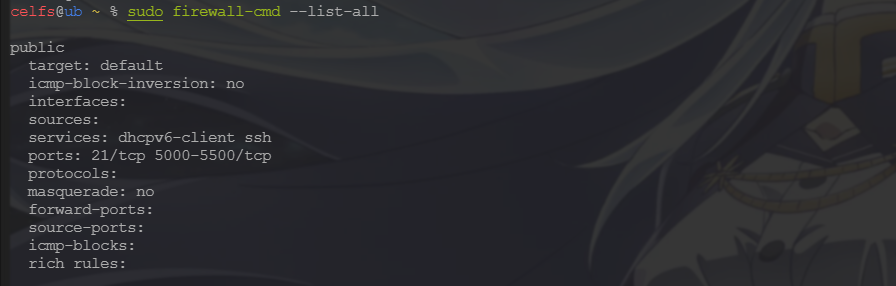

* 已开启 1521 端口 --> 客户端成功连接数据库服务器

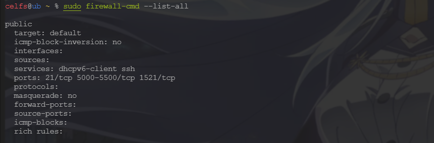

#### 13 云平台访问策略配置

* 如果 Oracle 数据库安装在云服务器上，需要登录云服务器提供商的管理平台开通访问策略（或安全组），开通 **1521 端口的访问策略**。

#### 14 Oracle 数据库开机自启动

* 目前可不看，后面需要再看。

#### 00 疑问 

* ~~看到 `/etc/passwd` 文件，突然理解了 Linux 里面用户权限的表示，`x` 后面的代码即为权限？~~ 
  * 不是的，`x` 是用户密码的占位，有时候是 `*`，实际的密码被存储在 `/etc/shadow` 文件中。
    * `oracle` 是用户名；`x` 是密码字段；
    * `1001` 是用户的 UID；`1001` 是用户所属的 GID；
    * `::` 表示空的 GECOS 字段；
    * `/home/oracle` 是用户的主目录路径；
    * `/bin/zsh` 是用户登录时使用的 shell
  * 确切的权限，通过文件系统的权限控制（例如 `chmod` 命令设置的权限）来管理。

```bash
username:password:UID:GID:GECOS:home_directory:shell

oracle:x:1001:1001::/home/oracle:/bin/zsh
```
* ~~如何将用户 `celfs` 的 `zsh` 配置，打包参数后，直接分享给用户 `oracle` ？~~
* ~~目前 `oracle` 里面十分干净，那么前面一系列的设置，能够顺利生效吗？~~
  * 检查发现，`etc` 等系统目录是共享的，并且他们同属一个 `home` 目录
  * 这么看来，还是有希望直接使用 `zsh` 的。
* 拷贝 `zsh` 配置（已解决）
  * 拷贝 `.zshrc` 后，切换用户，可根据报错信息继续拷贝其他文件
  * 给必要文件赋权

```bash
# 拷贝配置文件
sudo cp /home/celfs/.zshrc /home/oracle/

# 修改默认 shell
sudo usermod -s /usr/bin/zsh oracle

# 拷贝剩余文件
sudo cp -r /home/celfs/.local /home/oracle/
sudo cp -r /home/celfs/.oh-my-zsh /home/oracle/
sudo cp -r /home/celfs/.cache /home/oracle/

# 赋权
sudo chown -R oracle:dba /home/oracle/.cache

# 验证权限
su - oracle
touch /home/oracle/.cache/testfile
ls -l /home/oracle/.cache

# 解决切换 .cache 目录报错问题
sudo chown -R oracle:dba /home/oracle/.local
```

* 切换 `.cache` 目录报错（权限问题，已解决）

```bash
oracle@ub ~ % .cache                                                                                            [0]
oracle@ub .cache % Traceback (most recent call last):                                                           [0]
  File "/usr/share/autojump/autojump_data.py", line 75, in load
    with open(
  File "/usr/lib/python3.8/codecs.py", line 905, in open
    file = builtins.open(filename, mode, buffering)
PermissionError: [Errno 13] Permission denied: '/home/oracle/.local/share/autojump/autojump.txt'

During handling of the above exception, another exception occurred:

Traceback (most recent call last):
  File "/usr/lib/python3.8/shutil.py", line 791, in move
    os.rename(src, real_dst)
PermissionError: [Errno 13] Permission denied: '/home/oracle/.local/share/autojump/autojump.txt.bak' -> '/home/oracle/.local/share/autojump/autojump.txt'

During handling of the above exception, another exception occurred:

Traceback (most recent call last):
  File "/usr/bin/autojump", line 320, in <module>
    sys.exit(main(parse_arguments()))
  File "/usr/bin/autojump", line 264, in main
    save(config, first(add_path(load(config), args.add)))
  File "/usr/share/autojump/autojump_data.py", line 84, in load
    return load_backup(config)
  File "/usr/share/autojump/autojump_data.py", line 89, in load_backup
    move_file(config['backup_path'], config['data_path'])
  File "/usr/share/autojump/autojump_utils.py", line 139, in move_file
    shutil.move(src, dst)
  File "/usr/lib/python3.8/shutil.py", line 811, in move
    copy_function(src, real_dst)
  File "/usr/lib/python3.8/shutil.py", line 435, in copy2
    copyfile(src, dst, follow_symlinks=follow_symlinks)
  File "/usr/lib/python3.8/shutil.py", line 264, in copyfile
    with open(src, 'rb') as fsrc, open(dst, 'wb') as fdst:
PermissionError: [Errno 13] Permission denied: '/home/oracle/.local/share/autojump/autojump.txt.bak'
```

#### 00 BUG

* ~~1）FTP 传输文件，提示 `451` 错误，实际上，并非权限问题，而是虚拟机硬盘满了。于是，需要拓展虚拟机硬盘。~~ （扩展存储后，问题解决）
  * 1）虚拟机——快照管理器——删除快照
  * 2）虚拟机设置——硬盘——扩展（50GB --> 90GB）
  * 3）虚拟机内部设置

```bash
# 扩展前
celfs@ub ~ % df -h
Filesystem                         Size  Used Avail Use% Mounted on
udev                               1.9G     0  1.9G   0% /dev
tmpfs                              389M  1.5M  388M   1% /run
/dev/mapper/ubuntu--vg-ubuntu--lv   24G   23G   37M 100% /
tmpfs                              1.9G     0  1.9G   0% /dev/shm
tmpfs                              5.0M     0  5.0M   0% /run/lock
tmpfs                              1.9G     0  1.9G   0% /sys/fs/cgroup
/dev/nvme0n1p2                     2.0G  211M  1.6G  12% /boot
tmpfs                              389M     0  389M   0% /run/user/1000

# 扩展后
celfs@ub ~ % df -h
Filesystem                         Size  Used Avail Use% Mounted on
udev                               1.9G     0  1.9G   0% /dev
tmpfs                              389M  1.5M  388M   1% /run
/dev/mapper/ubuntu--vg-ubuntu--lv   48G   23G   23G  50% /
tmpfs                              1.9G     0  1.9G   0% /dev/shm
tmpfs                              5.0M     0  5.0M   0% /run/lock
tmpfs                              1.9G     0  1.9G   0% /sys/fs/cgroup
/dev/nvme0n1p2                     2.0G  211M  1.6G  12% /boot
tmpfs                              389M     0  389M   0% /run/user/1000
```

```bash
# 显示各个文件系统的挂载点、总大小、已用空间和可用空间
df -h

# 查看卷组信息
sudo vgdisplay

# 查看现有物理卷
sudo pvs
# sudo vgextend ubuntu-vg /dev/nvme0n1p3 # 可能报错
# sudo pvresize /dev/nvme0n1p3

# 扩展分区
sudo lvextend -l +100%FREE /dev/mapper/ubuntu--vg-ubuntu--lv
# 扩展 ext4 文件系统
sudo resize2fs /dev/mapper/ubuntu--vg-ubuntu--lv
```

* 2）虚拟机登录界面（字符界面），循环登录验证，无法进入用户 shell，但用其他 SSH 的 shell 可以登录用户。
  * 这个操作好像是在尝试上传文件到用户 oracle 失败后（权限不足），使用了 `sudo chown -R oracle /home/oracle` 导致的（也可能是更早之前的其他原因，例如因为在同一个 `/home` 下，创建了两个用户目录，识别初始目录产生歧义之类的，这个操作可以对应到默认 shell 的配置文件中）
* 3）设置 Oracle 动态库路径为环境变量后，导致 `vi` 与 `vim` 等工具失效，直接原因是库冲突，修改库路径优先级后，文件暂时解决，但工具的个性化配置也随之消失，需要将相关配置文件拷贝过来。


* 2024/06/24 23:39:05 安装，2h26min
* 2024/06/26 00:15:08 空间扩展 + 配置 Oracle + vim 失效 BUG，4h16min
* 2024/06/26 01:29:19 解决环境变量冲突问题，19min
* 2024/06/26 02:47:50 完成安装 + 全调试+ 笔记，1h18min

------


### 81 Oracle客户端的安装和配置

* Oracle 客户端的组成
  * Oracle 客户端软件（客户端工具 + 访问库）
  * PL/SQL Server 软件（程序员、运维人员）

#### 01 Oracle 客户端软件安装

* 管理员类型，其余步骤缺省即可

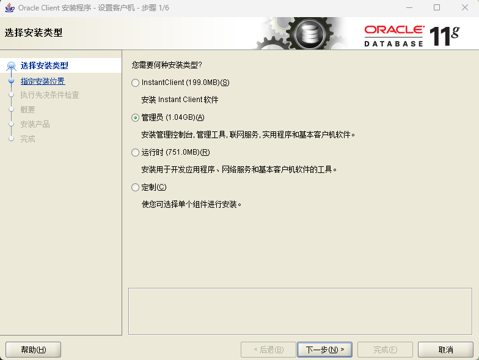

* 查阅环境变量

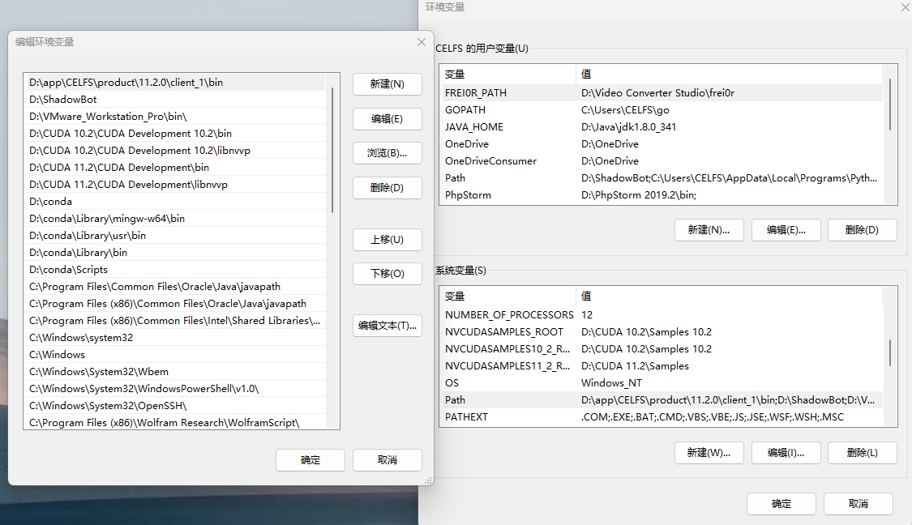

* 查阅注册表
  * 存放了客户端的参数，一般不必修改
  * `NLS_LANG` 为客户端字符集；`ORACLE_HOME` 为软件安装根目录

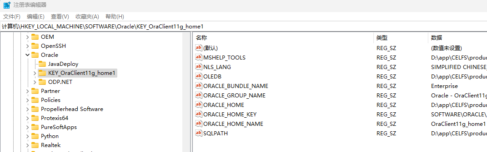

* 配置参数（Windows 系统）
  * `D:\app\CELFS\product\11.2.0\client_1\network\admin` 
  * `tnsnames.ora` 文件
    * 拷贝
    * 权限：属性 --> 安全 --> 完全控制
    * 配置

  ```bash
  # This file contains the syntax information for 
  # the entries to be put in any tnsnames.ora file
  # The entries in this file are need based. 
  # There are no defaults for entries in this file
  # that Sqlnet/Net3 use that need to be overridden 
  #
  # Typically you could have two tnsnames.ora files
  # in the system, one that is set for the entire system
  # and is called the system tnsnames.ora file, and a
  # second file that is used by each user locally so that
  # he can override the definitions dictated by the system
  # tnsnames.ora file.
  
  # The entries in tnsnames.ora are an alternative to using
  # the names server with the onames adapter.
  # They are a collection of aliases for the addresses that 
  # the listener(s) is(are) listening for a database or 
  # several databases.
  
  # The following is the general syntax for any entry in 
  # a tnsnames.ora file. There could be several such entries 
  # tailored to the user's needs.
  
  snorcl11g_150 =
    (DESCRIPTION =
      (ADDRESS_LIST =
        (ADDRESS = (PROTOCOL = TCP)(HOST = 192.168.20.150)(PORT = 1521))
      )
      (CONNECT_DATA =
        (SID = snorcl11g)
        (SERVER = DEDICATED)
      )
    )
    
  #snorcl11g_130 =
  #  (DESCRIPTION =
  #    (ADDRESS_LIST =
  #      (ADDRESS = (PROTOCOL = TCP)(HOST = 192.168.150.130)(PORT = 1521))
  #    )
  #    (CONNECT_DATA =
  #      (SID = snorcl11g)
  #      (SERVER = DEDICATED)
  #    )
  #  )
  ```

  * 开启防火墙端口（见上一节，防火墙的设置）
    * 缺省端口 1521，若防火墙端口未开放，则提示连接超时；
    * 否则，连接成功。

  ```cmd
  # 登录需添加 @数据库实例名
  sqlplus scott/tiger@snorcl11g_150
  ```

  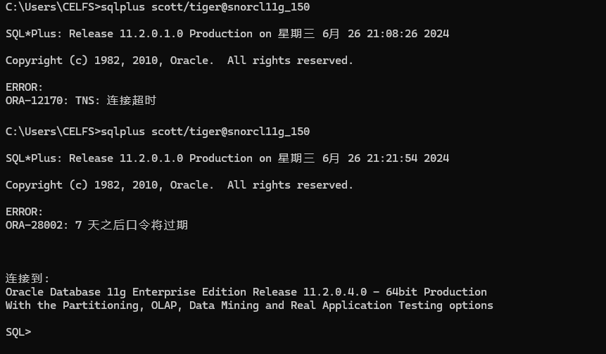

* 配置参数（Linux 系统）

  * 内容与前面一致

```bash
vim /oracle/home/network/admin/tnsnames.ora

# 登录远程数据库
sqlplus scott/tiger@snorcl11g_150
```

#### 02 PL/SQL Server 软件安装

* 缺省安装
* 软件许可 `pl/sql developer 11` 

```txt
Product Code:  4t46t6vydkvsxekkvf3fjnpzy5wbuhphqz
serial Number: 601769
password:      xs374ca
```

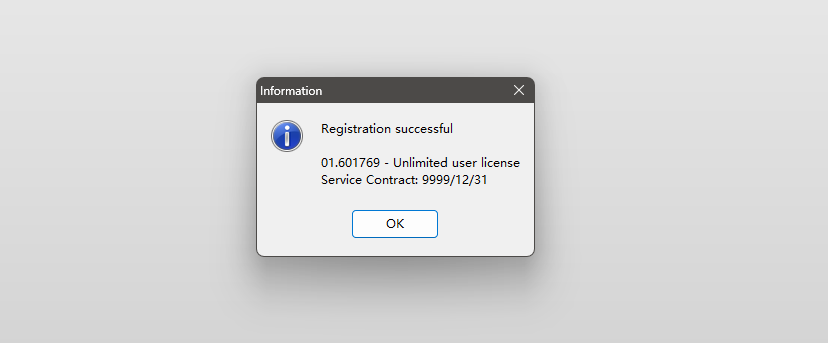

* 登录客户端

  * 修改各界面字体属性（字号 10 合适）

  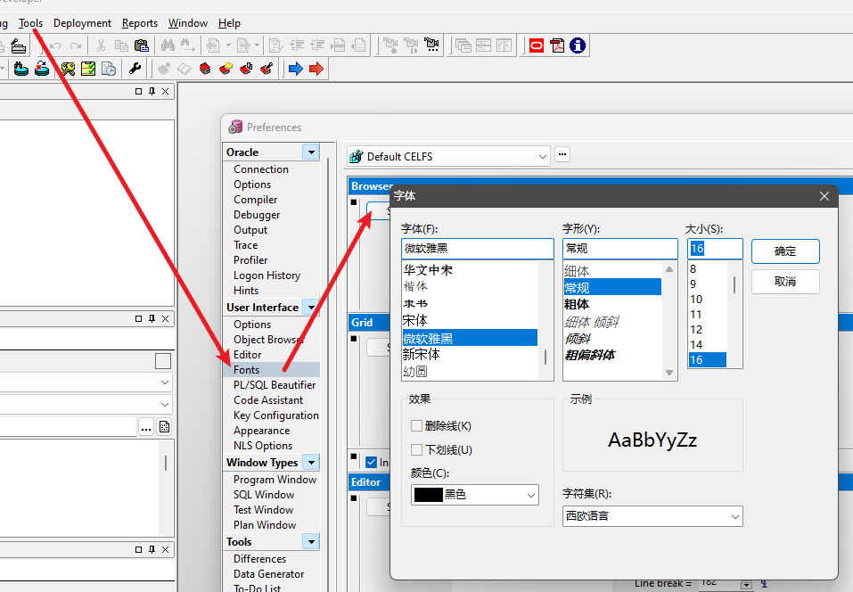

  * 隐藏部分窗口

  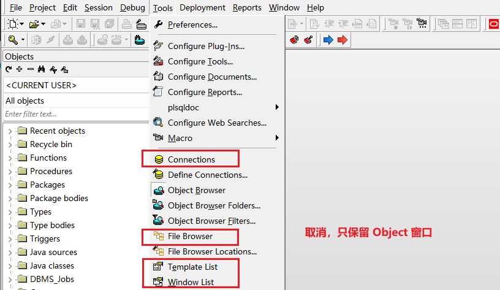

  * SQL 窗口 --> 执行语句（显示效果最好）

  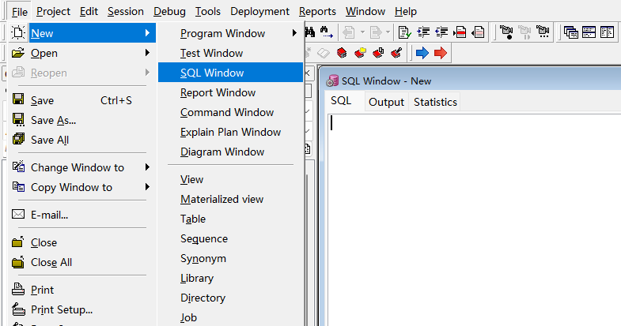

  * 执行语句（F8），报错，但内容正常显示

  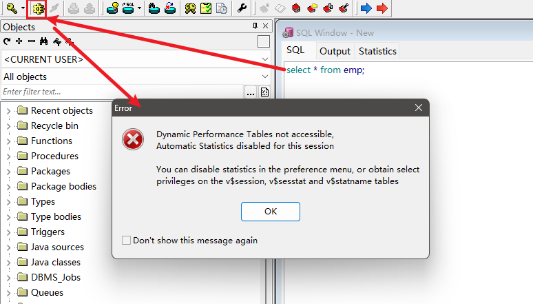

  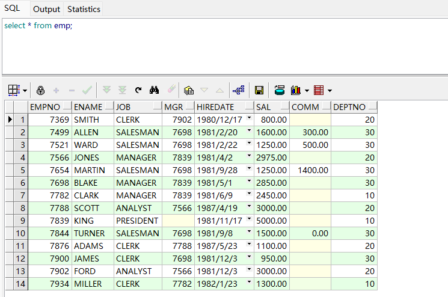

  * 命令行窗口 --> 执行语句（显示效果如下）

  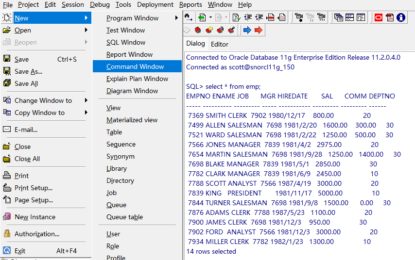


* 2024/04/28 18:26:24；2024/06/26 17:19:32 32min
* 2024/06/26 22:08:40 1h23min

------


### 82 表的基本概念

#### 01 表

* 数据库最基本的逻辑结构（存放一切数据）
* 其他数据库对象（索引、视图、同义词等），是为了便捷操作表中数据
* 列（数据项）、行（数据元素）

#### 02 创建表

* 表名原则：1）以 `T_` 为前缀；2）可读含义（完整单词、简写、拼音等）
* 语法类似 C 语言结构体

```sql
create table 表名
(
	字段名1 数据类型 null,
    字段名2 数据类型 not null,
    ......,
    字段名n 数据类型 null
);
```

#### 03 列的数据类型

* 字符串类型：`char(str_len), varchar2(str_len)` 
* 数字类型：
  * `number(num_len, decimal_places)` 、整数 `number(num_len, 0)` 
  * 例 `number(5, 2)` --> `-999.99~999.99` 
* 日期类型：
  * `date`，本质是一个整数（时间戳）
  * 年 `yyyy`、月 `mm`、日 `dd`、时 `hh24`、分 `mi`、秒 `ss` 
* `clob` 类型：单字节字符串、多字节文本数据（文本文件、xml 文件等）
* `blob` 类型：非结构化的二进制数据（图片、音频、视频、office 文档等）
* `rowid` 类型：表中记录在数据库中的物理地址
* 其他见讲义《Oracle 数据类型》

#### 04 创建表的实例

* 值是否为空、值的长度，由业务决定

```sql
create table T_GIRL
(
  id        char(4)         not null,   -- 编号
  name      varchar2(30)    not null,   -- 姓名
  yz        varchar2(20)        null,   -- 颜值
  sc        varchar2(20)        null,   -- 身材
  weight    number(4,1)     not null,   -- 体重，单位：kg
  height    number(3)       not null,   -- 身高，单位：cm
  birthday  date            not null,   -- 出生时间，可精确到秒。
  memo      varchar2(1000)      null    -- 备注
);
```

#### 05 语法约定

* Oracle数据库的 SQL 语句中，关键字、表名、字段名都不区分大小写；
* 注释 `--` 
* 插入记录语句中，表名字段列表与值字段列表，必须一一对应；
* 字符串单引号包含，没有字符概念（Oracle 将其定义为长度为1的字符串）；
* 执行多行 SQL 语句，以分号分隔；

#### 06 表记录的操作

##### 6.1 插入记录

* SQL 窗口 --> 执行 F8 --> 提交事务--> 数据生效
* 提交事务 `commit;` （可单独选中执行）

```sql
insert into 表名(字段名1, 字段名2, ......, 字段名n) values(字段1值, 字段2值, ......, 字段n值);
```

```sql
-- 示例代码
insert into T_GIRL(id,name,yz,birthday,sc,weight,height,memo)
  values('0101','西施','漂亮',to_date('2000-01-01 01:12:35','yyyy-mm-dd hh24:mi:ss'),
         '火辣',48.5,170,'这是一个非常漂亮姑娘，老公是夫差，男朋友是范蠡。');
insert into T_GIRL(id,name,yz,birthday,sc,weight,height,memo)
  values('0102','貂禅','漂亮',to_date('1997-08-02 12:20:38','yyyy-mm-dd hh24:mi:ss'),
         '苗条',45.2,168,'王允真不是男人，干不过董卓就把美人往火坑里推，千古罪人啊。');
insert into T_GIRL(id,name,yz,birthday,sc,weight,height,memo)
  values('0103','妲已','漂亮',to_date('1998-03-03 10:50:33','yyyy-mm-dd hh24:mi:ss'),
         '火辣',53.6,172,'如果商真的因我而亡，您们男人做什么去了？');
insert into T_GIRL(id,name,yz,birthday,sc,weight,height,memo)
  values('0104','芙蓉姐姐','猪扒',to_date('1980-05-05 10:11:55','yyyy-mm-dd hh24:mi:ss'),
         '膘肥体壮',85.8,166,'如果不努力学习技术，将来就会娶个芙蓉姐姐，哼哼。');
insert into T_GIRL(id,name,yz,birthday,sc,weight,height,memo)
  values('0105','神密猫女',null,to_date('1989-12-08 12:10:35','yyyy-mm-dd hh24:mi:ss'),
         null,48.5,171,'不知道是什么人，她脸上有一个%符号，很神密。');
```

```sql
-- 提交事务
commit;
```

##### 6.2 错误测试

* 输入错误 `id` --> `idd`；表名错误；关键字错误；语句错误；
* 字段名列表数目与字段值不对应；

##### 6.3 查询记录

* 注意，`*` 写法不得出现在程序中，否则当表结构改变或字段位置改变，程序将出现混乱

```sql
-- 满足条件的特定记录
select 字段名1, 字段名2, ......, 字段名n from 表名 where 条件1 and 条件2 ...... 条件n;

-- 满足条件的所有记录
select * from 表名 where 条件1 and 条件2 ...... 条件n;

-- 表中所有记录
select * from 表名;
```

```sql
-- 示例代码
select name, to_char(birthday, 'yyyy-mm-dd hh24:mi:ss') from T_GIRL where yz='漂亮' and sc='火辣';
```

##### 6.4 修改记录

```sql
update 表名 set 字段名1=值1,字段名2=值2,......字段名n=值n where 条件1 and 条件2 ...... 条件n;
```

```sql
-- 示例代码
update T_GIRL set weight=89.5, yz='恐龙', birthday=to_date('1978-01-01 01:12:35','yyyy-mm-dd hh24:mi:ss') where name='芙蓉姐姐';
```

##### 6.5 删除记录

```sql
delete from 表名 where 条件1 and 条件2 ...... 条件n;
```

```sql
-- 插入测试用例
update T_GIRL set weight=89.5,yz='恐龙',birthday=to_date('1978-01-01 01:12:35','yyyy-mm-dd hh24:mi:ss') where name='芙蓉姐姐';

select * from T_GIRL;

insert into T_GIRL(id, name, yz, birthday, sc, weight, height, memo) values('0110', '张三', '未知', to_date('1000-01-01 01:01:01','yyyy-mm-dd hh24:mi:ss'), '未知',50,199,'江湖号称法外狂徒。');

select * from T_GIRL;

-- 示例代码
delete from T_GIRL where name='芙蓉姐姐';
```

#### 00 疑问

* 如何理解工程项目中不能出现 `*` 的查询语句？具体的使用场景有哪些？是指程序中如果需要用到依赖检索结果的语句，就不能使用 `*` 来建立这种依赖？从而避免依赖的改变，导致输出的改变？
* ~~插入数据后，表格出现相同了重复的内容，这种如何避免？~~ 引出了主键以及主键约束的概念。

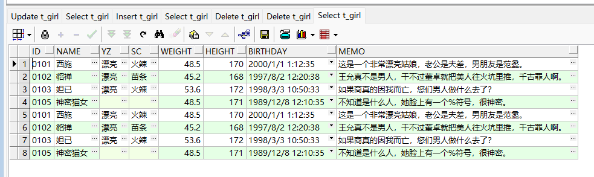

#### 00 BUG

* 1）执行多行语句，产生多个执行框，但选中执行框后，自动识别的对应语句，定位错误。是否因为修改了字体大小，字号不匹配导致的错位？

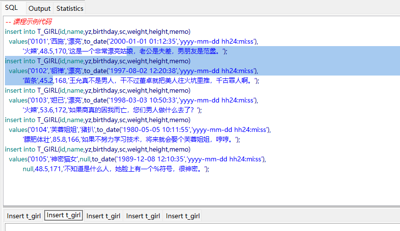


* 2024/06/27 18:27:41 1h30min
* 2024/06/28 17:03:18 27min

------


### 83 表的主键和约束

#### 01 表的主键

* 主键
  * 核心是数据的唯一特性（标识，例如身份证号码、手机号码）
  * `primay key(id)` 指定主键
* 作用
  * 体现数据结构设计的合理性；提升数据操作的效率；保证数据的完整性（主键约束）
* 创建表的主键
  * 1）创建表时 `create table` 
  * 2）修改表时 `alter table` 

```sql
-- 创建表时，创建主键
create table tt
(
    id        char(4)         not null,   -- 编号
  	name      varchar2(30)    not null,   -- 姓名
    primay key(id)						  -- 以 id 列创建主键
);

-- 修改表时，创建主键
alter table 表名 add constraint 主键名 primary key(字段名1,字段名2,......字段名n);
```

```sql
-- 示例代码
alter table T_GIRL add constraint PK_GIRL primary key(id);
```

#### 02 表的约束

* 非空约束
  * 注意，若表格已存在，则报错；另外，应当注意检查核对当前操作的表名

```sql
-- 示例代码
create table tt (c1 varchar2(10),c2 varchar2(10) not null);
```

```sql
-- 创建表 tt2
create table tt2(c1 varchar2(10), c2 varchar2(10) not null);
-- 插入记录
insert into tt2(c1, c2) values('aa', 'bb');
-- 插入失败，c2 不能为空值
insert into tt2(c1, c2) values('', '');
-- 插入成功，c1 可为空值，单独指定 c2 值
insert into tt2(c2) values('cc');

-- 查询非空值 & 查询空值 | 不能使用等号
select * from tt2 where c1 is not null;
select * from tt2 where c1 is null;
select * from tt2;
```

* 唯一性约束

```sql
-- 示例代码 --> 已有表，再次执行，则报错：违反唯一约束条件
create table tt2 (id varchar2(10),name varchar2(10),primary key(id));
```

* 检查约束
  * 对值的范围进行检查、约束；若插入数据不满足条件，则报错；

```sql
--create table TT20
--(
--   c1   number(6) constraint CKC_C1_TT check (c1 >= 10), 
--   c2   number(6) constraint CKC_C2_TT check (c2 <= 20), 
--   c3   number(6) constraint CKC_C3_TT check (c3 in (1,2,3))
--);

-- 插入失败，c1 违反检查约束条件
insert into tt20(c1, c2, c3) values(1, 20, 1);

select * from TT20;
```

* 外键约束（见后续章节）
* 信息补充
  * Oracle 表示空值，两种方式 `''` 和 `null` 

#### 02 字段的缺省值

* 类似 C++ 函数参数的缺省；关键字 `default` 

```sql
create table TT21
(
   name     varchar2(10) not null,
   crttime  date         default sysdate not null,
   rsts     number(1)    default 1 not null constraint CKC_RSTS_TT check (rsts in (1,2))
);

insert into tt21(name) values('李四');
```

#### 03 表的存储空间（见后续章节）

#### 04 修改表结构

* 关键字 `alter table`，涉及选项非常多，下面讲述四种主要用法：增加字段、修改字段属性、修改字段名、删除字段。
* 注意
  * 修改字段属性时，若表中已存在数据，则修改可能失败；例如存在值 100，将其范围改为 `number(1)`，则无法存储值 100；又如将 `null` 改为 `not null`，但记录已存在 `null` 的情况；或者，新旧数据类型不兼容的情况。
  * 以上三种情况，本质上是已存在的数据与修改后的规则或约束产生矛盾，其结果是修改失败。
  * 总结为：值的范围不匹配、值的存在性不一致、值的类型不兼容。

##### 4.1 增加字段

```sql
-- 1）增加字段
alter table 表名 add 字段名 数据类型 其它选项;
-- 示例代码
-- 新增字段 address
alter table tt21 add address varchar2(50) null;
-- 新增含约束条件 con_rsts 的字段 rsts2 in (1, 2)
alter table tt21 add rsts2 number(1) constraint con_rsts check (rsts2 in (1,2));


```

##### 4.2 修改字段的属性

```sql
-- 2）修改字段的属性
alter table 表名 modify 字段名 数据类型 其它选项;
-- 示例代码
alter table tt21 modify address varchar2(100);
-- 修改失败，与已有空值矛盾
alter table tt21 modify address varchar2(100) not null;
-- 删除约束条件 con_rsts
alter table tt21 drop constraint con_rsts;
-- 修改 rsts 字段的约束条件为 con_rsts2
alter table tt21 modify rsts constraint con_rsts2 check (rsts in (1,2,3));
```

##### 4.3 修改字段名

```sql
-- 3）修改字段名
alter table 表名 rename column 列名 to 新列名;
-- 示例代码
alter table tt21 rename column rsrs2 to del1;
```

##### 4.4 删除字段

```sql
-- 4）删除字段（删除列）
alter table 表名 dorp column 字段名;
-- 示例代码
alter table T_GIRL drop column rsts;
alter table T_GIRL drop column address;
```

#### 05 修改表名

```sql
alter table 表名 rename to 新表名;
-- 示例代码
alter table tt21 rename to tt8;
```

#### 06 删除表

```sql
drop table 表名;
-- 示例代码
drop table tt8;
```

#### 00 经验

* 学习数据库时，关键是理解概念、理解原理，不要背语法；取而代之的是知道有这么回事，需要时查文档、搜索引擎。
* 实际开发中，一般在创建表的同时，在语句末尾创建主键。
* 创建表后，一般不会修改其结构，但也可以进行修改。实际工作中很少用到，但需自行了解，知道有这个功能。

#### 00 疑问

* 如何查看已有字段是否存在约束条件？
* 在 PL/SQL 中，只能执行一条语句，注释一条、删除一条或者选中需要执行的新内容？这样的操作有点反人类，而且与 VSC 那种 IDE 的调试模式不同。
* 是否有合适的 PL/SQL 插件？例如代码自动补全功能、书写错误检查等，或者干脆封装到常用的 IDE 当中，把开发环境集成起来。
* 修改字段名，是否有连续修改的语句？例如使用字段名列表。
* 删除字段名，是否有连续删除的语句？例如使用字段名列表。


* 2024/06/28 18:59:20 20min + 50min
* 2024/06/28 22:42:57 1h31min

------


### 84 事务、虚表、序列和伪列

#### 01 事务

* 内容：数据库中的逻辑任务，一个事务由一个或一组 SQL 语句组成。
* 目的：保证数据完整性，使得 SQL 语句（或语句组）原子地执行或撤销。

#### 02 示例

* 1）从账户 A 到账户 B 的转账操作
  * 业务
    * A 10000元，B 10000元（初始态）；
    * A --> 1000元 --> B；
    * A 9000元 --> B 11000元；
  * 加锁
  * 执行成功 --> 相应余额加减
  * 执行失败 --> 操作撤回（形似回溯算法的步骤）
  * 解锁
* 如此，分支特化处理十分繁琐，不利于逻辑 / 业务规模扩展；
* 由此，使用 Oracle 事务进行相关的操作，将有利于逻辑封装及原子性操作
  * 开始事务（自动加锁）
  * 回滚事务（某环节失败）
  * 提交事务（全环节成功 --> 自动解锁）
* 2）假设转账已执行修改余额的操作，等待过程被其他进程访问
  * 交易处理 --> 程序等待
  * 此时，其他进程查看 A、B 余额仍为 10000元 --> 无法修改（已被加锁）
  * 交易生效 --> 事务提交
  * 整体而言，对其他程序，这四个数据是同时生效的，即为原子操作

#### 03 事务控制

```sql
begin;		-- 开始事务，默认从第一条操作数据的 SQL 语句开始
commit;		-- 提交事务
rollback;	-- 回滚事务，回滚到最后一次 commit 的数据状态
```

* 核心内容，调试
  * 提交事务：两个数据库窗口，模拟两个进程
    * 1）两进程分别同时修改 AB 余额，由于未提交，则各自都看到旧数据；
    * 2）两进场分别提交修改，各自数据生效；
    * 3）进程一修改 A 余额，未提交；进程二尝试修改 A 余额，则提示执行中，并且对阻塞计时，等待进程一的提交修改；
    * 4）进程一提交修改（锁被释放），则进程二立即执行阻塞中的修改；
    * 5）若当前没有事务，则界面提交及回滚按钮不可操作（灰色）；
  * 回滚事务：
    * 回滚若干操作，即回到最后一次 commit 的数据状态

```sql
create table t1 (
       usr varchar2(10) not null,
       ye number(5) not null
);

insert into t1(usr, ye) values('A', 10000);
insert into t1(usr, ye) values('B', 10000);
-- 提交后，方可见两个记录
commit;

-- 进程一
update t1 set ye=ye-1000 where usr='A';
-- 进程二
update t1 set ye=ye-1000 where usr='B';
-- 提交后，方可见各自修改
commit;

select * from t1;

-- rollback，回滚若干操作，即回到最后一次 commit 的数据状态
update t1 set ye=ye-1000 where usr='A';
update t1 set ye=ye+1 where usr='A';
select * from t1;
--commit;
rollback;
select * from t1;
```

* 阻塞等待其他进程释放锁

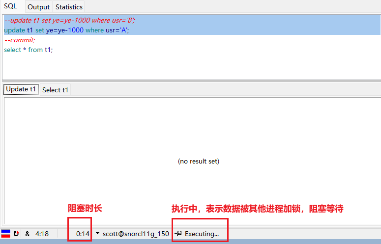

* 其他内容

  * 1）设置事务属性
    * 设置事务的各种状态，比如
      * （1）只读、读/写；
      * （2）隔离级别；
      * （3）将事务分配回滚段；
      * （4）为事务分配名称，等等。

  ```sql
  set transaction [read only | read write]
                  [isolation level [serialize | read commited]]
                  [use rollback segment 'segment_name']
                  [name 'transaction_name'];
  ```

  * 2）数据异常
    * 并发事务对同一数据库访问时，可能情况 + 隔离级别设置：
      * （1）**错读 / 脏读（Dirty Read）**
        * --> 设置隔离级别（**读已提交或更高**）
        * 一个事务读取了另一事务未提交的数据；
        * 若第一个事务回滚；
        * 则第二个事务读到的数据无效、与数据库的不一致。
      * （2）**非重复读取 / 不可重复读（Non-repeatable Read）**
        * --> 设置隔离级别（**可重复读或更高**）
        * 一个事务读取了某一行数据；
        * 另一个事务更新了该行数据；
        * 那么当第一个事务再次读取该行数据时，会发现数据已改变。
      * （3）**假读 / 幻读（Phantom Read）** 
        * --> 设置隔离级别（**序列化**）
        * 当一个事务基于某个条件读取了一组数据；
        * 另一个事务在此期间插入或删除了数据；
        * 则第一个事务再次读取数据时，会发现符合条件的行数已改变。
    * 规律
      * 隔离性级别越多，异常出现越少，并发性能越低；
      * 隔离性级别越低，异常出现越多，并发性能越高。

  * 3）选择隔离层
    * 非提交读（READ UNCOMMITTED），DNP 111
    * **读已提交（READ COMMITTED）**，DNP 011
    * 可重复读（Repeatable READ），DNP 001
    * **串行读 / 序列化（Serializable）**，DNP 000
    * 补充
      * D、N、P 分别对应三种数据异常，1 表示允许的异常
      * **Oracle 支持上述两种，并额外定义了两层**，分别是读已提交（默认）、串行读，另外定义了 read only 隔离层和 read write 隔离层（默认）。

  * 4）保存点 / 保留点（ `savepoint` ）
    * 在数据库事务处理中，实现 “子事务（嵌套事务）” 的方法。
    * 事务可以回滚到 `savepoint` 而不影响 `savepoint` 创建前的变化，不需要放弃整个事务；
    * 使用 `rollback` 设置保留点，执行多条 SQL 操作时，回滚到想要的那条 SQL 之前。

  ```sql
  savepoint savepoint_name;    -- 声明一个savepoint。
  rollback to savepoint_name;   -- 回滚到savepoint。
  ```

  经验

  * 提交 + 回滚，可满足 99% 的应用需求。
  * 事务控制的其他内容，开发中很少使用。

#### 04 事务特征

* ACID原则
  * 原子性（Atomicity）：完全执行 or 完全不执行，提交时不存在中间结果；
  * 一致性（Consistency）：数据总量在事务前后保持一致（例如 AB 账户共 1000元，互相转账，无论操作是否成功，两个账户总和仍为 1000元）；
  * 隔离性（Isolation）：允许多并发事务同时对数据读写改，SQL 交叉操作数据，也能保持数据一致；
  * 持久性（Durability）：事务结束后，立即将数据写入硬盘（对数据修改是永久保存的）。

#### 00 疑问

* 需要更直观地理解事务的隔离性。
* 事务控制涉及内容较多，即使从经验上的使用频率，隔离级别、数据异常等内容一带而过，但实际上属于比较重要的内容，如果在工程上设置不当，后果可能不堪设想。
* 理论内容、原理性内容比较多，让人有一种远离了代码的眼高手低感，但实际上也是需要耐心了解的，不过没有使用具体的代码例子。
* 阅读 “选择隔离层” 一节时，部分内容讲述、理解不清楚。
  * 例如，“serializable：事务与事务之间完全隔开，事务以串行的方式执行，这并不是说一个事务必须结束才能启动另外一个事务，而是说这些事务的执行的结果于一次执行的事务的结果一致。” 这句话什么意思？
  * 另外，提出了几个概念，例如 “read only 层是 serializable 层的一个子集”，“区别是 read only 只读，而 serialzable 可以执行 DML 操作。”
  * 什么是 DML 操作？
  * 为什么要基于 serialzable 层来定义 read only 层？
* 如何理解 “子事务” 的提出，类似大型事务的若干中间快照？使得事务回滚更灵活？不会导致事务的原子性受到影响吗？

#### 05 虚表


#### 06 序列

#### 07 伪列


* 2024/06/30 16:38:12 事务，34min
* 2024/06/30 19:44:15 事务控制，2h55min
* 2024/07/01 04:00:10 虚表、序列、伪列，14min

------


### 85 表的索引


------


### 86 where、order by子句

### 87 Oracle的函数


------


## 第十二章 Oracle数据库基础（下）

### 88 外键、别名和子查询

### 89 表空间、用户和权限管理

### 90 视图和数据字典

### 91 数据库链路和同义词

### 92 自定义函数、存储过程和触发器

### 93 其它的知识和概念

### 94 数据库设计PowerDesigner(上)

### 95 数据库设计PowerDesigner(下)


------


## 第十三章 C++开发Oracle数据库

### 96 创建表

### 97 向表中插入数据

### 98 修改和删除表中的数据

### 99 从表中查询数据

### 100 存取大型对象

### 101 其它的细节

### 102 全国气象站点参数文件入库

### 103 全国气象观测数据文件入库（上）

### 104 全国气象观测数据文件入库（下）


------


## 第十四章 数据抽取模块

    * 105 数据抽取-业务需求
    * 106 数据抽取-程序的框架
    * 107 数据抽取-全量抽取
    * 108 数据抽取-增量抽取
    * 109 数据抽取-应用的经验

## 第十五章 数据入库模块

    * 110 数据入库-业务需求
    * 111 数据入库-程序的框架
    * 112 数据入库-读取数据字典
    * 113 数据入库-准备SQL语句
    * 114 数据入库-解析xml、执行SQL语句
    * 115 数据入库-完善和优化
    * 116 数据入库-应用的经验

## 第十六章 数据管理模块

    * 数据管理-业务需求
    * 数据管理-数据清理
    * 数据管理-数据迁移

## 第十七章 数据同步模块

    * 数据同步-业务需求
    * 数据同步-不分批刷新
    * 数据同步-分批刷新
    * 数据同步-增量同步
    * 数据同步-应用的经验

## 第十八章 IO多路复用

    * select模型（上）
    * select模型（下）
    * poll模型
    * epoll模型
    * 阻塞&非阻塞的IO
    * 水平触和&边缘触发
    * epoll的原理

## 第十九章 网络代理模块

    * 正向代理的实现
    * 用epll处理定时器和信号
    * 正向代理的优化
    * 反向代理（上）
    * 反向代理（下）

## 第二十章 数据访问接口模块

    * 数据共享的业务需求
    * HTTP协议的本质
    * HTTP协议示例
    * 表的设计
    * 功能的实现（上）
    * 功能的实现（下）
    * 数据安全策略

## 第二十一章 学习总结

    * 非结构化数据的存储
    * 共享平台的辅助功能
    * 如何获得项目经验
    * 简历的编写
    * 如何向面试官介绍项目
    * 面试官可能的提问
    * 下一步学习计划