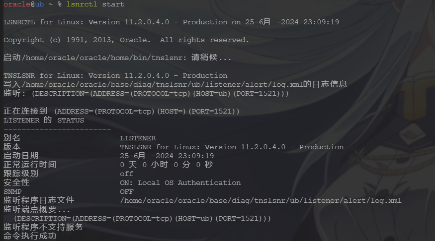
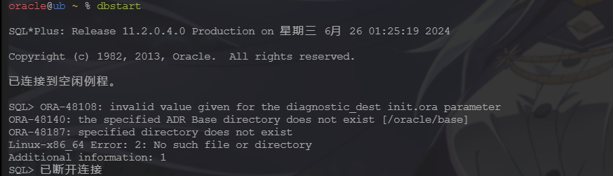
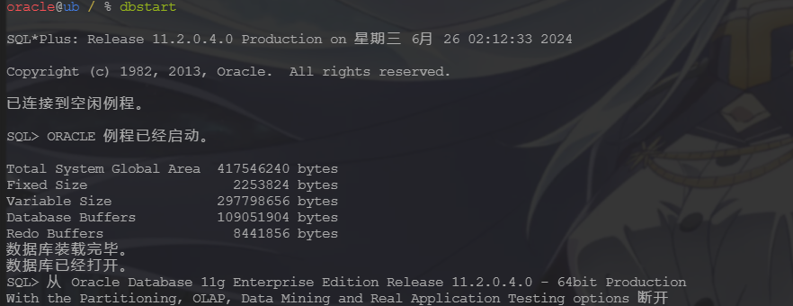
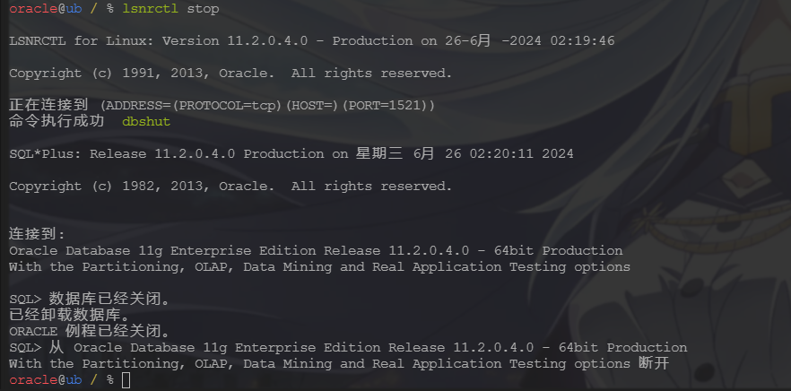
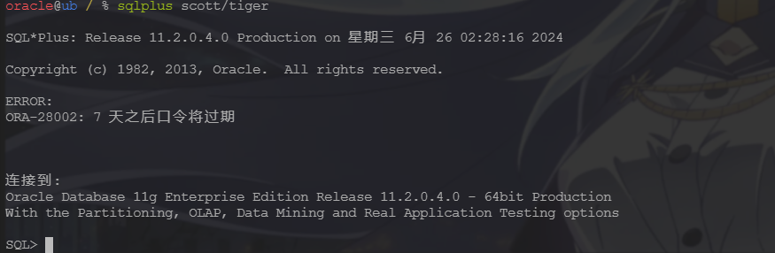
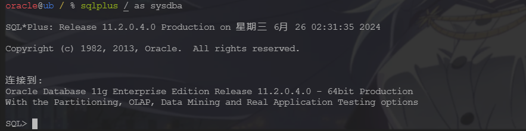
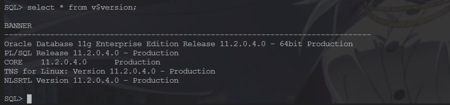

## 01 Task C++后台服务器开发 Ch11~Ch20 总结

Date：2024/06/24 21:10:03

------


[TOC]


------


### 00 进度

* 开始第十一章（2024/06/24）


------


## 第十一章 Oracle数据库基础（上）

### 79 数据库的业务需求

* 数据存储方式
  * 磁盘文件
  * 关系型数据库（Oracle、MySQL、SQL Server、PostgreSQL）
  * 非关系型数据库 NoSQL（Redis、HBase、MongoDB）
* 概括
  * 性能 + 安全性
    * Oracle（适用重要数据、几十亿量级）
    * MySQL（适用不重要、百万量级）
  * 行业应用
    * 国内互联网：MySQL为主，免费关键，而性能（Redis解决）和安全（分布式解决）不是重点
    * 传统行业：Oracle为主（银行、证券、军队、医院、政府）


* 2024/06/24 21:22:20 笔记整理

------


### 80 Oracle数据库系统的安装

* 概括
  
  * Oracle 的安装是个技术活，在虚拟机或低配设备，容易出现莫名其妙的问题。
  * 本节讲述的都是具体操作，按流程完成即可，常规方法可自行查阅相关资料。
  
* Oracle 安装（非常规，仅供学习）

  * 两种方法
    * 1）静默安装，技术难度较大，通常由 Oracle 的 DBA（数据库管理员）使用，普通程序员较难掌握；
    * 2）从安装成功的环境，传递优化（软件、数据库实例、环境参数等打包），在目标系统解压恢复（类似镜像还原）。


#### 01 环境需求

* 软件（CentOS7、zh_CN.UTF-8）
* 硬件（内存 1024MB、交换区）
  * 如下，得知已分配交换区在该内存区间内，应设为内存的1倍，满足


* 依赖包（命令报错）

```bash
yum install -y \
binutils* \
compat-libstdc* \
elfutils-libelf* \
gcc* \
glibc* \
ksh* \
libaio* \
libgcc* \
libstdc* \
make* \
sysstat* \
libXp* \
glibc-kernheaders \
ksh \
binutils \
compat-libstdc++-33 \
elfutils-libelf \
elfutils-libelf-devel \
gcc \
gcc-c++ \
glibc \
glibc-common \
glibc-devel \
libaio \
libaio-devel \
libgcc \
libstdc++ \
libstdc++-devel \
make \
numactl \
sysstat \
libXp \
unixODBC \
unixODBC-devel\
```

* 转换为 Ubuntu 等效依赖包（少了12个包，先下一步，有问题再补）

```bash
sudo apt-get update

# 安装 Ubuntu 上等效的依赖包
sudo apt-get install -y \
binutils \
libstdc++6 \
libstdc++-10-dev \
libelf1 \
libelf-dev \
gcc \
g++ \
libc6 \
libc6-dev \
ksh \
libaio1 \
libaio-dev \
libgcc1 \
libgcc-10-dev \
make \
sysstat \
glibc-source \
glibc-doc \
libnuma1 \
numactl \
unixodbc \
unixodbc-dev
```

```bash
# 逐个检查安装情况
sudo apt-get install -y binutils
sudo apt-get install -y libstdc++6
sudo apt-get install -y libstdc++-10-dev
sudo apt-get install -y libelf1
sudo apt-get install -y libelf-dev
sudo apt-get install -y gcc
sudo apt-get install -y g++
sudo apt-get install -y libc6
sudo apt-get install -y libc6-dev
sudo apt-get install -y ksh
sudo apt-get install -y libaio1
sudo apt-get install -y libaio-dev
sudo apt-get install -y libgcc1
sudo apt-get install -y libgcc-10-dev
sudo apt-get install -y make
sudo apt-get install -y sysstat
sudo apt-get install -y glibc-source
sudo apt-get install -y glibc-doc
sudo apt-get install -y libnuma1
sudo apt-get install -y numactl
sudo apt-get install -y unixodbc
sudo apt-get install -y unixodbc-dev
```

#### 02 修改系统核心参数（5个文件）

* 1）`/etc/sysctl.conf` 
  * `kernel.shmmax` 为操作系统内存的一半（单位：字节）
  * 例如本机，内存 3888MB，则
    * `kernel.shmmax = (3888 / 1024) * 1024* 1024 * 1024 = 2038431744` 

```bash
fs.file-max = 6815744
fs.aio-max-nr = 1048576
kernel.shmall = 2097152
kernel.shmmax = 2038431744
kernel.shmmni = 4096
kernel.sem = 250 32000100 128
net.ipv4.ip_local_port_range = 9000 65500
net.core.rmem_default = 262144
net.core.rmem_max = 4194304
net.core.wmem_default = 262144
net.core.wmem_max = 1048576
```

* 2）`/etc/security/limits.conf` 

```bash
# For Oracle install
oracle           soft    nproc     2047
oracle           hard    nproc    16384
oracle           soft    nofile    1024
oracle           hard    nofile   65536
oracle           hard    stack    10240
```

* 3）`/etc/pam.d/login` 

```bash
# For Oracle install
session    required     /lib64/security/pam_limits.so
```

* 4）`/etc/profile` 

```bash
if [ $USER = "oracle" ]; then
        # For Oracle install
        if [ $SHELL = "/bin/ksh" ]; then
              ulimit -p 16384
              ulimit -n 65536
        else
              ulimit -u 16384 -n 65536
        fi
fi
```

* 5）`/etc/selinux/config` 

```bash
SELINUX=disabled # 本机默认
```

* 6）重启服务器

```bash
sudo init 6

sudo reboot
```

#### 03 创建 Oracle 用户和组

```bash
# 创建 dba 组
sudo groupadd dba

# 创建 oracle用户，组名 dba，用户根目录 /oracle
sudo useradd -m -d /home/oracle -s /bin/bash -g dba oracle
# 课程代码的等效语句，若两语句都提示目录不存在，则先 mkdir /home/oracle
# sudo useradd oracle -g dba -d /oracle

# 修改用户密码
sudo passwd oracle
```

#### 04 若目录不存在

* 创建用户与组之后，切换用户时，若提示 `/oracle` 目录不存在
  * 切换到 `sudo` 组用户
  * 在 `/home` 下创建目录 `oracle` 
  * 修改用户路径

```bash
# 切换到 sudo 用户
su - celfs

# 创建 oracle 目录
celfs@ub /home % sudo mkdir oracle

# 指定 oracle 目录，前面已创建用户，此处将报错 “用户已存在”
sudo useradd -m -d /home/oracle -s /bin/bash -g dba oracle

# 查阅 oracle 用户的目录信息
celfs@ub ~ % grep oracle /etc/passwd
oracle:x:1001:1001::/oracle:/bin/sh

# 修改 oracle 用户根目录及默认的 shell
celfs@ub ~ % sudo vim /etc/passwd
# 补充，修改默认 shell 的语句
sudo usermod -s /usr/bin/zsh oracle

# 完成修改，此处切换用户，正常进入
celfs@ub ~ % grep oracle /etc/passwd
oracle:x:1001:1001::/home/oracle:/bin/bash
```

#### 05 上传 Oracle 安装包

* 操作时，出现了 FTP 传输 `451` 错误，排查发现是硬盘容量不足，于是进行扩容和清理，详见下文（BUG）一节。

#### 06 解压 Oracle 安装包

* 切换到 oracle 用户 --> 解压到根目录 --> **退出 oracle 用户** --> 环境变量生效

```bash
tar zxvf oracle11gR2.tgz
```

#### 07 数据库的参数

* 解压后，`/oracle/.bash_profile` 文件，包含 Oracle 数据库的安装参数。
* 由于本机 oracle 用户创建的方式有些不同，于是需要修改安装参数。
* 修改后，`LD_LIBRARY_PATH` 的存在会导致 `vi` 和 `vim` 报错，这可能是库冲突导致的，于是，先获取它们的依赖包，并且将路径优先添加到 `LD_LIBRARY_PATH` 前面，这样可以保证编辑器可用，并且保证 Oracle 指令顺利识别。
* 更改依赖路径后，原本的 `vim` 个性化设置也消失了，需要将配置文件拷贝。

```bash
# .bash_profile

# Get the aliases and functions
if [ -f ~/.bashrc ]; then
        . ~/.bashrc
fi

# User specific environment and startup programs

PATH=$PATH:$HOME/bin

export PATH

export ORACLE_BASE=/home/oracle/oracle/base
export ORACLE_HOME=/home/oracle/oracle/home

# 以下的ORACLE_SID，snoracl是字母，11是数字，g是字母。
export ORACLE_SID=snorcl11g
export NLS_LANG='Simplified Chinese_China.AL32UTF8'

# Find vi and vim library dependencies
VI_DEP_LIB_PATHS=$(ldd $(which vi) | awk '{print $3}' | grep -v '^$' | xargs -I {} dirname {} | sort -u | tr '\n' ':')
VIM_DEP_LIB_PATHS=$(ldd $(which vim) | awk '{print $3}' | grep -v '^$' | xargs -I {} dirname {} | sort -u | tr '\n' ':')

# export LD_LIBRARY_PATH=$LD_LIBRARY_PATH:$ORACLE_HOME/lib:/usr/lib:.
export LD_LIBRARY_PATH=/usr/lib:/lib/x86_64-linux-gnu:$VI_DEP_LIB_PATHS:$VIM_DEP_LIB_PATHS:$ORACLE_HOME/lib

export PATH=$PATH:$HOME/bin:$ORACLE_HOME/bin:.
```

```bash
# 更新配置文件
source oracle/.bash_profile

# 验证环境变量
echo $ORACLE_BASE
echo $ORACLE_HOME
echo $ORACLE_SID
echo $LD_LIBRARY_PATH
echo $NLS_LANG
```

```bash
# 修改默认 shell 的配置文件 (.zshrc)，以自动启用环境变量
# Source Oracle environment variables
source /home/oracle/oracle/.bash_profile

# 更新配置文件
source .zshrc
```

#### 08 数据库的启动

```bash
# 启动 Oracle 网络监听服务
lsnrctl start
```



```bash
# 启动数据库系统
dbstart
```

* ~~路径报错~~ 

  * 经过多次尝试修改，无果。决定直接把 oracle 文件夹放到根目录，路径按照默认的处理（需保留对 `vim` 的路径兼容） --> 问题解决

  

  * 修改权限

  ```bash
  sudo chown -R oracle:dba  /oracle
  
  # 修改前
  oracle@ub / % ls -l | grep oracle
  drwxr-xr-x  10 root root       4096 Jun 26 02:02 oracle
  
  # 修改后
  oracle@ub / % ls -l | grep oracle
  drwxr-xr-x  10 oracle dba        4096 Jun 26 02:02 oracle
  ```

  * 成功运行 Oracle

  

#### 09 数据库的关闭

```bash
# 关闭网络监听服务
lsnrctl stop

# 关闭数据库系统
dbshut
```



#### 10 采用 sqlplus 登录数据库

* sqlplus 是 Oracle 自带的工具
  * 一般用来执行简单的 sql 命令，以及执行数据库管理命令

```bash
# 启动网络监听服务
lsnrctl start

# 启动数据库实例
dbstart

# 在实例中，以 scott 普通用户身份，登录数据库(pw: tiger)
sqlplus scott/tiger

# 退出 sqlplus
exit

# 以系统管理员身份，登录数据库
sqlplus / as sysdba
```





#### 11 查询数据库版本

```sql
select * from v$version;
```



#### 12 服务器防火墙配置

* Oracle 数据库缺省的通信端口是 1521，如果想从**远程连接** Oracle 数据库，需要开通服务器防火墙的 **1521 端口**。

#### 13 云平台访问策略配置

* 如果 Oracle 数据库安装在云服务器上，需要登录云服务器提供商的管理平台开通访问策略（或安全组），开通 **1521 端口的访问策略**。

#### 14 Oracle 数据库开机自启动

* 目前可不看，后面需要再看。

#### 00 疑问 

* ~~看到 `/etc/passwd` 文件，突然理解了 Linux 里面用户权限的表示，`x` 后面的代码即为权限？~~ 
  * 不是的，`x` 是用户密码的占位，有时候是 `*`，实际的密码被存储在 `/etc/shadow` 文件中。
    * `oracle` 是用户名；`x` 是密码字段；
    * `1001` 是用户的 UID；`1001` 是用户所属的 GID；
    * `::` 表示空的 GECOS 字段；
    * `/home/oracle` 是用户的主目录路径；
    * `/bin/zsh` 是用户登录时使用的 shell
  * 确切的权限，通过文件系统的权限控制（例如 `chmod` 命令设置的权限）来管理。

```bash
username:password:UID:GID:GECOS:home_directory:shell

oracle:x:1001:1001::/home/oracle:/bin/zsh
```
* ~~如何将用户 `celfs` 的 `zsh` 配置，打包参数后，直接分享给用户 `oracle` ？~~
* ~~目前 `oracle` 里面十分干净，那么前面一系列的设置，能够顺利生效吗？~~
  * 检查发现，`etc` 等系统目录是共享的，并且他们同属一个 `home` 目录
  * 这么看来，还是有希望直接使用 `zsh` 的。
* 拷贝 `zsh` 配置（已解决）
  * 拷贝 `.zshrc` 后，切换用户，可根据报错信息继续拷贝其他文件
  * 给必要文件赋权

```bash
# 拷贝配置文件
sudo cp /home/celfs/.zshrc /home/oracle/

# 修改默认 shell
sudo usermod -s /usr/bin/zsh oracle

# 拷贝剩余文件
sudo cp -r /home/celfs/.local /home/oracle/
sudo cp -r /home/celfs/.oh-my-zsh /home/oracle/
sudo cp -r /home/celfs/.cache /home/oracle/

# 赋权
sudo chown -R oracle:dba /home/oracle/.cache

# 验证权限
su - oracle
touch /home/oracle/.cache/testfile
ls -l /home/oracle/.cache

# 解决切换 .cache 目录报错问题
sudo chown -R oracle:dba /home/oracle/.local
```

* 切换 `.cache` 目录报错（权限问题，已解决）

```bash
oracle@ub ~ % .cache                                                                                            [0]
oracle@ub .cache % Traceback (most recent call last):                                                           [0]
  File "/usr/share/autojump/autojump_data.py", line 75, in load
    with open(
  File "/usr/lib/python3.8/codecs.py", line 905, in open
    file = builtins.open(filename, mode, buffering)
PermissionError: [Errno 13] Permission denied: '/home/oracle/.local/share/autojump/autojump.txt'

During handling of the above exception, another exception occurred:

Traceback (most recent call last):
  File "/usr/lib/python3.8/shutil.py", line 791, in move
    os.rename(src, real_dst)
PermissionError: [Errno 13] Permission denied: '/home/oracle/.local/share/autojump/autojump.txt.bak' -> '/home/oracle/.local/share/autojump/autojump.txt'

During handling of the above exception, another exception occurred:

Traceback (most recent call last):
  File "/usr/bin/autojump", line 320, in <module>
    sys.exit(main(parse_arguments()))
  File "/usr/bin/autojump", line 264, in main
    save(config, first(add_path(load(config), args.add)))
  File "/usr/share/autojump/autojump_data.py", line 84, in load
    return load_backup(config)
  File "/usr/share/autojump/autojump_data.py", line 89, in load_backup
    move_file(config['backup_path'], config['data_path'])
  File "/usr/share/autojump/autojump_utils.py", line 139, in move_file
    shutil.move(src, dst)
  File "/usr/lib/python3.8/shutil.py", line 811, in move
    copy_function(src, real_dst)
  File "/usr/lib/python3.8/shutil.py", line 435, in copy2
    copyfile(src, dst, follow_symlinks=follow_symlinks)
  File "/usr/lib/python3.8/shutil.py", line 264, in copyfile
    with open(src, 'rb') as fsrc, open(dst, 'wb') as fdst:
PermissionError: [Errno 13] Permission denied: '/home/oracle/.local/share/autojump/autojump.txt.bak'
```

#### 00 BUG

* ~~1）FTP 传输文件，提示 `451` 错误，实际上，并非权限问题，而是虚拟机硬盘满了。于是，需要拓展虚拟机硬盘。~~ （扩展存储后，问题解决）
  * 1）虚拟机——快照管理器——删除快照
  * 2）虚拟机设置——硬盘——扩展（50GB --> 90GB）
  * 3）虚拟机内部设置

```bash
# 扩展前
celfs@ub ~ % df -h
Filesystem                         Size  Used Avail Use% Mounted on
udev                               1.9G     0  1.9G   0% /dev
tmpfs                              389M  1.5M  388M   1% /run
/dev/mapper/ubuntu--vg-ubuntu--lv   24G   23G   37M 100% /
tmpfs                              1.9G     0  1.9G   0% /dev/shm
tmpfs                              5.0M     0  5.0M   0% /run/lock
tmpfs                              1.9G     0  1.9G   0% /sys/fs/cgroup
/dev/nvme0n1p2                     2.0G  211M  1.6G  12% /boot
tmpfs                              389M     0  389M   0% /run/user/1000

# 扩展后
celfs@ub ~ % df -h
Filesystem                         Size  Used Avail Use% Mounted on
udev                               1.9G     0  1.9G   0% /dev
tmpfs                              389M  1.5M  388M   1% /run
/dev/mapper/ubuntu--vg-ubuntu--lv   48G   23G   23G  50% /
tmpfs                              1.9G     0  1.9G   0% /dev/shm
tmpfs                              5.0M     0  5.0M   0% /run/lock
tmpfs                              1.9G     0  1.9G   0% /sys/fs/cgroup
/dev/nvme0n1p2                     2.0G  211M  1.6G  12% /boot
tmpfs                              389M     0  389M   0% /run/user/1000
```

```bash
# 显示各个文件系统的挂载点、总大小、已用空间和可用空间
df -h

# 查看卷组信息
sudo vgdisplay

# 查看现有物理卷
sudo pvs
# sudo vgextend ubuntu-vg /dev/nvme0n1p3 # 可能报错
# sudo pvresize /dev/nvme0n1p3

# 扩展分区
sudo lvextend -l +100%FREE /dev/mapper/ubuntu--vg-ubuntu--lv
# 扩展 ext4 文件系统
sudo resize2fs /dev/mapper/ubuntu--vg-ubuntu--lv
```

* 2）虚拟机登录界面（字符界面），循环登录验证，无法进入用户 shell，但用其他 SSH 的 shell 可以登录用户。
  * 这个操作好像是在尝试上传文件到用户 oracle 失败后（权限不足），使用了 `sudo chown -R oracle /home/oracle` 导致的（也可能是更早之前的其他原因，例如因为在同一个 `/home` 下，创建了两个用户目录，识别初始目录产生歧义之类的，这个操作可以对应到默认 shell 的配置文件中）
* 3）设置 Oracle 动态库路径为环境变量后，导致 `vi` 与 `vim` 等工具失效，直接原因是库冲突，修改库路径优先级后，文件暂时解决，但工具的个性化配置也随之消失，需要将相关配置文件拷贝过来。


* 2024/06/24 23:39:05 安装，2h26min
* 2024/06/26 00:15:08 空间扩展 + 配置 Oracle + vim 失效 BUG，4h16min
* 2024/06/26 01:29:19 解决环境变量冲突问题，19min
* 2024/06/26 02:47:50 完成安装 + 全调试+ 笔记，1h18min

------


### 81 Oracle客户端的安装和配置

* Windows客户端、PL/SQL Server安装
* 2024/04/28 18:26:24


------


### 82 表的基本概念

### 83 表的主键和约束

### 84 事务、虚表、序列和伪列

### 85 表的索引

### 86 where、order by子句

### 87 Oracle的函数


------


## 第十二章 Oracle数据库基础（下）

### 88 外键、别名和子查询

### 89 表空间、用户和权限管理

### 90 视图和数据字典

### 91 数据库链路和同义词

### 92 自定义函数、存储过程和触发器

### 93 其它的知识和概念

### 94 数据库设计PowerDesigner(上)

### 95 数据库设计PowerDesigner(下)


------


## 第十三章 C++开发Oracle数据库

### 96 创建表

### 97 向表中插入数据

### 98 修改和删除表中的数据

### 99 从表中查询数据

### 100 存取大型对象

### 101 其它的细节

### 102 全国气象站点参数文件入库

### 103 全国气象观测数据文件入库（上）

### 104 全国气象观测数据文件入库（下）


------


## 第十四章 数据抽取模块

    * 105 数据抽取-业务需求
    * 106 数据抽取-程序的框架
    * 107 数据抽取-全量抽取
    * 108 数据抽取-增量抽取
    * 109 数据抽取-应用的经验

## 第十五章 数据入库模块

    * 110 数据入库-业务需求
    * 111 数据入库-程序的框架
    * 112 数据入库-读取数据字典
    * 113 数据入库-准备SQL语句
    * 114 数据入库-解析xml、执行SQL语句
    * 115 数据入库-完善和优化
    * 116 数据入库-应用的经验

## 第十六章 数据管理模块

    * 数据管理-业务需求
    * 数据管理-数据清理
    * 数据管理-数据迁移

## 第十七章 数据同步模块

    * 数据同步-业务需求
    * 数据同步-不分批刷新
    * 数据同步-分批刷新
    * 数据同步-增量同步
    * 数据同步-应用的经验

## 第十八章 IO多路复用

    * select模型（上）
    * select模型（下）
    * poll模型
    * epoll模型
    * 阻塞&非阻塞的IO
    * 水平触和&边缘触发
    * epoll的原理

## 第十九章 网络代理模块

    * 正向代理的实现
    * 用epll处理定时器和信号
    * 正向代理的优化
    * 反向代理（上）
    * 反向代理（下）

## 第二十章 数据访问接口模块

    * 数据共享的业务需求
    * HTTP协议的本质
    * HTTP协议示例
    * 表的设计
    * 功能的实现（上）
    * 功能的实现（下）
    * 数据安全策略

## 第二十一章 学习总结

    * 非结构化数据的存储
    * 共享平台的辅助功能
    * 如何获得项目经验
    * 简历的编写
    * 如何向面试官介绍项目
    * 面试官可能的提问
    * 下一步学习计划