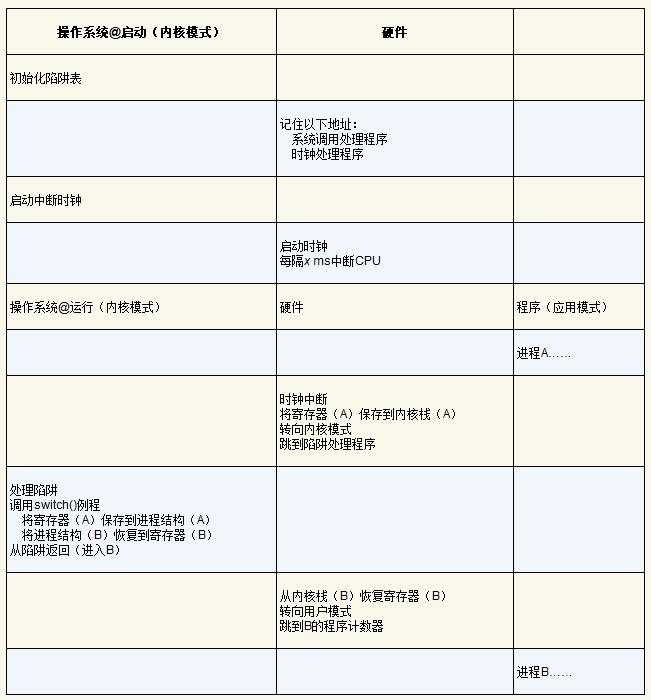

## 操作系统导论-总结

Date：2023/04/06

------

## 前言

### 第1章 关于本书的对话

### 第2章 操作系统介绍

* **虚拟化（virtualization）**
  * **关键问题：如何将资源虚拟化**
  * 定义：
    * 虚拟化 CPU，营造在单个 CPU 有多个 CPU 的假象
    * 虚拟化内存，营造每个进程拥有自己的私有虚拟地址空间的假象
  * 摘录：同时运行的程序（或一个程序的不同实例），看似都在访问自己的的私有虚拟地址空间，一个正在运行程序中的内存引用不会影响其他进程（或操作系统本身）的地址空间。但实际情况是，物理内存是由操作系统管理的共享资源。

* **并发（concurrency）**
  * **关键问题：如何构建正确的并发程序**
  * 定义：同时地（并发地）处理很多事情时出现且必须解决的一系列问题。
  * 摘录：奇怪的、不寻常的结果与指令如何执行有关，指令每次执行一条。举例的程序需要 3 条指令：一条将计数器的值从内存加载到寄存器，一条将其递增，另一条将其保存回内存。因为这 3 条指令并不是以原子方式（atomically）执行（所有的指令一次性执行）的，所以奇怪的事情可能会发生。
* **持久性（persistence）**
  * **关键问题：如何持久地存储数据**
  * 定义：系统内存设备以易失方式存储数值，鉴于数据对用户很重要，而管理持久的数据，需要有专门的软件负责，因此有了文件系统。
  * 摘录：文件系统必须做很多工作：首先确定新数据将驻留在磁盘上的哪个位置，然后在文件系统所维护的各种结构中对其进行记录。大多数文件系统首先会延迟这些写操作一段时间，希望将其批量分组为较大的组。为了处理写入期间系统崩溃的问题，大多数文件系统都包含某种复杂的写入协议，如日志（journaling）或写时复制（copy-on-write），仔细排序写入磁盘的操作，以确保如果在写入序列期间发生故障，系统可以在之后恢复到合理的状态。
* **操作系统**
  * **工作：**
    * 取得物理资源
    * 对物理资源进行虚拟化
    * 处理与并发有关的棘手问题
    * 持久化地存储文件
  * 目标：
    * 建立一些抽象（abstraction），让系统方便和易于使用
    * 提供高性能（performance），即最小化操作系统的开销（minimize the overhead），时间、空间
    * 在应用程序之间以及在 OS 和应用程序之间提供保护（protection），隔离（isolation）
    * 提供高度的可靠性（reliability）
    * 其他
      * 能源效率（energy-efficiency）
      * 安全性（security）
      * 移动性（mobility）
  * 摘录：用 C 这样的高级语言编写这样的程序不用考虑汇编，用汇编写代码不用考虑逻辑门，用逻辑门来构建处理器不用太多考虑晶体管。
* **OS 简史**
  * 早期操作系统：只是一些库
    * 概要：没有做太多事情，只是一组常用函数库，让 “OS” 提供这样的 API。
    * 批处理、操作员，无交互、过程调用（procedure call）
  * 超越库：保护
    * 概要：意识到代表操作系统运行的代码是特殊的，应用程序通过系统调用提权。
    * 系统调用、陷阱（trap）、陷阱处理程序（trap handler）、用户模式（user mode）、内核模式（kernel mode）、陷阱返回（return-from-trap）
  * 多道程序时代
    * 概要：操作系统不是一次只运行一项作业，而是将大量作业加载到内存中并在它们之间快速切换，从而提高CPU利用率。在中断存在的情况下，确保操作系统正常运行是一个很大的挑战。
    * 小型机（minicomputer）时代、多道程序（multiprogramming）、内存保护（memory protection）、并发（concurrency）、UNIX
    * 感悟：本地跑深度学习模型，带来的大量资源占用，导致等待期间如同回到那个年代，所以还是云计算更方便，或者搭专用机器跑模型。
  * 摩登时代
    * 概要：个人计算机普及，但 PC 的 OS 舍弃了内存保护，导致 OS 发展倒退，后来随着老功能的引入而逐渐进步。
    * 个人计算机（Personal Computer，PC）、Apple II（第一代 macOS）、IBM PC（DOS，倒退）、macOS X（进步）、Windows NT（进步）
* UNIX
  * 统一原则：构建小而强大的程序
  * 管道（pipe）、元（meta-level）编程、C 编译器、开放源码软件（open-source software）、发行版（Berkeley Systems Distribution，BSD）
  * 变体：Sun Microsystems 的 SunOS、IBM 的 AIX、HP 的 HPUX（又名H-Pucks）以及 SGI 的 IRIX
* Linux
  * 互联网时代、智能手机、NeXTStep
  * 摘要：该版本严重依赖最初系统背后的原则和思想，但没有借用原来的代码集，从而避免了合法性问题。
* **本书不讲**
  * 网络代码、图形设备、更深的安全问题
* **疑问**
  * 为什么说一个操作系统与具有不同硬件的电脑适配程度不同？
    * 因为 OS 的工作首先需要取得物理资源，取得资源的多少、取得资源的方式，又决定了后面的一系列处理工作
  * 如何衡量 OS 与硬件的适配程度？
  * 通常预装的系统是最适配的吗？那么升级之后呢？向下兼容？
* 提示/摘录
  * 文献引用的简要说明方式，指路讲得很好
  * 健全与完善自己知识的一个好方法，就是**尽可能多地听取其他观点**，然后在此问题上**扩展自己的观点和想法**
  * **“第二系统效应” 的误区**（过度设计、过度谨慎、过度自信，看到改进机会而不自觉地把项目复杂化，特别容易出现进度延误）
  * 阅读这些旧的系统文件，能看到在20世纪60年代后期技术发展的进程，这很有意思
  * 写自己的课程注解的好处是：你可以为自己的研究做广告
  * 我们**只关心**大多数程序所假设的简单模型：指令似乎按照有序和顺序的方式逐条执行。
  * 请注意我们如何利用& 符号同时运行 4 个进程
  * 事实证明，**随机化**可以很好地抵御某些安全漏洞。特别是如果你想学习如何通过堆栈粉碎黑客对计算机系统的攻击入侵。
  * Emacs，如果你用的不是真正的代码编辑器，那更糟糕。
  * 让你注意到不太适合文本主线的各种内容。我们甚至会用它们来开玩笑，为什么在这个过程中没有一点乐趣？
* 补充
  * 参考文献、书目延伸学习（大量）

2023/04/06 23:39:03

------

## 第1部分 虚拟化
### 第3章 关于虚拟化的对话

* 摘录
  * 重要的是，在这种假象中，每个人看起来都有一个物理桃子，但实际上不是。
  * 多数时间他们都在打盹或者做其他事情，所以，你可以在他们打盹的时候把他手中的桃子拿过来分给其他人，这样我们就创造了有许多虚拟桃子的假象，每人一个桃子！
  * 每个应用都以为自己在独占CPU，但实际上只有一个CPU。

------

### 第4章 抽象：进程

* **关键问题：如何提供有许多CPU的假象？**

* 概念

  * 虚拟化 CPU：通过让一个进程只运行一个时间片，然后切换到其他进程，操作系统提供了存在多个虚拟CPU的假象。
  * 时分共享（time sharing）、机制（mechanism）（Which）、上下文切换（context switch）、空分共享
  * 策略（policy）（How）：在操作系统内做出某种决定的算法
  * 调度策略（scheduling policy）：用历史信息、工作负载知识、性能指标进行决策

* **进程（process）**（操作系统的最基本抽象）

  * 机器状态（machine state）：程序在运行时可以读取或更新的内容（内存）
  * 寄存器：
    * 程序计数器（Program Counter，PC/IP）：描述程序正在执行哪个指令
    * 栈指针（stack pointer）、帧指针（frame pointer）：管理函数参数栈、局部变量、返回地址

  * 分离策略和机制 [L+75]、模块化（modularity）

* **进程 API**（所有现代操作系统都以某种形式提供这些API）

  * 创建（create）：命令、双击等，系统调用而运行指定程序
  * 销毁（destroy）：停止失控进程
  * 等待（wait）：等待进程停止运行
  * 其他控制（miscellaneous control）：暂停、恢复等
  * 状态（status）：获得有关进程的状态信息

* **进程创建**：更多细节（从程序到进程）

  * 运行任何程序之前，操作系统显然必须做一些工作，才能将重要的程序字节从磁盘读入内存（初始化任务）：将**代码和静态数据**加载到内存中，通过**创建和初始化栈**以及执行与 **I/O** 设置相关的其他工作，为程序执行搭好了舞台。最后，**启动程序**，在入口处运行，即 `main()` ，借由跳转到 `main()` 例程， OS 将 CPU 的**控制权转移**到新创建的进程中，从而程序开始执行。

    

  * 概念

    * 尽早（eagerly）、惰性（lazily）（理解需基于后续的分页和交换机制）
    * 运行时栈（run-time stack 或 stack）：OS 用参数初始化栈，即将参数填入 `main()` 函数，即 `argc` 和 `argv` 数组
    * 堆（heap）：C 中，用于显式请求的动态分配数据（ `malloc(), free()`）
      * 使用：链表、散列表、树、其他有趣的数据结构
    * 默认每个进程都有3个打开的文件描述符（file descriptor）
      * 标准输入、输出、错误（输入/输出（I/O）任务）

* **进程状态**

  * 早期 OS [DV66，V+65]，进程在给定时间内，通常为下列 3 个状态之一：

    * 运行（running）：正在执行指令
    * 就绪（ready）：已准备好运行，但某原因 OS 选择暂不运行
    * 阻塞（blocked）：一个进程执行了某种操作，直到发生其他事件时才会准备运行（例如发起 I/O 操作，进程会被阻塞，直到 I/O 完成，进入就绪态）
    * 其他状态：
      * 初始（initial）状态：进程在创建时处于的状态
      * 最终（final）状态/僵尸状态：进程处于已退出但尚未清理的状态，很有用

  * 已经被调度（scheduled）、取消调度（descheduled）

    

  * 跟踪进程状态

  

  * 通过保持CPU繁忙来提高资源利用率；当I/O完成时，系统决定不切换回 Process0

* **数据结构：**OS 利用关键的数据结构来跟踪各种相关的信息

  * 进程列表（process list）、进程控制块（Process Control Block，PCB）
  * 上下文切换（context switch）：通过恢复相关寄存器（将它们的值放回实际的物理寄存器中），操作系统可以恢复运行该进程。

* 疑问
  * 时分、空分中的 “分” 是指什么？为什么这样翻译？
  * 当I/O完成时，系统决定不切换回 Process0，目前还不清楚这是不是一个很好的决定。你怎么看？
* 提示/感悟
  * 有了概念，继续讨论具体细节（结合机制和策略）
  * Nucleus、微内核（microkernel）、xv6、Hydra、Multics

* 2023/04/07 17:38:08

------

### 第5章 插叙：进程API

* **关键问题：如何创建并控制进程**
*   系统调用 `fork()` 
  * 进程描述符（process identifier，PID）、子进程（child）、父进程（parent）、确定的（deterministic）、不确定性（non-determinism）、调度程序（scheduler）、多线程程序（multi-threaded program）
  * 进程从 `fork()` 返回的值不同，这个差别非常重要，使得很容易编写代码处理两种不同的情况。父进程获得的返回值是新创建子进程的 PID，而子进程获得的返回值是 0
  * 由于 CPU 调度程序的影响，输出结果不稳定
*   系统调用 `wait()`  / 更完整的兄弟接口 `waitpid()` 
  * 等待子程序执行完毕，即延迟父进程的执行，输出结果变得确定
*   系统调用 `exec()` 
  * 创建进程 API 的一个重要部分（让子进程执行与父进程不同的程序）
  * 实现进程替换
  * 多种变体 `execl()`、`execle()`、`execlp()`、`execv()` 和 `execvp()` 
* 为什么这样设计 API
  * 分离的做法，给了 shell 在 fork 之后 exec 之前运行代码的机会，这些代码可以在运行新程序前改变环境。例如模拟 shell 的重定向操作、pipe 同理（无缝、串联）
  * 重要的是做对事（LAMPSON定律）、重定向（redirect）、标准输出（standard output）、RTFM——阅读man手册、`kill()` 、信号（signal）、`ps` 、`top` 、MenuMeters
* 疑问
  * 为什么是 exec 之前？

* 2023/04/09 17:57:18

------

### 第6章 机制：受限直接执行

* **关键问题：如何高效、可控地虚拟化 CPU**
  * 实现虚拟化：轮换、时分共享（time sharing）
  * 挑战
    * 第一个是**性能**：如何在不增加系统开销的情况下实现虚拟化？
    * 第二个是**控制权**：如何有效地运行进程，同时保留对CPU的控制？

* 基本技巧：受限直接执行（LDE 协议）
  * 受限的直接执行（limited direct execution）：使程序尽可能快地运行，直接放 CPU 上面。
  * **两个问题**
    * 第一个问题很简单：如果我们只运行一个程序，操作系统怎么能确保程序不做任何我们**不希望**它做的事，同时仍然高效地运行它？
    * 第二个问题：当我们运行一个进程时，操作系统如何让它**停**下来并**切换**到另一个进程，从而实现虚拟化CPU所需的时分共享？

* 问题1：受限制的操作
  * **关键问题：如何执行受限制的操作**
  * 提示：采用受保护的控制权转移
  * 陷入（trap）、从陷阱返回（return-from-trap）、**陷阱表（trap table）**、用户模式（user mode）（**受限的来源**）、内核模式（kernel mode）、内核栈（kernel stack）、特权（privileged）
  * 摘录/抛出问题
    * 执行陷阱时，硬件需要小心，因为它必须确保存储足够的调用者寄存器，以便在操作系统发出从陷阱返回指令时能够正确返回。
    * 为什么系统调用看起来像过程调用？原因很简单：它是一个过程调用，但隐藏在过程调用内部的是著名的陷阱指令。
    * 陷阱如何知道在OS内运行哪些代码？第一件事，就是告诉硬件在发生某些异常事件时要运行哪些代码（用 trap table 实现）。一旦硬件被通知，它就会记住这些处理程序的位置，直到下一次重新启动机器，并且硬件知道在发生系统调用和其他异常事件时要做什么（即跳转到哪段代码）。
    * 思考问题：如果可以设置自己的陷阱表，你可以对系统做些什么？你能接管机器吗？
    * LDE 协议的两个阶段
      * 第一个阶段（在系统引导时）
      * 第二个阶段（运行进程时）
* 问题2：在进程之间切换
  * **关键问题：如何重获CPU的控制权**
  * 控制权（regain control）、协作（cooperative）
  * **协作方式：**等待系统调用（显式的 `yield` 系统调用）
    * 理解：有点类似先假设程序都是良性的，若某个程序运行时间过长，则 OS 会改变对待它的策略，会被假定为定期放弃 CPU
    * 提示：处理应用程序的不当行为
    * 被动方式：等待系统调用或者某种非法操作发生
  * **非协作方式：**操作系统进行控制
    * **关键问题：如何在没有协作的情况下获得控制权**
    * 提示：利用时钟中断重新获得控制权（硬件功能）
    * 时钟中断（timer interrupt）、中断处理程序（interrupt handler）
  * **保存和恢复上下文**
    * 调度程序、上下文切换（通过切换栈实现不同进程的上下文切换）
    * 两种类型寄存器：保存/恢复
  * 受限直接执行协议（时钟中断）：

* 担心并发吗
  * 亚微秒级、内存密集型、内存带宽、禁止中断（disable interrupt）、加锁（locking）、并发访问、宝宝防护（baby proofing）
  * 提示：重新启动是有用的
  * 摘录
    * “呃……在系统调用期间发生时钟中断时会发生什么？” 或 “处理一个中断时发生另一个中断，会发生什么？这不会让内核难以处理吗？”
    * 上下文切换需要多长时间？甚至系统调用要多长时间？（lmbench [MS96]工具，现代亚微秒级）
    * LDE 协议的基本思路很简单：就让你想运行的程序在CPU上运行，但首先确保设置好硬件，以便在没有操作系统帮助的情况下限制进程可以执行的操作。
    * 但一个主要问题还没有答案：在特定时间，我们应该运行哪个进程？
    * 有些文章会让你在研读过程中不时看到一些令人惊叹、令人兴奋的想法。
  * 测量成本
    * 系统调用成本： `gettimeofday()` 、`rdtsc` 指令
    * 上下文切换成本：
      * 单CPU：lmbench 基准测试（反复测量，管道或 UNIX套接字等通信机制）
      * 多 CPU：`sched_setaffinity()` 

* 感悟/疑问
  * 利用时间线总结协议
  * 为什么是把寄存器保存到内核栈？寄存器相当于什么？
    * 因为寄存器代表了程序在底层运行的状态
    * 操作系统要做的就是为当前正在执行的进程保存一些寄存器的值（例如，到它的内核栈），并为即将执行的进程恢复一些寄存器的值（从它的内核栈）
  * 很多文字都是在描述过程，并不适合直接记忆，更好的办法是可视化（如列表分析）、动手做一遍，让理解的印象以另一种形式存在
  * 无论系统当前有多卡，任务管理器往往能优先打开，是否运用了时钟中断？
  * 搞清楚概念出现的原因，对于理解很重要
  * 在学习认知过程被卡住的时候，是否能运用类似操作系统重启解决无限循环的方式？
    * 重启的意义：让软件回到已知的状态，回收资源，容易自动化；
    * eg：大规模集群互联网服务，定期重启一些机器

* 2023/04/10 18:31:00

------

### 第7章 进程调度：介绍

------

### 第8章 调度：多级反馈队列
### 第9章 调度：比例份额
### 第10章 多处理器调度（高级）
### 第11章 关于CPU虚拟化的总结对话
### 第12章 关于内存虚拟化的对话
### 第13章 抽象：地址空间
### 第14章 插叙：内存操作API
### 第15章 机制：地址转换
### 第16章 分段
### 第17章 空闲空间管理
### 第18章 分页：介绍
### 第19章 分页：快速地址转换（TLB）
### 第20章 分页：较小的表
### 第21章 超越物理内存：机制
### 第22章 超越物理内存：策略
### 第23章 VAX/VMS虚拟内存系统
### 第24章 内存虚拟化总结对话

------

## 第2部分 并发
### 第25章 关于并发的对话
### 第26章 并发：介绍
### 第27章 插叙：线程API
### 第28章 锁
### 第29章 基于锁的并发数据结构
### 第30章 条件变量
### 第31章 信号量
### 第32章 常见并发问题
### 第33章 基于事件的并发（进阶）
### 第34章 并发的总结对话

------

## 第3部分 持久性
### 第35章 关于持久性的对话
### 第36章 I/O设备
### 第37章 磁盘驱动器
### 第38章 廉价冗余磁盘阵列（RAID）
### 第39章 插叙：文件和目录
### 第40章 文件系统实现
### 第41章 局部性和快速文件系统
### 第42章 崩溃一致性：FSCK和日志
### 第43章 日志结构文件系统
### 第44章 数据完整性和保护
### 第45章 关于持久的总结对话
### 第46章 关于分布式的对话
### 第47章 分布式系统
### 第48章 Sun的网络文件系统（NFS）
### 第49章 Andrew文件系统（AFS）
### 第50章 关于分布式的总结对话

------

## 附录

### 附录A 关于虚拟机监视器的对话
### 附录B 虚拟机监视器
### 附录C 关于监视器的对话
### 附录D 关于实验室的对话
### 附录E 实验室：指南
### 附录F 实验室：系统项目
### 附录G 实验室：xv6项目