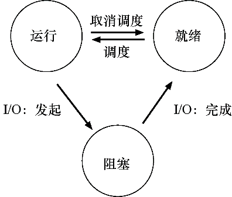

### 01-1 虚拟化（CPU 虚拟化）

Date：2023/04/07

------

[TOC]

------

### 第3章 关于虚拟化的对话

* 摘录
  * 重要的是，在这种假象中，每个人看起来都有一个物理桃子，但实际上不是。
  * 多数时间他们都在打盹或者做其他事情，所以，你可以在他们打盹的时候把他手中的桃子拿过来分给其他人，这样我们就创造了有许多虚拟桃子的假象，每人一个桃子！
  * 每个应用都以为自己在独占CPU，但实际上只有一个CPU。

------

### 第4章 抽象：进程

* **关键问题：如何提供有许多CPU的假象？**

* 概念

  * 虚拟化 CPU：通过让一个进程只运行一个时间片，然后切换到其他进程，操作系统提供了存在多个虚拟CPU的假象。
  * 时分共享（time sharing）、机制（mechanism）（Which）、上下文切换（context switch）、空分共享
  * 策略（policy）（How）：在操作系统内做出某种决定的算法
  * 调度策略（scheduling policy）：用历史信息、工作负载知识、性能指标进行决策

* **进程（process）**（操作系统的最基本抽象）

  * 机器状态（machine state）：程序在运行时可以读取或更新的内容（内存）
  * 寄存器：
    * 程序计数器（Program Counter，PC/IP）：描述程序正在执行哪个指令
    * 栈指针（stack pointer）、帧指针（frame pointer）：管理函数参数栈、局部变量、返回地址

  * 分离策略和机制 [L+75]、模块化（modularity）

* **进程 API**（所有现代操作系统都以某种形式提供这些API）

  * 创建（create）：命令、双击等，系统调用而运行指定程序
  * 销毁（destroy）：停止失控进程
  * 等待（wait）：等待进程停止运行
  * 其他控制（miscellaneous control）：暂停、恢复等
  * 状态（status）：获得有关进程的状态信息

* **进程创建**：更多细节（从程序到进程）

  * 运行任何程序之前，操作系统显然必须做一些工作，才能将重要的程序字节从磁盘读入内存（初始化任务）：将**代码和静态数据**加载到内存中，通过**创建和初始化栈**以及执行与 **I/O** 设置相关的其他工作，为程序执行搭好了舞台。最后，**启动程序**，在入口处运行，即 `main()` ，借由跳转到 `main()` 例程， OS 将 CPU 的**控制权转移**到新创建的进程中，从而程序开始执行。

    

  * 概念

    * 尽早（eagerly）、惰性（lazily）（理解需基于后续的分页和交换机制）
    * 运行时栈（run-time stack 或 stack）：OS 用参数初始化栈，即将参数填入 `main()` 函数，即 `argc` 和 `argv` 数组
    * 堆（heap）：C 中，用于显式请求的动态分配数据（ `malloc(), free()`）
      * 使用：链表、散列表、树、其他有趣的数据结构
    * 默认每个进程都有3个打开的文件描述符（file descriptor）
      * 标准输入、输出、错误（输入/输出（I/O）任务）

* **进程状态**

  * 早期 OS [DV66，V+65]，进程在给定时间内，通常为下列 3 个状态之一：

    * 运行（running）：正在执行指令
    * 就绪（ready）：已准备好运行，但某原因 OS 选择暂不运行
    * 阻塞（blocked）：一个进程执行了某种操作，直到发生其他事件时才会准备运行（例如发起 I/O 操作，进程会被阻塞，直到 I/O 完成，进入就绪态）
    * 其他状态：
      * 初始（initial）状态：进程在创建时处于的状态
      * 最终（final）状态/僵尸状态：进程处于已退出但尚未清理的状态，很有用

  * 已经被调度（scheduled）、取消调度（descheduled）

    

  * 跟踪进程状态

  

  * 通过保持CPU繁忙来提高资源利用率；当I/O完成时，系统决定不切换回 Process0

* **数据结构：**OS 利用关键的数据结构来跟踪各种相关的信息

  * 进程列表（process list）、进程控制块（Process Control Block，PCB）
  * 上下文切换（context switch）：通过恢复相关寄存器（将它们的值放回实际的物理寄存器中），操作系统可以恢复运行该进程。

* 疑问
  * 时分、空分中的 “分” 是指什么？为什么这样翻译？
  * 当I/O完成时，系统决定不切换回 Process0，目前还不清楚这是不是一个很好的决定。你怎么看？
* 提示/感悟
  * 有了概念，继续讨论具体细节（结合机制和策略）
  * Nucleus、微内核（microkernel）、xv6、Hydra、Multics

* 2023/04/07 17:38:08

------

### 第5章 插叙：进程API

* **关键问题：如何创建并控制进程**
* 系统调用 `fork()` 
  * 进程描述符（process identifier，PID）、子进程（child）、父进程（parent）、确定的（deterministic）、不确定性（non-determinism）、调度程序（scheduler）、多线程程序（multi-threaded program）
  * 进程从 `fork()` 返回的值不同，这个差别非常重要，使得很容易编写代码处理两种不同的情况。父进程获得的返回值是新创建子进程的 PID，而子进程获得的返回值是 0
  * 由于 CPU 调度程序的影响，输出结果不稳定
* 系统调用 `wait()`  / 更完整的兄弟接口 `waitpid()` 
  * 等待子程序执行完毕，即延迟父进程的执行，输出结果变得确定
* 系统调用 `exec()` 
  * 创建进程 API 的一个重要部分（让子进程执行与父进程不同的程序）
  * 实现进程替换
  * 多种变体 `execl()`、`execle()`、`execlp()`、`execv()` 和 `execvp()` 
* 为什么这样设计 API
  * 分离的做法，给了 shell 在 fork 之后 exec 之前运行代码的机会，这些代码可以在运行新程序前改变环境。例如模拟 shell 的重定向操作、pipe 同理（无缝、串联）
  * 重要的是做对事（LAMPSON定律）、重定向（redirect）、标准输出（standard output）、RTFM——阅读man手册、`kill()` 、信号（signal）、`ps` 、`top` 、MenuMeters
* 疑问
  * 为什么是 exec 之前？

* 2023/04/09 17:57:18

------

### 第6章 机制：受限直接执行

* **关键问题：如何高效、可控地虚拟化 CPU**
  * 实现虚拟化：轮换、时分共享（time sharing）
  * 挑战
    * 第一个是**性能**：如何在不增加系统开销的情况下实现虚拟化？
    * 第二个是**控制权**：如何有效地运行进程，同时保留对CPU的控制？

* 基本技巧：受限直接执行（LDE 协议）
  * 受限的直接执行（limited direct execution）：使程序尽可能快地运行，直接放 CPU 上面。
  * **两个问题**
    * 第一个问题很简单：如果我们只运行一个程序，操作系统怎么能确保程序不做任何我们**不希望**它做的事，同时仍然高效地运行它？
    * 第二个问题：当我们运行一个进程时，操作系统如何让它**停**下来并**切换**到另一个进程，从而实现虚拟化CPU所需的时分共享？

* 问题1：受限制的操作
  * **关键问题：如何执行受限制的操作**
  * 提示：采用受保护的控制权转移
  * 陷入（trap）、从陷阱返回（return-from-trap）、**陷阱表（trap table）**、用户模式（user mode）（**受限的来源**）、内核模式（kernel mode）、内核栈（kernel stack）、特权（privileged）
  * 摘录/抛出问题
    * 执行陷阱时，硬件需要小心，因为它必须确保存储足够的调用者寄存器，以便在操作系统发出从陷阱返回指令时能够正确返回。
    * 为什么系统调用看起来像过程调用？原因很简单：它是一个过程调用，但隐藏在过程调用内部的是著名的陷阱指令。
    * 陷阱如何知道在OS内运行哪些代码？第一件事，就是告诉硬件在发生某些异常事件时要运行哪些代码（用 trap table 实现）。一旦硬件被通知，它就会记住这些处理程序的位置，直到下一次重新启动机器，并且硬件知道在发生系统调用和其他异常事件时要做什么（即跳转到哪段代码）。
    * 思考问题：如果可以设置自己的陷阱表，你可以对系统做些什么？你能接管机器吗？
    * LDE 协议的两个阶段
      * 第一个阶段（在系统引导时）
      * 第二个阶段（运行进程时）
* 问题2：在进程之间切换
  * **关键问题：如何重获CPU的控制权**
  * 控制权（regain control）、协作（cooperative）
  * **协作方式：**等待系统调用（显式的 `yield` 系统调用）
    * 理解：有点类似先假设程序都是良性的，若某个程序运行时间过长，则 OS 会改变对待它的策略，会被假定为定期放弃 CPU（指定优先情绪）
    * 提示：处理应用程序的不当行为
    * 被动方式：等待系统调用或者某种非法操作发生
  * **非协作方式：**操作系统进行控制
    * **关键问题：如何在没有协作的情况下获得控制权**
    * 提示：利用时钟中断重新获得控制权（硬件功能）
    * 时钟中断（timer interrupt）、中断处理程序（interrupt handler）
  * **保存和恢复上下文**
    * 调度程序、上下文切换（通过切换栈实现不同进程的上下文切换）
    * 两种类型寄存器：保存/恢复
  * 受限直接执行协议（时钟中断）：

* 担心并发吗
  * 亚微秒级、内存密集型、内存带宽、禁止中断（disable interrupt）、加锁（locking）、并发访问、宝宝防护（baby proofing）
  * 提示：重新启动是有用的
  * 摘录
    * “呃……在系统调用期间发生时钟中断时会发生什么？” 或 “处理一个中断时发生另一个中断，会发生什么？这不会让内核难以处理吗？”
    * 上下文切换需要多长时间？甚至系统调用要多长时间？（lmbench [MS96]工具，现代亚微秒级）
    * LDE 协议的基本思路很简单：就让你想运行的程序在CPU上运行，但首先确保设置好硬件，以便在没有操作系统帮助的情况下限制进程可以执行的操作。
    * 但一个主要问题还没有答案：在特定时间，我们应该运行哪个进程？
    * 有些文章会让你在研读过程中不时看到一些令人惊叹、令人兴奋的想法。
  * 测量成本
    * 系统调用成本： `gettimeofday()` 、`rdtsc` 指令
    * 上下文切换成本：
      * 单CPU：lmbench 基准测试（反复测量，管道或 UNIX套接字等通信机制）
      * 多 CPU：`sched_setaffinity()` 

* 感悟/疑问
  * 利用时间线总结协议
  * 为什么是把寄存器保存到内核栈？寄存器相当于什么？
    * 因为寄存器代表了程序在底层运行的状态
    * 操作系统要做的就是为当前正在执行的进程保存一些寄存器的值（例如，到它的内核栈），并为即将执行的进程恢复一些寄存器的值（从它的内核栈）
  * 很多文字都是在描述过程，并不适合直接记忆，更好的办法是可视化（如列表分析）、动手做一遍，让理解的印象以另一种形式存在
  * 无论系统当前有多卡，任务管理器往往能优先打开，是否运用了时钟中断？
  * 搞清楚概念出现的原因，对于理解很重要
  * 在学习认知过程被卡住的时候，是否能运用类似操作系统重启解决无限循环的方式？
    * 重启的意义：让软件回到已知的状态，回收资源，容易自动化；
    * eg：大规模集群互联网服务，定期重启一些机器

* 2023/04/10 18:31:00

------

### 第7章 进程调度：介绍

* **关键问题：如何开发调度策略**

* 概念

  * 机制（mechanism）、调度策略（sheduling policy / discipline）、工作负载（workload）

* 工作负载假设（从理想假设开始，逐步**放宽假设**）

  * **理想假设**
    * 1．每一个工作运行相同的时间；
    * 2．所有的工作同时到达；
    * 3．一旦开始，每个工作保持运行直到完成；
    * 4．所有的工作只是用CPU（即它们不执行IO操作）；
    * 5．每个工作的运行时间是已知的。
  * 一个完全可操作的调度准则（a fully-operational scheduling discipline）
  * 必须记得**工作负载**：既有运行时间很短、频繁放弃CPU的交互型工作，也有需要很多CPU时间、响应时间却不重要的长时间计算密集型工作。

* 调度指标

  * 用以比较不同的调度策略
  * **周转时间（turnaround time）**、性能（performance）、公平（fairness）

* 先进先出（FIFO）

  * 先进先出（First In First Out或FIFO）调度 / 先到先服务（First Come First Served 或FCFS）、平均周转时间（average turnaround time）、护航效应（convoy effect）、SJF 原则（最短任务优先，当平均客户周转时间很重要）
  * 放宽假设1

* 最短任务优先（Shortest Job First，SJF）（非抢占式）

  * 最优（optimal）、非抢占式（non-preemptive）、抢占式（preemptive）
  * 放宽假设2

* 最短完成时间优先（Shortest Time-to-Completion First，STCF）

  * 抢占（preempt）、抢占式最短作业优先（Preemptive Shortest Job First ，PSJF）
  * 摘录
    * STCF 或 PSJF 每当新工作进入系统时，它就会确定剩余工作和新工作中，谁的剩余时间最少，然后调度该工作。
  * 放宽假设3

* 新度量指标：**响应时间（response time）**

  * STCF和相关方法在响应时间上并不是很好。例如，如果3个工作同时到达，第三个工作必须等待前两个工作全部运行后才能运行。这种方法虽然有很好的周转时间，但对于响应时间和交互性是相当糟糕的。因此有了 RR 算法。

* **轮转（Round-Robin，RR）**

  * 基本思想：RR在一个时间片（time slice，有时称为调度量子，scheduling quantum）内运行一个工作，然后切换到运行队列中的下一个任务，而不是运行一个任务直到结束。它反复执行，直到所有任务完成。因此，RR有时被称为时间切片（time-slicing）。即每个程序都运行一会儿，切换。
  * 时间片太短的问题：突然上下文切换的成本将影响整体性能。
    * 提示：摊销可以减少成本
    * 提示：重叠可以提高利用率
  * 摊销（amortize）、摊销技术（amortization）、重叠（overlap）
  * 摘录
    * 上下文切换的成本
      * 保存和恢复少量寄存器的 OS 操作
      * 程序运行时，它们在 CPU 高速缓存、TLB、分支预测器和其他片上硬件中建立了大量的状态，切换会导致状态刷新
    * 事实上，这是固有的权衡：如果你愿意不公平，你可以运行较短的工作直到完成，但是要以响应时间为代价。如果你重视公平性，则响应时间会较短，但会以周转时间为代价。这种权衡在系统中很常见。你不能既拥有你的蛋糕，又吃它。

* 结合I/O

  * 摘录

    * 一个进程在等待另一个进程的I/O完成时使用CPU，系统因此得到更好的利用

      

    * 仍未解决操作系统根本无法看到未来的问题

  * 放宽假设4，CPU密集型、重叠

* 无法预知

  * 放宽假设5：操作系统通常对每个作业的长度知之甚少

* 感悟

  * 从理想假设到放宽假设，以引导思考、实验探索
  * 可证明最优，如何证明？需要什么前置知识？
  * 如何理解时间片长度增加后，切换时间的占比下降，所带来的成本减少？
    * 类似网购一定金额，包邮

* 2023/04/10 20:40:54 1h21min

------

### 第8章 调度：多级反馈队列

* **关键问题：没有完备的知识如何调度？**
  * 提示：从历史中学习
* 概念
  * 多级反馈队列（Multi-level Feedback Queue，MLFQ）、兼容时分共享系统（CTSS）、先验（priori）

* MLFQ：基本规则（关键：如何设置优先级；根据观察的行为调整，历史预测）

  * 队列（queue）、优先级（priority level）、交互型进程、静态快照、计算密集型进程、竞争CPU
  * 基本规则
    * 规则1：如果A的优先级 > B的优先级，运行A（不运行B）。
    * 规则2：如果A的优先级 = B的优先级，轮转运行A和B。

* **尝试1：如何改变优先级**

  * 第一次尝试优先级调整算法
    * 规则3：工作进入系统时，放在最高优先级（最上层队列）。
    * 规则4a：工作用完整个时间片后，降低其优先级（移入下一个队列）。
    * 规则4b：如果工作在其时间片以内主动释放CPU，则优先级不变。
  * 实例
    * 实例1：单个长工作
    * 实例2：来了一个短工作（若不知，则假设为短，否则慢慢移入低优先级）
    * 实例3：如果有I/O呢
  * 当前MLFQ的一些问题
    * 饥饿（starvation）、愚弄调度程序（game the scheduler）、攻击、程序状态的不确定性

* **尝试2：提升优先级**

  * 规则5：经过一段时间S，就将系统中所有工作重新加入最高优先级队列。

  * 提升（boost）、“巫毒常量（voo-doo constant）”（S 的设置，需要黑魔法）

  * 摘录

    * 因此至少保证长工作会有一些进展，每过50ms就被提升到最高优先级，从而定期获得执行。

* **尝试3：更好的计时方式**（如何阻止调度程序被愚弄？）
  * （重写）规则4：一旦工作用完了其在某一层中的时间配额（无论中间主动放弃了多少次CPU），就降低其优先级（移入低一级队列）。
  * 计时方式（accounting）、各层时间配额（如同生命，有限的意义）

* **MLFQ调优及其他问题**
  * 摘录
    * 还有许多问题都没有显而易见的答案，因此只有利用对工作负载的经验，以及后续对调度程序的调优，才会导致令人满意的平衡。
    * 提示：避免巫毒常量（Ousterhout定律） 
    * 许多系统使用某种类型的MLFQ作为自己的基础调度程序，包括类 BSD UNIX 系统、Solaris 以及 Windows NT 和其后的 Window 系列操作系统。
  * Solaris 的 MLFQ 实现（时分调度类TS）、FreeBSD 调度程序（4.3版本）、使用量衰减（decay-usage）、建议（advice）、`nice` 工具、基础调度程序
  * 建议（advice）
    * 提供接口并允许用户或管理员给操作系统一些提示（hint）常常很有用；
    * 这种用户建议的方式在操作系统中的各个领域经常十分有用，包括调度程序（通过nice）、内存管理（madvise），以及文件系统（通知预取和缓存）。
* 感悟
  * 使用量衰减，是否类似权重衰减？
  * 内核黑客、首创想法的来源、调度技术发展状况
  * 没有完备的知识，如何解决问题？MLFQ 提供了一种思路
* 补充
  * “Inside Windows NT” https://learn.microsoft.com/en-us/sysinternals/resources/windows-internals

* 2023/04/10 22:14:18 1h36min

------

### 阶段小结

​		目前从 6 号开始，到如今 11 号（今日未开始），学了 5 天。

* 第一个感受是概念多、耦合强，每个概念工具的提出，都有很直接的问题背景，而它们的逐一出现，构成了一条很长的逻辑链；
* 第二个感受是文字承载的大多数属于过程信息，虽然作者有意运用图表展示算法和程序的运行顺序关系，但这些载体的表达能力还是相当有限；
* 第三个感受是开发环境、资源包的说明不足，作业的介绍有点奇葩，各章末的问题其实就是作业或者实践的尝试方向，但这种风格还不习惯，而且描述有点晦涩，到真正要基于给定的代码做实验时，还需要理清代码，何况资料是 python 文件，这就与书中提倡的开发环境有点不协调了；
* 第四个感受是书中的例子、讲述方式很生动，解释背景、分析问题、剖析原因、罗列文献等方式，非常值得揣摩学习；
* 第五个感受是代码实践弱，或许目前遇到的内容还够不多，强耦合的代码实践还未能开展。
* 得
  * 在阅读的时候，会想起以前刚接触 Linux 系统编程的场景，目前懂得了系统调用存在的意义，以及一些基本的系统调用方法；对于进程的概念和调度过程也更加清晰了；在重新部署本地虚拟机环境的时候，看到了一些操作系统当中的术语，例如任务管理器-性能-虚拟化，就知道虚拟化启用的目的是帮助 CPU 更好地利用物理资源。
  * 还有一些我看不到的……如何看到？
* 失
  * 机会成本，占用的时间挺多的，一章精读大约 1.5~2 小时；
  * 同时，还不能协调更多的重要任务，例如算法刷题、SQL等软件开发的技术栈；
  * 还有一些我看不到的……如何看到？
* 调整
  * 之前边读边标注，并且记录在笔记；现在尝试读完一章做一个回顾笔记；
  * 留意实践的机会，随时尝试想法，随时实践；
  * 过程信息必须动手或者经历一遍，才能转化为真实的经验，否则只是机械记忆；
  * 交错笔记，有时候会扰乱思维的整体感，但又有助于在长文期间记录目前学到的东西，且便于标注想法。

* 2023/04/11 21:30:16 40min

------

### 第9章 调度：比例份额

* **关键问题：如何按比例分配CPU**
* 概念
  * 比例份额（proportional-share）调度 / 公平份额（fair-share）调度、**彩票调度（lottery scheduling）**
* 基本概念：彩票数表示份额
  * 提示：利用**随机性**（优势）
    * 1、随机方法常常可以避免奇怪的边角情况
    * 2、随机方法很轻量，几乎不需要记录任何状态
    * 3、随机方法很快
  * 提示：用彩票来表示份额
  * 彩票数（ticket）、随机性（randomness）、LRU替换策略、彩票（步长）、份额、虚存管理、所有权比例
* 彩票机制
  * 彩票货币（ticket currency）（有部分自主性）、兑换全局彩票、彩票转让（ticket transfer）、彩票通胀（ticket inflation）（信任环境 VS 竞争环境）
* 实现
  * 随机数生成器 + 记录的列表（链表）
  * 若想更有效率，做递减排序
* 一个例子
  * 不公平指标 $U$（unfairness metric）
    * 完美的公平调度程序可以做到 $U = 1$ （前提：工作执行非常多的时间片）
  * 如何分配彩票？尽管自主分配是一种思路，但还没给出具体的分配策略
* 为什么不是确定的
  * **步长调度（stride scheduling）**、步长（stride）、行程（pass）值、彩票调度算法（不需要全局状态）、步长调度算法
  * 步长：用一个大数分别除以它们的票数，得到每个进程的步长（票数成反比）
  * 基本思路：当需要进行调度时，选择目前拥有**最小行程值的进程**，并且在运行之后将该进程的行程值增加一个步长。直到所有行程值相等，再次循环进行。
  * 摘录
    * 虽然两者都很有趣，但一些原因，并**没有作为 CPU 调度程序被广泛使用**。
      * 都不能很好地适合 I/O
      * 其中最难的票数分配问题并没有确定的解决方式
    * 两者通常用在：虚拟（virtualized）数据中心、Waldspurger（VMWare的ESX系统）

* 感悟
  * 如何把随机性的优点，用在学习上面？问问GPT
  * 很多地方都能看到随机性带来的增益，例如 timsort，有点像利用世界的固有属性来解决问题，让问题回归系统
  * 如何理解行程值在过程中相等？意味着行程值之间存在最小公倍数
  * 句式：既然有了……，为什么还有……呢？用来分析新旧工具的存在意义与优势

* 2023/04/11 22:38:24 1h8min

------

### 第10章 多处理器调度（高级）

* 建议不按顺序学习这些高级章节。对于本章，建议在学习完第2部分之后学习。

------

### 第11章 关于CPU虚拟化的总结对话

* 摘录
  * 了解了操作系统如何虚拟化 CPU，同时又必须了解一些重要的机制：陷阱和陷阱处理程序，时钟中断以及操作系统和硬件在进程间切换时如何谨慎地保存和恢复状态。
  * 要想学的更多
    * 没有其他办法可以替代**动手**，做**课堂项目**是必须的。
  * 操作系统的哲学？
    * 它希望确保控制机器，希望程序能够尽可能高效地运行，也希望能够对错误或恶意的程序说“啊！别那么快，我的朋友”。
    * 如同偏执狂全天控制，因此也称为资源管理器。
  * 机制之上的策略呢？
    * 学到的经验，明显的也可以是很好的。比如将短工作提升到队列前面的想法。
    * 你可以建立一个聪明的调度程序，试图既像SJF又像RR——MLFQ相当漂亮。参阅CFS、BFS和O（1）调度程序之间的Linux战斗。
    * 度量指标也不一致，也许目标不是找到最好的解决方案，而是为了避免灾难。
    * 实用主义者意识到并非所有问题都有简洁明了的解决方案，而是要找到满意的方案。
    * 操控调度程序，会有许多有趣的事情发生。
  * 让我们对某件事感到兴奋，这样我们就会自己对它进行研究。
* **合上书，我还记得多少？**
  * 待复盘

2023/04/11 23:51:01

------

