### 01-2 虚拟化（内存虚拟化）

Date：2023/04/12

------


[TOC]


------


### 第12章 关于内存虚拟化的对话

* 摘录
  * 学生就应该问问题，对吧？实际上教授们的意思：提出问题，仅当它们是**好问题**，而且你实际上已经对这些问题**进行了一些思考**。
  * 虚拟内存很复杂，需要我们理解关于硬件和操作系统**交互方式**的更多复杂细节。
  * 有很多细节，你必须牢记它们，才能真正对发生的事情建立一个思维模型。将从简单的开始，如基址/界限，慢慢增加复杂性以应对新的挑战，如TLB和多级页表。最终，我们将能够描述一个全功能的现代虚拟内存管理程序的工作原理。（学习策略 + 最终目的）
  * 虚拟地址（every address generated by a user program is a virtual address）（对于用户程序）、易于使用（ease of use）、地址空间（address space）、隔离（isolation）、保护（protection）


2023/04/12 18:57:45

------


### 第13章 抽象：地址空间

* 早期系统（几乎没有抽象）
* 多道程序和时分共享
  * 多道程序（multiprogramming）、有效利用率（utilization）、效率（efficiency）、分时系统的时代、交互性（interactivity）
* 地址空间
  * **关键问题：如何虚拟化内存**
    * 虚拟化内存：OS 在单一的物理内存上为多个运行的进程（所有进程共享内存）构建一个私有的、可能很大的地址空间的抽象？
    * 内存虚拟化的关键：出于某种原因，**必须确保不是加载到物理地址** 0，而是物理地址320KB（这是 A 载入内存的地址）
    * 提示：隔离原则
  * 地址空间是运行的程序看到的系统中的内存（易用的**物理内存抽象**，也是了解虚拟化内存的关键）
  * 一个进程的地址空间包含运行的程序的**所有内存状态**
    * 代码
    * 栈：保存当前的函数调用信息，分配空间给局部变量，传递参数和函数返回值
    * 堆：管理动态分配的、用户管理的内存
    * 其他东西（如，静态初始化的变量）
  * 抽象（abstract）、多个线程（threads）、虚拟化内存（virtualizing memory）、虚拟地址（virtual address）、微内核（microkernel）、内存隔离
  * **分析方法：**
    * 先把静态内容固定（静态代码），再考虑可能变化的区域（栈堆）
    * 它们只需要在相反的方向增长（因此未分配区域在栈堆之间，**多线程无效**）

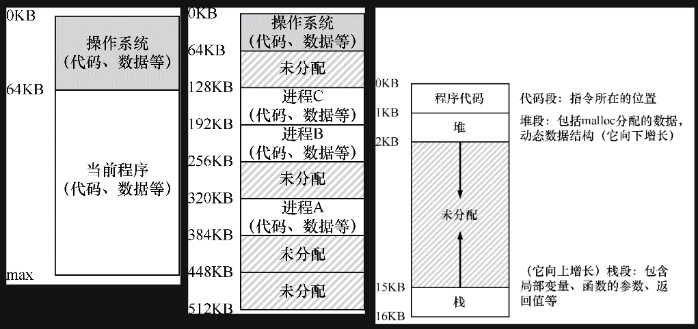

* 目标（为了实现操作系统的工作，需要目标的指导）
  * 透明（transparency）、效率（efficiency）、保护（protection）
  * **程序不应该感知到内存被虚拟化的事实**，时空效率，隔离保护
  * 补充：你看到的所有地址都不是真的（**打印均为虚拟地址，**只有 OS 和硬件知道物理地址）
  * 重要**子系统**：虚拟内存。
    * 虚拟内存系统负责为程序提供一个巨大的、稀疏的、私有的地址空间的假象，其中保存了程序的所有指令和数据。
    * OS 在专门硬件的帮助下，通过每一个虚拟内存的索引，将其转换为物理地址，物理内存根据获得的物理地址去获取所需的信息。


2023/04/12 20:44:49

------


### 第14章 插叙：内存操作API

* 关键问题：如何分配和管理内存

* 内存类型
  * **栈（stack）**内存（自动（automatic）内存，**隐式**）
    * 若希望某些信息存在于函数调用之外，建议不要将它们放在栈上
  * **堆（heap）**内存（于是有了 heap，满足对长期内存的需求，**显式**）
    * 显式+变化用法，堆内存对用户和系统提出了更大的挑战
  
* `malloc()` 调用（库调用）
  
  * 不直接传入 `size_t` 类型参数（数值），而是使用各种函数和宏（如 int 乘法）
  * `double *d = (double *) malloc(10 * sizeof(double));` 
  * `sizeof()` 返回的注意事项（默认返回类型指针大小，除非使用初始化数组）
  * 字符串声明 `malloc(strlen(s) + 1)` （+1 为字符串结束符预留）
  * 强制类型转换（cast）（实际没有做什么）
  
* `free()` 调用（库调用）
  
  * 分配内存是等式的简单部分，知道**何时、如何**以及**是否释放内存**是困难的部分
  * 介绍一个由 `malloc()` 返回的指针（参数）
  
* **常见错误**
  
  * 概念
    
    * 自动内存管理（automatic memory management）、垃圾收集器（garbage collector）、滥用内存
    
  * 忘记分配内存
  
    * 段错误（segmentation fault）
  
    * 提示：它编译过了或它运行了!=它对了（或 `strdup()` ）
  
      ```C
      char *src = "hello";
      char *dst = (char *) malloc(strlen(src) + 1);
      strcpy(dst, src); // work properly
      ```
  
  * 没有分配足够的内存（“几乎” 足够是不够的，许多系统漏洞的来源）
  
    * 缓冲区溢出（buffer overflow）
    * 经验：即使它正确运行过一次，也不意味着它是正确的。
  
  * 忘记初始化分配的内存
  
    * 未初始化的读取（uninitialized read）：可能会在堆中读到乱七八糟的数据，不排除读到随机和有害的东西。
  
  * 忘记释放内存
  
    * 内存泄露（memory leak）：尤其注意在**长时间**运行的应用程序或系统中
    * 习惯：释放显式分配的每个字节
  
  * 在用完之前释放内存
  
    * 悬挂指针（dangling pointer）：提前，导致重新利用了错误释放的内存。
  
  * 重复释放内存
  
    * 重复释放（double free）：未定义。
  
  * 错误地调用 `free()` 
  
    * 无效的释放（invalid free）：传入了非 `malloc()` 申请的指针/值
    * 补充：为什么在你的进程退出时没有内存泄露（**短时间**运行的程序）
      * 没有任何内存会丢失，原因：系统中实际存在两级内存管理
        * 第一级是由操作系统执行的内存管理
        * 第二级管理在每个进程中
      * purify、valgrind 内存定位工具
  
* 底层操作系统支持

  *  `brk` 、分断（break）位置（即堆结束的位置）、`sbrk` 、`mmap()` 、匿名（anonymous）内存区域、交换空间（swap space）
  * 不应该直接调用 `brk` 或 `sbrk`，它们被内存分配库使用。建议坚持使用 `malloc()` 和 `free()` 。

* 其他调用

  * `calloc()` （置零）、`realloc()` （更大，赋值）

* 疑问

  * 内存泄漏与 temp 重启系统未清理是否有关？
  * “Advanced Programming in the UNIX Environment”W. Richard Stevens and Stephen A. Rago Addison-Wesley, 2005 这本书建议读很多遍


2023/04/12 23:11:53，2023/04/14 17:29:31

------


### 第15章 机制：地址转换

* 关键问题：如何高效、灵活地虚拟化内存
* 概念
  * 介入（interposing）、TLB、页表、**基于硬件**的地址转换（hardware-based address translation）/ **地址转换（address translation）**、虚拟（virtual）地址、物理（physical）地址、管理内存（manage memory）
* 假设
  * 假设1：用户的地址空间必须**连续**地放在物理内存中
  * 假设2：用户的地址空间**小于**物理内存的大小
  * 假设3：**每个**地址空间的大小完全一样
* 一个例子
  * x86汇编（ `movl`、`addl`、长字移动）、一般化的介入技术、介入（Interposition）、透明（transparency）、地址空间（address space）
  * 地址空间的相对性
    * 从程序的角度，地址空间是从 0 开始到某个位置结束，它包含的所有内存引用都应当在这个范围内；
    * 从虚拟内存的角度，操作系统希望将这个进程地址空间放在物理内存的其他位置，不一定从 0 开始
  * 进程的地址空间放入物理内存示意
    * base 寄存器设为 32KB 对应的值
    * 进程所有内存引用被处理器如下转换为物理地址：
      *  `physical address = virtual address + base` 

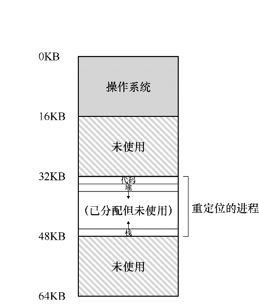

* 动态（基于硬件）重定位
  * 基址加界限机制（base and bound）/ 动态重定位（dynamic relocation）、限制寄存器（基址（base）寄存器、界限（bound）寄存器）、虚拟内存机制
  * 补充：基于软件的重定位
    * 静态重定位（static relocation）、加载程序（loader）（早期使用）
      * 不提供访问保护，通常需硬件支持来实现真正的访问保护
      * 一旦完成，稍后很难将内存空间重定位到其他位置
    * 地址转换（address translation）
  * 提示：基于硬件的动态重定位
    * **动态重定位**
      * 在运行时发生，而且甚至可以在进程开始运行后改变其地址空间
    * 界限寄存器两种使用方式（逻辑等价）
      * 1）记录地址空间的大小，供硬件对地址转换求和之前检查
      * 2）记录地址空间结束的物理地址，供硬件对地址转换求和之后检查
  * 转换示例（方式 1 示例）
    * 基址加虚拟地址（偏移量）
    * 补充：数据结构——空闲列表（free list，记录未用的空闲内存）
* 硬件支持：总结（动态重定位：硬件要求）
  * 特权模式（privileged mode，或内核模式，kernel mode）、用户模式（user mode）、处理器状态字（processor status word）、基址和界限寄存器（base and bounds register）、异常（exception）、异常处理程序（exception handler）


* 操作系统的问题
  * 动态重定位：操作系统的职责
    * 在进程创建时（为进程的地址空间找到内存空间）
    * 在进程终止时（回收进程的所有内存）
    * 在上下文切换时（保存和恢复基础和界限寄存器）
      * 进程结构（process structure）、进程控制块（Process Control Block，PCB）
    * 提供异常处理程序（exception handler），或要一些调用的函数


* 感悟/疑问
  * 指令的内存大小是多少？
  * 底层指令与数据均由二进制表示，两者混合存储，那么是如何区分两者的边界？
    * 示例 128 movl、132 addl、135 movl
  * 进程的地址空间放入物理内存后，16KB~64KB 这个值是如何给定的？
    * 由**限制寄存器**实现的：
      * 在编写、编译程序时假设地址空间从 0 开始，而当程序真正执行，操作系统会决定其在物理内存中的实际加载地址
      * 基址寄存器：记录起始地址
      * 界限寄存器：确保地址在进程地址空间的范围内
    * 这种基址寄存器配合界限寄存器的硬件结构是芯片中的（每个CPU一对），即通常说的**内存管理单元（Memory Management Unit，MMU）** 
  * 地址转换**完全由硬件处理**，没有 OS 介入；但效率较低
    * 内部碎片（internal fragmentation）
  * 说白了，这些工程问题都是资源利用率的问题，每当解决一个问题，就会继续思考可否优化，那将进入更深一层的认知
  * MS-DOS重定位加载器、Stretch（7030）计算机系统、硬件解释描述符、系统调用支持、编译器支持限定、分离内存引用的软件技术


2023/04/26 21:14:44

------


### 第16章 分段

* 关键问题：怎样支持大地址空间
  * 资源浪费：栈和堆之间，有一大块 “空闲” 空间
* 分段：泛化的基址/界限
  * 分段（segmentation）、逻辑段（segment）、段寄存器、未使用的地址空间 / 稀疏地址空间（sparse address spaces）、段异常（segmentation violation）/ 段错误（segmentation fault）
  * 摘录
    * 给地址空间内的每个逻辑段一个基址和界限寄存器对。
    * 一个段只是地址空间里的一个**连续定长**的区域，在典型的地址空间里有 3 个逻辑不同的段：**代码、栈和堆**。
    * 段错误指的是在支持分段的机器上发生了非法的内存访问（术语保留）

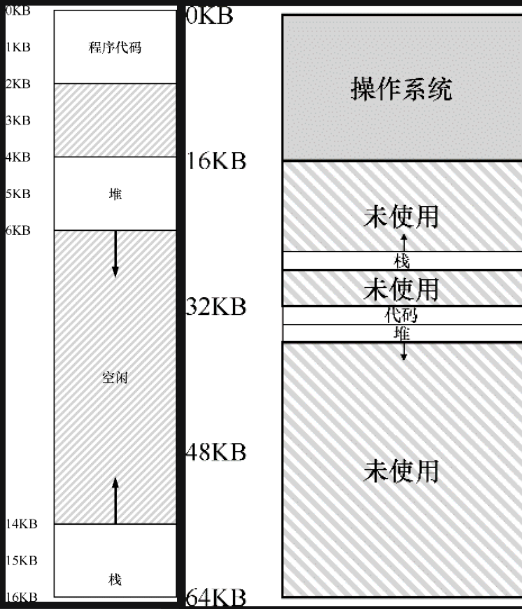

* 我们引用哪个段
  * 段寄存器（硬件使用，在地址转换时）
    * 显式（explicit）：用虚拟地址的**头几位标识**不同段
      * 硬件用**前两位**来决定使用哪个段寄存器，然后用后 12 位作为段内偏移。偏移量与基址寄存器相加，硬件就得到了最终的物理地址。（实际只有3个段，两位可表示4个段，因此浪费了一个段地址空间，有些系统将堆和栈当作同一个段，可只用一位来标识）
    * 隐式（implicit）：硬件通过**地址产生的方式**来确定段
      * 如果地址由程序计数器产生（即它是指令获取），那么地址在代码段。
      * 如果基于栈或基址指针，它一定在栈段。
      * 其他地址则在堆段。
  * VAX/VMS系统、段内偏移

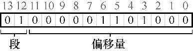

* 栈怎么办
  * 支持反向增长（硬件）、段的增长方向


* 支持共享
  * 共享（share）内存段、保护位（protection bit）
  * 通过额外的硬件支持，每个段增加几位，其中包括只读位，实现了一个段可映射到多个虚拟地址空间；硬件算法也同步改变


* 细粒度与粗粒度的分段
  * 粗粒度（coarse-grained）分段：只有很少的几个段的系统（即代码、栈、堆）
  * 细粒度（fine-grained）分段：进一步硬件支持，段表（segment table）、Burroughs B5000、Multics
* 操作系统支持
  * 分段优点：
    * 大量节省物理内存（动态重定位、更好支持稀疏地址空间）
    * 适合硬件完成，地址转换开销极小
    * 支持代码共享
  * 新的问题
    * 操作系统在上下文切换时应该做什么？
    * 管理物理内存的空闲空间（不同进程不同段，段大小不再固定）
  * 外部碎片（external fragmentation）：物理内存充满了许多小洞
  * 紧凑（compact）物理内存：重新安排原有的段，避免了空闲空间总和足够，但单块空间不足的情况（但是，内存紧凑成本很高，因为拷贝段是内存密集型的，一般会占用大量的处理器时间）
  * 空闲列表管理算法
    * 最优匹配（best-fit）
    * 最坏匹配（worst-fit）
    * 首次匹配（first-fit）
    * 伙伴算法（buddy algorithm）（更复杂）
  * 摘录
    * 遗憾的是，无论算法多么精妙，都无法完全消除外部碎片，因此，好的算法只是试图减小它。
    * 提示：如果有一千个解决方案，就没有特别好的。
    * 首先，是我们上面讨论的外部碎片。由于段的大小不同，空闲内存被割裂成各种奇怪的大小，因此满足内存分配请求可能会很难。用户可以尝试采用聪明的算法[W+95]，或定期紧凑内存，**但问题很根本，难以避免**。
    * 第二个问题也许更重要，分段还是**不足以支持更一般化的**稀疏地址空间。
    * 关于如何构建系统的宝贵建议。一下子读完这篇文章很难，每次读几页，就像品一杯美酒，或把它当作一本参考手册。
    * 一个经典的内存管理系统，在设计上有很多常识。
    * 动态链接、分页、分段、碎片问题、内存分配程序
  * 外部碎片（external fragmentation）
* 疑问
  * 假设现在要引用虚拟地址100（在代码段中），MMU将基址值加上偏移量（100）得到实际的物理地址：100 + 32KB = 32868
    * 这里需要注意的是：单位 100 偏移值是相对于 “位（bit）” 而言，还是 “字节” 而言？32KB相当于多少字节？【已解决】
    * 32KB = 32 × 1024 b = 32768 b
    * b、B 大小写区分？
  * 首先应该**先减去堆的偏移量**，即该地址指的是这个段中的哪个字节。
    * **这里理解不清晰：为什么 “堆从虚拟地址 4K 开始” ？堆的基址与堆的虚拟地址有和关系？** 
    * 例如堆中的虚拟地址 4200，若用这个地址加上**堆的基址（34KB）**，得到物理地址 39016，是错的
    * **堆从虚拟地址 4K 开始**，则 4200 的偏移量实际为 4200 - 2096 = 104，于是，真正的物理地址为 34KB + 104 b = 34920 b
  * 这里的单位怪怪的，要不要保留 b ？是否在讨论地址的时候，并不需要单位？
  * 例子：假设要访问虚拟地址15KB，它应该映射到物理地址27KB。该虚拟地址的二进制形式是：11 1100 0000 0000（十六进制0x3C00）。硬件利用前两位（11）来指定段，但然后我们要处理偏移量3KB。为了得到正确的反向偏移，我们必须从3KB中减去最大的段地址：在这个例子中，段可以是4KB，因此正确的偏移量是3KB减去4KB，即−1KB。只要用这个反向偏移量（−1KB）加上基址（28KB），就得到了正确的物理地址27KB。用户可以进行界限检查，确保反向偏移量的绝对值小于段的大小。
    * 如何理解 “应该映射到物理地址 27KB”？
      * 前两位：11
      * 偏移量：1100 0000 0000 b = 2048 b + 1024 b = 3 * 1024 b = 3 KB
      * 反向偏移（由 11 确定，但具体是如何确定的？）
      * 从 3KB 中减去最大的段地址，4KB > 3KB，3KB - 4KB = -1KB
      * 反向偏移量（−1KB）+ 基地址（28KB）= 物理地址（27KB）


2023/04/28 21:42:24

------


### 第17章 空闲空间管理

* 关键问题：如何管理空闲空间

* 概念
  
  * 空闲空间管理（free-space management）、内存分配库、分段（segmentation）、外部碎片（external fragmentation）、用户级内存分配库、内部碎片（internal fragmentation）、分配程序
  
* 假设
  * 假定基本的接口就像 `malloc()` 和 `free()` 提供的那样
  * 假设我们主要关心的是外部碎片
  * 假设内存一旦被分配给客户，就不可以被重定位到其他位置
  * 假设分配程序所管理的是连续的一块字节区域（ `sbrk` 申请增加堆空间）
  
* 底层机制

  * （通用机制）
    
    * 首先，探讨空间**分割与合并**的基本知识；
    * 其次，看看如何快速并相对轻松地**追踪**已分配的空间；
    * 最后，讨论如何利用**空闲**区域的内部空间**维护**一个简单的列表，来**追踪**空闲和已分配的空间。
    
  * 分割与合并

    * 分割（splitting）：当申请空间小于空闲块的空间，通常执行分割操作，空闲列表基本不变。
    * 合并（coalescing）：如果仅仅 `free(10)`，整个堆只是被分割成了若干块，依然不满足较大的申请需求，因此需合并可用空间。（归还 + 相邻）

  * 追踪已分配空间的大小

    * 头块（header）、幻数（完整性检查）、正常性检查（ `assert(hptr->magic == 1234567)` ）

    * **实际释放**的是头块大小加上分配给用户的空间的大小（N + 头块）

    * `ptr` 指向申请的空间起始位置，而头块是在 `ptr` “前面” 的，因此借用 `ptr` 当前的指针位置，对 `hptr` 使用减法，“反向” 求得头块的位置，相当于有一个新的指针，指向了 `ptr` 的头块

    * ```c
      void free(void *ptr) {
          header_t *hptr = (void *)ptr - sizeof(header_t);
      }
      ```

    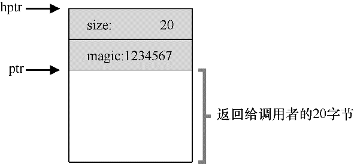

* 嵌入空闲列表
  
  * `mmap()` 、分割（split）、合并（coalesce）
  
* 让堆增长

  * 传统做法类似某种优化算法的思想，先小后大
  * `sbrk` 、空闲物理内存页

* 内存分配的基本策略
  * 最优匹配（best fit）/ 最小匹配
    * 遍历一次，返回最小的一块候选者
    * 性能代价。
  * 最差匹配（worst fit）
    * 遍历一次，返回最大候选，分割返还空闲列表
    * 过量碎片、很高开销
  * 首次匹配（first fit）
    * 避免遍历，返回第一个足够大的块
    * 速度优势。空闲列表开头很多小块，因此顺序重要（基于地址排序，address-based ordering）
  * 下次匹配（next fit）
    * 避免遍历，多维护一个指针，指向上一次查找结束的位置
    * 性能 ≈ first fit
  
* 其他方式
  * 分离空闲列表（segregated list）
    * 对频繁申请的，用独立列表管理，其余请求交由更通用的内存分配程序
    * 碎片不是问题，不需复杂列表查找，分配与释放速度快
    * 厚块分配程序（slab allocator）：对象缓存（object cache）、锁、文件系统 inode 、内存厚块（slab，页大小与对象大小的公倍数）、预初始化状态（避免了频繁的初始化与销毁）
  * 伙伴系统
    * 二分伙伴分配程序（binary buddy allocator）：空闲空间首先从**概念上**被看成大小为 $2^N$ 的大空间，基于请求将空闲空间**递归地**一分为二
    * 便于块释放，递归上溯，很容易确定某块的伙伴（一位差异，决定它们在伙伴树中的层次）
    * 但只允许分配 2 的整数次幂空闲块，因此有内部碎片麻烦
  * 其他想法
    * 上述所有方法：缺乏可扩展性（scaling），指查找列表可能很慢
    * 更复杂的数据结构来优化这个开销，**牺牲简单性来换取性能**：平衡二叉树、伸展树、偏序树
    * 多核系统、glibc malloc、jemalloc
    * 分配程序优化方向：工作负载、快速、空间高效、可扩展
  * 摘录
    * Jeff Bonwick。努力工作，你也可能成为这种 “以一当百” 的人。做不到的话，就和这样的人一起工作，你会明白什么是 “听君一席话，胜读十年书”。如果都做不到，那就太难过了。
  
* 疑问/感悟

  * 内部碎片：给一个大袋子，装一丁点东西

  * 幻数为什么可以完整性检查？以前在哪听到幻数这个概念？

  * 当中间 108 字节的块释放时，后面的已分配空间块是如何标识的？会不会受到 head 指向当前被释放的块而干扰？
  
    

2023/05/09 21:52:42 1h24min

------


### 第18章 分页：介绍

* 关键问题：如何通过页来实现虚拟内存

* 概念

  * 碎片化（fragmented）、将空间分割为不同长度的分片 vs 分页（将空间分割为固定长度的分片）、Atlas、页帧（page frame，物理内存定长槽块的阵列，每个页帧包含一个虚拟内存页）
  * 分页（paging）：将内存分割（划分）成固定大小的单元（页面），每个单元称为一页。

* 一个简单例子

  * 虚拟页、空闲页、页表（page table，每个进程维护一个，为地址空间的每个虚拟页面保存地址转换）、地址转换（address translation）、每个进程一个（per-process）、倒排页表（inverted page table，例外）
  * 优势
    * 最大的改进为**灵活性**：通过完善的分页方法，操作系统能够高效地提供地址空间的抽象，不管进程如何使用地址空间，支持稀疏虚拟地址空间
    * 分页提供的空闲空间管理的**简单性**
    * 不会导致外部碎片

  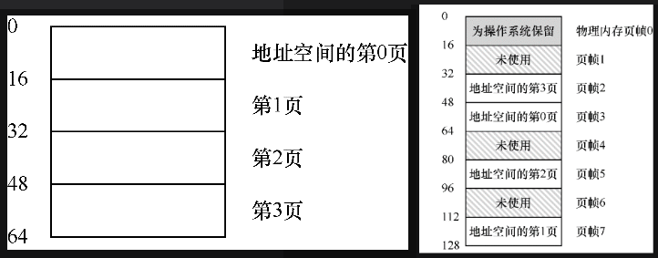

  * 数据显式加载、转换（translate）、虚拟页面号（virtual page number，VPN）、偏移量（offset）、物理帧号（PFN）（物理页号，physical page number 或 PPN）

  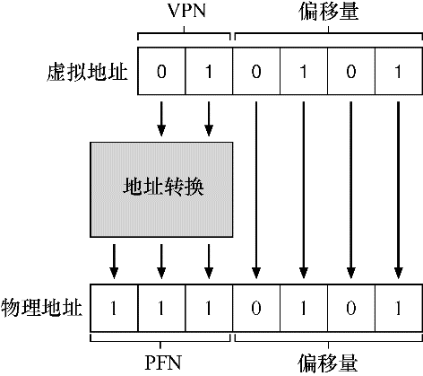

* 页表存在哪里

  * 页表格条目（PTE）

* 页表中究竟有什么

  * 线性页表（linear page table）、有效位（valid bit）、无效（invalid）、保护位（protection bit）
  * 存在位（present bit）、已被换出（swapped out）、交换（swap）
  * 脏位（dirty bit）
  * 参考位（reference bit / 访问位 accessed bit）、页面替换（page replacement）
  * x86 架构示例页表项
    * 存在位（P）、读 / 写位（R / W） 、用户 / 超级用户位（U / S）
    * （PWT、PCD、PAT 和 G）确定硬件缓存如何为这些页面工作
    * 访问位（A）、脏位（D）
    * 页帧号（PFN）

  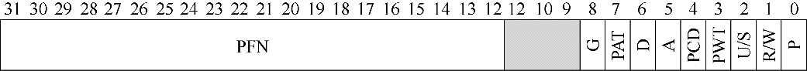

* 分页：也很慢

  * 页表基址寄存器（page-table base register）
  * 描述了在每个内存引用上发生的情况的初始协议。
  * 无论如何，分页都需要我们执行一个额外的内存引用，以便首先从页表中获取地址转换，因此开销很大（ `VPN`与 `PTEAddr` 的获取 ）

* 内存追踪

  * 页表存储虚拟—物理地址转换（virtual-to-physical address translation）、反汇编结果二进制文件（objdump / otool）

  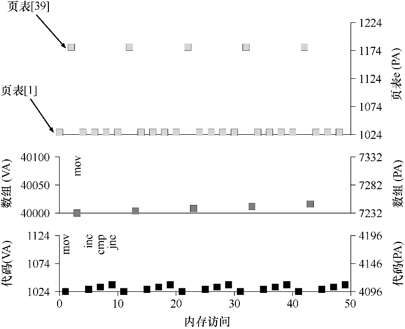

* 疑问

  * 如何理解 “例如，如果操作系统希望将 64 字节的小地址空间放到 8 页的物理地址空间中，它只要找到 4 个空闲页。” 当中，物理 “8页” 与空闲 “4 页” ？后者可以理解，但物理层面如同也是 16 字节一个页帧，怎么说成 8 页呢？
    * 答：“8 页” 指的是物理地址空间的总容量，4 空闲页则是内存请求。多读两遍就知道自己前面理解的方向错了。
  * 如何理解 “对于我们的简单示例，页表因此具有以下4个条目：（虚拟页0→物理帧3）、（VP 1→PF 7）、（VP 2→PF 5）和（VP 3→PF 2）” 后面的条目记号？
    * 答：表示虚拟到物理的映射关系（VPN→PFN）
  * 如何理解 “例如，想象一个典型的 32 位地址空间，带有 4KB 的页。这个虚拟地址分成 20 位的 VPN 和 12 位的偏移量（回想一下，1KB 的页面大小需要 10 位，只需增加两位即可达到 4KB）。” 中的 “1KB 页面需要 10 位” ？以及，如何理解 VPN 占用的位比偏移量更大？32 位地址空间，相当于一个 32 位的页表？
    * 答： 4KB 的页，需要 12 位的偏移量，即 $4KB = 2^{12}$ 的大小
    * 一个 20 位的VPN意味着，操作系统必须为每个进程管理 $2^{20}$ 个地址转换（大约一百万）
  * 如何理解 “一个 20 位的VPN意味着，操作系统必须为每个进程管理 $2^{20}$ 个地址转换（大约一百万）。假设每个页表格条目（PTE）需要 4 个字节，来保存物理地址转换和任何其他有用的东西，每个页表就需要巨大的 4MB 内存！” 中的 4MB ？
  * 如何理解 “例如，使用虚拟地址 21（010101），掩码将此值转换为 010000，移位将它变成 01，或虚拟页 1，正是我们期望的值。然后，我们使用该值作为页表基址寄存器指向的PTE数组的索引” 中的期望值？是由什么确定这个目标的？这个思想类似 hash，是否也会存在值冲突？
  * 关于跟踪程序的内存引用（确实复杂，而且理解不清晰）
    * 当它运行时，每个获取指令将产生两个内存引用：一个访问页表以查找指令所在的物理页帧，另一个访问指令本身将其提取到 CPU 进行处理。另外，在 mov 指令的形式中，有一个显式的内存引用，这会首先增加另一个页表访问（将数组虚拟地址转换为正确的物理地址），然后时数组访问本身。
    * 每个循环有 10 次内存访问，其中包括 4 次取指令，一次显式更新内存，以及 5 次页表访问，为这 4 次获取和一次显式更新进行地址转换。
    * 这只是最简单的例子（只有几行 C 代码），但你可能已经能够感觉到理解实际应用程序的实际内存行为的复杂性。别担心：它肯定会变得更糟，因为我们即将引入的机制只会使这个已经很复杂的机器更复杂。


2023/05/10 17:28:53-22:58:50，2023/05/11 17:04:34

------


### 第19章 分页：快速地址转换（TLB）

* 关键问题：如何加速地址转换
  
  * **地址转换旁路缓冲存储器（translation-lookaside buffer，TLB）**、硬件缓存（cache）：地址转换缓存（address-translation cache）
  
* TLB的基本算法【过程描述还没看懂】
  
  * 线性页表（linear page table）、硬件管理的TLB（hardware-managed TLB）
  
* 示例：访问数组

  * TLB命中率（hit rate）、空间局部性（spatial locality，即访问地址x可能很快访问临近x的内存）、时间局部性（temporal locality，即最近访问的可能很快再次访问）、缓存（最基本的性能改进技术之一）、指令和数据引用的局部性（locality）

* 谁来处理TLB未命中

  * 页表基址寄存器（page-table base register，PTBR）、多级页表（multi-level page table、软件管理TLB（software- managed TLB）、没有映射过（unmapped）、陷阱处理程序（trap handler）、被监听的（wired）、复杂指令集计算（Complex Instruction Set Computing）、精简指令集计算（Reduced Instruction Set Computing）、微指令
    * CISC背后的思想是，指令应该是高级原语，这让汇编语言本身更易于使用，代码更紧凑。
    * RISC 背后的关键观点是，指令集实际上是编译器的最终目标，所有编译器实际上需要少量简单的原语，可以用于生成高性能的代码。

* TLB的内容

  * 全相联的（fully associative）、全相联缓存、并行查找
  * **一条TLB项：`VPN ｜ PFN ｜ 其他位` （32项、64项、128项）** 
  * TLB的有效位 != 页表的有效位
    * 一个页表项（PTE）被标记为无效，就意味着该页并没有被进程申请使用，正常运行的程序不应该访问该地址 => 陷入 => killed
    * TLB的有效位不同，只是指出TLB项是不是有效的地址映射。
  * 其他位
    * 有效位、保护位、地址空间标识符、脏位

* 上下文切换时对TLB的处理

  * 关键问题：进程切换时如何管理TLB的内容
  * 清空（flush）、跨上下文切换的TLB共享、地址空间标识符（Address Space Identifier，ASID，8 位）、进程标识符（Process Identifier，PID，32 位）

  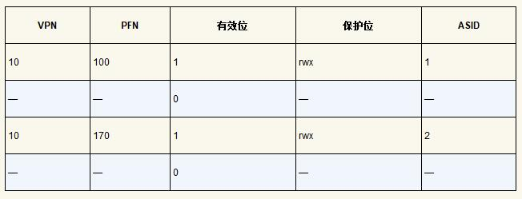

  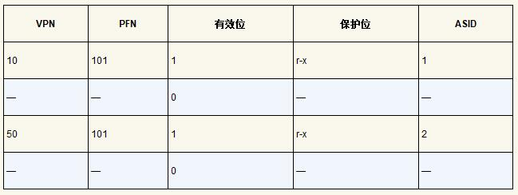

* TLB替换策略

  * 关键问题：如何设计TLB替换策略
  * 缓存替换（cache replacement）、替换（replace）、最近最少使用（least-recently-used，LRU）、随机（random）

* 实际系统的TLB表项

  * MIPS R4000 的 TLB 项

    * 标识位：全局位（Global，G）、一致性位（Coherence，C）、脏位、有效位、页掩码（page mask，图中未标出）

    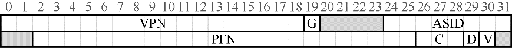

  * 更新 TLB 的指令

    * TLBP，用来查找指定的转换映射是否在TLB中；
    * TLBR，用来将TLB中的内容读取到指定寄存器中；
    * TLBWI，用来替换指定的TLB项；
    * TLBWR，用来随机替换一个TLB项

  * RAM 不总是 RAM（Culler 定律）、随机存取存储器（Random-Access Memory，RAM）

  * 超出TLB覆盖范围（TLB coverage）、数据库管理系统（Database Management System，DBMS）、物理地址索引缓存（physically-indexed cache）、虚拟地址索引缓存（virtually-indexed cache）

* 疑问
  * 如何理解 “分页逻辑上需要一次额外的内存访问”，“每次指令获取、显式加载或保存，都要额外读一次内存以得到转换信息” ？
    * 读了几次，都没有直观的认知
  * TLB 控制流算法的解释，没看懂。
  * ~~寻找有效的转换映射，命中意味着出现曾经转换过的内容，未命中则意味着该映射关系第一次被访问？如何理解同一页的也能命中？~~
    * 答：因为 TLB 缓存整页的转换映射，只要访问过该页的元素一次，即建立了完整的缓存。而由于沿内存顺序访问，因此只有对页中第一个元素的访问才会导致TLB未命中。即检查缓存中是否存在就近的副本，存在则可加速访问。
    * 这里我们遇到了更基本的定律，就像物理定律那样。如果想要快速地缓存，它就必须小，因为光速和其他物理限制会起作用。大的缓存注定慢，因此无法实现目的（缓存必须小而快）。
  * 如何查看电脑的内存页大小？


2023/05/16 22:53:37

------


### 第20章 分页：较小的表

* 关键问题：如何让页表更小？

* 简单的解决方案：更大的页
  * 多种页大小、大型页（数据库管理系统、其他高端商业应用程序）、
  * 目的：**减少 TLB 的压力**，让程序能够访问更多的地址空间而不会遭受太多的 TLB 未命中之苦。
  * 主要问题：大内存页会导致每页内的浪费（即内部碎片，浪费在分配单元内部）
  * 常用页大小：4KB（如 x86）或8KB（如 SPARCv9）
  
* 混合方法：分页和分段
  
  * 主要问题：潜在的浪费空间巨大
  * 杂合（hybrid）、代码页、物理页、堆页、栈页、无效的（invalid）项、分段位（SN）、页表项（PTE）、杂合体（hybrid）
  * 摘录
    * 杂合方案的关键区别在于，每个分段都有界限寄存器，每个界限寄存器保存了段中最大有效页的值。
    * 以这种方式，与线性页表相比，杂合方法实现了显著的内存节省。栈和堆之间未分配的页不再占用页表中的空间（仅将其标记为无效）。
  * 杂合的存在问题
    * 仍然要求使用分段（灵活性 ↓）
    * 这种杂合导致外部碎片再次出现
  
* **多级页表**
  
  * 概览
    
    * 目标：不依赖于分段，如何去掉页表中的所有无效区域，而不是将它们全部保留在内存中？
    * 多级页表（multi-level page table）：将线性页表变成了类似树的东西
    * **页目录（page directory）**：追踪页表的有效性，及有效时的内存位置
    * 页目录项（Page Directory Entries，PDE）、有效位（valid bit）、页帧号（page frame number，PFN）、间接层（level of indirection）、时间—空间折中（time-space trade-off）
    * 成本：
      * 若 TLB 未命中，需从内存加载两次（一次用于页目录，另一次用于 PTE 本身）
      * 复杂性：查找成本
    * 基本思想：
      * （1）将页表分成页大小的单元。
      * （2）如果整页的页表项无效，就完全不分配该页的页表
    
    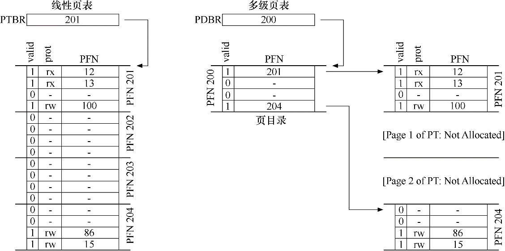
    
  * 详细的多级示例
  
    * 页目录索引（ PDIndex ）、页表索引（Page-Table Index，PTIndex）
    * 摘录
      * 注意过早优化的代码或其他形式的不必要的复杂性。
      * “完美非无可增，乃不可减。”，“谈论完美易，真正实现难。”——Antoine de Saint-Exupery
  
    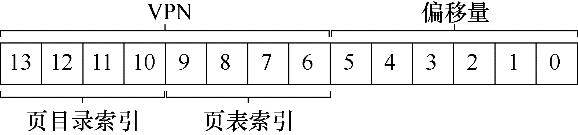
  
    * 页目录和页表
  
    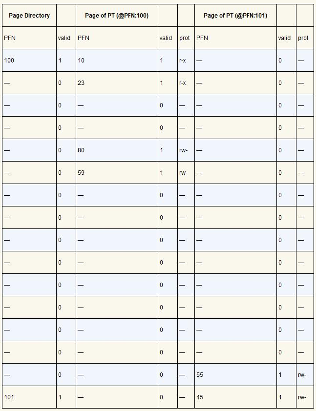
  
  * 超过两级
  
    * 构建多级页表的目标：使页表的每一部分都能放入一个页。
    * 先从顶级页目录获取页目录项，该索引用于从顶级页目录中获取页目录项。如果有效，则通过组合来自顶级PDE的物理帧号和VPN的下一部分（PD索引1）来查阅页目录的第二级。（即利用层次结构，组合使用）
  
    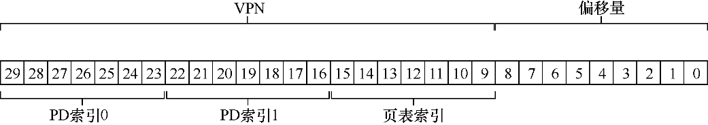
  
  * 地址转换过程：记住 TLB
  
* 反向页表（inverted page table）

  * 保留了一个页表，其中的项代表系统的每个物理页，而不是有许多页表（系统的每个进程一个）。页表项告诉我们哪个进程正在使用此页，以及该进程的哪个虚拟页映射到此物理页。（这个有图才好理解）

* 将页表交换到磁盘

  * 内核虚拟内存（kernel virtual memory）、交换（swap）

* 疑问 / 摘录 / 感悟
  * 如何理解 “假设一个 32 位地址空间（ $2^{32}$ 字节），4KB（ $2^{12}$ 字节）的页和一个 4 字节的页表项。一个地址空间中大约有一百万个虚拟页面（ $2^{32}/2^{12}$ ）。乘以页表项的大小，你会发现页表大小为 4MB。” ？
    * 脑中没有形成一个直观图像，各项的大小也说不清
    * 原来是显示问题，是次方！
    * 勘误：此处显示有误，应为指数形式 $2^{32}$ 及 $2^{12}$，则有 $2^{32} / 2^{12}$ = $2^{20}$ = 1048576 ≈ 100 万个虚拟页面号（VPN），每个虚拟页面包含 1 个 4 字节的页表项，则页表大小为 1048576 × 4 = 4194304 字节。其实也不必近似计算，直接用幂运算可得：$2^{20}$ × 4 = $2^{22}$ Byte = $2^{12} $KB = $2^2$ MB = 4 MB
    * **理解：地址空间大小，相当于面积，页大小，相当于宽度，地址空间除以页大小，则得到长度，这个长度用 VPN 来标记** 
  * 通常系统中的每个进程都有一个页表！有一百个活动进程（在现代系统中并不罕见），就要为页表分配数百兆的内存！
  * 减小页表大小：使用更大的页。再以 32 位地址空间为例，但这次假设用 16KB 的页。因此，会有 18 位的 VPN **加上 14 位的偏移量**。假设每个页表项（4 字节）的大小相同，现在线性页表中有 $2^{18}$ 个项，因此每个页表的总大小为 1MB，页表缩到四分之一。
    * $2^{32}$ Byte = $2^{22}$ KB，即：地址空间大小 / 页大小 = $2^{22}$ KB / $2^4$ KB = $2^{18}$  个 VPN
    * 如何理解 14 位的偏移量？
      * 此处是将 32 位地址空间按照 18 + 14 进行划分了
    * 这样理解的话，是否能与前面的 “面积” 例子对应起来？假设 VPN 表示为长度，那么 14 位偏移量不就相当于宽度吗？但举例当中页大小才是宽度？
      * 其实**对于这种二分割的情况，页大小等价于偏移量大小**
      * 如果利用**其他分割地址空间的策略**，则不然
  * **梳理 VPN 与 TLB 的结构关系** 
    * 一条 TLB 项：`VPN ｜ PFN ｜ 其他位` （ 32 项、64 项、128 项）
  * 要确定地址引用哪个段，我们会用地址空间的前两位。
    * 标记位只需要大于等于所使用的分段数即可（大于则有冗余）
  * 如何理解 “在硬件中，假设有3个基本/界限对，代码、堆和栈各一个。当进程正在运行时，每个段的基址寄存器都包含该段的线性页表的物理地址。因此，系统中的每个进程现在都有3个与其关联的页表。” 分段数目与页表数目的关系？是一一对应的吗？
  * 如何理解 “栈和堆之间未分配的页不再占用页表中的空间（仅将其标记为无效）。” ？为什么标记为无效就不再占用页表空间，与前一种（16KB 地址空间的例子）有和区别？
  * 树结构在何种情况下具有压倒性的有效性？对比线性结构
  * 页目录这种新结构的引入，让我想到了数学当中的代数结构，当一个 “领域” 的工具不足以解决系统内部出现的新问题，则可通过一种更高的抽象视野，获取一种 “可监视” 的可操作性。
  * 如何理解 “在一个简单的两级页表中，页目录为每页页表包含了一项。它由多个页目录项（Page Directory Entries，PDE）组成。PDE（至少）拥有有效位（valid bit）和页帧号（page frame number，PFN），类似于PTE。但是，正如上面所暗示的，这个有效位的含义稍有不同：如果PDE项是有效的，则意味着该项指向的页表（通过PFN）中至少有一页是有效的，即在该PDE所指向的页中，至少一个PTE，其有效位被设置为1。如果PDE项无效（即等于零），则PDE的其余部分没有定义。” 中的有效位区别？看描述读不出来差异？对比示意图，则线性的必须连在一起，多级的则像链表？
    * 一个是数组，一个是树，数组必须连续，而多级结构增加了一个间接层。“这种间接方式，让我们能够将页表页放在物理内存的任何地方。”
    * 思考：如何把这个 “间接方式” 带来的资源利用效率提升，用在学习与巩固上？
  * VPN 与偏移量的分割原则是怎样的？例如 18 + 14、8 + 6
  * 如何理解图 20.2 页表目录和页表有 3 列 valid？
    * 这个图实际为 3 列表内容，分别表示 Page Directory、PFN 100、PFN 101，放在一起看，如果不结合文字说明难免产生歧义
  * 如何理解 “在这个例子中，VPN 254和255（栈）包含有效的映射” 其中的栈、堆、代码的对应关系？
    * 就是利用 VPN 分段进行索引，是一一对应的，所以不会重复
  * 获取物理地址的过程，即地址转换的过程，左移右移理解不清晰
  * 如何理解 “鉴于页大小为512字节，并且假设PTE大小为4字节，你应该看到，可以在单个页上放入128个PTE” ？
    * 页大小
    * PTE 大小
    * PTE 数目 = 页大小 / PTE 大小 = 512 字节 / 4 字节 = 128 个
  * 如何理解 “这样的页表体现了时间和空间上的折中（表格越大，TLB未命中可以处理得更快，反之亦然），因此结构的正确选择强烈依赖于给定环境的约束。” ？


2023/05/17，2023/05/19，2023/05/20 19:22:15

------


### 第21章 超越物理内存：机制

* 关键问题：如何超越物理内存

* 内存层级（memory hierarchy）、硬盘（hard disk drive）、内存覆盖（memory overlays，早期系统反例）

* 交换空间

  * 硬盘地址（disk address）、物理内存与交换空间（一页页加载）

  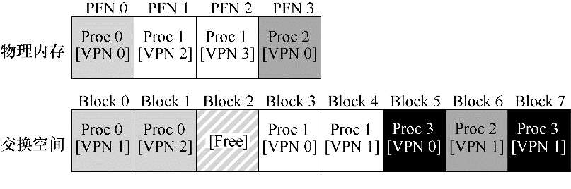

* 存在位（present bit）

  * 页表项的一条新信息，供判断页是否在内存中（区分物理内存与硬盘位置）。
  * 页错误（page fault）、页未命中（page miss）、页错误处理程序（page-fault handler）

* 页错误

  * 阻塞（blocked）、交叠（overlap）

* 内存满了怎么办

  * 换入（page in）、交换出（page out）、替换（replace）、页交换策略（page-replacement policy）
  * 因为换出不合适的页会导致程序性能上的巨大损失，也会导致程序以类似硬盘的速度运行而不是以类似内存的速度。

* 页错误处理流程

  * “当程序从内存中读取数据会发生什么？” 参考两段代码
  * 页存在（present）、有效

* 交换何时真正发生

  * 前期假设内存满了才执行交换，实际上这时候已经太晚了，因此设置了控制线
  * 高水位线（High Watermark，HW）、低水位线（Low Watermark，LW）、交换守护进程（swap daemon）/ 页守护进程（page daemon）、页聚集（cluster）/ 分组（group）、寻道、旋转、分页线程、后台（background）、系统空闲时间（idle time）、守护进程（daemon）

* 疑问

  * 如何理解 “主动共享物理内存” ？连在一起相当于共享？究竟体现在哪？
  * 如何理解 “如果在TLB中找不到VPN（即TLB未命中），则硬件在内存中查找页表（使用页表基址寄存器），并使用VPN查找该页的页表项（PTE）作为索引。如果页有效且存在于物理内存中，则硬件从PTE中获得PFN，将其插入TLB，并重试该指令，这次产生TLB命中。到现在为止还挺好。” ？
    * TLB 未命中，说明没有被缓存，那么要到内存中查找对应的页表，如何查找？用 VPN 找到 PTE，并检查有效性，若有效，则获得 PFN，并插入 TLB，重试则产生 TLB 命中。


2023/05/23 22:57:34

------


### 第22章 超越物理内存：策略

* 关键问题：如何决定踢出哪个页

  * 内存压力（memory pressure）、换出（paging out）、踢出（evict）、替换策略（replacement policy）

* 缓存管理

  * 缓存未命中（cache miss）、缓存命中（cache hit）、平均内存访问时间（Average Memory Access Time，AMAT）	
  * $AMAT = (P_{Hit}·T_M) + (P_{Miss}·T_D)$ 
    * $T_M$ 表示访问内存的成本
    * $T_D$ 表示访问磁盘的成本
    * $P_{Hit}$ 表示在缓存中找到数据的概率（命中）
    * $P_{Miss}$ 表示在缓存中找不到数据的概率（未命中）
    * $P_{Hit}$ 和 $P_{Miss}$ 从 0.0 变化到 1.0，并且 $P_{Miss} +P_{Hit} = 1.0$ 
  * 命中率（hit rate，内存中找到引用的百分比）、未命中率（miss rate）
  * $10^{-3}s = 1ms = 10^{6}us = 10^{9}ns$ （待检验）

* 最优替换策略（optimal / MIN）

  * 定位：虽然最优策略非常不切实际，但作为仿真或其他研究的比较者还是非常有用的。
    * 因此，在你进行的任何研究中，知道最优策略可以方便进行对比，知道你的策略有多大的改进空间，也用于决定当策略已经非常接近最优策略时，停止做无谓的优化。
  * 理解：最优策略提供了一种理想的可比较对象，从而使得研究过程引入了优化与度量的概念。
  * 冷启动未命中（cold-start miss，或强制未命中，compulsory miss）、容量未命中（capacity miss）、冲突未命中（conflict miss）、集合关联性（set-associativity）、完全关联的（fully-associative）

  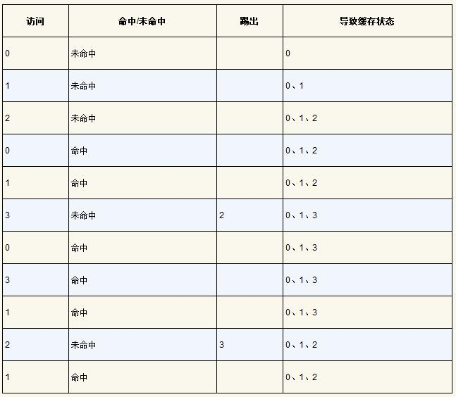

* 简单策略：FIFO

  * 一种简单的队列实现策略，但命中率通常较低，因为无法确定页的重要性
  * 例子（Belady’s Anomaly）：
    * 引用序列 1，2，3，4，1，2，5，1，2，3，4，5
    * 原文 “当缓存大小从 3 变为 4，若 FIFO，命中率反而下降” ？
    * 分析
      * 缓存为 3：123（miss*3），234（miss），341（miss），412（miss），125（miss），251（hit），512（hit），123（miss），234（miss），345（miss）（hit rate = 2/12）
      * 缓存为 4：1234（miss*4），2341（hit），3412（hit），4125（miss），1251（hit），2512（hit），5123（miss），1234（miss），2345（miss）（hit rate = 4/12 = 1/3）
      * 但我算出来命中率是上升的？
      * 经 ChatGPT 检查，原文这个例子有误，我的计算是正确的，因此，这个例子并未出现 Belady’s Anomaly 的情况。

  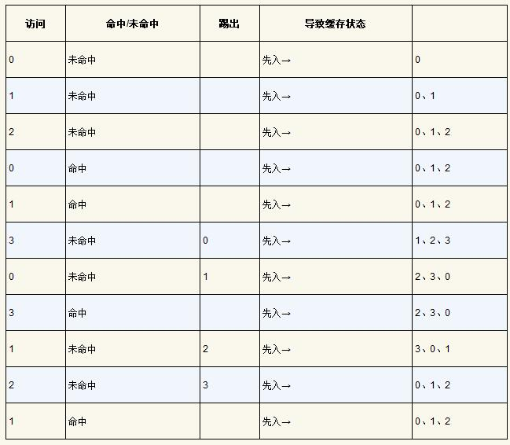

* 另一简单策略：随机

* 利用历史数据：LRU

  * 栈特性（stack property）、频率（frequency）、近期性（recency）、**局部性原则（principle of locality）**
  * “最不经常使用”（Least-Frequently-Used，LFU）策略、“最少最近使用”（Least-Recently-Used，LRU）策略

  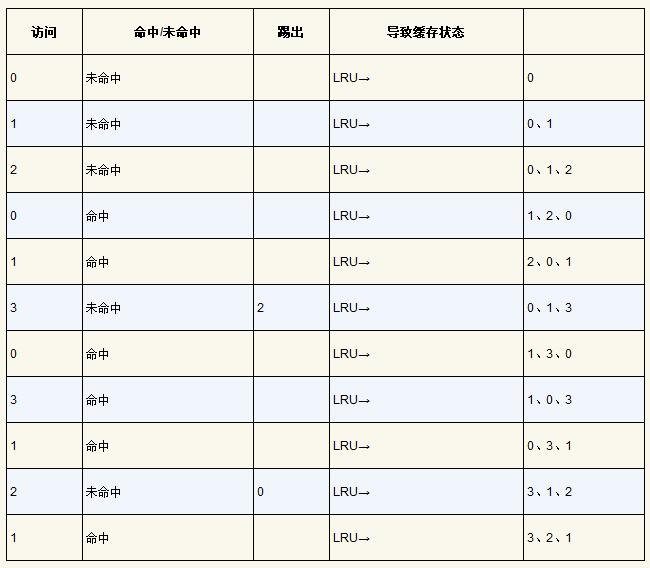

  * 其他（反例）：最经常使用策略（Most- Frequently-Used，MFU）、最近使用策略（Most-Recently-Used，MRU）

* 工作负载示例（workload）

  * 无局部性工作负载

  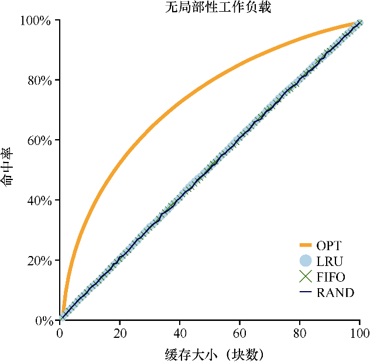

  * **80—20工作负载 ** 
    * 表现出局部性：80% 的引用是访问 20% 的页（“热门”页）。剩下的 20% 是对剩余的 80% 的页（“冷门”页）访问
    * 视情况选用 LRU（若每次未命中代价非常大）

  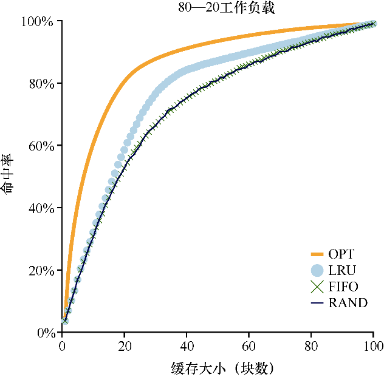

  * “循环顺序”工作负载
    * 原文 “有趣的是，随机策略明显更好，虽然距离最优策略还有距离，但至少达到了非零的命中率”，我的理解是 “循环” 意味着某种有序状态，而随机性的引入，似乎能够对抗有序，这类似一种熵减与熵增的对抗。

  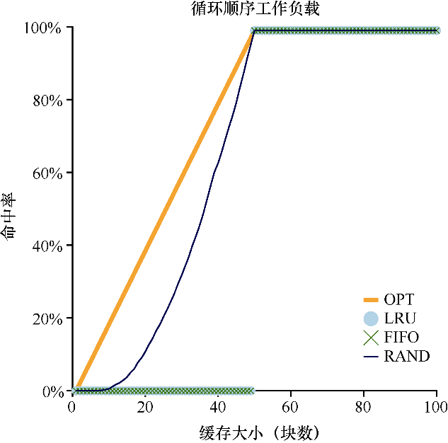

* 实现基于历史信息的算法

  * LRU、MRU、时间字段（当前时间）、访问记录（影响性能）
  * 关键问题：如何实现LRU替换策略
  * “我们**是否真的需要找到绝对最旧的页来替换？**找到差不多最旧的页可以吗?”

* **近似 LRU**

  * 使用位（use bit / 引用位 reference bit）、时钟算法（clock algorithm，最坏 O(n)）、时钟指针（clock hand）
  * 比不考虑历史访问的方法表现更好

  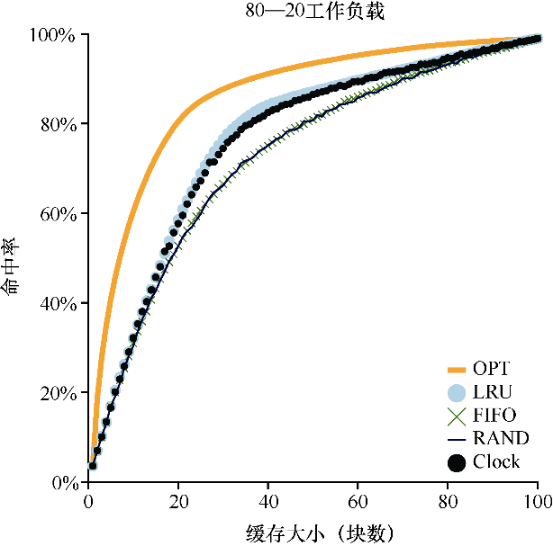

* 考虑脏页

  * 优化：额外考虑内存中的页是否被修改
  * 变脏的页，踢出须写回硬盘，昂贵；若干净，则踢出无成本
  * 修改位（modified bit / 脏位 dirty bit）

* 其他虚拟内存策略

  * 页选择（page selection）策略、按需分页（demand paging）、预取（prefetching）、聚集（clustering）写入 / 分组写入（grouping）
  * 分组写入的有效性：结合硬盘驱动器的性质，执行单次大的写操作，比许多小的写操作更有效。

* 抖动（thrashing）：内存被超额情况，系统将不断换页。

  * 准入控制（admission control）、内存不足的杀手程序（out-of-memory killer，一种杀后台的守护进程）

* 疑问 / 感悟

  * 如何理解 “在为这个缓存选择替换策略时，我们的目标是让缓存未命中（cache miss）最少，即使得从磁盘获取页的次数最少。或者，可以将目标看成让缓存命中（cache hit）最多，即在内存中找到待访问页的次数最多。” ？如何对应公式进行理解？
  * ~~如何理解 “未来访问情况” ？“未来的访问” 是如何知道的？~~
    * “未来的访问是无法知道的，你无法为通用操作系统实现最优策略”
  * 如何理解 “集合关联性、完全关联的” ？
  * 如何切实地使用 82 原则？可参加曲线分配各种任务
  * 什么是 MRU？在哪里出现过？为什么没有印象？
  * 这是一门折中的艺术。
  * 如何理解 “**当必须进行页替换时**，操作系统检查当前指向的页P的使用位是1还是0。如果是1，则意味着页面P最近被使用，因此不适合被替换。然后，P的使用位设置为0，时钟指针递增到下一页（P + 1）。该算法一直持续到找到一个使用位为0的页，使用位为0意味着这个页最近没有被使用过（在最坏的情况下，所有的页都已经被使用了，那么就将所有页的使用位都设置为0）。” 中的 “然后，P 的使用位设置为 0” 为什么指向 P 的使用位被标记为1之后，还要设置为0？是我理解错了这个先后关系吗（意思是原文描述两种情况，而非先后）？或许紧扣页替换的前提
  * 如何理解 “干净页踢出不需成本” ？被修改的页，需要写回硬盘，是否因为内存是临时性数据，而脏数据需要转换为永久数据？但有时候会不会被修改的数据只是临时修改的呢？或者我这里理解错 “修改” 的定义，并非只是改变了，而是需要修改位标识，并且执行页替换的操作？这样分析，是否意味着，对于剔除脏页的页替换必然伴随着 I/O？
  * 如何理解 “脏的未使用页面” ？
  
* 摘录

  * 扫描抗性（scan resistance）、ARC、工作负载、数据库访问模式、River系统、冷启动未命中、热启动未命中、缓存层次结构、未命中三划分
  * 准入控制表明，少做工作有时比尝试一下子做好所有事情更好，这是我们在现实生活中以及在现代计算机系统中经常遇到的情况（令人遗憾）（高效的办法往往是少做事）
  * 与理想情况做比较是系统设计人员的一项重要技术（懂边界，且在边界内做事）
  * 你能弄清楚为什么栈属性可能对同时模拟很多不同大小的缓存有用吗？
  * LRU 是一种全局策略


2023/05/23 23:51:20，2023/05/24 23:40:30，2023/05/26 14:50:38

------


### 第23章 VAX/VMS虚拟内存系统

* 背景
  * 关键问题：如何避免通用性“魔咒”
  * VAX / VMS（VMS）、“通用性魔咒”（提供一般支持）、VAX-11 体系结构（780、750）
* 内存管理硬件
  * 分页分段混合体、跨进程共享
  * 地址空间
    * 上半：系统空间（S）
    * 下半：进程空间（前半 P0 用户程序+下增堆、后半 P1 上增栈）
  * 减少页表对内存的压力
    * 通过将用户地址空间分成两部分，为每个进程的每个区域（P0和P1）一个页表（未使用空间、基址和界限寄存器）
    * 在内核虚拟内存中放置用户页表（P0和P1，因此每个进程两个），内存压力大，则内核可将这些页表交换到磁盘
* 一个真实的地址空间
  * 为什么空指针访问会导致段错误？（VPN 0、条目无效，陷入系统）
  * 空指针（null-pointer）、零页（对调试的支持）、保护位
  * 内核虚拟地址空间（即其数据结构和代码）是每个用户地址空间的一部分
* 页替换
  * VAX 的 PTE：
    * 1 有效位 | 4 位保护字段 | 1 修改位（脏位）| 5 位保留字段 | 1 PFN
    * 无引用位（no reference bit）（无法依赖硬件）
  * 分段的 FIFO（segmented FIFO）
    * 驻留集大小（Resident Set Size，RSS）、二次机会列表（second-chance list）（共2个，全局干净页空闲列表、全局脏页列表）
    * 算法处理
      * 如果另一个进程 Q 需要一个空闲页，它会从全局干净列表中取出第一个空闲页。
      * 但是，如果原来的进程 P 在回收之前在该页上出现页错误，**则P会从空闲（或脏）列表中回收**，从而避免昂贵的磁盘访问。
      * 这些全局二次机会列表越大，分段的 FIFO 算法越接近 LRU。
  * 页聚集
    * 背景：小页面问题
    * 聚集（clustering）：VMS将大批量的页从全局脏列表中分组到一起，并将它们一举写入磁盘（从而使它们变干净）
    * **模拟引用位**（用保护位）：系统活跃使用，页标记设为不可访问（需注意区分进程的可访问信息）。进程访问页，则产生一个陷阱。OS 将检查页是否可访问，是则恢复为正常保护。替换时，OS 检查不可用的页，得知哪些页最近未被使用。
* 其他漂亮的虚拟内存技巧
  * **惰性（lazy）优化**、按需置零（demand zeroing，安全，置零、映射）、**写时复制（copy-on-write，COW）**、TENEX 操作系统、虚拟存储系统
  * 惰性（绝了，像不像？）
    * 推迟工作可能会减少当前操作的延迟，从而提高响应能力
    * 延迟写入直到文件被删除，根本不需要写入
  * 写时复制（只读，实现快速 “复制”）
    * 如果操作系统需要将一个页面从一个地址空间复制到另一个地址空间，不是实际复制它，而是将其映射到目标地址空间，并在两个地址空间中将其标记为只读。
    * 若有写入行为，则陷入系统，检测为 COW 页面，则惰性分配一个新页，填充数据，并依据错误处理建立映射，于是创建了该页的私有副本。
    * `fork()` 创建调用者地址空间的精确副本（复制慢、数据密集），因此改为写时复制。
    * `exec()` 用即将执行的程序覆盖调用进程的地址空间。
* 疑问
  * 内核将这些页表交换到磁盘，开销对比从内存交换到磁盘有和区别？我能想到的是内存的速度非常快，磁盘速度对比则满很多，而内核部分的虚拟内存，好像是直接作用的 CPU 上的，应当是最快的？但 CPU 中的虚拟内存，通常不大吧？回顾前面的笔记，以及询问。
  * 分时操作系统、进程管理、虚拟内存、文件系统、BSD、网络


2023/05/26 22:13:19

------


### 第24章 内存虚拟化总结对话

* 摘录
  * “为了考试”，希望这不是你试图**记住它的原因**。
  * 实在搞不清楚，问一位教授。
  * 有一个好的虚拟内存**模型**可以帮助**诊断**各种有趣的性能问题。
  * 要尝试建立这些**关于事情如何工作的心智模型**，以便我在那里独立工作，当系统不像预期的那样行事时，不会感到惊讶。我甚至应该能够预测系统将如何工作，只要想想它就行。
  * 程序中看到的所有地址，都是**虚拟**地址。
  * TLB 是关键技术，为系统提供了而地址转换的**小硬件缓存**。
  * **页表**是需要了解的数据结构之一。它只是一个数据结构，这意味着几乎可以使用任何结构。我们从简单的结构（如数组，即线性页表）开始，一直到**多级表**（它们看起来像树），甚至像内核虚拟内存中的**可分页页表**一样疯狂。全是为了在内存中节省一点空间！
  * 地址转换结构需要足够**灵活**，以支持程序员想要处理的地址空间。在这个意义上，像多级表这样的结构是完美的。
  * 关于交换到磁盘的所有内容、页替换的工作原理、基本策略
  * 购买更多的内存


2023/05/26 23:15:39

------

