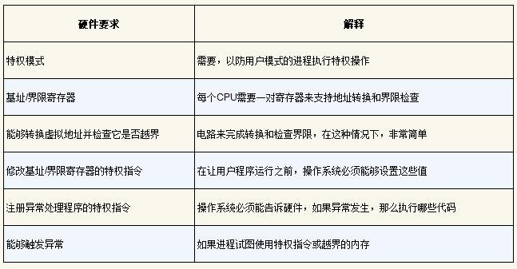
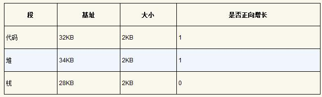

### 01-2 虚拟化（内存虚拟化）

Date：2023/04/12

------


[TOC]


------


### 第12章 关于内存虚拟化的对话

* 摘录
  * 学生就应该问问题，对吧？实际上教授们的意思：提出问题，仅当它们是**好问题**，而且你实际上已经对这些问题**进行了一些思考**。
  * 虚拟内存很复杂，需要我们理解关于硬件和操作系统**交互方式**的更多复杂细节。
  * 有很多细节，你必须牢记它们，才能真正对发生的事情建立一个思维模型。将从简单的开始，如基址/界限，慢慢增加复杂性以应对新的挑战，如TLB和多级页表。最终，我们将能够描述一个全功能的现代虚拟内存管理程序的工作原理。（学习策略 + 最终目的）
  * 虚拟地址（every address generated by a user program is a virtual address）（对于用户程序）、易于使用（ease of use）、地址空间（address space）、隔离（isolation）、保护（protection）


* 2023/04/12 18:57:45

------


### 第13章 抽象：地址空间

* 早期系统（几乎没有抽象）
* 多道程序和时分共享
  * 多道程序（multiprogramming）、有效利用率（utilization）、效率（efficiency）、分时系统的时代、交互性（interactivity）
* 地址空间
  * **关键问题：如何虚拟化内存**
    * 虚拟化内存：OS 在单一的物理内存上为多个运行的进程（所有进程共享内存）构建一个私有的、可能很大的地址空间的抽象？
    * 内存虚拟化的关键：出于某种原因，**必须确保不是加载到物理地址** 0，而是物理地址320KB（这是 A 载入内存的地址）
    * 提示：隔离原则
  * 地址空间是运行的程序看到的系统中的内存（易用的**物理内存抽象**，也是了解虚拟化内存的关键）
  * 一个进程的地址空间包含运行的程序的**所有内存状态**
    * 代码
    * 栈：保存当前的函数调用信息，分配空间给局部变量，传递参数和函数返回值
    * 堆：管理动态分配的、用户管理的内存
    * 其他东西（如，静态初始化的变量）
  * 抽象（abstract）、多个线程（threads）、虚拟化内存（virtualizing memory）、虚拟地址（virtual address）、微内核（microkernel）、内存隔离
  * **分析方法：**
    * 先把静态内容固定（静态代码），再考虑可能变化的区域（栈堆）
    * 它们只需要在相反的方向增长（因此未分配区域在栈堆之间，**多线程无效**）


* 目标（为了实现操作系统的工作，需要目标的指导）
  * 透明（transparency）、效率（efficiency）、保护（protection）
  * **程序不应该感知到内存被虚拟化的事实**，时空效率，隔离保护
  * 补充：你看到的所有地址都不是真的（**打印均为虚拟地址，**只有 OS 和硬件知道物理地址）
  * 重要**子系统**：虚拟内存。
    * 虚拟内存系统负责为程序提供一个巨大的、稀疏的、私有的地址空间的假象，其中保存了程序的所有指令和数据。
    * OS 在专门硬件的帮助下，通过每一个虚拟内存的索引，将其转换为物理地址，物理内存根据获得的物理地址去获取所需的信息。


* 2023/04/12 20:44:49

------


### 第14章 插叙：内存操作API

* 关键问题：如何分配和管理内存

* 内存类型
  * **栈（stack）**内存（自动（automatic）内存，**隐式**）
    * 若希望某些信息存在于函数调用之外，建议不要将它们放在栈上
  * **堆（heap）**内存（于是有了 heap，满足对长期内存的需求，**显式**）
    * 显式+变化用法，堆内存对用户和系统提出了更大的挑战
  
* `malloc()` 调用（库调用）
  
  * 不直接传入 `size_t` 类型参数（数值），而是使用各种函数和宏（如 int 乘法）
  * `double *d = (double *) malloc(10 * sizeof(double));` 
  * `sizeof()` 返回的注意事项（默认返回类型指针大小，除非使用初始化数组）
  * 字符串声明 `malloc(strlen(s) + 1)` （+1 为字符串结束符预留）
  * 强制类型转换（cast）（实际没有做什么）
  
* `free()` 调用（库调用）
  
  * 分配内存是等式的简单部分，知道**何时、如何**以及**是否释放内存**是困难的部分
  * 介绍一个由 `malloc()` 返回的指针（参数）
  
* **常见错误**
  
  * 概念
    
    * 自动内存管理（automatic memory management）、垃圾收集器（garbage collector）、滥用内存
    
  * 忘记分配内存
  
    * 段错误（segmentation fault）
  
    * 提示：它编译过了或它运行了!=它对了（或 `strdup()` ）
  
      ```C
      char *src = "hello";
      char *dst = (char *) malloc(strlen(src) + 1);
      strcpy(dst, src); // work properly
      ```
  
  * 没有分配足够的内存（“几乎” 足够是不够的，许多系统漏洞的来源）
  
    * 缓冲区溢出（buffer overflow）
    * 经验：即使它正确运行过一次，也不意味着它是正确的。
  
  * 忘记初始化分配的内存
  
    * 未初始化的读取（uninitialized read）：可能会在堆中读到乱七八糟的数据，不排除读到随机和有害的东西。
  
  * 忘记释放内存
  
    * 内存泄露（memory leak）：尤其注意在**长时间**运行的应用程序或系统中
    * 习惯：释放显式分配的每个字节
  
  * 在用完之前释放内存
  
    * 悬挂指针（dangling pointer）：提前，导致重新利用了错误释放的内存。
  
  * 重复释放内存
  
    * 重复释放（double free）：未定义。
  
  * 错误地调用 `free()` 
  
    * 无效的释放（invalid free）：传入了非 `malloc()` 申请的指针/值
    * 补充：为什么在你的进程退出时没有内存泄露（**短时间**运行的程序）
      * 没有任何内存会丢失，原因：系统中实际存在两级内存管理
        * 第一级是由操作系统执行的内存管理
        * 第二级管理在每个进程中
      * purify、valgrind 内存定位工具
  
* 底层操作系统支持

  *  `brk` 、分断（break）位置（即堆结束的位置）、`sbrk` 、`mmap()` 、匿名（anonymous）内存区域、交换空间（swap space）
  * 不应该直接调用 `brk` 或 `sbrk`，它们被内存分配库使用。建议坚持使用 `malloc()` 和 `free()` 。

* 其他调用

  * `calloc()` （置零）、`realloc()` （更大，赋值）

* 疑问

  * 内存泄漏与 temp 重启系统未清理是否有关？
  * “Advanced Programming in the UNIX Environment”W. Richard Stevens and Stephen A. Rago Addison-Wesley, 2005 这本书建议读很多遍


* 2023/04/12 23:11:53
* 2023/04/14 17:29:31

------


### 第15章 机制：地址转换

* 关键问题：如何高效、灵活地虚拟化内存
* 概念
  * 介入（interposing）、TLB、页表、**基于硬件**的地址转换（hardware-based address translation）/ **地址转换（address translation）**、虚拟（virtual）地址、物理（physical）地址、管理内存（manage memory）
* 假设
  * 假设1：用户的地址空间必须**连续**地放在物理内存中
  * 假设2：用户的地址空间**小于**物理内存的大小
  * 假设3：**每个**地址空间的大小完全一样
* 一个例子
  * x86汇编（ `movl`、`addl`、长字移动）、一般化的介入技术、介入（Interposition）、透明（transparency）、地址空间（address space）
  * 地址空间的相对性
    * 从程序的角度，地址空间是从 0 开始到某个位置结束，它包含的所有内存引用都应当在这个范围内；
    * 从虚拟内存的角度，操作系统希望将这个进程地址空间放在物理内存的其他位置，不一定从 0 开始
  * 进程的地址空间放入物理内存示意
    * base 寄存器设为 32KB 对应的值
    * 进程所有内存引用被处理器如下转换为物理地址：
      *  `physical address = virtual address + base` 


* 动态（基于硬件）重定位
  * 基址加界限机制（base and bound）/ 动态重定位（dynamic relocation）、限制寄存器（基址（base）寄存器、界限（bound）寄存器）、虚拟内存机制
  * 补充：基于软件的重定位
    * 静态重定位（static relocation）、加载程序（loader）（早期使用）
      * 不提供访问保护，通常需硬件支持来实现真正的访问保护
      * 一旦完成，稍后很难将内存空间重定位到其他位置
    * 地址转换（address translation）
  * 提示：基于硬件的动态重定位
    * **动态重定位**
      * 在运行时发生，而且甚至可以在进程开始运行后改变其地址空间
    * 界限寄存器两种使用方式（逻辑等价）
      * 1）记录地址空间的大小，供硬件对地址转换求和之前检查
      * 2）记录地址空间结束的物理地址，供硬件对地址转换求和之后检查
  * 转换示例（方式 1 示例）
    * 基址加虚拟地址（偏移量）
    * 补充：数据结构——空闲列表（free list，记录未用的空闲内存）
* 硬件支持：总结（动态重定位：硬件要求）
  * 特权模式（privileged mode，或内核模式，kernel mode）、用户模式（user mode）、处理器状态字（processor status word）、基址和界限寄存器（base and bounds register）、异常（exception）、异常处理程序（exception handler）



* 操作系统的问题
  * 动态重定位：操作系统的职责
    * 在进程创建时（为进程的地址空间找到内存空间）
    * 在进程终止时（回收进程的所有内存）
    * 在上下文切换时（保存和恢复基础和界限寄存器）
      * 进程结构（process structure）、进程控制块（Process Control Block，PCB）
    * 提供异常处理程序（exception handler），或要一些调用的函数


* 感悟/疑问
  * 指令的内存大小是多少？
  * 底层指令与数据均由二进制表示，两者混合存储，那么是如何区分两者的边界？
    * 示例 128 movl、132 addl、135 movl
  * 进程的地址空间放入物理内存后，16KB~64KB 这个值是如何给定的？
    * 由**限制寄存器**实现的：
      * 在编写、编译程序时假设地址空间从 0 开始，而当程序真正执行，操作系统会决定其在物理内存中的实际加载地址
      * 基址寄存器：记录起始地址
      * 界限寄存器：确保地址在进程地址空间的范围内
    * 这种基址寄存器配合界限寄存器的硬件结构是芯片中的（每个CPU一对），即通常说的**内存管理单元（Memory Management Unit，MMU）** 
  * 地址转换**完全由硬件处理**，没有 OS 介入；但效率较低
    * 内部碎片（internal fragmentation）
  * 说白了，这些工程问题都是资源利用率的问题，每当解决一个问题，就会继续思考可否优化，那将进入更深一层的认知
  * MS-DOS重定位加载器、Stretch（7030）计算机系统、硬件解释描述符、系统调用支持、编译器支持限定、分离内存引用的软件技术


* 2023/04/26 21:14:44

------


### 第16章 分段

* 关键问题：怎样支持大地址空间
  * 资源浪费：栈和堆之间，有一大块 “空闲” 空间
* 分段：泛化的基址/界限
  * 分段（segmentation）、逻辑段（segment）、段寄存器、未使用的地址空间 / 稀疏地址空间（sparse address spaces）、段异常（segmentation violation）/ 段错误（segmentation fault）
  * 摘录
    * 给地址空间内的每个逻辑段一个基址和界限寄存器对。
    * 一个段只是地址空间里的一个**连续定长**的区域，在典型的地址空间里有 3 个逻辑不同的段：**代码、栈和堆**。
    * 段错误指的是在支持分段的机器上发生了非法的内存访问（术语保留）


* 我们引用哪个段
  * 段寄存器（硬件使用，在地址转换时）
    * 显式（explicit）：用虚拟地址的**头几位标识**不同段
      * 硬件用**前两位**来决定使用哪个段寄存器，然后用后 12 位作为段内偏移。偏移量与基址寄存器相加，硬件就得到了最终的物理地址。（实际只有3个段，两位可表示4个段，因此浪费了一个段地址空间，有些系统将堆和栈当作同一个段，可只用一位来标识）
    * 隐式（implicit）：硬件通过**地址产生的方式**来确定段
      * 如果地址由程序计数器产生（即它是指令获取），那么地址在代码段。
      * 如果基于栈或基址指针，它一定在栈段。
      * 其他地址则在堆段。
  * VAX/VMS系统、段内偏移


* 栈怎么办
  * 支持反向增长（硬件）、段的增长方向



* 支持共享
  * 共享（share）内存段、保护位（protection bit）
  * 通过额外的硬件支持，每个段增加几位，其中包括只读位，实现了一个段可映射到多个虚拟地址空间；硬件算法也同步改变


* 细粒度与粗粒度的分段
  * 粗粒度（coarse-grained）分段：只有很少的几个段的系统（即代码、栈、堆）
  * 细粒度（fine-grained）分段：进一步硬件支持，段表（segment table）、Burroughs B5000、Multics
* 操作系统支持
  * 分段优点：
    * 大量节省物理内存（动态重定位、更好支持稀疏地址空间）
    * 适合硬件完成，地址转换开销极小
    * 支持代码共享
  * 新的问题
    * 操作系统在上下文切换时应该做什么？
    * 管理物理内存的空闲空间（不同进程不同段，段大小不再固定）
  * 外部碎片（external fragmentation）：物理内存充满了许多小洞
  * 紧凑（compact）物理内存：重新安排原有的段，避免了空闲空间总和足够，但单块空间不足的情况（但是，内存紧凑成本很高，因为拷贝段是内存密集型的，一般会占用大量的处理器时间）
  * 空闲列表管理算法
    * 最优匹配（best-fit）
    * 最坏匹配（worst-fit）
    * 首次匹配（first-fit）
    * 伙伴算法（buddy algorithm）（更复杂）
  * 摘录
    * 遗憾的是，无论算法多么精妙，都无法完全消除外部碎片，因此，好的算法只是试图减小它。
    * 提示：如果有一千个解决方案，就没有特别好的。
    * 首先，是我们上面讨论的外部碎片。由于段的大小不同，空闲内存被割裂成各种奇怪的大小，因此满足内存分配请求可能会很难。用户可以尝试采用聪明的算法[W+95]，或定期紧凑内存，**但问题很根本，难以避免**。
    * 第二个问题也许更重要，分段还是**不足以支持更一般化的**稀疏地址空间。
    * 关于如何构建系统的宝贵建议。一下子读完这篇文章很难，每次读几页，就像品一杯美酒，或把它当作一本参考手册。
    * 一个经典的内存管理系统，在设计上有很多常识。
    * 动态链接、分页、分段、碎片问题、内存分配程序
  * 外部碎片（external fragmentation）
* 疑问
  * 假设现在要引用虚拟地址100（在代码段中），MMU将基址值加上偏移量（100）得到实际的物理地址：100 + 32KB = 32868
    * 这里需要注意的是：单位 100 偏移值是相对于 “位（bit）” 而言，还是 “字节” 而言？32KB相当于多少字节？【已解决】
    * 32KB = 32 × 1024 b = 32768 b
    * b、B 大小写区分？
  * 首先应该**先减去堆的偏移量**，即该地址指的是这个段中的哪个字节。
    * **这里理解不清晰：为什么 “堆从虚拟地址 4K 开始” ？堆的基址与堆的虚拟地址有和关系？** 
    * 例如堆中的虚拟地址 4200，若用这个地址加上**堆的基址（34KB）**，得到物理地址 39016，是错的
    * **堆从虚拟地址 4K 开始**，则 4200 的偏移量实际为 4200 - 2096 = 104，于是，真正的物理地址为 34KB + 104 b = 34920 b
  * 这里的单位怪怪的，要不要保留 b ？是否在讨论地址的时候，并不需要单位？
  * 例子：假设要访问虚拟地址15KB，它应该映射到物理地址27KB。该虚拟地址的二进制形式是：11 1100 0000 0000（十六进制0x3C00）。硬件利用前两位（11）来指定段，但然后我们要处理偏移量3KB。为了得到正确的反向偏移，我们必须从3KB中减去最大的段地址：在这个例子中，段可以是4KB，因此正确的偏移量是3KB减去4KB，即−1KB。只要用这个反向偏移量（−1KB）加上基址（28KB），就得到了正确的物理地址27KB。用户可以进行界限检查，确保反向偏移量的绝对值小于段的大小。
    * 如何理解 “应该映射到物理地址 27KB”？
      * 前两位：11
      * 偏移量：1100 0000 0000 b = 2048 b + 1024 b = 3 * 1024 b = 3 KB
      * 反向偏移（由 11 确定，但具体是如何确定的？）
      * 从 3KB 中减去最大的段地址，4KB > 3KB，3KB - 4KB = -1KB
      * 反向偏移量（−1KB）+ 基地址（28KB）= 物理地址（27KB）


* 2023/04/28 21:42:24

------


### 第17章 空闲空间管理

* 关键问题：如何管理空闲空间
* 假设
* 底层机制
  * 分割与合并
  * 追踪已分配空间的大小
  * 嵌入空闲列表
  * 让堆增长
* 基本策略
  * 最优匹配
  * 最差匹配
  * 首次匹配
  * 下次匹配
  * 例子
* 其他方式
  * 分离空闲列表
  * 伙伴系统
  * 其他想法


------


### 第18章 分页：介绍


------


### 第19章 分页：快速地址转换（TLB）

### 第20章 分页：较小的表

### 第21章 超越物理内存：机制

### 第22章 超越物理内存：策略

### 第23章 VAX/VMS虚拟内存系统

### 第24章 内存虚拟化总结对话


------

