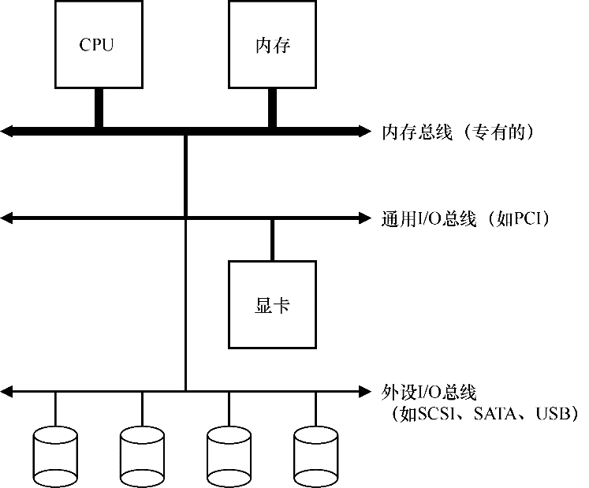
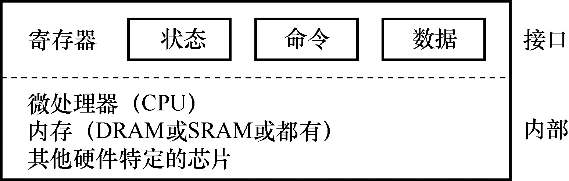
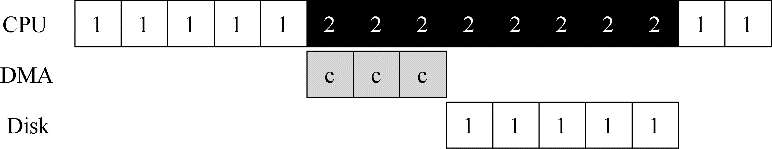
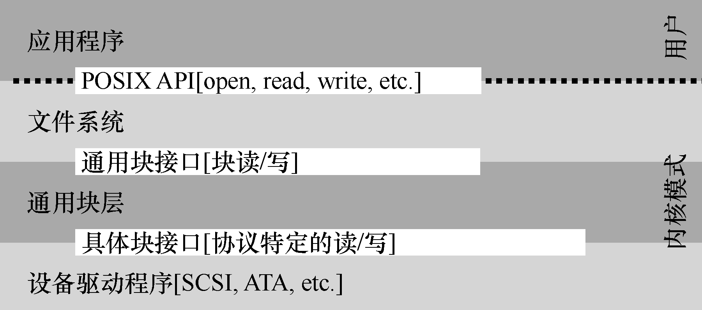
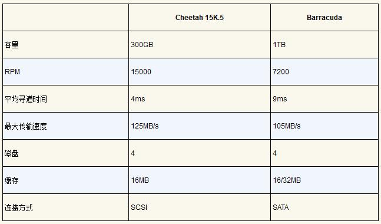
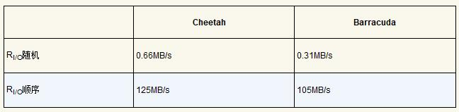
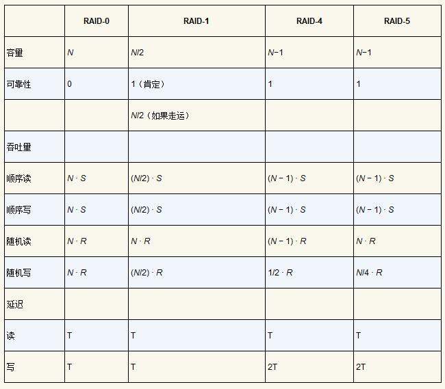
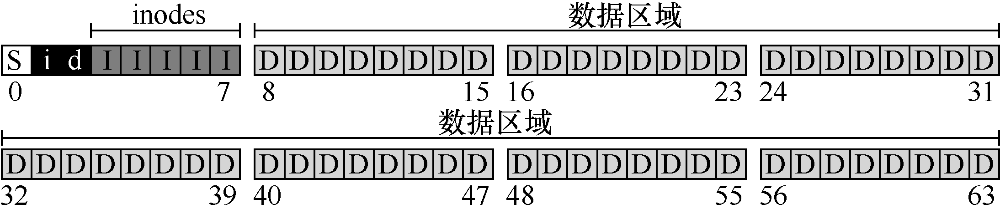

### 03 持久性

Date：2023/06/11 16:33:27

------

[TOC]

------

### 第35章 关于持久性的对话

* 摘录
  * 持久的传统含义：“尽管遇到困难或反对，但在行动过程中坚定或顽固地继续下去。”
  * 你拿了很多很多的桃子，但是你想让它们持久保持很长时间。
  * 信息也是如此。让信息持久，尽管计算机会崩溃，磁盘会出故障或停电，这是一项艰巨而有趣的挑战。
  * 持久保持（persist）

------

### 第36章 I/O设备

* 关键问题：如何将I/O集成进计算机系统中

  * 输入/输入（I/O）设备、交互

* 系统架构

  * 典型系统架构、内存总线（memory bus）/ 互连电缆、I/O总线（I/O bus）、外围总线（peripheral bus，如 SCSI、SATA、USB，最慢）
  * 分层架构：因为物理布局及造价成本。越快的总线越短，因此高性能的内存总线没有足够的空间连接太多设备。

  

* 标准设备

  * 硬件接口（interface）、特定接口+典型交互协议、内部结构（internal structure）、现代 RAID 控制器、固件（firmware 硬件设备中的软件）

  

* 标准协议

  * 状态寄存器、命令寄存器、数据寄存器、轮询（polling）设备、编程的I/O（programmed I/O，PIO）
  * 优缺：足够简单、有效，难免低效、不方便
  * 关键问题：如何减少轮询开销

* 利用中断减少 CPU 开销

  * 中断（interrupt）、中断服务例程（Interrupt Service Routine，ISR）/ 中断处理程序（interrupt handler，结束请求、唤醒等待）、混合（hybrid）策略、两阶段（two-phased）、“点杠效应”、合并（coalescing）
  * 核心：中断允许计算与I/O重叠，是提高CPU利用率的关键。此时，操作系统可以在等待磁盘操作时做其他事情。
  * 中断并非总是最佳方案：如果设备非常快，那么最好的办法反而是轮询。如果设备比较慢，那么采用允许发生重叠的中断更好（仅在慢速设备中断重叠有效）

* 利用 DMA 进行更高效的数据传送

  * 关键问题：如何减少 PIO 的开销
  * DMA 引擎（Direct Memory Access）、DMA控制器
    * 拷贝内存位置、拷贝大小、拷贝目的地

  

* 设备交互的方法

  * 关键问题：如何与设备通信
  * 两种方式
    * （1）用明确的 I/O 指令（特权指令，privileged）；
    * （2）内存映射 I/O（memory- mapped I/O），硬件将设备寄存器作为内存地址提供。

* 纳入操作系统：设备驱动程序

  * 关键问题：如何实现一个设备无关的操作系统
  * SCSI硬盘、IDE硬盘、USB钥匙串设备、抽象（abstraction）、设备驱动程序（device driver）、设备无关、Linux 文件系统栈、通用接口、报告错误信息

  

* 案例研究：简单的 IDE 磁盘驱动程序

  * IDE 磁盘驱动程序、xv6源码、xv6的 IDE 驱动程序
  * 四种寄存器：控制、命令块、状态和错误
  * 与设备交互的简单协议
    * **等待驱动就绪**。读取状态寄存器（0x1F7）直到驱动READY而非忙碌。
    * **向命令寄存器写入参数**。写入扇区数，待访问扇区对应的逻辑块地址（LBA），并将驱动编号（master=0x00，slave=0x10，因为IDE允许接入两个硬盘）写入命令寄存器（0x1F2-0x1F6）。● 开启I/O。发送读写命令到命令寄存器。向命令寄存器（0x1F7）中写入READ-WRITE 命令。
    * **数据传送（针对写请求）**：等待直到驱动状态为READY和DRQ（驱动请求数据），向数据端口写入数据。
    * **中断处理**。在最简单的情况下，每个扇区的数据传送结束后都会触发一次中断处理程序。较复杂的方式支持批处理，全部数据传送结束后才会触发一次中断处理。
    * **错误处理**。在每次操作之后读取状态寄存器。如果ERROR位被置位，可以读取错误寄存器来获取详细信息。

* 历史记录

  * 基本思想的由来、中断向量、DRAM、虚拟化、缓存优化算法、Web 服务器网络性能
  * 中断、DMA 及相关思想都是在快速 CPU 和慢速设备之间权衡的结果。

2023/06/12 21:14:19

------

### 第37章 磁盘驱动器

* 关键问题：如何存储和访问磁盘上的数据
  
  * 磁盘驱动器（hard disk drive）、文件系统技术、持久数据存储、磁盘操作细节
  
* 接口
  
  * 扇区、地址空间（address space）、多扇区操作、单扇区原子写入、掉电、不完整写入（torn write）、读写假设、连续块、“不成文合同”
  
* 基本几何形状
  
  * 盘片（platter）、磁性变化、表面、磁性层、主轴（spindle）、恒定速度、每分钟转数（Rotations Per Minute，RPM）、单次旋转时间、磁头（disk head）、磁盘臂（disk arm）
  
* 简单的磁盘驱动器

  * 最昂贵：寻道、旋转
  * 单磁道延迟：旋转延迟
    * I/O 服务时间、旋转延迟（rotational delay  / rotation delay）
  * 多磁道：寻道时间
    * 寻道（seek）、停放时间（settling time）、传输（transfer）
    * 完整的I/O时间图：首先寻道，然后等待转动延迟，最后传输。
  * 一些其他细节
    * 磁道偏斜（track skew）、重新定位磁头、几何结构的结果、多区域（multi-zoned）磁盘驱动器、缓存（cache）/ 磁道缓冲区（track buffer）
    * 它应该在将数据**放入其内存之后**，还是写入**实际写入磁盘之后**，回报写入完成？
      * 后写缓存（write back） / 立即报告（immediate reporting）
      * 直写（write through）
    * 量纲分析（dimensional analysis，确保在可能的情况下消掉单位）、计算机系统分析、每分钟的旋转次数（rotations per minute）、I/O 分析

* I/O 时间：用数学

  * I/O 速率（RI/O）、随机（random）工作负载、顺序（sequential）工作负载、Cheetah 15K.5（高性能SCSI驱动器）、Barracuda（为容量而生的驱动器）

  

  * 大块传输、平均寻道时间、完全寻道、RPS（每秒转速）、驱动性能差距

  

  * 计算“平均”寻道时间、平均搜索距离、分离绝对值、内层积分、寻道总数

* 磁盘调度

  * 任务调度、任务长度
    * 猜测“任务”（即磁盘请求）需要多长时间（估计）
    * SJF（最短任务优先）原则（principle of SJF，shortest job first）
  * SSTF：最短寻道时间优先
    * 最短寻道时间优先（Shortest-Seek-Time-First，SSTF / 最短寻道优先 Shortest-Seek-First，SSF）、最近块优先（Nearest-Block-First，NBF）、饥饿（starvation）
    * 关键问题：如何处理磁盘饥饿
  * 电梯（又称SCAN或C-SCAN）
    * SCAN（忽视旋转）、扫一遍、变种、F-SCAN、C-SCAN（Circular SCAN）、电梯（elevator）算法
    * 关键问题：如何计算磁盘旋转开销
  * SPTF：最短定位时间优先
    * 最短定位时间优先调度（Shortest Positioning Time First，SPTF / 最短接入时间优先 Shortest Access Time First，SATF）、**“视情况而定”**、相对时间、总是视情况而定（LIVNY定律，谨慎使用）
  * 其他调度问题
    * 在现代系统上执行磁盘调度的地方在哪里？
      * 多个分离请求、磁盘控制器、复杂内部调度程序
      * I/O合并（I/O merging）
    * 在向磁盘发出I/O之前，系统应该等待多久？
      * 工作保全（work-conserving）、非工作保全（non-work-conserving）

* 疑问 / 感悟

  * 双重求和即二重积分的计算方式，绝对值积分的拆分方式遗忘，需回顾以前写的讲义，用更简练的语言进行信息复原。

* 摘录

  * 在工程中，事实证明“视情况而定”几乎总是答案，这反映了取舍是工程师生活的一部分。然而，知道为什么视情况而定总是更好的。
  * 在现代驱动器中，查找和旋转大致相当（当然，视具体的请求而定），因此SPTF是有用的，它提高了性能。然而，它在操作系统中实现起来更加困难，操作系统通常不太清楚磁道边界在哪，也不知道磁头当前的位置（旋转到了哪里）。
  * 详细的功能模型、物理、电子和材料科学、磁盘调度领域、“等待” 改善磁盘调度、MEMS

2023/06/15 22:35:25

------

### 第38章 廉价冗余磁盘阵列（RAID）

* 关键问题：如何得到大型、快速、可靠的磁盘
  * 廉价冗余磁盘阵列（Redundant Array of Inexpensive Disks，RAID ）、冗余（redundancy）、透明地（transparently）、部署（deployment）、可部署性（deployability）、透明支持部署、接口、故障模型、评估
* 接口和RAID内部
  * 线性块数组、RAID 级别、镜像（mirrored）RAID 系统、标准连接、易失性存储器、非易失性存储器、奇偶校验计算
* 故障模型
  * 故障—停止（fail-stop）故障模型、工作状态、故障状态‘、“无声”故障、潜在扇区错误
* 如何评估RAID
  * 容量（capacity）、可靠性（reliability）、性能（performance）
  * RAID 0 级（条带化），RAID 1 级（镜像）、RAID 4/5 级（基于奇偶校验的冗余）
* RAID 0 级：条带化（striping）
  * 轮转、分布、连续块、最大的并行性、条带
    * 映射问题（the mapping problem）
      * 磁盘 = A % 磁盘数
      * 偏移量 = A / 磁盘数
  * 大块大小（chunk size）
    * 权衡：**并行性 VS 定位时间** 
    * 较大（依赖并非请求） VS 较小
    * 回到 RAID-0 分析（三指标顶级，可靠性依然受限于客观磁盘故障）
  * 评估 RAID 性能
    * 单请求延迟、稳态吞吐量、随机请求流、性能特征差异
    * 顺序（sequential）工作负载：假设对阵列的请求大部分是连续的。
    * 随机（random）工作负载：假设每个请求都很小，并且每个请求都是到磁盘上不同的随机位置。
    * 计算
      * 假设：
        * 平均寻道时间 7ms
        * 平均旋转延迟 3ms
        * 磁盘传输速率 50MB/s
      * 10MB @ 50MB/s
      * 10KB @ 50MB/s
  * 再次回到 RAID-0 分析
    * 单块请求的延迟应该与单个磁盘的延迟几乎相同（请求重定向）、全部带宽
* RAID 1 级：镜像
  * 
  * RAID-1 分析
    * 
* RAID 4 级：通过奇偶校验节省空间
  * 
  * RAID-4 分析
    * 容量：（N−1）
    * 可靠性：容许 1 个磁盘故障，不容许更多。
    * 性能：（N−1）·S MB/s
    * 全条带写入（full-stripe write）
* RAID 5 级：旋转奇偶校验
  * 
  * RAID-5 分析
    * 
* RAID比较：总结
  * 如果你严格要求性能而不关心可靠性，那么条带显然是最好的。
  * 如果你想要随机I/O的性能和可靠性，镜像是最好的，你付出的代价是容量下降。
  * 如果容量和可靠性是你的主要目标，那么RAID-5胜出，你付出的代价是小写入的性能。
  * 如果你总是在按顺序执行I/O操作并希望最大化容量，那么RAID-5也是最有意义的。

* 其他有趣的RAID问题
* 疑问 / 感悟
  * 还不理解 “全条带写入” 的流程。
  * 原文解释了加减法奇偶校验的区别，但还没理解这个过程，文字叙述太长了 “何时使用加法奇偶校验计算，何时使用减法方法” ？
  * 磁盘读写可视化的表格，有点懵，还没读懂。

2023/06/18 20:42:21 （未完成整理）

------

### 第39章 插叙：文件和目录

* 关键问题：如何管理持久存储设备
  * 持久存储（persistent storage）、硬盘驱动器（hard disk drive）、固态存储设备（solid-state storage device）
* 文件和目录
  * 文件（file）、低级名称（low-level name）/ inode号（inode number）、目录（directory）、目录树（directory tree / 目录层次结构 directory hierarchy）、根目录（root directory）、分隔符（separator）、子目录（sub-directories）、绝对路径名（absolute pathname）、文件的类型（type）、惯例（convention）
  * 访问任何资源的第一步是能够命名它。
* 文件系统接口
  * `unlink()` 
* 创建文件
  * 标志、创建文件（O_CREAT）、`creat()` 、文件描述符（一种权限，即一个不透明的句柄，或者看作指向文件类型对象的指针）
* 读写文件
  * `strace` 、`dtruss`（macOS X）、`truss`（UNIX）、库例程 printf()
    * -f 跟踪所有 fork 的子进程
    * -t 报告每次调用的时间
    * -e trace=open, close, read, write 只跟踪对这些系统调用的调用，并忽略所有其他调用
  * 文件描述符 0、1、2，分别对应标准输入、标准输出、标准错误
* 读取和写入，但不按顺序
  * 顺序的（sequential）、随机（random）偏移量、特定偏移量、`lseek()` 
  * 更新的两种方式
    * 第一种是当发生N个字节的读或写时，N被添加到当前偏移。因此，每次读取或写入都会隐式更新偏移量；
    * 第二种是明确的lseek，它改变了上面指定的偏移量。
  * 如何理解 “补充：调用 lseek() 不会执行磁盘寻道。lseek() 调用只是在 OS 内存中更改一个变量，该变量跟踪特定进程的下一个读取或写入开始的偏移量。” ？
* 用 fsync() 立即写入
  * 缓冲（buffer）、数据库管理系统（DBMS）、`fsync(int fd)`（立即强制写入）
* 文件重命名
  * `mv` 、`rename(char * old, char * new)` 、原子调用
* 获取文件信息
  * 文件元数据（metadata）、`stat()` 、`fstat()` 、命令行工具 stat
  * 应该将 inode 看作是由文件系统保存的持久数据结构，包含上述信息。
* 删除文件
  * `unlink()` 、`strace` 、`rm *` 、`rm -rf *` 的危害、递归删除
  * unlink() 只需要待删除文件的名称，并在成功时返回零。但这引出了一个很大的疑问：为什么这个系统调用名为 “unlink” ？为什么不就是 “remove” 或 “delete” ？
* 创建目录
  * 文件系统元数据、`mkdir()` 
* 读取目录
  * `opendir() `、`readdir()` 、`closedir()` 、`struct dirent` 
  * `stat()` 、`ls -l` 
* 删除目录
  * `rmdir()` 
* 硬链接
  * `link()` 、引用计数（reference count / 链接计数 link count）
  * 创建了另一个名称（相同 inode 号），该文件不以任何方式复制。只有当引用计数达到零时，文件系统才会释放inode和相关数据块，从而真正“删除”该文件。
  * 创建文件的过程
    * 首先，要构建一个结构（inode），它将跟踪几乎所有关于文件的信息，包括其大小、文件块在磁盘上的位置等等。
    * 其次，将人类可读的名称链接到该文件，并将该链接放入目录中。
* 符号链接（symbolic link）/ 软链接（soft link）
  * 硬链接的局限：你不能创建目录的硬链接（因为担心会在目录树中创建一个环）。你不能硬链接到其他磁盘分区中的文件（因为 inode 号在特定文件系统中是唯一的，而不是跨文件系统），等等。
  * 使用 -s 标志、悬空引用（dangling reference）
  * 区别
    * 符号链接本身实际上是一个不同类型的文件（第三种类型）
    * 常规文件最左列中的第一个字符是 “-”，目录是 “d”，软链接是 “l”
  * 删除名为 file 的原始文件会导致符号链接指向不再存在的路径名。
* 创建并挂载文件系统
  * `mkfs`（“make fs”）、`mount()` 、目标挂载点（mount point）
  * mount 的美妙之处在于：它将所有文件系统统一到一棵树中，而不是拥有多个独立的文件系统，这让命名统一而且方便。
  * 不同的文件系统
    * ext3（标准的基于磁盘的文件系统）
    * proc（用于访问当前进程信息的文件系统）
    * tmpfs（仅用于临时文件的文件系统）
    * AFS（分布式文件系统）
* 疑问 / 感悟
  * 如何理解 39.6 文末 “还需要 fsync() 包含 foo 文件的目录。添加此步骤不仅可以确保文件本身位于磁盘上，而且可以确保文件（如果新创建）也是目录的一部分。” ？
  * “/dev/sda1” 命名来源？

* 摘录
  * 伪文件系统、基于权限的系统
  * 没有什么比直接（大量地）使用它更好，还要读更多的书。

2023/06/21 20:47:47

------

### 第40章 文件系统实现

* 关键问题：如何实现简单的文件系统

  * 

* 思考方式

  * 

* 整体组织

  * 

  

* 文件组织：inode
  
  * 
  * 多级索引
  
* 目录组织

* 空闲空间管理

* 访问路径：读取和写入
  * 从磁盘读取文件
  * 写入磁盘
  * 关键问题：如何降低文件系统I/O成本
  
* 缓存和缓冲

* 疑问 / 感悟

  * 如何理解原文 40.2 的 “80个 inode” ？计算下来并非 80，这个结果对比 16 个 inode 得出。

------

### 第41章 局部性和快速文件系统

* 问题：性能不佳
  * 关键问题：如何组织磁盘数据以提高性能
* FFS：磁盘意识是解决方案
* 组织结构：柱面组
* 策略：如何分配文件和目录
* 测量文件的局部性
* 大文件例外
* 关于FFS的其他几件事

------

### 第42章 崩溃一致性：FSCK和日志

* 关键问题：考虑到崩溃，如何更新磁盘
* 一个详细的例子
  * 崩溃场景
  * 崩溃一致性问题
* 解决方案1：文件系统检查程序
* 解决方案2：日志（或预写日志）
  * 数据日志
  * 恢复
  * 批处理日志更新
  * 使日志有限
  * 元数据日志
  * 棘手的情况：块复用
  * 总结日志：时间线
* 解决方案3：其他方法

------

### 第43章 日志结构文件系统

* 关键问题：如何让所有写入变成顺序写入？
* 按顺序写入磁盘
* 顺序而高效地写入
* 要缓冲多少
* 问题：查找inode
* 通过间接解决方案：inode映射
* 检查点区域
* 从磁盘读取文件：回顾
* 目录如何
* 一个新问题：垃圾收集
* 确定块的死活
* 策略问题：要清理哪些块，何时清理
* 崩溃恢复和日志

------

### 第44章 数据完整性和保护

* 关键问题：如何确保数据完整性
* 磁盘故障模式
* 处理潜在的扇区错误
  * 关键问题：如何处理潜在的扇区错误
* 检测讹误：校验和
  * 关键问题：尽管有讹误，如何保护数据完整性
  * 常见的校验和函数
  * 校验和布局
* 使用校验和
* 一个新问题：错误的写入
  * 关键问题：如何处理错误的写入
* 最后一个问题：丢失的写入
  * 关键问题：如何处理丢失的写入
* 擦净
* 校验和的开销

------

### 第45章 关于持久的总结对话

* 

------

### 第46章 关于分布式的对话

* 

------

### 第47章 分布式系统

* 

------

### 第48章 Sun的网络文件系统（NFS）

* 

------

### 第49章 Andrew文件系统（AFS）

* 

------

### 第50章 关于分布式的总结对话

* 

------

