### 03 持久性

Date：2023/06/11 16:33:27

------

[TOC]

------

### 第35章 关于持久性的对话

* 摘录
  * 持久的传统含义：“尽管遇到困难或反对，但在行动过程中坚定或顽固地继续下去。”
  * 你拿了很多很多的桃子，但是你想让它们持久保持很长时间。
  * 信息也是如此。让信息持久，尽管计算机会崩溃，磁盘会出故障或停电，这是一项艰巨而有趣的挑战。
  * 持久保持（persist）

------

### 第36章 I/O设备

* 关键问题：如何将I/O集成进计算机系统中

  * 输入/输入（I/O）设备、交互

* 系统架构

  * 典型系统架构、内存总线（memory bus）/ 互连电缆、I/O总线（I/O bus）、外围总线（peripheral bus，如 SCSI、SATA、USB，最慢）
  * 分层架构：因为物理布局及造价成本。越快的总线越短，因此高性能的内存总线没有足够的空间连接太多设备。

  

* 标准设备

  * 硬件接口（interface）、特定接口+典型交互协议、内部结构（internal structure）、现代 RAID 控制器、固件（firmware 硬件设备中的软件）

  

* 标准协议

  * 状态寄存器、命令寄存器、数据寄存器、轮询（polling）设备、编程的I/O（programmed I/O，PIO）
  * 优缺：足够简单、有效，难免低效、不方便
  * 关键问题：如何减少轮询开销

* 利用中断减少 CPU 开销

  * 中断（interrupt）、中断服务例程（Interrupt Service Routine，ISR）/ 中断处理程序（interrupt handler，结束请求、唤醒等待）、混合（hybrid）策略、两阶段（two-phased）、“点杠效应”、合并（coalescing）
  * 核心：中断允许计算与I/O重叠，是提高CPU利用率的关键。此时，操作系统可以在等待磁盘操作时做其他事情。
  * 中断并非总是最佳方案：如果设备非常快，那么最好的办法反而是轮询。如果设备比较慢，那么采用允许发生重叠的中断更好（仅在慢速设备中断重叠有效）

* 利用 DMA 进行更高效的数据传送

  * 关键问题：如何减少 PIO 的开销
  * DMA 引擎（Direct Memory Access）、DMA控制器
    * 拷贝内存位置、拷贝大小、拷贝目的地

  

* 设备交互的方法

  * 关键问题：如何与设备通信
  * 两种方式
    * （1）用明确的 I/O 指令（特权指令，privileged）；
    * （2）内存映射 I/O（memory- mapped I/O），硬件将设备寄存器作为内存地址提供。

* 纳入操作系统：设备驱动程序

  * 关键问题：如何实现一个设备无关的操作系统
  * SCSI硬盘、IDE硬盘、USB钥匙串设备、抽象（abstraction）、设备驱动程序（device driver）、设备无关、Linux 文件系统栈、通用接口、报告错误信息

  

* 案例研究：简单的 IDE 磁盘驱动程序

  * IDE 磁盘驱动程序、xv6源码、xv6的 IDE 驱动程序
  * 四种寄存器：控制、命令块、状态和错误
  * 与设备交互的简单协议
    * **等待驱动就绪**。读取状态寄存器（0x1F7）直到驱动READY而非忙碌。
    * **向命令寄存器写入参数**。写入扇区数，待访问扇区对应的逻辑块地址（LBA），并将驱动编号（master=0x00，slave=0x10，因为IDE允许接入两个硬盘）写入命令寄存器（0x1F2-0x1F6）。● 开启I/O。发送读写命令到命令寄存器。向命令寄存器（0x1F7）中写入READ-WRITE 命令。
    * **数据传送（针对写请求）**：等待直到驱动状态为READY和DRQ（驱动请求数据），向数据端口写入数据。
    * **中断处理**。在最简单的情况下，每个扇区的数据传送结束后都会触发一次中断处理程序。较复杂的方式支持批处理，全部数据传送结束后才会触发一次中断处理。
    * **错误处理**。在每次操作之后读取状态寄存器。如果ERROR位被置位，可以读取错误寄存器来获取详细信息。

* 历史记录

  * 基本思想的由来、中断向量、DRAM、虚拟化、缓存优化算法、Web 服务器网络性能
  * 中断、DMA 及相关思想都是在快速 CPU 和慢速设备之间权衡的结果。

2023/06/12 21:14:19

------

### 第37章 磁盘驱动器

* 关键问题：如何存储和访问磁盘上的数据
  
  * 磁盘驱动器（hard disk drive）、文件系统技术、持久数据存储、磁盘操作细节
  
* 接口
  
  * 扇区、地址空间（address space）、多扇区操作、单扇区原子写入、掉电、不完整写入（torn write）、读写假设、连续块、“不成文合同”
  
* 基本几何形状
  
  * 盘片（platter）、磁性变化、表面、磁性层、主轴（spindle）、恒定速度、每分钟转数（Rotations Per Minute，RPM）、单次旋转时间、磁头（disk head）、磁盘臂（disk arm）
  
* 简单的磁盘驱动器

  * 最昂贵：寻道、旋转
  * 单磁道延迟：旋转延迟
    * I/O 服务时间、旋转延迟（rotational delay  / rotation delay）
  * 多磁道：寻道时间
    * 寻道（seek）、停放时间（settling time）、传输（transfer）
    * 完整的I/O时间图：首先寻道，然后等待转动延迟，最后传输。
  * 一些其他细节
    * 磁道偏斜（track skew）、重新定位磁头、几何结构的结果、多区域（multi-zoned）磁盘驱动器、缓存（cache）/ 磁道缓冲区（track buffer）
    * 它应该在将数据**放入其内存之后**，还是写入**实际写入磁盘之后**，回报写入完成？
      * 后写缓存（write back） / 立即报告（immediate reporting）
      * 直写（write through）
    * 量纲分析（dimensional analysis，确保在可能的情况下消掉单位）、计算机系统分析、每分钟的旋转次数（rotations per minute）、I/O 分析

* I/O 时间：用数学

  * I/O 速率（RI/O）、随机（random）工作负载、顺序（sequential）工作负载、Cheetah 15K.5（高性能SCSI驱动器）、Barracuda（为容量而生的驱动器）

  

  * 大块传输、平均寻道时间、完全寻道、RPS（每秒转速）、驱动性能差距

  

  * 计算“平均”寻道时间、平均搜索距离、分离绝对值、内层积分、寻道总数

* 磁盘调度

  * 任务调度、任务长度
    * 猜测“任务”（即磁盘请求）需要多长时间（估计）
    * SJF（最短任务优先）原则（principle of SJF，shortest job first）
  * SSTF：最短寻道时间优先
    * 最短寻道时间优先（Shortest-Seek-Time-First，SSTF / 最短寻道优先 Shortest-Seek-First，SSF）、最近块优先（Nearest-Block-First，NBF）、饥饿（starvation）
    * 关键问题：如何处理磁盘饥饿
  * 电梯（又称SCAN或C-SCAN）
    * SCAN（忽视旋转）、扫一遍、变种、F-SCAN、C-SCAN（Circular SCAN）、电梯（elevator）算法
    * 关键问题：如何计算磁盘旋转开销
  * SPTF：最短定位时间优先
    * 最短定位时间优先调度（Shortest Positioning Time First，SPTF / 最短接入时间优先 Shortest Access Time First，SATF）、**“视情况而定”**、相对时间、总是视情况而定（LIVNY定律，谨慎使用）
  * 其他调度问题
    * 在现代系统上执行磁盘调度的地方在哪里？
      * 多个分离请求、磁盘控制器、复杂内部调度程序
      * I/O合并（I/O merging）
    * 在向磁盘发出I/O之前，系统应该等待多久？
      * 工作保全（work-conserving）、非工作保全（non-work-conserving）

* 疑问 / 感悟

  * 双重求和即二重积分的计算方式，绝对值积分的拆分方式遗忘，需回顾以前写的讲义，用更简练的语言进行信息复原。

* 摘录

  * 在工程中，事实证明“视情况而定”几乎总是答案，这反映了取舍是工程师生活的一部分。然而，知道为什么视情况而定总是更好的。
  * 在现代驱动器中，查找和旋转大致相当（当然，视具体的请求而定），因此SPTF是有用的，它提高了性能。然而，它在操作系统中实现起来更加困难，操作系统通常不太清楚磁道边界在哪，也不知道磁头当前的位置（旋转到了哪里）。
  * 详细的功能模型、物理、电子和材料科学、磁盘调度领域、“等待” 改善磁盘调度、MEMS

2023/06/15 22:35:25

------

### 第38章 廉价冗余磁盘阵列（RAID）

* 关键问题：如何得到大型、快速、可靠的磁盘
  
  * 廉价冗余磁盘阵列（Redundant Array of Inexpensive Disks，RAID ）、冗余（redundancy）、透明地（transparently）、部署（deployment）、可部署性（deployability）、透明支持部署、接口、故障模型、评估
  
* 接口和RAID内部
  
  * 线性块数组、RAID 级别、镜像（mirrored）RAID 系统、标准连接、易失性存储器、非易失性存储器、奇偶校验计算
  
* 故障模型
  
  * 故障—停止（fail-stop）故障模型、工作状态、故障状态‘、“无声”故障、潜在扇区错误
  
* 如何评估RAID
  * 容量（capacity）、可靠性（reliability）、性能（performance）
  * RAID 0 级（条带化），RAID 1 级（镜像）、RAID 4/5 级（基于奇偶校验的冗余）
  
* RAID 0 级：条带化（striping）
  * 轮转、分布、连续块、最大的并行性、条带
    * 映射问题（the mapping problem）
      * 磁盘 = A % 磁盘数
      * 偏移量 = A / 磁盘数
  * 大块大小（chunk size）
    * 权衡：**并行性 VS 定位时间** 
    * 较大（依赖并非请求） VS 较小
    * 回到 RAID-0 分析（三指标顶级，可靠性依然受限于客观磁盘故障）
  * 评估 RAID 性能
    * 单请求延迟、稳态吞吐量、随机请求流、性能特征差异
    * 顺序（sequential）工作负载：假设对阵列的请求大部分是连续的。
    * 随机（random）工作负载：假设每个请求都很小，并且每个请求都是到磁盘上不同的随机位置。
    * 计算
      * 假设：
        * 平均寻道时间 7ms
        * 平均旋转延迟 3ms
        * 磁盘传输速率 50MB/s
      * 10MB @ 50MB/s
      * 10KB @ 50MB/s
  * 再次回到 RAID-0 分析
    * 单块请求的延迟应该与单个磁盘的延迟几乎相同（请求重定向）、全部带宽
  
* RAID 1 级：镜像
  * 超越条带化、副本
  * RAID-10（或 RAID 1+0，使用镜像对 RAID-1，条带化 RAID-0）：
  
  
  
  * 另一种常见安排：RAID-01（或 RAID 0+1）
    * 两个大型条带化 RAID-0 阵列、镜像 RAID-1
  * RAID-1 分析
    * 多磁盘RAID系统、一致更新问题（consistent-update problem）、两个副本不一致（inconsistent）、原子地（atomically）改变、预写日志（write-ahead log）、恢复（recovery）、非易失性 RAM、最大带宽、最佳案例（随机读取）
    * 问题：每次写入都在磁盘上记录日志，代价昂贵。
  
* RAID 4 级：通过奇偶校验节省空间
  * 奇偶校验（parity）、奇偶校验块、冗余信息、异或（XOR）函数、不变性（invariant）、重构（reconstruct）、计算重构值
  
  * RAID-4 全条带写入
  
    
  
  * RAID-4 分析
    * 容量：（N−1）
    * 可靠性：容许 1 个磁盘故障，不容许更多。
    * 性能：（N−1）·S MB/s
    * 全条带写入（full-stripe write）、加法奇偶校验（additive parity）、减法奇偶校验（subtractive parity）方法、小写入问题（small-write problem）
  
* RAID 5 级：旋转奇偶校验（为解决小写入问题 / 至少部分解决）
  
  * 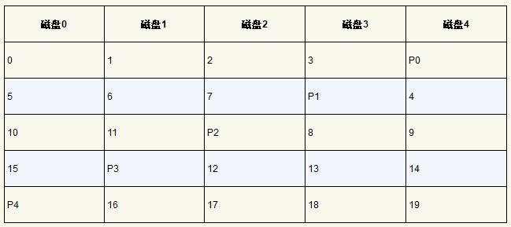
  * 每个条带的奇偶校验块现在都在磁盘上旋转，以消除RAID-4的奇偶校验磁盘瓶颈。
  * RAID-5 分析
    * 通常可以假设，如果有大量的随机请求，我们将能够保持所有磁盘均匀忙碌。
    * 唯一没有取代的地方是系统知道自己绝不会执行大写入以外的任何事情，从而完全避免了小写入问题。
  
* RAID比较：总结
  * 如果你严格要求性能而不关心可靠性，那么条带显然是最好的。
  * 如果你想要随机I/O的性能和可靠性，镜像是最好的，你付出的代价是容量下降。
  * 如果容量和可靠性是你的主要目标，那么RAID-5胜出，你付出的代价是小写入的性能。
  * 如果你总是在按顺序执行I/O操作并希望最大化容量，那么RAID-5也是最有意义的。

* 其他有趣的RAID问题
* 疑问 / 感悟
  * 还不理解 “全条带写入” 的流程。
  * 原文解释了加减法奇偶校验的区别，但还没理解这个过程，文字叙述太长了 “何时使用加法奇偶校验计算，何时使用减法方法” ？
  * 磁盘读写可视化的表格，有点懵，还没读懂。

2023/06/18 20:42:21 未完成整理，完成整理 2023/07/11 20:43:57

------

### 第39章 插叙：文件和目录

* 关键问题：如何管理持久存储设备
  * 持久存储（persistent storage）、硬盘驱动器（hard disk drive）、固态存储设备（solid-state storage device）
* 文件和目录
  * 文件（file）、低级名称（low-level name）/ inode号（inode number）、目录（directory）、目录树（directory tree / 目录层次结构 directory hierarchy）、根目录（root directory）、分隔符（separator）、子目录（sub-directories）、绝对路径名（absolute pathname）、文件的类型（type）、惯例（convention）
  * 访问任何资源的第一步是能够命名它。
* 文件系统接口
  * `unlink()` 
* 创建文件
  * 标志、创建文件（O_CREAT）、`creat()` 、文件描述符（一种权限，即一个不透明的句柄，或者看作指向文件类型对象的指针）
* 读写文件
  * `strace` 、`dtruss`（macOS X）、`truss`（UNIX）、库例程 printf()
    * -f 跟踪所有 fork 的子进程
    * -t 报告每次调用的时间
    * -e trace=open, close, read, write 只跟踪对这些系统调用的调用，并忽略所有其他调用
  * 文件描述符 0、1、2，分别对应标准输入、标准输出、标准错误
* 读取和写入，但不按顺序
  * 顺序的（sequential）、随机（random）偏移量、特定偏移量、`lseek()` 
  * 更新的两种方式
    * 第一种是当发生N个字节的读或写时，N被添加到当前偏移。因此，每次读取或写入都会隐式更新偏移量；
    * 第二种是明确的lseek，它改变了上面指定的偏移量。
  * 如何理解 “补充：调用 lseek() 不会执行磁盘寻道。lseek() 调用只是在 OS 内存中更改一个变量，该变量跟踪特定进程的下一个读取或写入开始的偏移量。” ？
* 用 fsync() 立即写入
  * 缓冲（buffer）、数据库管理系统（DBMS）、`fsync(int fd)`（立即强制写入）
* 文件重命名
  * `mv` 、`rename(char * old, char * new)` 、原子调用
* 获取文件信息
  * 文件元数据（metadata）、`stat()` 、`fstat()` 、命令行工具 stat
  * 应该将 inode 看作是由文件系统保存的持久数据结构，包含上述信息。
* 删除文件
  * `unlink()` 、`strace` 、`rm *` 、`rm -rf *` 的危害、递归删除
  * unlink() 只需要待删除文件的名称，并在成功时返回零。但这引出了一个很大的疑问：为什么这个系统调用名为 “unlink” ？为什么不就是 “remove” 或 “delete” ？
* 创建目录
  * 文件系统元数据、`mkdir()` 
* 读取目录
  * `opendir() `、`readdir()` 、`closedir()` 、`struct dirent` 
  * `stat()` 、`ls -l` 
* 删除目录
  * `rmdir()` 
* 硬链接
  * `link()` 、引用计数（reference count / 链接计数 link count）
  * 创建了另一个名称（相同 inode 号），该文件不以任何方式复制。只有当引用计数达到零时，文件系统才会释放inode和相关数据块，从而真正“删除”该文件。
  * 创建文件的过程
    * 首先，要构建一个结构（inode），它将跟踪几乎所有关于文件的信息，包括其大小、文件块在磁盘上的位置等等。
    * 其次，将人类可读的名称链接到该文件，并将该链接放入目录中。
* 符号链接（symbolic link）/ 软链接（soft link）
  * 硬链接的局限：你不能创建目录的硬链接（因为担心会在目录树中创建一个环）。你不能硬链接到其他磁盘分区中的文件（因为 inode 号在特定文件系统中是唯一的，而不是跨文件系统），等等。
  * 使用 -s 标志、悬空引用（dangling reference）
  * 区别
    * 符号链接本身实际上是一个不同类型的文件（第三种类型）
    * 常规文件最左列中的第一个字符是 “-”，目录是 “d”，软链接是 “l”
  * 删除名为 file 的原始文件会导致符号链接指向不再存在的路径名。
* 创建并挂载文件系统
  * `mkfs`（“make fs”）、`mount()` 、目标挂载点（mount point）
  * mount 的美妙之处在于：它将所有文件系统统一到一棵树中，而不是拥有多个独立的文件系统，这让命名统一而且方便。
  * 不同的文件系统
    * ext3（标准的基于磁盘的文件系统）
    * proc（用于访问当前进程信息的文件系统）
    * tmpfs（仅用于临时文件的文件系统）
    * AFS（分布式文件系统）
* 疑问 / 感悟
  * 如何理解 39.6 文末 “还需要 fsync() 包含 foo 文件的目录。添加此步骤不仅可以确保文件本身位于磁盘上，而且可以确保文件（如果新创建）也是目录的一部分。” ？
  * “/dev/sda1” 命名来源？

* 摘录
  * 伪文件系统、基于权限的系统
  * 没有什么比直接（大量地）使用它更好，还要读更多的书。

2023/06/21 20:47:47

------

### 第40章 文件系统实现

* 关键问题：如何实现简单的文件系统

  * VSFS（Very Simple File System）、纯软件、AFS（Andrew）、ZFS（Sun，Zettabyte）

* 思考方式

  * 两个不同方面
    * 文件系统的数据结构（data structure）、心智模型、抽象的理解
    * 访问方法（access method）

* 整体组织

  * 块（block）、用户数据（数据区域，data region）、元数据、inode表（inode table）、数据块（D）、inode（I）、分配结构（allocation structure）、空闲列表（free list）、位图（bitmap）、数据位图（data bitmap）、inode 位图（inode bitmap）、超级块（superblock）
  * 在挂载文件系统时，操作系统将首先读取超级块，初始化各种参数，然后将该卷添加到文件系统树中。当卷中的文件被访问时，系统就会知道在哪里查找所需的磁盘上的结构。

  

* 文件组织：inode
  
  * index node（索引节点）、通用名称、dnodes、fnodes、inumber、低级名称
  * inode 信息
    * 文件类型（常规文件、目录等）
    * 大小、分配给它的块数、保护信息（所有者和访问权限）
    * 一些时间信息（文件创建、修改、上次访问时间）
    * 数据块驻留在磁盘上的位置信息（如某种类型的指针）
  * ext2 的 inode
  
  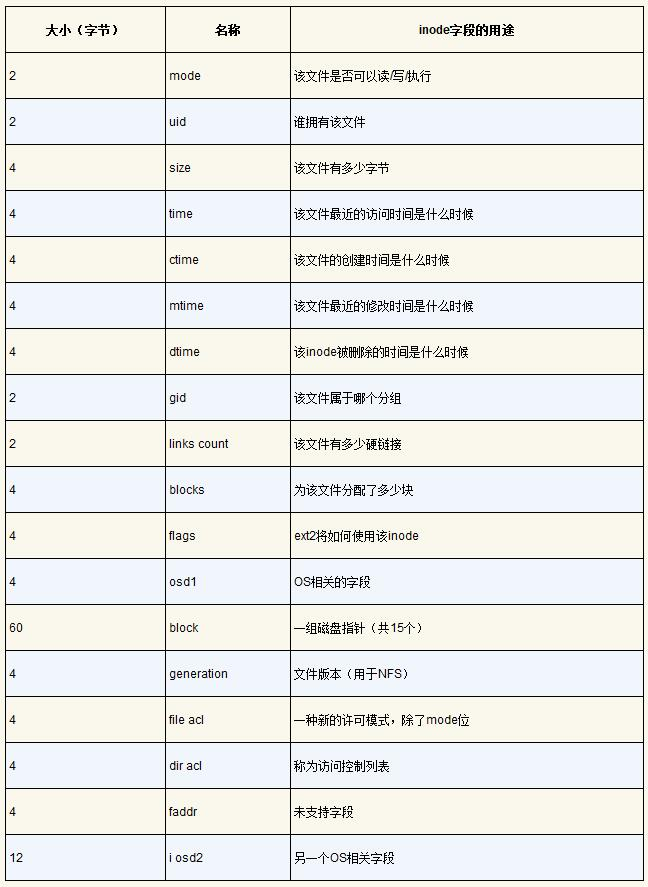
  
  * 多级索引
    * 间接指针（indirect pointer）、范围（extent）、双重间接指针（double indirect pointer）、三重间接指针（triple indirect pointer）、多级索引（multi-level index）方法、使用链表（linked list）、链接信息表、文件分配表（File Allocation Table，FAT）、NTFS 、XFS（B 树结构）、不平衡设计
    * 使用多级索引
      * Linux（ext2、ext3）、NetApp（WAFL）、UNIX
    * 使用范围
      * SGI（XFS）、Linux（ext4）
  
* 目录组织

  * 包含：二元组（条目名称，inode号）
  * 每个目录有两个额外的条目：
    * `.` ：当前目录
    * `..` ：父目录

* 空闲空间管理（free space management）

  * 位图、空闲列表、预分配（pre-allocation）策略

* 访问路径：读取和写入
  * 从磁盘读取文件
    * 访问路径（access path）、遍历（traverse）、根目录（root directory，inode=2）、目录数据块、大型目录、读取不会访问分配结构
  * 写入磁盘
    * 分配（allocate），I/O 工作总量非常大
  * 关键问题：如何降低文件系统I/O成本
  
* 缓存和缓冲

  * 系统内存（DRAM）、固定大小的缓存（fixed-size cache）、静态（内存）划分（static partitioning，固定比例）、动态划分（dynamic partitioning）
  * 统一页面缓存（unified page cache）、写缓冲（write buffering）、批（batch）、调度（schedule）、拖延、避免（avoid）写入、绕过缓存的直接I/O（direct I/O）接口、耐用性/性能折中

* 疑问 / 感悟

  * 如何理解原文 40.2 的 “80个 inode” ？计算下来并非 80，这个结果对比 16 个 inode 得出。
  * 如何理解 40.3 “因此，为了获取包含索引节点32的索引节点块，文件系统将向节点（即40）发出一个读取请求，取得期望的inode块。” ？
    * 前文 “回想一下，磁盘不是按字节可寻址的，而是由大量可寻址扇区组成，通常是512字节。” 才有后面的 “因此”。
  * 如何理解 “假设块大小为4KB，并且指针为4字节，则该结构可以容纳一个刚好超过4GB的文件，即（12 + 1024 + 10242）×4KB。” ？
  
* 摘录

  * 没有最好的方法。你应该考虑手头的问题，并确定哪种方法最适合。
  * 大多数现代文件系统将写入在内存中缓冲 5～30s
  * 要理解如何正确地进行这种折中，最好了解使用存储系统的应用程序需要什么。
  * 目录只是 “存储名称 → inode号” 映射的特定类型的文件。
  * 文件系统设计的极好方面是它的自由。接下来的章节中探讨的文件系统，都利用了这种自由来优化文件系统的某些方面。
  * **心智模型**就是你在学习系统时真正想要发展的东西。
  * 如果你理解了文件系统的数据结构和访问方法，就形成了一个关于它如何工作的良好心智模型，这是系统思维的一个关键部分。
  * NetBSD 集成文件系统缓冲区缓存、虚拟内存页面缓存、可伸缩性

2023/06/24 18:34:16 读完未整理，2023/06/25 17:40:02 完成整理

------

### 第41章 局部性和快速文件系统

* “老UNIX文件系统”、超级块（S，卷的大小、有多少 inode、指向空闲列表块的头部的指针等等）
  
* 问题：性能不佳
  
  * 关键问题：如何组织磁盘数据以提高性能
  * 硬盘作为随机存取内存、定位成本、碎片化（fragmented）、磁盘碎片整理工具、内部碎片
  
* FFS：磁盘意识是解决方案

  * 快速文件系统（Fast File System，FFS）、“磁盘意识”
  * 通过保持与文件系统相同的接口（相同的API，包括open()、read()、write()、close()和其他文件系统调用），但改变内部实现，作者为新文件系统的构建铺平了道路，这方面的工作今天仍在继续。

* 组织结构：柱面组

  * 柱面组（cylinder group）/ 块组（block group，ext2、ext3）、FFS 文件创建
  * 通过在同一组中放置两个文件，FFS可以确保先后访问两个文件不会导致穿越磁盘的长时间寻道。

* 策略：如何分配文件和目录

  * 思想：相关的东西放一起（无关则分开放）。
  * 它们确保了相关文件之间的寻道时间很短，FFS通常会提高性能。

* 测量文件的局部性

  * 跟踪记录、SEER 跟踪、距离度量标准衡量、共同祖先、SEER 集群、差异度量值、累积百分比、局部性假设、多级方式、“随机”跟踪的局部性

  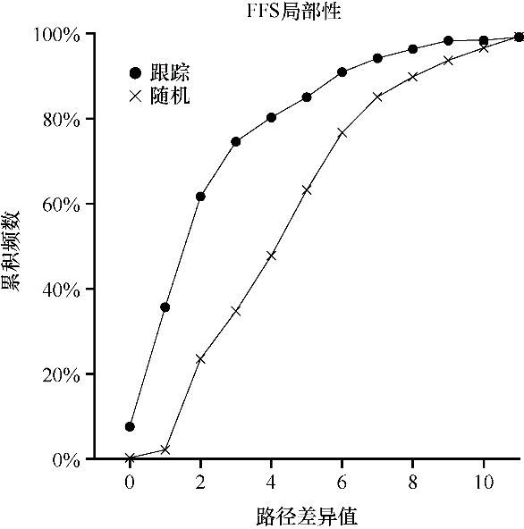

* 大文件例外

  * 第一个块组、摊销（amortization）、量纲分析
  * 如果没有大文件例外，单个大文件会将其所有块放入磁盘的一部分。
  * 在磁盘上分散文件块会损害性能，特别是在顺序文件访问的相对常见的情况下。

  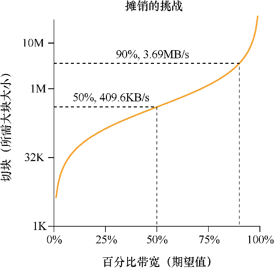

* 关于FFS的其他几件事

  * 内部碎片、子块（sub-block）、大量额外工作、参数化、磁道缓冲区（track buffer）、分水岭
* FFS 使用不同的布局解决了**旋转错过块**的问题。
  
  

2023/06/28 18:15:17

------

### 第42章 崩溃一致性：FSCK和日志

* 关键问题：考虑到崩溃，如何更新磁盘
  * 文件系统数据结构、持久（persist）、断电（power loss）、系统崩溃（system crash）、不一致（inconsistent）
  * 文件系统检查程序（file system checker，fsck）、日志记录（journaling / 预写日志，write-ahead logging）
  
* 一个详细的例子
  * 工作负载（workload）、磁盘映像
  * 崩溃场景
    * 文件系统不一致（file-system inconsistency）、空间泄露（space leak）
  * 崩溃一致性问题
    * 原子地（atomically）、崩溃一致性问题（crash-consistency problem / 一致性更新问题 consistent-update problem）
  
* 解决方案1：文件系统检查程序
  
  * 超级块、空闲块、inode 链接、重复、坏块、目录检查
  
* 解决方案2：日志（或预写日志）
  * 预写日志（write-ahead logging）、日志（journaling）、Cedar、小注记（“预写”部分）、更新（覆写）
  
  * 数据日志（data journaling）
    * 在将它们写入最终磁盘位置之前，现在先将它们写入日志
    * 事务标识符（transaction identifier，TID）、物理日志（physical logging）、逻辑日志（logical logging）、加检查点（checkpointing，即让它与日志中即将进行的更新一致）
    * 初始操作顺序
      * 日志写入：将事务（包括事务开始块，所有即将写入的数据和元数据更新以及事务结束块）写入日志，等待这些写入完成。
      * 加检查点：将待处理的元数据和数据更新写入文件系统中的最终位置。
    * 补充：强制写入磁盘
      * 额外的预防措施
        * 写入缓冲后（有时称为立即报告，immediate reporting）
        * 禁用写缓冲、写入屏障（write barrier）
    * 补充：优化日志写入
      * 日志内容的校验和、Linux ext4、已提交（committed）
      * 进步：日志校验和使得文件系统立即写入整个事务，而不会产生等待，系统更为可靠。
      * 步骤
        * 日志写入、日志提交、加检查点
    
  * 恢复（recover）
    
    * 被重放（replayed，按顺序）、重做日志（redo logging）
    * 恢复是一种罕见的操作（仅在系统意外崩溃之后发生），所以几次冗余写入无须担心。
    
  * 批处理日志更新
    
    * 磁盘流量、标记为脏、块列表
    
  * 使日志有限
    
    * 循环数据结构、循环日志（circular log）、日志超级块（journal superblock）、最终的数据日志协议
    * 问题：每个数据块写入磁盘两次，成本大。
    * 步骤：
      * 日志写入、日志提交、加检查点、释放
    
  * 元数据日志
    
    * 代价高昂的寻道、数据日志（data journaling，如 Linux ext3 中）、有序日志（ordered journaling / 元数据日志，metadata journaling，用户数据没有写入日志）、无序的元数据日志、数据语义、不是正确性所必需
    * 协议
      * 数据写入、日志元数据写入、日志提交、加检查点元数据、释放
    * 崩溃一致性的核心：“先写入被指对象，再写入指针对象” 的规则。
    
  * 棘手的情况：块复用
    
    * 撤销（revoke）记录（ext3）
    
  * 总结日志：时间线
    
    * 逻辑时间、I/O 子系统、重新排序
    * 数据日志的时间线
    
    
    
    * 元数据日志的时间线
    
    
    
    * 在上述写入完成之前，不得发出对事务结束块（TxE）的写入。同样，在事务结束块提交之前，写入数据和元数据块的加检查点无法开始。
    * 时间线中每次写入标记的完成时间是任意的。
    * 对于顺序的唯一保证，是那些必须强制执行，才能保证协议正确性的顺序。
  
* 解决方案3：其他方法
  
  * 保持元数据一致性：基于 fsck 的偷懒方法、日志。
  * 软更新、写入排序、写时复制（Copy-On-Write，COW）、COW文件系统、根结构、基于反向指针的一致性（Backpointer-Based Consistency，BBC）、惰性崩溃一致性、乐观崩溃一致性（optimistic crash consistency）、事务校验和（transaction checksum）
  
* 感悟 / 疑问
  
  * 写入校验和，是一种很了不起的思想。
  
* 摘录

  * 快速几乎总是打败慢速，即使快速是错的。
  * 事实证明，数据写入的顺序对于仅元数据日志很重要。
  * 与删除有关的一切都令人毛骨悚然。
  * 日志可将恢复时间从 O（磁盘大小的卷）减少到 O（日志大小）。
  * 有序元数据日志、日志流量、合理一致性、fsync()、基于 BSD 的系统、FSCK 复杂性、BSD文件系统检查器、“虚拟” 写入

2023/07/06 18:05:38 读完未整理，2023/07/11 20:35:49 完成整理

------

### 第43章 日志结构文件系统

* 关键问题：如何让所有写入变成顺序写入？

* 动机

  * 内存大小不断增长；
  * 随机I/O性能与顺序I/O性能之间存在巨大的差距，且不断扩大：传输带宽每年增加约50%～100%；
  * 现有文件系统在许多常见工作负载上表现不佳；
  * 文件系统不支持RAID。
  * 小写入问题（small-write problem）、日志结构文件系统（Log-structured File System，LFS）

* 按顺序写入磁盘 → 顺序而高效地写入

  * 问题：顺序写入并不足以保证高效写入
  * 写入缓冲（write buffering）、段（segment）
  * 整个段七块（此处为 LFS 对写入分组的术语，不同于内存虚拟化的段）

  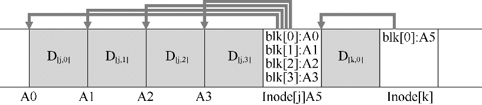

* 要缓冲多少

  * 摊销（amortize）、有效写入速率（Reffective）
  * 有效速率与峰值速率的比值是某个分数F，其中 0 < F <1

* 问题：查找inode

  * 典型的做法是数组索引，而在 FFS 中，必须知道每个 inode 块的大小和每个 inode 的起始地址。

* 通过间接解决方案：inode映射

  * inode映射（inode map，imap）、间接层（level of indirection）、

* 检查点区域（checkpoint region，CR）

  * 定期更新（如 30 s）

  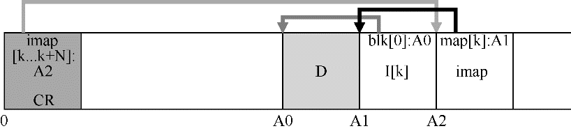

* 从磁盘读取文件：回顾

  * 在通常情况下，从磁盘读取文件时，LFS应执行与典型文件系统相同数量的 I/O，整个 imap 被缓存，因此LFS在读取过程中所做的额外工作是在 imap 中查找 inode 的地址。

* 目录如何

  * 递归更新问题（recursive update problem，指更新 inode 时，导致目录递归更新，而 LFS 避免了这个问题）

* 一个新问题：垃圾收集

  * 垃圾（garbage）、活的（live）、版本控制文件系统（versioning file system）、最新活版本、清理（clean）、垃圾收集（garbage collection）、空闲洞（hole）、按段工作

* 确定块的死活

  * 段摘要块（segment summary block，可直接确定块的死活）、版本号（version number）
  * 通过在磁盘上的段中记录版本号，LFS可以简单地通过将磁盘版本号与imap中的版本号进行比较，跳过上述较长的检查，从而避免额外的读取。

* 策略问题：要清理哪些块，何时清理

  * 合适清理：要么是周期性的，要么是空闲时间，要么是因为磁盘已满。
  * 分离冷热段、热段、冷段、试探算法
  * 结论参考：尽快清理冷段，延迟清理热段。

* 崩溃恢复和日志

  * 日志（log）、LFS 的两个 CR、谨慎的协议、最后一致快照、前滚（roll forward，即重建其中许多段）
  * 前滚：从最后一个检查点区域开始，找到日志的结尾（包含在CR中），然后使用它来读取下一个段，并查看其中是否有任何有效更新。

* 疑问 / 感悟

  * 举个例子，一个磁盘的定位时间为 10ms，峰值传输速率为 100MB/s。假设我们希望有效带宽达到峰值的 90%（F = 0.9）。在这种情况下，D = 0.9×100MB/s×0.01s= 9MB。请尝试一些不同的值，看看需要缓冲多少才能接近峰值带宽，达到95%的峰值需要多少，达到 99% 呢？

* 摘录

  * 但是，对于写入，文件系统总是有一个选择，而这正是我们希望利用的选择。
  * 有时，在学习这些系统时，你会对自己说，“哦，我抓住了一般的想法，其余的只是细节说明。”你这样想时，对事情是如何运作的只是一知半解。不要这样做！很多时候，细节至关重要。
  * 一般的想法很容易理解，但要真正构建一个能工作的系统，必须仔细考虑所有棘手的情况。
  * 人们常说，计算机科学中所有问题的解决方案就是一个间接层。这显然不是真的，它只是大多数问题的解决方案。
  * 清理成为LFS争议的焦点，对清理成本的担忧[SS+95]可能限制了LFS开始对该领域的影响。
  * 每当你的系统存在根本缺点时，请看看是否可以将它转换为特征或有用的功能。
  * 影子分页（shadow paging）、写时复制（copy-on-write）、快照（snapshots）

2023/07/11 20:20:46

------

### 第44章 数据完整性和保护

* 关键问题：如何确保数据完整性
  * 可靠性、数据完整性（data integrity）、数据保护（data protection）
* 磁盘故障模式
  * 故障—停止（fail-stop）模型、单块故障、潜在扇区错误（Latent-Sector Errors，LSE）、块讹误（block corruption）
  * 磁头碰撞（head crash，讹误表面）、宇宙射线、纠错码（Error Correcting Code，ECC）、讹误（corrupt）、无声的故障（silent fault）、故障—部分（fail-partial）磁盘故障模型
  * “廉价” 驱动器（通常为 SATA 驱动器）、“昂贵” 驱动器（通常为 SCSI 或 FibreChannel）
* 处理潜在的扇区错误
  * 关键问题：如何处理潜在的扇区错误
  * 标准冗余机制、重建（reconstruct）磁盘、额外冗余度、RAID-DP、NetApp WAFL文件系统
* 检测讹误：校验和
  * 关键问题：尽管有讹误，如何保护数据完整性
  * 校验和（checksum，数据内容的小概要）、没有免费午餐（TNSTAAFL）、碰撞（collision）、最小化碰撞机会
  * 常见的校验和函数
    * 保护 VS 成本、基于 XOR 的校验和、二进制补码加法校验和
    * Fletcher 校验和（Fletcher checksum，可以检测所有单比特错误，所有双比特错误和大部分突发错误）
    * 循环冗余校验（CRC，二进制模运算）
  * 校验和布局
    * 最基本的方法就是为每个磁盘扇区（或块）存储校验和。
    * 打包的校验和（效率较低，一次读取和两次写入）
* 使用校验和
  * 存储的校验和（stored checksum，Cs）、计算的校验和（computed checksum，Cc）、冗余副本、返回错误
* 一个新问题：错误的写入
  * 关键问题：如何处理错误的写入
  * 一般情况的讹误块、“错误位置的写入（misdirected write）”、物理标识符（Physical Identifier，物理ID）、磁盘号和扇区偏移量、双磁盘系统、绘图比例
* 最后一个问题：丢失的写入
  * 关键问题：如何处理丢失的写入
  * 丢失的写入（lost write）、写入验证（write verify）/ 写入后读取（read-after-write，非常慢）、Sun 的 Zettabyte 文件系统（ZFS）
* 擦净
  * 保持未检查状态、数据位衰减、磁盘擦净（disk scrubbing）、定期读取块（每晚或每周）
* 校验和的开销
  * 空间
    * 磁盘（或其他存储介质）本身
    * 系统的内存
  * 时间（非常明显）
    * 采用一种降低CPU开销的方法，将数据复制和校验和组合成一个简化的活动。
    * 外部 I/O 开销（尤其是分开存储）
* 疑问 / 感悟
  * 没有完美的校验和，是否可以做一个混合校验和，在开销与稳定性之间，取得折中？
* 摘录
  * 不同的校验和可以防止不同类型的故障。
  * 与业界合作可以带来更有趣、有实际意义的研究，这是一个很好的例子。
  * 新的故障模式、容错系统、额外冗余、全磁盘故障/部分磁盘故障问题

2023/07/12 22:19:12

------

### 第45章 关于持久的总结对话

* 摘录
  * 你学到了什么？
    * 掌握了一个要点，即长期（持久）管理数据比管理非持久数据（如内存中的内容）要困难得多。
  * 即使简单的事情，例如更新持久存储设备，也很复杂，因为你必须关心如果崩溃会发生什么。恢复，这是我们在虚拟化内存时从未想过的东西，现在是一件大事！
  * 考虑局部性总是有用的。因此，尽管技术可能正在发生变化，但我们研究的许多想法至少在一段时间内仍将继续有用。
  * 有趣且有挑战性的问题、磁盘调度、数据保护技术（RAID、校验和）、最新的擦除代码、数学、Flash转换层（FTL）
* 用一个大类（一个高层抽象）来把控多个小概念，是一种必要且非常重要的学习方法。
  * 正如当时钻进去技术细节的时候，不太理解 RAID 是干嘛的，但能基本理解校验和的思想，而最后，当意识到两者都是数据保护技术，那就有了一个基本的类比理解了。

------

### 第46章 关于分布式的对话

* 摘录
  * 分布式系统、分布式文件系统
  * 有一个桃子，这一次，它离你很远，可能需要一些时间才能拿到桃子。而且有很多桃子！更糟糕的是，有时桃子会腐烂。但你要确保任何人咬到桃子时，都会享受到美味。
  * 构建分布式系统很难，因为事情总是会失败。消息会丢失，机器会故障，磁盘会损坏数据，就像整个世界都在和你作对！
  * 这些公司在他们的系统中构建了大量的机器，确保即使某些机器出现故障，整个系统也能保持正常运行。
  * 复制，重试，以及各种其他技巧。越来越多用于检测故障，并从故障中恢复。

2023/07/13 14:58:54

------

### 第47章 分布式系统

* 关键问题：如何构建在组件故障时仍能工作的系统
  * 简单形式的客户端 / 服务器（client / server）分布式系统、故障（failure，核心挑战）、性能（performance）、安全（security）、通信（communication）、基本原语、高级原语
  * 提示：通信本身是不可靠的
* 通信基础
  * 现代网络的核心原则：通信基本是不可靠的。
  * 广域 Internet、Infiniband（局域高速网络）、丢弃（drop）
  * 原因：更基本的是由于网络交换机、路由器或终端节点内缺少缓冲，而导致数据包丢失。
* 不可靠的通信层
  * 基本的不可靠消息传递层、端到端的论点（end-to-end argument）、不可靠层、UDP / IP网络栈、套接字（socket）、通信端点（communication endpoint）、UDP 数据报（datagram）
  * 提示：使用校验和检查完整性
    * 校验和的评估：有效性、性能
* 可靠的通信层
  * 确认（acknowledgment，ack）、超时 / 重试（timeout / retry）、只接收一次（exactly once）、检测重复的消息、唯一 ID、顺序计数器（sequence counter）、TCP / IP
* 通信抽象
  * 提示：小心设置超时值
  * 消息传递层、抽象通信、数据包丢失、服务器过载、自适应方式、指数倒退（exponential back-off）、Aloha 网络、以太网（早期）、分布式共享内存（Distributed Shared Memory，DSM）
  * 分布式共享内存：使得不同机器上的进程能够共享一个大的虚拟地址空间。
  * 大多数 DSM 系统的工作方式是通过操作系统的虚拟内存系统（这种方法今天并未广泛使用，DSM 最大的问题是它如何处理故障）
* 远程过程调用（RPC）
  * 基于远程过程调用（Remote Procedure Call，RPC）
  * RPC 系统两部分
    * 存根生成器（stub generator / 协议编译器，protocol compiler）
    * 运行时库（run-time library）
  * 存根生成器
    * 目标：通过自动化，消除将函数参数和结果打包成消息的一些痛苦。
    * 客户端存根（client stub）、RPC 服务、参数的封送处理（marshaling）/ 消息的序列化（serialization）、RPC运行时库、同步的（synchronous）、解封送处理（unmarshaling）/ 反序列化（deserialization）、RPC 编译器、并发性的服务器组织方式、线程池（thread pool）、编程复杂性
  * 运行时库
    * 命名（naming）问题、主机名、IP 地址、协议套件、可靠的协议（如 TCP / IP）、不可靠的通信层（UDP / IP）、可靠性的责任
  * 其他问题
    * RPC 的运行时、大参数的过程调用、发送方分组（fragmentation，较大的包分成一组较小的包）、接收方重组（reassembly，较小的部分组成一个较大的逻辑整体）、字节序（byte ordering）、大端序（big endian）、小端序（little endian）、Sun 的 RPC 包、XDR（eXternal Data Representation，外部数据表示）层、同步（synchronously）、异步（asynchronously）
  * 补充：端到端的论点（end-to-end argument）
    * “端到端” 检查、端到端可靠性检查
* 疑问 / 感悟
  * “想象一下数据包到达路由器。对于要处理的数据包，它必须放在路由器内某处的内存中。如果许多此类数据包同时到达，则路由器内的内存可能无法容纳所有数据包。”
    * 受限于接收者的信道带宽，就像学习一样，本质都是信息的端到端处理，自然会有物理层面（生理结构同理）的客观限制。但如果是光速呢？光速是不变的，但万物对于光和光速的感知是不同的，还是受限于接收者的带宽（此处为对光的感知能力，正如我们不能目测光速一样）。
  * 如何理解端到端论点中的 “系统中的最高层（通常是“末端”的应用程序）最终是分层系统中唯一能够真正实现某些功能的地方” ？
* 摘录
  * 有效性和性能通常是不一致的，这意味着高质量的校验和通常很难计算。生活并不完美，又是这样。
  * 通信是所有分布式系统的核心。
  * 真正理解RPC包的最好方法，当然是亲自使用它。
  * 存根编译器 rpcgen（Sun 的 RPC 系统）、ALOHA 网络、指数倒退、重传、共享总线以太网网络通信、远程方法调用（RMI）

2023/07/23 20:49:35 完成笔记

------

### 第48章 Sun 的网络文件系统（NFS）

* 关键问题：如何构建分布式文件系统
  
  * 共享（sharing）、集中管理（centralized administration）、安全（security）
  
  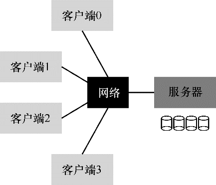
  
* 基本分布式文件系统
  * **客户端文件系统**（client-side file system）、透明（transparent）访问、服务器端文件系统（server-side file system / **文件服务器** file server）、Sun 的网络文件系统（NFS）、停电（power outage，暂时的）、被分割（partitioned）
  * 补充：为什么服务器会崩溃
  * 分布式文件系统体系结构
  
  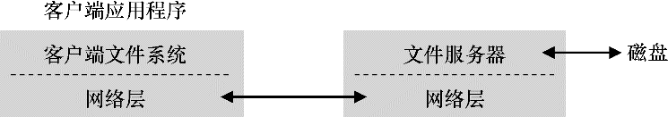
  
* 交出 NFS
  
  * 开放协议（open protocol）、消息格式、NFS服务器
  * NFS服务器（如 Oracle / Sun、NetApp、EMC、IBM等）
  
* 关注点：简单快速的服务器崩溃恢复
  
  * NFS 协议
  * NFSv2 协议的主要目标是 “简单快速的服务器崩溃恢复”
  
* 快速崩溃恢复的关键：无状态
  
  * 无状态（stateless）协议、有状态（stateful）协议、文件描述符、共享状态（shared state / Ousterhout 称为分布式状态 distributed state）、恢复协议（recovery protocol）
  
* NFSv2 协议
  * 关键问题：如何定义无状态文件协议
  * 文件句柄（file handle）
    * 用于唯一地描述文件或目录。
    * 3 个组件：卷标识符、inode 号、世代号
  * NFS挂载协议（mount protocol）
  
* 从协议到分布式文件系统
  
  * 协议消息集、追踪
  * 每个服务器请求如何包含完成请求所需的所有信息
  * 提示：幂等性（idempotency）很强大：重试即可完成需求
  
* 利用幂等操作处理服务器故障

  * 重试请求（唯一、统一、优雅）、幂等的（idempotent）
  * NFS 崩溃恢复的核心：大多数常见操作具有幂等性
  * 3 中类型丢失

  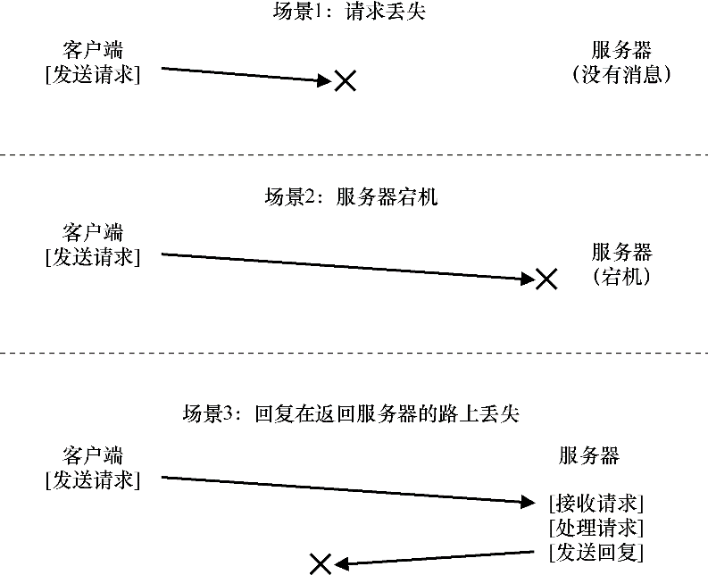

  * 可以用统一的方式处理所有超时、一些操作很难成为幂等的
  * 提示：完美是好的敌人（Voltaire 定律）
    * 有时候并非所有的特殊情况都像你期望的那样。
    * 但是，为什么要这么麻烦？NFS的设计理念涵盖了大多数重要情况，它使系统设计在故障方面简洁明了。因此，接受生活并不完美的事实，仍然构建系统，这是良好工程的标志。
    * Voltaire：“一个聪明的意大利人说，最好是好的敌人。”

* 提高性能：客户端缓存
  
  * 客户端缓存（caching）、写入的临时缓冲区、写缓冲（write buffering）、文件服务器
  * 虽然第一次访问是昂贵的（即它需要网络通信），但后续访问很快就从客户端内存中得到服务。
  
* 缓存一致性问题（cache consistency problem）
  
  * 定义：在任何系统中添加缓存，导致包含多个客户端缓存，都会引入一个巨大且有趣的挑战。
  * “更新可见性（update visibility）”、陈旧的缓存（stale cache）、“关闭时刷新”（flush-on-close，即close-to-open）、一致性语义、属性缓存（attribute cache）
  
  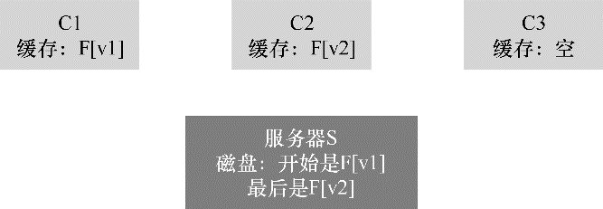
  
* 评估 NFS 的缓存一致性

  * 可观察的语义
  * 具体来说，如果在客户端上创建临时或短期文件，然后很快删除，它仍将被强制写到服务器。更理想的实现可能会将这些短暂的文件保留在内存中，直到它们被删除，从而完全消除服务器交互，提高性能。
  * 更重要的是，NFS加入属性缓存让它很难知道或推断出得到文件的确切版本。有时你会得到最新版本，有时你会得到旧版本，因为属性缓存没有超时，因此客户端很高兴地提供了客户端内存中的内容。

* 服务器端写缓冲的隐含意义

  * 客户端缓存（重点）、WRITE协议
  * 因为服务器在提交到磁盘之前，告诉客户端第二次写入成功，所以文件中会留下一个旧块，这对于某些应用程序，可能是灾难性的。
  * 为了避免这个问题，NFS服务器必须在通知客户端成功之前，将每次写入提交到稳定（持久）存储。

* 感悟 / 疑问

  * 缓存，相当于一次数据快照，具有“本地”的性质，这样可大大提高访问的性能。

* 摘录
  
  * 更严肃的身份验证服务、轻松伪装、安全问题
  * NFS的核心在于，服务器的故障要能简单快速地恢复。
  * 操作的幂等性至关重要，因为客户端可以安全地重试失败的操作，不论服务器是否已执行该请求，都可以这样做。
  * 一个好的工程原则，是为常见情况而设计，让它运作良好。这里，尽管常见情况是文件只由一个客户端访问（可能反复访问），但该客户端必须一直向服务器发送GETATTR请求，以确没人改变该文件。客户因此“轰炸”了服务器，不断询问“有没有人修改过这个文件？”，大部分时间都没有人修改。

2023/07/19 21:33:36 未整理，2023/07/23 20:33:30 完成笔记

------

### 第49章 Andrew 文件系统（AFS）

* Andrew 文件系统的主要目标：扩展（scale）

* AFS 版本 1
  
  * ITC 分布式文件系统、本地磁盘（local disk）、全文件缓存（whole-file caching）、Venus（AFS 客户端代码）、Fetch 协议消息、Vice 组（文件服务器）、块副本、Store 协议消息
  * 与 NFS 的明显不同：NFS缓存块（不是整个文件，虽然NFS当然可以缓存整个文件的每个块），并且缓存在客户端内存（不是本地磁盘）中。
  * AFSv1 协议的要点
  
  
  
* 版本 1 的问题
  * 测量（measurement）、取代直觉
  * 提示：先测量后构建（Patterson定律，即取得更科学的尝试）
  
* 改进协议
  * 背景：AFS 可扩展性受限
  * 关键问题：如何设计一个可扩展的文件协议
  * 问题
    * 路径查找成本过高；
    * 客户端发出太多 TestAuth 协议消息；
    * 负载不平衡问题（卷，volume）；
  
* AFS 版本 2
  * 回调（callback）、状态（state）、轮询（polling）、中断（interrupt）、文件标识符（File Identifier，FID）
  * 与 NFS 的关键区别：每次获取目录或文件时，AFS 客户端都会与服务器建立回调，从而确保服务器通知客户端，其缓存状态发生变化。
  * 补充：缓存一致性不能解决所有问题
    * 代码存储库、文件级锁（file-level locking）
  
* 缓存一致性
  
  * 更新可见性（update visibility）、缓存陈旧（cache staleness）、基于典型的 UNIX 语义、“最后写入者胜出” 方法（last writer win / “最后关闭者胜出” last closer win）、基于块的协议（如 NFS）
  
* 崩溃恢复
  
  * 在服务器重新启动时，服务器的每个客户端必须意识到服务器已崩溃，并将其所有缓存内容视为可疑，并且（如上所述）在使用之前重新检查文件的有效性。
  * 心跳（heartbeat）消息
  
* AFSv2 的扩展性和性能
  
  * 比较：AFS与NFS
  * 假设
    * 假设中小型文件可以放入客户端的内存，大文件可以放入本地磁盘，但不能放入客户端内存。
    * 一般假设是 $L_{net} > L_{disk} > L_{mem}$。
    * 假设第一次访问文件没有任何缓存命中
  
  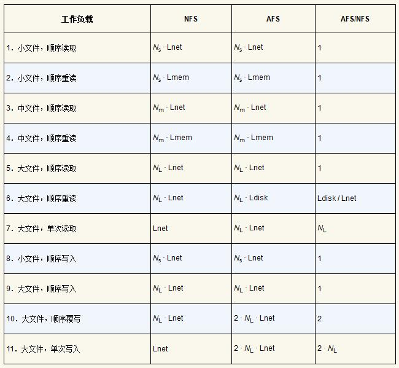
  
  * 观察结果
    * 首先，在许多情况下，每个系统的性能大致相当。
    * 其次，在大文件顺序重新读取时（工作负载6），出现了有趣的差异。
    * 第三，我们注意到，（新文件的）顺序写入应该在两个系统上性能差不多（工作负载8、9）。
    * 第四，我们注意到AFS在顺序文件覆盖（工作负载10）上表现较差。
    * 最后，访问大型文件中的一小部分数据的工作负载，在NFS上比AFS执行得更好（工作负载7、11）。
  
* AFS：其他改进
  
  * Berkeley FFS、选择工作负载（workload）
  * 补充：工作负载的重要性
  
* 疑问 / 感悟

* 摘录

  * 在NFS中，缓存一致性很难描述，因为它直接依赖于低级实现细节，包括客户端缓存超时间隔。在AFS中，缓存一致性很简单且易于理解：当文件打开时，客户端通常会从服务器接收最新的一致副本。
  * 一致性模型、CIFS（基于 Windows 的分布式文件系统协议）、NFSv4
  * AFS 告诉我们，构建分布式文件系统与我们在 NFS 中看到的完全不同。
  * 也许很不幸，AFS可能在走下坡路，但唯一持久的影响可能来自AFS的想法，而不是实际的系统本身。

2023/07/23 20:15:54

------

### 第50章 关于分布式的总结对话

* 摘录
  * 一切都会失败。
  * 但是通过拥有大量这些东西（无论是磁盘、机器还是其他东西），可以隐藏出现的大部分失败。
  * 必须仔细考虑协议：机器之间交换的确切数据位。
  * 对齐、O_TRUNC标志

------

