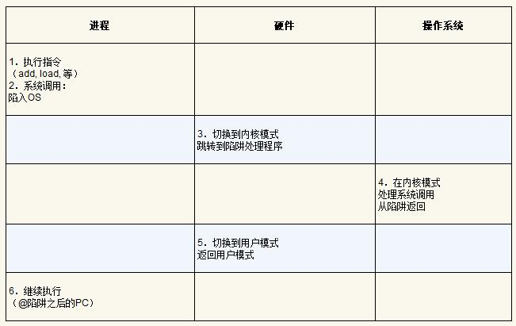
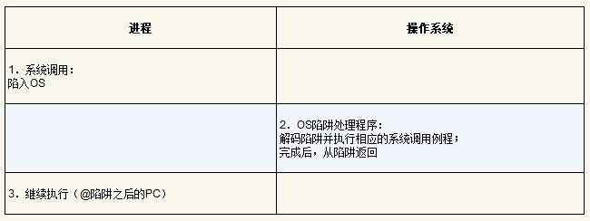
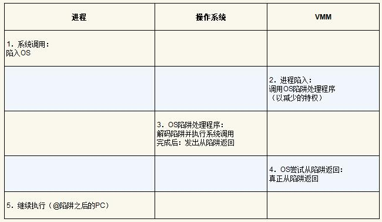
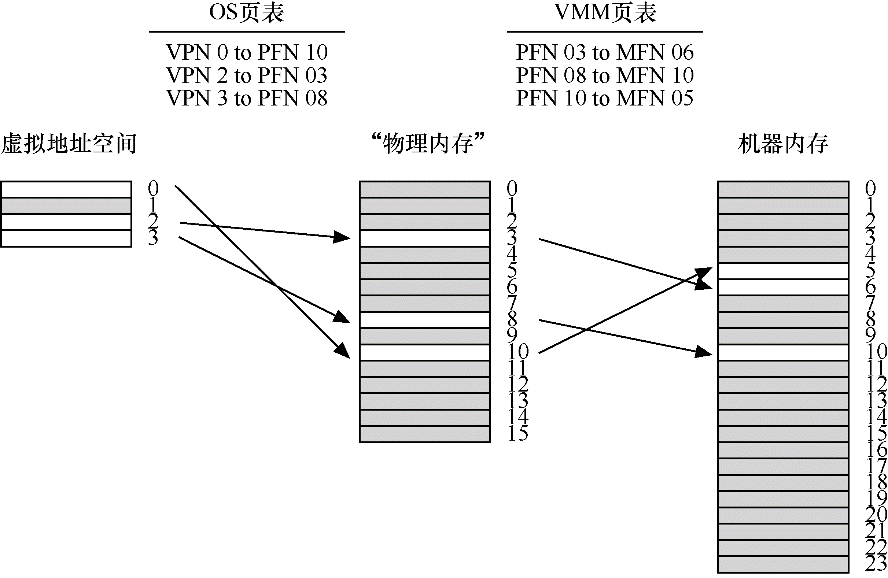
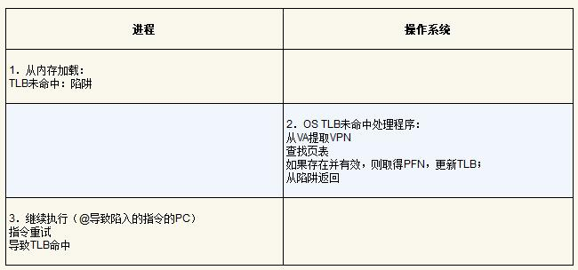
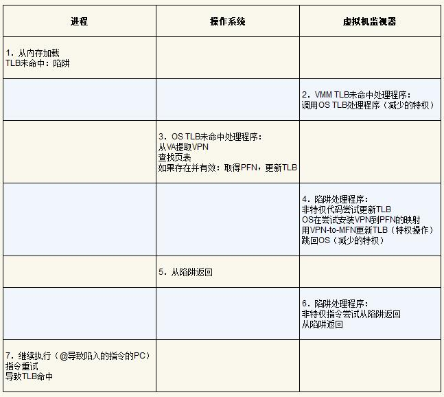

## 04 附录

Date：2023/07/23 20:55:06

------

[TOC]

------

### 附录 A 关于虚拟机监视器的对话

* 虚拟机监视器（virtual machine monitor）/ 虚拟机管理程序（hypervisor）
* 将了解VMM如何在系统中添加另一层虚拟化。
* 它应该被包括在内，因为如果你能理解 VMM 是如何工作的，那就真的非常了解虚拟化了。

------

### 附录 B 虚拟机监视器

* 简介
  
  * 虚拟机监视器（Virtual Machine Monitor，VMM）/ 管理程序（hypervisor）
  * 操作系统仍然认为它与物理硬件交互。因此，透明度（transparency）是VMM的主要目标。
  * 假象提供大师：让它们认为拥有自己私有的CPU和大型虚拟内存，同时在应用程序之间进行切换，并共享内存。
  * 关键问题：如何在操作系统之下虚拟化机器
  
* 动机：为何用VMM
  
  * 原因：服务器合并，测试和调试
  * 合并（consolidate）、功能（functionality）、MIPS 处理器、虚拟机监视器 Disco
  
* 虚拟化CPU
  
  * 虚拟机（virtual machine，即 OS 及其应用程序）、受限直接执行（limited direct execution）、机器切换（machine switch）、管理员模式
  
  
  
  * VMM并不真正知道如何（how）处理调用。然而，VMM知道的是OS的陷阱处理程序在哪里（where）。
  * 没有虚拟化的系统调用流程
  
  
  
  * 有虚拟化的系统调用流程
  
  
  
* 虚拟化内存
  
  * 线性的页面数组、机器内存（machine memory）、额外间接层、机器帧、地址转换（address translation）、虚拟地址（virtual address）、物理地址（physical address）、VMM 级别的 “软件 TLB”
  * VMM内存虚拟化
  
  
  
  * 实际上，运行的是VMM TLB未命中处理程序，因为VMM是机器的真正特权所有者。但是，在正常情况下，VMM TLB处理程序不知道如何处理TLB未命中，因此它立即跳转到OS TLB未命中处理程序。
  * 没有虚拟化的 TLB 未命中流程
  
  
  
  * 有虚拟化的 TLB 未命中流程
  
  
  
  * VMM 必须跟踪它运行的每个虚拟机的物理到机器映射
  * 补充：管理程序和硬件管理的TLBS
    * 有硬件管理的TLB时，虚拟机监视器如何参与？
    * 作为替代，VMM必须密切监视操作系统对每个页表的更改（在硬件管理的系统中，由某种类型的页表基址寄存器指向），并保留一个影子页表（shadow page table），它将每个进程的虚拟地址映射到VMM期望的机器页面
  
* 信息沟（information gap）
  * 空循环（idle loop）、半虚拟化（para-virtualization，不完整，需 OS 更改才能有效运行的部分虚拟化）、页面按需置零
  * 推理（一种隐含信息，implicit information）
    * 例如，VMM 可以通过注意到 OS 切换到低功率模式来检测空闲循环。
  
* 疑问 / 感悟

* 摘录

  * 在这两种情况下，研究人员都开发了强大的推理技术，来隐式收集所需的信息，而无需在层之间建立明确的接口。
  * 关键的区别：通过操作系统虚拟化，提供了许多新的抽象和漂亮的接口。完全不同的接口，且 VMM 没有特别打算让硬件更易于使用。
  * 最好的例子：使用基于概率探测器的技术确定在 OS 中缓存哪些文件块。
  * 虚拟化硬件、BSD 开发者手册、Xen 虚拟机监视器、系统容忍度

2023/07/26 21:47:42 未整理笔记，2023/07/27 17:41:25 完成笔记

------

### 附录 C 关于监视器的对话

* 监视器（monitor，老的并发原语，旨在将锁自动合并到面向对象的程序中）、C 编程、POSIX 线程库、

------

### 附录 D 关于实验室的对话

* 摘录
  * 实际编程，做一些真正的工作，而不是这种不间断的谈话和阅读，才是真正的学习方式！
  * l两类项目：系统编程项目、基于一个真正的内核
  * 通过这些项目，你实际上可以重新编写内核的一部分，而不是编写与内核交互的代码（就像在系统编程中那样）。

------

### 附录 E 实验室：指南

* 

------

### 附录 F 实验室：系统项目

* 

------

### 附录 G 实验室：xv6项目

* 

------

