### 《Qt6.0 开发指南》各章总结

Date：2024/04/06 2:27:01

------


[TOC]


------


### C00 资源

* [B站《Qt6 C++开发指南 》2023（上册，完整版）](https://www.bilibili.com/video/BV1km4y1k7CW?p=5&spm_id_from=pageDriver&vd_source=1e9ce768698d539dc8e4dbecfe72afaa) 

* 《Qt6 C++开发指南 》


------


### C01 认识Qt

* 概括
  * 本章介绍了 Qt 的历史（1995）、主流用法、目标平台、LTS版本特性（5.15 / 6.2），以及使用 Qt 开发的注意事项（许可与开源），并且结合 Qt 版本选择，提供了安装、demo 试运行的示例，最后编写了 Qt 的 Hello World 程序。
* 概念
  * 跨平台应用开发框架、类库、交叉编译开发方式、仿真器、主机、重新编译（即实现跨平台）、原生二进制代码（高效）、交叉编译开发环境、许可类型、语言支持（信号、槽、属性、QML、QML类型、Qt Quick）、对象树（用户界面）、LTS
* 注意
  * Qt 实质上是用 C++编写的**大型类库**，它为跨平台应用开发提供了一个完整的框架。
  * Qt 为计算机、移动设备、嵌入式设备、微控制单元（microcontroller unit，MCU，又称单片机）等目标设备开发程序——**目标平台**。
  * 嵌入式设备：需要先在计算机上编写源程序，然后使用针对目标平台的编译器编译代码，再将编译出的二进制文件下载到目标设备上运行。
  * 针对某个目标平台开发应用，必须使用对应主机平台的 Qt（Win、macOS、Linux等对应）。

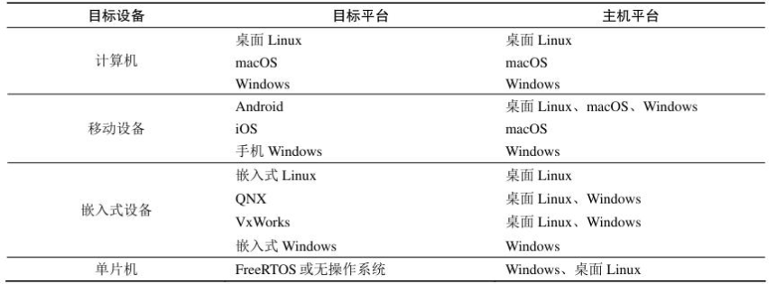

* 许可类型
  * 商业许可（年费、可不公开源代码、更多模块）
  * 开源许可
    * GPLv2/GPLv3（必须开源，可商销，3要求公开硬件信息）
    * LGPLv3（若仅库形式链接 / 调用许可的代码，可闭源，可商售）
* 语言支持
  * C++为主，还对标准 C++语言进行了扩展，引入了**信号与槽、属性**等机制，为跨平台和 GUI 程序的**对象间通信**提供了极大的方便。
  * 自创 QML，类似于 JavaScript 的声明性语言。
  * Python
* 新特性
  * Qt 5.0（2012，C++98，简单修补无法满足，Qt 5.15 LTS）
  * Qt 6.0（2020，C++17，底层更新、核心库、Unicode、QList类、QMetaType重写、QVariant重写、Rendering Hardware Interface、CMake、Qt 6.2 LTS、Charts、Data Visualization、Bluetooth、Multimedia、Serial Port）
* Qt 安装
  * 详细介绍了 Qt 安装界面的各参数与选项。
  * https://www.qt.io/download-open-source
  * 显示各种历史版本，勾选 Archive 复选框。
  * 工具 CMake、MinGW、Ninja、Qt Creator 和 Qt Installer Framework

* Qt 的 Hello World 程序
  * widget（UI）——qmake（.pro）
  * debug：若 cmd 使用 doskey 设置命令行别称，需要在 Qt 的 Makefile 里面删除自动识别出来的这几行，否则会提示 "Makefile.Debug:251: error: multiple target patterns.  Stop."
  * **注意 Project 路径不要有中文** 

```makefile
# 需删除中间几行
ui_widget.h: ../../widget.ui \
		D:/Qt/6.2.0/mingw81_64/bin/uic.exe \
		. \
		../../../04helloworld>doskey\ /macrofile$(EQ)D:/02Packages/cmdAlias/alias.ini\ 
	D:\Qt\6.2.0\mingw81_64\bin\uic.exe ..\..\widget.ui -o ui_widget.h

# 结果如下，正常运行
ui_widget.h: ../../widget.ui 
	D:\Qt\6.2.0\mingw81_64\bin\uic.exe ..\..\widget.ui -o ui_widget.h
```

* 运行（**三角 / ctrl + R**）

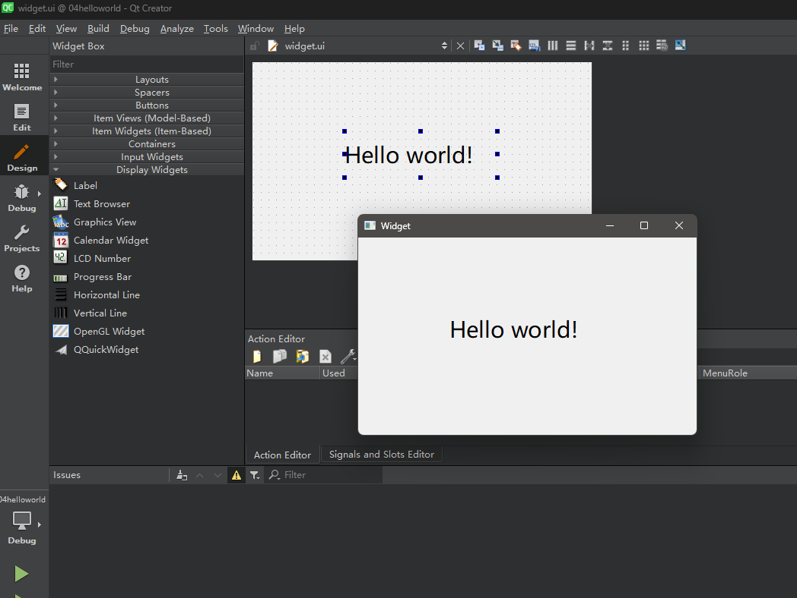


* 2024/04/06 19:28:31

------


### C02 GUI程序设计基础

#### 2.1 GUI 程序结构与运行机制

* 信息补全
  * Makefile：`$${TARGET}` 为可替换内容，`$$` 为替换函数前缀
  * qmake Manual
  * 属性（is-a 关系）：属性列表中，自下而上表示了**类的继承关系**，例如
    * QLabel is a QFrame、QFrame is a QWidget、QWidget is a QObject
  * UI_Widget 为类型的指针，可以操作与之相关的一切可见组件
* GUI 程序结构

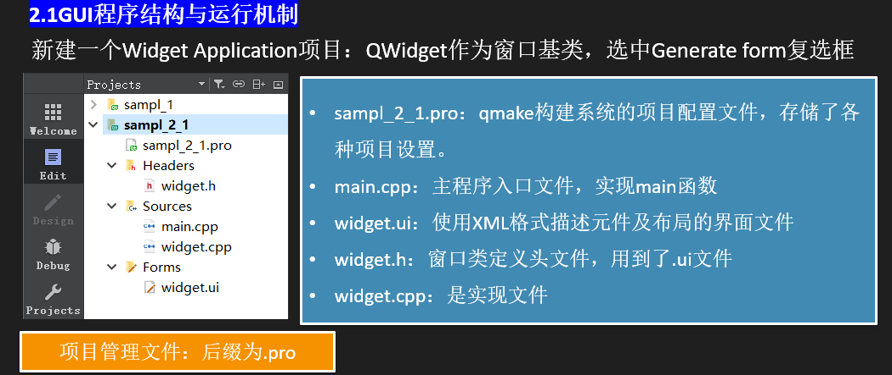

* qmake 代码示例

```makefile
QT      += core gui

greaterThan(QT_MAJOR_VERSION, 4): QT += widgets

CONFIG  += c++17

SOURCES += main.cpp \
		   widget.cpp
		   
HEADERS += widget.h

FORMS   += widget.ui

# Default rules for deployment.
qnx: target.path = /tmp/$${TARGET}/bin
else: unix:!android: target.path = /opt/$${TARGET}/bin
!isEmpty(target.path): INSTALLS += target
```

* qmake 配置文件（qmake Manual）

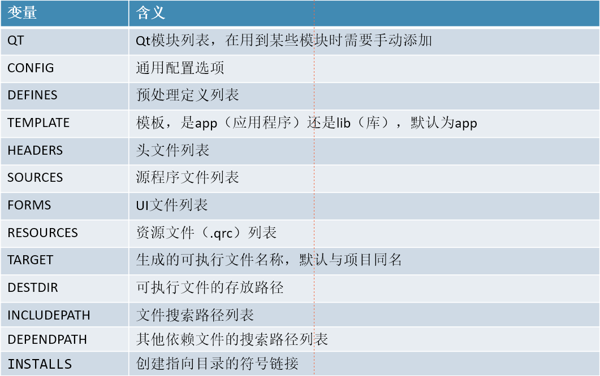

* Qt 界面结构

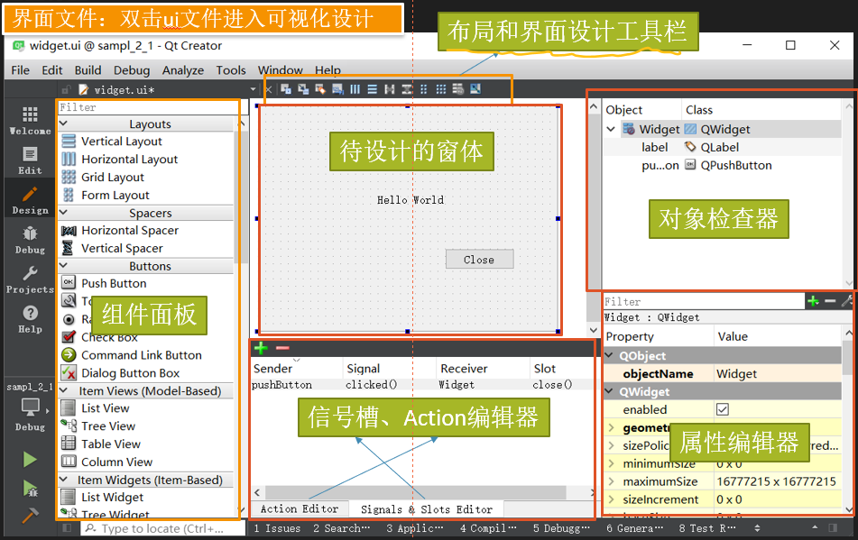

* main.cpp

```cpp
#include "widget.h"
#include <QApplication>

int main(int argc, char *argv[])
{
    QApplication a(argc, argv); //定义并创建应用程序 
    Widget w;  					//定义并创建窗口 
    w.show(); 					//显式窗口 
    return a.exec();			//应用程序运行，开始消息循环和事件处理 
}
```

* widget.cpp

```cpp
#include "widget.h"
#include "ui_widget.h"

Widget::Widget(QWidget *parent)
    : QWidget(parent)
    , ui(new Ui::Widget)
{
    ui->setupUi(this);
    ui->label->setText("你好！");
    ui->pushButton->setText("关闭");
}

Widget::~Widget()
{
    delete ui;
}

```

* 运行

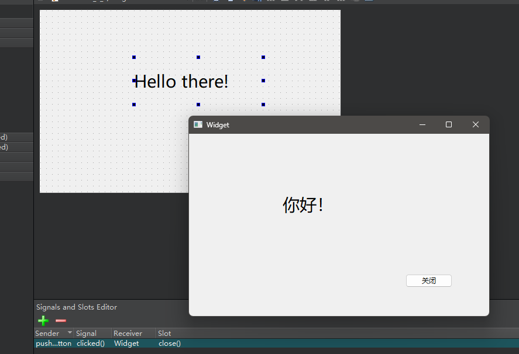

* 2024/04/06 20:28:24 至 P5

------


#### 2.2 可视化 UI 设计

* 信息补全
  * 信号、槽、元对象编译器、预处理、C++标准程序
* Qt 项目构建过程

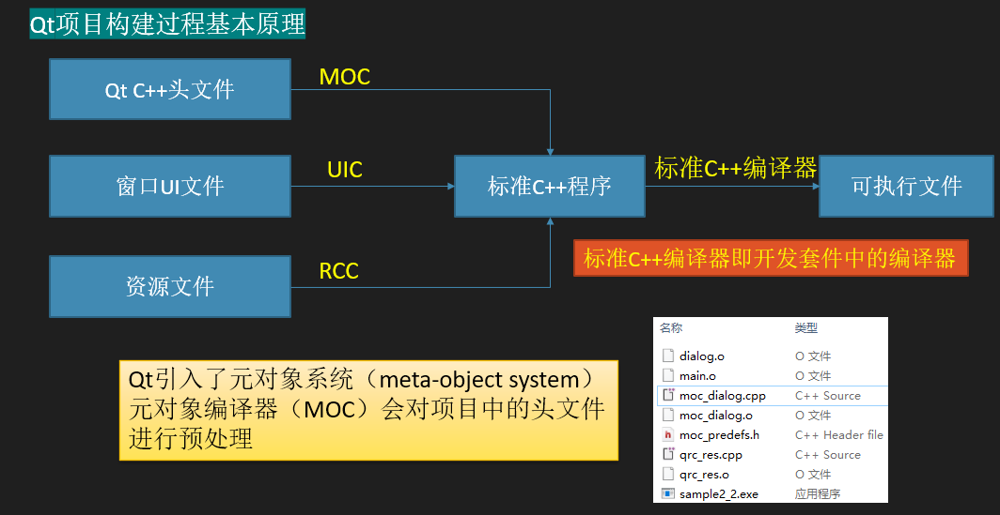

* 添加资源文件（.qrc）
  * 之前由于使用 doskey 产生的编译 bug，这里依然会产生许多不必要的问题，因此取消了 cmd 自定义命令，并清理了相关注册表，问题解决。

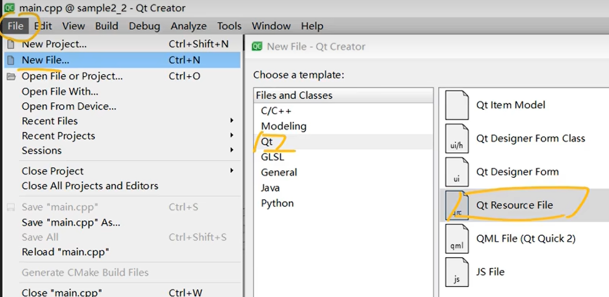

* 已用组件
  * Input Widgets: Plain Text Edit
  * Buttons: Push Button、Radio Button、Check Box
  * Layouts: Horizontal Layout
* 相关操作
  * Rename button、Layouts
  * Signals and Slots Editor、Go to slot
  * 对头文件 F2 跳转至源文件
    *  `QMetaObject::connectSlotsByName(Dialog);` 自动添加绑定
  * F4 头文件与工作界面一键切换

------


#### 2.3 代码化 UI 设计

* 规范：如果能放 .cpp 里的头文件，就不要放 .h 里面（why？）
* Ctrl + Shift + R 变量全局重命名（对一个遍历快捷键，其后修改即可应用到全局位置）
* 自动创建定义（从类声明 .h 出发，在 .cpp 相应生成）

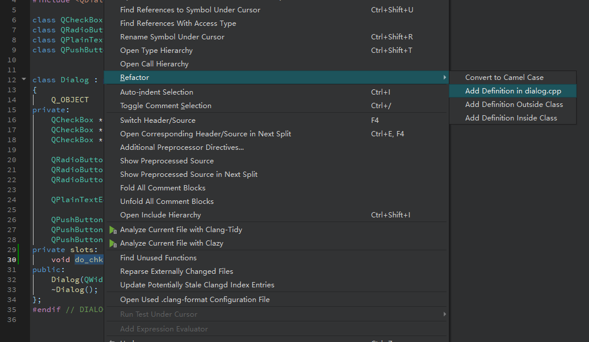

* 代码

```cpp
/* dialog.h */
#ifndef DIALOG_H
#define DIALOG_H

#include <QDialog>

class QCheckBox;
class QRadioButton;
class QPlainTextEdit;
class QPushButton;


class Dialog : public QDialog
{
    Q_OBJECT
private:
    QCheckBox *chkBoxUnder;
    QCheckBox *chkBoxItalic;
    QCheckBox *chkBoxBold;

    QRadioButton *radioBlack;
    QRadioButton *radioRed;
    QRadioButton *radioBlue;

    QPlainTextEdit *txtEdit;

    QPushButton *btnOK;
    QPushButton *btnCancel;
    QPushButton *btnClose;
private slots:
    void do_chkBoxUnder(bool checked);
    void do_chkBoxItalic(bool checked);
    void do_chkBoxBold(bool checked);

    void do_setFontColor();
public:
    Dialog(QWidget *parent = nullptr);
    ~Dialog();
};
#endif // DIALOG_H

```

* dialog.cpp 文件

```cpp
/* dialog.cpp */
#include "dialog.h"
#include <QHBoxLayout>
#include <QVBoxLayout>
#include <QCheckBox>
#include <QRadioButton>
#include <QPlainTextEdit>
#include <QPushButton>

void Dialog::do_chkBoxUnder(bool checked)
{
    QFont font = txtEdit->font();
    font.setUnderline(checked);
    txtEdit->setFont(font);
}

void Dialog::do_chkBoxItalic(bool checked)
{
    QFont font = txtEdit->font();
    font.setItalic(checked);
    txtEdit->setFont(font);
}

void Dialog::do_chkBoxBold(bool checked)
{
    QFont font = txtEdit->font();
    font.setBold(checked);
    txtEdit->setFont(font);
}

void Dialog::do_setFontColor()
{

    QPalette plet = txtEdit->palette();

    if (radioBlack->isChecked())
        plet.setColor(QPalette::Text, Qt::black);
    if (radioBlue->isChecked())
        plet.setColor(QPalette::Text, Qt::blue);
    if (radioRed->isChecked())
        plet.setColor(QPalette::Text, Qt::red);

    txtEdit->setPalette(plet);
}

Dialog::Dialog(QWidget *parent)
    : QDialog(parent)
{
    chkBoxUnder = new QCheckBox("下划线");
    chkBoxItalic = new QCheckBox("斜体");
    chkBoxBold = new QCheckBox("加粗");
    QHBoxLayout *HLay = new QHBoxLayout();
    HLay->addWidget(chkBoxUnder);
    HLay->addWidget(chkBoxItalic);
    HLay->addWidget(chkBoxBold);

    radioBlack = new QRadioButton("黑色");
    radioRed = new QRadioButton("红色");
    radioBlue = new QRadioButton("蓝色");
    QHBoxLayout *HLay2 = new QHBoxLayout();
    HLay2->addWidget(radioBlack);
    HLay2->addWidget(radioRed);
    HLay2->addWidget(radioBlue);

    txtEdit = new QPlainTextEdit;
    txtEdit->setPlainText("Hello world\n 手工创建！");
    QFont font = txtEdit->font();
    font.setPointSize(20);
    txtEdit->setFont(font);

    btnOK = new QPushButton("确定");
    btnCancel = new QPushButton("取消");
    btnClose = new QPushButton("退出");
    QHBoxLayout *HLay3 = new QHBoxLayout();
    HLay3->addWidget(btnOK);
    HLay3->addWidget(btnCancel);
    HLay3->addWidget(btnClose);

    QVBoxLayout *VLay = new QVBoxLayout();
    VLay->addLayout(HLay);
    VLay->addLayout(HLay2);
    VLay->addWidget(txtEdit);
    VLay->addLayout(HLay3);

    setLayout(VLay); // VLay 统一管理了3个HLay，于是原来的 setLayout(HLay); 删除


    // 信号与槽设置
    connect(chkBoxUnder, SIGNAL(clicked(bool)), this, SLOT(do_chkBoxUnder(bool))); // SLOT 参数，类似信号的 handler 函数？ | SIGNAL 参数名拼错了，居然没有提示
    connect(chkBoxItalic, SIGNAL(clicked(bool)), this, SLOT(do_chkBoxItalic(bool)));
    connect(chkBoxBold, SIGNAL(clicked(bool)), this, SLOT(do_chkBoxBold(bool)));

    connect(radioBlack, SIGNAL(clicked(bool)), this, SLOT(do_setFontColor()));
    connect(radioBlue, SIGNAL(clicked(bool)), this, SLOT(do_setFontColor()));
    connect(radioRed, SIGNAL(clicked(bool)), this, SLOT(do_setFontColor()));
    
    // button 不需要手动写槽函数，是 dialog 本身有的
    connect(btnOK, SIGNAL(clicked()), this, SLOT(accept()));
    connect(btnCancel, SIGNAL(clicked()), this, SLOT(reject()));
    connect(btnClose, SIGNAL(clicked()), this, SLOT(close()));

    setWindowTitle("手工打造UI");
}

Dialog::~Dialog() {}

```

* 本节成果

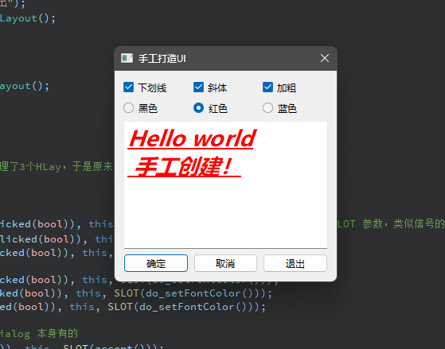

#### 2.5 Qt Creator 使用技巧

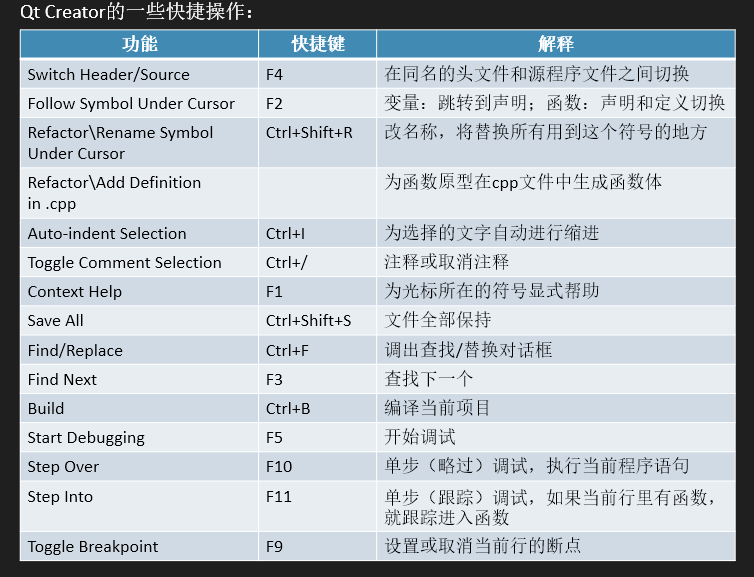

* 内容板块：
  * 快捷键分类：文件切换、名称修改、函数生成、自动排版、注释、查找、编译、调试
  * 项目管理（右键菜单）：Build、Rebulid、Clean、Run qmake/CMake
  * Clang 代码模型（Help-->About Plugins-->ClangCodeModel）：代码分析工具/大量报错或提醒

#### 2.0 小结

* 概括
  * 本章介绍了 Widget Application 项目，例如使用 Generate form 进行可视化 UI 设计，以及不使用 Gf 进行代码化的 UI 设计。实现过程中，引入了一般的 UI 设计范式、组件、代码约定，并由此展现了一个简单而全面的基本 UI 设计要素。

* 疑问 / 感悟
  * 已设置垂直布局的按钮（组），如何在内部调节按钮大小？
  * 水平布局后，如何选中内部组件，调整窗口两侧的留白空间？
  * 通过名称绑定
  * 代码配色方案
  * Qt 有比较简单的内容，但为了提升，还要学计算机图形学等知识
  * ~~如何理解 setLayout(HLay) 之后删除，再用 setLayout(VLay) 的操作？~~
    * VLay 统一管理了3个HLay, 于是原来的 setLayout(HLay) 删除
* **插曲（Qt 更换主题）**
  * Edit --> Preference
    * --> Environment --> Theme
    * --> Text Editor --> Visual Studio（copy | VS.xml）
  * [参考链接](https://blog.csdn.net/fhhbbhj/article/details/131035910) 
* 未完成
  * P10-11（2.4 CMake 项目构建）


* 2024/04/13 21:36:57
* 2024/04/15 2:29:50 完成第二章

------


### C03 Qt框架功能概述

#### 3.1 Qt 6 框架中的模块

* 基本模块（Qt Essentials）、附加模块（Qt Add-Ons | 用到再安装）

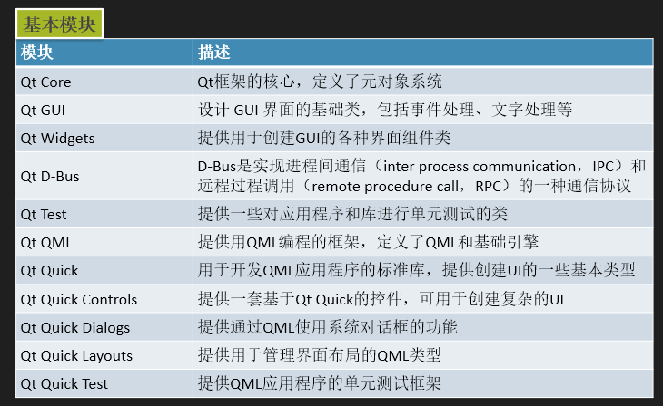

#### 3.2 全局定义

* 内容
  * `#include <QtGlobal>`：基本数据类型、函数、宏
  * 全局函数（大部分为数值比较函数 | `#include <QtMath> ` ）
  * 宏定义：
    * qDebug(const char *msg, ...)
    * QT_VERSION、QT_VERSION_STR
    * Q_BYTE_ORDER、Q_BIG_ENDIAN、Q_LITTER_ENDIAN
    * Q_DECL_IMPORT、Q_DECL_EXPORT
    * Q_UNUSED(name)、foreach(variable, container)
* 经验
  * 建议使用 Qt 数据类型，以便跨平台数据长度统一
  * 考虑到学习成本，实际开发也会使用 C++ 类型

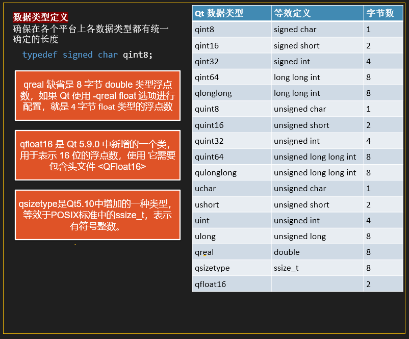

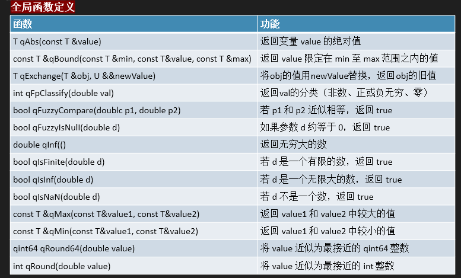

------


#### 3.3.1 Qt 元对象系统概述

* 内容
  * Qt 元对象系统（核心）：对标准 C++ 进行扩展。
* 概念
  * 基类、QObject（MOC识别，生成对应C++源文件）、MOC（Meta-Object Compiler | 转为 C++ 能看懂的标准语言）、预处理器
  * Object 类：元对象、类型信息、动态翻译、对象树、信号和槽、属性系统（便于语言移植，例如 QML）
  * QMetaObject 类（类似C++的RTTI /谷歌禁用 Runtime type information）

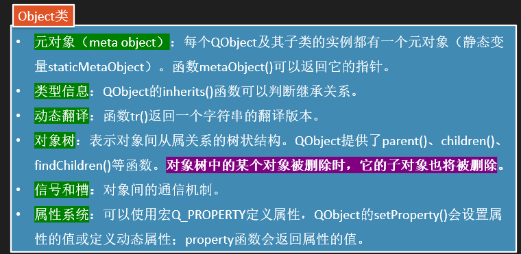

* 继承关系测试

```cpp
// 测试 QPushButton 的父类

#include "mainwindow.h"
#include <QApplication>
#include <QPushButton>
#include <QTimer>

int main(int argc, char *argv[])
{
    QApplication a(argc, argv);
    QObject *btn = new QPushButton;
    qDebug() << btn->metaObject()->className();

    QPushButton *pushbtn = qobject_cast<QPushButton*>(btn);
    qDebug() << pushbtn->metaObject()->className();

    QTimer *timer = new QTimer();
    qDebug() << timer->inherits("QTimer");
    qDebug() << timer->inherits("QObject");
    qDebug() << timer->inherits("QAbstractButton");
    qDebug() << btn->inherits("QAbstractButton");

    qDebug() << btn->metaObject()->superClass()->className(); // 返回父类元对象
}

/* >>>
QPushButton
QPushButton
true
true
false
true
QAbstractButton */
```

------


#### 3.3.2 属性系统

* 属性，类似成员变量，主要用于语言移植，有额外关键字

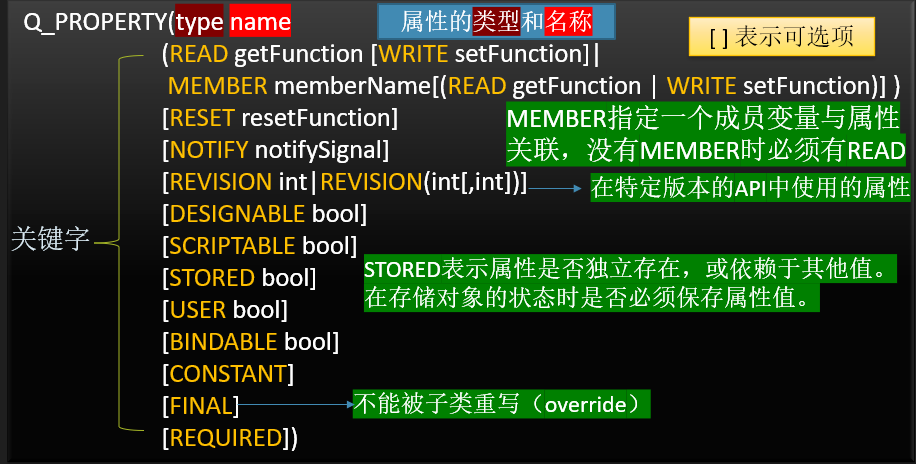

* 信息补充
  * 重载（overload） VS 重写（overwrite）：很多地方没有区分两者，实际上，存在差异，例如重写并非覆盖。
  * 类的附加信息（Q_CLASSINFO）

```cpp
// QMyWidget 'is-a' QWidget, and QWidget 'is-a' QObject.
// Thus, we can use the macro definition of Q_OBJECT to set propertise.
class QMyWidget : public QWidget {
    Q_OBJECT 
    Q_PROPERTY(bool focus READ hasFocus) 
    Q_PROPERTY(bool enabled READ isEnabled WRITE setEnabled) 
    Q_PROPERTY(QCursor cursor READ cursor WRITE SetCursor RESET unsetCursor) 
    ……
};
```


* 2024/04/16 17:39:01

------


#### 3.3.3 信号与槽

* 信号与槽：对象间通信
  * 静态函数版本（this 指接收对象，无法获得对象本身的 this 指针）
    * connect()：带参数（注明类型） / 省略参数（前提无歧义）
    * qOverload<参数类型>：信号和槽函数重载
    * connect()最后一个参数：
      * Qt::ConnectType
      * Qt::AutoConnection、Qt::DirectConnection
      * Qt::QueueConnection、Qt::BlockingQueueConnection

  ```cpp
  QMetaObject::Connection QObject::connect(const QObject *sender, const char *signal, const QObject *receiver, const char *member, Qt::ConnectionType = Qt::AutoConnection) 
  
  //如果信号和槽函数带有参数，需要注明参数类型
  connect(spinNum,SIGNAL(valueChanged(int)),this,SLOT(updateStatus(int)));
  
  QMetaObject::Connection QObject::connect(cosnt QObject *sender, const QMetaMethod &signal, const QObject *receivers,const QMetaMethod &method, Qt::ConnectionType = Qt::AutoConnection)
  
  //对于信号或槽函数名称是唯一的，不存在歧义的情况下可以省略参数
  connect(lineEdit, &QLineEdit::textChanged,this, &widget::on_textChanged)
  ```

  * 成员函数版本（this 指针）
  * 其他函数
    * disconnect()：解除连接（sender-signal、一个特定信号所有连接、一个特定 receiver 所有连接、一对特定信号和槽连接）
    * sender()：获取信号发射者的指针

  ```cpp
  QSpinBox * spinbox = qobject_cast<QSpinBox *>(sender());
  ```

  * 自定义信号及其使用
    * 信号函数必须**无返回值**，但可以有输入参数；
    * 信号函数**无需实现**，只需在某些条件下发射信号。

  ```cpp
  class QPerson:public QObject { 
      Q_OBJECT 
  private: 
      int m_age = 10; 
  public: 
      void incAge(); 
  signals: 
      void ageChanged(int value); 
  }; 
  
  void QPerson::incAge() { m_age++; emit ageChanged(m_age); //发射信号 }
  ```

* 疑问
  
  * 示例代码的参数讲解，未理解。


------


#### 3.3.4 对象树

* 对象树：一种十分契合 GUI 对象的**内存管理**机制。当父对象（parent 参数）被销毁，相关的子对象也会一起销毁。
* 相关函数
  * children()：返回对象的子对象列表
  * findChild()：返回一个指定名称子对象（参数 T、name、options）
  * findChildren()：返回对象的所有指定名称子对象

* 疑问
  * 如何理解 get className 之后，拿到这个名字进一步处理？


------


#### 3.3.5 元对象系统功能示例

* 示例界面

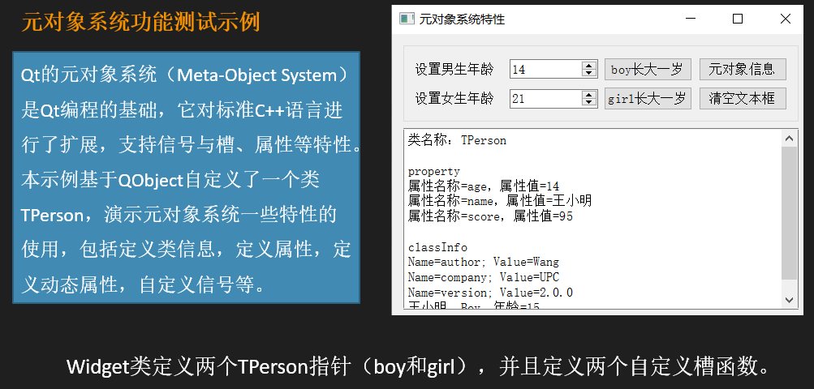

* 代码实现流程
  * UI --> 添加按钮、文本框、默认值修改、界面元素命名、自动排版布局
  * 创建基类（TPerson）--> 成员变量、API 函数、类信息
  * Refactor --> 生成 API 函数体 --> 函数实现
  * UI --> Go to slots --> 生成按钮函数体（widget.cpp）
  * widget.h --> 定义 TPerson 成员、声明槽函数
  * widget.cpp --> Widget 实现、属性设置、信号连接、槽函数实现

* 代码

```cpp
// tperson.h

#ifndef TPERSON_H
#define TPERSON_H

#include <QObject>

class TPerson : public QObject
{
    Q_OBJECT
    Q_CLASSINFO("author", "Chen")
    Q_CLASSINFO("company", "None")
    Q_CLASSINFO("version", "0.0.1")

    Q_PROPERTY(int age READ age WRITE setAge NOTIFY ageChanged) // 暂未定义函数，采用属性，可以使用 name（临时的策略）
    Q_PROPERTY(QString name MEMBER m_name)
    Q_PROPERTY(int score MEMBER m_score)

public:
    explicit TPerson(QString name, QObject *parent = nullptr);
    ~TPerson();

    int age();
    void setAge(int ageValue);
    void incAge();

signals:
    void ageChanged(int ageValue);

private:
    QString m_name;
    int m_age;
    int m_score;

};

#endif // TPERSON_H

```

```cpp
// widget.h

#ifndef WIDGET_H
#define WIDGET_H

#include <QWidget>
class TPerson;

QT_BEGIN_NAMESPACE
namespace Ui { class Widget; }
QT_END_NAMESPACE

class Widget : public QWidget
{
    Q_OBJECT

public:
    Widget(QWidget *parent = nullptr);
    ~Widget();

private:
    TPerson *boy;
    TPerson *girl;

private slots:
    void do_ageChanged(int value);
    void do_spinChanged(int arg1);
    void on_btnBoyInc_clicked();
    void on_btnGirlInc_clicked();
    void on_btnClear_clicked();
    void on_btnClassInfo_clicked();

private:
    Ui::Widget *ui;

};
#endif // WIDGET_H

```

```cpp
// tperson.cpp

#include "tperson.h"

TPerson::TPerson(QString name, QObject *parent)
    : QObject{parent}, m_name{name}
{

}

TPerson::~TPerson()
{
    qDebug("TPerson 类的对象被删除");
}

int TPerson::age()
{
    return m_age;
}

void TPerson::setAge(int ageValue)
{
    if (m_age != ageValue) {
        m_age = ageValue;
        emit ageChanged(m_age);
    }
}

void TPerson::incAge()
{
    ++m_age;
    emit ageChanged(m_age);
}

```

```cpp
// widget.cpp

#include "widget.h"
#include "ui_widget.h"
#include "tperson.h"
#include <QMetaProperty>

Widget::Widget(QWidget *parent)
    : QWidget(parent)
    , ui(new Ui::Widget)
{
    ui->setupUi(this);

    boy = new TPerson("大橘", this); // 对象树，管理内存
    boy->setProperty("sex", "boy");
    boy->setProperty("age", 10);
    boy->setProperty("score", 70);

    girl = new TPerson("大利", this);
    girl->setProperty("sex", "girl");
    girl->setAge(20);

    ui->spinBoy->setProperty("isBoy", true); // 动态属性(容易出错，建议使用固定属性)
    ui->spinGirl->setProperty("isBoy", false);

    connect(boy, SIGNAL(ageChanged(int)), ui->spinBoy, SLOT(setValue(int)));
    connect(girl, SIGNAL(ageChanged(int)), ui->spinGirl, SLOT(setValue(int)));

    connect(boy, SIGNAL(ageChanged(int)), this, SLOT(do_ageChanged(int))); // 名字搞对很重要，否则经常出一些难找的小bug
    connect(girl, SIGNAL(ageChanged(int)), this, SLOT(do_ageChanged(int)));
    connect(ui->spinBoy, SIGNAL(valueChanged(int)), this, SLOT(do_spinChanged(int)));
    connect(ui->spinGirl, SIGNAL(valueChanged(int)), this, SLOT(do_spinChanged(int)));
}

Widget::~Widget()
{
    delete ui;
}

void Widget::do_ageChanged(int value)
{
    // Q_UNUSED(value);
    TPerson *person = qobject_cast<TPerson*>(sender());
    QString str = QString("%1, %2, 年龄 = %3")
            .arg(person->property("name").toString())
            .arg(person->property("sex").toString())
            .arg(value);
    ui->plainTextEdit->appendPlainText(str);
}

void Widget::do_spinChanged(int arg1)
{
    // Q_UNUSED(arg1);
    QSpinBox *spinBox = qobject_cast<QSpinBox*>(sender());
    if (spinBox->property("isBoy").toBool())
        boy->setAge(arg1);
    else
        girl->setAge(arg1);
}


void Widget::on_btnBoyInc_clicked()
{
    boy->incAge();
}


void Widget::on_btnGirlInc_clicked()
{
    girl->incAge();
}


void Widget::on_btnClear_clicked()
{
    ui->plainTextEdit->clear();
}


void Widget::on_btnClassInfo_clicked()
{
    const QMetaObject * meta = boy->metaObject();
    ui->plainTextEdit->appendPlainText(QString("类名称：%1\n").arg(meta->className()));

    ui->plainTextEdit->appendPlainText("属性：");
    for (int i = meta->propertyOffset(); i < meta->propertyCount(); i++) {
        const char* propName = meta->property(i).name();
        QString propValue = boy->property(propName).toString();
        ui->plainTextEdit->appendPlainText(QString("属性名称 = %1, 属性值 = %2").arg(propName).arg(propValue));
    }

    ui->plainTextEdit->appendPlainText("\n类信息 （classInfo）：");
    for (int i = meta->classInfoOffset(); i < meta->classInfoCount(); i++) {
        QMetaClassInfo classInfo = meta->classInfo(i);
        ui->plainTextEdit->appendPlainText(
                    QString("Name = %1, Value = %2").arg(classInfo.name()).arg(classInfo.value()));
    }
}

```

* 最终效果

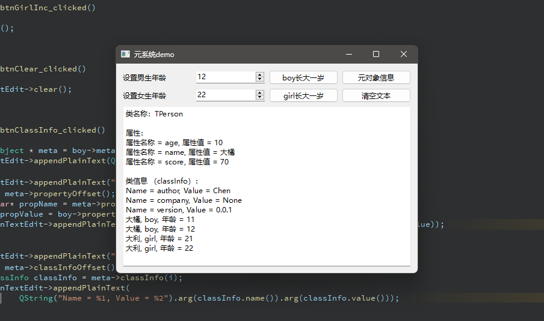


* 2024/04/17 22:22:49

------


#### 3.4 容器类

* 概括
  * 本节介绍了 Qt 的容器类，相比 STL 容器，具有速度和存储上的优化，线程安全，更易使用。
  * 通常，容器类的学习路线应当是先完成数据结构与算法的学习，其后熟悉 C++ 标准库，最后学习 Qt 容器。
  * 随后，本节还介绍了顺序容器、关联容器两大分类的性质和区别，并且介绍了 STL 风格的迭代器，最后提及 Qt 中大量存在的隐式共享的机制。
  * 另外，foreach() 不再支持（遍历时会创建副本，不能用于修改）。
* 顺序容器（节点顺藤摸瓜）
  * QList（合并了链式和非链式）、QStack、QQueue、std::list（指定链式）
* 关联容器（值为 pair）
  * QMap、QMultMap、QHash、QMultiHash、QSet
* STL 风格迭代器（两种，只读 + 读写）

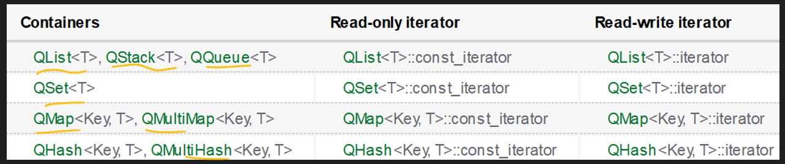

* STL迭代器的API以数组中的指针为模型。
  * 例如，++ 操作符使迭代器向前移动到下一项，而 * 操作符返回迭代器所指向的项。
  * 事实上，对于将元素存储在相邻内存位置的 QList 和 QStack 来说，iterator 类型只是**T* 的 typedef 类型**，而 const_iterator 类型只是 const T * 的 typedef 类型。（可以将 iterator 看作一种别名）
  * end() 与 rend() 解引用 --> 未定义行为

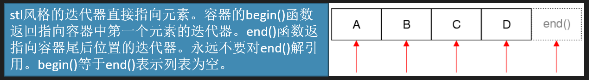

* STL 风格的反向迭代器

```cpp
// 反向迭代器 rbegin, rend
QList<QString> list;
list << "A" << "B" << "C" << "D";
QList<QString>::reverse_iterator i;
for (i = list.rbegin(); i != list.rend(); ++i)
    *i = i->toLower();

// 只读访问 const_iterator, constBegin, constEnd
QList<QString>::const_iterator i;
for (i = list.constBegin(); i != list.constEnd(); ++i)
    qDebug() << *i;


// 关联容器的迭代器
QMap<int, int> map;
/* ... */
QMap<int, int>::const_iterator i;
for (i = map.constBegin(); i != map.constEnd(); ++i)
    qDebug() << i.key() << ':' << i.value();
```

* **隐式共享**：
  * 只传递指向数据的指针，只有当函数写入数据时，数据才会被复制。（又是一种按需分配的策略）

```cpp
// RIGHT | 拷贝/隐式共享，让程序按需复制数据（相当于不同的用户解耦）
const QList<int> sizes = splitter->sizes();
QList<int>::const_iterator i;
for (i = sizes.begin(); i != sizes.end(); ++i)
	/* ... */
    
// WRONG | 一个迭代器正在遍历，另一个迭代器正在扩容，导致迭代对象丢失
QList<int>::const_iterator i;
for (i = splitter->sizes().begin();
	i != splitter->sizes().end(); ++i)
	/* ... */
```

* 疑问
  * 如果使用 Qt 对某个软件进行重构，性能上如何分析？如何对比重构前后的流畅度？
  * 如果某些组件全部用 Qt 平替，是否会直接得到性能升级？


* 2024/04/18 22:21:40

------


#### 3.5 其他常用的基础类型

* 概括
  * 介绍了 `QVariant`（类似 union，存储任何类型的数据）、`QFlags`（模板类，用于存储 `<Enum>` 枚举值的或运算组合）、`QRandomGenerator`（高质量随机数生成） 三个类，它们都用于支持 Qt 在 C++基础上的扩展特性。
  * 说白了，这节介绍了几个常用的数据类型，它们在 Qt 环境下，有硬性的使用需要，于是作为 Qt 的基础类型。
* 背景需求
  * C++ 的 union **不支持具有非默认构造函数或析构函数的类型**，所以大多数有趣的 Qt 类不能在 union 中使用。如果没有 QVariant，这对于 QObject::property() 和数据库相关等来说将是一个问题。
* 信息补充
  * QVariant、QFlags、QRandomGenerator
  * union、toT() 方法（如 toInt()、toString()）为 const 类型、枚举类型的或运算组合

* 疑问 / 感悟
  * ~~最大的感受是，15分钟的视频，重复听了3遍，都没搞清楚讲的是什么。~~
  * 这节讲的内容关联性不强，而且目标不明确，导致听起来有些混乱。主要问题有：例子太单调，对于为什么这样用，讲解不够清晰。最重要的是，这些内容没有用一个具体的应用场景进行讲解，只讲怎么调用以及概念之间的问题，抽象的同时，信息太零散，导致印象不深，尤其初次接触这些概念的时候，难以找到一个合适的位置把知识填进去。
  * 缺失的部分信息，在原书中得到了补充（例如为什么用 QVariant 类）
  * 这种零碎的 Qt 特化内容，会增加学习成本。
  * 最近搞了一个绘图软件的小项目，发现 `QVariant` 通常用作数据类型中转，方便不同 API 接口的统一。而在使用时，需要找到上下游的数据类型，并且进行显式的类型转换（例如 `toInt()`），以完成 API 的对接（2024/05/07 19:00:24）。


* 2024/04/19 23:18:59

------


### C04 常用界面组件的使用

#### 4.1 界面组件概述

* 组件
  * widget：z轴（类似图层）
  * window：
  * 
* 经验
  * 结构图、常用组件，一般是参考官方文档 look for 之后可以自行整理的，因此需注意学习官方的文档。
  * 诸如类方法的参数，value 定义为字符串名称，底层实际是数值表示（类似宏），而写成这样，就是**不要求程序员去关心具体的值**，因为不同的版本，可能改变，但给到这个参数，就相当于给到一个统一的接口，不必在意其中细节。因此，当你使用这些名称作为参数的时候，如果突然想要翻译这个值，那么就要思考一下自己的处理是否得当了，是否进行了**一些本不该显式**的处理。
  * Qt 作为一个框架，内容非常多，如果总想详细学习它的知识点，恐怕不太合适，更好的做法是，需要具体实现就**查文档**。**学习一两个具体详细的示例**，当需要用的时候，就**按这套流程来**查询、找到想要的信息就好。


------


#### 4.2 布局管理

* 概括

  * Qt中，布局机制的设计，主要由表单（Form）、网格（Grid）、堆叠布局（QStackedLayout）三种元素构成，表单注重内容，网格注重空间切分，堆叠布局则提供了组件的堆叠（类似 PS 图层概念）。通常，会将组件放在容器中管理和使用。

  * 其后，介绍了水平布局，包括伸展因子 Stretch 和三种权重比例：000、001、112。

    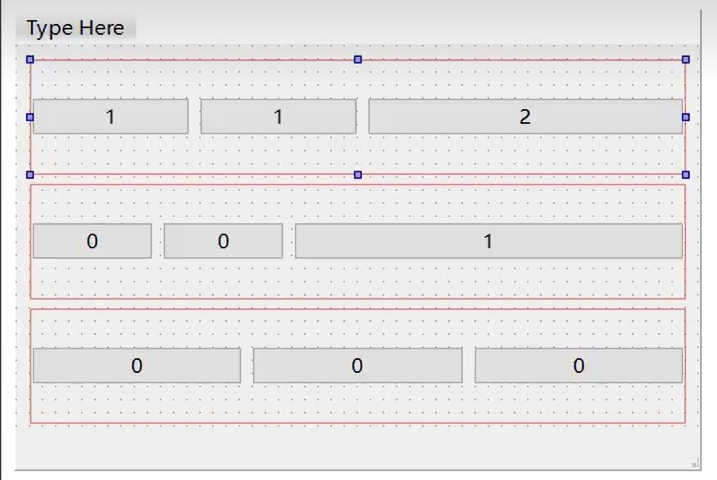

  * 接着，介绍了网格布局。区别是需要打散后，使用网格布局自动排列9个按钮，再利用 layoutColumnStretch 属性，实现上面相同的效果。

  * 最后，介绍了分割条。创建一个对象，传入几个 widget 框，即可实现拖动分栏效果。可水平、可垂直分割。


* 2024/05/07 20:53:15

------


#### 4.3.1 QString概述


------


#### 4.3.2 QChar功能测试demo


#### 4.3.3 QString常用功能测试
#### 4.3.4 QString与数值转换示例
#### 4.4 QSpinBox和QDoubleSpinBox
#### 4.5 常用的按钮组件
#### 4.6 QSlider和QProgressBar
#### 4.7 日期时间数据
#### 4.8 QTimer和QElapsedTimer
#### 4.9 QComboBox
#### 4.10 QMainWindow和QAction
#### 4.11.1 QToolButton和QListWidget-UI
#### 4.11.2 QToolButton和QListWidget-实现
#### 4.12.1 QTreeWidget-UI
#### 4.12.2 QTreeWidget-树操作
#### 4.12.3 QTreeWidget-视图
#### 4.13.1 QTableWidget-UI
#### 4.13.2 QTableWidget-表格
#### 4.13.3 QTableWidget-状态栏


------


### C05 模型/视图结构

#### 5.1模型视图结构概述
#### 5.2QStringListModel和QListView
#### 5.3.1QTableView-准备工作
#### 5.3.2QTableView-加载文件
#### 5.3.3 QTableView-控制
#### 5.4自定义代理
#### 5.5.1QFileSystemModel-UI
#### 5.5.2QFileSystemModel-实现


------


### C06 事件处理

#### 6.1Qt的事件系统
#### 6.2 事件与信号
#### 6.3事件过滤器
#### 6.4 拖放事件与拖放操作
#### 6.5 具有拖放功能的组件


------


### C07 对话框和多窗口程序设计

#### 7.1.1标准对话框
#### 7.1.2标准输入对话框
#### 7.1.3标准消息框
#### 7.2.1自定义设置对话框
#### 7.2.2定位单元格对话框
#### 7.2.3状态栏更新
#### 7.3.1嵌入与独立Widget
#### 7.3.2嵌入与独立MainWindow
#### 7.4 MDI应用程序设计
#### 7.5.1Splash窗口移动
#### 7.5.2 Splash密码登录


------


### C08 文件系统操作和文件读写

#### 8.1 文件操作相关类概述
#### 8.2.1 QCoreApplication
#### 8.2.2 QFile
#### 8.2.3 QFileInfo
#### 8.2.4 QDir
#### 8.2.5 QTemporaryFile和Dir
#### 8.2.6 QFileSystemWatcher类
#### 8.3文本文件读写
#### 8.4.1预定义编码读写二进制UI
#### 8.4.2预定义编码读写二进制实现
#### 8.4.3 原始数据读写二进制


------


### C09 数据库

#### 9.1 Qt数据库编程概述
#### 9.2.1QSqlTableModel打开数据库
#### 9.2.2 QSqlTableModel其他功能
#### 9.3 QSqlQueryModel的使用
#### 9.4.1QSqlQuery的使用打开数据库
#### 9.4.2 QSqlQuery的使用其他功能
#### 9.5QSqlRelationalTableModel的使用


------


### C10 绘图

### C11 自定义插件和库

### C12 Qt Charts

### C13 Qt Data Visualization

### C14 多线程

### C15 网络

### C16 多媒体

### C17 串口编程

### C18 其他工具软件和技术

### 附录 缩略词