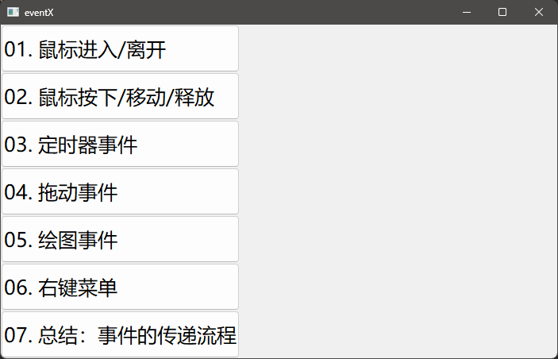
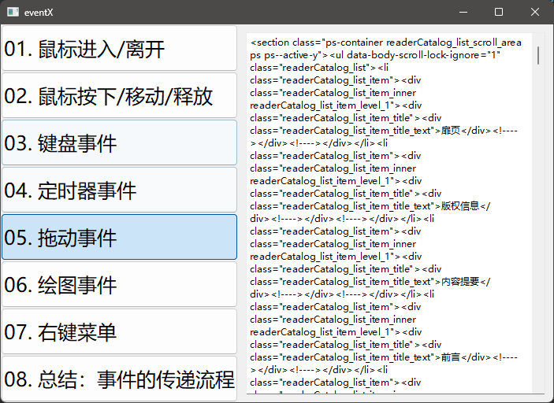

## Qt 基础 | 总结 & 代码实践

Date：2024/04/18 15:30:41

------


[TOC]


------


### 0.0 进度

* 完成第五章视频 + 笔记 + 代码（2024/05/15 15:28:01）
* 开始第四章（2024/05/15 18:26:57）
* 完成第四章（2024/05/24 23:24:03）
* 开始第一章（）


------


## 第一章 入门

### 1.1 为什么要学Qt

------


### 1.2 搭建Qt开发环境
### 1.3 新建Qt工程
### 1.4 项目构建流程
### 1.5 标准信号槽
### 1.6 自定义信号槽
### 1.7 如何连接信号槽
### 1.8 信号槽的扩展


------


## 第二章 控件

### 2.1 窗口基类 QWidget
### 2.2 按钮 QPushButton
### 2.3 标签 QLabel
### 2.4 文本框 QLineEdit
### 2.5 单选按钮 QRadioButton
### 2.6 复选按钮 QCheckBox
### 2.7 组合框 QComboBox
### 2.8 微调框 QSpinBox
### 2.9 滑动条 QSlider
### 2.10 滚动条 QProgressBar
### 2.11 列表框 QListWidget
### 2.12 表格控件 QTableWidget(1)
### 2.12 表格控件 QTableWidget(2)


------


## 第四章 事件

### 4.1 效果演示、技术点

* 概括
  * 事件类型：
    * 鼠标事件（进入、离开、点击、移动、释放、拖动、右键）
    * 键盘事件
    * 定时器事件
    * 绘图事件
  * 要点：了解**事件如何传递**


* 补充
  * 无边框窗口（在另一收费课程中，后续再学）


* 2024/05/15 18:36:00

------


### 4.2 完成界面布局-1

* 概括
  * 实现左侧导航栏的界面布局。代码化编程，创建左侧导航窗口，文字导入、对齐按钮等。
* 代码流程
  * 创建工程（QWidget --> No UI）
  * 声明左侧导航 + 导航列表 + 右侧子界面
  * 实现
    * 整体水平布局（horizontalLayout）、左侧导航（navWidget）、右侧子界面（mainWidget）
    * 各子窗口添加到整体布局（addWidget）
  * 实现导航列表
    * QStringList names存储多个按钮文字
    * 按钮统一由 QButtonGroup 管理
    * 各按钮初始化为 QPushButton 类型，修改其中样式

```cpp
// mainwidget.h
#ifndef MAINWIDGET_H
#define MAINWIDGET_H

#include <QWidget>
#include <QStackedWidget>
#include <QButtonGroup>

class MainWidget : public QWidget
{
    Q_OBJECT

public:
    MainWidget(QWidget *parent = nullptr);
    ~MainWidget();

private:
    void initNav();

private:
    QWidget* navWidget;
    QButtonGroup* btnGroup;

    QWidget* mainWidget;
    QStackedWidget* stackedWidget;

};
#endif // MAINWIDGET_H


// mainwidget.cpp
#include "mainwidget.h"

#include <QHBoxLayout>
#include <QVBoxLayout>
#include <QStringList>
#include <QPushButton>

#include "drag_widget.h"
#include "enter_leave_widget.h"
#include "key_widget.h"
#include "paint_widget.h"
#include "press_move_release_widget.h"
#include "propagate_widget.h"
#include "timer_widget.h"
#include "context_widget.h"

MainWidget::MainWidget(QWidget *parent)
    : QWidget(parent)
{
    // 1. 整体采用水平布局
    QHBoxLayout* horizontalLayout = new QHBoxLayout(this);
    horizontalLayout->setSpacing(0);
    horizontalLayout->setContentsMargins(0, 0, 0, 0);

    // 2. 左侧导航窗体
    navWidget = new QWidget(this);
    QVBoxLayout* leftLayout = new QVBoxLayout(navWidget);
    leftLayout->setSpacing(0);
    leftLayout->setContentsMargins(0, 0, 0, 0);

    horizontalLayout->addWidget(navWidget); // 将左导航栏加入整体布局

    // 3. 右侧主体布局-子界面
    mainWidget = new QWidget(this);
    mainWidget->setMinimumWidth(400);
    QVBoxLayout* rightLayout = new QVBoxLayout(mainWidget);
    rightLayout->setSpacing(0);
    rightLayout->setContentsMargins(0, 0, 0, 0);

    stackedWidget = new QStackedWidget(mainWidget);
    rightLayout->addWidget(stackedWidget);

    horizontalLayout->addWidget(mainWidget);

    initNav();
}

MainWidget::~MainWidget()
{
}

void MainWidget::initNav()
{
    QStringList names;
    names << "鼠标进入/离开"
          << "鼠标按下/移动/释放"
          << "键盘事件"
          << "定时器事件"
          << "拖动事件"
          << "绘图事件"
          << "右键菜单"
          << "总结：事件的传递流程";

    btnGroup = new QButtonGroup(this);

    for (int i = 0; i < names.count(); i++) {
        QPushButton* btn = new QPushButton();

        // 设置固定高度
        btn->setMinimumHeight(60);

        // 设置按钮文字（%1：i+1为值，2为占位总长，10为进制数，QChar('0')为占位符）
        btn->setText(QString("%1. %2").arg(i + 1, 2, 10, QChar('0')).arg(names.at(i)));

        // 设置按钮可选中（类似复选框功能）
        btn->setCheckable(true);

        // 设置样式表
        navWidget->setStyleSheet(R"(
            QPushButton {
                font: 25px;
                text-align: left;
            }
            )");

        // 将按钮添加到 btnGroup
        btnGroup->addButton(btn, i);

        navWidget->layout()->addWidget(btn);
    }
}


// main.cpp
#include "mainwidget.h"

#include <QApplication>

int main(int argc, char *argv[])
{
    QApplication a(argc, argv);
    MainWidget w;
    w.show();
    return a.exec();
}

```

* 本节成果



* 经验
  * 实际工作中，通常不使用可视化设计界面，而是代码化设计。
* 疑问
  * ~~`initNav();` 声明省略了函数类型，而实现该函数时，没有显式返回值，则出现警告信息。那么，可否省略？一定要显式返回？这个性质取决于类中的初始化函数？还是仅属于一般的函数？~~【实际就是错误了，声明应当添加 `void` ，同时在函数体前面，也加上 `void` 】


* 2024/05/15 18:58:41 第一遍视频
* 2024/05/16 17:33:17 完成代码练习

------


### 4.2 完成界面布局-2

* 代码流程
  * 声明 & 实现槽函数 -->关联信号槽
  * 初始化右侧窗体（添加相应列表项）

```cpp
// mainwidget.h
private slots:
    void buttonClicked(); // 左侧导航的槽函数

/* ... */ {
    initMain();

    // 默认选中第一项
    btnGroup->button(0)->click();
}

/* ... */ {
	// 关联信号槽
    connect(btn, SIGNAL(clicked(bool)), this, SLOT(buttonClicked()));
}

// 初始化右侧窗体
void MainWidget::initMain()
{
    stackedWidget->addWidget(new EnterLeaveWidget());
    stackedWidget->addWidget(new PressMoveReleaseWidget());
    stackedWidget->addWidget(new KeyWidget());
    stackedWidget->addWidget(new TimerWidget());
    stackedWidget->addWidget(new DragWidget());
    stackedWidget->addWidget(new PaintWidget());
    stackedWidget->addWidget(new ContextWidget());
    stackedWidget->addWidget(new PropagateWidget());
}

// 按钮事件点击
void MainWidget::buttonClicked()
{
    int idx = btnGroup->checkedId(); // 获取按钮初始化时，由addButton(btn, i)生成的index，即i值
    stackedWidget->setCurrentIndex(idx);
}
```

* 补充
  * 关联槽函数的书写范式：Qt4 风格、Qt5风格


* 2024/05/17 17:17:29

------


### 4.3 鼠标进入离开事件-1

* 代码流程
  * 创建类 --> 自定义控件（LabelX）--> 声明鼠标进入 & 离开事件函数
  * 实现两个鼠标函数 --> 修改 enter_leave_widget.cpp 文件 --> 更换为自定义控件类型

```cpp
// labelx.h
#ifndef LABELX_H
#define LABELX_H

#include <QLabel>

class LabelX : public QLabel
{
    Q_OBJECT
public:
    explicit LabelX(QWidget *parent = nullptr);

signals:

protected:
    void enterEvent(QEnterEvent *event);
    void leaveEvent(QEvent *event);

};
#endif // LABELX_H


// labelx.cpp
#include "labelx.h"
#include <QDebug>

LabelX::LabelX(QWidget *parent)
    : QLabel{parent}
{

}

static int cnt = 1;

void LabelX::enterEvent(QEnterEvent *event)
{
    Q_UNUSED(event);
    // qDebug() << "enterEvent: " << cnt++;
    this->setText(QString("enterEvent: %1").arg(cnt++));
}

void LabelX::leaveEvent(QEvent *event)
{
    Q_UNUSED(event);
    // qDebug() << "leaveEvent: " << cnt++;
    this->setText(QString("leaveEvent: %1").arg(cnt++));
}


// enter_leave_widget.cpp
#include "enter_leave_widget.h"

#include <QLabel>
#include <QVBoxLayout>
#include "labelx.h"

EnterLeaveWidget::EnterLeaveWidget(QWidget *parent)
    : QWidget{parent}
{
    QVBoxLayout* verticalLayout = new QVBoxLayout(this);
    verticalLayout->setSpacing(0);
    verticalLayout->setContentsMargins(0, 0, 0, 0);

    // 1. 自定义标签控件
    LabelX* lblx = new LabelX(this);
    lblx->setText("");
    lblx->setFrameShape(QFrame::Box);
    lblx->setFixedHeight(50);
    lblx->setAlignment(Qt::AlignCenter);
    lblx->setStyleSheet("background-color: blue; color: white; font-size: 25px");

    verticalLayout->addWidget(lblx);
}
```

* 疑问 / 感悟
  * 对于多种事件，都要单独创建自定义控件？是否可以复用 LabelX ？如果复用，是否会导致一个事件初始化了多余的资源？
    * 不会。若需扩展功能，仅需要在 LabelX 重载相应的事件方法。
  * 检查发现，之前写的 initMain 初始化顺序错误，以及头文件遗漏。而运行测试并没有发现这个错误，甚至 8 种事件少了 1 种都没发现。这种错误真不应该，同时，表明初始化顺序与列表顺序应当一致，需仔细检查对应关系，否则出错了也难以发现。
  * 对于像 “自定义标签控件” 的初始化，**如何知道需要配置哪些属性？**这个问题十分重要，决定了是否能掌握一个 API 的相关资源，合理地初始化资源。
    * **阅读官方文档**、查看控件源代码、参考示例和教程、**参考开源项目**、尝试和实验
    * 一条评论：1.找官网；2.入门案例；3.通读官方文档；4.看看感兴趣的源码；5.找个开源项目，看看别人怎么使用的。


* 2024/05/17 22:19:26

------


### 4.3 鼠标进入离开事件-2

* 代码流程
  * 事件过滤器实现相同功能
  * --> 目标对象 `lbl` 安装事件过滤器
  * --> 声明 & 重载 `eventFilter()` 函数，根据事件类型，处理相应鼠标事件

```cpp
// enter_leave_widget.h
protected:
    bool eventFilter(QObject *watched, QEvent *event)  override; // 重载事件过滤器
private:
    QLabel* lbl;


// enter_leave_widget.cpp
#include "enter_leave_widget.h"

#include <QVBoxLayout>
#include "labelx.h"
#include <QEvent>

EnterLeaveWidget::EnterLeaveWidget(QWidget *parent)
    : QWidget{parent}
{
    /* ... */

    // 1. 自定义标签控件
    /* ... */

    // 2. 标准的标签控件
    lbl = new QLabel(this);
    lbl->setText("");
    lbl->setFrameShape(QFrame::Box);
    lbl->setFixedHeight(50);
    lbl->setAlignment(Qt::AlignCenter);
    lbl->setStyleSheet("background-color: red; color: white; font-size: 25px");

    verticalLayout->addWidget(lbl);

    // 为标签安装事件过滤器
    lbl->installEventFilter(this);
}

static int cnt = 1;

bool EnterLeaveWidget::eventFilter(QObject *watched, QEvent *event)
{
    if (watched == lbl) {
        if (event->type() == QEvent::Enter) {
            lbl->setText(QString("enterEvent: %1").arg(cnt++));
        } else if (event->type() == QEvent::Leave) {
            lbl->setText(QString("leaveEvent: %1").arg(cnt++));
        }
    }

    return QWidget::eventFilter(watched, event);
}
```

* 疑问 / 感悟
  * 还是未理解事件过滤器，如何被窗口捕获，从而再决定是否将信号发送给标签？
  * 如何理解 `lbl->installEventFilter(this);` 的操作？为什么要安装事件过滤器？因为安装后，才可以重载 `eventFilter()` ？从而实现自定义的功能？
    * 在 `lbl` 上安装了一个事件过滤器，这个过滤器是当前对象（`EnterLeaveWidget`）。
    * 当 `lbl` 接收到任何事件时，这些事件会首先传递给 `EnterLeaveWidget` 的 `eventFilter()` 方法进行处理。（**相当于窗口一直监听事件**，当出现任何事件，**传给类似 “信号处理函数”** 的  `eventFilter()`  ）
    * 通过重载 `eventFilter()`，可以在事件到达目标对象（如 `lbl`）之前对其进行处理。
  * `void QObject::installEventFilter(QObject *filterObj)` 
    * An event filter is an object that receives all events that are sent to this object. The filter can either **stop the event** or **forward it to this object**. The event filter filterObj receives events via its eventFilter() function. 
    * The eventFilter() function must **return true if the event should be filtered**, (i.e. stopped); otherwise it must return false.
    * If multiple event filters are installed on a single object, the filter that was **installed last is activated first**.
  * 结合官方文档理解：被过滤的事件，意味着被捕获，则 `eventFilter()` 返回 true --> 此时，事件要么被停止，要么被转发到此对象。而上述代码，将鼠标两种事件转发到 lbl，因为也是给 lbl 安装的事件过滤器。当 watched 捕获事件后，判断该事件是否作用于 lbl，那么根据具体的事件类型，执行两种操作。~~最后，递归调用以监听事件，直到程序退出。~~【错了，并非递归调用，而是调用其父类的事件过滤函数，目的是使用相应的默认行为】
  * 事件过滤器是一个在事件传递过程中**拦截和处理事件**的机制。
* 事件传递的流程分析
  * 鼠标移动到 `lbl` --> 产生 `QEvent::Enter` 事件
  * --> 事件传递给  `EnterLeaveWidget` 的 `eventFilter()` 方法
  * --> `eventFilter()` 方法判断事件
    * --> 是否为 `lbl` 对象？（不是由 lbl 捕获的吗？为何还要判断？）
    * --> 是否为 `QEvent::Enter` 事件
* 核心提问
  * 所以核心是确定事件过滤器安装的目标对象，从而激活目标对象的eventFilter()函数，通过eventFilter()函数，截获并处理相应的信号（事件），在处理过程中，实现自定义的功能？
    * 返回 `true`，事件被拦截；
    * 返回 `false`，事件继续传递给目标对象的**默认事件处理机制**。
    * “默认事件处理机制” 的工作是什么？
  * 而 watched 不一定等于 lbl，例如鼠标并没有进入或离开 lbl 按钮的范围，而在它的外部移动，那么 watched 就不等于  lbl，于是 eventFilter() 仍处于监听状态，等待事件激活？而实现这个等待的代码，就是 eventFilter()  函数的递归返回？
    * 可能监听多个对象（而 `watched` 参数可用于区分当前处理的事件来自哪个对象）
    * 也与事件传播机制有关（其他事件、空对象等）
  * 但是，根据官方文档的解释，如果并非目标事件，那么函数返回 false  吧？实际上并没有持续监听？但为什么当鼠标触发指定事件时，这个函数也同步激活呢？如何实现一直监听的呢？
    * 事件过滤器的持续监听机制：不需要主动监听事件，通过安装在目标对象上，**被动地拦截事件**。
  * 而且，目标对象 `lbl` 捕获了某个事件，为什么还要在 `eventFilter()` 判断是否指向 `lbl` ？不是正在处理由这个对象捕获的事件吗？这一步是否多余？
  * 默认事件处理机制是什么？例如某个窗口一直监听到空对象，就一直把它扔掉？
    * 这个问题牵涉到较多内容，学到后面再回头看吧。
  * 可以把 `return QWidget::eventFilter(watched, event);` 理解为一种固定的返回形式？
    * 可以理解为在事件过滤器中**调用基类的事件过滤器**。


* 2024/05/18 0:12:21 完成代码、笔记、疑问、GPT-4o 提问与问题逐层分析

------


### 4.4 鼠标按下移动释放事件-1

* 代码流程
  * `LabelX` 声明重载方法
  * 实现重载方法
  * `press_move_release_widget.cpp` 修改 `QLabel` 为 `LabelX`，修改 `lblx`
  * `qDebug()` 代码调试
  * `setMouseTracking()` 鼠标跟踪（悬停识别）
* 注意：`buttons()` 与 `button()` 用法不同

```cpp
// labelx.h
protected:
    // 按下、释放、移动事件
    void mousePressEvent(QMouseEvent *ev);
    void mouseReleaseEvent(QMouseEvent *ev);
    void mouseMoveEvent(QMouseEvent *ev);


// labelx.cpp
#include "labelx.h"
#include <QDebug>
#include <QMouseEvent>

LabelX::LabelX(QWidget *parent)
    : QLabel{parent}
{
    this->setMouseTracking(true); // 默认为 false
}

void LabelX::mousePressEvent(QMouseEvent *ev)
{
    // qDebug() << "mousePressEvent" << ev->button() << ev->pos() << ev->globalPos();
    if (ev->button() == Qt::LeftButton) {
        qDebug() << "左键按下" << "x = " << ev->x() << ", y = " << ev->y();
    } else if (ev->button() == Qt::RightButton) {
        qDebug() << "右键按下" << "x = " << ev->x() << ", y = " << ev->y();
    }
}

void LabelX::mouseReleaseEvent(QMouseEvent *ev)
{
    // qDebug() << "mouseReleaseEvent" << ev->button() << ev->pos() << ev->globalPos();
    if (ev->button() == Qt::LeftButton) {
        qDebug() << "鼠标释放" << "x = " << ev->x() << ", y = " << ev->y();
    }
}

void LabelX::mouseMoveEvent(QMouseEvent *ev)
{
    // qDebug() << "mouseMoveEvent" << ev->buttons() << ev->pos() << ev->globalPos();
    if (ev->buttons() == Qt::LeftButton) {
        qDebug() << "鼠标移动中..." << "x = " << ev->x() << ", y = " << ev->y();
    }
}
```

* 本节成果


* 经验
  * 一个比较好的设计流程是，声明 --> 实现 --> `qDebug()` 测试 --> 具体实现。
  * 准备使用某个类型时，同时引入其头文件（例如声明 `QLabel` 时，顺便引入头文件）
* 疑问
  * 为什么鼠标事件的参数，不同统一使用 `event`，而使用的 `ev` ？是避免与之混淆？还是设计失误？


* 2024/05/18 18:51:45

------


### 4.4 鼠标按下移动释放事件-2

* 代码流程
  * 创建 `lbl`、`widget` 元素（成员变量）
  * 创建坐标元素 `pressPos` 和 `winPos`（位置记录）
  * 添加标准 `QLabel`，`lbl` 安装事件过滤器
  * 声明 & 重载 `eventFilter()` 
    * 三分支处理，`qDebug` 调试 + 验证逻辑
  * 实现移动操作
    * 边界处理（四种情况）

```cpp
// press_move_release_widget.h
private:
    QLabel* lbl;
    QWidget* widget;

    QPoint pressPos; // 鼠标按下的位置
    QPoint winPos;   // 标签的位置（top-left）


// press_move_release_widget.cpp
#include <QEvent>
#include <QMouseEvent>
#include <QDebug>

PressMoveReleaseWidget::PressMoveReleaseWidget(QWidget *parent)
    : QWidget{parent}
{
    /* ... */
    // 2. 添加一个标准 QLabel
    widget = new QWidget(this);
    lbl = new QLabel(widget);
    lbl->setText("");
    lbl->setFrameShape(QFrame::Box);
    lbl->setFixedSize(100, 100);
    lbl->setStyleSheet("background-color: red;");

    verticalLayout->addWidget(widget);

    // 安装事件过滤器
    lbl->installEventFilter(this);
}

bool PressMoveReleaseWidget::eventFilter(QObject *watched, QEvent *event)
{
    if (watched != lbl) {
        return QWidget::eventFilter(watched, event);
    }

    if (event->type() == QEvent::MouseButtonPress) {
        // 记录鼠标按下的位置，记录当前标签位置
        qDebug() << "MouseButtonPress";
        QMouseEvent* mouseEvent = static_cast<QMouseEvent*>(event);
        pressPos = mouseEvent->globalPos();
        winPos   = lbl->pos();
        qDebug() << winPos;
    } else if (event->type() == QEvent::MouseMove) {
        qDebug() << "MouseMove";
        QMouseEvent* mouseEvent = static_cast<QMouseEvent*>(event);
        QPoint dstPos = winPos + (mouseEvent->globalPos() - pressPos); // 计算移动后的坐标
        lbl->move(dstPos);

        // 边界处理
        // 超出左边界
        if (lbl->pos().x() < 0) {
            lbl->move(0, dstPos.y());
        }
        // 超出右边界
        if (lbl->pos().x() > widget->width() - lbl->width()) {
            lbl->move(widget->width() - lbl->width(), dstPos.y());
        }
        // 超出上边界
        if (lbl->pos().y() < 0) {
            lbl->move(dstPos.x(), 0);
        }
        // 超出下边界
        if (lbl->pos().y() > widget->height() - lbl->height()) {
            lbl->move(dstPos.x(), widget->height() - lbl->height());
        }

    } else if (event->type() == QEvent::MouseButtonRelease) {
        qDebug() << "MouseButtonRelease";
    }
}
```

* 疑问
  * 如何扩展，以实现多一个方块的移动事件？如何修改 `eventFilter` 方法？更好的办法并非创建多一组成员变量，而是使用容器？
  * 如何理解 `(watched != lbl)` 时，才返回？
* BUG
  * 在移动超出左右边界时，若位于四个角位，将可把 `lbl` 移出 `widget` 范围之外。这个 bug 可能是四种边界条件未能界定当标签在角位时，可能的临界情况。


* 2024/05/18 21:41:56 视频，部分代码
* 2024/05/19 18:05:36 完成

------


### 4.5 键盘事件-1

* 代码流程
  * 声明 & 重载槽函数
  * 获取焦点 `setFocusPolicy()` 
  * 单按键 --> 双按键 --> 三 / 多按键捕获 `keyPressEvent` 
  * 按键释放 `keyReleaseEvent` 

```cpp
protected:
    void keyPressEvent(QKeyEvent *event);
    void keyReleaseEvent(QKeyEvent *event);

void KeyWidget::keyPressEvent(QKeyEvent *event)
{
    // 1. 单个按键
    switch (event->key()) {
        case Qt::Key_Return:
            qDebug() << "Return";
            break;
        case Qt::Key_Escape:
            qDebug() << "Escape";
            break;
        case Qt::Key_Control:
            qDebug() << "Ctrl";
            break;
        case Qt::Key_Shift:
            qDebug() << "Shift";
            break;
        case Qt::Key_Alt:
            qDebug() << "Alt";
            break;
        case Qt::Key_Up:
            qDebug() << "Up";
            break;
        case Qt::Key_Down:
            qDebug() << "Down";
            break;
        case Qt::Key_Left:
            qDebug() << "Left";
            break;
        case Qt::Key_Right:
            qDebug() << "Right";
            break;
        case Qt::Key_A:
            qDebug() << "A";
            break;
        case Qt::Key_B:
            qDebug() << "B";
            break;
        case Qt::Key_C:
            qDebug() << "C";
            break;
        case Qt::Key_D:
            qDebug() << "D";
            break;
    }

    // 2. 两个按键
    if (event->modifiers() == Qt::ControlModifier && event->key() == Qt::Key_A) {
        qDebug() << "Ctrl + A";
    }
    if (event->modifiers() == Qt::ShiftModifier && event->key() == Qt::Key_B) {
        qDebug() << "Shift + B";
    }
    if (event->modifiers() == Qt::AltModifier && event->key() == Qt::Key_C) {
        qDebug() << "Alt + C";
    }

    // 3. 三个按键
    if ((event->modifiers() == Qt::ControlModifier | Qt::ShiftModifier) && event->key() == Qt::Key_D) {
        qDebug() << "Ctrl + Shift + D";
    }
}

void KeyWidget::keyReleaseEvent(QKeyEvent *event)
{
    switch (event->key()) {
        case Qt::Key_Return:
            qDebug() << "keyReleaseEvent: Return";
            break;
		/* ... */
    }
}
```

* 思考 / 扩展
  * 键盘事件组合键，可以设计自定义热键控件。
* 疑问
  * 如何理解三按键的或运算？
    * `event->modifiers() == ` 
      * `Qt::ControlModifier | Qt::ShiftModifier` 
    * ` && event->key() == Qt::Key_D` 
    * 从逻辑上，能够理解这种写法的意思，Ctrl 与 Shift 满足任一为真，那么命题为真（即三种情况 10 or 01 or 11），否则 `&&` 短路
    * 不理解的是这种写法的实现方式，如何在多参数作出选择的行为？这有点像三目运算符，或许可以类比分析。


* 2024/05/19 18:38:26

------


### 4.5 键盘事件-2

* 代码流程（实现 `lbl` 键盘控制移动 | 俄罗斯方块效果）
  * 标签改为方块 `setFixedSize(100, 100)` 
  * 标签声明为成员变量
  * 实现键盘事件移动操作 `lbl->move()` 
  * 处理越界逻辑

```cpp
// key_widget.h
#include <QLabel>
private:
    QLabel* lbl;

// key_widget.cpp
void KeyWidget::keyPressEvent(QKeyEvent *event)
{
    	/* ... */
		case Qt::Key_Up:
            qDebug() << "Up";
            // 让标签向上移动
            lbl->move(lbl->x(), lbl->y() - 20);
            if (lbl->y() <= -(lbl->height())) {
                lbl->move(lbl->x(), this->height());
            }
            break;
        case Qt::Key_Down:
            qDebug() << "Down";
            // 让标签向下移动
            lbl->move(lbl->x(), lbl->y() + 20);
            if (lbl->y() >= this->height()) {
                lbl->move(lbl->x(), -(lbl->height()) + 20);
            }
            break;
        case Qt::Key_Left:
            qDebug() << "Left";
            // 让标签向左移动
            lbl->move(lbl->x() - 20, lbl->y());
            if (lbl->x() <= -(lbl->width())) {
                lbl->move(this->width(), lbl->y());
            }
            break;
        case Qt::Key_Right:
            qDebug() << "Right";
            // 让标签向右移动
            lbl->move(lbl->x() + 20, lbl->y());
            if (lbl->x() >= this->width()) {
                lbl->move(-(lbl->width()) + 20, lbl->y());
            }
            break;
}
```

* 修改
  * 对越界后重置边界的坐标值进行了修改，使得移动操作动画过渡更自然。
* 本节成果


* 2024/05/19 21:02:41

------


### 4.6 定时器事件-1

* 代码流程
  * 创建两个标签
    * 修改标签预设
    * 添加水平布局
    * 添加水平三个按钮
    * 修改按钮样式表
    * 将水平布局添加至整体的垂直布局中
  * 声明 & 实现槽函数
    * 关联信号槽
    * 添加 timer 成员 id 变量
    * 实现三个按钮槽函数
  * 声明 & 重载 `timerEvent()` 方法
    * 获取 timer 的 id，实现移动操作
    * 处理标签越界情况，越界复位

```cpp
// timer_widget.h
#ifndef TIMER_WIDGET_H
#define TIMER_WIDGET_H

#include <QWidget>
#include <QLabel>

class TimerWidget : public QWidget
{
    Q_OBJECT
public:
    explicit TimerWidget(QWidget *parent = nullptr);

signals:

private slots:
    void onStartClicked();
    void onStopClicked();
    void onResetClicked();

protected:
    void timerEvent(QTimerEvent *event);

private:
    QLabel* lbl1;
    QLabel* lbl2;

    // 定时器编号
    int id1;
    int id2;
};

#endif // TIMER_WIDGET_H


// timer_widget.cpp
#include "timer_widget.h"

#include <QLabel>
#include <QVBoxLayout>
#include <QHBoxLayout>
#include <QPushButton>
#include <QTimerEvent>

TimerWidget::TimerWidget(QWidget *parent)
    : QWidget{parent}
{
    QVBoxLayout* verticalLayout = new QVBoxLayout(this);
    verticalLayout->setSpacing(0);
    verticalLayout->setContentsMargins(0, 0, 0, 0);

    // 1. 添加第一个标签
    lbl1 = new QLabel(this);
    lbl1->setText("");
    lbl1->setFrameShape(QFrame::Box);
    lbl1->setFixedSize(100, 100);
    lbl1->setStyleSheet("background-color: blue;");

    verticalLayout->addWidget(lbl1);

    // 2. 添加第二个标签
    lbl2 = new QLabel(this);
    lbl2->setText("");
    lbl2->setFrameShape(QFrame::Box);
    lbl2->setFixedSize(100, 100);
    lbl2->setStyleSheet("background-color: red;");

    verticalLayout->addWidget(lbl2);

    // 3. 添加水平布局的三个控制按钮
    QHBoxLayout* horizontalLayout = new QHBoxLayout(this);
    horizontalLayout->setSpacing(0);
    horizontalLayout->setContentsMargins(0, 0, 0, 0);

    QPushButton* btnStart = new QPushButton(this);
    btnStart->setText("开始");
    horizontalLayout->addWidget(btnStart);

    QPushButton* btnStop = new QPushButton(this);
    btnStop->setText("停止");
    horizontalLayout->addWidget(btnStop);

    QPushButton* btnReset = new QPushButton(this);
    btnReset->setText("复位");
    horizontalLayout->addWidget(btnReset);

    verticalLayout->addLayout(horizontalLayout);

    this->setStyleSheet(R"(
        QPushButton {
            font-size: 22px;
        }
    )");

    connect(btnStart, &QPushButton::clicked, this, &TimerWidget::onStartClicked);
    connect(btnStop, &QPushButton::clicked, this, &TimerWidget::onStopClicked);
    connect(btnReset, &QPushButton::clicked, this, &TimerWidget::onResetClicked);
}

void TimerWidget::onStartClicked()
{
    id1 = startTimer(10); // 10ms
    id2 = startTimer(20);
}

void TimerWidget::onStopClicked()
{
    killTimer(id1);
    killTimer(id2);
}

void TimerWidget::onResetClicked()
{
    lbl1->move(0, lbl1->y());
    lbl2->move(0, lbl2->y());
}

void TimerWidget::timerEvent(QTimerEvent *event)
{
    if (event->timerId() == id1) {
        lbl1->move(lbl1->x() + 5, lbl1->y());
        if (lbl1->x() >= this->width()) {
            lbl1->move(0, lbl1->y());
        }
    } else if (event->timerId() == id2) {
        lbl2->move(lbl2->x() + 5, lbl2->y());
        if (lbl2->x() >= this->width()) {
            lbl2->move(0, lbl2->y());
        }
    }
}

```

* 经验
  * Qt 中基本的操作流程是，设计与实现UI元素，关联与实现UI元素的功能。
* 疑问
  * 为何 `timerEvent()` 的返回值为空类型？前面几节重载过的事件方法，好像都是 bool 类型的（~~并且递归返回~~）。~~timer 不需要递归返回？递归返回究竟意味着何种设计上的机制？~~【错了，并非递归，而是调用父类相应函数，目的是使用默认行为】


* 2024/05/20 13:11:26 视频 + 部分代码
* 2024/05/20 15:27:23 完成代码 + 笔记

------


### 4.6 定时器事件-2

* 代码流程（使用 `QTimer` 实现相同功能）
  * 创建 `QTimer` 成员变量
  * 创建 `onTimerout1` 槽函数
  * 初始化 `QTimer` 对象
  * 关联信号槽
  * 宏定义处理代码分支
  * 修改 `onStartClicked` 及 `onStopClicked` 槽函数

```cpp
// timer_widget.h
#include <QTimer>
private slots:
    void onTimerout1();
    void onTimerout2();

private:
    QTimer* timer1;


// timer_widget.cpp
#define USE_TIMER_EVENT

TimerWidget::TimerWidget(QWidget *parent)
    : QWidget{parent} {
    timer1 = new QTimer(this);
    connect(timer1, &QTimer::timeout, this, &TimerWidget::onTimerout1);

    timer2 = new QTimer(this);
    connect(timer2, &QTimer::timeout, this, &TimerWidget::onTimerout2);
}

// 修改槽函数
void TimerWidget::onStartClicked() {
#ifdef USE_TIMER_EVENT
    id1 = startTimer(10); // 10ms
    id2 = startTimer(20);
#else
    timer1->start(20);
    timer2->start(10);
#endif
}

void TimerWidget::onStopClicked() {
#ifdef USE_TIMER_EVENT
    killTimer(id1);
    killTimer(id2);
#else
    timer1->stop();
    timer2->stop();
#endif
}
```

* 本节成果


* 经验
  * 使用宏定义管理代码分支（替代了反复的多行注释）。


* 2024/05/20 16:25:37

------


### 4.7 拖放事件

* 代码流程（实现文件拖动、显示）
  * 创建 `TextEditX` 类
  * 修改 `TextEditX` 类的父类为 `QTextEdit` （同步修改 .h 与 .cpp 文件）
  * 添加相关头文件
  * 声明重载方法 & 生成函数实体 & `qDebug` 
  * 修改 `drag_widget.cpp` 
    * 引入自定义头文件 `texteditx.h` 
    * 添加 `TextEdit` 对象（自定义的 `TextEditX` 类型）
  * 设置可接收事件的函数
    * `setAcceptDrops(true)` 
    * `acceptProposedAction()` 
    * 测试 `qDebug` 内容
  * 实现 `dropEvent()` 函数
    * 相关头文件 + 文件 `urls` 操作
    * 实现打开文件 `QIODevice::ReadOnly` 
  * 实现滚轮缩放
    * 重载 `wheelEvent()` 
    * 识别 `Ctrl` 按键
    * 实现滚轮远离与靠近的缩放
    * 如果没有按 `Ctrl`，则调用父类实现，使用默认行为

```cpp
// texteditx.h
#ifndef TEXTEDITX_H
#define TEXTEDITX_H

#include <QTextEdit>
#include <QDragEnterEvent>
#include <QDragLeaveEvent>
#include <QDragMoveEvent>
#include <QDropEvent>
#include <QWheelEvent>

class TextEditX : public QTextEdit
{
    Q_OBJECT
public:
    explicit TextEditX(QWidget *parent = nullptr);

signals:

protected:
    void dragEnterEvent(QDragEnterEvent *e);
    void dragLeaveEvent(QDragLeaveEvent *e);
    void dragMoveEvent(QDragMoveEvent *e);
    void dropEvent(QDropEvent *e);

    void wheelEvent(QWheelEvent *e);

};
#endif // TEXTEDITX_H


// texteditx.cpp
#include "texteditx.h"

#include <QDebug>
#include <QMimeData>
#include <QFile>
#include <QApplication>

TextEditX::TextEditX(QWidget *parent)
    : QTextEdit{parent}
{
    this->setAcceptDrops(true);
}

void TextEditX::dragEnterEvent(QDragEnterEvent *e)
{
    qDebug() << "dragEnterEvent";
    e->acceptProposedAction();
}

void TextEditX::dragLeaveEvent(QDragLeaveEvent *e)
{
    qDebug() << "dragLeaveEvent";
}

void TextEditX::dragMoveEvent(QDragMoveEvent *e)
{
    qDebug() << "dragMoveEvent";
}

void TextEditX::dropEvent(QDropEvent *e)
{
    qDebug() << "dropEvent";

    QList<QUrl> urls = e->mimeData()->urls();
    if (urls.isEmpty()) {
        return;
    }

    QString fileName = urls.first().toLocalFile();
    qDebug() << urls.first() << ":" << fileName;

    QFile file(fileName);
    if (file.open(QIODevice::ReadOnly)) {
        setPlainText(file.readAll());
    }
}

void TextEditX::wheelEvent(QWheelEvent *e)
{
    if (QApplication::keyboardModifiers() == Qt::ControlModifier) {
        if (e->angleDelta().y() > 0) {
            // 滚轮远离用户，放大
            this->zoomIn();
        } else {
            // 滚轮靠近用户，缩小
            this->zoomOut();
        }
    } else {
        QTextEdit::wheelEvent(e); // 调用父类实现，否则滚轮无法上下移动
    }
}


// drag_widget.cpp
#include "drag_widget.h"

#include <QLabel>
#include <QVBoxLayout>
#include "texteditx.h"

DragWidget::DragWidget(QWidget *parent)
    : QWidget{parent}
{
    QVBoxLayout* verticalLayout = new QVBoxLayout(this);
    verticalLayout->setSpacing(0);
    verticalLayout->setContentsMargins(10, 10, 10, 10);

    // 添加一个 TextEdit
    TextEditX* textEdit = new TextEditX(this);
    textEdit->setPlaceholderText("支持拖放文件 --> 打开文件"); // 显示占位内容

    verticalLayout->addWidget(textEdit);
}
```

* 版本迭代
  * 在较新版的 Qt 中，`delta()` 已经弃用，取代的是 `angleDelta().y()` 
  * 使用文件操作，需要导入 `<QFile>` 头文件，否则提示声明不完整。
* 本节成果




* 2024/05/20 23:15:33

------


### 4.8 绘图事件-1

* 代码流程（同实现，见 5.15）
  * 声明高低温标签（成员变量）
  * 声明高低温数组（成员变量）
  * 修改 `paint_widget.cpp`，初始化上述两个标签
  * 安装事件过滤器 --> 声明 & 重载事件过滤器函数
  * 声明 & 实现高低温成员函数
    * 初始化画家
    * 计算 x 坐标、计算 y 坐标
    * 初始化画笔 --> 设置画笔、画刷
      * 绘制温度点、绘制温度文本
      * 绘制曲线（点连线）

```cpp
// paint_widget.h
#ifndef PAINT_WIDGET_H
#define PAINT_WIDGET_H

#include <QWidget>
#include <QLabel>

class PaintWidget : public QWidget
{
    Q_OBJECT
public:
    explicit PaintWidget(QWidget *parent = nullptr);

signals:

private:
    void paintHigh();
    void paintLow();

private:
    QLabel* lblHigh;
    QLabel* lblLow;

    int mHighTemp[7] = {0};
    int mLowTemp[7] = {0};

protected:
    bool eventFilter(QObject *watched, QEvent *event);

};

#endif // PAINT_WIDGET_H


// paint_widget.cpp
#include "paint_widget.h"

#include <QLabel>
#include <QVBoxLayout>
#include <QEvent>
#include <QDebug>
#include <QPainter>

#define PADDING 50
#define POINT_RADIUS 3      // 曲线描点大小
#define TEXT_OFFSET_X 10    // 温度文本相对于点的 x 轴偏移量
#define TEXT_OFFSET_Y 10    // 温度文本相对于点的 y 轴偏移量


PaintWidget::PaintWidget(QWidget *parent)
    : QWidget{parent}
{
    QVBoxLayout* verticalLayout = new QVBoxLayout(this);
    verticalLayout->setSpacing(0);
    verticalLayout->setContentsMargins(0, 0, 0, 0);

    lblHigh = new QLabel(this);
    lblHigh->setText("");
    lblHigh->setFrameShape(QFrame::Box);
    verticalLayout->addWidget(lblHigh);

    lblLow = new QLabel(this);
    lblLow->setText("");
    lblLow->setFrameShape(QFrame::Box);
    verticalLayout->addWidget(lblLow);

    lblHigh->installEventFilter(this);
    lblLow->installEventFilter(this);
}

void PaintWidget::paintHigh()
{
    QPainter painter(lblHigh);

    // 1. 计算 x 坐标
    int pointX[7] = {0};
    for (int i = 0; i < 7; i++) {
        pointX[i] = lblHigh->pos().x() + PADDING + (lblHigh->width() - PADDING * 2) / 6 * i;
    }

    // 2. 计算 y 坐标
    int tempSum = 0;
    int tempAverage = 0;

    for (int i = 0; i < 7; i++) {
        tempSum += mHighTemp[i];
    }
    tempAverage = tempSum / 7;

    int pointY[7] = {0};
    int yCenter = lblHigh->height() / 2;
    int increament = lblHigh->height() / 20;
    for (int i = 0; i < 7; i++) {
        pointY[i] = yCenter - ((mHighTemp[i] - tempAverage) * increament);
    }

    // 3. 开始绘制
    QPen pen = painter.pen();
    pen.setWidth(2);
    pen.setColor(QColor(255, 0, 0));

    painter.setPen(pen);
    painter.setBrush(QColor(255, 0, 0));
    painter.setFont(QFont("Microsoft YaHei", 14));

    // 3.1 绘制点、文本
    for (int i = 0; i < 7; i++) {
        painter.drawEllipse(QPoint(pointX[i], pointY[i]), POINT_RADIUS, POINT_RADIUS);
        painter.drawText(QPoint(pointX[i] + TEXT_OFFSET_X, pointY[i] - TEXT_OFFSET_Y), QString::number(mHighTemp[i]) + "°");
    }

    // 3.2 绘制曲线
    for (int i = 0; i < 6; i++) {
        if (i == 0) {
            pen.setStyle(Qt::DotLine);
            painter.setPen(pen);
        } else {
            pen.setStyle(Qt::SolidLine);
            painter.setPen(pen);
        }
        painter.drawLine(pointX[i], pointY[i], pointX[i + 1], pointY[i + 1]);
    }
}

void PaintWidget::paintLow()
{
    QPainter painter(lblLow);

    // 1. 计算 x 坐标
    int pointX[7] = {0};
    for (int i = 0; i < 7; i++) {
        pointX[i] = lblLow->pos().x() + PADDING + (lblLow->width() - PADDING * 2) / 6 * i;
    }

    // 2. 计算 y 坐标
    int tempSum = 0;
    int tempAverage = 0;

    for (int i = 0; i < 7; i++) {
        tempSum += mLowTemp[i];
    }
    tempAverage = tempSum / 7;

    int pointY[7] = {0};
    int yCenter = lblLow->height() / 2;
    int increament = lblLow->height() / 20;
    for (int i = 0; i < 7; i++) {
        pointY[i] = yCenter - ((mLowTemp[i] - tempAverage) * increament);
    }

    // 3. 开始绘制
    QPen pen = painter.pen();
    pen.setWidth(2);
    pen.setColor(QColor(0, 170, 255));

    painter.setPen(pen);
    painter.setBrush(QColor(0, 170, 255));
    painter.setFont(QFont("Microsoft YaHei", 14));

    // 3.1 绘制点、文本
    for (int i = 0; i < 7; i++) {
        painter.drawEllipse(QPoint(pointX[i], pointY[i]), POINT_RADIUS, POINT_RADIUS);
        painter.drawText(QPoint(pointX[i] + TEXT_OFFSET_X, pointY[i] - TEXT_OFFSET_Y), QString::number(mHighTemp[i]) + "°");
    }

    // 3.2 绘制曲线
    for (int i = 0; i < 6; i++) {
        if (i == 0) {
            pen.setStyle(Qt::DotLine);
            painter.setPen(pen);
        } else {
            pen.setStyle(Qt::SolidLine);
            painter.setPen(pen);
        }
        painter.drawLine(pointX[i], pointY[i], pointX[i + 1], pointY[i + 1]);
    }
}

bool PaintWidget::eventFilter(QObject *watched, QEvent *event)
{
    if (event->type() == QEvent::Paint) {
        if (watched == lblHigh) {
            qDebug() << "lblHigh";
            paintHigh();
        }
        if (watched == lblLow) {
            qDebug() << "lblLow";
            paintLow();
        }
    }

    return QWidget::eventFilter(watched, event);
}
```

* 经验
  * 跟着教程学代码的时候，看一遍实现，再自己写，回忆的时候不是回忆代码怎么写的，而是回忆+思考自己当前面临的场景，例如教程实现了好几个宏来定义温度曲线上的几个要素，自己实现的时候，就回到 “温度曲线需要哪些要素” 的思考上，而不是回到 “刚才别人的代码怎么写的” 上面。这两种实践的方式，有着本质而重要的区别：一种是被动回忆、被动输出；一种是主动思考、主动输出。
  * 有时候，可能教程和代码都很长，这时不妨**分阶段实现**，每完成一部分的代码、调试，再回到教程，继续借鉴、模仿、反馈，如此循环迭代。（第二种方法是，用**流程注释**进行提示；第三种方法，**实在想不到**下一步，才看代码）
* 疑问 
  * 到底何时使用 “.” 调用，何时使用 “->” 调用？前者为指针调用，后者为对象调用成员函数或方法。似乎搞清楚很多次，又会遗忘或出现新的不。那么就再举例子分析吧。
    * `pen` 和 `painter` 使用了 “.” 运算符调用。


------


### 4.8 绘图事件-2

* 代码流程
  * 声明高低温曲线更新函数
  * 实现高低温曲线更新函数
    * 引入随机数 --> 高低温数值模拟（赋值）
    * 重绘标签 `update()` 
    * 调用更新函数 `updateTemp()` 
* 整体调用流程
  * 拦截标签的双击事件 --> 调用 `updateTemp()`  --> 重绘标签（由框架发送 `Qt::Paint` 事件给标签）
  * 事件被窗口拦截 --> 调用重载的方法 `eventFilter()` 
  * --> 内部调用 `paintHigh()` 和  `paintLow()` --> 正式绘制曲线

```cpp
private:
    void updateTemp();


#include <QRandomGenerator64>

PaintWidget::PaintWidget(QWidget *parent)
    : QWidget{parent}
{
	updateTemp();
}

void PaintWidget::updateTemp()
{
    for (int i = 0; i < 7; i++) {
        mHighTemp[i] = 20 + QRandomGenerator::global()->generate() % 10;
        mLowTemp[i]  = -5 + QRandomGenerator::global()->generate() % 10;
    }
    lblHigh->update();
    lblLow->update();
}

bool PaintWidget::eventFilter(QObject *watched, QEvent *event)
{
    if (event->type() == QEvent::Paint) {
		/* ... */
    } else if (event->type() == QEvent::MouseButtonDblClick) {
        updateTemp();
    }

    return QWidget::eventFilter(watched, event);
}

```

* 本节成果


* 2024/05/22 17:27:29 完成代码，1h59min

------


### 4.9 右键菜单事件

* 代码流程
  * 头文件
    * 引入相关头文件
    * 声明槽函数、声明重载方法
    * 声明成员变量
  * 实现文件
    * 初始化右键按钮、关联槽函数
    * 实现槽函数 `slotAction` 
    * 实现重载方法 `contextMenuEvent` 
      * 初始化菜单 --> 添加按钮行为 --> 在鼠标点击位置显示菜单
  * 后续
    * 自行实现相应按钮功能

```cpp
// context_widget.h
#ifndef CONTEXT_WIDGET_H
#define CONTEXT_WIDGET_H

#include <QWidget>
#include <QContextMenuEvent>
#include <QMenu>
#include <QAction>

class ContextWidget : public QWidget
{
    Q_OBJECT
public:
    explicit ContextWidget(QWidget *parent = nullptr);

signals:

private slots:
    void slotAction();

protected:
    void contextMenuEvent(QContextMenuEvent *event);

private:
    QAction* cut;
    QAction* copy;
    QAction* paste;
    QAction* toUpper;
    QAction* toLower;
    QAction* hide;

};
#endif // CONTEXT_WIDGET_H


// context_widget.cpp
#include "context_widget.h"

#include <QLabel>
#include <QVBoxLayout>
#include <QDebug>

ContextWidget::ContextWidget(QWidget *parent)
    : QWidget{parent}
{
    cut     = new QAction("剪切(T)", this);
    copy    = new QAction("复制(C)", this);
    paste   = new QAction("粘贴(V)", this);
    toUpper = new QAction("转为大写(U)", this);
    toLower = new QAction("转为小写(L)", this);
    hide    = new QAction("隐藏行", this);

    connect(cut, SIGNAL(triggered(bool)), this, SLOT(slotAction()));
    connect(copy, SIGNAL(triggered(bool)), this, SLOT(slotAction()));
    connect(paste, SIGNAL(triggered(bool)), this, SLOT(slotAction()));
    connect(toUpper, SIGNAL(triggered(bool)), this, SLOT(slotAction()));
    connect(toLower, SIGNAL(triggered(bool)), this, SLOT(slotAction()));
    connect(hide, SIGNAL(triggered(bool)), this, SLOT(slotAction()));
}

void ContextWidget::slotAction()
{
    QAction* act = (QAction*)sender(); // QObject类的方法，返回发送该信号的对象
    qDebug() << act->text();
    if (act == cut) {
        qDebug() << "doing cut action";
    }
}

void ContextWidget::contextMenuEvent(QContextMenuEvent *event)
{
    // 显示菜单
    QMenu* menu = new QMenu();

    menu->setFixedWidth(160);
    menu->addAction(cut);
    menu->addAction(copy);
    menu->addAction(paste);
    menu->addAction(toUpper);
    menu->addAction(toLower);
    menu->addAction(hide);

    menu->exec(event->globalPos()); // 菜单显示在鼠标点击位置

    delete menu; // 由于内容在堆上创建，手动释放
}

```

* 本节成果


* 2024/05/22 18:34:24

------


### 4.10 总结事件传递流程-1

* 概括
  * 本节讲述了事件传递的逻辑，演示了事件如何被拦截、如何接受、如何忽略、如何终止传递、如何继续传递（从子控件到父控件）。
* 事件传递流程
  * `main()` --> ( `QApplication` -> `exec()` ) --> 进入事件循环 --> 监听 --> `QEvent` 表示 --> 事件传递 --> 相应 `QObject` 
  * **事件的表示**：一个事件包含多个事件类型
    * 事件类型由 `QEvent` 的枚举型 `QEvent::Type` 表示（含 100 多种）
      * 如 `QMouseEvent ` 的 `QMousePressEvent`、`QMouseMoveEvent`、`QMouseReleaseEvent` 
  * **事件的处理**（事件已到达控件）：
    *  `QCoreApplication` 类的 `notify()` 函数的帮助文档
    * ==方法一==：重新实现部件的 `paintEvent()`、`mousePressEvent()` 等**事件处理函数**。这是最常用的一种方法，不过它只能用来处理特定部件的特定事件。
    * 方法二：重新实现 `notify()` 函数。这个函数功能强大，提供了**完全的控制**，可以在事件过滤器得到事件**之前**就获得它们。但是，它**一次只能处理一个事件**。
    * 方法三：向 `QApplication` 对象上**安装事件过滤器**。因为一个程序只有一个 `QApplication` 对象，所以这样实现的功能与使用 `notify()` 函数是相同的，优点是可以**同时处理多个事件**。
    * 方法四：重新实现 `event()` 函数。`QObject` 类的 `event()` 函数可以在事件到达默认的事件处理函数**之前**获得该事件。
    * ==方法五==：在对象上**安装事件过滤器**。使用事件过滤器可以在一个界面类中同时处理不同子部件的不同事件。
    * 1) Reimplementing `paintEvent()`, `mousePressEvent()` and so on. This is the most **common**, easiest, and least powerful way.
    * 2) Reimplementing this function. This is very powerful, providing **complete control**; but only one subclass can be active at a time.
    * 3) Installing an event filter on `QCoreApplication::instance()`. Such an event filter is able to **process all events** for all widgets, so it's just as powerful as reimplementing `notify()`; furthermore, it's possible to have more than one application-global event filter. Global event filters even see mouse events for disabled widgets. Note that application event filters are only called for objects that live in the **main thread**.
    * 4) Reimplementing `QObject::event()` (as `QWidget` does). If you do this you get Tab key presses, and you get to **see the events before** any widget-specific event filters.
    * 5) Installing an event filter on the object. Such an event filter gets all the events, including Tab and Shift+Tab key press events, as long as they do not change the focus widget.
    * **在实际编程中，最常用的是方法一，其次是方法五。**因为方法二需要继承自 `QApplication` 类；而方法三要使用一个全局的事件过滤器，这将减缓事件的传递，所以，虽然这两种方法功能很强大，但是却很少被用到。
  * **要素 / 术语** 
    * 事件、事件类型
    * 默认事件处理函数、事件处理函数、事件过滤器、事件分发函数 `event()` 、事件过滤函数
    * 事件传递、事件循环、事件分发、事件拦截
* 代码流程
  * 创建 `PropagateLabel` 类（用以创建自定义标签）
  * 修改继承父类为 `QLabel` 
  * 声明 & 重载 `mousePressEvent()` 方法
  * 添加自定义标签 `lbl`、修改初始化条件
  * ==接受 or 忽略事件== 
    * 标志位 `m_accept`（默认 true）
      * true  接受，传递终止 `event->accept()` 
      * false 忽略，继续传递给父控件 `event->ignore()` 
    * 由此，下一步：判断事件**是否传递给父控件** 
* 文件
  * `propagatelabel.h`、`propagatelabel.cpp` 
  * `propagate_widget.h`、`propagate_widget.cpp` 

```cpp
// propagatelabel.h
#ifndef PROPAGATELABEL_H
#define PROPAGATELABEL_H
#include <QLabel>
class PropagateLabel : public QLabel
{
    Q_OBJECT
public:
    explicit PropagateLabel(QWidget *parent = nullptr);

signals:

protected:
    void mousePressEvent(QMouseEvent *ev);

};
#endif // PROPAGATELABEL_H


// propagatelabel.cpp
#include "propagatelabel.h"
#include <QDebug>
#include <QMouseEvent>
PropagateLabel::PropagateLabel(QWidget *parent)
    : QLabel{parent}
{

}

// 事件处理函数（接受 / 忽略）
void PropagateLabel::mousePressEvent(QMouseEvent *ev)
{
    qDebug() << "PropagateLabel::mousePressEvent";

    // 接受 --> 只打印子控件（本控件，传递终止）
    // ev->isAccepted();

    // 忽略 --> 打印子控件和父控件
    ev->ignore();
}


// propagate_widget.h
#ifndef PROPAGATE_WIDGET_H
#define PROPAGATE_WIDGET_H
#include <QWidget>
#include "propagatelabel.h"
class PropagateWidget : public QWidget
{
    Q_OBJECT
public:
    explicit PropagateWidget(QWidget *parent = nullptr);

signals:

protected:
    void mousePressEvent(QMouseEvent *event);

private:
    PropagateLabel* lbl;

};
#endif // PROPAGATE_WIDGET_H


// propagate_widget.cpp
#include "propagate_widget.h"
#include <QLabel>
#include <QVBoxLayout>
#include <QDebug>
PropagateWidget::PropagateWidget(QWidget *parent)
    : QWidget{parent}
{
    QVBoxLayout* verticalLayout = new QVBoxLayout(this);
    verticalLayout->setSpacing(0);
    verticalLayout->setContentsMargins(0, 0, 0, 0);

    // 添加自定义标签 PropagateLabel
    lbl = new PropagateLabel(this);
    lbl->setText("");
    lbl->setFrameShape(QFrame::Box);
    lbl->setFixedHeight(50);
    lbl->setAlignment(Qt::AlignCenter);
    lbl->setStyleSheet("background-color: blue; color: white; font-size: 25px");

    verticalLayout->addWidget(lbl);
}

void PropagateWidget::mousePressEvent(QMouseEvent *event)
{
    qDebug() << "PropagateWidget::mousePressEvent 父控件";
}
```


* 2024/05/23 16:20:28 1h48min

------


### 4.10 总结事件传递流程-2

* 概括
  * 本节**解决了第四、五章若干小结**中，事件处理函数 `return 父类分发函数;` 以及拦截事件后，直接 `return true;` 的机制。值得注意的是，之前认为的 “递归” 调用，其实**并非递归**，而是调用其父类的相应函数，以使用**默认的行为**。
  * 如此前者调用默认的分发函数，会根据事件类型进行分发；后者可以**拦截指定事件，即提前接受事件**，以**终止该事件的传递**（于是不会打印父控件）；
  * 若直接 `return false;` 则过滤 / 忽略指定事件，此时事件会接着传递，但由于标签的事件处理函数  `return 父类分发函数;` 与前者是并列关系，因此不会执行，于是直接传递给父控件（相当于跳过了标签的事件处理函数）。
  * 返回父类分发函数的调用，只是为了使用父类的默认处理机制；并不是递归。
* 事件分发函数（事件已到达控件）
  * `event()` 可在事件到达默认事件处理函数之前，截获事件。
* 代码流程
  * 重载标签的 `event()` 
  * 捕获鼠标按下事件 --> 测试三种返回情况（无返回、返回 true、返回 false）

```cpp
// propagatelabel.h
protected:
    bool event(QEvent *e);

// propagatelabel.cpp
bool PropagateLabel::event(QEvent *e)
{
    if (e->type() == QEvent::MouseButtonPress) {
        qDebug() << "PropagateLabel::event";
        // return true;  // 接受事件，终止传递
        return false; // 忽略事件，继续传递，终止本函数的其他 return，传递到父控件
    }

    return QLabel::event(e);
}
```


* 2024/05/23 17:24:35 55min

------


### 4.10 总结事件传递流程-3

* 事件过滤函数（事件未到达控件）
  * `lbl->installEventFilter(this)` 当前窗口拦截事件，由窗口决定事件分发（给 `lbl` 或 不给 `lbl`）
* 事件传递流程：
  * 事件 --> ( `PropagateWidget` -> `eventFilter()` ) -->
  * 事件继续传递（false 或调用父类）--> ( `PropagateLabel` -> `event()` ) -->
  * （调用父类）--> ( `PropagateLabel` -> `mouseMoveevent()` ) -->
  * （忽略事件）--> ( `PropagateWidget` -> `mouseMoveevent()` )
* 代码流程
  * 安装事件过滤器
  * 重载事件过滤函数
  * 测试三种返回（无返回、true、false）

```cpp
// propagate_widget.h
protected:
    bool eventFilter(QObject *watched, QEvent *event);


// propagate_widget.cpp
bool PropagateWidget::eventFilter(QObject *watched, QEvent *event)
{
    if (watched == lbl && event->type() == QEvent::MouseButtonPress) {
        qDebug() << "PropagateWidget::eventFilter";
        // return false;  // 事件忽略，事件继续传递，到指定控件 lbl
        return true; // 事件接受，终止传递
    }

    return QWidget::eventFilter(watched, event);
}
```

* 源码补充
  * qwidget.cpp（需安装源码包）
  * qobject.cpp

```cpp
// 关于源码中形参的语法

// 定义QObject类中的eventFilter函数
// 此函数用于事件过滤器。
// 参数:
// - QObject *watched: 被监视的对象，但在此函数中未使用
// - QEvent *event: 事件对象，但在此函数中未使用
bool QObject::eventFilter(QObject * /* watched */, QEvent * /* event */)
{
    // 始终返回false，表示没有处理任何事件
    return false;
}

// 简要说明：eventFilter函数的参数未被使用，故用注释符号表明。此函数总是返回false，表示不处理任何事件。
```

* 程序入口
  * 程序启动 --> `return a.exec();` --> 进入事件循环

```cpp
#include "mywindow.h"
#include <QApplication>

int main(int argc, char *argv[])
{
    // 1. QApplication 是 Qt 框架提供的应用程序类
    // 作用：负责 Qt 中事件的处理，比如鼠标的单击事件，键盘的输入事件等
    QApplication a(argc, argv);
    
    // 2. 创建自己的窗口对象，并调用其 show 方法，将窗口显示出来
    MyWindow w;
    w.show();
    
    // 3. 调用 QApplication 类的 exec 方法，应用程序就阻塞在这里，并不会退出，而是进入到事件循环的处理, 直到退出程序(比如点击了窗体右上角的关闭按钮)
    return a.exec();
}
```

* 事件传递流程演示


* 疑问
  * 在事件过滤器和事件分发函数所在的两个文件中，当指定的事件出现，两者是如何承接执行程序的？他们是两个线程？在哪个环境经过事件过滤器而传入到事件分发函数（指源码级别的具体调用位置）？
    * 似乎因为事件继续传递，从而到达了 `lbl` 控件，并由其事件分发函数拦截，从而执行相应的处理。
    * 实际上，整个过程是某个**事件的流转**。


* 2024/05/23 19:05:48 53min

------


### 4.11 无边框窗口-1

* 代码流程
  * 重载鼠标事件方法
  * 初始化窗口元素（宽高、背景色、水平布局、按钮）
  * 修改按钮样式、添加按钮互动反馈
  * 实现右键点击关闭窗口

```cpp
// framelesswidget.h
#ifndef FRAMELESSWIDGET_H
#define FRAMELESSWIDGET_H

#include <QWidget>

class FrameLessWidget : public QWidget
{
    Q_OBJECT

public:
    FrameLessWidget(QWidget *parent = nullptr);
    ~FrameLessWidget();

protected:
    void mousePressEvent(QMouseEvent *event);
    void mouseMoveEvent(QMouseEvent *event);
    void mouseReleaseEvent(QMouseEvent *event);

};
#endif // FRAMELESSWIDGET_H


// framelesswidget.cpp
#include "framelesswidget.h"
#include <QPushButton>
#include <QHBoxLayout>
#include <QDebug>
#include <QMouseEvent>

FrameLessWidget::FrameLessWidget(QWidget *parent)
    : QWidget(parent)
{
    this->setMinimumWidth(500);
    this->setMinimumHeight(300);

    this->setStyleSheet("background: #303030");

    QHBoxLayout* layout = new QHBoxLayout(this);
    layout->setSpacing(10);
    layout->setContentsMargins(10, 10, 10, 10);

    QPushButton* btn1 = new QPushButton("确定");
    QPushButton* btn2 = new QPushButton("取消");

    layout->addWidget(btn1);
    layout->addWidget(btn2);

    QString style = R"(
        QPushButton {
            background-color: rgb(64, 64, 64);
            font: 16px "Microsoft YaHei";
            color: rgb(200, 200, 200);
            border: 1px solid #707070;
            border-radius: 5px;
            padding: 5px;
        }
        QPushButton:hover {
            background-color: rgb(40, 40, 40);
        }
        QPushButton:pressed {
            background-color: rgb(64, 64, 64);
        }
    )";

    btn1->setStyleSheet(style);
    btn2->setStyleSheet(style);

    // 去除标题栏
    this->setWindowFlags(Qt::FramelessWindowHint | Qt::WindowSystemMenuHint);
}

FrameLessWidget::~FrameLessWidget()
{
}

void FrameLessWidget::mousePressEvent(QMouseEvent *event)
{
    switch (event->button()) {
        case Qt::RightButton:
            this->close();
            break;
    }
}
```

* 疑问
  * 为何 `mousePressEvent()` 里面的判断不使用 `event()->type()` ？后者是针对某个控件而言的吗？而这里需要拦截的是硬件的行为？


------


### 4.11 无边框窗口-2

* 代码流程
  * 创建枚举类型（表示窗口几个方向的区域）
  * 创建成员变量（点击、鼠标偏移、枚举型成员）
  * 添加鼠标左键点击事件
    * 记录鼠标偏移量
  * 实现 `mouseMoveEvent` 和 `mouseReleaseEvent` 
    * 处理移动逻辑（获取鼠标位置 - 鼠标偏移量）

```cpp
#ifndef FRAMELESSWIDGET_H
#define FRAMELESSWIDGET_H

#include <QWidget>

enum Location {
    TOP,
    BOTTOM,
    LEFT,
    RIGHT,
    TOP_LEFT,
    TOP_RIGHT,
    BOTTOM_LEFT,
    BOTTOM_RIGHT,
    CENTER
};

class FrameLessWidget : public QWidget
{
	/* ... */
private:
    bool isLeftPressed;
    QPoint mouseOffset;
    Location location;

};
#endif // FRAMELESSWIDGET_H


isLeftPressed = false; // 默认左键未点击

void FrameLessWidget::mousePressEvent(QMouseEvent *event)
{
    /* ... */ {
        case Qt::LeftButton:
            isLeftPressed = true;
            mouseOffset = event->globalPos() - this->frameGeometry().topLeft();
            break;
    }
}

void FrameLessWidget::mouseMoveEvent(QMouseEvent *event)
{
    QPoint globalPos = event->globalPos();
    if (isLeftPressed) {
        move(globalPos - mouseOffset);
        event->accept();
    }
}

void FrameLessWidget::mouseReleaseEvent(QMouseEvent *event)
{
    if (event->button() == Qt::LeftButton) {
        isLeftPressed = false;
    }
}
```

* 疑问
  * 为何获取鼠标当前位置，是用 `event()` 来获取的？
  * 类里面的 `Q_OBJECT` 是干嘛的？宏定义引入了 `QObeject` 类的默认行为？还是继承的一部分语法要求？
    * `Q_OBJECT` 是一个宏定义，是 Qt 框架中非常重要的部分，用于启用 Qt 的元对象系统 (Meta-Object System)。元对象系统是 Qt 提供的一种机制，它使得对象能够支持信号与槽机制、运行时类型信息、动态属性以及国际化等功能。


* 2024/05/24 19:07:03

------


### 4.11 无边框窗口-3

* 代码流程（鼠标接边界形状改变）
  * 开启鼠标追踪
  * 修改鼠标行为（添加未按下、在 CENTER 区域按下两种情况）
  * 实现 `setCursorShape` 
    * 获取界面左上角、右下角坐标
    * 定义 x、y 坐标（用以判断当前坐标与上述两角点坐标的相对位置）
    * 处理所有角位区域的指针形状
    * 处理所有边界区域的指针形状

```cpp
void FrameLessWidget::mouseMoveEvent(QMouseEvent *event)
{
    QPoint globalPos = event->globalPos();

    // 1.鼠标未按下
    if (!isLeftPressed) {
        this->setCursorShape(globalPos);
        return;
    }

    // 2.鼠标按下（在 CENTER 区域）
    if (location == CENTER) {
        move(globalPos - mouseOffset);
        event->accept();
        return;
    }

    // 3.缩放
}

void FrameLessWidget::setCursorShape(const QPoint& point)
{
    QRect rect = this->rect();
    QPoint topLeft = mapToGlobal(rect.topLeft());
    QPoint bottomRight = mapToGlobal(rect.bottomRight());

    int x = point.x();
    int y = point.y();

    if ((x >= topLeft.x() && x <= topLeft.x() + PADDING) &&
        (y >= topLeft.y() && y <= topLeft.y() + PADDING)) {
        // 鼠标位于左上角
        location = TOP_LEFT;
        this->setCursor(QCursor(Qt::SizeFDiagCursor));
    } else if ((x >= topLeft.x() && x <= topLeft.x() + PADDING) &&
               (y <= bottomRight.y() && y >= bottomRight.y() - PADDING)) {
        // 鼠标位于左下角
        location = BOTTOM_LEFT;
        this->setCursor(QCursor(Qt::SizeBDiagCursor));
    } else if ((x <= bottomRight.x() && x >= bottomRight.x() - PADDING) &&
               (y >= topLeft.y() && y <= topLeft.y() + PADDING)) {
        // 鼠标位于右上角
        location = TOP_RIGHT;
        this->setCursor(QCursor(Qt::SizeBDiagCursor));
    } else if ((x <= bottomRight.x() && x >= bottomRight.x() - PADDING) &&
               (y <= bottomRight.y() && y >= bottomRight.y() - PADDING)) {
        // 鼠标位于右下角
        location = BOTTOM_RIGHT;
        this->setCursor(QCursor(Qt::SizeFDiagCursor));
    } else if (x >= topLeft.x() && x <= topLeft.x() + PADDING) {
        // 左边界
        location = LEFT;
        this->setCursor(QCursor(Qt::SizeHorCursor));
    } else if (x <= bottomRight.x() && x >= bottomRight.x() - PADDING) {
        // 右边界
        location = RIGHT;
        this->setCursor(QCursor(Qt::SizeHorCursor));
    } else if (y >= topLeft.y() && y <= topLeft.y() + PADDING) {
        // 上边界
        location = TOP;
        this->setCursor(QCursor(Qt::SizeVerCursor));
    } else if (y <= bottomRight.y() && y >= bottomRight.y() - PADDING) {
        // 下边界
        location = BOTTOM;
        this->setCursor(QCursor(Qt::SizeVerCursor));
    } else {
        // 鼠标位于中部
        location = CENTER;
        this->setCursor(QCursor(Qt::ArrowCursor));
    }
}
```


------


### 4.11 无边框窗口-4

* 代码流程（缩放实现）
  * 创建 `rect` --> 获取窗口左上角、右下角坐标 --> 转换为屏幕全局坐标
  * 实现各方向的缩放逻辑 `rMove()` 
  * 处理缩放后鼠标位于临界值导致的窗口移动

```cpp
void FrameLessWidget::mouseMoveEvent(QMouseEvent *event)
{
    QPoint globalPos = event->globalPos();

    QRect rect = this->rect();
    QPoint topLeft = mapToGlobal(rect.topLeft()); // 0,0 --> global
    QPoint bottomRight = mapToGlobal(rect.bottomRight()); // 500, 300 --> global

    // 1.鼠标未按下
    if (!isLeftPressed) {
        this->setCursorShape(globalPos);
        return;
    }

    // 2.鼠标按下（在 CENTER 区域）
    if (location == CENTER) {
        move(globalPos - mouseOffset);
        event->accept();
        return;
    }

    // 3.缩放
    QRect rMove(topLeft, bottomRight);

    switch (location) {
        case TOP:
            if (bottomRight.y() - globalPos.y() > this->minimumHeight()) {
                rMove.setY(globalPos.y());
            }
            break;
        case BOTTOM:
            rMove.setHeight(globalPos.y() - topLeft.y());
            break;
        case LEFT:
            if (bottomRight.x() - globalPos.x() > this->minimumWidth()) {
                rMove.setX(globalPos.x());
            }
            break;
        case RIGHT:
            rMove.setWidth(globalPos.x() - topLeft.x());
            break;
        case TOP_LEFT:
            if (bottomRight.y() - globalPos.y() > this->minimumHeight()) {
                rMove.setY(globalPos.y());
            }
            if (bottomRight.x() - globalPos.x() > this->minimumWidth()) {
                rMove.setX(globalPos.x());
            }
            break;
        case TOP_RIGHT:
            if (bottomRight.y() - globalPos.y() > this->minimumHeight()) {
                rMove.setY(globalPos.y());
            }
            rMove.setWidth(globalPos.x() - topLeft.x());
            break;
        case BOTTOM_LEFT:
            rMove.setHeight(globalPos.y() - topLeft.y());
            if (bottomRight.x() - globalPos.x() > this->minimumWidth()) {
                rMove.setX(globalPos.x());
            }
            break;
        case BOTTOM_RIGHT:
            rMove.setHeight(globalPos.y() - topLeft.y());
            rMove.setWidth(globalPos.x() - topLeft.x());
            break;
        defualt:
            break;
    }

    this->setGeometry(rMove);
}
```

* 疑问
  * 左上角坐标为 $$(0, 0)$$ ，窗口宽高为 $$500 \times 300$$，那么窗口右下角的坐标是什么？
    * 应当是 $$(499, 299)$$ 
  * 为什么获取窗口角点坐标后，要转换为屏幕的全局坐标？
    * 因为鼠标触发事件传入的坐标是屏幕全局的坐标，而统一坐标系，可以使得相应的变换能够顺利进行（便于正确地进行位置计算和响应事件）。
* 优化方向
  * 左边界、左上角缩放时，窗口出现略微平移（可能是 PADDING 的距离，多次缩放只生效一次）。
  * 鼠标位于边界的判断，容错率比较低（即便已经扩大了 PADDING 范围）。
  * 如何打包成可执行程序？


* 2024/05/24 22:31:20 36min + 36min + 34min + 1h49min

------


### 4.12 商业项目中的无边框窗口

* 概括
  * 介绍了一个完善的无边框窗口的组成、功能。相比上一节的内容，多了双击顶部还原窗口、最小化、最大化、关闭、图标、最大化拖动标记栏恢复窗口几种功能。
  * 无边框窗口的实现，通常使用两种方法
    * 1、重载 `nativeEvent` 函数拦截 `Windows` 系统消息（不支持跨平台）；
    * 2、纯 Qt 实现。一系列事件处理、重载处理函数等。
* 案例联想
  * Typora 的简洁模式

* UI 参考


* 疑问
  * 全屏也算是一种无边框窗口吗？
  * 为什么有标记栏也能叫无边框窗口？指的是无Qt内置边框的窗口？即定制化的窗口。


* 2024/05/24 23:23:52 15min

------


## 第五章 绘图

### 5.2 界面布局

* 界面草图（目标）


* 代码流程
  * `QWidget` --> 新建控件
  * 控件提升 --> 拖放、提升（提升类继承）
  * 完成布局 --> 分组（Widget、Group Widget）、样式表、上中下布局

* 组件样式代码

```CSS
QWidget {
	font: 14pt "Microsoft YaHei";
	color: #000000;
}

QGroupBox {
	border-width: 1px;
	border-style: solid;
	margin-top: 10px;
}

QGroupBox::title {
	subcontrol-origin: margin;
	left: 20px;
	padding: -10px 5px 0px 5px;
}
```

* 样式修改

```CSS
background-colour: rgb(255, 255, 255);
```

```cpp
// 样式应用
PaintWidget::PaintWidget(QWidget *parent)
    : QWidget{parent}
{
	this->setAttribute(Qt::WA_StyledBackground, true);
}

```

* 本节成果
  * 遗漏工作：Group Box 命名


* 疑问
  * 设置 Group Widget 的样式后，操作台背景色变为深色，不利于开展工作，这是由 IDE 自定义主题导致的？是否可单独设置固定的操作台背景色，而非类似透明效果？


* 2024/04/18 16:32:32

------


### 5.3 控件初始化

* 代码流程

  * 控件命名 --> 补充 vertical Spacer
    * bug：widget 命名遗漏，应当为 paintWidget，与 5.4 对应（已改）
    * bug：pushButton 命名遗漏，应改为 btnPenColor，与 5.7 对应（已改）

  

  * 添加形状

  ```cpp
  enum Shape {
  	_Point,			//
      _Line,			//
      
      _Rect,			//
      _RoundedRect,	//
      _Ellipse,		//
      
      _Polyline,		//
      _Polygon,		//
      
      _Arc,			//
      _Pie,			//
      _Chord,			//
      
      _Path,			//
      
      _Text,			//
      _Pixmap			//
  };
  ```

  * 添加下拉列表（补充第二参数 + 类型强转）
    * 这里设置顺序，决定了列表选项的显示顺序

  ```cpp
  ui->cboShape->addItem("Point", static_cast<int>(_Point));
  ui->cboShape->addItem("Line", static_cast<int>(_Line));
  
  ui->cboShape->addItem("Polyline", static_cast<int>(_Polyline));
  ui->cboShape->addItem("Polygon", static_cast<int>(_Polygon));
  
  ui->cboShape->addItem("Rectangle", static_cast<int>(_Rect));
  ui->cboShape->addItem("Rounded Rectangle", static_cast<int>(_RoundedRect));
  ui->cboShape->addItem("Ellopse", static_cast<int>(_Ellipse));
  
  ui->cboShape->addItem("Arc", static_cast<int>(_Arc));
  ui->cboShape->addItem("Pie", static_cast<int>(_Pie));
  ui->cboShape->addItem("Chord", static_cast<int>(_Chord));
  
  ui->cboShape->addItem("Path", static_cast<int>(_Path));
  
  ui->cboShape->addItem("Text", static_cast<int>(_Text));
  ui->cboShape->addItem("Pixmap", static_cast<int>(_Pixmap));
  ```

  * 画笔宽度（QPen）

  ```cpp
  ui->sbPenWidth->setRange(1, 10);
  ```

  * 画笔线型

  

  ```cpp
  // 画笔线型
  // 实线、虚线、点划线
  ui->cboPenStyle->addItem("Solid", static_cast<int>(Qt::SolidLine));
  ui->cboPenStyle->addItem("Dash", static_cast<int>(Qt::DashLine));
  ui->cboPenStyle->addItem("Dot", static_cast<int>(Qt::DotLine));
  ui->cboPenStyle->addItem("Dash Dot", static_cast<int>(Qt::DashDotLine));
  ui->cboPenStyle->addItem("Dash Dot Dot", static_cast<int>(Qt::DashDotDotLine));
  ui->cboPenStyle->addItem("None", static_cast<int>(Qt::NoPen));
  
  // 线端点样式 | Cap Style
  ui->cboPenCap->addItem("Flat", static_cast<int>(Qt::FlatCap));
  ui->cboPenCap->addItem("Square", static_cast<int>(Qt::SquareCap));
  ui->cboPenCap->addItem("Round", static_cast<int>(Qt::RoundCap));
  
  // 线拐点样式 | Join Style
  ui->cboPenJoin->addItem("Miter", static_cast<int>(Qt::MiterJoin));
  ui->cboPenJoin->addItem("Bevel", static_cast<int>(Qt::BevelJoin));
  ui->cboPenJoin->addItem("Round", static_cast<int>(Qt::RoundJoin));
  ```

  * 画刷样式（QBrush）

  

  ```cpp
  // 画刷样式
  ui->cboBrushStyle->addItem(tr("Linear Gradient"), static_cast<int>(Qt::LinearGradientPattern));
  ui->cboBrushStyle->addItem(tr("Radial Gradient"), static_cast<int>(Qt::RadialGradientPattern));
  ui->cboBrushStyle->addItem(tr("Conical Gradient"), static_cast<int>(Qt::ConicalGradientPattern));
  ui->cboBrushStyle->addItem(tr("Texture"), static_cast<int>(Qt::TexturePattern));
  ui->cboBrushStyle->addItem(tr("Solid"), static_cast<int>(Qt::SolidPattern));
  ui->cboBrushStyle->addItem(tr("Horizontal"), static_cast<int>(Qt::HorPattern));
  ui->cboBrushStyle->addItem(tr("Vertical"), static_cast<int>(Qt::VerPattern));
  ui->cboBrushStyle->addItem(tr("Cross"), static_cast<int>(Qt::CrossPattern));
  ui->cboBrushStyle->addItem(tr("Backward Diagonal"), static_cast<int>(Qt::BDiagPattern));
  ui->cboBrushStyle->addItem(tr("Forward Diagonal"), static_cast<int>(Qt::FDiagPattern));
  ui->cboBrushStyle->addItem(tr("Diagonal Cross"), static_cast<int>(Qt::DiagCrossPattern));
  ui->cboBrushStyle->addItem(tr("Dense 1"), static_cast<int>(Qt::Dense1Pattern));
  ui->cboBrushStyle->addItem(tr("Dense 2"), static_cast<int>(Qt::Dense2Pattern));
  ui->cboBrushStyle->addItem(tr("Dense 3"), static_cast<int>(Qt::Dense3Pattern));
  ui->cboBrushStyle->addItem(tr("Dense 4"), static_cast<int>(Qt::Dense4Pattern));
  ui->cboBrushStyle->addItem(tr("Dense 5"), static_cast<int>(Qt::Dense5Pattern));
  ui->cboBrushStyle->addItem(tr("Dense 6"), static_cast<int>(Qt::Dense6Pattern));
  ui->cboBrushStyle->addItem(tr("Dense 7"), static_cast<int>(Qt::Dense7Pattern));
  ui->cboBrushStyle->addItem(tr("None"), static_cast<int>(Qt::NoBrush));
  ```

  * 资源文件（Texture & Pixmap ）
    * 右键（Add New）--> File name --> Add Files（之后可 Copy Path）

  

  

* 2024/04/22 21:12:44

------


### 5.4 点、线

* 概括
  * 这一节视频课的前半部分逻辑有点混乱（关联槽函数到引入点线实现之间的内容，过于零碎），没讲清楚各种控件/类的前后关系，导致碎片内容较多，代码的实现也只见树木。因此，需重新梳理本节内容与代码实现的逻辑关系。
  * 本节进行了绘制点、线的代码实现，在定义、关联、实现槽函数之后，利用 paintEvent 重载，将点与线的对象显示，最后结合 for 循环铺满窗口。

* 代码流程
  * 内容：点 & 线绘制（坐标初始化）、左上角坐标原点（for铺满）
  * --> 点绘制
    * --> 声明槽函数（.h --> .cpp | Alt + Enter）
    * --> 关联信号槽（connect）
    * --> 实现槽函数（index、Shape转换、setShape() 函数）
    * --> paintwidget.h & .cpp 实现
      * --> 声明 + 实现 setShape() 函数
        * 赋值、update | paintEvent 重载
      * --> paintEvent() 重载 + 实现
        * 定义点、QPainter对象、drawPoints、初次调用
        * 定义线 drawLine
  * --> 循环绘制
    * translate 平移操作（移动坐标原点，而不需改变点坐标）
    * save + restore 存储状态

```cpp
// ----------widget.h----------
// 声明槽函数
private slots:
    void shapeChanged();

// ----------widget.cpp--------
// 关联信号槽
connect(ui->cboShape, SIGNAL(textActivated(QString)), this, SLOT(shapeChanged())); // 原 activated(QString) 改为 textActivated(QString) 否则界面不显示

// 实现槽函数
void Widget::shapeChanged()
{
    int index = ui->cboShape->currentIndex();
    Shape shape = (Shape)ui->cboShape->itemData(index).toInt();

    ui->paintWidget->setShape(shape); // 注意，此处paintWidget 对应 UI 界面的 widget 组件命名
}


// ----------paintwidget.h----------
// 声明槽函数 & 重载函数
public slots:
    void setShape(Shape shape);
protected:
    void paintEvent(QPaintEvent *event) override;

// ----------paintwidget.cpp--------
// 实现槽函数
void PaintWidget::setShape(Shape shape)
{
    this->m_shape = shape;
    update();
}

// 循环绘制
void PaintWidget::paintEvent(QPaintEvent *event)
{
    static const QPoint points[4] = {
        QPoint(10, 80),
        QPoint(20, 10),
        QPoint(80, 30),
        QPoint(90, 70),
    };

    QPainter painter(this);

    for (int x = 0; x < width(); x += 100) {
        for (int y = 0; y < height(); y += 100) {
            painter.save();
            painter.translate(x, y);

            switch(m_shape) {
                case _Point:
                    painter.drawPoints(points, 4);
                    break;

                case _Line:
                    painter.drawLine(points[0], points[2]);
                    break;
            }

            painter.restore();
        }
    }
}
```

* 成果


* 疑问 / 感悟
  * 本节的实现，与我设想的白板自由度的绘图有出入，需查询文档相关功能。


* 2024/04/24 20:48:00 第一遍，梳理逻辑，不含代码
* 2024/04/27 21:18:01 第二遍，代码实现，完成笔记，debug

------


### 5.5 多边形、多段线

* 代码流程：在上一节 for 循环内部，补充 case 即可。

```cpp
/* switch... */
    case _Polyline:
        painter.drawPolyline(points, 4);
        break;
    case _Polygon:
        painter.drawPolygon(points, 4);
        break;
```

```cpp
// 多边形绘制
// 带 F 表示参数为浮点数，否则为整型数
// 参1：点的数组，参2：点的个数
void drawPolyline(const QPointF *points, int pointCount)
// 参数：多边形
void drawPolyline(const QPolygonF &points)

void drawPolyline(const QPoint *points, int pointCount)
void drawPolyline(const QPolygon &points)
```

```cpp
// 多段线绘制
// 带 F 表示参数为浮点数，否则为整型数
void drawPolygon(const QPointF *points, 
                 int pointCount, 
                 Qt::FillRule fillRule = Qt::OddEvenFill);
void drawPolygon(const QPolygonF &points, 
                 Qt::FillRule fillRule = Qt::OddEvenFill);
    
void drawPolygon(const QPoint *points, 
                 int pointCount, 
                 Qt::FillRule fillRule = Qt::OddEvenFill);
void drawPolygon(const QPolygon &points, 
                 Qt::FillRule fillRule = Qt::OddEvenFill);

```


------


### 5.6 矩形、圆角矩形

```cpp
QRect rect(10, 20, 80, 60);
/* switch... */
    case _Rect:
        painter.drawRect(rect);
        break;
    case _RoundedRect:
        painter.drawRoundedRect(rect, 25, 25, Qt::RelativeSize);
        break;
```


------


### 5.7 画笔设置

* 代码流程
  * 关联信号槽、声明槽函数、生成槽函数体（空）
  * 实现槽函数
    * --> onBtnPenColorClicked()
      * 头文件 QColorDialog，颜色设置、有效判断、返回值接收
      * 获取调色板、将颜色回显到按钮、利用调色板设置 btn 属性
      * penChanged 执行颜色修改
    * --> penChanged()
      * 获取 UI 定义的各属性值（通过按钮名称）
      * 属性定义（特定 API 及类型接收）

```cpp
// 画笔设置（activated() --> textActivated()，否则显示要刷新）
connect(ui->sbPenWidth, SIGNAL(valueChanged(int)), this, SLOT(penChanged()));
connect(ui->btnPenColor, SIGNAL(clicked()), this, SLOT(onBtnPenColorClicked()));
connect(ui->cboPenStyle, SIGNAL(textActivated(QString)), this, SLOT(penChanged()));
connect(ui->cboPenCap, SIGNAL(textActivated(QString)), this, SLOT(penChanged()));
connect(ui->cboPenJoin, SIGNAL(textActivated(QString)), this, SLOT(penChanged()));
```

```cpp
// 声明槽函数（widget.h）
private slots:
    /* ... */
    void onBtnPenColorClicked(); // 颜色按钮
    void penChanged();		     //
```

```cpp
// 颜色按钮设置（widget.cpp）
void Widget::onBtnPenColorClicked()
{
    QColor color = QColorDialog::getColor(QColor(255, 0, 0), this, "画笔颜色");
    if (!color.isValid()) {
        return;
    }

    // 把颜色回显到按钮
    QPalette pal = ui->btnPenColor->palette(); // 获取调色板
    pal.setColor(QPalette::Button, color);
    ui->btnPenColor->setPalette(pal);
    ui->btnPenColor->setAutoFillBackground(true);
    ui->btnPenColor->setFlat(true);

    penChanged();
}
```

```cpp
void Widget::penChanged()
{
    int width = ui->sbPenWidth->value();

    QPalette pal = ui->btnPenColor->palette();
    QColor color = pal.color(QPalette::Button);

    int styleIndex = ui->cboPenStyle->currentIndex();
    Qt::PenStyle style = (Qt::PenStyle)ui->cboPenStyle->itemData(styleIndex).toInt();

    int capIndex = ui->cboPenCap->currentIndex();
    Qt::PenCapStyle cap = (Qt::PenCapStyle)ui->cboPenCap->itemData(capIndex).toInt();

    int joinIndex = ui->cboPenJoin->currentIndex();
    Qt::PenJoinStyle join = (Qt::PenJoinStyle)ui->cboPenJoin->itemData(joinIndex).toInt();

    ui->paintWidget->setPen(QPen(color, width, style, cap, join));
}
```

```cpp
// 声明槽函数（paintwidget.h）
public slots:
	/* ... */
    void setPen(const QPen &pen);

// 实现槽函数（paintwidget.cpp）
void PaintWidget::setPen(const QPen &pen)
{
    this->m_pen = pen;
    update();
}
```

* 疑问/感悟
  * bug 通常出现在批量复制，看上去很像的东西，没有改过来。表面上是不仔细，实际上是没搞清楚为什么要这么多种 “定制” 类型，以为是一样的，于是没有改。
    * cboPenStyle、cboPenCap、cboPenJoin
    * Qt::PenStyle、Qt::PenCapStyle、Qt::PenJoinStyle
  * 基本上都是 API “获取” 某个对象，并按照相应的属性进行操作，那么如何建立一个好的 intuition，以比较顺利的流程，搞定这些不同命名的相关 API？
    * 例如某个对象、属性、参数，都可能涉及专门的名称和 API
    * 主要有：itemData()、value()、currentIndex()
  * ~~为什么 `(Qt::PenJoinStyle)` 类型转换以及 `toInt()` ？~~
    * 因为 itemData() 得到的是 QVariant 类型，这个类型是 Qt 设计的一种类型兼容性统称，当需要具体到某一个类型时，就需要进行类型转换了。
    * 而  `toInt()` 处理，则由于目标类型 `Qt::PenJoinStyle` 是一种枚举类型。
    * 因此，整个语句实现了两次类型转换。
  * 而诸如类型 `Qt::PenStyle`、`Qt::PenCapStyle`、`Qt::PenJoinStyle`，则由官方文档可得，相当于标准 API 的类型。
  * ~~图形形状列表，其中的选项顺序如何调整？默认顺序是由什么决定的？~~
    * 由设置 `ui->cboShape->addItem()` 的顺序决定，修改即可
  * 这种编程模式，更像是拼乐高模型，需要什么就找接口一致的内容。
* BUG 修正
  * 教程内，有一步骤可修正，即初次加载画面样式不正确显示，而手动设置了一次 `penChanged()`。这一步是由于对 Combo Box 关联信号槽时，使用了 `activated()` ，而在 Qt 5.14 后，可使用 `textActivated()`，并且首次加载的 bug 已修复（这个问题在前面 5.4 节也出现，同步更改即可）。
  * 或许是因为调用方式不对，产生的 bug，这个问题有待探索。

```cpp
// qcombobox.h
Q_SIGNALS:
    void activated(int index);
    void textActivated(const QString &);
```


* 2024/04/29 20:48:21 完成5.5-5.8，代码实现，debug，笔记、备注、分析

------


### 5.8 画刷设置

* 代码流程
  * 关联信号槽 connect() --> 声明槽函数 --> 生成槽函数体
  * 实现函数体
    * --> onBtnBrushColorClicked()
    * --> brushChanged()
    * --> setBrush()

```cpp
// widget.hpp
private slots:
	/* ... */
    void onBtnBrushColorClicked();
    void brushChanged();


// widget.cpp
// 画刷设置
connect(ui->btnBrushColor, SIGNAL(clicked()), this, SLOT(onBtnBrushColorClicked()));
connect(ui->cboBrushStyle, SIGNAL(textActivated(QString)), this, SLOT(brushChanged()));

// 槽函数实现（复制前面已实现的轮子，修改对象名称即可）
void Widget::onBtnBrushColorClicked()
{
    QColor color = QColorDialog::getColor(QColor(255, 0, 0), this, "画刷颜色");
    if (!color.isValid()) {
        return;
    }

    // 把颜色回显到按钮
    QPalette pal = ui->btnBrushColor->palette(); // 获取调色板
    pal.setColor(QPalette::Button, color);
    ui->btnBrushColor->setPalette(pal);
    ui->btnBrushColor->setAutoFillBackground(true);
    ui->btnBrushColor->setFlat(true);

    brushChanged();
}

// 槽函数实现
void Widget::brushChanged()
{
    // 1.获取画刷颜色
    QPalette pal = ui->btnBrushColor->palette();
    QColor color = pal.color(QPalette::Button);

    // 2.获取画刷样式
    int index = ui->cboBrushStyle->currentIndex();
    Qt::BrushStyle style = (Qt::BrushStyle)ui->cboBrushStyle->itemData(index).toInt();

    // 3.设置画刷
    if (style == Qt::LinearGradientPattern) {
        QLinearGradient linearGradient(0,50, 100,50);
        linearGradient.setColorAt(0.0, Qt::white);
        linearGradient.setColorAt(0.2, color);
        linearGradient.setColorAt(1.0, Qt::black);
        ui->paintWidget->setBrush(linearGradient);
    } else if (style == Qt::RadialGradientPattern) {
        QRadialGradient radialGradient(50,50,50, 70,70);
        radialGradient.setColorAt(0.0, Qt::white);
        radialGradient.setColorAt(0.2, color);
        radialGradient.setColorAt(1.0, Qt::black);
        ui->paintWidget->setBrush(radialGradient);
    } else if (style == Qt::ConicalGradientPattern) {
        QConicalGradient conicalGradient(50,50, 150);
        conicalGradient.setColorAt(0.0, Qt::white);
        conicalGradient.setColorAt(0.2, color);
        conicalGradient.setColorAt(1.0, Qt::black);
        ui->paintWidget->setBrush(conicalGradient);
    } else if (style == Qt::TexturePattern) {
        ui->paintWidget->setBrush(QBrush(QPixmap(":/images/brick.png")));
    } else {
        ui->paintWidget->setBrush(QBrush(color, style));
    }
}


// 槽函数声明
public slots:
    void setBrush(const QBrush &brush);

// 槽函数实现
void PaintWidget::setBrush(const QBrush &brush)
{
    this->m_brush = brush;
    update();
}
```

```cpp
// 默认颜色的界面回显（未设置默认形状的回显）
// 回显画笔颜色
QPalette pal = ui->btnPenColor->palette();
pal.setColor(QPalette::Button, QColor(0, 170, 255));
ui->btnPenColor->setPalette(pal);
ui->btnPenColor->setAutoFillBackground(true);
ui->btnPenColor->setFlat(true);

// 回显画刷颜色
pal = ui->btnBrushColor->palette();
pal.setColor(QPalette::Button, QColor(0, 170, 255));
ui->btnBrushColor->setPalette(pal);
ui->btnBrushColor->setAutoFillBackground(true);
ui->btnBrushColor->setFlat(true);

penChanged();
brushChanged();
```

* 疑问/感悟

  * 更关心如何根据文字占桩，利用文档完成功能、API的实现。例如下面的三步流程，如何从零开始，构建相应的调用逻辑？这比参考着代码来练习，更加重要，应当首先训练的能力。

  ```cpp
  void Widget::brushChanged()
  {
      // 1.获取画刷颜色
      // 2.获取画刷样式
      // 3.设置画刷
  }
  ```

  * 何时选择何种方式，来获取所需的属性？例如 currentIndex() 和 palette() 的选择。这需要建立何种 “对象结构关系”，才能合理使用？
  * 如何修改默认shape？可否类似回显颜色的设置？暂未找到 cboShape 里面的 setShape 函数，试试按这个词查文档。


* 2024/05/02 20:34:41

------


### 5.9 圆、椭圆

* 代码流程：
  * 前面章节以及关联了信号槽，添加 case 即可
* 重载参数：
  * 椭圆中心坐标、长轴长度、短轴长度、外接矩形对象、外接矩形对角坐标

```cpp
// 椭圆、圆绘制，重载方法很多，选一种即可
case _Ellipse:
    painter.drawEllipse(QPoint(50,50), 40, 30); // 椭圆 rx, ry
    painter.drawEllipse(QPoint(50,50), 40, 40); // 圆 rx == ry
    painter.drawEllipse(rect);
    painter.drawEllipse(10,20, 80,60);
```


------


### 5.10 圆弧、饼图

* 代码流程
  * 指定角度、跨度 or 外接矩形 / 正方形
  * 添加 case

```cpp
int startAngle = 30 * 16;
int spanAngle = 120 * 16;

case _Arc:
    painter.drawArc(rect, startAngle, spanAngle);
    break;
case _Pie:
    painter.drawPie(rect, startAngle, spanAngle);
    break;
case _Chord:
    painter.drawChord(rect, startAngle, spanAngle);
    break;
```


* 2024/05/04 19:00:30

------


### 5.11 路径Path

* 信息补充
  * 贝塞尔曲线：一般的矢量图形软件通过它来精确画出曲线，贝兹曲线由线段（可伸缩皮筋）与节点（可拖动）组成，共计4个控制点（两个端点，两个分离中间点）
  * 计算机图形学，如钢笔工具、位图软件
* 代码流程
  * 基于 `QPainterPath` 类
  * 定义 Path 类型 --> 初始化 Path（moveTo、lineTo）--> 初始化贝塞尔曲线（cubicTo）

```cpp
#include <QPainterPath>

QPainterPath path;
path.moveTo(20, 80);
path.lineTo(20, 30);
path.cubicTo(QPoint(80,0), QPoint(50,50), QPoint(80,80));

case _Path:
    painter.drawPath(path);
    break;
```

* 疑问 / 经验 / 感悟
  * 参考 API 的参数，确定是否需要自定义参数类型的对象，如果不需要定义，则还要调用其他 API（或内置类型）才完整。那么如何确定是否需要自定义，而不是使用内置类型呢？
  * Path 工具，似乎可以用在鼠标自定义绘图上，鼠标点击相当于输入一个点坐标，移动鼠标，点选另一个坐标，则自动连线。
  * error: aggregate 'QPainterPath path' has incomplete type and cannot be defined | 提示定义不完整，其实缺了头文件 `<QPainterPath>` 


* 2024/05/05 17:29:04

------


### 5.12 文本、图片

* 信息补充

  * Qt Creator 智能提醒（Preferences-->Environment-->Keyboard-->Complete this-->shirt cut | Ctrl + Space）

  * 翻页 | Shift + ↑ or ↓

    

* 代码流程
  * 基于 `QPainter` 类，API 为 `drawText()` 和 `drawPixmap()` 
  * 添加 case 即可

```cpp
case _Text:
    painter.drawText(rect, Qt::AlignCenter, "我\n在学Qt");
    break;
case _Pixmap:
    painter.drawPixmap(10, 10, QPixmap(":/images/qt-logo.png"));
    break;
```


------


### 5.13 抗锯齿

* 代码流程
  * 关联信号槽（connect）--> 声明 & 实现槽函数 --> `Qt::PainterEvent` 调用

```cpp
// 抗锯齿
connect(ui->chkAntialiasing, SIGNAL(toggled(bool)), this, SLOT(antialiasChanged()));

// 声明槽函数
private slots:
    void antialiasChanged();
// 实现槽函数
void Widget::antialiasChanged()
{
    ui->paintWidget->setAntiAlias(ui->chkAntialiasing->isChecked());
}

// 声明槽函数 & 成员变量
public slots:
    void setAntiAlias(bool antialias);
private:
    bool m_antialias;
// 实现槽函数
void PaintWidget::setAntiAlias(bool antialias)
{
    this->m_antialias = antialias;
    update();
}

// 事件调用
painter.setRenderHint(QPainter::Antialiasing, m_antialias);
```

* 本节成果


------


### 5.14 变换（平移、旋转、缩放）

* 代码流程
  * 关联信号槽 --> 声明 & 实现槽函数 --> 事件调用

```cpp
// 声明槽函数
private slots:
    void transformChanged();
// 实现槽函数
void Widget::transformChanged()
{
    ui->paintWidget->setTransform(ui->chkTransformation->isChecked());
}

// 声明槽函数 & 声明对应成员变量
public slots:
    void setTransform(bool transformed);
private:
    bool m_transformed;
// 实现槽函数
void PaintWidget::setTransform(bool transformed)
{
    this->m_transformed = transformed;
    update();
}

// 事件调用
if (m_transformed) {
    painter.translate(50, 50);
    painter.rotate(90);
    painter.scale(0.7, 0.7);
    painter.translate(-50, -50);
}
```


* 2024/05/07 18:35:13

------


### 5.15 温度曲线-1

* 代码流程
  * 新建工程（QtWidget）
  * Label High & Label Low，设置背景色
  * 修改 Widget 边距（Layout 全 0）
  * 安装事件过滤器 installEventFilter（用以捕获事件）
  * 声明 & 实现事件过滤器函数 --> 根据 event 类型，分别执行两种曲线绘制
  * 声明 & 实现 paintHigh 和 paintLow 函数（分析绘制逻辑，平均值、xy轴）
    * 抗锯齿
    * 计算 x 坐标（设置 PADDING）
    * 计算 y 坐标（平均温度、数组、中线、刻度）
    * 开始绘制
      * 初始化画笔（ `set_` 系列函数，宽、颜色、画笔、笔刷、字体）
      * 画点、绘制文本 --> 设置 POINT_RADIUS、TEXT_OFFSET_
      * 绘制曲线 --> 连线 --> 线型处理
      * 低温曲线（复制、改名）

```cpp
// widget.h
#ifndef WIDGET_H
#define WIDGET_H

#include <QWidget>

QT_BEGIN_NAMESPACE
namespace Ui { class Widget; }
QT_END_NAMESPACE

class Widget : public QWidget
{
    Q_OBJECT

public:
    Widget(QWidget *parent = nullptr);
    ~Widget();

    bool eventFilter(QObject* watched, QEvent* event);

    void paintHigh();
    void paintLow();

private:
    Ui::Widget *ui;

    int mHighTemp[7] = {0};
    int mLowTemp[7]  = {0};

};
#endif // WIDGET_H
```

```cpp
// widget.cpp
#include "widget.h"
#include "ui_widget.h"

#include <QDebug>
#include <QPainter>

#define PADDING 50
#define POINT_RADIUS 3
#define TEXT_OFFSET_X 12
#define TEXT_OFFSET_Y 12

Widget::Widget(QWidget *parent)
    : QWidget(parent)
    , ui(new Ui::Widget)
{
    ui->setupUi(this);

    ui->lblHigh->installEventFilter(this);
    ui->lblLow->installEventFilter(this);
}

Widget::~Widget()
{
    delete ui;
}

bool Widget::eventFilter(QObject *watched, QEvent *event)
{
    // qDebug() << "eventfliter...";

    if (event->type() == QEvent::Paint) {
        if (watched == ui->lblHigh) {
            // qDebug() << "paint lblHigh...";
            paintHigh();
        }
        if (watched == ui->lblLow) {
            // qDebug() << "paint lblLow...";
            paintLow();
        }
    }

    return QWidget::eventFilter(watched, event);
}

void Widget::paintHigh()
{
    QPainter painter(ui->lblHigh);
    painter.setRenderHint(QPainter::Antialiasing, true); // 抗锯齿

    // 1. 计算 x 坐标
    int pointX[7] = {0};
    for (int i = 0; i < 7; i++) {
        pointX[i] = ui->lblHigh->pos().x() + PADDING + (ui->lblHigh->width() - PADDING * 2)/6 * i;
    }

    // 2. 计算 y 坐标
    int tempSum     = 0;
    int tempAverage = 0;

    for (int i = 0; i < 7; i++) {
        tempSum += mHighTemp[i];
    }
    tempAverage = tempSum / 7; // 计算高温平均值

    int pointY[7] = {0};
    int yCenter   = ui->lblHigh->height() / 2;
    int increment = ui->lblHigh->height() / 20;
    for (int i = 0; i < 7; i++) {
        pointY[i] = yCenter - ((mHighTemp[i] - tempAverage) * increment);
    }

    // 3. 开始绘制
    // 初始化画笔
    QPen pen = painter.pen();
    pen.setWidth(2);
    pen.setColor(QColor(255, 170, 0));

    painter.setPen(pen);
    painter.setBrush(QColor(255, 170, 0));
    painter.setFont(QFont("Microsoft YaHei", 14));

    // 画点、绘制文本
    for (int i = 0; i < 7; i++) {
        painter.drawEllipse(QPoint(pointX[i], pointY[i]), POINT_RADIUS, POINT_RADIUS);
        painter.drawText(QPoint(pointX[i] + TEXT_OFFSET_X, pointY[i] - TEXT_OFFSET_Y), QString::number(mHighTemp[i]) + "°");
    }

    // 绘制曲线
    for (int i = 0; i < 6; i++) {
        if (i == 0) {
            pen.setStyle(Qt::DotLine);
            painter.setPen(pen);
        } else {
            pen.setStyle(Qt::SolidLine);
            painter.setPen(pen);
        }
        // qDebug() << "i = " << i;
        painter.drawLine(pointX[i], pointY[i], pointX[i + 1], pointY[i + 1]); // 不存在越界风险
    }
}

void Widget::paintLow()
{
    QPainter painter(ui->lblLow);
    painter.setRenderHint(QPainter::Antialiasing, true); // 抗锯齿

    // 1. 计算 x 坐标
    int pointX[7] = {0};
    for (int i = 0; i < 7; i++) {
        pointX[i] = ui->lblLow->pos().x() + PADDING + (ui->lblLow->width() - PADDING * 2)/6 * i;
    }

    // 2. 计算 y 坐标
    int tempSum     = 0;
    int tempAverage = 0;

    for (int i = 0; i < 7; i++) {
        tempSum += mLowTemp[i];
    }
    tempAverage = tempSum / 7; // 计算高温平均值

    int pointY[7] = {0};
    int yCenter   = ui->lblLow->height() / 2;
    int increment = ui->lblLow->height() / 20;
    for (int i = 0; i < 7; i++) {
        pointY[i] = yCenter - ((mLowTemp[i] - tempAverage) * increment);
    }

    // 3. 开始绘制
    // 初始化画笔
    QPen pen = painter.pen();
    pen.setWidth(2);
    pen.setColor(QColor(0, 255, 255));

    painter.setPen(pen);
    painter.setBrush(QColor(0, 255, 255));
    painter.setFont(QFont("Microsoft YaHei", 14));

    // 画点、绘制文本
    for (int i = 0; i < 7; i++) {
        painter.drawEllipse(QPoint(pointX[i], pointY[i]), POINT_RADIUS, POINT_RADIUS);
        painter.drawText(QPoint(pointX[i] + TEXT_OFFSET_X, pointY[i] - TEXT_OFFSET_Y), QString::number(mLowTemp[i]) + "°");
    }

    // 绘制曲线
    for (int i = 0; i < 6; i++) {
        if (i == 0) {
            pen.setStyle(Qt::DotLine);
            painter.setPen(pen);
        } else {
            pen.setStyle(Qt::SolidLine);
            painter.setPen(pen);
        }
        // qDebug() << "i = " << i;
        painter.drawLine(pointX[i], pointY[i], pointX[i + 1], pointY[i + 1]); // 不存在越界风险
    }
}
```

* 本节成果


* 疑问 / 感悟
  * 如何理解 “事件过滤器” 捕获事件？
  * 这一节没有讲清楚事件的使用，可能是因为我跳过了前面第四章内容。
  * ~~为什么事件过滤器函数使用递归返回？可以理解的是，按照7天的数组，递归一支可以完成一支的曲线绘制内容。~~【错了，并不是递归，调用的是其父类的事件分发函数，目的只是为了使用其默认的行为】


* 2024/05/11 19:49:42 完成部分代码，部分笔记
* 2024/05/12 18:29:32 完成代码练习

------


### 5.15 温度曲线-2

* 代码流程
  * 声明 & 实现随机温度生成函数
  * `update()` 的连续使用（事件触发、事件捕获、事件过滤器）
  * 双击刷新随机（调用 `update()` ）

```cpp
// widget.h
public:
    void updateTemp(); // 生成随机高低温


// widget.cpp
Widget::Widget(QWidget *parent)
    : QWidget(parent)
    , ui(new Ui::Widget)
{
    ui->setupUi(this);

    updateTemp(); // 调用函数

    ui->lblHigh->installEventFilter(this);
    ui->lblLow->installEventFilter(this);
}

void Widget::updateTemp()
{
    for (int i = 0; i < 7; i++) {
        mHighTemp[i] = 20 + QRandomGenerator::global()->generate() % 10;
        mLowTemp[i]  = -5 + QRandomGenerator::global()->generate() % 10;
    }

    ui->lblHigh->update(); // 测试发现，此处更新语句可省略，为什么？如果没有，则双击刷新失效。
    ui->lblLow->update(); // 用于触发两个标签的 Paint 事件 --> 事件被 Widget 捕获（两个事件过滤器）
}

```

* 疑问 / 感悟

  * 测试发现，`updateTemp()` 中的更新语句可省略，为什么？如果没有两句调用，则双击刷新失效。

  ```cpp
  ui->lblHigh->update();
  ui->lblLow->update();
  ```

  * 始终觉得，官方文档查阅某个函数时，得到的结果太多，不够准确。其实我主要想看某个函数的用法，但找到的是别的信息。如何更准确的查阅文档？


* 2024/05/12 20:35:57

------


### 5.16 自定义控件

* 概括
  * 基本需求：模块化的控件，便于开发中的特定场景即插即用（仅微调）。
  * 本节无代码演示，提示可用前面绘图相关的知识，自己实现。
* 样式展示


* 成果界面参考


* 2024/05/15 15:27:37

------


## 00 常用快捷键整理（Qt Creator）

|    功能    |     按键      |  简述/备注   |
| :--------: | :-----------: | :----------: |
|    注释    |   Ctrl + /    |    同 VSC    |
|  智能提示  |  Alt + Space  |              |
|  提示翻页  | Shift + ↑ / ↓ | 用于智能提示 |
| 生成函数体 |  Alt + Enter  | .h --> .cpp  |
|  文件跳转  |      F4       | .h <--> .cpp |
|            |      F2       |              |
|   行复制   |               |              |
| 格式初始化 |               |              |
|            |               |              |
|            |               |              |
|            |               |              |
|            |               |              |
|            |               |              |
|            |               |              |
|            |               |              |
|            |               |              |
|            |               |              |
|            |               |              |


------


## 01 Qt Creator 官方文档结构 & 查阅方法


