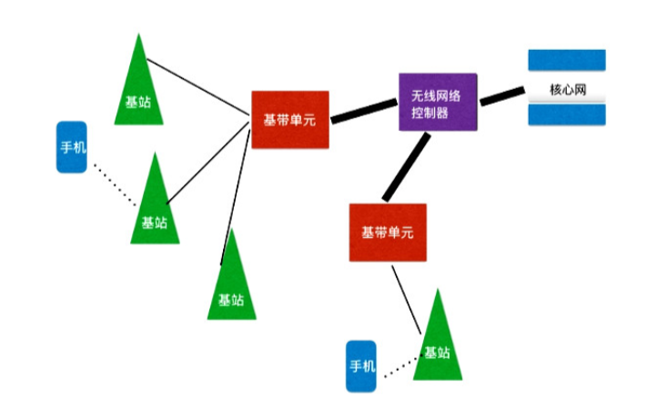

## 02 模块二：信息传播 19-28

Date：2022/01/19

------

[TOC]

------

### 19 信噪比：历史有真相吗

* eg：马未都 VS 北大教授，历史是否有真相；
  * 历史有大势，如 “分久必合，合久必分”，但细节的真相有七成都不准确。
    * 先抛出一个颠覆你认知的观点。
    * ==正确的历史观比历史细节更为重要。==
    * 任何场合都不能急，否则被对方拉入自己的主场。
  * eg：司马光砸缸 ？瓮 ？
    * 历史肯定有一些真相的，我们对大量史实的了解是没有问题的。
    * 但很多细节，今天其实不清楚。
    * 传递过程，混入了大量噪音。
    * ==只要历史的信噪比足够高，就能还原出历史的大脉络。==
* 信号和噪音的比例达到一个什么程度，就能恢复出有用的信息来呢？
  * 没有绝对阈值，而是根据信号和噪音的比例，在不同程度上能恢复一定的信息。
  * ==我们要考察的不是一条信息的准确性，而是大量数据中，有多少是准确的信息，有多少是噪音。==

* 噪音三个特点
  * 未知，而且通常是**==随机==**的；
  * **==不含有用==**信息；
  * 噪音和信息**==不是绝对的==**，要看场景。
* 噪音 VS 信息
  * 噪音，使得信息的捕获、存储、传输和处理会受到影响。
  * 信息本身的幅度（能量）相比噪音要足够高。
* 信噪比要多高，获取的信息才准确呢？
  * 取决于==接收者==捕获和处理信息的能力。
    * eg：电子设备；识别图像；智能识别摄像头，可处理信噪比比较低的；

* 信号和噪音的关系
  * **==一对孪生子，总是相伴存在。==**
    * （希望找到全是优点没有缺点的人一样，不可能）
    * 考察和判断一个人是否有处理问题的能力，**==有噪音下找出信息；==**
  * 两者**==能量叠加==**，具体到每一个信号点，它的**==准确性/置信度，都是严重受到干扰的==**。
* **历史的很多细节是不准确的，而且也无法准确**，因为历史书上记录的内容犹如第二幅的语音，**信号是被噪音所覆盖的**。但是，==历史的轮廓还是可以看清楚的==。

* 思考题
  * 谈谈自己在工作和学习中，抓大放小的经历。

2022/01/19 17:37:44 35min

------

### 20 去除噪音：如何获得更多更准确的信息

* 噪音分类（产生原因、表现形式）
  * **能找到噪音来源的 VS 不清楚来源的**
    * 屏幕来源；eg：直升机，耳罩（有来源）；
    * 知道来源也无法实施；eg：晚上 10 点的广场舞（有来源）；
    * 来源不清，更困难。
  * **有规律的噪音 VS 随机的噪音，固定频率的噪音 VS 白噪音**
    * eg：汽车马达声（有规律）；
    * eg：集市（随机）；
    * eg：鸟叫（固定频率）；
    * **==各种频率都有的噪音——白噪音==**；

* 利用计算机如何去除噪音
  * ==**利用信息的冗余。**==
    * 来源已知，规律性较强的
      * eg：麦克风阵列（专门接收噪音）；
    * 来源已知，没有规律的
      * 与应用场景有关；
      * eg：卡拉 OK 麦克风距离敏感。
  * ==**换一个角度看问题。**==
    * 一个维度分不开的两件事，换个角度看得清楚。
    * eg：红蓝图形，平面、侧面，距离；
    * eg：鸟叫声；傅里叶变换——过滤鸟叫的特定频率；
      * eg：类似；音乐会录音，过滤咳嗽声；照相机感光器灰色 PS 过滤；
  * eg：二战，香农，美英通话加密；图灵，破译德国；
    * 模拟信号、物理连线——加密不佳；
    * 白噪音安全的前提，对方不知道你产生**==白噪音的算法==**，否则他们**==可以复制这种白噪音，然后过滤==**。
    * 香农在这个课题基础上，发展起了信息论。

* 分析
  * **==1、通过信息的冗余和比对，过滤噪音。==**
    * eg：特朗普，媒体，**主观或客观地引入了噪音**；
      * 多个信息源，彼此尽可能抵消，获得信噪比很高的信息（有效信息）；
      * 麦克风阵列；
    * ==**最可贵的意见不是所谓客观的，而是真正反映自己想法的主观的意见。**==
      * 看似客观理论，实际有偏差；
      * 领导一个人的意见，噪音放大，以至于淹没信号；
      * **==如果每一个人都讲主观意见，虽每个人有偏见，但合在一起就得到大众想法的轮廓。==**【这种认识其实很久之前就偶然意识到，但是不知从何入手，从何理解。直到最近读了贝叶斯主义、贝叶斯逻辑，才找到了认知和量化的工具】
  * ==**2、将有噪音的信息分解到不同的维度过滤噪音。**==
    * eg：老婆和妈妈掉水里先救谁。
      * 要考虑的因素太多，以至于大家越想越糊涂；
      * 解套的关键是分清楚什么是我们**==该考虑的信息==**，**==什么是噪音==**，或说你**==最看重哪方面==**。
        * 若孝道第一，或以后谁和我生活更长时间是第一位，作出选择就没有什么难的。
        * 本质是将信息混杂的噪音，**==投射到某些你能够区分的维度==**。
    * 反之，隐藏信息，最好**==制造毫无规律的白噪音==**。
      * eg：Google 验证码；餐厅录音 VS 白噪音算法；

* 总结
  * 介绍了噪音的种类和来源，两种去除噪音的方法，即利用冗余度去除噪音，以及不同维度看问题去除噪音。
  * 介绍了生活中的噪音，强调了去除通信中的噪音和去除生活中的噪音，其实是同样道理。

2022/01/20 14:36:23 42min

------

### 21 信道：信息通道的容量有边界吗

* 传输信息需要一个信道
  * eg：讲话，声带、空气、耳蜗；
  * eg：电话线 / 网络线传输信息 / 无线通信；
  * ==**没有信道，信息就传输不了，如同没有路，车子就跑不了。**==

* 信道比较抽象，不像道路那么具体；因此长时间只有**感性认知**
  * eg：两个人讲话频率差不多的人，在你正前方同时讲话，无法听清楚，难分辨是谁说的；
  * eg：一男一女，同上，能够分清；
  * **前者，同样频率，信号挤在一起，如同一个车道，两辆车互不相应，结果撞在一起，谁也走不了；**
  * 后者，两条车道，不挨太近，就不会撞上。
  * **感性结论：**不同频率的信号似乎不应该相互干扰。
  * eg：无线电，不同电台的频率不能靠的太近，否则互相干扰，谁也听不清。
    * 还没有关于信道传输多少信息的概念——以为是频率调制和解调制作得不够精确——结果花了大力气，干扰还是存在。
* 香农，**==信道容量的量化度量==**
  * 当信息传输所用的信道一旦固定，能承载的信息量是有限的。**==信道的容量（带宽）==**。【用道路和车的例子，比较好理解】

* 什么是信道容量，或说带宽呢？
  * eg：人讲话频率 300 ~ 3400 Hz（声音的音频一秒钟振动次数，低音、高音）
  * 任何周期性信号，都可编程很多不同频率正（余）弦波的叠加，对信息等价；【一**==步步分解、量化、等价==**的思想学习】
    * 等价于从 300Hz、301Hz……4000Hz的正弦波叠加；（**==工程上==**会放大频率范围）
    * 数学上，任何一个频率的正弦波，都是由两个变量确定的（振幅、频率）——因此，3100 根曲线，对应了 6200 个变量。
    * 假设每个变量 8 比特信息编码
      * 于是传递说话语音的带宽就需要能每秒传递 8000 × 8 = 64K 比特信息——**==得到信道宽度==**。
      * 这也是长途电话的标准带宽。
  * 给定任何频率范围的电磁波，所能够承载的信息都是有限的。
    * eg：2.4G Wi-Fi 信号上网；如果限制频率范围2.4G到2.401G之间，求带宽？
      * 0.001 G ≈ 1M 字节【约 1000 进位】
        * 【1位=1比特；1字=2字节；1字节=8位；1字=16位】
        * 【为什么这里单位都是M？M的定义是？】
      * 约每秒 8M 比特——==实际带宽==。
    * 无线通信中，想增加带宽，就需要**==增加频率的范围==**。
      * eg：比如说你把 2.4G~5G 带宽都占了，一秒可收发 2.6千兆字节的信息
    * **==共享带宽==**

* 香农，互信息概——定义带宽
  * eg：王老师，三个学生，传递同一条信息，互信息很大，带宽就宽；
  * **==信道的容量，决定了有效的传输率==**——香农第二定律。

* 生活和信道概念的关系
  * ==**要清楚信息的传播是有成本的，其成本就源于信道的容量。**==
    * eg：张三李四替你传播，他们就是你的信道，但他们表达你意思能力有限，不可能无限传播，就是他们的信道容量。
    * eg：总裁；总裁助理，信道角色；他们反映你**==意思的准确性==**，就是这个信道的容量（带宽）。【这里准确性，隐含了吸收你多少信息的折算，本质还是容量和宽度，或者因为缺失一部分，接纳程度不高——反映在准确性上；无意中加入噪音也影响了；就像综艺节目传话、猜歌曲的游戏】
  * ==**讲了某一个范围的无线电波，所能承载的信息是有限的。**==
    * 无线通信的效率（频率共享），永远赶不上有线电缆/光缆（封闭线路，理论上可以无限制地下埋线路）；
    * eg：5G，媒体测试，没人互相抢带宽情况下得出的；防范过度炒作；
      * **==空中无线电波频率有限——最有价值的资源==**；拍卖有偿提供给运营商。
    * 无线电波从低到高的开发
      * 无线电收音机广播
      * 电视广播
      * 早期的移动通信
      * 3G、4G 和家庭 Wi-Fi
      * 5G
      * ……
      * https://www.bilibili.com/video/BV1fq4y1g7hq?spm_id_from=333.999.0.0
  * ==**量化度量这件事很重要。**==
    * eg：（上面的）语音传输的带宽是怎么计算的。目的：
      * **==说明寻找做事边界的方法，就是估算一下它们的理论极限。==**
      * eg：没有信道容量概念之前，走了很多弯路；
      * eg：长生不老药、发明永动机，同理；
    * **==了解做事情的边界（成本），在边界内尽可能把事情做好==**，通信、生活如此。

* 总结
  * 信息传输**==需要信道==**，就像公路，对信息的 “运载量” 是有上限的。
  * 信道是**==可以量化==**度量的，它的容量也被称为带宽，带宽决定了传输效率，有线通信的效率通常高于无线通信的。
* 思考题
  * 你认为，工作中如何提高自己传递信息的带宽呢？

2022/01/20 15:25:11 48min

------

### 22 香农第二定律（一）：为什么你的网页总是打不开

* 很窄的信道（容量 C 非常小，却想传输非常多的信息）

  * 唯一办法：延长传输的时间，也就是降低传输率。【类似 “降维”】

* ==传输率 R 严格定义：==单位时间（通常是秒）传输多少**==比特==**的信息。

  * eg：56K，1s 不超 56000个比特；~~【单位问题，大小写B、b；字、比特】~~
    * 【这里单位是比特，56Kilo的意思】

* 真实感受到的网速，也就是**==运营商告诉你的 1/10 左右。==**

* 理论上网速很快，或说带宽还可以，但看网页还是会卡住呢？

  * ==香农第二定律（大意）==
    * 信息通道的传输率 R，是无论如何**==无法超越信息容量 C 的，即 R≤ C。==**【类似光速 C】
    * **==总能找到一种编码方式==**，使得传输率 R **==无限接近信道容量 C==**，同时保证传输**==不出任何错误。==**【Polar Code】
    * 如果谁要试图超越信道容量传输信息，不论你怎么编码，**==出错的概率都是 100%==**。

  * eg：**==TCP/IP协议==**
    * 把要传输的数据先拆成一份份的，每一份是一个==数据包==；
    * 数据包上加入一个==数据头==，包括对数据包的描述、应该送去的地址；
    * 数据包从网络一头传到另一头——路由器（分发数据包的中转站）——几次中转。
    * 数据包传输过程总会出错，一旦出错，接收方会发现这一点，要求发送方再发一份；
    * 传输成功，接收方发回一个确认信息；
    * eg：1-10，丢 2个；
      * 发送方：流水线工作——接收方：接收的包编号，一个个确认；
        * 发送方：没有收到确认信息，重新发送，直到所有确认信息；
        * 接收方：数据包解包，还原信息。
      * 传输率
        * 用户角度：单位时间 10 个包；10 / 等待时间；
        * 网络角度：实际传输包的总数量，12个，加上额外信息：数据头 a、接收后确认回传的信息 b；（12 + a + b）/ 实际传输时间；
      * 实际传输的信息多，时间长；对你有用的信息少，等待时间比实际传输时间长，因此觉得传输率没有标称的高。
      * 如果网络容量有限
        * 发送方连续发包；
        * 接收方连续丢包——通知发送方没有收到——再发一遍；
        * 发送方——马上重发——原来的包没发完，现在又要多发很多包——网络更拥堵——==双方锁死==；【了解不清晰】
      * eg：打开网页，显示了 10%，再也打不开，以为等等就可以传完。
        * 网络**某一处信道的容量**难以满足传输率的要求后，作为接收方很长时间没有收到某个包，就无法发出接收完成的信息，传送信息的服务器就不断重新传输那些没用得到接收确认的数据包——因此永远无法完成。【这种情况是否有其他机制进行补偿？】

* 只有一条很慢的线路，**==唯一办法是主动降低传输率。==**
  * 1、张三信息通道、领导，慢；领导意图和你听到的意思互信息非常低；每次只讲一件事；如果一次 10 句话，6句都传错了，传递率降为零。
  * 2、老师和学生之间的信息通道；互信息低时，唯一做法，老师讲慢点，确定学生听懂了，再往下；否则越急，越听不懂，最后效果等于零；
    * 根据孩子的潜质，决定他所学的内容；
    * 选择学校，要选择一个适合自己的。（好的学生，学习态度、学习方法好，未必脑瓜极好的学霸）
  * 3、男女朋友和夫妻之间的关系和沟通。
    * 两情相悦 VS 三观一致（看待世界的互信息很高 → 沟通信道容量很大）；

* 总结
  * 香农第二定律，重点强调**==永远不要试图超越信道容量传输信息==**，因为那样的效果等于零；
  * 再次强调在**==边界内做事的==**重要性，通过量力而行来说明。如果**==先天的信道容量==**不足，唯一的方法就是降低速度。
* 思考题
  * 就 **==“连接比拥有更重要”==** 发表你的看法。

2022/01/22 12:03:36 54min

------

### 23 香农第二定律（二）：到底要不要扁平化管理

* 扁平化管理：管理的层级要足够少。
  * eg：DEC 公司，上下九级只有一个单一汇报人，八个领导管一个干活的。
    * 中间六七层都是冗余人员，成本剧增；
    * 上下沟通带宽变得非常窄。
  * ==**带宽等于一收一发两段的互信息，这东西是随着信息传递次数衰减的。**==

* 将层级减少后，是否真的受到了扁平化管理的好处？未必。
  * eg：一个老板下面有上百个直接汇报者；
    * 降低自己的信息传输率；
      * 延长信息交流的时间，但周期太长，出现问题也没法察觉。
    * 将大量的信息硬往不宽的信道里塞；
  * 一种虚假的扁平化管理
    * 底层员工可直接汇报，层级过于分明，领导没时间，旁领导不忠。
    * 三六九等
      * 各层信息传递，难免人为根据自己的目的，“截流” 一些信息。
        * eg：Google 出现过总监带三名全职员工掺杂很多私活；
      * 因为三六九等的职级和部门之间的壁垒将人与人通信的带宽变得非常窄，信息传输率就非常低。（时间长、收集难——虚假的扁平化管理）
      * 其实本质和==集权分层==的企业一样，都让信息==**传递和反馈变得漫长，沟通成本增高。**==
      * eg：清朝康乾两朝后期，道光、光绪，打补丁、鸡蛋价格都不清楚。
* 扁平化管理流行于信息时代
  * 原因一：信息量太大，在管理上需要更多的带宽；
  * 原因二：新的通信手段增加了带宽。
  * 作用：对内合作可以更流畅，对外更强的市场适应性。
* 扁平化管理的本质就是**==对香农第二定律的应用==**，**==保证一定带宽内的沟通效率或者利用科技提高带宽。==**
  * 市场推广的本质，也是增加对外沟通的带宽。
  * 人脉，就是人与人交往的带宽。
  * 阿里巴巴所做的事，就是拓宽了商家和消费者之间信息交流的带宽（信任的带宽）。
* ==**信道的容量（带宽），是由双方的互信息决定的，在商业上，它就是双方的信任。**==
  * eg：8848 失败的原因。
* 互联网思维
  * 不是把东西放到网上就是互联网思维。
  * 互联网的本质是通信工具，通信里面自有它的规律，比如香农第二定律。
    * 做事符合了规律就做得顺利。【逻辑门学习，我觉得没有掌握规律，因此觉得处处碰壁】
  * 除了信任，不信任也可以通过互联网传播。

* 总结
  * 多个角度讲述了扁平化管理，互联网思维和香农第二定律的关系。拓展带宽是今天我们所有人都需要做的事情。
  * 特别强调了带宽是由通信双方的互信息决定的，这在人际交流中就是信任。
  * 利用互联网的带宽，既可以传播正面信息，也可以传播负面信息，而后者无形中起到了社会监督的作用。
* 思考题
  * 什么样的企业不适合做扁平化管理，什么企业必须做？

2022/01/23 1:22:17 26min

------

### 24 纠错码：对待错误的正确态度是什么

​		本文来自《信息量 40 讲》。先前在关键词分类里面读过，这次有了一定的信息论基础，重读一遍，发现漏了一些关键内容。重温也有不少收获。

* **对必然发生的错误，我们该如何面对？**
  * ==正向思维（出错是人的天性，干扰无处不在）==
  * ==逆向思维==——==考虑到错误必然存在==，然后通过巧妙的编码解决那些问题。——具体到通信，信道编码自动纠错。
    * 前提是要有信息冗余（eg：xAy32Dz）
    * **==最简单的办法是：重复传输信息——“重要的三遍”==**
      * eg：八位二进制，三倍的信息冗余；
* **能否提高编码的效率的同时，提高信息传输的准确率呢？**
  * eg：古代犹太人手抄《圣经》；纠错方法；校验码；
  * eg：计算机运用上述，扩展到9位，第9位即**==奇偶校验位==**（记录该八进制是奇数个1，还是偶数个1）。只多了 1/8 的信息冗余。【最近读《计算思维史话》，差分机还是微分分析器，早期的某台比较精密的计算机，具有奇偶校验的功能，好像是纯机械式的机器】
* **能否通过巧妙的编码，纠正错误呢？**
  * eg：贝尔实验室 Hamming；==海明码==；**==投射，多维度定位校验==**；接近了信息论给出的最优解；
  * eg：今天仍有一些科学家在研究纠错编码，数学基础是数论和近世代数；
  * 合理的编码距离也有影响，但浪费资源；
    * eg：DNA，很多碱基似乎毫无用处（功能），信息冗余才变成今天这样；
      * 基因之间的防火墙；
      * 容错率；
* 总结
  * **==不要高估==自己的仔细，以及自己通过努力做到最仔细后，能够达到的效果。**——不确定性是自然的属性，任何问题都有考虑世界的==不完美和不确定性==——预则立，不预则废。
  * 信息传输难免出错，**避免出错**，就要**==增加一点信息冗余==**。人的水平高低，就在于==是否有效利用资源解决了更多的问题。==（24小时）
  * 有些自然存在，==看似没用的信息，先不要下结论说它没用==，在了解清楚之后，你可能会惊叹于大自然的美妙之处。

* 思考题
  * 如何利用纠错的原理增强我们交流的准确性？

2021/12/11 0:32:40 46min

2022/01/23 1:33:37 12min

------

### 25 信息加密：韦小宝说谎的秘诀

* 要诀
  * 说话九句真，一句假。
    * 摆出难题，如果不信，可能错过一两次机会；如果相信，也可能被骗损失。
    * **侧面验证**说话的真假，但并非任何时候都有机会验证。
    * 信息论密码传输的实用性原则——保证**==一定的时间内密码有效==**。
      * eg：比特币，前提，现在的计算能力，无法有限时间里破解它。
  * 同样的理由不用两次。
    * 符合加密中**==一次性密码==**永远无法破译的原则（最基本）。
    * 第三方截获加密信息后，不会获得比先前更多的信息。

* 信息论，**==加密的本质==**
  * 原始信息 I
  * 明文 C
  * 密文 E（截获对 C 的 H 不会增加）
  * 密码 K
  * 信息熵 H（知晓程度）

* 加密原则必须是
  * **==当对方收到由密码写的密文后，无法降低任何不确定性。==**

* 如何让密码在最大程度做到信息不泄密呢？
  * 随机分布的编码（对方、我方也读不出）；
  * **==伪随机：==** **用一个算法产生的随机序列。**
    * eg：圆周率 Pi 中截取一段；【变种可以隔几个/序列位置】
  * 在信息论出现之前，数学家们已经开始懂得要增加随机性这个原理，但简陋；
    * eg：一本书的页码和字的位置做编码——谍战片，母本；【想起麦家的书《风声》】
* 加密的过程
  * ==**明文 + 密码 = 密文**==
    * eg：3 +5 = 8；8 = 2 + 6……
* 破密
  * 一个密码重复使用；
  * 某些明文和密文的对应恰好不小心被泄漏；
  * 倒推密码。
    * eg：二战，中途岛海战，美军、日军，放假消息，AF 对应中途岛；
    * eg：量子通信是安全的，因为使用一次性密码。
* 密码
  * **密码要经常替换；**
    * 简单方法：两部分，一部分所有网站固定 + 一部分容易记忆；
    * 网络安全专家推荐的办法。
  * 保护隐私的好办法，**将隐私埋藏在随机的噪音汇总；**
    * eg：价格歧视
      * 随意浏览，从不购买；
      * 经常删除上网记录。
  * 如果你想让人知道你的观点，就要**明确表述**。**反之**，得不到信息量，也不要误导。
    * eg：对方问是否支持他竞选，一开始对此期望值7成，**==你说出去，也应该让他维持这个期望值。==**

* 总结
  * 密码的精髓在于，对方拿到你的密文，得不到额外的信息。要让对方获得了密文后，也无法减少你传递的信息的不确定性。
  * 保护自己隐私的办法也在于此。如果你不想给对方提供任何信息，最好办法是让他对你的猜测在得到你信息前后不产生任何变化。
  * 一次性密码最安全。虽然我们不能做到每次通信都更换密码，但至少可做到不同网站不同密码。当然，如果你要给人一个委婉退却的借口，最好每次找一个不同的理由。

2022/01/24 18:15:52 1h4min

------

### 26 极简通信史：从 1G 到 5G 通信，到底经历了什么

* 通信技术标准——制高点

| 时间 | 标准 |   变革   |    主导型公司    |
| :--: | :--: | :------: | :--------------: |
| 1968 | 1 G  | 模拟电路 |     摩托罗拉     |
| 1991 | 2 G  | 数字电路 |      诺基亚      |
|      | 3 G  | 数据通信 | 苹果、谷歌、高通 |
|      | 4 G  | 网络融合 | 苹果、谷歌、高通 |
|      | 5 G  | 彻底融合 |       华为       |
|      |  ……  |          |                  |

* 1G、3G，彼此融合，彼此独立；【4G 移动网下，接电话会断网】
* 2G、3G 时代移动通信网络的原理
  * RNC、BBU

* 4G 的革命性进步
  * 扁平的网络结构；
    * 减少端到端通信的信息转发次数，增加了基站之间光纤的带宽。
  * 同时利用互联网和电信网络的技术进步，技术融合；
  * 下一步改进
    * 提高通信频率（向上扩展；障碍物绕过能力）
    * 基站密集建设；
* 5G 
  * 200~300米基站（半径 100多米）；
  * 缩短基站，三个好处
    * 建筑物干扰问题得到解决；
    * 更少的人分享带宽；
    * 电磁波辐射大大降低，环境更安全。
  * 也许不再需要 Wi-Fi，退居次要地位；
  * 互联网和通信网络融合成一个网络（将成为通信的一次革命）。
* 通信的标准，两个最重要部分
  * 对信息的发送和接收的描述（eg：电话号码）；
  * 对信息编码的方式（eg：文字）；

* 十年一代通信标准——**制高点**；
* 从 1G 到 5G 的**==革命性变化==**
  * 1G 的诞生。
  * 1G → 2G ，从模拟电路到数字电路，专用集成电路，单位能量传输和处理信息的能力提高两个数量级。
  * 2G → 3G ，实现从语音通信到数据通信的飞跃。
  * 3G → 4G ，实现了移动通信网络和传统电信网络的融合，将云计算等互联网技术用于了移动通信，使得不同区域之间的流量能够动态平衡，大大提高带宽的使用率。
  * 4G → 5G ，可以实现移动互联网和有线的互联网的彻底融合。万物互联。单位能耗传递信息的效率大幅度提高。

* 最后分析了未来会是什么样子。
  * ==**我们做什么事情是顺应技术发展的趋势，做什么是逆流而动？**==

* 有了 5G，光线通信是否还需要？
  * 不仅需要，且大幅度提高。
    * 基站之间通讯，不得不使用移动网络实现，占据很大带宽；
  * IoT 设备。

* 总结
  * 单位能量的信息传输率越来越高；
  * 网络不断融合；
  * 设备的辐射越来越少；
  * 每一代都会有新的主导型公司出现。

* 思考题
  * 1G 到 5G 所有的网络都整合为一体了，那么 6G 将会往哪个方向进步？

2022/01/24 18:45:45 29min

------

### 27 通信趋势：5G 和 IoT 的商机在哪里

* 最大的赢家
* 寻找方向——必须使用 5G 的产业
  * IoT ——万物互联（物联网翻译不准确）
* 三代互联网的区别和特点
  * 第一代互联网，本质是==计算机和计算机的联网==；
  * 第二代互联网是今天使用的==移动互联网==；
    * 形式：移动设备；
    * 本质：人与人相连；
  * 第三代互联网是==**万物互联**==。
    * 万物互联之后，联网设备的总数会极大地提高；
    * 这么多设备来了，就带来了那个问题；（带宽、电池、新一代半导体）
    * 万物互联形成的市场规模，要比前两代互联网大得多。
* 巨大的商机不等于每一个人都能获得同等的受益机会，那么谁有可能从万物联网中受益呢？
  * **第一代互联网时期**，最重要的设备就是 PC 机和服务器；
    * 控制这个产业绕不过去的两个环节——微软、英特尔（Wintel时代）。
  * **第二代互联网时期**，最大的受益者无疑是控制操作系统的 Google 和控制处理器的 ARM；
    * Win-tel 太耗电，不符合提高平单位能量处理更多信息的发展趋势。
  * **第三代互联网，**万物互联时代，情况也如此，谁控制了==处理器和操作系统==，就会是最大的受益者。
    * 先要有行业的通信标准；
    * 华为领先半代；【难怪之前把极化码之父也请来了】
    * 第一二代，终端制造商
      * 成功转型产生的公司
        * 惠普、三星；
      * 新出现的公司
        * PC 时代的戴尔、宏碁、联想；
        * 智能手机时代的小米、华为、vivo、oppo；
      * 原来的大公司，转型失败：戴尔、联想；
      * IoT 时代，也会诞生不少新的制作 IoT 设备的大公司；
      * 带动关键性配件，闪存、显示屏、电池……
* 总结
  * 互联网三代；
  * 一代比一代，设备数量、市场规模，巨大增长，未来的机会所在；
  * 每一代都有掌握产业链的龙头公司（核心芯片、操作系统、通信标准）
  * 大公司改变基因几乎不可能，因此 IoT 产业链各环节会出现一批新公司；错过了以前时代，未来还有类似的公司。吴军时常讲：亘古而长青的昨天，永远是过去的，也永远会再来。
  * 能量的角度，每一代互联网都是以更少的能量传输和处理更多的信息，也是未来发展的方向。据此，可以判断哪一家企业契合 IoT 的发展。
* 思考题
  * 若你是学生，如何利用 IoT 提供学习成绩？上班族，如何利用节省时间？
    * 【我通过量化计算每一天、每一项任务、作息，来调整自己的时间结构】

2022/01/24 20:30:08 39min

------

### 28 复盘：世界不完美，我们该怎么办——【核心：信息】

* 噪音是我们这个世界的固有特征。
* 要有一个世界不完美的假设，然后**==练就在不完美的世界里尽可能做好事情的本领==**。
  * eg：斯蒂芬·库里，被撞是常态；
* 承认各种噪音的存在，**==争取在有噪音的情况下，准确传递信息。==**
  * 信息的传输速率不可能超过信道的容量；
  * 如果信道容量有限，最好的做法是降低信息的传输率。
* 鉴于**==信息传输特点==**，与人沟通注意要点：
  * 要特别挑选那些==带话不走样的人==，而非简单地和你关系好的人（互信息很大）。
    * 所谓人脉宽，就是指我们有能力很快地把这种信息收集进来，或传递出去。
  * 在表达意思时，一定要==看听众是谁==，用不同的方式去表达。
    * eg：竹筒倒豆子 VS 同一方式 VS 灵活；
    * 选择学校，要选择一个适合自己的，不用一心往学霸圈子里扎。
  * 基于上一点，给家长一个建议——==增加自己的带宽==，减轻代沟。
  * 在男女朋友之间和夫妻之间的==沟通上==，要在==对等的条件下==进行。
    * ==**双方在认知上的差距逐渐地越来越大，以至于无法沟通。**==

* 组织机构作为一个整体，内部沟通的要点
  * 考察——看信息能否有效传递（目的），而非绝对层级的多少（手段）；
  * 虚假的扁平化管理；
  * 买家、卖家有互信息才有带宽，信任基础；
  * 通信标准，网络融合；
  * ==打破小团体界限最有效办法==
    * 大家认可一个相同的内部通信协议（企业文化和行为规范）——有机整体。
    * 好的创始人、CEO，会把树立企业文化、制定行为规范作为首要任务，而不是事必亲躬地做每一件事。

2022/01/24 20:50:21 20min

------

