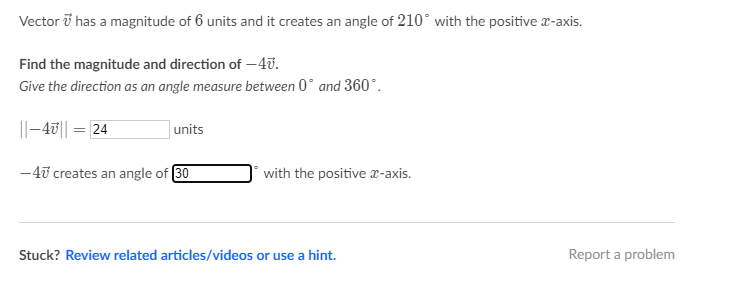

# 01-0 Week Review

Date：2022/04/27 15:59:09

------

[TOC]

------

## ML Definitions

* Arthur Samuel -- "the field of study that gives computers the ability to learn without being explicitly programmed." older, informal definition.

* Tom Mitchell --  "A computer program is said to learn from experience E with respect to some class of tasks T and performance measure P, if its performance at tasks in T, as measured by P, improves with experience E." provides a more modern definition.

  * Example: playing checkers.

    * E = the experience of playing many games of checkers.

    * T = the task of playing checkers.

    * P = the probability that the program will win the next game.

* ML
  * => supervised learning OR unsupervised learning

* Supervised Learning
  * Regression problems => continuous I/O
  * Classification problems => discrete I/O
* Unsupervised Learning
  * With little or no idea what our results should look like => Approach problems
  * Derive structure from data => Not to know the effect of the variables
  * Clustering => Automatically group
  * Non-clustering => "Cocktail Party Algorithm"
* https://www.quora.com/What-is-the-difference-between-supervised-and-unsupervised-learning-algorithms 

## ML:Linear Regression with One Variable

* Model Representation
  * Univariate linear regression
* The Hypothesis Function
  * Trying out various values of $\theta_0$ and $\theta_1$ to try to find values which provide the best possible "fit" or the most representative "straight line" through the data points mapped on the x-y plane.

## Cost Function

* Squared error function / Mean squared error (One of the cost functions)
* $\frac{1}{2} \bar{x}$ => the squares of $h_{\theta}(x_i) - y_i$ OR the difference between the preidcted value and the actual value.

## ML:Gradient Descent

* Graph => $\theta_0 , \theta_1, J(\theta_0, \theta_1)$ => $x-axis, y-axis, z-axis$ 
* Contour
* Derivative
* Learning rate
* Convergence
* Simultaneously
* Separated
  * different cases for parameters
  * differnet equations
* Speed => Accurate
* Visualization
  * https://www.youtube.com/watch?v=WnqQrPNYz5Q

# ML:Linear Algebra Review

* https://www.khanacademy.org/#linear-algebra

## Matrices and Vectors

* A vector is a matrix with one ==column== and many rows $\begin{bmatrix}w\\ x\\ y\\ z \end{bmatrix}$ 
  * A vector with =='n' rows== is referred to as an 'n'-dimensional vector
  * So, the QUESTION in an exercise before, just because I ==was not noted== that the attributes of vector above (in the field of machine learning BUT NOT in the field of math) !【NOTE】
  * Vectors are a ==subset== of matrices.

* The figure above helps to understand the INDEX of LETTER in codes.

## Addition and Scalar Multiplication

* ==element-wise==【==逐元素==（运算）】【The SAME dimensions】
  * Addition
  * subtraction
* Objects
  * Scalar value
  * Vector
  * Matrix

## Matrix-Vector Multiplication

* The result is a vector.
* The vector ==must be the **second** term== of the multiplication. 【NOTE】
* $m \times n$ by $n \times 1$ => $m \times 1$ 

## Matrix-Matrix Multiplication

* We multiply two matrices by ==breaking it into several vector== multiplications and concatenating the result

## Matrix Multiplication Properties

- Not commutative.
- Associative. (At the same order, but different Parentheses)
- Identity matrix==（Square）== 
  - When multiplying the identity matrix after some matrix (A∗I), the square identity matrix should match the other matrix's **columns**.
  - When multiplying the identity matrix before some other ==matrix (I∗A),== the square identity matrix should match the other matrix's **rows**.==【About 3 days, I had forgotten HOW the multiplication of M-M.】== 

## Inverse and Transpose

* The inverse of a martrix $A$ => $A^{-1}$ ==（Square）== 
  * Multiplying by the inverse results in the identity matrix.

* The transposition of a martirx $A'$ OR $A^T$ 
  * $A_{ij} = A_{ji}^{T}$ 

2022/04/27 18:46:10 2h50min

------

# Khan Academy Linear Algebra

## 【Exam】

