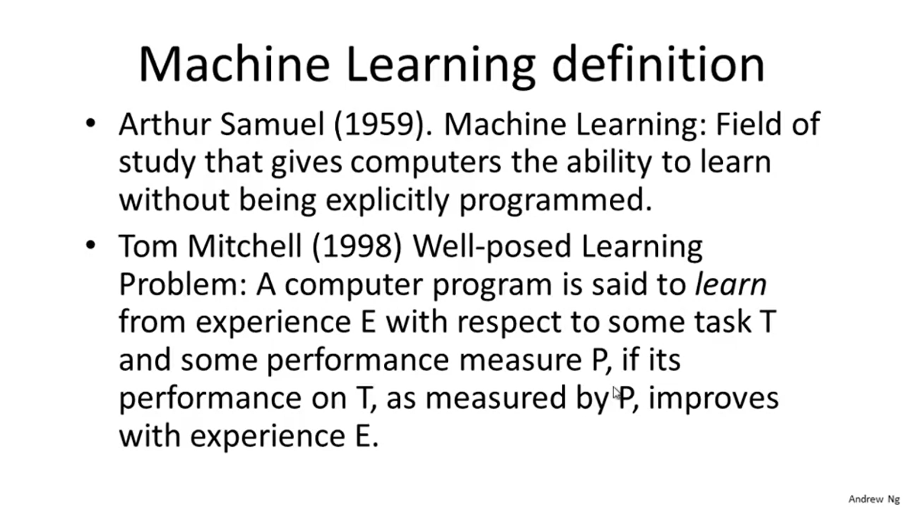

# 01-1 Week Introduction And LR with One Variable

Date：2022/04/20 22:31:29

------

[TOC]

------

## Introduction

### Q1

### What is Machine Learning?

Two definitions of Machine Learning are offered. Arthur Samuel described it as: "the field of study that gives computers the ability to learn without being explicitly programmed." This is an older, informal definition.

Tom Mitchell provides a more modern definition: "A computer program is said to learn from experience E with respect to some class of tasks T and performance measure P, if its performance at tasks in T, as measured by P, improves with experience E."

Example: playing checkers.

E = the experience of playing many games of checkers

T = the task of playing checkers.

P = the probability that the program will win the next game.

In general, any machine learning problem can be assigned to one of two broad classifications:

Supervised learning and Unsupervised learning.

------

### How to Use Discussion Forums

### Improving Your Posts

1. Make sure you’re understood, even by non-native English speakers. Try to write full sentences, and avoid text-message abbreviations or slang. Be careful when you use humor and sarcasm as these messages are easy to misinterpret.
2. If asking a question, provide as much information as possible, what you’ve already considered, what you’ve already read, etc.
3. Cite appropriate references when using someone else’s ideas, thoughts, or words.
4. Do not post personal information about other posters in the forum.

### Q2

### Supervised Learning

In supervised learning, we are given a ==data set== and already know what our ==correct output should look like==, having the idea that there is a ==relationship== between the input and the output.

Supervised learning problems are categorized into =="regression" and "classification"== problems. In a regression problem, we are trying to predict results within a ==continuous== output, meaning that we are trying to map input variables to some continuous function. In a classification problem, we are instead trying to predict results in a ==discrete== output. In other words, we are trying to map input variables into discrete categories. 

**Example 1:**

Given data about the size of houses on the real estate market, try to predict their price. Price as a function of size is a continuous output, so this is a regression problem.

We could turn this example into a classification problem by instead making our output about whether the house "sells for more or less than the asking price." Here we are classifying the houses based on price into two discrete categories.

**Example 2**:

(a) Regression - Given a picture of a person, we have to predict their age on the basis of the given picture

(b) Classification - Given a patient with a tumor, we have to predict whether the tumor is malignant or benign. 

### 【Summarization】

* supervised learning
  * regression => continuous
  * classification => discrete

* Unsupervised Learning
  * clustering algorithm
  * cocktail party algorithm
  * Organize computing clusters
  * Social network analysis
  * Market segmentation
  * Astronomical data analysis

### Q3

### Unsupervised Learning

Unsupervised learning allows us to ==approach problems with little or no idea what our results should look like.== We can derive structure from data where we don't necessarily know the effect of the variables.

We can derive this structure by ==clustering== the data based on relationships among the variables in the data.

With unsupervised learning there is ==no feedback== based on the prediction results.

**Example:**

Clustering: Take a collection of 1,000,000 different genes, and find a way to ==automatically group== these genes into groups that are somehow similar or related by different variables, such as lifespan, location, roles, and so on.

Non-clustering: The "Cocktail Party Algorithm", allows you to find structure in a ==chaotic environment==. (i.e. identifying individual voices and music from a mesh of sounds at a [cocktail party](https://en.wikipedia.org/wiki/Cocktail_party_effect)).

**Q: Is there a prerequisite for this course?**A: Students are expected to have the following background:

- Knowledge of basic ==computer science principles and skills==, at a level sufficient to ==write a reasonably non-trivial computer program==. 

- Familiarity with the basic ==probability theory==. 

- Familiarity with the basic ==linear algebra==.

### 【Wrong Question Set】

* 【The key to understand or judge "when appropriate to use unsupervised learning", is to find that whether the category task is clear.】

------

## Model and Cost Function

* linear regression / univariate linear regression

### Model Representation

To establish notation for future use, we’ll use $x^{(i)}$ to denote the “input” variables (living area in this example), also called ==input features==, and $y^{(i)}$ to denote the ==“output” or target variable== that we are trying to predict (price). A pair $(x^{(i)} , y^{(i)} )$ is called a ==training example==, and the dataset that we’ll be using to learn—a list of $m$ training examples $(x^{(i)} , y^{(i)} );i = 1, \ldots, m;$ —is called a ==training set==. Note that the superscript “(i)” in the notation is simply ==an index== into the training set, and ==has nothing to do with exponentiation==. We will also use X to denote the ==space== of input values, and Y to denote the space of output values. In this example, X = Y = ℝ. 

To describe the supervised learning problem slightly more formally, our goal is, given a training set, to learn a function h : X → Y so that h(x) is a “good” predictor for the corresponding value of y. For historical reasons, this function h is called a hypothesis. Seen pictorially, the process is therefore like this:【h is hypothesis】

 When the target variable that we’re trying to predict is ==continuous==, such as in our housing example, we call the learning problem a regression problem. When y can take on only a small number of ==discrete values== (such as if, given the living area, we wanted to predict if a dwelling is a house or an apartment, say), we call it a classification problem.

### Cost Function

* "J" function => cost function
* "h" => hypothesis function
* Squared error function / Mean squared error => the most common used one for regression problems.

We can ==measure the accuracy of our hypothesis function== by using a **cost function**. This takes an average difference (actually a fancier version of an average) of all the results of the hypothesis with inputs from x's and the actual output y's.
$$
J(\theta_0, \theta_1) = \dfrac {1}{2m} \displaystyle \sum _{i=1}^m \left ( \hat{y}_{i}- y_{i} \right)^2 = \dfrac {1}{2m} \displaystyle \sum _{i=1}^m \left (h_\theta (x_{i}) - y_{i} \right)^2
$$
To break it apart, it is $\frac{1}{2} \bar{x}$ where $\bar{x}$ is the mean of the squares of $h_\theta (x_{i}) - y_{i}$ , or the difference between the predicted value and the actual value.

This function is otherwise called the "Squared error function", or =="Mean squared error"==. The mean is halved $\left(\frac{1}{2}\right)$ as a convenience for the computation of ==the gradient descent==, as the ==derivative term== of the square function will ==cancel out the $\frac{1}{2}$ term==. The following image summarizes what the cost function does: 

### Cost Function - Intuition I

* Cause of it has no cost, so the value in $\operatorname{J}(\theta_1) $ all equal to 0,  $\operatorname{J}(1) = 0$ 

* $\operatorname{J}(0) = \frac{1}{6} (1^2 + 2^2 + 3^2) = \frac{14}{6}$ 

### Cost Function - Intuition I

If we try to think of it in visual terms, our training data set is scattered on the x-y plane. We are trying to make a straight line (defined by $h_\theta(x)$) which passes through these scattered data points. 

Our objective is to ==get the best possible line==. The best possible line will be such so that the average squared vertical distances of the scattered points from the line will be the least. Ideally, the line should pass through all the points of our training data set. In such a case, the value of $J(\theta_0, \theta_1)$ will be 0. The following example shows the ==ideal situation== where we have ==a cost function of 0==. 

When $\theta_1 = 1$, we get a slope of 1 which goes through every single data point in our model. Conversely, when $\theta_1 = 0.5$, we see the vertical distance from our fit to the data points increase. 

This increases our cost function to 0.58. Plotting several other points yields to the following graph: 

Thus as a goal, we should try to ==minimize the cost function==. In this case, $\theta_1 = 1$ is our global minimum. 

### Cost Function - Intuition II

* contour plots
* contour figures

### Cost Function - Intuition II

A contour plot is a graph that contains many contour lines. A contour line of a two variable function has a constant value at all points of ==the same line==. An example of such a graph is the one to the right below.

* 【==What I think== is that, actually, the graph of function J is a 3D model, but if we want to analysis how this two parameters $\theta_0,\theta_1$ determine what a value of J look like, it just ==like a contour plot in 2D that cut from the 3D model==.】

Taking any color and going along the 'circle', one would expect to get the same value of the cost function. For example, the three green points found on the green line above have the same value for $J(\theta_0,\theta_1)$ and as a result, they are found along the same line. The circled x displays the value of the cost function for the graph on the left when $\theta_0 = 800$ and $\theta_1= -0.15$. Taking another $h(x)$ and plotting its contour plot, one gets the following graphs:

When $\theta_0 = 360$ and $\theta_1 = 0$, the value of $J(\theta_0,\theta_1)$ in the contour plot gets closer to the center thus reducing the cost function error. Now giving our hypothesis function a slightly positive slope results in a better fit of the data.

The graph above minimizes the cost function as much as possible and consequently, the result of $\theta_1$ and $\theta_0$ tend to be around 0.12 and 250 respectively. Plotting those values on our graph to the right seems to put our point in the center of the inner most 'circle'. 

* 【It's as same as the plot in 2D in the video of cost function I, like a bowl, the lowest point will be the minimum value of the cost function and the most fit status of the hypothesis function.】

------

### Gradient Descent

* learning rate => determine how bigger the step we take one time
* assignment operator VS Truth assertion
* update the equation
* simultaneously update

### Gradient Descent

So we have our hypothesis function and we have a way of measuring how well it fits into the data. Now we need to estimate the parameters in the hypothesis function. That's where gradient descent comes in.

Imagine that we graph our hypothesis function based on its fields $\theta_0$ and $\theta_1$ (actually we are graphing the cost function as a function of the parameter estimates). We are not graphing x and y itself, ==but the parameter range of our hypothesis function== and ==the cost resulting== from selecting a particular set of parameters.

We put $\theta_0$ on the x axis and $\theta_1$ on the y axis, with the cost function on the vertical z axis. The points on our graph will be the result of the cost function using our hypothesis with those specific theta parameters. The graph below depicts such a setup.

We will know that we have succeeded ==when our cost function is at the very bottom of the pits in our graph==, i.e. when its value is the minimum.  The red arrows show the minimum points in the graph.

The way we do this is by taking the derivative (the tangential line to a function) of our cost function. The slope of the tangent is the derivative at that point and it will give us a direction to move towards. We make steps down the cost function in the direction with the steepest descent. ==The size of each step== is determined by the parameter α, which is called the ==learning rate.== 

For example, the distance between each 'star' in the graph above represents a step determined by our parameter α. A smaller α would result in a smaller step and a larger α results in a larger step. ==The direction== in which the step is taken is determined by the ==partial derivative== of $J(\theta_0,\theta_1)$. Depending on where one starts on the graph, one could end up at different points. The image above shows us two different starting points that end up in two different places. 

The gradient descent algorithm is:

==repeat until convergence==:

$\theta_j := \theta_j - \alpha \frac{\partial}{\partial \theta_j} J(\theta_0, \theta_1)$

where

j=0,1 represents the ==feature index number==.

At each ==iteration== j, one should ==simultaneously update== the parameters $\theta_1, \theta_2,...,\theta_n$. Updating a specific parameter prior to calculating another one on the $j^{(th)}$ iteration would yield to a ==wrong implementation==. 

------

### Gradient Descent Intuition

* $\theta_1:=\theta_1$ 

* No need to decrease $\alpha$ over time
* Each step will get smaller with the iteration.

### Gradient Descent Intuition

In this video we explored the scenario where we used one parameter $\theta_1$ and plotted its cost function to implement a gradient descent. Our formula for a single parameter was : 

Repeat until convergence:

$\theta_1:=\theta_1-\alpha \frac{d}{d\theta_1} J(\theta_1)$

==Regardless== of the slope's sign for $\frac{d}{d\theta_1} J(\theta_1)$, $\theta_1$ ==eventually converges to its minimum value==. The following graph shows that when the slope is ==negative==, the value of $\theta_1$ increases and when it is ==positive==, the value of $\theta_1$ decreases.

* 【Pay attention to the word 'regardless', it is meaningful to help judging what's the variable or parameter, is what I think.】
* 【slope => negative VS positive => $\theta_1$ increases VS decreases】
  * 【slope is d, d, theta 1, the partial derivative of function J】

==On a side note==, we should ==adjust our parameter== $\alpha$ to ensure that the gradient descent algorithm ==converges in a reasonable time==. ==Failure to converge or too much time== to obtain the minimum value imply that our step size is ==wrong==.

### How does gradient descent converge with a fixed step size \alpha*α*?

 The intuition behind the convergence is that $\frac{d}{d\theta_1} J(\theta_1)$ approaches 0 as we approach the bottom of our ==convex function==. At the minimum, ==the derivative will always be 0== and thus we get: 

$\theta_1:=\theta_1-\alpha \times 0$ 

------

### Gradient Descent For Linear Regression【Need to Review】

* "Batch" Gradient Descent
  * Each step of gradient descent uses all the training examples.

### Gradient Descent For Linear Regression 

**Note:** [At 6:15 "h(x) = -900 - 0.1x" should be "h(x) = 900 - 0.1x"]【OK】

When ==specifically== applied to the case of linear regression, ==a new form of the gradient descent equation== can be derived. We can substitute our actual cost function and our actual hypothesis function and modify the equation to :
$$
repeat -until -convergence:\{\\
		θ_0 := θ_0−α\frac{1}{m}∑_{i=1}^{m}(h_θ(x_i)−y_i)\\

	θ_1 := \theta_1 − α \frac{1}{m}∑_{i=1}^{m}((hθ(x_i)−y_i)x_i)\\
	\}
$$
where m is the size of the training set, $\theta_0$ a constant that will be changing simultaneously with $\theta_1$ and $x_{i}$, $y_{i}$ are values of the given training set (data).

Note that we have separated out the two cases for $\theta_j$ into separate equations for $\theta_0$ and $\theta_1$; and that for $\theta_1$ we are multiplying $x_{i}$ at the end due to the derivative. The following is a derivation of $\frac {\partial}{\partial \theta_j}J(\theta)$ for a single example : 

* 【not really understand that simplified way. What it depends on ?】

==The point of all this== is that if we start with a guess for our hypothesis and then repeatedly apply these gradient descent equations, our hypothesis will become more and more ==accurate==.

So, this is simply gradient descent on the original cost function J. This method ==looks at every example in the entire training set on every step==, and is called ==**batch gradient descent**==. Note that, while gradient descent can be susceptible to local minima in general, the optimization problem we have posed here for linear regression has ==only one global==, and no other local, optima; thus gradient descent ==always converges== (assuming the learning rate α is not too large) to the global minimum. Indeed, J is a ==convex quadratic function==. Here is an example of gradient descent as it is run to minimize a quadratic function.

The ==ellipses== shown above are the contours of a quadratic function. Also shown is the ==trajectory== taken by gradient descent, which was initialized at (48,30). The x’s in the figure (joined by straight lines) mark the ==successive== values of θ that gradient descent went through as it converged to its minimum.

（2022/04/23 3:17:07）

### 【Questions】

* How to get the simplified function in gradient descent ?
* What's the mean of "Batch" Gradient descent ? It's hard to understand no matter in Chinese, may be find in other books.

### 【Summarization】

* Cost function
* Gradient Descent
* Simultaneously update $\theta_0,\theta_1$ 
* Local minima VS Global minimum
* 3D => 2D contour plot / contour figure
* Learning rate
* $J(0)$

（2022/04/23 3:54:43）

------

### 【Wrong  Question Set】

* 错

* 【原】Coursera—Andrew Ng机器学习—Week 1 习题—Linear Regression with One Variable 单变量线性回归 - 马小豆包 - 博客园  https://www.cnblogs.com/maxiaodoubao/p/9865802.html

* Errara https://www.coursera.org/learn/machine-learning/resources/UWXuL

## Errata Week 1

### Introduction

- Supervised Learning: 1:25: Describing the curve as quadratic is confusing since the independent variable is price, but the plot's X-axis represents area.
- Unsupervised Learning: 6:56 - the mouse does not point to the correct audio sample being played on the slide. Each subsequent audio sample has the mouse pointing to the previous sample.

- Unsupervised Learning: 12:50 - the slide shows first option "Given email labelled as span/not spam, learn a spam filter" as one of the answers as well. Whereas, in the audio Professor puts it in Supervised Learning category.

### Linear Regression With One Variable

- A general note about the graphs that Prof Ng sketches when discussing the cost function. The vertical axis can be labeled either 'y' or 'h(x)' interchangeably. 'y' is the true value of the training example, and is indicated with a marker. 'h(x)' is the hypothesis, and is typically drawn as a curve. The scale of the vertical axis is the same, so both can be plotted on the same axis.【OK】

- In the video "Cost Function - Intuition I", at about 6:34, the value given for J(0.5) is incorrect.【is 0.58 correct after Prof Ng modified the answer.】

- Parameter Learning: Video "Gradient Descent for Linear Regression": At 6:15, the equation Prof Ng writes in blue "h(x) = -900 - 0.1x" is incorrect, it should use "+900".【OK】

### Gradient Descent for Linear Regression

- At Timestamp 3:27 of this video lecture, the equation for θ1 is wrong, please refer to first line of Page 6 of ex1.pdf (Week 2 programming Assignment) for model equation (==The last x is X superscript i, subscript j== (Which is 1 in this case, as it is of θ1)). θ0 is correct as it will be multiplied by 1 anyways(value of X superscript i, subscript 0 is 1), as per the model equation.【OK，remembered that when I did the exercise】

### Linear Algebra Review

- Matrix-Matrix Multiplication: 7:14 to 7:33 - While exploring a matrix multiplication, Andrew solved the problem correctly below, but when he tried to rewrite the answer in the original problem, one of the numbers was written incorrectly. The correct result was (matrix 9 15) and (matrix 7 12), but when it was rewritten above it was written as (matrix 9 15) and (matrix 4 12). The 4 should have been a 7. (Thanks to John Kemp and others). This has been partially corrected in the video - third subresult matrix shows 7 but the sound is still 4 for both subresult and result matrices. Subtitle at 6:48 should be “two is seven and two”, and subtitle at 7:14 should be “seven twelve and you”.

- 3.4: Matrix-Matrix Multiplication: 8:12 - Andrew says that the matrix on the bottom left shows the housing prices, but those are the house sizes as written above

- 3.6: Transpose and Inverse: 9:23 - While demonstrating a transpose, an example was used to identify B(subscript 12) and A(subscript 21). The correct number 3 was circled in both cases above, but when it was written below, it was written as a 2. The 2 should have been a 3. (Thanks to John Kemp and others)

### Addition and scalar multiplication video

- Spanish subtitles for this video are wrong. Seems that those subtitles are from another video.

2022/04/28 16:11:01 Errata