# 01-2 Week Linear Algebra

Date：2022/04/24 18:25:51

------


[TOC]


------


## Matrices and Vectors

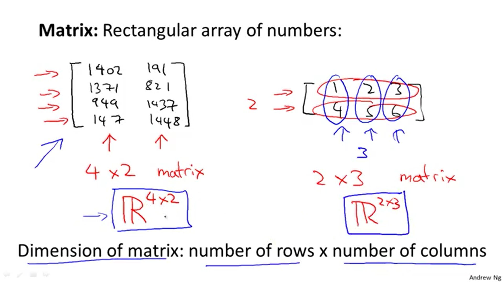

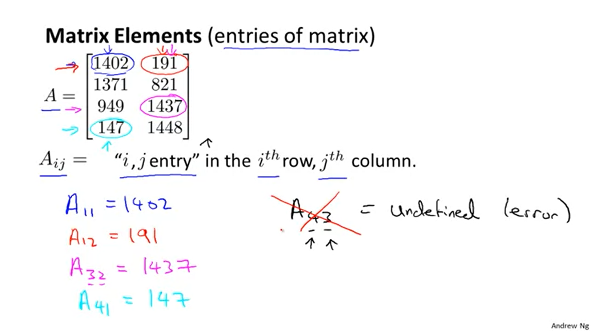


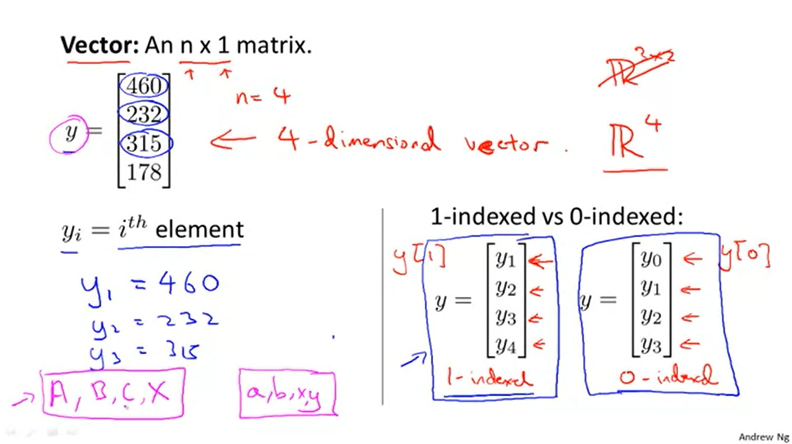


So vectors are a subset of matrices. The above vector is a 4 x 1 matrix.

**Notation and terms**:

- $A_{ij}$ refers to the element in the ith row and jth column of matrix A.
- A vector with 'n' rows is referred to as an 'n'-dimensional vector.
- $v_i$ refers to the element in the ith row of the vector.
- In general, all our vectors and matrices will be 1-indexed. Note that for some programming languages, the arrays are 0-indexed.
- ==Matrices== are usually denoted by ==uppercase== names while ==vectors== are ==lowercase==.
- =="Scalar"== means that an object is a ==single value==, not a vector or matrix.
- $\mathbb{R}$ refers to the set of scalar real numbers.
- $\mathbb{R^n}$ refers to the set of n-dimensional vectors of real numbers.

```octave
% The ; denotes we are going back to a new row.
A = [1, 2, 3; 4, 5, 6; 7, 8, 9; 10, 11, 12]

% Initialize a vector 
v = [1;2;3] 

% Get the dimension of the matrix A where m = rows and n = columns
[m,n] = size(A)

% You could also store it this way
dim_A = size(A)

% Get the dimension of the vector v 
dim_v = size(v)

% Now let's index into the 2nd row 3rd column of matrix A
A_23 = A(2,3)
```


## Addition and Scalar Multiplication

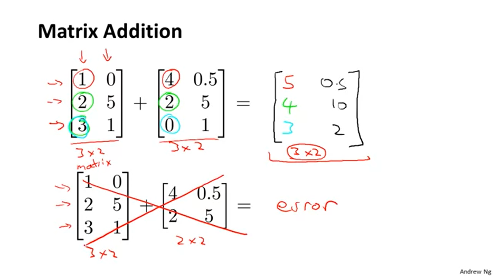

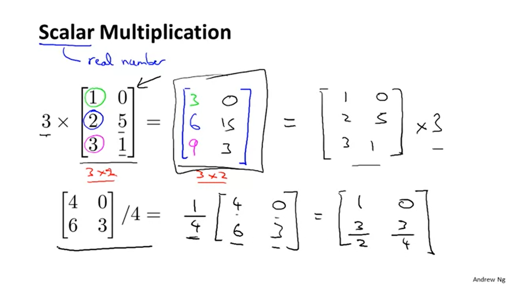

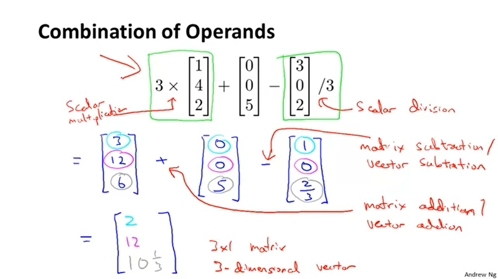


To add or subtract two matrices, their dimensions must be **the same**.

```octave
% Initialize matrix A and B 
A = [1, 2, 4; 5, 3, 2]
B = [1, 3, 4; 1, 1, 1]

% Initialize constant s 
s = 2

% See how element-wise addition works
add_AB = A + B % [2, 5, 8; 6, 4, 3]

% See how element-wise subtraction works
sub_AB = A - B % [0, -1, 0; 4, 2, 1]

% See how scalar multiplication works
mult_As = A * s % [2, 4, 8; 10, 6, 4]

% Divide A by s
div_As = A / s % [0.5, 1, 2; 2.5, 1.5, 1]
%   0.50000   1.00000   2.00000
%   2.50000   1.50000   1.00000

% What happens if we have a Matrix + scalar?
add_As = A + s % [3, 4, 6; 7, 5, 4]
```


## Matrix Vector Multiplication

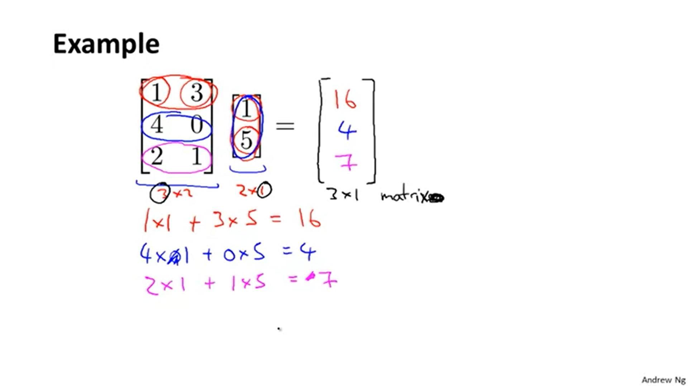

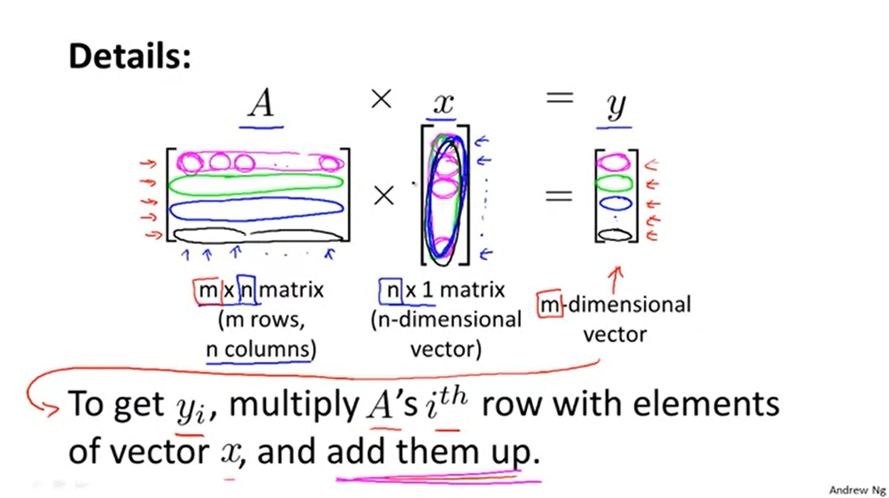

* Thought about the multiplication in a separate way. 


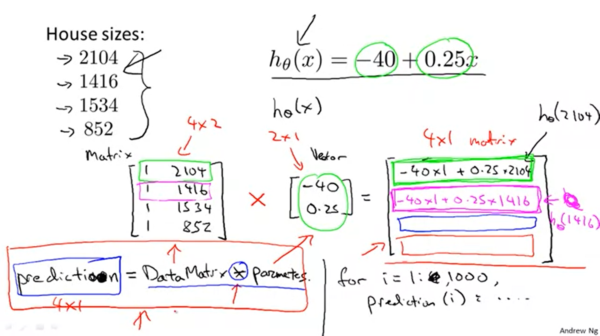

* Why the Data Matrix has to columns ? By 1 in the first column ?

 The number of **columns** of the matrix must equal the number of **rows** of the vector.

An **m x n matrix** multiplied by an **n x 1 vector** results in an **m x 1 vector**.

```octave
% Initialize matrix A 
A = [1, 2, 3; 4, 5, 6;7, 8, 9] 

% Initialize vector v 
v = [1; 1; 1] 

% Multiply A * v
Av = A * v % [6; 15; 24]
```


### Matrix Matrix Multiplication

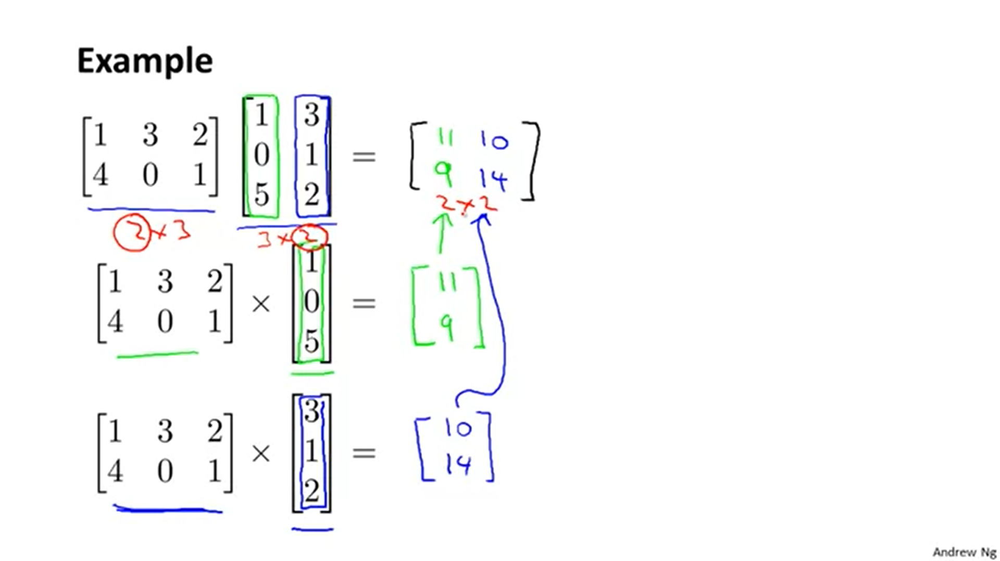

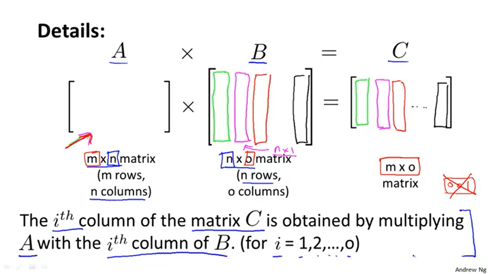

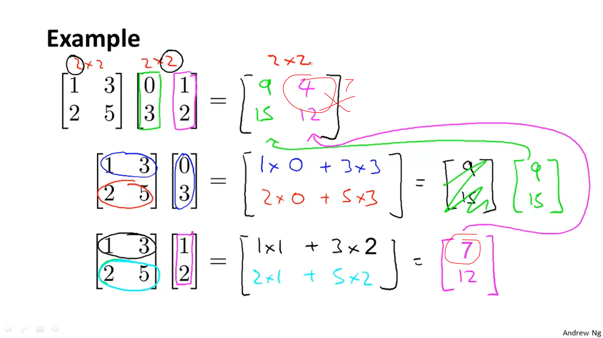

- Matrix-Matrix Multiplication: 7:14 to 7:33 - While exploring a matrix multiplication, Andrew solved the problem correctly below, but when he tried to rewrite the answer in the original problem, one of the numbers was written incorrectly. The correct result was (matrix 9 15) and (matrix 7 12), but when it was rewritten above it was written as (matrix 9 15) and (matrix 4 12). The 4 should have been a 7. (Thanks to John Kemp and others). This has been partially corrected in the video - third subresult matrix shows 7 but the sound is still 4 for both subresult and result matrices. Subtitle at 6:48 should be “two is seven and two”, and subtitle at 7:14 should be “seven twelve and you”.

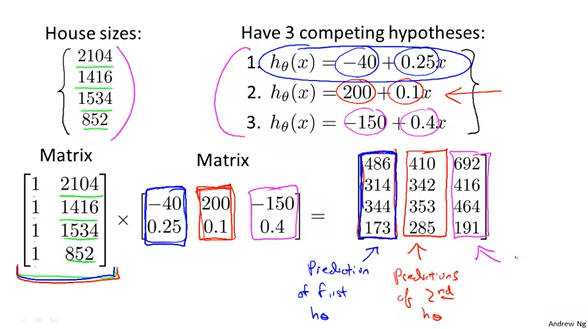

* 3.4: Matrix-Matrix Multiplication: 8:12 - Andrew says that the matrix on the bottom left shows the housing prices, but those are the house sizes as written above【OK】


We multiply two matrices by ==breaking it into several vector multiplications and concatenating the result==.

To multiply two matrices, the number of **columns** of the first matrix must equal the number of **rows** of the second matrix.

```octave
% Initialize a 3 by 2 matrix 
A = [1, 2; 3, 4;5, 6]

% Initialize a 2 by 1 matrix 
B = [1; 2] 

% We expect a resulting matrix of (3 by 2)*(2 by 1) = (3 by 1) 
mult_AB = A*B % [5; 11; 17]

% Make sure you understand why we got that result
```


### Matrix Multiplication Properties

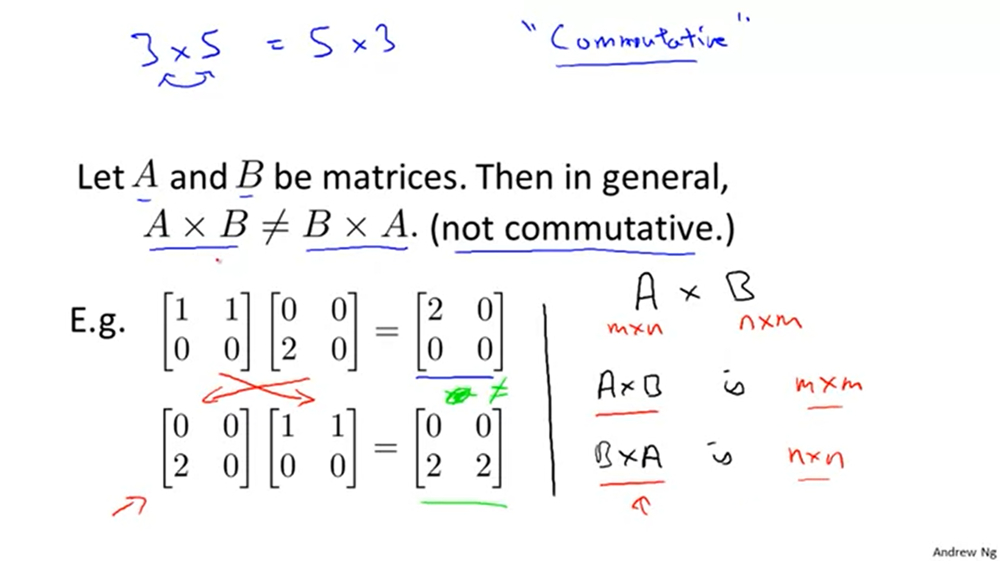

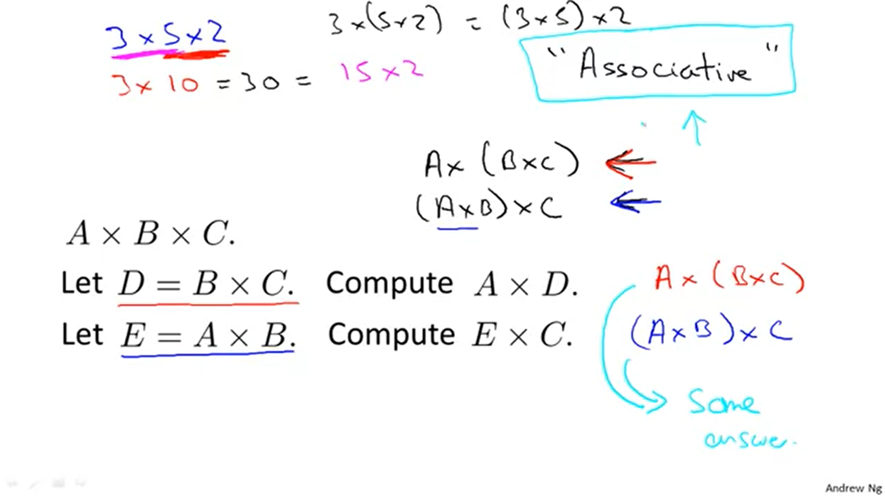

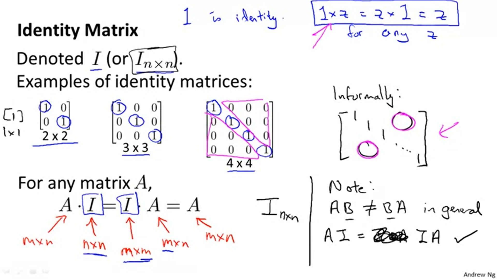


The **identity matrix**, when multiplied by any matrix of the same dimensions, results in the original matrix. It's just like multiplying numbers by 1. The identity matrix simply has 1's on the diagonal (upper left to lower right diagonal) and 0's elsewhere.

When multiplying the identity matrix after some matrix (A∗I), the square identity matrix's dimension should match the other matrix's **columns**. When multiplying the identity matrix before some other matrix (I∗A), the square identity matrix's dimension should match the other matrix's **rows**.

```octave
% Initialize random matrices A and B 
A = [1,2;4,5]
B = [1,1;0,2]

% Initialize a 2 by 2 identity matrix
I = eye(2)

% The above notation is the same as I = [1,0;0,1]

% What happens when we multiply I*A ? 
IA = I*A % [1, 2; 4, 5]

% How about A*I ? 
AI = A*I % [1, 2; 4, 5]

% Compute A*B 
AB = A*B % [1, 5; 4, 14]

% Is it equal to B*A? 
BA = B*A % [5, 7; 8, 10]

% Note that IA = AI but AB != BA
```


### Inverse and Transpose

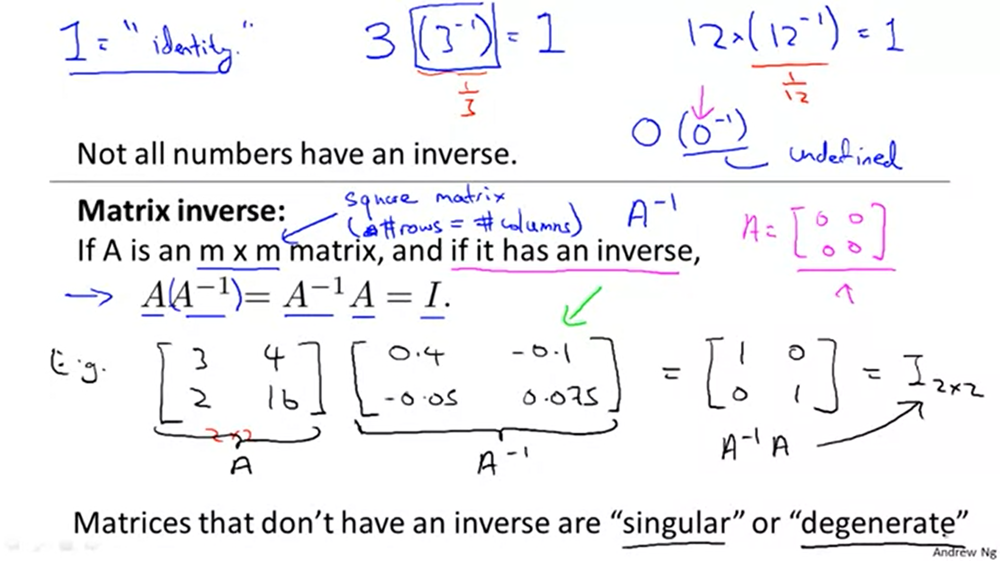

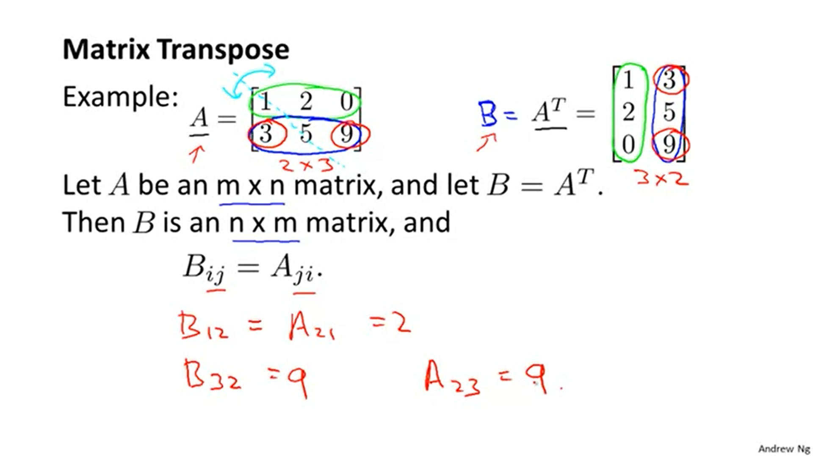

* 3.6: Transpose and Inverse: 9:23 - While demonstrating a transpose, an example was used to identify B(subscript 12) and A(subscript 21). The correct number 3 was circled in both cases above, but when it was written below, it was written as a 2. The 2 should have been a 3. (Thanks to John Kemp and others)【OK】


The **inverse** of a matrix A is denoted $A^{-1}$. Multiplying by the inverse results in the ==identity matrix==.

A non ==square matrix== does not have an inverse matrix. We can compute inverses of matrices in octave with the `pinv(A)`function and in Matlab with the `inv(A)` function. Matrices that don't have an inverse are *singular* or *degenerate*.

The **transposition** of a matrix is like rotating the matrix 90**°** in clockwise direction and then reversing it. We can compute transposition of matrices in matlab with the `transpose(A)` function or `A'`.

$A_{ij}=A_{ji}^T$ 

```octave
% Initialize matrix A 
A = [1,2,0;0,5,6;7,0,9]

% Transpose A 
A_trans = A' 

% Take the inverse of A 
A_inv = inv(A)

% What is A^(-1)*A? 
A_invA = inv(A)*A
```


### 【Summary】

* Dimension
  * matrix : rows $\times$ columns
  * vector (An n $\times$ 1 matrix) : the quantity of elements
  * $\mathbb R$ VS $\mathbb R^n$
* Indexed
  * 1-indexed
  * 0-indexed
* Addition & Scalar multiplication (real number)
  * must be at the same dimension
  * multiplication : breaking into several vector multiplications and concatenating the result (As the course of MIT 18.06SC in Lecture 1).
    * M-v multiplication
    * M-m multiplication
* Based rules
  * Not Commutative
  * Associative
* Identity Matrix (A Square Matrix)
  * diagonal
  * $I$ or $I_{n \times n}$ 
  * $A \cdot I = I \cdot A = A$ 
* Inverse Matrix
  * ==Square== Matrix => inverse
  * $AA^{-1} = A^{-1}A = I$ 
  * "singular" or "degenerate" : Matrices that don't have an inverse.

* Transpose
  * rows => columns
  * $45^{\circ}$ 
  * If $B = A^T$ => $B_{ij} =A_{ji}$ 


（2022/04/24 21:54:28 1h58min）

------