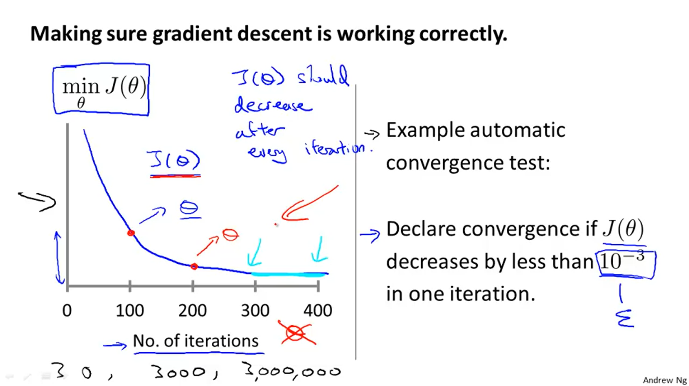

# 02-2 Week Two Linear Regression with Multiple Variables

Date：2022/04/25 15:01:11

------

[TOC]

------

## Multivariate Linear Regression

### Multiple Features

* It's very important to recognize the symbol(notation) of concepts.

### Multiple Features

**Note:** [7:25 - $\theta^T$ is a 1 by (n+1) matrix and not an (n+1) by 1 matrix]

Linear regression with multiple variables is also known as "multivariate linear regression".

We now introduce ==notation== for equations where we can have any number of input variables.

> $x_j^{(i)} $ = value of feature j in the $i^{th}$ training example
>
> $x^{(i)}$ = the input (features) of the  $i^{th}$ training example
>
> $m$ = the number of training examples
>
> $n$ = the number of features

The multivariable form of the hypothesis function accommodating these multiple features is as follows:

$h_\theta (x) = \theta_0 + \theta_1 x_1 + \theta_2 x_2 + \theta_3 x_3 + \cdots + \theta_n x_n$ 

In order to develop intuition about this function, we can think about $\theta_0$ as the basic ==price== of a house, $\theta_1$ as the price per square meter, $\theta_2$ as the price per floor, etc. $x_1$ will be the ==number== of square meters in the house, $x_2$ the number of floors, etc.

Using the definition of matrix multiplication, our multivariable hypothesis function can be concisely represented as:

$h_θ(x) = \begin{bmatrix}θ_0 & θ_1 & \dots & θ_n\end{bmatrix} \begin{bmatrix}x_0\\x_1\\ \vdots\\x_n\end{bmatrix} = θ^Tx$

This is ==a vectorization of== our hypothesis function for one training example; see the lessons on vectorization to learn more.

Remark: Note that for ==convenience== reasons in this course we assume $x_{0}^{(i)} =1 \text{ for } (i\in { 1,\dots, m } )$. This allows us to do matrix operations with theta and x. Hence making the two vectors $'\theta$' and $x^{(i)}$ match each other ==element-wise== (that is, have the same number of elements: n+1).]

### Gradient Descent for Multiple Variables

* The image compares gradient descent with ==one variable== to gradient descent with ==multiple variables==.【May be need to understand it in different domains. ONE VS MULTIPLE】

### Gradient Descent in Practice I - Feature Scaling【Have to Review】

### Gradient Descent in Practice I - Feature Scaling

**Note:** [6:20 - The average size of a house is 1000 but 100 is accidentally written instead]

We can ==speed up== gradient descent by having each of our input values in roughly the ==same range==. This is because θ will descend quickly on small ranges and slowly on large ranges, and so will oscillate inefficiently down to the optimum when the variables are very uneven.

The way to prevent this is to modify the ranges of our input variables so that they are all roughly the same. Ideally:

$−1 ≤ x_{(i)} ≤ 1$ 

or

$−0.5 ≤ x_{(i)} ≤ 0.5$ 

These aren't exact requirements; ==we are only trying to speed things up.== The ==goal== is to ==get all input variables into roughly one of these ranges, give or take a few==.

Two techniques to help with this are **feature scaling** and **mean normalization**. ==Feature scaling== involves dividing the input values by the range (i.e. the maximum value minus the minimum value) of the input variable, resulting in a new range of just 1. ==Mean normalization== involves subtracting the average value for an input variable from the values for that input variable resulting in a new average value for the input variable of just zero. To implement both of these techniques, adjust your input values as shown in this formula:

$x_i := \dfrac{x_i - \mu_i}{s_i}$

Where $μ_i$ is the **average** of all the values for feature (i) and $s_i$ is the range of values (max - min), or $s_i$ is the standard deviation.

Note that dividing by the ==range==, or dividing by the ==standard deviation==, give ==different results==. The quizzes in this course use range - the programming exercises use standard deviation.

For example, if $x_i$ represents housing prices with a range of 100 to 2000  and a mean value of 1000, then, $x_i := \dfrac{price-1000}{1900}$.

### Gradient Descent in Practice II - Learning Rate

### Gradient Descent in Practice II - Learning Rate

**Note:** [5:20 - the x -axis label in the right graph should be \theta*θ* rather than No. of iterations ]

**Debugging gradient descent.** Make a plot with *number of ==iterations==* on the x-axis. Now plot the cost function, $J(θ)$ over the number of iterations of gradient descent. If $J(θ)$ ever ==increases==, then you probably need to ==decrease α==.

**Automatic convergence test.** Declare convergence if $J(θ)$ decreases by less than $E$ in one iteration, where $E$ is some small value such as $10^{−3}$. However in practice it's ==difficult to choose== this threshold value.

It has been proven that if learning rate α is sufficiently small, then $J(θ)$ will decrease on every iteration.

To summarize:

 If $\alpha$ is too small: slow convergence. 

 If $\alpha$ is too large: may not decrease on every iteration and thus may not converge.

### Features and Polynomial Regression

Using the machinery of multivariant linear regression, we can do this with a pretty simple modification to our algorithm.

* $0 \le x_1 \le 1$ , $0 \le x_2 \le 1$ 

### Features and Polynomial Regression

We can improve our features and the form of our hypothesis function in a couple different ways.

We can **combine** multiple features into one. For example, we can combine x_1*x*1 and $x_2$ into a new feature $x_3$ by taking $x_1⋅x_2$.

### **Polynomial Regression**

Our hypothesis function need not be linear (a straight line) if that does not fit the data well.

We can **change the behavior or curve** of our hypothesis function by making it a quadratic, cubic or square root function (or any other form).

For example, if our hypothesis function is $h_\theta(x) = \theta_0 + \theta_1 x_1$ then we can create additional features based on x_1*x*1, to get the quadratic function $h_\theta(x) = \theta_0 + \theta_1 x_1 + \theta_2 x_1^2$ or the cubic function $h_\theta(x) = \theta_0 + \theta_1 x_1 + \theta_2 x_1^2 + \theta_3 x_1^3$ 

In the cubic version, we have created new features $x_2$ and $x_3$ where $x_2 = x_1^2$ and $x_3 = x_1^3$.

To make it a square root function, we could do: $h_\theta(x) = \theta_0 + \theta_1 x_1 + \theta_2 \sqrt{x_1}$ 

One important thing to keep in mind is, ==if you choose your features this way then feature scaling becomes very important.==

eg. if $x_1$ has range 1 - 1000 then range of $x_1^2$ becomes 1 - 1000000 and that of $x_1^3$ becomes 1 - 1000000000

### 【Summary】

* The variables from one to multiple, the features as well.
  * i.e., the cost function $J(\theta)$ has a new repeat form.
* Not only the cost function, but also several tools have to modify in order to fit the extension of variables.
  * eg : gradient descent
  * $\theta_0, \theta_1, \dots,\theta_n$ => a vector of **$\bf{\theta}$**
* Some new tools
  * **Feature Scaling**
    * Make sure features are on a similar scale.
    * approximately [-1, 1], [0, 1], as 3 to times up, 0.03
  * Mean Normalization
    * replace the $x_i$ to $x_i - \mu_i$ 
    * approximately ZERO
  * range VS standard deviation
  * Debugging gradient descent (iteration of $\min_\theta J(\theta)$)
  * Automatic convergence test => by using smaller $\alpha$ 
  * the machinery of multivariant linear regression
  * features in different forms
  * Polynomial Regression

### 【QUESTION】

* A exercise below, about feature scaling without mean normalization.
  * $0 \le x_1 \le 1$ , $0 \le x_2 \le 1$  => get【but why ? => the goal of Scaling ?】【yes】=> approximately [-1, 1], [0, 3] ... 
* the equation of
  * feature scaling and mean normalization
  * the new $J(\theta)$ 

（2022/04/25 17:46:51 2h48min）

------

## Computing Parameters Analytically

### Normal Equation

* ==【Very important】==
  * The index of letters, in different meaning when in rows or in training set or columns.

### Normal Equation

**Note:** [8:00 to 8:44 - The design matrix X (in the bottom right side of the slide) given in the example should have elements x with subscript 1 and superscripts varying from 1 to m because for all m training sets there are only 2 features $x_0$ and $x_1$. 12:56 - The X matrix is m by (n+1) and NOT n by n. ]

Gradient descent gives one way of minimizing J. Let’s discuss a second way of doing so, this time performing the minimization explicitly and without resorting to an iterative algorithm. In the "Normal Equation" method, ==we will minimize J by explicitly taking its derivatives with respect to the θj ’s, and setting them to zero==. This allows us to find the optimum theta ==without iteration==. The normal equation formula is given below: 

* 【Question】about the highlight sentences above.

$\theta = (X^T X)^{-1}X^T y$

There is **no need** to do feature scaling with the normal equation.

The following is a ==comparison== of gradient descent and the normal equation:

| Gradient Descent           | Normal Equation                                |
| :------------------------- | :--------------------------------------------- |
| Need to choose alpha       | No need to choose alpha                        |
| Needs many iterations      | No need to iterate                             |
| $O (kn^2)$                 | $O (n^3)$, need to calculate inverse of $X^TX$ |
| Works well when n is large | Slow if n is very large                        |

With the normal equation, computing the inversion has complexity $\mathcal{O}(n^3)$. So if we have a very large number of features, the normal equation will be slow. In practice, when n exceeds 10,000 it might be a good time to go from a normal solution to an iterative process.

### Normal Equation Noninvertibility

### Normal Equation Noninvertibility【solution】

When implementing the normal equation in octave we want to use the 'pinv' function rather than 'inv.' The 'pinv' function will give you a value of $\theta $ even if $X^TX$ is not invertible. 

If $X^TX$ is **noninvertible,** the common causes might be having :

- Redundant features, where two features are ==very closely related== (i.e. they are ==linearly dependent==)
- ==Too many== features (e.g. m ≤ n). In this case, ==delete== some features or use "==regularization==" (to be explained in a later lesson).

Solutions to the above problems include deleting a feature that is linearly dependent with another or deleting one or more features when there are too many features.

### 【Summary】

* Normal Equation
* Noninvertibility => solution
* design matrix

### 【QUESTION】

* How to understand the ZERO of J below ?

* How to clearly recognize the several INDEX between the letters ?

* How the Normal equation get quickly operation in a small $n$ ? 
* How to understand the non-invertible below ?

2022/04/25 23:02:44 1h Review

------

## Working on and Submitting Programming Assignments

* Warm up
* submitting
* Tips
  * https://www.coursera.org/learn/machine-learning/supplement/SFKpu/programming-tips-from-mentors

## 【Exam】

* 错

* 错

* 错

* A much more directly path ！

2022/04/25 23:47:36 44min