# 02-3 Week Octave-MATLAB

Date：2022/04/26

------


[TOC]


------


## Basic Operator

```octave
ls
# Octave 6.4.0, Fri Apr 01 04:18:42 2022 GMT <unknown@LAPTOP-UH36CL8K>
cap
mkdir MLWU
A = magic(3)
A(:,1) = 0
# Octave 6.4.0, Thu Apr 21 02:12:39 2022 GMT <unknown@LAPTOP-UH36CL8K>
1>5+6
1> 5+6
5+6
3-2
5*8
1/2
2^6
1 == 2
1 ~= 2
1 && 0
1 || 0
xor(1, 0)
PS1('>> ');
PS1('>>> ');
PS1('>> ');
a = 3
a=3
a
b = 'hi'
b
c = (3 >= 1)
c
a=pi
disp(a)
disp(sprintf('2 decimals: %0.2f', a))
disp(sprintf('6 decimals: %0.6f', a))
format long
a
format short
a
A = [1 2; 3 4; 5 6]
A = [1 2;
3 4;
5 6]
V = [1 2 3]
V = [1; 2; 3]
v = 1:0.1:2
v = 1:6
ones(2, 3)
C = 2 * ones(2, 3)
C = [2 2 2; 2 2 2]
w = ones(1, 3)
w = zeros(1, 3)
w = rand(1, 3)
rand(3, 3)
w = randn(1, 3)
w = -6 + sqrt(10)*(randn(1, 10000))
hist(w)
hist(w, 50)
eye(4)
I = eye(4)
I = eye(3)
help
help eye
help help
clear
```


## Moving Data Around

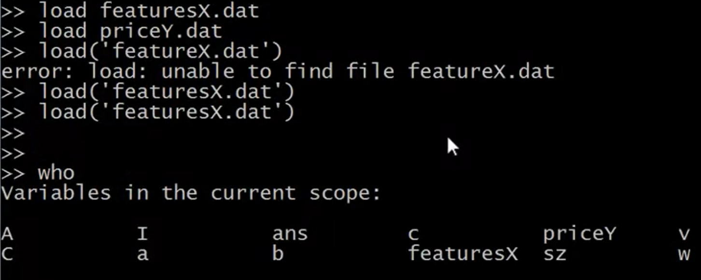

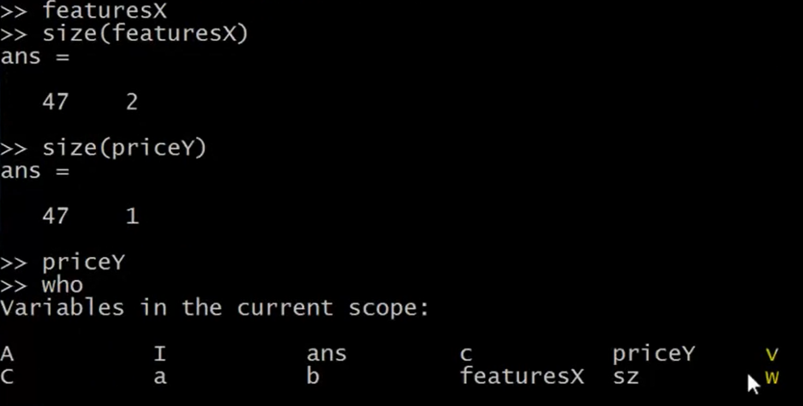

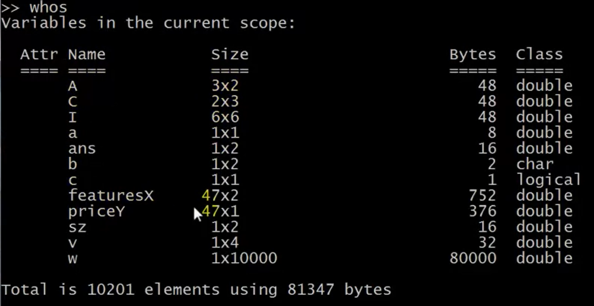

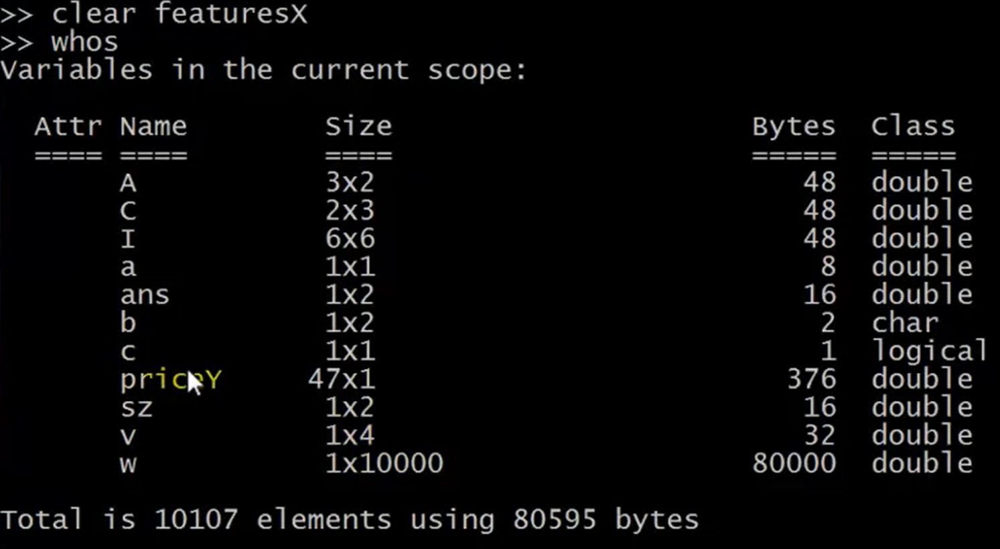

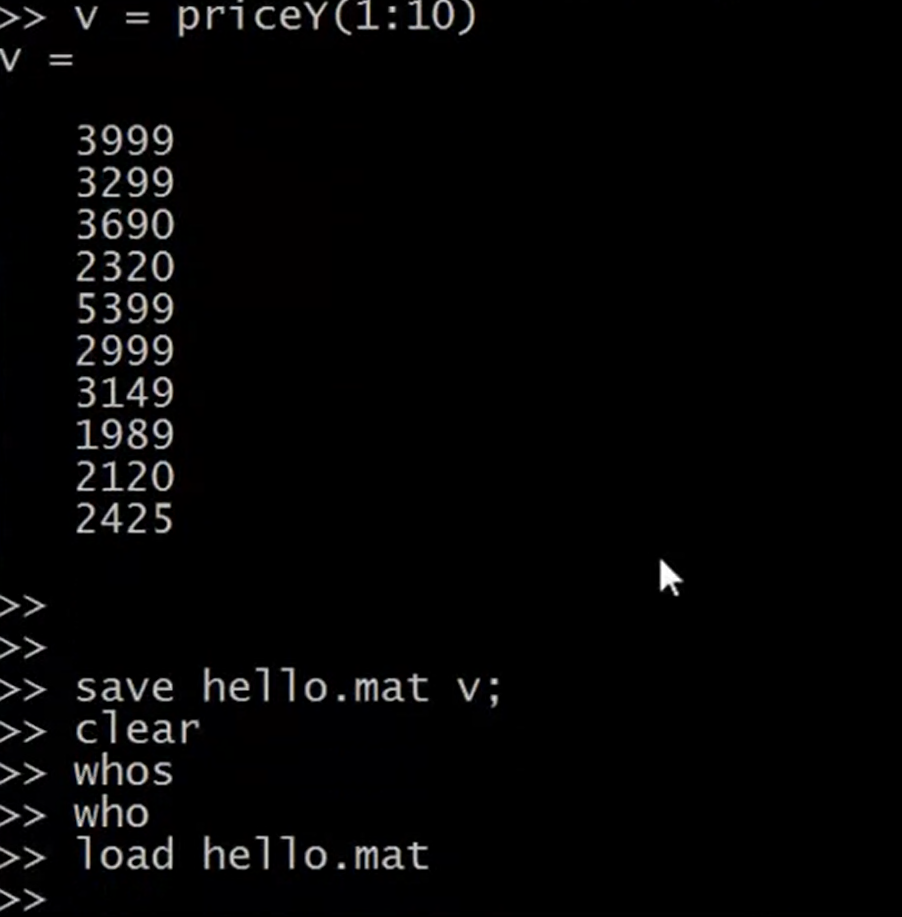

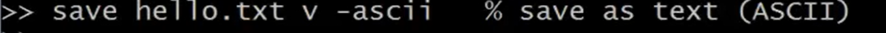


```octave
3 = 1
3 == 1
# Octave 6.4.0, Tue Apr 26 17:58:40 2022 GMT <unknown@LAPTOP-UH36CL8K>
PS1('>> ')
A = [1 2; 3 4; 5 6]
size(A)
sz = size(A)
size(sz)
size(A, 1)
size(A, 2)
v = [1 2 3 4]
length(v)
length(A)
length([1;2;3;4;5])
pwd
pwd
cd 'C:\Users\CELFS'
pwd
pwd
ls
who
whos
save hello.txt v -ascii % save as text (ASSCII)
A = [1 2; 3 4; 5 6]
A(3,2)
A(2,:)
A(:,2)
A([1 3], :)
A(:,2)
A(:,2) = [10; 11; 12]
A = [A, [100; 101; 102]]
size(A)
A(:) % put all elements of A into a single vector
A = [1 2; 3 4; 5 6]
B = [11 12; 13 14; 15 16]
C = [A B]
C = [A; B]
size(C)
[A, B]
```


## Computing on Data

```octave
A = [1 2; 3 4; 5 6]
B = [11 12; 13 14; 15 16]
C = [1 1; 2 2]
A*C
A .* C
A .* B
A * B
A
A .^ 2
V = [1; 2; 3]
1 ./ V
1 ./ A
1 ./ A % get a inverse of A
log(V)
exp(V)
v
V
abs(V)
abs([-1; -2; -3])
-V
-V % -1*V
V 
V + ones(length(V), 1)
V + ones(3, 1)
V + 1
A
A'
a = [1 15 2 0.5]
val = max(a)
[val, ind] = max(a)
max(A)
a
a < 3
find(a < 3)
find(a < 3) % the index of a < 3
A = magic(3)
A
[r, c] = find(A >= 7)
help find
a
sum(a)
prod(a)
prod(a)
floor(a)
ceil(a)
rands(3)
rand(3)
A
max(A, [], 1)
help max
max(max(A))
A(:)
max(A(:))
A = magic(9)
sum(A,1)
A
A .* eye(9)
sum(sum(A.*eye(9)))
sum(sum(A.*flipud(9)))
sum(sum(A.*flipud(eye(9))))
eye(9)
flipud(eye(9))
A = magin(3)
A = magic(3)
pinv(A)
temp = pinv(A)
temp * A
format short
temp * A
```


## Plotting Data

```octave
t = [0:0.01:0.98]
t
y1 = sin(2*pi*4*t)
plot(t,y1)
y2 = cos(2*pi*4*t)
plot(t,y2)
hold on
plot(t,y2)
plot(t,y1, 'r')
xlable('time')
xlabel('time')
ylabel('value')
legend('cos', 'sin')
title('my plot')
print -dpng 'myPlot.png'
close
figure(1);plot(t,y1)
figure(1);plot(t,y1)
figure(2);plot(t,y2)
subplot(1,2,1) % Divides plot a 1x2 grid, access first element
plot(t, y1)
subplot(1,2,2)
plot(t, y2)
axis([0.5 1 -1 1])
clf
A = magic(5)
imagesc(A)
imagesc(A)
imagesc(A)
imagesc(A), colorbar, colormap gray
A(1, 2)
imagesc(magic(15)), colorbar, colormap gray
a = 1; b = 2; c = 3
a = 1, b = 2, c = 3
a = 1, b = 2, c = 3 % comma chaning of funciton calls
```


## Control Statements: for, while, if statement

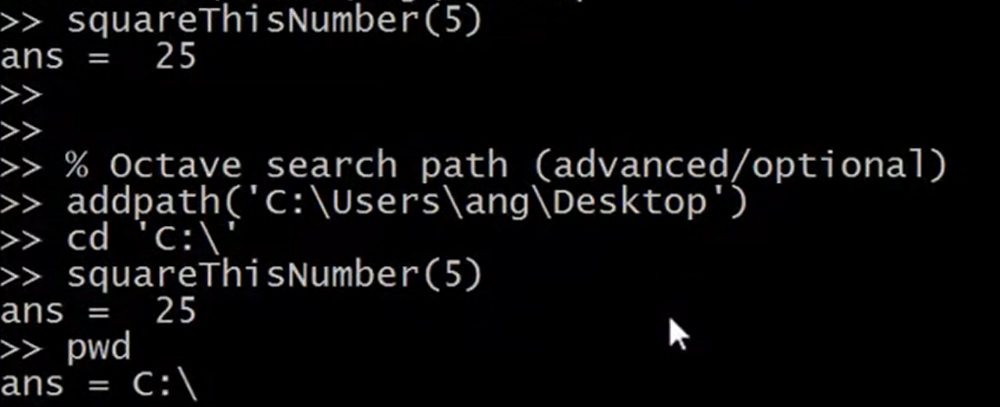

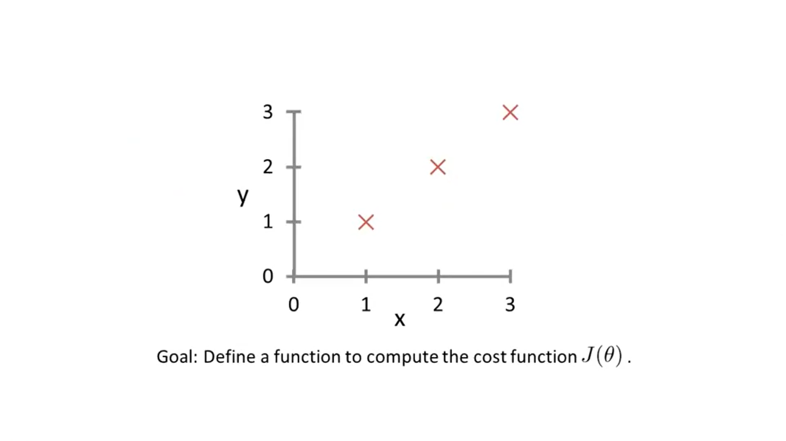

```octave
v = zeros(10, 1)
for i = 1:10,
	v(i) = 2^i;
	end;
v
indices = 1:10
for i = indices,
	disp(i)
end
v
i = 1
while i <= 5,
	v(i) = 100
	i = i + 1
end
i = 1
while true,
	v(i) = 999
	i = i + 1
	if i == 6,
		break
	end
end
i = 1;
while true,
	v(i) = 999;
	i = i + 1;
	if i == 6,
		break;
	end;
end;
v
v(1)
v(1) = 2
if v(1) == 1,
	disp('The value is one');
elseif v(1) == 2,
	disp('The value is two');
else
	disp('The value is not one or two')
end;
squareThisNumber(5)
[a, b] = squareAndCubeThisNumber(5)

X = [1 1; 1 2; 1 3]
Y = [1; 2; 3]
theta = [0; 1]
y = [1; 2; 3]
j = costFunctionJ(X, y, theta)
theta = [0; 0]
j = costFunctionJ(X, y, theta)
(1^2 + 2^2 + 3^2) / (2 * 3)
```

* How to indent in the command terminal ?


## Vectorization

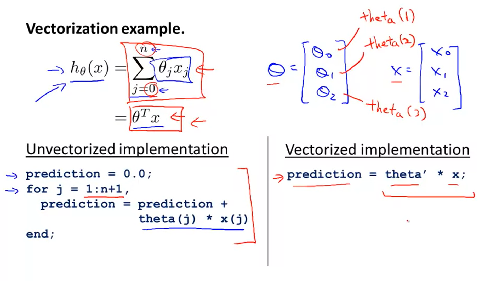

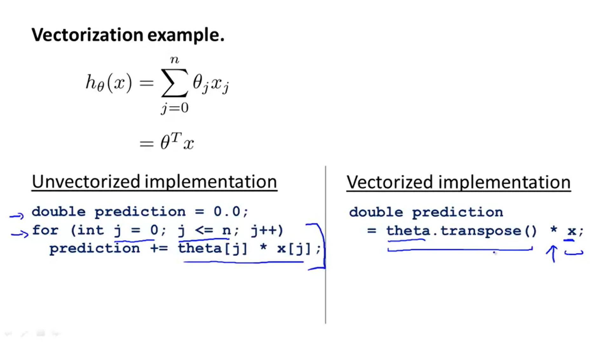

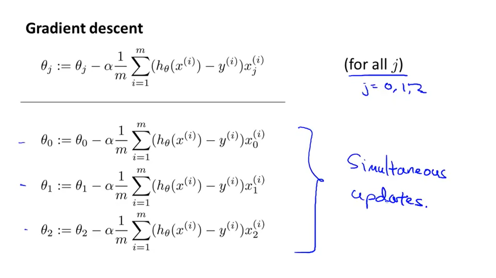

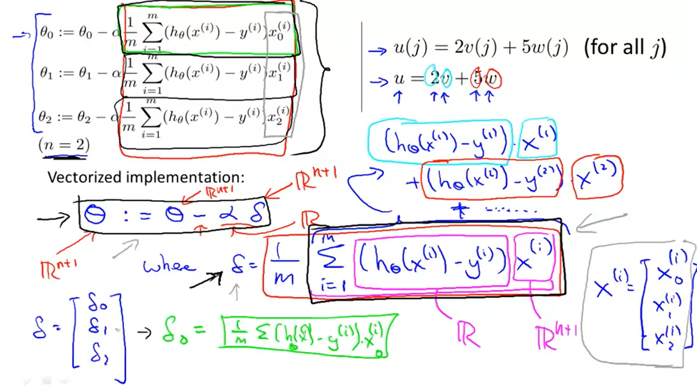

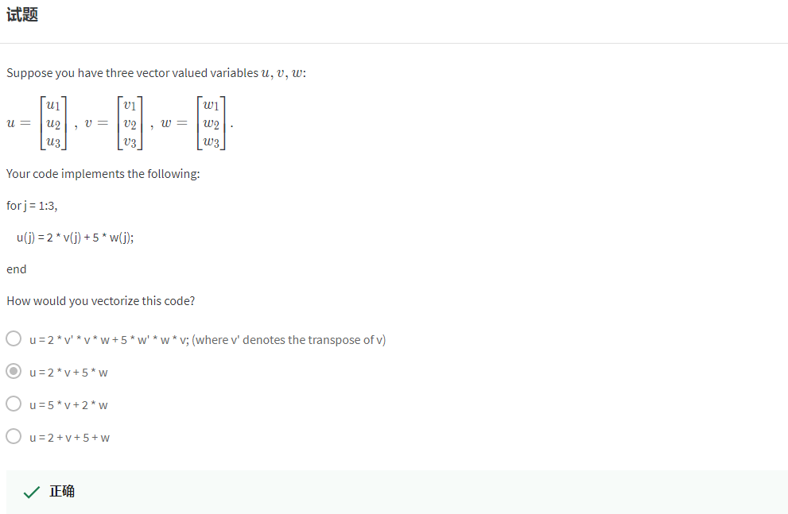

* 【QUESTION】
* 【What I thought is using a vector to replace a sequence of one parameter, others as well.】
  * Basically, it's about the equation of $\theta^T x$ 
* 【But the relationship between the original parameter in the form of function and the vector of what the parameter extends looking like, is necessary to have a clear understand.】


### 【Exam】

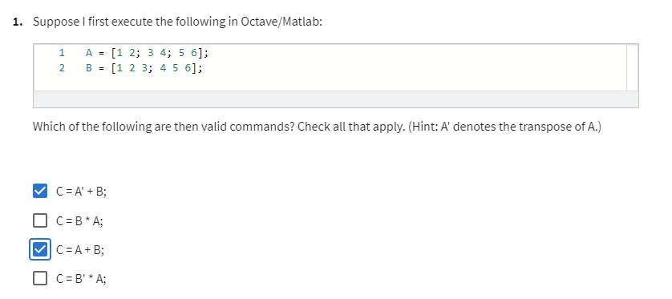

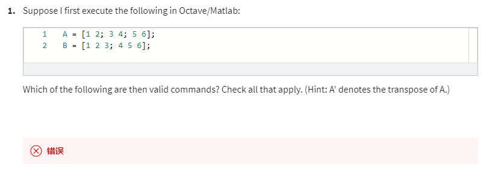


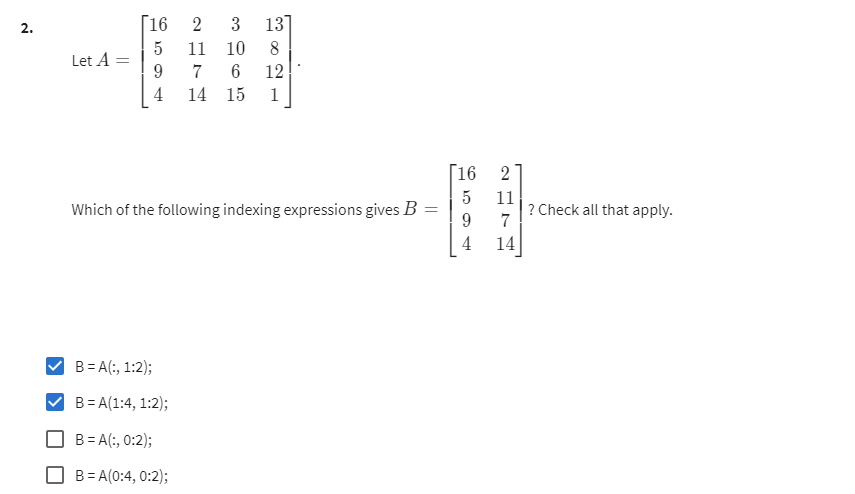

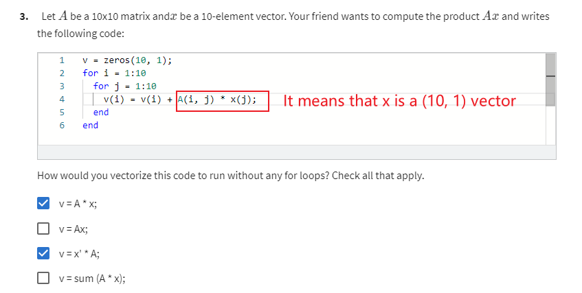

* 【NO, it just means that the element in the matrix and the vector take a operation.】

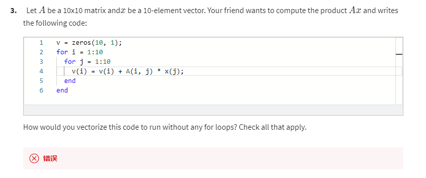


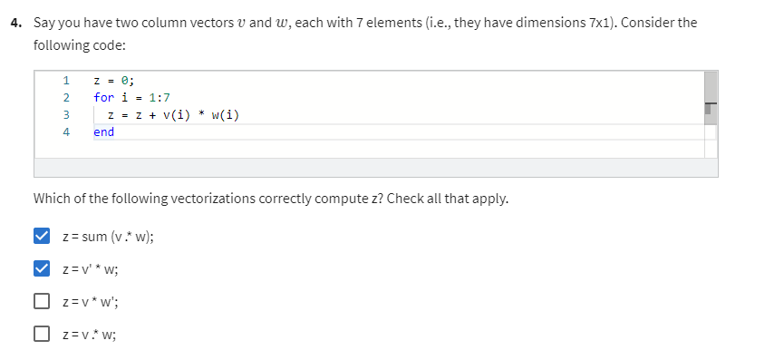

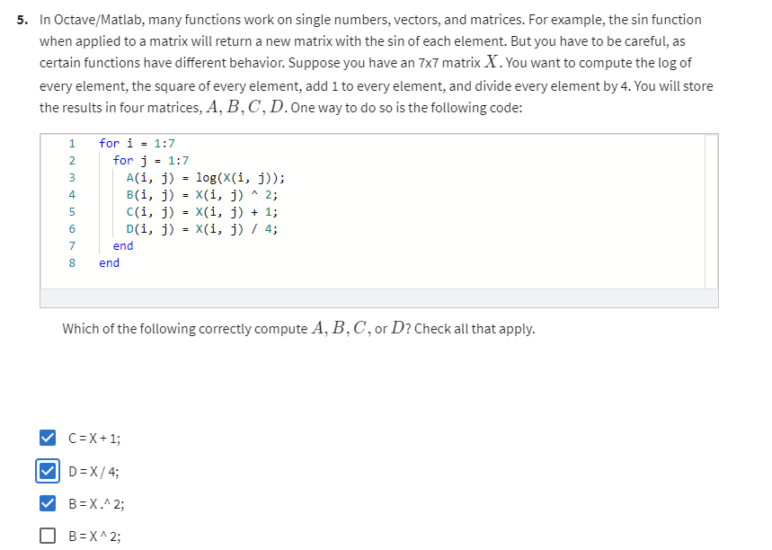


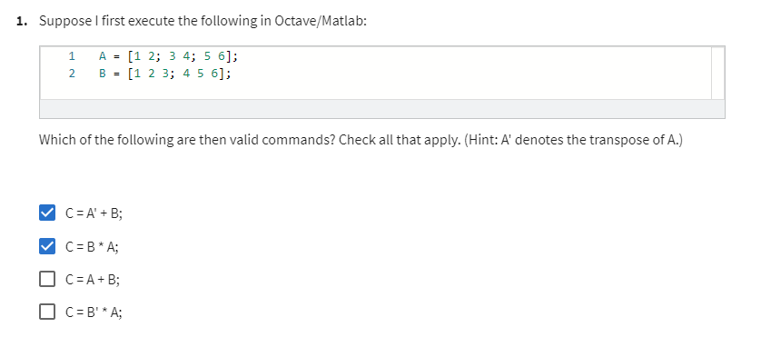

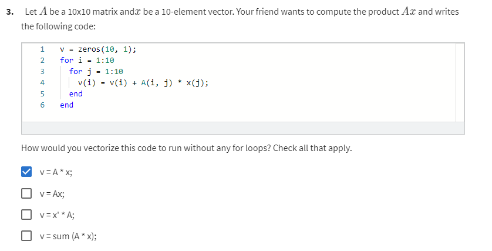

* 【OK，the v is the form of goal, so no matter what the x is a column vector or a row vector, only when x's a column vector can be defined.】


2022/04/26 22:07:27 58min

------