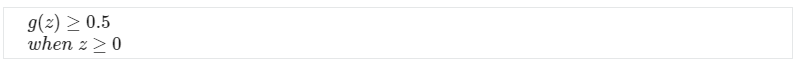

# 03-1 Week Logistic Regression

Date：2022/04/28 1:22:19

------


[TOC]


------


# Classification and Representation

## Classification


## Classification 

To attempt classification, one method is to use linear regression and map all predictions greater than 0.5 as a 1 and all less than 0.5 as a 0. However, this method doesn't work well because ==classification is not actually a linear function==.

The classification problem is just like the regression problem, except that the values we now want to predict take on only a small number of ==discrete values==. For now, we will focus on the **binary classification** **problem** in which y can take on only two values, 0 and 1. (Most of what we say here will also generalize to the multiple-class case.) For instance, if we are trying to build a spam classifier for email, then $x^{(i)}$ may be some features of a piece of email, and y may be 1 if it is a piece of spam mail, and 0 otherwise. Hence, ==y∈{0,1}==. 0 is also called the ==negative class==, and 1 the ==positive class==, and they are sometimes also denoted by the ==symbols “-” and “+.”== Given $x^{(i)}$, the corresponding $y^{(i)}$ is also called the label for the training example. 


## Hypothesis Representation


## Hypothesis Representation

We could approach the classification problem ==ignoring== the fact that y is discrete-valued, and use our ==old linear regression algorithm== to try to predict y given x. However, it is easy to construct examples where this method performs very poorly. Intuitively, it also ==doesn’t make sense== for $h_\theta (x)$ to take values larger than 1 or smaller than 0 when we know that y ∈ {0, 1}. To fix this, let’s ==change the form for our hypotheses== $h_\theta (x)$ to satisfy  $0\leq h_\theta (x) \leq 1$. This is accomplished by plugging $\theta^Tx$ into the Logistic Function.

Our new form uses the "==Sigmoid Function==," also called the "==Logistic Function==":


The following image shows us what the sigmoid function looks like: 


The function g(z), shown here, maps any real number to the (0, 1) interval, making it useful for transforming an ==arbitrary-valued function== into a function better ==suited for classification==.

$h_\theta(x) $ will give us the ==**probability**== that our output is 1. For example, $h_\theta(x)=0.7 $ gives us a probability of 70% that our output is 1. Our probability that our prediction is 0 is just the complement of our probability that it is 1 (e.g. if probability that it is 1 is 70%, then the probability that it is 0 is 30%).


## Decision Boundary


## Decision Boundary 

In order to get our discrete 0 or 1 classification, we can ==translate the output of the hypothesis== function as follows:


The way our logistic function g behaves is that when its input is greater than or equal to zero, its output is greater than or equal to 0.5:



Remember.


So if our input to g is $\theta^T X$, then that means:


From these statements we can now say:

The **decision boundary** is the line that separates the area where y = 0 and where y = 1. ==It is created by our hypothesis function.== 

**Example**:


In this case, our decision boundary is a straight vertical line placed on the graph where $x_1 = 5$, and everything to the left of that denotes y = 1, while everything to the right denotes y = 0.

Again, the ==input== to the sigmoid function g(z) (e.g. $\theta^T X$) ==doesn't need to be linear, and could be a function that describes a circle== (e.g. $z = \theta_0 + \theta_1 x_1^2 +\theta_2 x_2^2$) or any shape to fit our data.


# Logistic Regression Model

## Cost Function


## Cost Function

We cannot use the same cost function that we use for linear regression because the Logistic Function will cause the output to be wavy, causing many local optima. In other words, it will not be a convex function.

Instead, our cost function for logistic regression looks like:


When y = 1, we get the following plot for $J(\theta)$ vs $h_\theta (x)$:


Similarly, when y = 0, we get the following plot for $J(\theta)$ vs $h_\theta (x)$:


If our correct answer 'y' is 0, then the cost function will be 0 if our hypothesis function also outputs 0. If our hypothesis approaches 1, then the cost function will approach infinity.

If our correct answer 'y' is 1, then the cost function will be 0 if our hypothesis function outputs 1. If our hypothesis approaches 0, then the cost function will approach infinity.

Note that writing the cost function in this way ==guarantees that J(θ) is convex== for logistic regression.


## Simplified Cost Function and Gradient Descent


* a maximum of likelihood function


* But the hypothesis function is different.
  * **Note:** [6:53 - the gradient descent equation ==should have a 1/m factor==]【Errara】


## Simplified Cost Function and Gradient Descent 

**Note:** [6:53 - the gradient descent equation should have a 1/m factor]

We can compress our cost function's two conditional cases into one case:


Notice that when y is equal to 1, then the second term $(1-y)\log(1-h_\theta(x))$ will be zero and will not affect the result. If y is equal to 0, then the first term $-y \log(h_\theta(x))$ will be zero and will not affect the result.

* 【It's magic, how clever the man who created this case of function ! It reminds me of the Gates of binary in the book Code.】

We can fully write out our entire cost function as follows:

A vectorized implementation is:


### Gradient Descent

Remember that the general form of gradient descent is:


We can work out the derivative part using calculus to get:


Notice that this algorithm is identical to the one we used in linear regression. We still have to simultaneously update all values in theta.

A vectorized implementation is:


## Advanced Optimization


* line search algorithm


**Note:** [7:35 - '100' should be 100 instead. The value provided should be an integer and not a character string.]


## Advanced Optimization

**Note:** [7:35 - '100' should be 100 instead. The value provided should be an integer and not a character string.]

=="Conjugate gradient", "BFGS", and "L-BFGS"== are more sophisticated, faster ways to optimize θ that can be used instead of gradient descent. We suggest that ==you should not write these more sophisticated algorithms yourself== (unless you are an expert in numerical computing) but use the ==libraries instead==, as they're already tested and highly optimized. Octave provides them.

We first need to ==provide a function== that evaluates the following two functions for a given input value θ:


We can write a single function that returns both of these:

```octave
function [jVal, gradient] = costFunction(theta)
	jVal = [...code to compute J(theta)...];
	gradient = [...code to compute 	derivative of J(theta)...];
end
```

Then we can use octave's =="fminunc()" optimization algorithm== along with the =="optimset()" function== that creates an object containing the options we want to send to "fminunc()". (Note: the value for MaxIter should be an integer, not a character string - errata in the video at 7:30)【OK】

```octave
options = optimset('GradObj', 'on', 'MaxIter', 100);
initialTheta = zeros(2,1);
[optTheta, functionVal, exitFlag] = 
	fminunc(@costFunction, initialTheta, options); 
```

We give to the function "fminunc()" our cost function, our initial vector of theta values, and the "options" object that we created beforehand.


# Multiclass Classification: One-vs-all


## Multiclass Classification: One-vs-all

Now we will approach the classification of data when we have more than two categories. Instead of y = {0,1} we will expand our definition so that y = {0,1...n}.

Since y = {0,1...n}, we divide our problem into n+1 (+1 because the index starts at 0) binary classification problems; in each one, we ==predict the probability that 'y' is a member of one of our classes.== 


==We are basically choosing one class and then lumping all the others into a single second class.== We do this repeatedly, applying binary logistic regression to each case, and then use the hypothesis that ==returned the highest value as our prediction==.

The following image shows how one could classify 3 classes: 


**To summarize:** 

* Train a logistic regression classifier $h_\theta(x)$ for each class to predict the probability that  y = i . 

* To make a prediction on a new x, pick the class that maximizes  $h_\theta (x) $ 


# 【QUESTIONS】

* We are basically choosing one class and then lumping all the others into a single second class. 【May be like the plot above】
* Note that writing the cost function in this way ==guarantees that J(θ) is convex== for logistic regression.


（2022/04/28 4:52:21 3h）

------


# 【Exam】


* 【Problem】


（2022/04/28 6:27:21 1h）