# 03-2 Week Overfitting

Date：2022/04/29 16:13:13

------

[TOC]

------

## The Problem of Overfitting

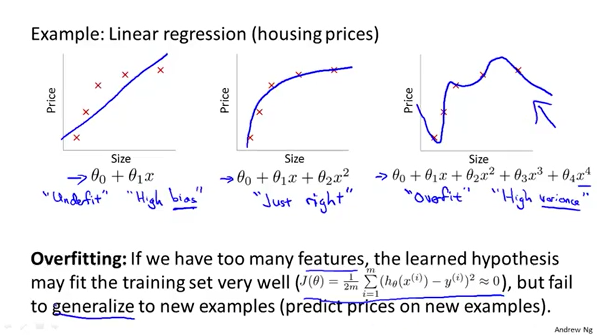

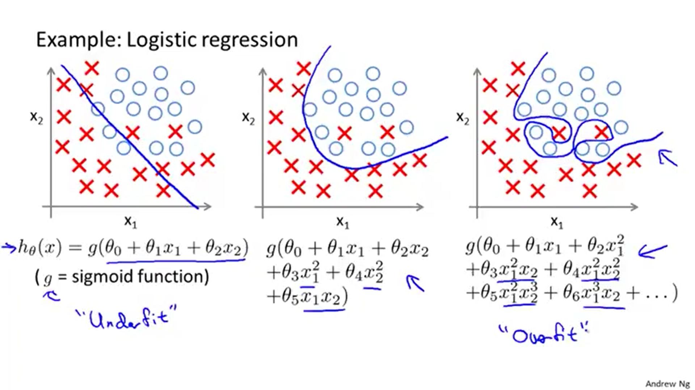

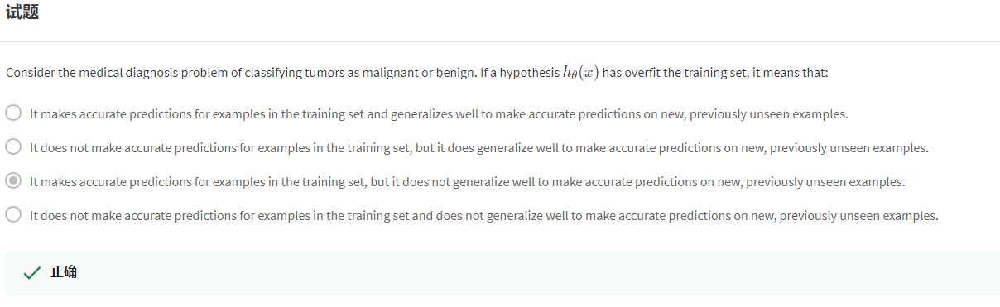

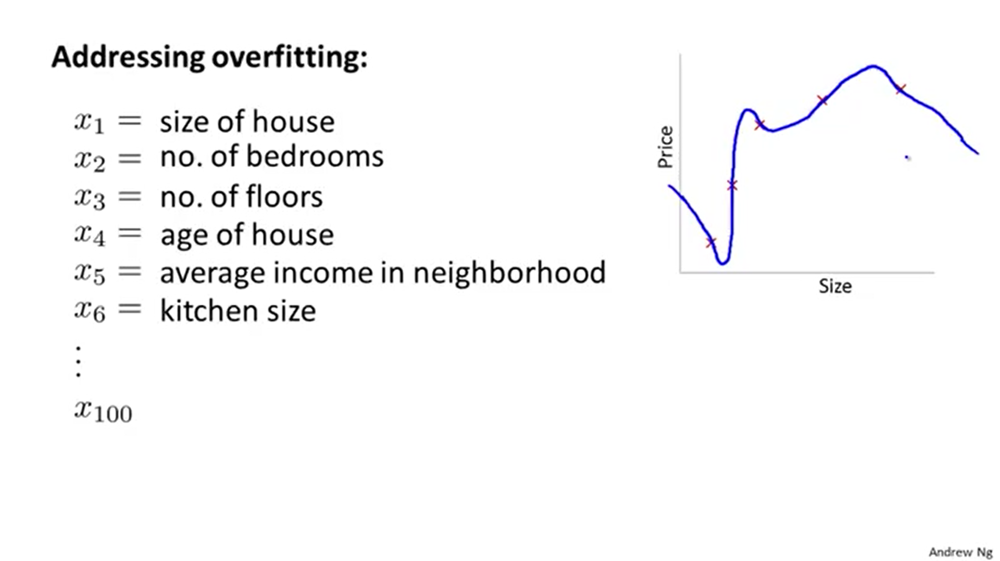

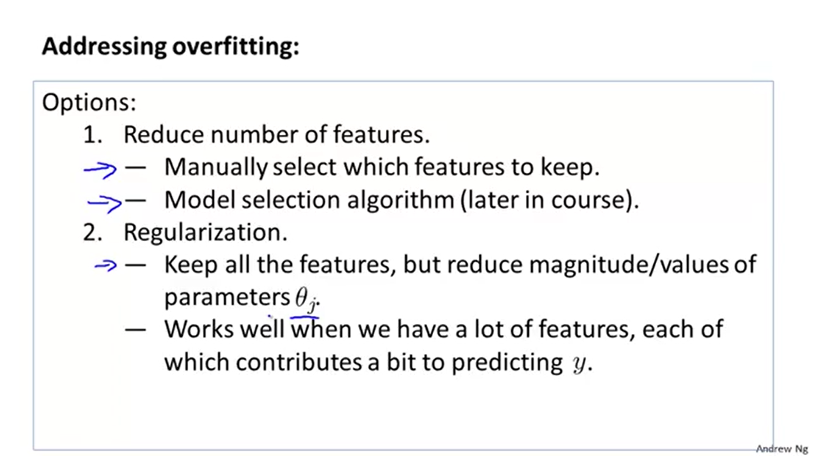

# The Problem of Overfitting

Consider the problem of predicting y from x ∈ R. The leftmost figure below shows the result of fitting a $y = θ_0 + θ_1x$ to a dataset. We see that the data doesn’t really lie on straight line, and so the fit is not very good. 

Instead, if we had added an extra feature $x^2$ , and fit $y = \theta_0 + \theta_1x + \theta_2$ , then we obtain a slightly better fit to the data (See middle figure). Naively, it might seem that the more features we add, the better. However, there is also a danger in adding too many features: The rightmost figure is the result of fitting a $5^{th}$ order polynomial $y = \sum_{j=0} ^5 \theta_j x^j$. We see that even though the fitted curve passes through the data perfectly, we would not expect this to be a very good predictor of, say, housing prices (y) for different living areas (x). Without formally defining what these terms mean, we’ll say the figure on the left shows an instance of **underfitting**—in which the data clearly shows structure not captured by the model—and the figure on the right is an example of **overfitting**.

Underfitting, or ==high bias==, is when the form of our hypothesis function h maps poorly to the trend of the data. It is usually caused by a function that is too simple or uses too few features. At the other extreme, overfitting, or ==high variance==, is caused by a hypothesis function that fits the available data but does not generalize well to predict new data. It is usually caused by a complicated function that creates a lot of unnecessary curves and angles unrelated to the data.

This terminology is applied to both linear and logistic regression. There are two main options to ==address the issue== of overfitting:

1) Reduce the number of features:

- Manually select which features to keep.
- Use a model selection algorithm (studied later in the course).

2) Regularization

- Keep all the features, but reduce the magnitude of parameters \theta_j*θ**j*.
- Regularization works well when we have a lot of slightly useful features.

## Cost Function

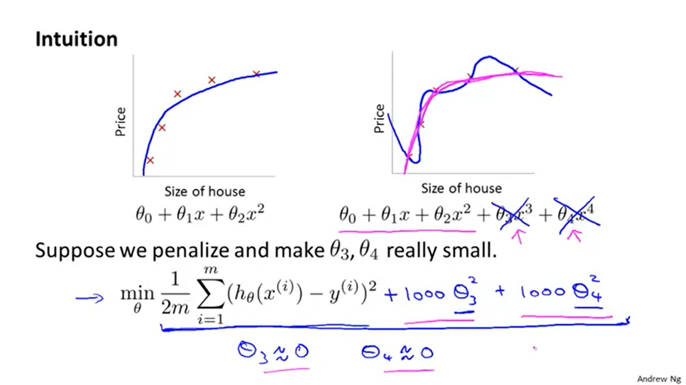

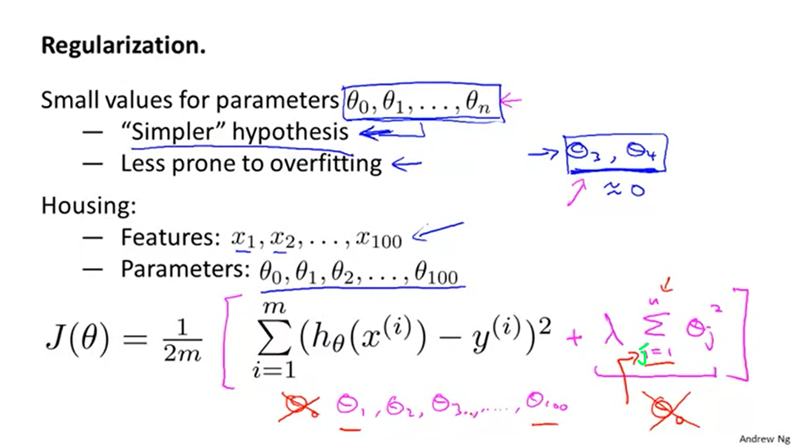

* **Note:** [5:18 - There is a typo. It should be $\sum_{j=1}^{n} \theta _j ^2$ instead of $\sum_{i=1}^{n} \theta _j ^2$ ]【OK】

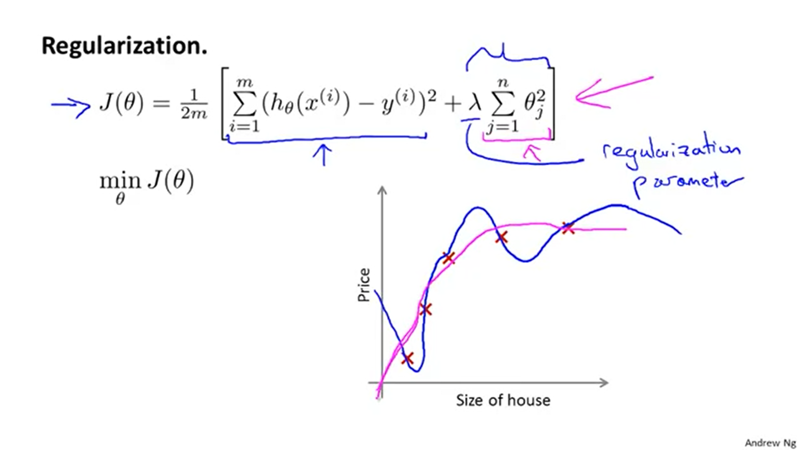

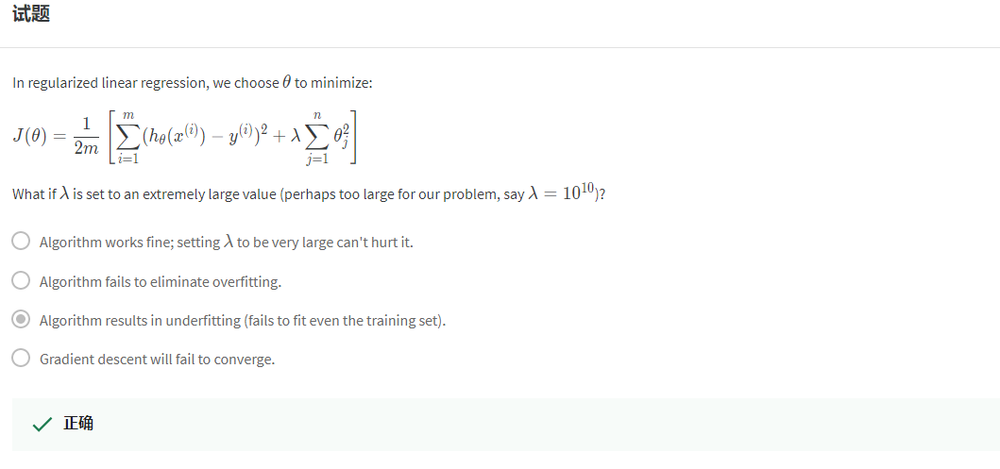

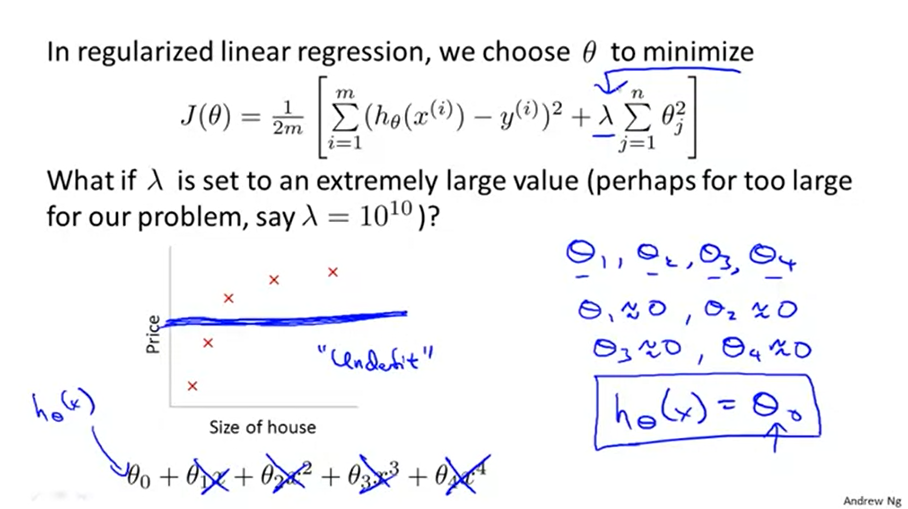

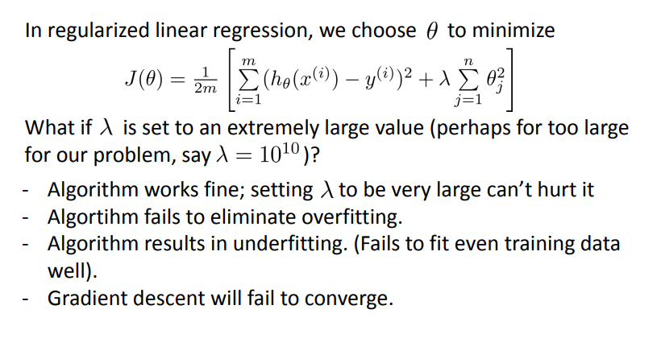

## Cost Function

**Note:** [5:18 - There is a typo. It should be $\sum_{j=1}^{n} \theta _j ^2$ instead of $\sum_{i=1}^{n} \theta _j ^2$【OK】

If we have overfitting from our hypothesis function, we can ==reduce the weight that some of the terms in our function== carry by ==increasing their cost==.

Say we wanted to make the following function more quadratic:

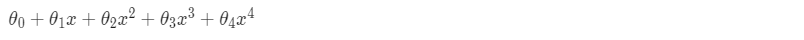

We'll want to eliminate the influence of $\theta_3x^3$ and $\theta_4x^4$ . Without actually getting rid of these features or changing the form of our hypothesis, we can instead modify our **cost function**:

* 【Set the weight of $\theta_3$ and $\theta_4$ in a reasonable value, than both of the theta 3/4 will tend to a smaller values】
* 【But the regularization items include theta 1 and 2, how about the general from of the Cost function above? Correctly, like the equation below, it isn't include the theta 1 and 2 in the regularization items, although the general from of J has.】

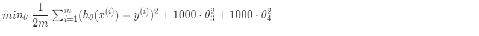

We've added two extra terms at the end to inflate the cost of $\theta_3$ and $\theta_4$. Now, in order for the cost function to get ==close to zero==, we will ==have to reduce the values of $\theta_3$ and $\theta_4$ to near zero==. This will in turn greatly reduce the values of $\theta_3x^3$ and $\theta_4x^4$ in our hypothesis function. As a result, we see that the new hypothesis (depicted by the pink curve) looks like a quadratic function but fits the data better due to the extra small terms $\theta_3x^3$ and  $\theta_4x^4$.

We could also regularize all of our theta parameters in a single summation as:

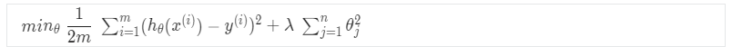

The λ, or lambda, is the **regularization parameter**. It determines how much the costs of our theta parameters are inflated. 

Using the above cost function with the extra summation, ==we can smooth the output of our hypothesis function to reduce overfitting==. If lambda is chosen to be ==too large==, it may ==smooth out the function too much and cause underfitting==. Hence, what would happen if $\lambda = 0$ or is too small ?

* 【smooth out too much, until to a horizonal line】

## Regularized Linear Regression

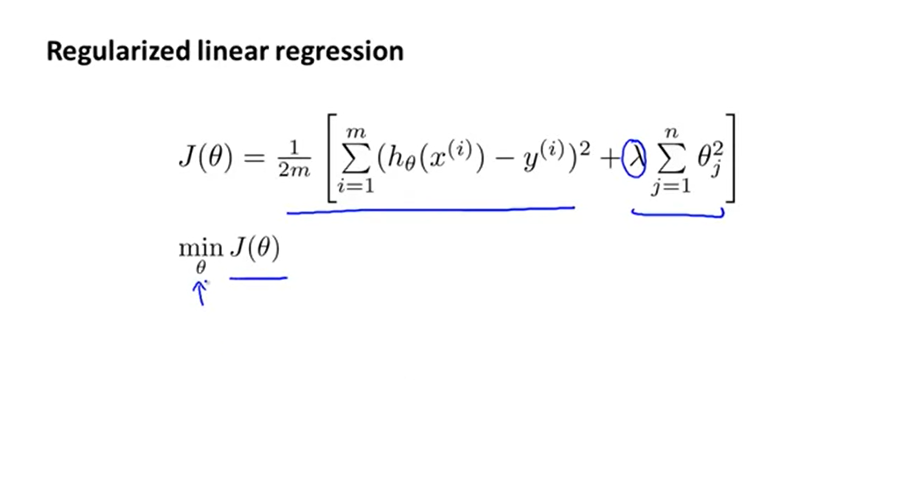

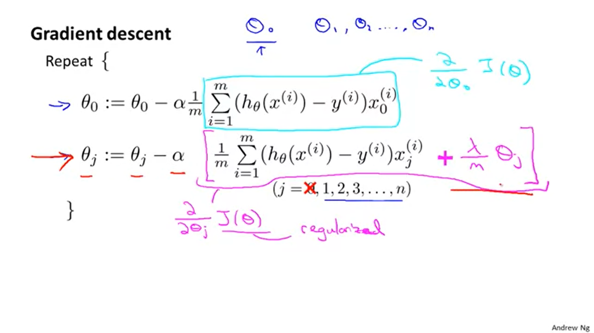

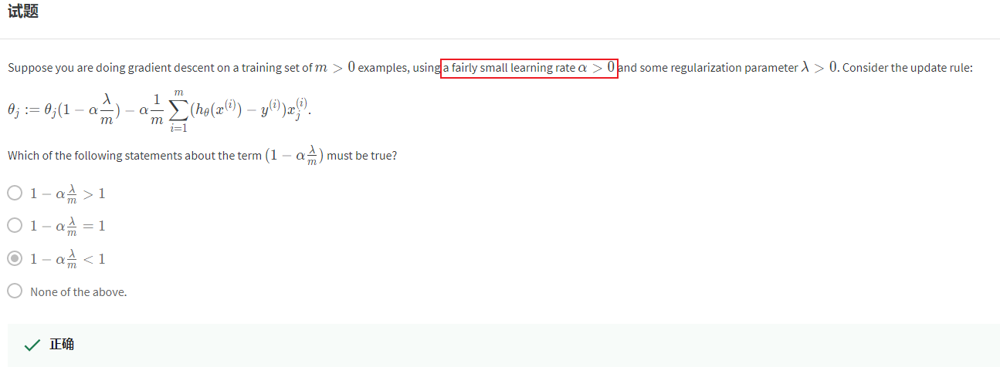

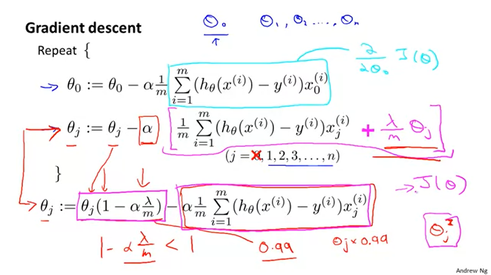

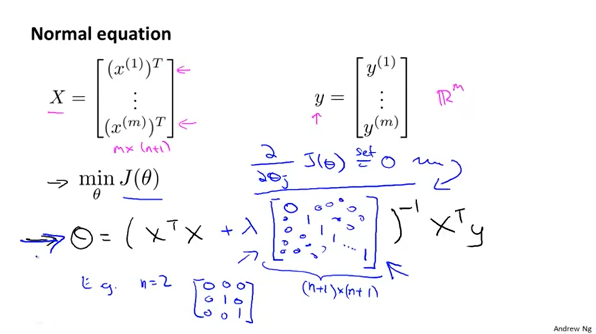

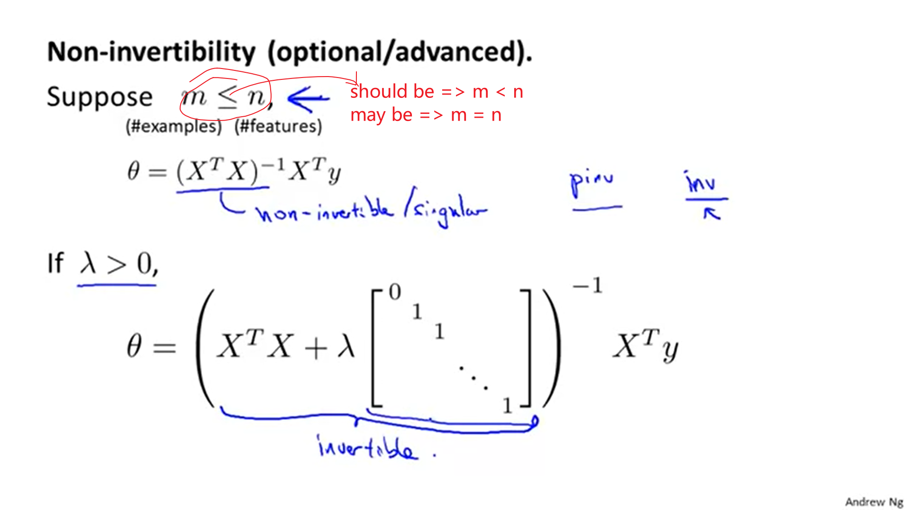

* 【**Note:** [8:43 - It is said that X is non-invertible if $m \leq n$. The correct statement should be that X is non-invertible if $m < n$, and may be non-invertible if $m = n$.】

## Regularized Linear Regression

**Note:** [8:43 - It is said that X is non-invertible if $m \leq n$. The correct statement should be that X is non-invertible if $m < n$, and may be non-invertible if $m = n$.

We can apply regularization to both linear regression and logistic regression. We will approach linear regression first.

### Gradient Descent

We will modify our gradient descent function to ==separate out== $\theta_0$ from the rest of the parameters because we ==do not want to penalize== $\theta_0$.

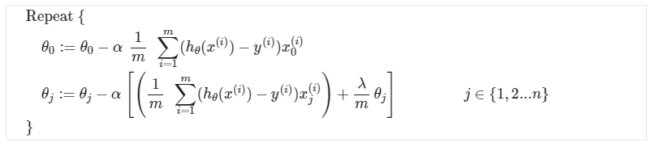

The term $\frac{\lambda}{m}\theta_j$ performs our regularization. With some manipulation our update rule can also be represented as:

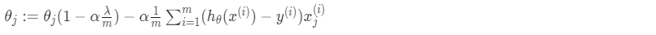

The first term in the above equation, $1 - \alpha\frac{\lambda}{m}$ will always be ==less than 1==. Intuitively you can see it as reducing the value of $\theta_j$ by some amount on every update. Notice that the second term is now exactly the same as it was before.

* 【like theta = 0.99, every update the first term will be smaller.】
* 【The second term has the same form as it was before -- to some degree, that is a instance of the mind of uniform.】

### **Normal Equation**

Now let's approach regularization using the alternate method of the non-iterative normal equation.

To add in regularization, the equation is the same as our original, except that we add another term inside the parentheses:

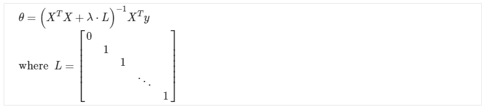

L is a matrix with 0 at the top left and 1's down the diagonal, with 0's everywhere else. It should have ==dimension (n+1)×(n+1)==. Intuitively, this is the identity matrix (though we are not including $x_0$), multiplied with a single real number λ.

Recall that if m < n, then $X^TX$ is non-invertible. However, when we add the term $λ⋅L$, then $X^TX + λ⋅L$ becomes invertible.

* 【Why the term will become invertible ?】
  * $X$ => $m \times (n + 1)$ 
  * $X^T$ => $(n + 1) \times m$ 
  * $X^TX$ => $(n + 1) \times (n + 1)$ 

# Regularized Logistic Regression

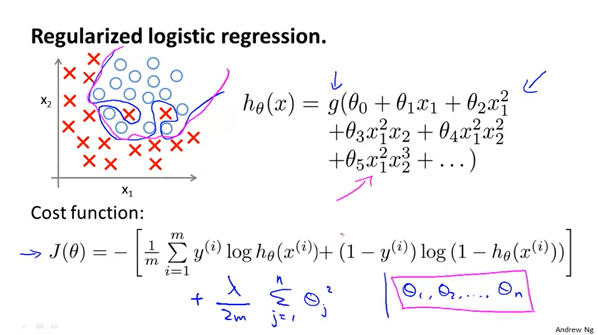

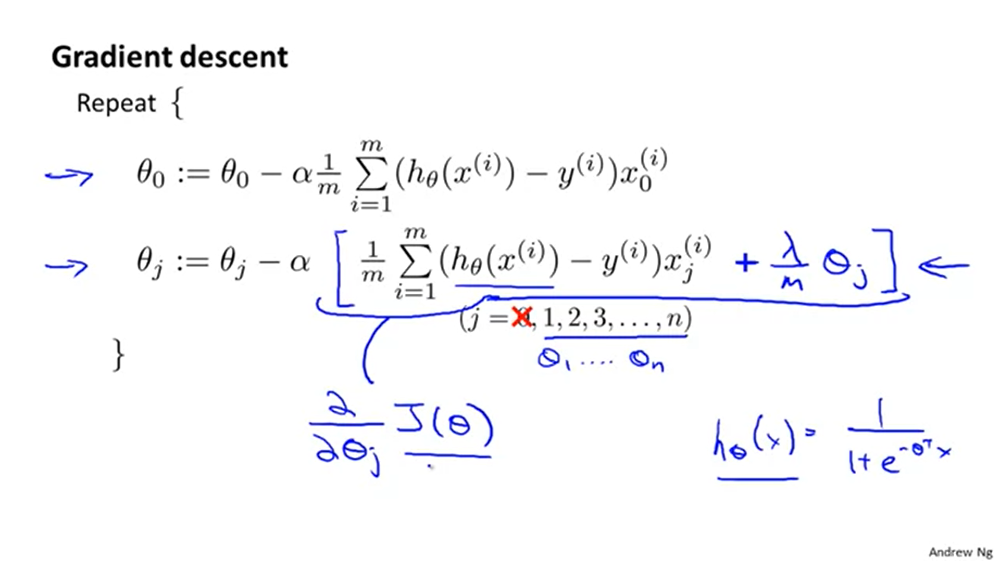

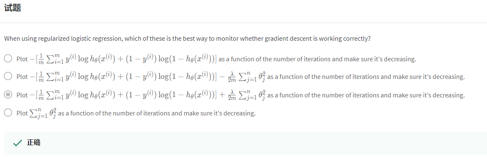

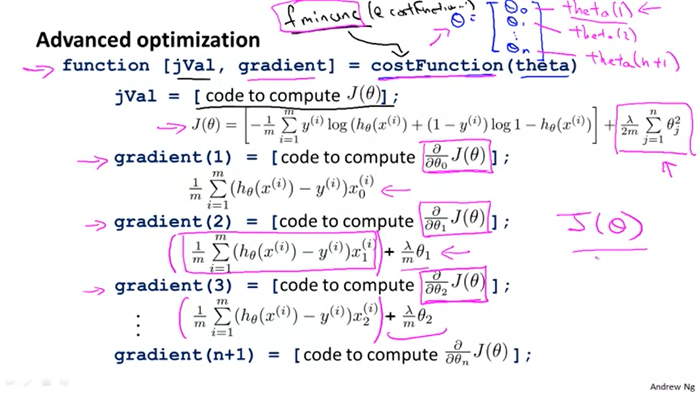

## Regularized Logistic Regression

We can regularize logistic regression in a similar way that we regularize linear regression. As a result, we can avoid overfitting. The following image shows how the regularized function, displayed by the pink line, is less likely to overfit than the non-regularized function represented by the blue line: 

### Cost Function

Recall that our cost function for logistic regression was:

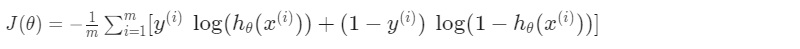

We can regularize this equation by adding a term to the end:

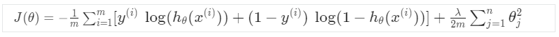

The second sum, $\sum_{j=1}^n \theta_j^2$ **means to explicitly ==exclude==** ==the bias term==, $\theta_0$. I.e. the θ vector is indexed from 0 to n (holding n+1 values, $\theta_0$ through $\theta_n$), and this sum explicitly skips $\theta_0$, by running from 1 to n, ==skipping 0==. Thus, when computing the equation, we should continuously ==update the two== following equations:

2022/04/29 19:20:23 3h12min

------

# 【Exam】

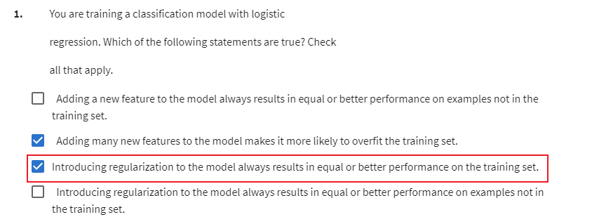

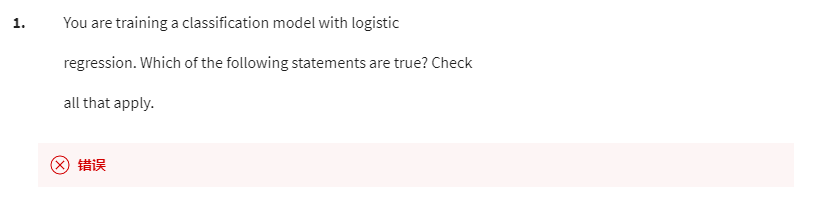

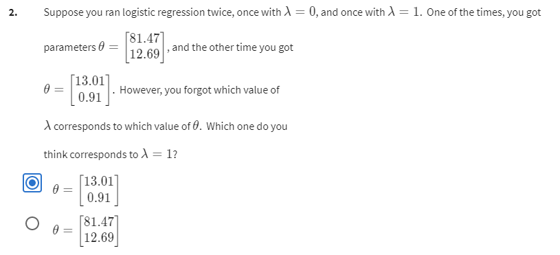

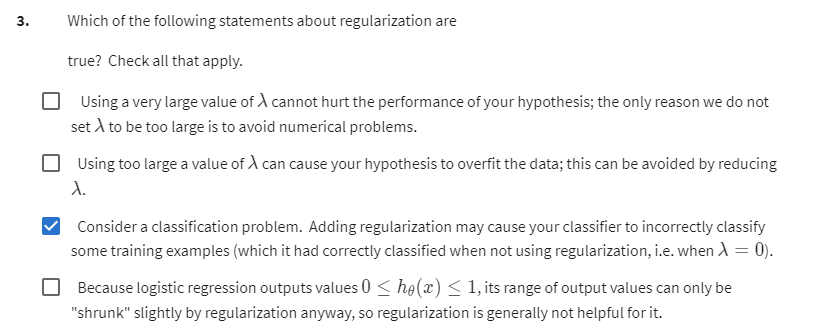

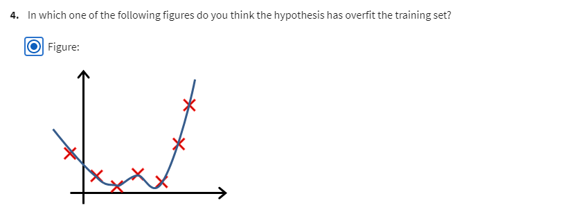

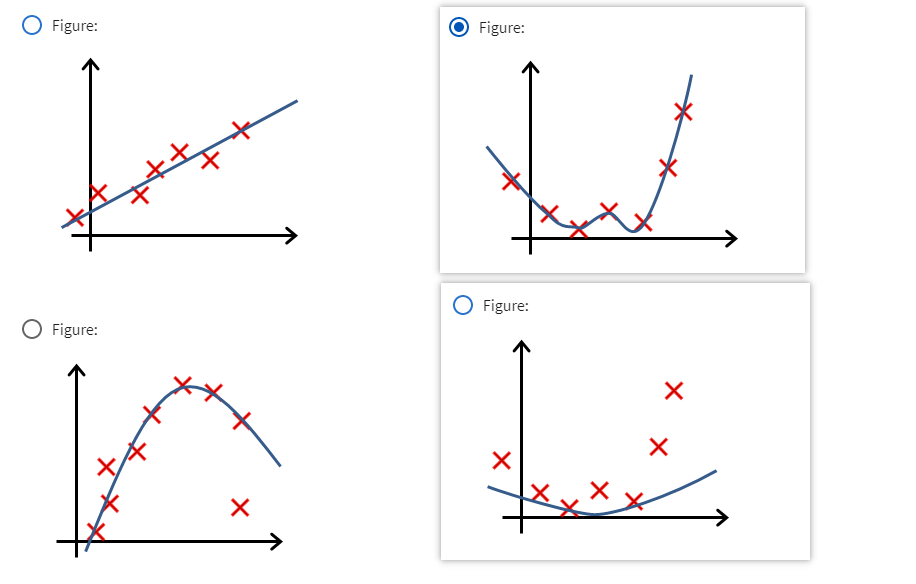

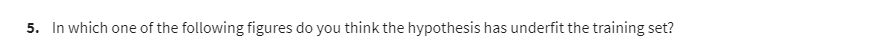

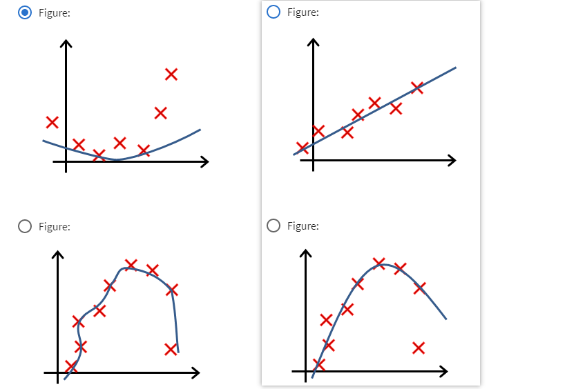

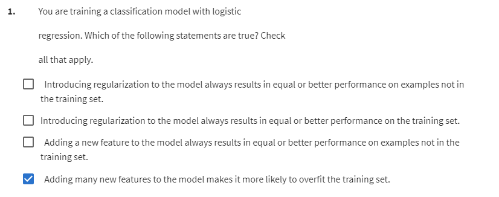

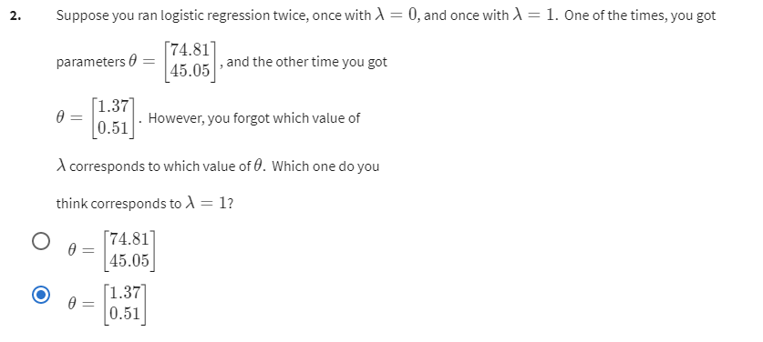

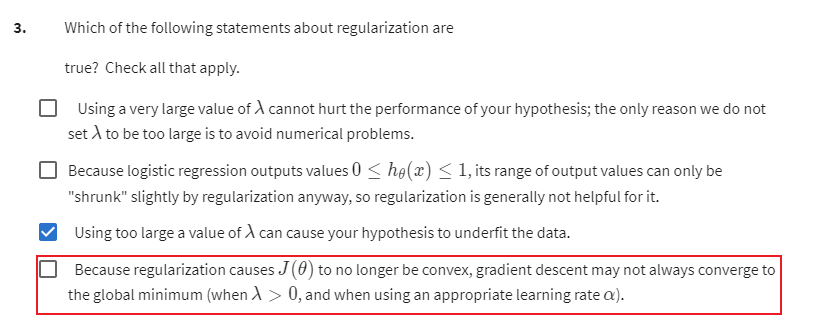

2022/04/29 21:23:14 