# 04-1 Week Neural Networks: Representation

Date:2022/05/01 2:15:42

------

[TOC]

------

# Motivation

## Non-linear Hypotheses

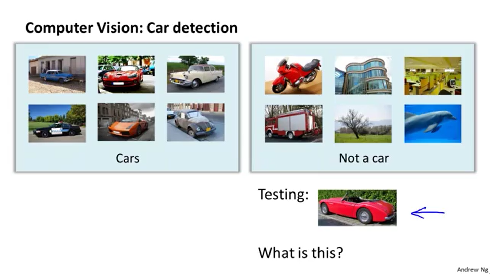

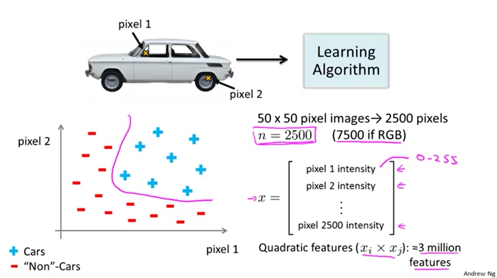

## Neurons and the Brain

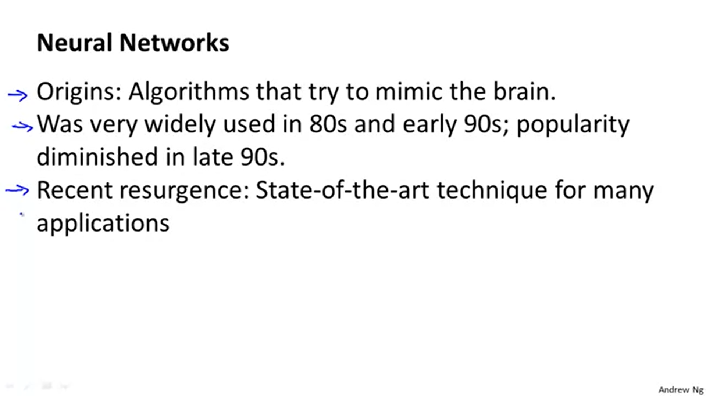

# Neural Networks

## Model Representation I

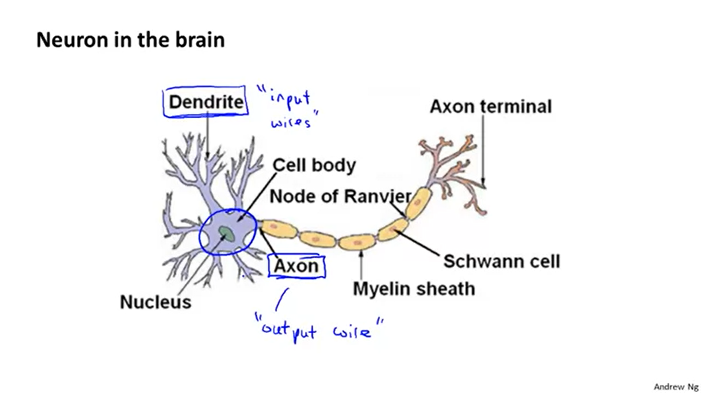

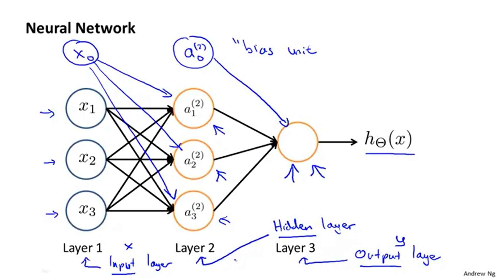

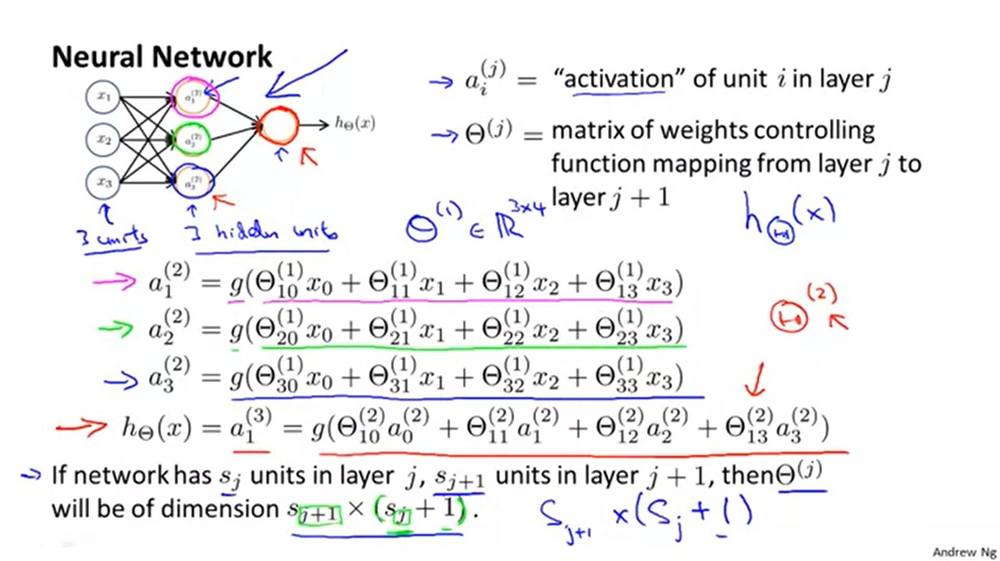

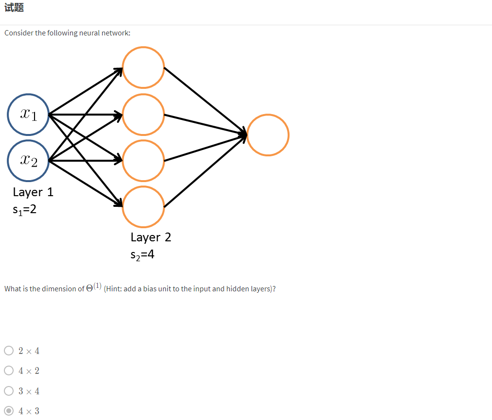

## Model Representation I

Let's examine how we will represent a hypothesis function using neural networks. At a very simple level, neurons are basically computational units that take inputs (**dendrites**) as electrical inputs (called "spikes") that are channeled to outputs (**axons**). In our model, our dendrites are like the input features $x_1\cdots x_n$, and the output is the result of our hypothesis function. In this model our $x_0$ input node is sometimes called the =="bias unit."== It is always equal to 1. In neural networks, we use the same logistic function as in classification, $\frac{1}{1 + e^{-\theta^Tx}}$, yet we sometimes call it a sigmoid (logistic) **activation** function. In this situation, our "theta" parameters are sometimes called =="weights"==.

Visually, a simplistic representation looks like:

Our input nodes (layer 1), also known as the =="input layer"==, go into another node (layer 2), which finally outputs the hypothesis function, known as the "output layer".

We can have intermediate layers of nodes between the input and output layers called the "hidden layers."

In this example, we label these ==intermediate or "hidden" layer nodes== $a^2_0 \cdots a^2_n$ and call them =="activation units."==

If we had one hidden layer, it would look like:

The values for each of the "activation" nodes is obtained as follows:

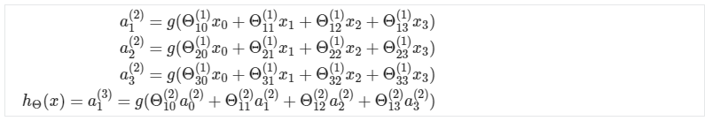

This is saying that we compute our activation nodes by using a 3×4 matrix of parameters. We apply each row of the parameters to our inputs to obtain the value for one activation node. Our hypothesis output is the logistic function applied to the sum of the values of our activation nodes, which have been multiplied by yet another parameter matrix $\Theta^{(2)}$ containing the weights for our second layer of nodes.

Each layer gets its own matrix of weights, $\Theta^{(j)}$.

The dimensions of these matrices of weights is determined as follows:

If network has $s_j$ units in layer $j$ and $s_{j+1}$ units in layer $j+1$, then $\Theta^{(j)}$ will be of dimension $s_{j+1} \times (s_j + 1)$..

==The +1 comes from== the addition in $\Theta^{(j)}$ of the "==bias nodes==," $x_0$ and $\Theta_0^{(j)}$. In other words the ==output nodes will not include the bias nodes== while the inputs will. The following image summarizes our model representation: 

Example: If layer 1 has 2 input nodes and layer 2 has 4 activation nodes. Dimension of $\Theta^{(1)}$ is going to be 4×3 where $s_j = 2$ and $s$, so $s_{j+1} \times (s_j + 1) = 4 \times 3$.

## Model Representation II

* 【What is $z^{(3)}$ ?】【OK，superscript 3, means that the third layer of the Neural Network, it equals to the output layer in this case.】

## Model Representation II

To re-iterate, the following is an example of a neural network:

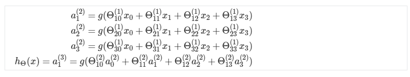

In this section we'll do a vectorized implementation of the above functions. We're going to define a new variable $z_k^{(j)}$ that encompasses the parameters inside our g function. In our previous example if we ==replaced by the variable z== for all the parameters we would get:

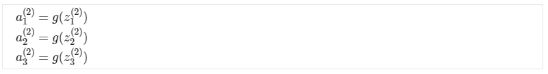

In other words, for ==layer== j=2 and ==node== k, the variable z will be:

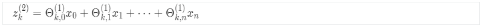

The vector representation of x and $z^{j}$ is:

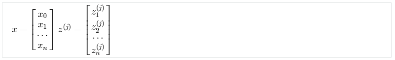

Setting $x = a^{(1)}$ we can rewrite the equation as:

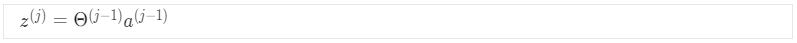

* 【How to understand the superscript of $\Theta^{(0)} , \Theta^{(1)}, \Theta^{(2)}$ between the $z$ and $j$ ? It's because to the ZERO in the first layer $a^{1}$ links to the $\Theta^{0}$ ? It may be as well as the theta in the hypothesis function before (in Linear regression or logistic regression)】

We are ==multiplying our matrix== $\Theta^{(j-1)}$ ==with dimensions== $s_j\times (n+1)$ (where $s_j$ is the number of our activation nodes) by our vector $a^{(j-1)}$ with height (n+1). This gives us our vector $z^{(j)}$ with height $s_j$. Now we can get a vector of our activation nodes for layer j as follows:

$a^{(j)} = g(z^{(j)})$ 

Where our function g can be applied ==element-wise== to our vector $z^{(j)}$.

We can then ==add a bias unit== (equal to 1) to layer j ==after we have computed== $a^{(j)}$. This will be element $a_0^{(j)}$ and will be equal to 1. To compute our ==final hypothesis==, let's first compute another z vector:

$z^{(j+1)} = \Theta^{(j)}a^{(j)}$

We get this final z vector by multiplying the next theta matrix after $\Theta^{(j-1)}$ with the values of all the activation nodes we just got. This ==last theta matrix== $\Theta^{(j)}$ will have only **one row** which is multiplied by one column $a^{(j)}$ so that our ==result is a single number==. We then get our final result with:

$h_\Theta(x) = a^{(j+1)} = g(z^{(j+1)})$

Notice that in this **last step**, between layer j and layer j+1, we are doing **exactly the same thing** as we did in logistic regression. Adding all these intermediate layers in neural networks allows us to more elegantly produce interesting and more complex non-linear hypotheses.

* 【Means that the last step in the neural network is same as the logistic regression, because the number/relationship of parameters and variables are at same.】

2022/05/01 4:08:14 1h55min

------

# Application

## Examples and Intuitions I

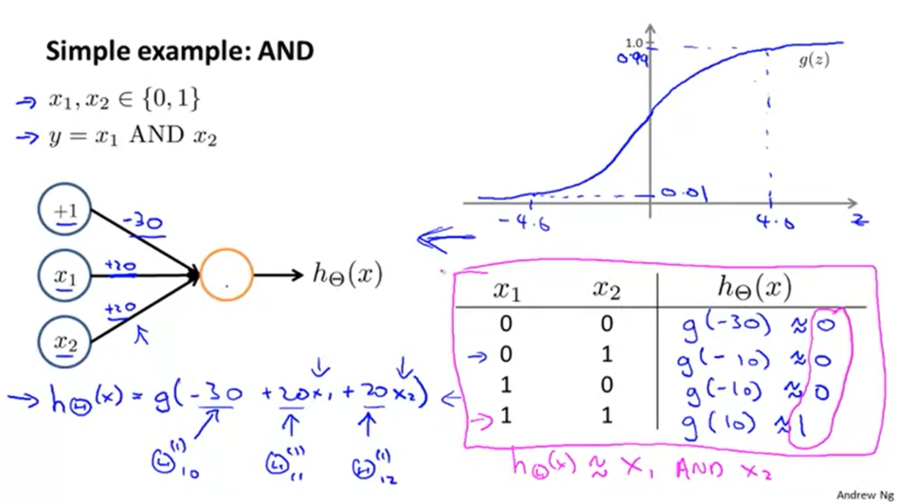

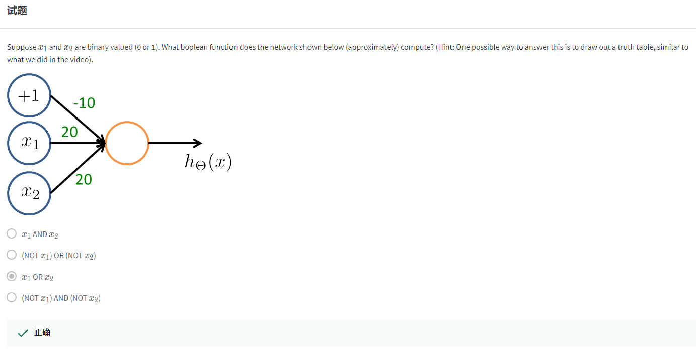

## Examples and Intuitions I

A simple example of applying neural networks is by predicting $x_1$ AND $x_2$, which is the ==logical 'and' operator== and is only true if both $x_1$ and $x_2$ are 1.

The graph of our functions will look like:

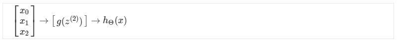

Remember that $x_0$ is our bias variable and is always 1.

Let's set our first theta matrix as:

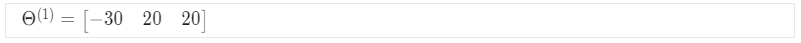

* 【Why can classify by the negative or positive of the $z$ ?】【OK】
  * 【Because when the $z$ in the sigmoid function greater than 0, the sigmoid will be bigger than 0.5, the same can be obtained when the $z$ is smaller than 0】
  * 【But when the output become a binary value, why it can represent the output of hypothesis function ? Is it something wrong with the actual values ? Or just enough to calculate to what we want to predict ? Because the h can be represented to the probability of the predict result in logistic regression, but now it became the True or False.】

This will cause the output of our hypothesis to only be positive if both $x_1$ and $x_2$ are 1. In other words:

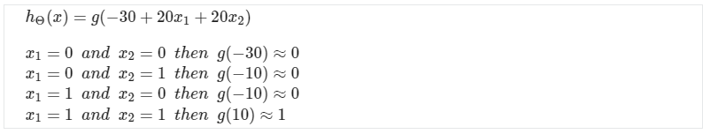

So we have constructed one of the fundamental operations in computers ==by using a small neural network== rather than using an actual AND gate. Neural networks can also be used to ==simulate all the other logical gates==. The following is an example of the logical operator 'OR', meaning either $x_1$ is true or $x_2$ is true, or both:

Where g(z) is the following:

## Examples and Intuitions II

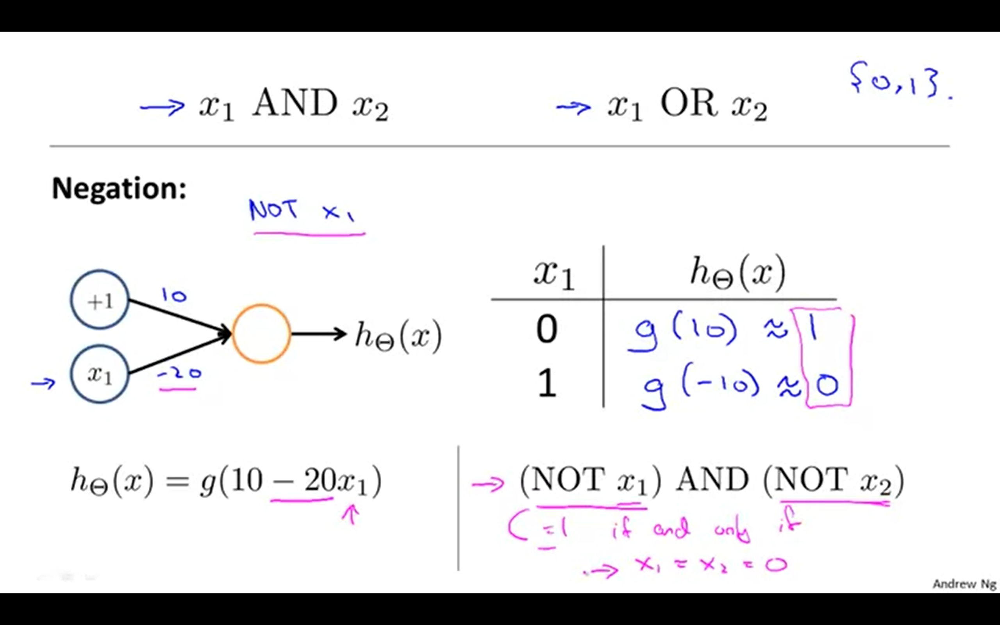

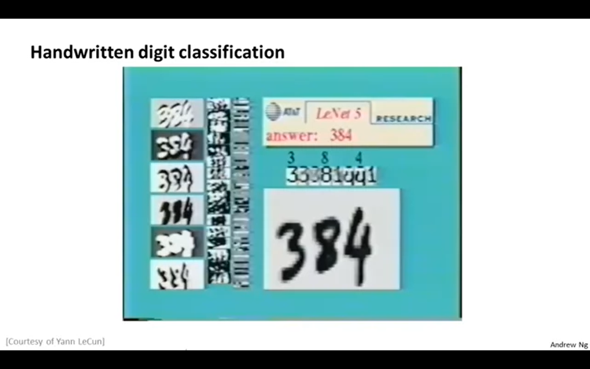

* That's interesting.

## Examples and Intuitions II

The $Θ^{(1)}$ matrices for AND, NOR, and OR are:

We can combine these to get the XNOR logical operator (which gives 1 if $x_1$ and $x_2$ are both 0 or both 1).

For the transition between the first and second layer, we'll use a $Θ^{(1)}$matrix that combines the values for AND and NOR:

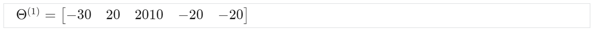

For the transition between the second and third layer, we'll use a $Θ^{(2)}$matrix that uses the value for OR:

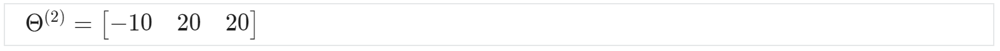

Let's write out the values for all our nodes:

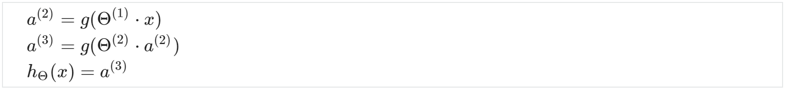

And there we have the XNOR operator using a hidden layer with two nodes! The following summarizes the above algorithm: 

## Multiclass Classification

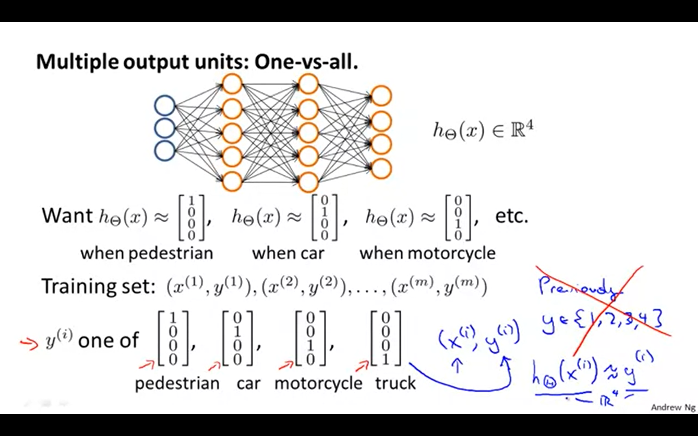

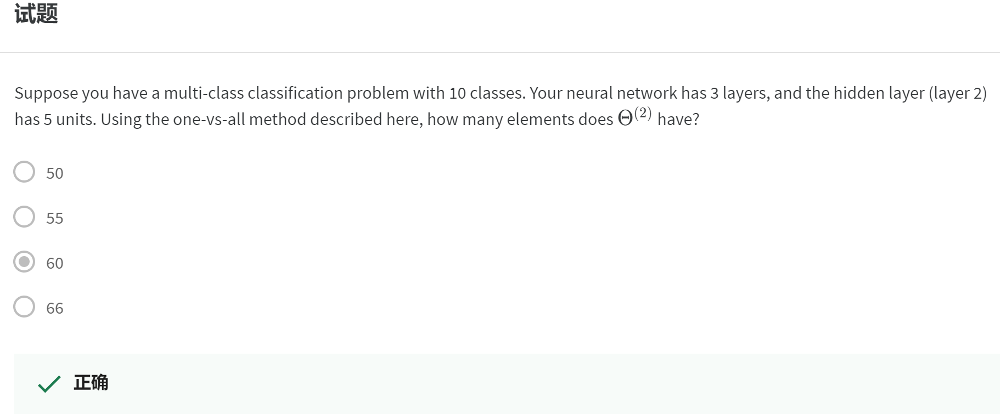

* 【Pay attention to the goal is $\Theta^{(1)}$】

## Multiclass Classification

To classify data into multiple classes, we let our hypothesis function ==return a vector of values==. Say we wanted to classify our data into one of four categories. We will use the following example to see how this classification is done. This algorithm takes as input an image and classifies it accordingly: 

We can define our set of resulting classes as y:

Each $y^{(i)}$ represents a different image corresponding to either a car, pedestrian, truck, or motorcycle. The inner layers, each provide us ==with some new information which leads to our final hypothesis function==. The setup looks like:

Our resulting hypothesis for one set of inputs may look like:

$h_\Theta(x) =\begin{bmatrix}0\\0\\1\\0\end{bmatrix}$ 

In which case our resulting class is the third one down, or $h_\Theta(x)_3$, which represents the motorcycle. 

------

# 【Exam】

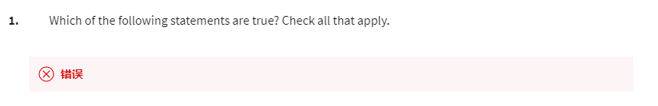

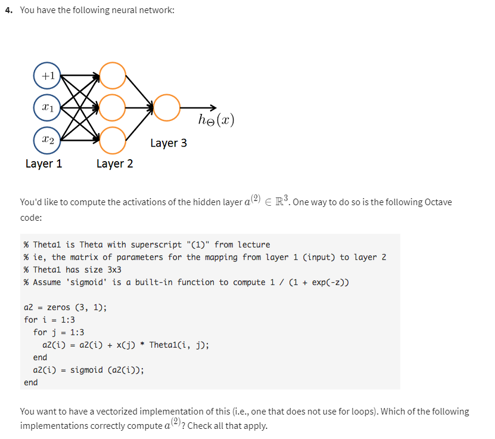

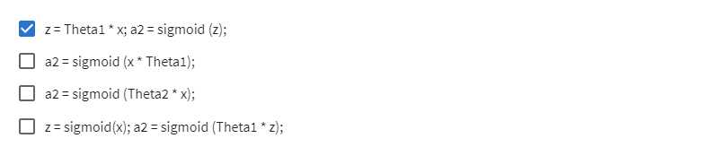

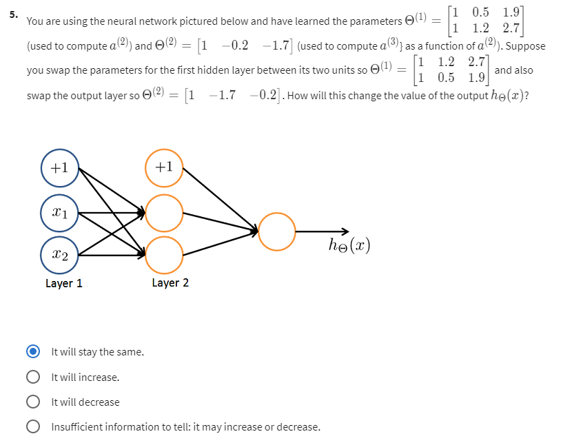

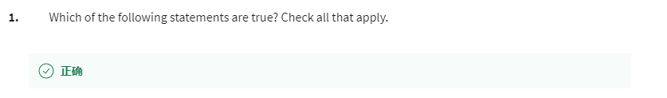

