# 05-1 Week Neural Networks: Learning

Date：2022/05/06

------


[TOC]


------


# Cost Function and Backpropagation Algorithm

## Cost Function

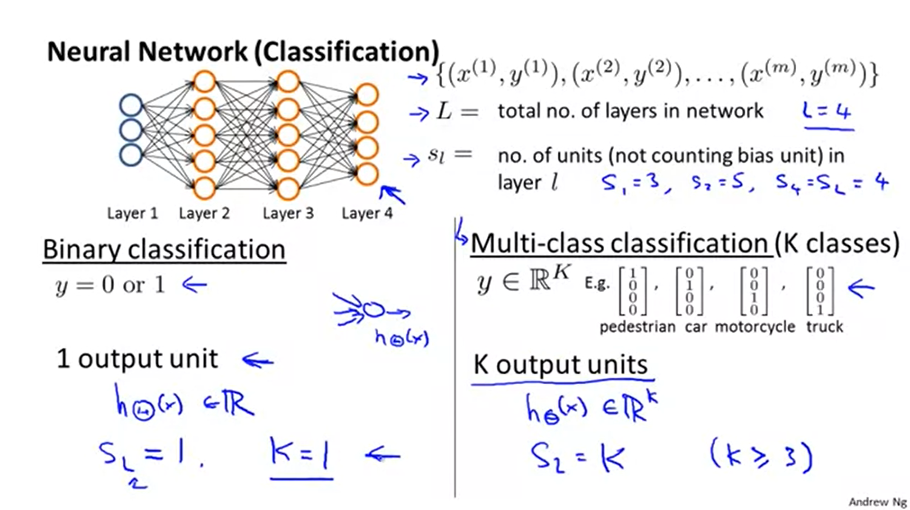


## Cost Function

Let's first define a few variables that we will need to use:

- ==L = total number of layers in the network==
- ==$s_l$ = number of units (not counting bias unit) in layer l==
- ==K = number of output units/classes==

Recall that in neural networks, we may have many output nodes. We denote $h_\Theta(x)_k$ as being a hypothesis that results in the $k^{th}$ output. Our cost function for neural networks is going to be a generalization of the one we used for logistic regression. Recall that the cost function for regularized logistic regression was:


For neural networks, it is going to be slightly more complicated:

We have added a few nested summations to account for our multiple output nodes. In the ==first part of the equation==, before the square brackets, we have an additional nested summation that loops through the number of output nodes.

==In the regularization part==, after the square brackets, we must account for multiple theta matrices. The number of columns in our current theta matrix is equal to the number of nodes in our current layer (including the bias unit). The number of rows in our current theta matrix is equal to the number of nodes in the next layer (excluding the bias unit). As before with logistic regression, we square every term.

Note:

- the ==double sum== simply adds up the logistic regression costs calculated for each cell in the output layer
- the ==triple sum== simply adds up the squares of all the individual Θs in the entire network.
- the ==i in the triple== sum does **not** refer to training example i


## Backpropagation Algorithm

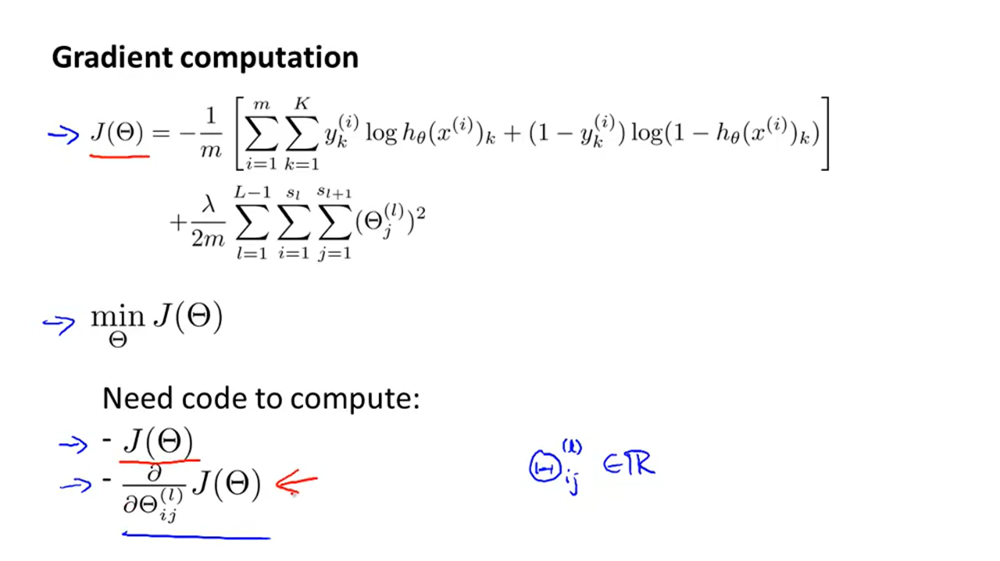


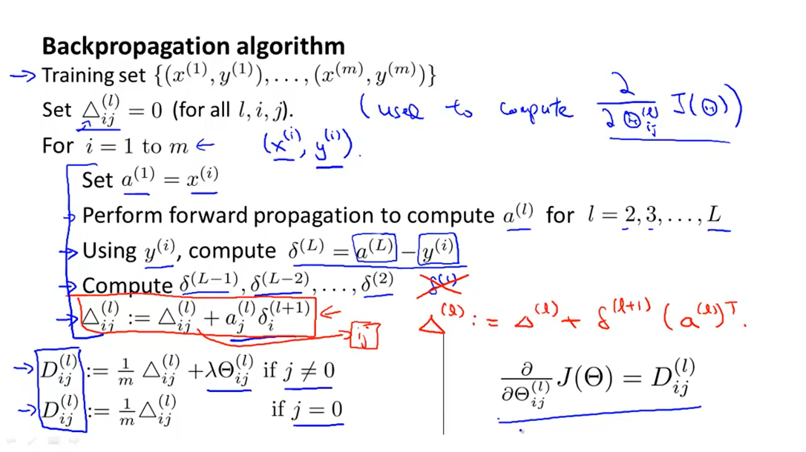


* 【QUESTION】


## Backpropagation Algorithm

"Backpropagation" is ==neural-network terminology for minimizing our cost function==, just like what we were doing with gradient descent in logistic and linear regression. Our goal is to compute:


That is, we want to minimize our cost function J using an optimal set of parameters in theta. In this section we'll look at the equations we use to compute the ==partial derivative of J(Θ)==:

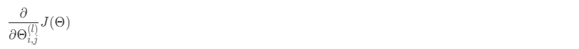

To do so, we use the following algorithm:


**Back propagation Algorithm**

Given training set $\lbrace (x^{(1)}, y^{(1)}) \cdots (x^{(m)}, y^{(m)})$

- Set $\Delta^{(l)}_{i,j} := 0$ for all (l,i,j), (hence you end up having a matrix full of zeros)

For training example t =1 to m:

1. Set $a^{(1)} := x^{(t)}$
2. Perform ==forward propagation to compute== $a^{(l)}$ for l=2,3,…,L


3. Using $y^{(t)}$, compute $\delta^{(L)} = a^{(L)} - y^{(t)}$

Where L is our total number of layers and $a^{(L)}$ is the vector of outputs of the activation units for the last layer. So our =="error values"== for the last layer are simply the differences of our actual results in the last layer and the correct outputs in y. To get the delta values of the layers before the last layer, we can use an equation that steps us ==back from right to left:==

4. Compute $\delta^{(L-1)}, \delta^{(L-2)},\dots,\delta^{(2)}$ using $\delta^{(l)} = ((\Theta^{(l)})^T \delta^{(l+1)})\ .*\ a^{(l)}\ .*\ (1 - a^{(l)})$

The ==delta values== of layer l are calculated by multiplying the delta values in the next layer with the theta matrix of layer l. We then element-wise multiply that with a function called g', or g-prime, which is the ==derivative of the activation function g== evaluated with the input values given by $z^{(l)}$.

The ==g-prime derivative terms== can also be written out as:

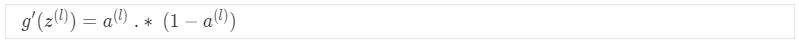

5. $\Delta^{(l)}_{i,j} := \Delta^{(l)}_{i,j} + a_j^{(l)} \delta_i^{(l+1)}$ or with vectorization, $\Delta^{(l)} := \Delta^{(l)} + \delta^{(l+1)}(a^{(l)})^{T}$

Hence we update our new $\Delta$ matrix.

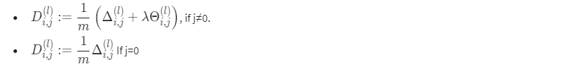

The capital-delta matrix D is used as an "accumulator" to add up our values as we go along and eventually compute our partial derivative. Thus we get $\frac \partial {\partial \Theta_{ij}^{(l)}} J(\Theta)= D_{ij}^{(l)}$ 


## Backpropagation Intuition


* 【How to understand the subscript of Theta ? Go back to the 3 or 4 week】
* 【The three sum ?】
* 【4:39, the last term for the calculation for $z^3_1$ (three-color handwritten formula) should be $a^2_2$ instead of $a^2_1$. 】【OK】


* 【**Note:** [6:08 - the equation for cost(i) is incorrect. The first term is missing parentheses for the log() function, and the second term should be $(1-y^{(i)})\log(1-h{_\theta}{(x^{(i)}}))$.】


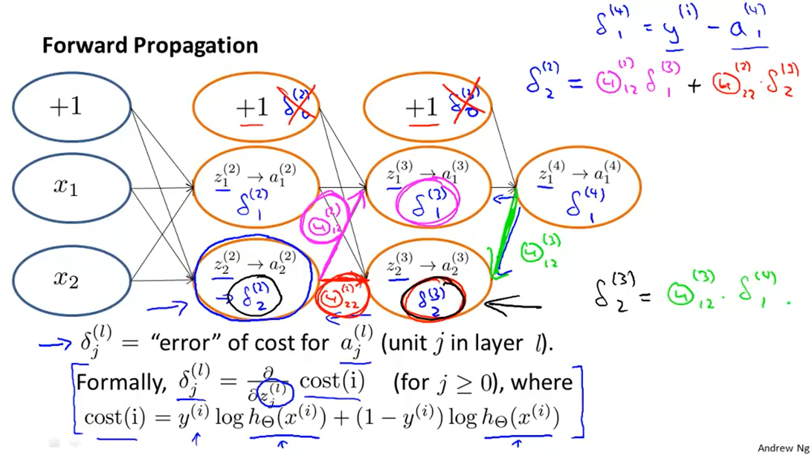

* 【 8:50 - $\delta^{(4)} = y - a^{(4)}$ is incorrect and should be $\delta^{(4)} = a^{(4)} - y$.]】

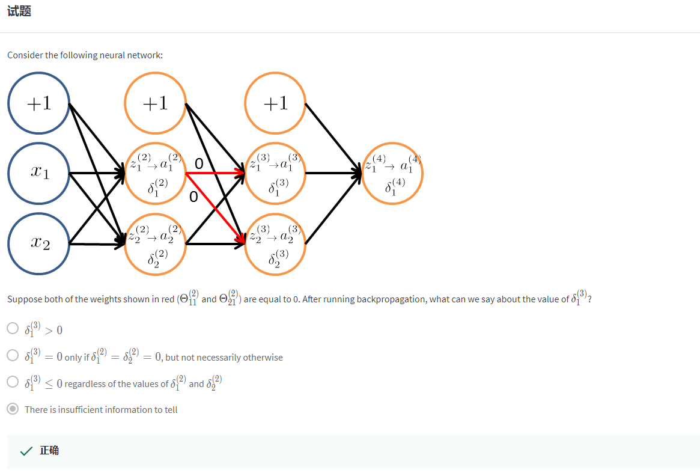

* 【QUESTION】


## Backpropagation Intuition

**Note:** [4:39, the last term for the calculation for $z^3_1$ (three-color handwritten formula) should be $a^2_2$ instead of $a^2_1$. 6:08 - the equation for cost(i) is incorrect. The first term is missing parentheses for the log() function, and the second term should be $(1-y^{(i)})\log(1-h{_\theta}{(x^{(i)}}))$. 8:50 - $\delta^{(4)} = y - a^{(4)}$ is incorrect and should be $\delta^{(4)} = a^{(4)} - y$.]【OK】

Recall that the cost function for a neural network is:

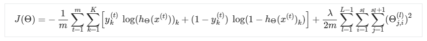

If we consider simple ==non-multiclass classification== (k = 1) and ==disregard regularization==, the cost is computed with:

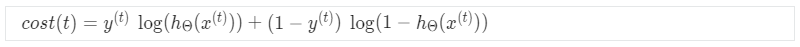

Intuitively, $\delta_j^{(l)}$ is the "error" for $a^{(l)}_j$(unit j in layer l). More formally, ==the delta values are actually the derivative== of the cost function:

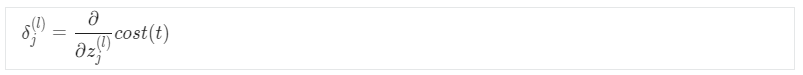

Recall that our derivative is the slope of a line tangent to the cost function, so the steeper the slope the more incorrect we are. Let us consider the following neural network below and see how we could calculate some $\delta_j^{(l)}$:


In the image above, to calculate $\delta_2^{(2)}$, we multiply the weights $\Theta_{12}^{(2)}$ and $\Theta_{22}^{(2)}$ by their respective $\delta$ values found to the right of each edge. So we get $\delta_2^{(2)}= \Theta_{12}^{(2)}\delta_1^{(3)}+\Theta_{22}^{(2)}\delta_2^{(3)}$. To calculate every single possible $\delta_j^{(l)}$, we could start from the right of our diagram. We can think of our edges as our $\Theta_{ij}.$ Going from right to left, to calculate the value of $\delta_j^{(l)}$, you can just take the over all sum of each weight times the $\delta$ it is coming from. Hence, another example would be $\delta_2^{(3)}=\Theta_{12}^{(3)}*\delta_1^{(4)}$.


2022/05/06 21:53:26 1h2min


# Backpropagation in Practice

## Implementation Note: Unrolling Parameters

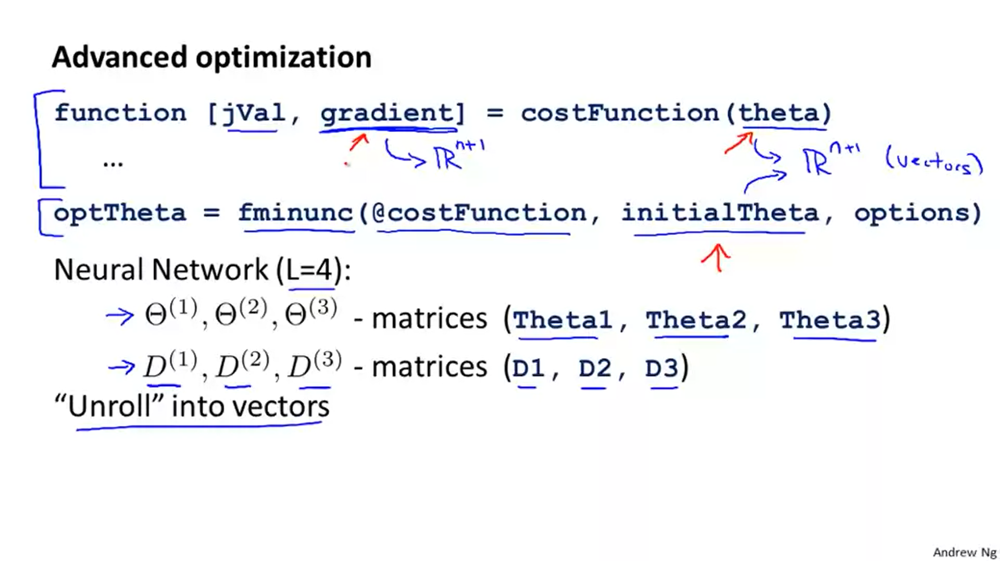

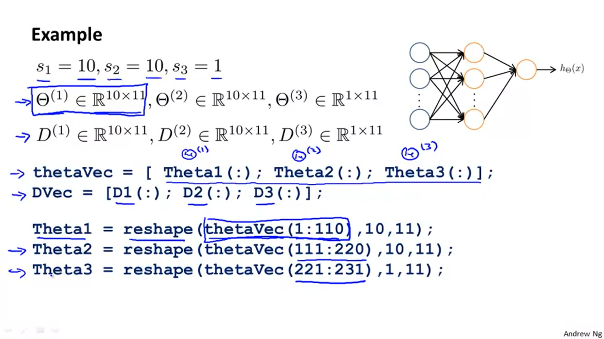

* 【get a very long vector】

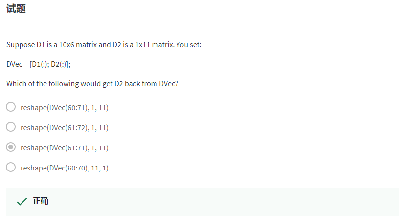


* 【It reminds me of the symbols in tree data structure】


## Implementation Note: Unrolling Parameters

With neural networks, we are working with sets of matrices:

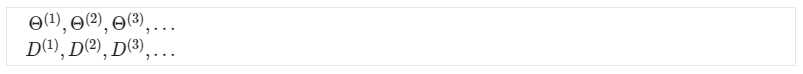

In order to use optimizing functions such as "fminunc()", we will want to =="unroll"== all the elements and put them ==into one long vector==:

```octave
thetaVector = [ Theta1(:); Theta2(:); Theta3(:); ]
deltaVector = [ D1(:); D2(:); D3(:) ]
```

If the dimensions of Theta1 is 10x11, Theta2 is 10x11 and Theta3 is 1x11, then we can ==get back our original matrices== from the "unrolled" versions as follows:

```octave
Theta1 = reshape(thetaVector(1:110),10,11)
Theta2 = reshape(thetaVector(111:220),10,11)
Theta3 = reshape(thetaVector(221:231),1,11) 
```

To summarize:


## Gradient Checking


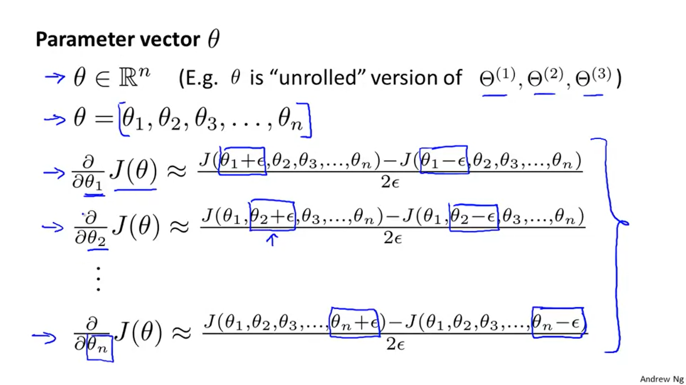

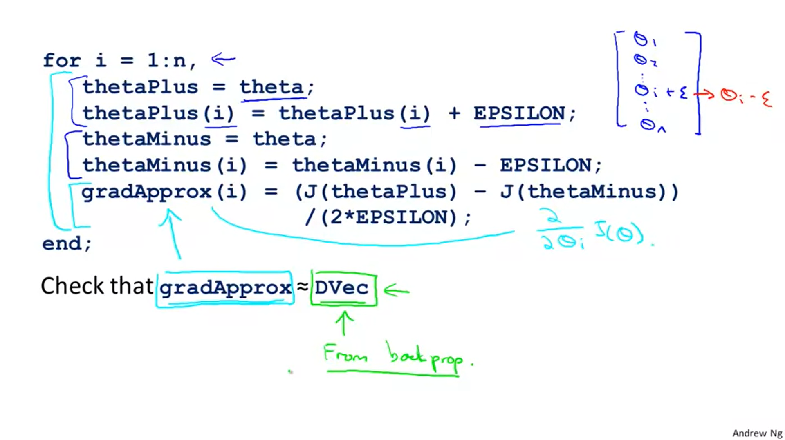

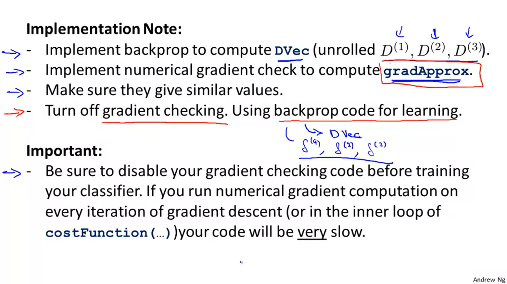

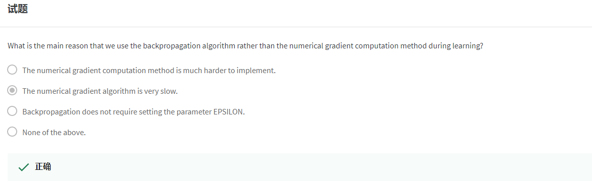


## Gradient Checking

Gradient checking will ==assure that our backpropagation works as intended==. We can ==approximate== the derivative of our cost function with:

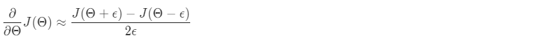

With multiple theta matrices, we can approximate the derivative **with respect to** $Θ_j$ as follows:

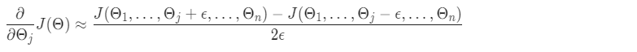

A small value for ${\epsilon}$ (epsilon) such as ${\epsilon = 10^{-4}}$, ==guarantees== that the math works out properly. If the value for $\epsilon$ is ==too small==, we can end up with ==numerical problems==. 

Hence, we are only adding or subtracting epsilon to the $\Theta_j$ matrix. In octave we can do it as follows:

```octave
epsilon = 1e-4;
for i = 1:n, 
    thetaPlus = theta; 
    thetaPlus(i) += epsilon; 
    thetaMinus = theta; 
    thetaMinus(i) -= epsilon; 
    gradApprox(i) = (J(thetaPlus) - J(thetaMinus))/(2*epsilon)
end; 
```

We previously saw how to calculate the deltaVector. So once we compute our gradApprox vector, we can check that ==gradApprox ≈ deltaVector==. 

Once you have verified **once** that your backpropagation algorithm is correct, you don't need to compute gradApprox again. The code to compute gradApprox can be ==very slow==.


## Random Initialization


## Random Initialization

Initializing all theta weights to zero does ==not work with neural networks==. When we backpropagate, all nodes will update to the ==same== value repeatedly. Instead we can randomly initialize our weights for our $\Theta$ matrices using the following method:


Hence, we initialize each $\Theta^{(l)}_{ij}$ to a random value between $[-\epsilon,\epsilon]$. Using the above formula guarantees that we get the desired bound. The same procedure applies to all the $\Theta$'s. Below is some working code you could use to experiment.

```octave
If the dimensions of Theta1 is 10x11, Theta2 is 10x11 and Theta3 is 1x11. 

Theta1 = rand(10,11) * (2 * INIT_EPSILON) - INIT_EPSILON;
Theta2 = rand(10,11) * (2 * INIT_EPSILON) - INIT_EPSILON;
Theta3 = rand(1,11) * (2 * INIT_EPSILON) - INIT_EPSILON; 
```

rand(x,y) is just a function in octave that will initialize a matrix of random real numbers ==between 0 and 1==. 

(Note: the epsilon used above is ==unrelated== to the epsilon from Gradient Checking)


## Putting It Together

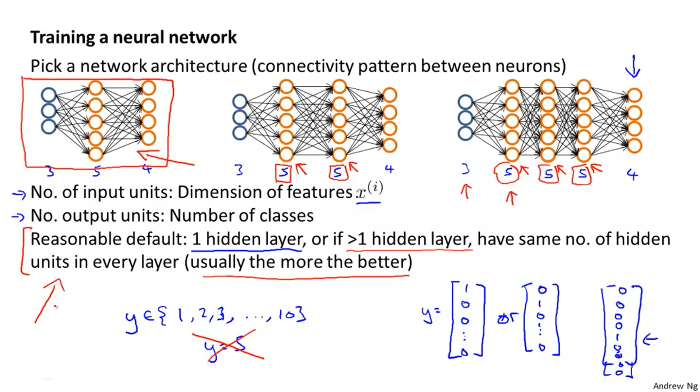

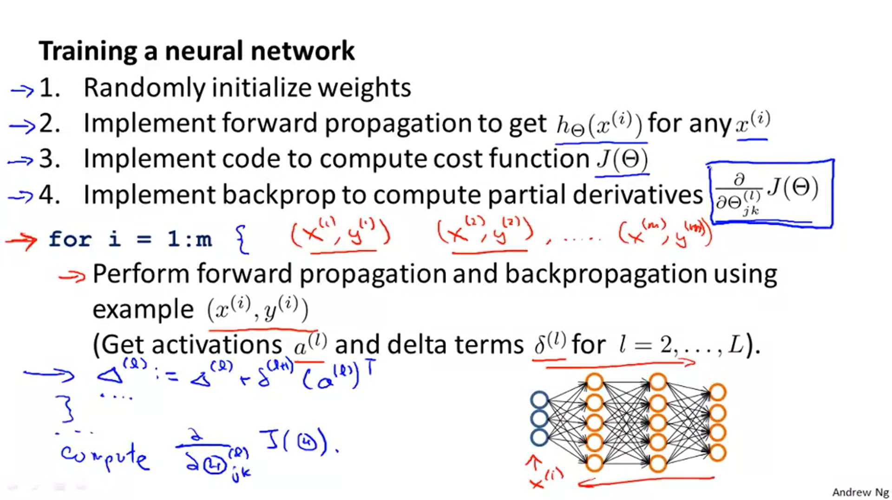

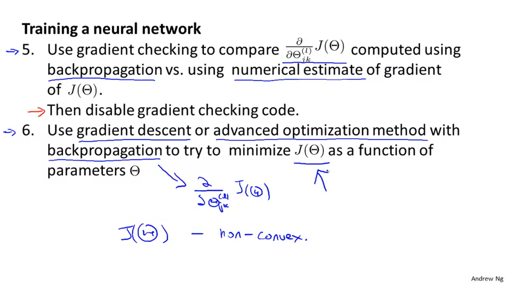


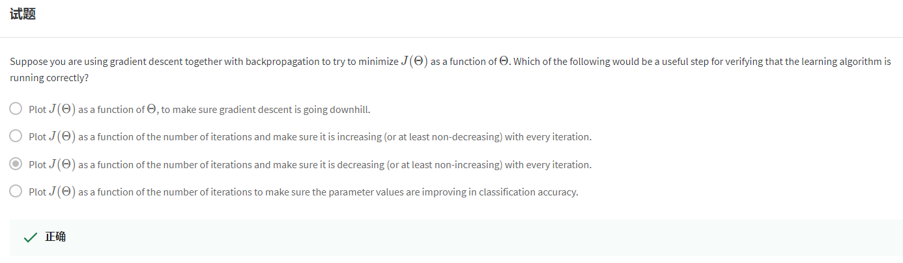


## Putting it Together

First, pick a network architecture; choose the layout of your neural network, including how many hidden units in each layer and how many layers in total you want to have.

- Number of input units = dimension of features $x^{(i)}$
- Number of output units = number of classes
- Number of hidden units per layer = usually more the better (must balance with cost of computation as it increases with more hidden units)
- Defaults: 1 hidden layer. If you have more than 1 hidden layer, then it is recommended that you have the ==same number of units in every hidden layer==.

**Training a Neural Network**

1. Randomly initialize the weights
2. Implement forward propagation to get $h_\Theta(x^{(i)})$) for any $x^{(i)}$
3. Implement the cost function
4. Implement backpropagation to compute partial derivatives
5. Use gradient checking to confirm that your backpropagation works. ==Then disable gradient checking.==
6. Use gradient descent or a built-in optimization function to minimize the cost function with the weights in theta.

When we perform forward and back propagation, we ==loop on every training example==:

```octave
for i = 1:m,  
	Perform forward propagation and backpropagation using example (x(i),y(i))  
	(Get activations a(l) and delta terms d(l) for l = 2,...,L
```

The following image gives us an intuition of what is happening as we are implementing our neural network: 


Ideally, you want $h_\Theta(x^{(i)})$ $\approx y^{(i)}$. This will minimize our cost function. However, keep in mind that $J(\Theta)$ is ==not convex== and thus we can end up in a ==local minimum instead==. 


# Application of Neural Networks

## Autonomous Driving


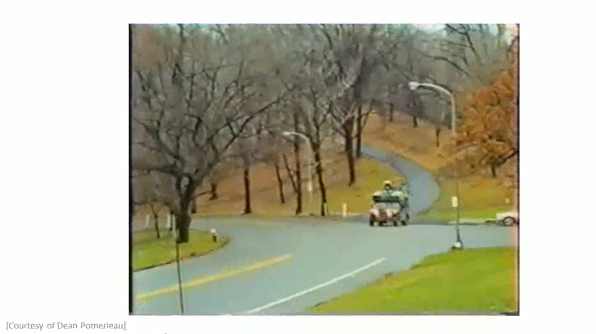


# 【Exam】


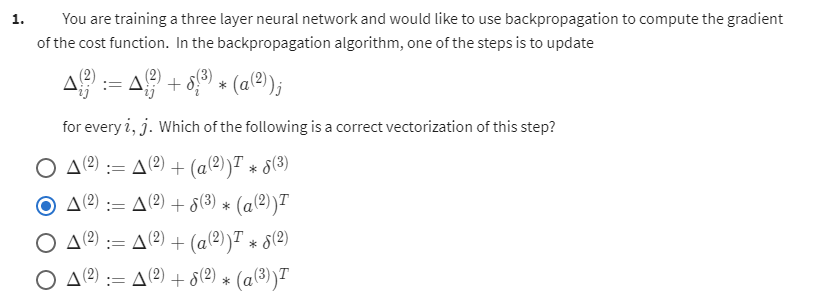


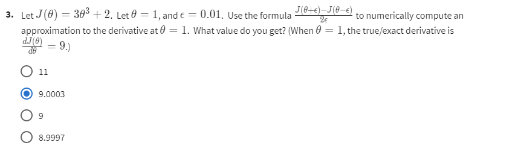

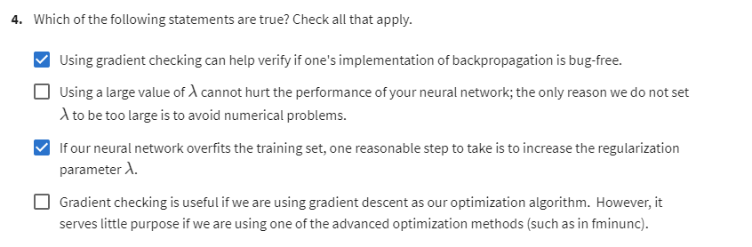


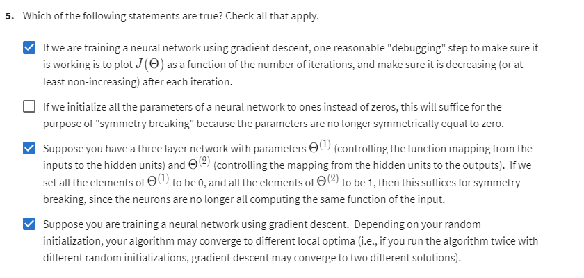

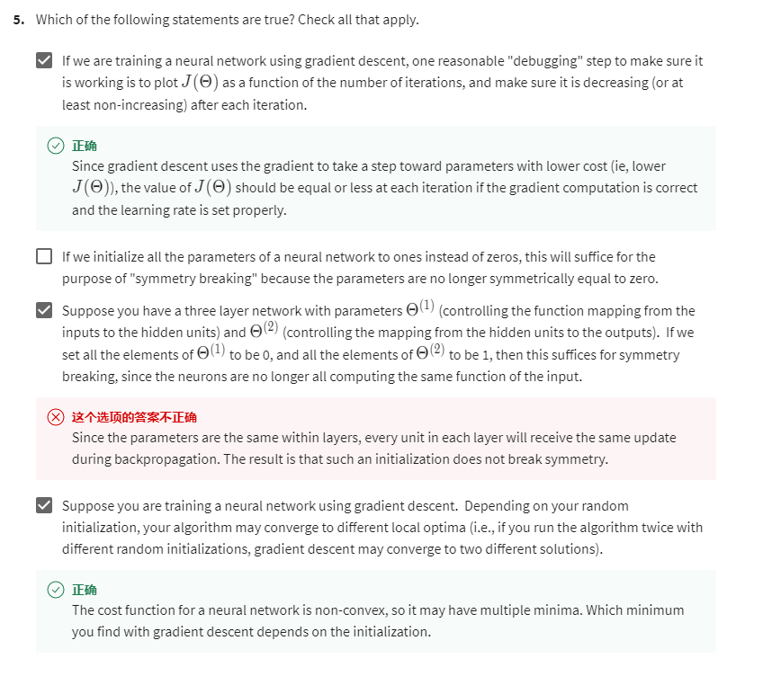


* 【To the option B, it may be right if all the Theta have transposed.】


2022/05/07 23:16:19 46min