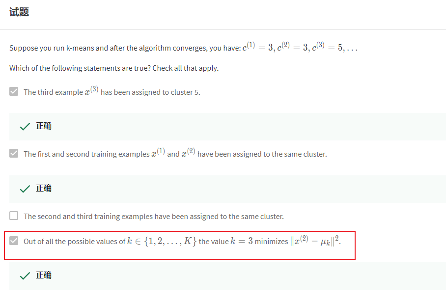
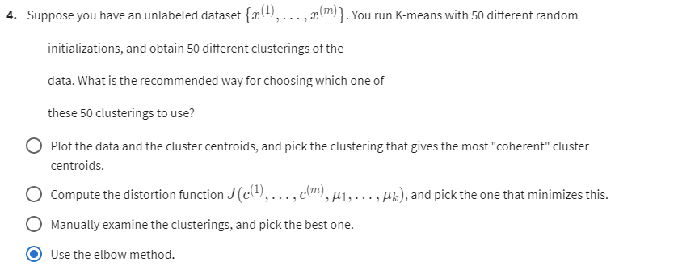

# 08-1 Week Unsupervised Learning

Date：2022/05/21 22:46:02

------

[TOC]

------

# Clustering

## Unsupervised Learning: Introduction

## K-Means Algorithm

* lowercase k

## Optimization Objective

* 【集族、指标集的概念】

* wrt，with respect to

## Random Initialization

## Choosing the Number of Clusters

2022/05/22 22:21:19

# 【Exam】

* 疑问很多，还没读懂这章

* 【问题主要产生：未学线性代数的几何运算】

