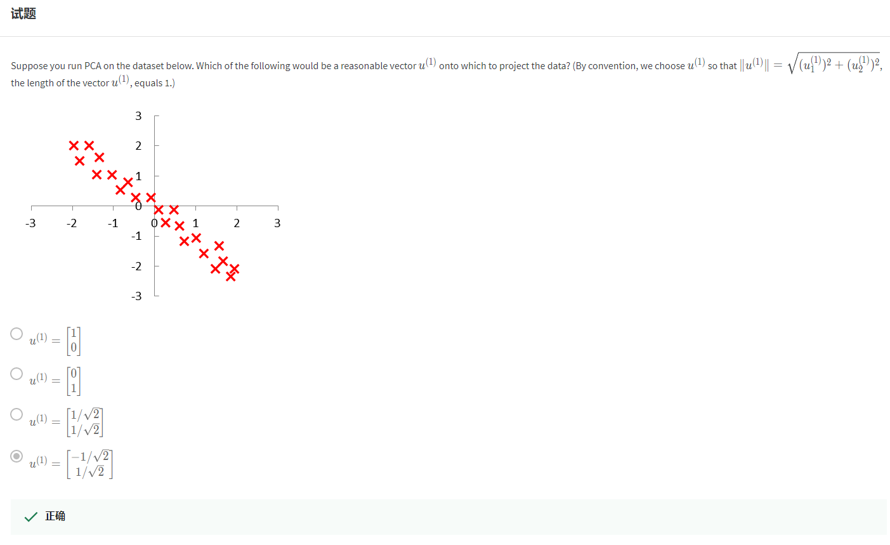
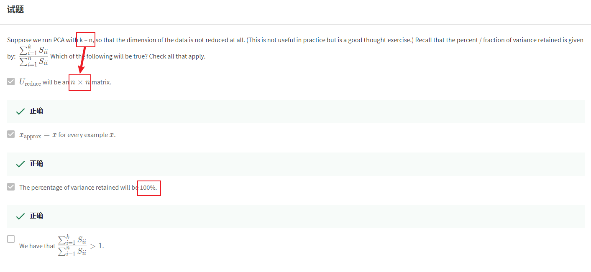
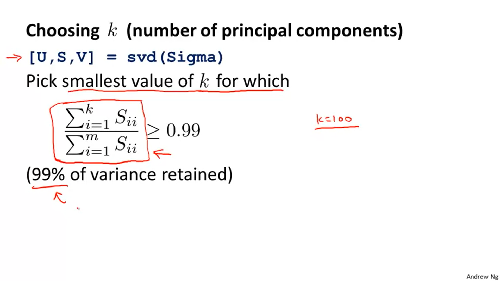
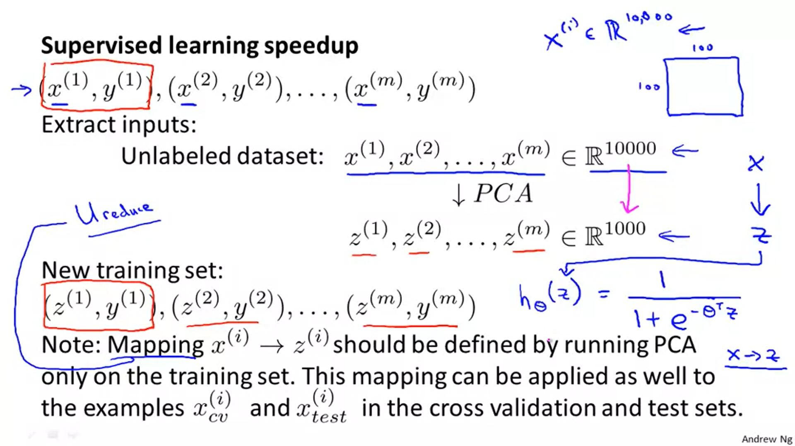
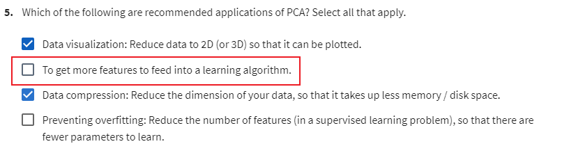

# 08-2 Week Dimensionality Reduction

Date：2022/05/24 10:52:14

------

[TOC]

------

# Motivation

## Motivation I: Data Compression

* 【这里想起了二元关系里的合成，左合成、右合成 composite】

* 【因为想起二元关系，所以做对了】

## Motivation II: Visualization

* Visualization

2022/05/24 11:18:00 29min

------

# Principal Component Analysis

## Principal Component Analysis Problem Formulation

* PCA
* 【前置知识：线性代数，投影几何】

## Principal Component Analysis Algorithm

* 【算法背景信息，发明时间、发明人、发明原因、如何受到启发的……可能是某论文、某书提出。范畴，例如信息论中提出、生物科学中、计算机科学中……算法论坛？算法期刊？或者只是某个项目中的具体应用，再发展到理论推广的？】

* 【SVD 协方差矩阵、对称正定……】

* 【Why the U is n-by-n-dimensions ? Include the figure above.】

* 【数学中的矩阵运算顺序，与代码中的矩阵运算顺序？】

* 【WRONG】

# Applying PCA

## Reconstruction from Compressed Representation

## Choosing the Number of Principal Components

* This number K is a parameter of the PCA algorithm.

* This number K is also called the number of principle components or the number of principle components that we've retained.

## Advice for Applying PCA

2022/05/25 18:38:19 1h23min

------

# 【Exam】

