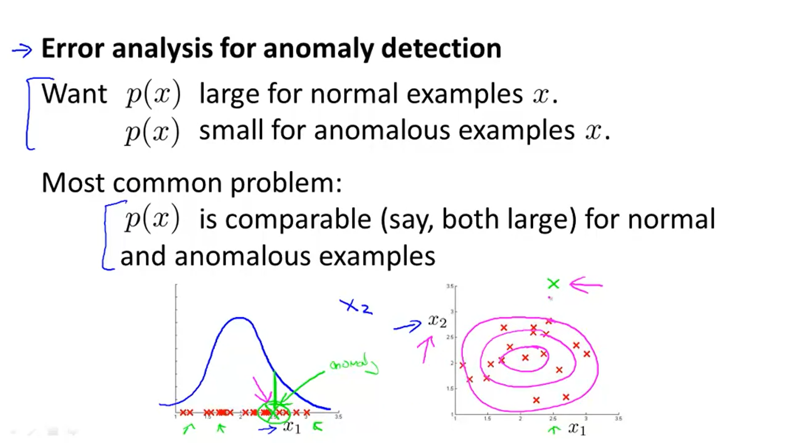

# 09-1 Week Anomaly Detection

Date：2022/05/29 21:37:16

------

[TOC]

------

# Density Estimation

## Problem Motivation

## Gaussian Distribution

## Algorithm

2022/05/29 22:15:37 39min

------

# Building an Anomaly Detection System

## Developing and Evaluating an Anomaly Detection System

* 【WRONG】
  * 只考虑 “分类算法的精度” 是否能够 “很好地衡量算法性能” 。
  * 对比下文异常检测与有监督学习，可以知道异常检测类似分类算法，都具有类倾斜的特征，由于类倾斜，性能评估就会有偏好，因此不能很好地衡量一个算法的性能。

## Anomaly Detection vs. Supervised Learning

## Choosing What Features to Use

# Multivariate Gaussian Distribution (Optional)

## Multivariate Gaussian Distribution 

* 【线性变换的内容】

* 【把 mu 两个参数，第一个看作 x，第二个看作 y，整体构成（x, y）。于是具体参数可以分别看作 x 轴和 y 轴上的作用。但也只能变换一维的位置】
* 【Sigma 相当于对二维的作用，可变换二维的对象。比如图形的拉伸、压缩等】

## Anomaly Detection using the Multivariate Gaussian Distribution

2022/05/31 16:33:02 1h28min MGD + Review

------

# 【Exam】

2022/05/31 17:09:08 35min 三次

------