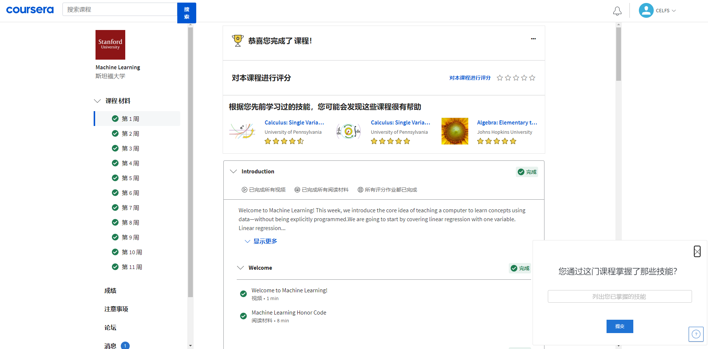
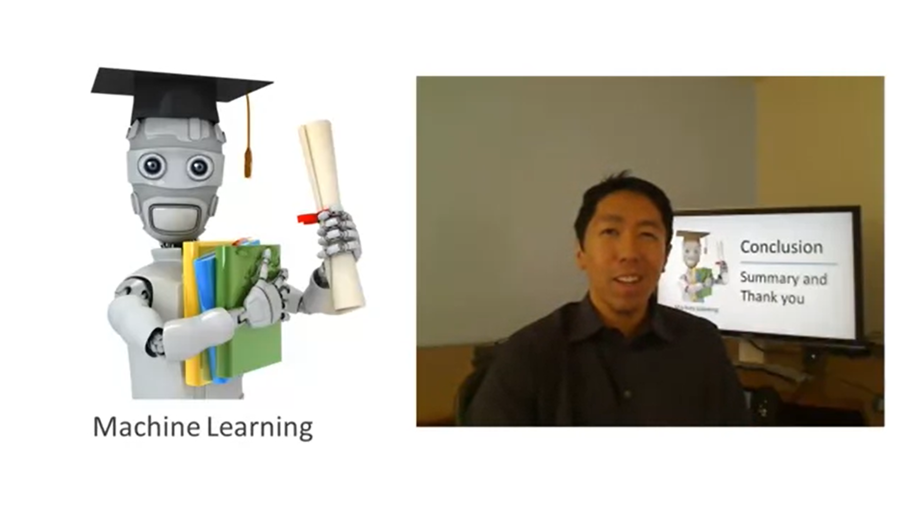
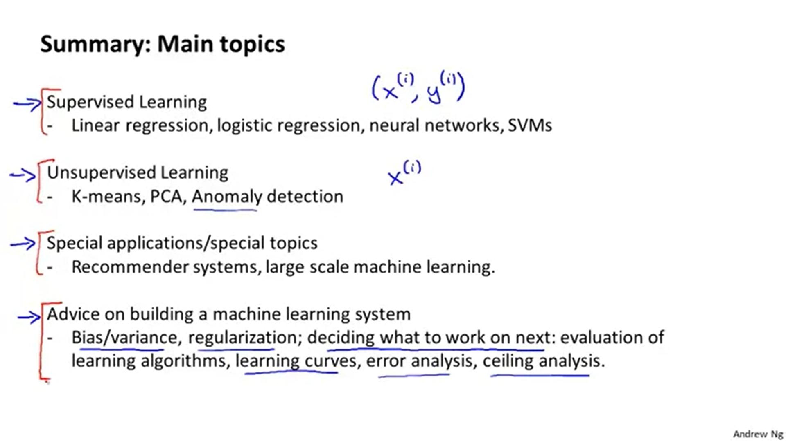
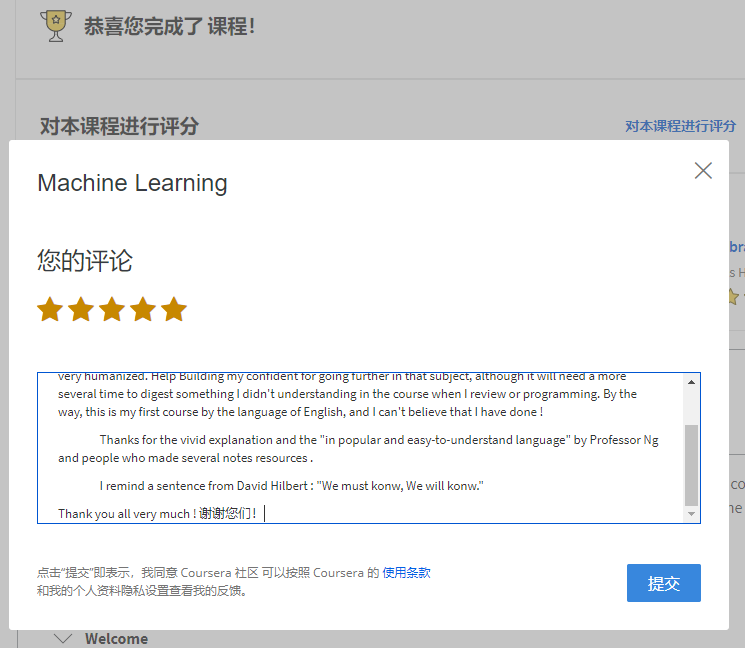
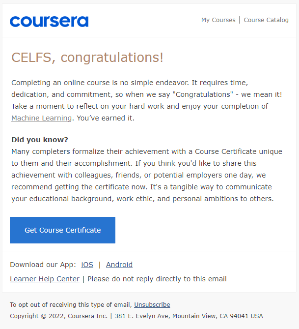
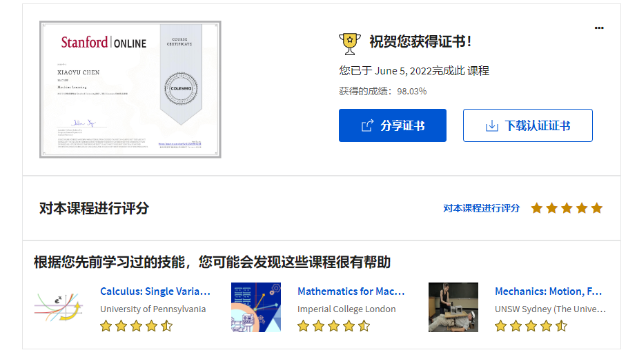

# 12 课程完结

Date：2022/06/05 16:41:46

------

[TOC]

------

## 下一步计划

* 结合其他教材、教程，进行笔记复盘 => 整体理解程度总结、记录
* 按中文版重学一遍课程，判断之前的理解是否有误
* 阅读勘误表 => 结合复盘进行，修正、补充认知
* 编程作业重做，回归数学问题 => 补充数学必要知识
* 6 月 20 前，完成 浙大 人工智能：模型与算法 MOOC
* 重做单元测试。
* 概念复述。

### 拓展资源

* 上线十年，影响一代ML工程师，吴恩达经典《机器学习》课程迎来重磅更新_湃客_澎湃新闻-The Paper  https://www.thepaper.cn/newsDetail_forward_17695483
* 如何系统学习机器学习？ - 知乎  https://www.zhihu.com/question/266291909/answer/2429781356?utm_source
* 吴恩达 - 知乎  https://www.zhihu.com/people/wu-en-da-89

------

# 结课相关

## Summary and Thank You

## 课程评价

Thank you very much !

		This course helps me to open the gate of machine learning, the resources of course are  all-round and very humanized. Help Building my confident for going further in that subject, although it will need a more several time to digest something I didn't understanding in the course when I review or programming. By the way, this is my first course by the language of English, and I can't believe that I have done !
	
		Thanks for the vivid explanation and the "in popular and easy-to-understand language" by Professor Ng and people who made several notes resources .
	
		I remind a sentence from David Hilbert : "We must konw, We will konw."

Thank you all very much ! 谢谢您们！

2022/06/05 17:14:32

------

## 证书

