### 1.0 绪论

Date：2022/10/18

------

[TOC]

------

### 1.1 阅读建议

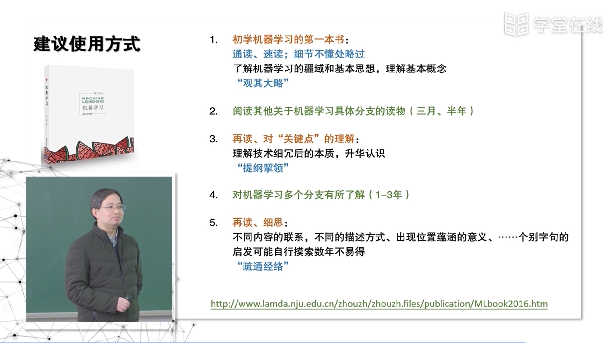

* 大道至简——PPT 讲授风格给我的感悟。
* 读三遍，期间分隔、穿插阅读其他；第一遍要快，例如400页，30天，每天读15页

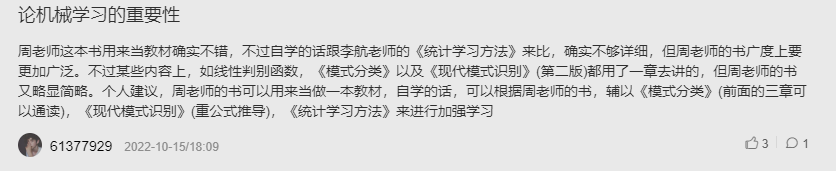

* 模式分类（前三章）
* 现代模式识别（公式推导）
* 统计学习方法（加强学习）

------

### 1.2 课程定位 STEAM

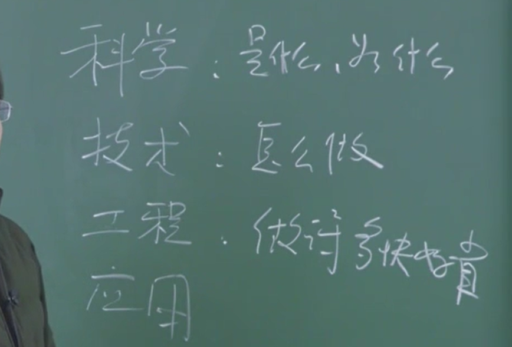

* 这门课主要集中在科学、技术，涉及部分工程，不怎么讲应用

------

### 1.4 典型的机器学习过程

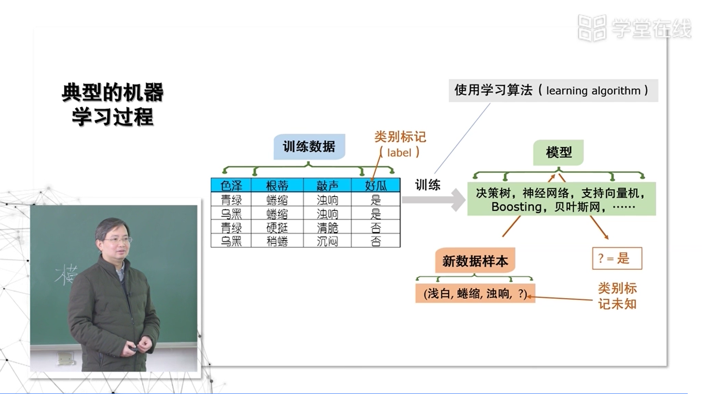

* 摘要：
  * 数据、标记、训练、模型、学习算法；
  * **关键在于理解什么数据、什么模型适配**
* 模型：这门课统称为在数据中产生的东西，是个抽象概念。**从数据中产生出来的，能够帮助你处理未来事件的东西。**
* 不同声音：David Hand（P01 底部）

* **特别需要了解和把握的：**
  * 1、一个算法，针对什么数据是有效的
  * 2、这样的数据需要满足什么样的特点
  * 3、它产生的模型，又在什么情况下有效
  * 4、模型本身，又具有什么样的特点

------

### 1.5 计算学习理论

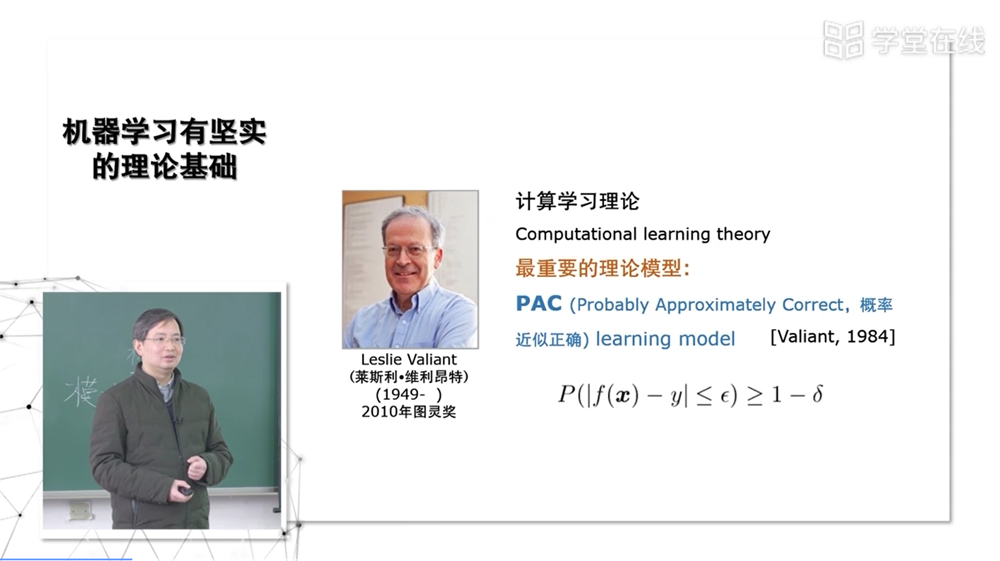

* 计算学习理论，最重要的理论模型——PAC
* 确定的规则：如 90°
* 当有许多因素共同产生影响，但具体怎么影响我不知道——这时需要使用机器学习。
  * 从问题性质的角度，当我们的知识已经不能给出确定的结果时，我们从数据中分析，帮助给出答案——这时就不能指望百分百正确了，因为这不是我们能够清楚了解的问题。
  * 从计算要求的角度，初步算法，P?=NP，通常碰到的问题，都超出了这个范畴，即就算给了你解，你能否在多项式时间内验证这个解有多好，都做不到。如果每次能得到=0或=1，说明构造性地证明了P?=NP问题，反过来，由于0和1不可达，因此模型都是概率近似正确。

------

### 1.6 基本术语

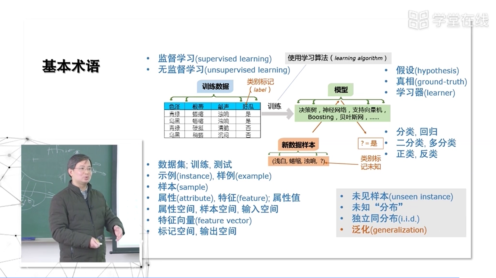

* **关于数据的术语**
  * 一张表就可以清晰地解释——想起之前自己梳理概念，读了几天才过去了。
  * 注意的是：**sample 定义比较含糊**，有时候指单个示例，有时候指整个数据集（来源默认是世界整体的相关可能性构成的空间），需根据上下文判断所指。
* **关于模型的术语**
  * 模型即揭示的规律——一个好瓜的规律
    * **显式的（颜色等）**
    * **隐式的（神经网络）**
  * 不一定正确——因此形成的是一个假设
    * 同时对应——真相
  * 学习器——从学习过程考虑这个模型，可理解为给定数据、参数，输出的实例
    * 同理有分类器（分类模型）、回归器（回归模型）

* **关于输出的术语**
  * 二分类是最基本的问题——因为多分类都可以看作若干个二分类
  * 正类、反类
    * 通常假设两者可交换的（非常重要），意味着两者满足的分布、很多性质是差不多的。
    * 但若两者比例悬殊，交换后性质就发生变化了。
* **关于学习任务的术语**
  * 有导师、无导师学习
* **关于未知数据的术语**（ML运用概率统计的基础理论，假设背后存在某种分布规律）
  * **独立同分布（i.i.d.）**
    * 基本假设：独立同分布、随机事件，否则由统计来推断原来概率分布的这个工具就站不住脚了。
    * 但是，如果同一个店铺A买了东西，B也买了东西，可能B是A的朋友——因此独立同分布就产生疑问。这是**目前机器学习最前沿的研究之一**：**如何突破独立同分布的假设**，而这里面往往需要引入一些现代的数学技术，或者需要对原理的概率统计技术的一个改变。作为入门课程，知道这些事在做、可以做即可，还是要从独立同分布的假设开始学习。【这个认知绝了，顿悟】
  * 泛化
    * 即 $\epsilon$ 能达到多少，有时候需要推导一个**理论的泛化界**——即最好能够做到什么程度，如果发现最好的结果都是做到无限差，说明这件事根本不可用ML做。
      * < 0.5 说明不要做了
      * < 0.2 可以设计做

* 【感悟】
  * 真正的高屋建瓴——当时我学习就没想过从这几大维度对如此涌现的术语进行分类，从而走了许多弯路。因此，**搞清基础概念、做好认知分类**是非常重要的——这有助于形成网状的记忆与联系。
* 视频断层
  * 版本空间
  * 学习、搜索、优化
  * 色泽 = *

------

### 1.7 归纳偏好

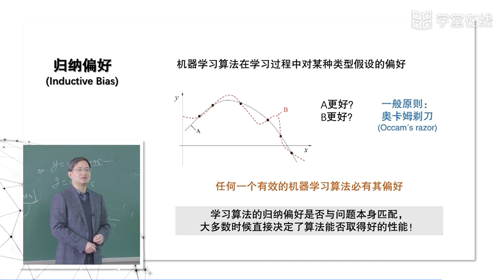

* 选最简单的，认为是好的（更平滑、更美的——背后的原理是奥卡姆剃刀）
* 确定 “更简单” 不是个简单的问题——如何衡量简单，尽管有准则，但面临的变化非常多

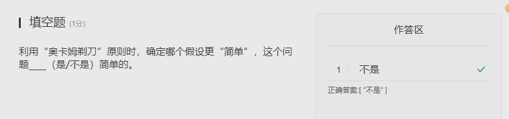

* 从事久后
  * 通常不会说一个算法好坏
  * 而说真正work的不是算法，而是背后的假设，即偏好什么——这个偏好对当前问题是否合适。

------

### 1.8 NFL 定理

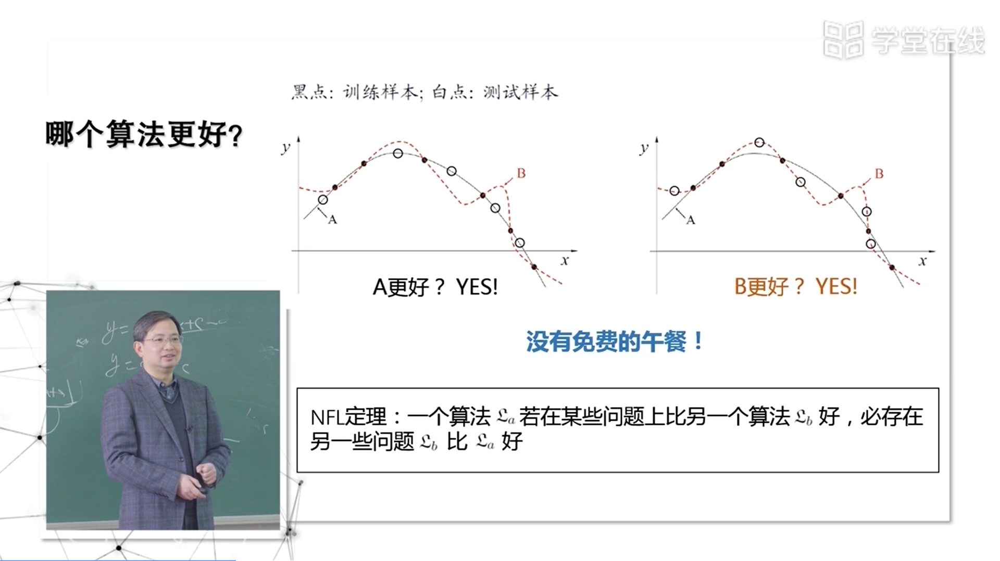

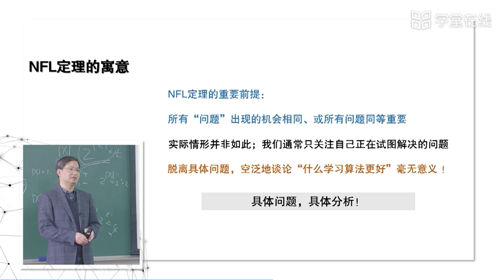

* 流行的算法——只是在比较多的问题，有较好的结果，但并非100%覆盖问题。
* 算法的好坏必须与具体的问题一起讨论，这就如同单独讨论一个点的瞬时变化率是没有意义的——因为缺少了过程，缺少必须的对比对象。
  * 在谈论问题的时候
    * 明确 X 和 Y，才是一个完整的问题
    * 如果抛开XY泛泛地谈分类、推荐等，对于ML学习者还算不上一个问题。

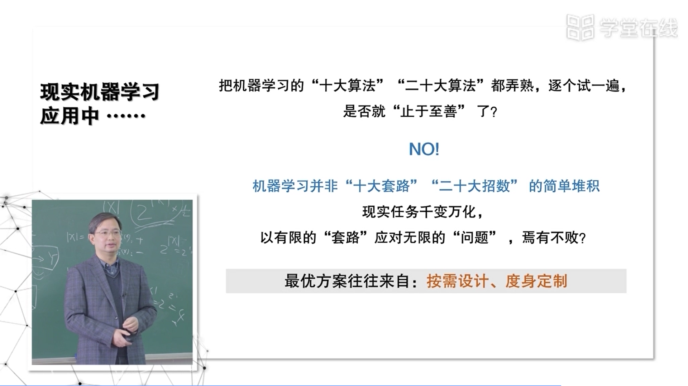

* 最糟糕的学习——以为学完套路就行，现实试过都不行，就以为ML没有用。
* 现实中的机器学习应用——巨大的差别：千变万化——无招胜有招。

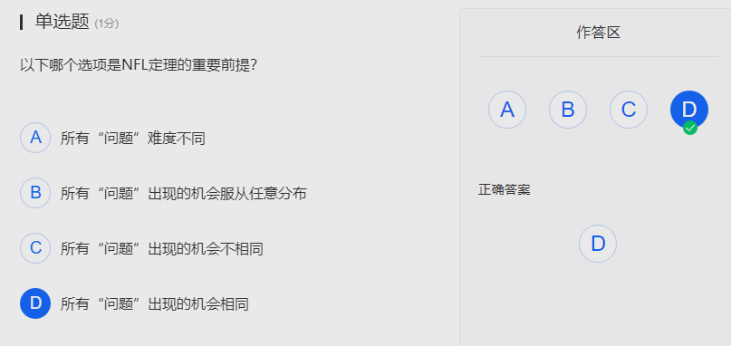

------

### 【01 EXAM】

* 错误的选项。P03，预测任务，预测之前需要先学习（这里似乎只讨论有监督学习）

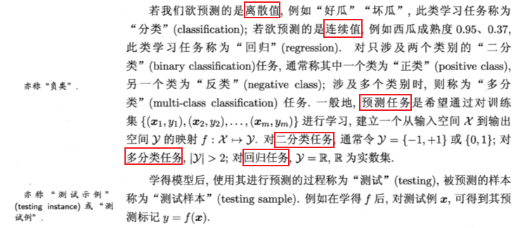

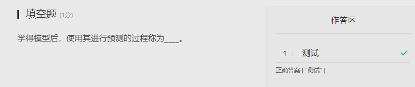

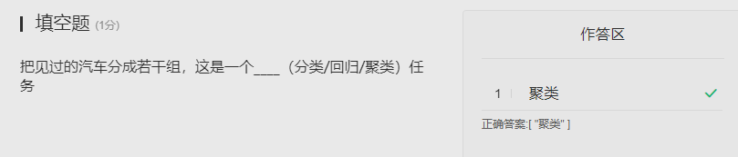

* 总觉得聚类和分类容易混淆

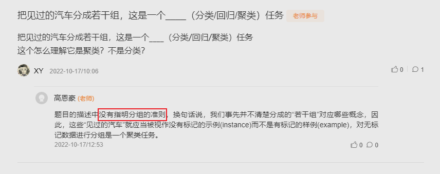

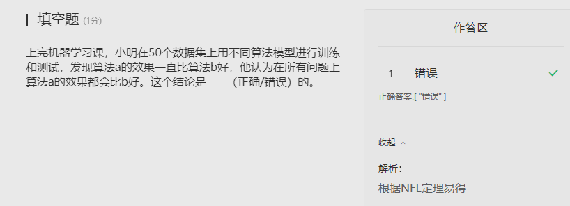

* ML 解题中的 “易得”

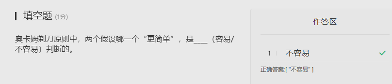

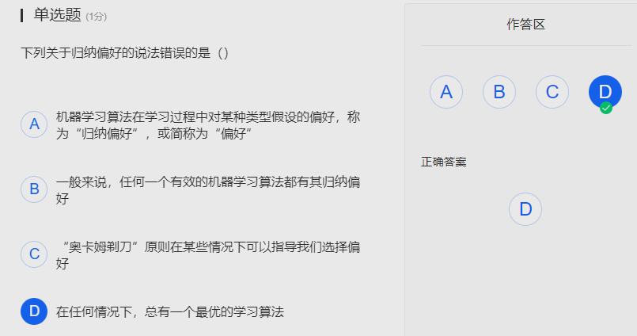

* 错误的是，并不总有一个最优学习算法

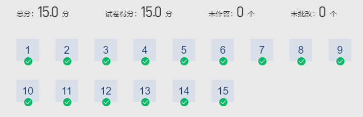

2022/10/18 15:35:13 24min + 51min + 21min + 46min = 142min = 2.36h

------

