### 2.0 模型评估与选择—概念树

Date：2022/10/18

------

[TOC]

------

### 2.1 泛化能力

* 什么是好模型？
* 学科深入后，会发现其看待问题有一个独特的角度。
  * 搞清楚你要什么，才知道我要给你什么

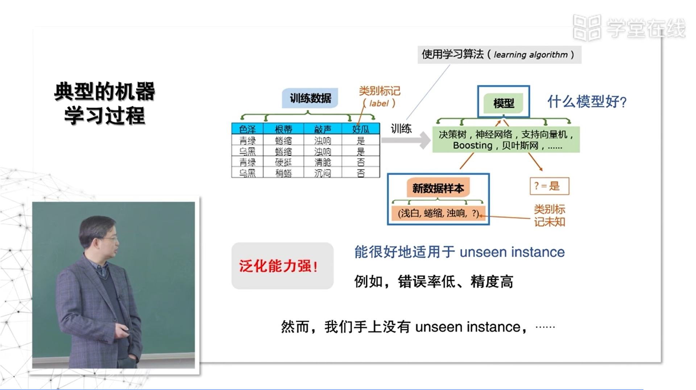

* generalization ability

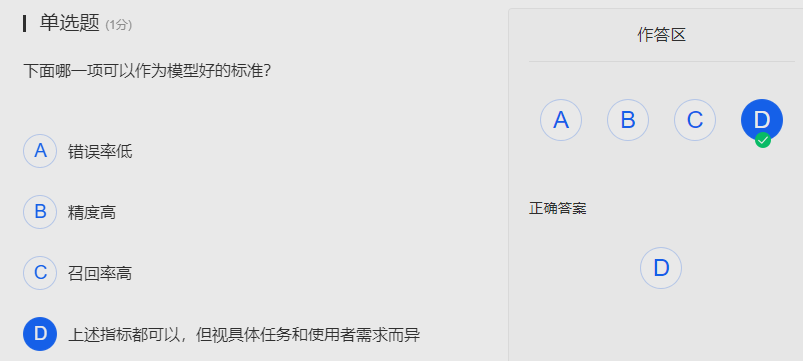

* 这题之前，课程并无解释上述概念，于是出现一些非线性的认知尝试，例如跳出去列概念表、翻阅书中相应内容以看定义等操作。

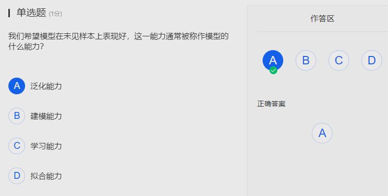

* 拟合与泛化能力，看似非常相似——但我理解的拟合是对学习过程的训练样本而言的，乍一看不清晰，但仔细思考比对后才见真相。

* 模型的意义在于对未知数据的处理能力。

------

### 2.2 过拟合和欠拟合

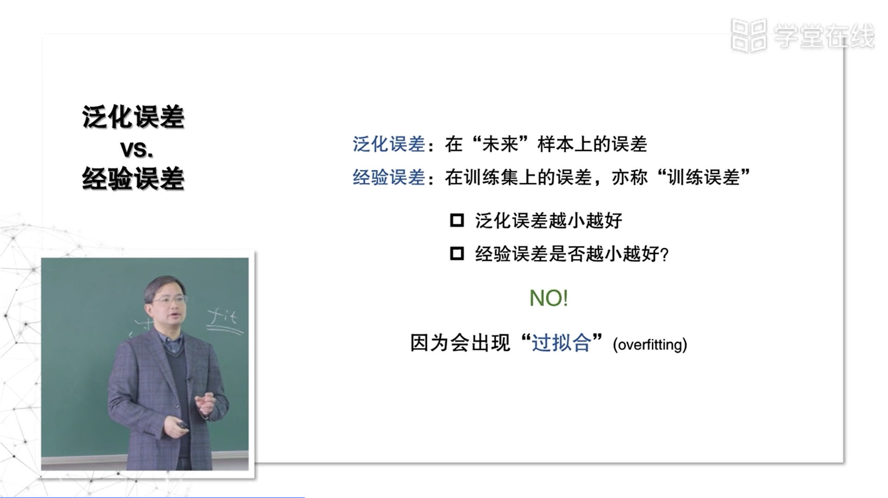

* 能控制的是训练集上的结果，但我们想要的是未来的结果，因此，一定要在两者之间找到某种联系，如果不存在联系，那么 ML 学科就不必存在了（即给你的东西与未来完全不发生关系），而我们的假设是，给定的数据与未来的数据都符合某种规律。
  * 如何确定我们真正把这个规律发掘出来了？

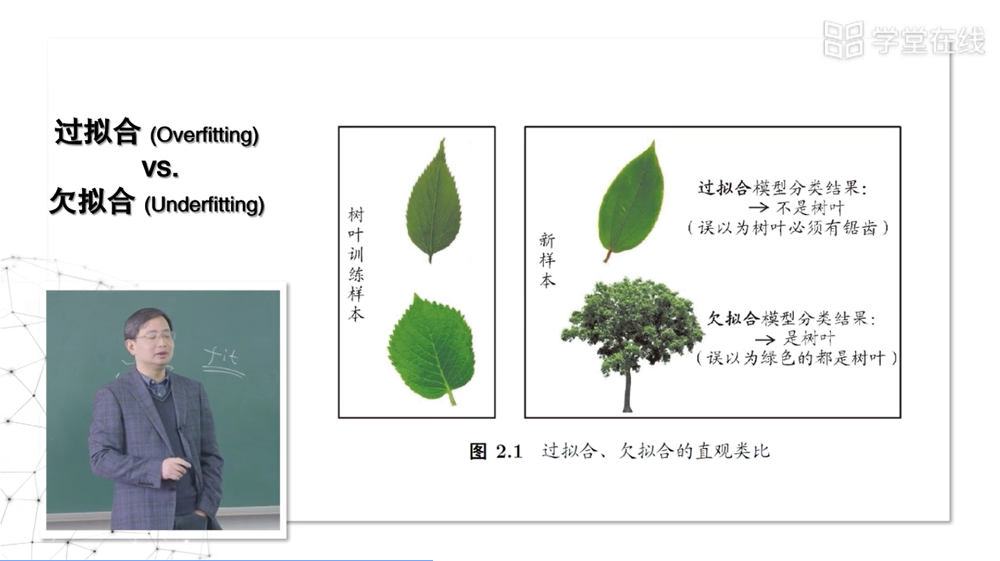

* 把不该学的东西学到了——过拟合。
* 欠拟合——没有训练之前也算是欠配，通常是没有把必要的特征学到，该学的没有学。
* U 型曲线
  * **过拟合是 ML 的核心内容——所有的技术都可认为在缓解过拟合（根本问题）**
    * **这个算法靠什么缓解过拟合？**
    * **这个缓解策略什么情况会失效？**
  * 基于 P ≠ NP，因此无法得到最优模型
* 【这一段对人的学习也具有启发性】

------

### 2.3 三大问题

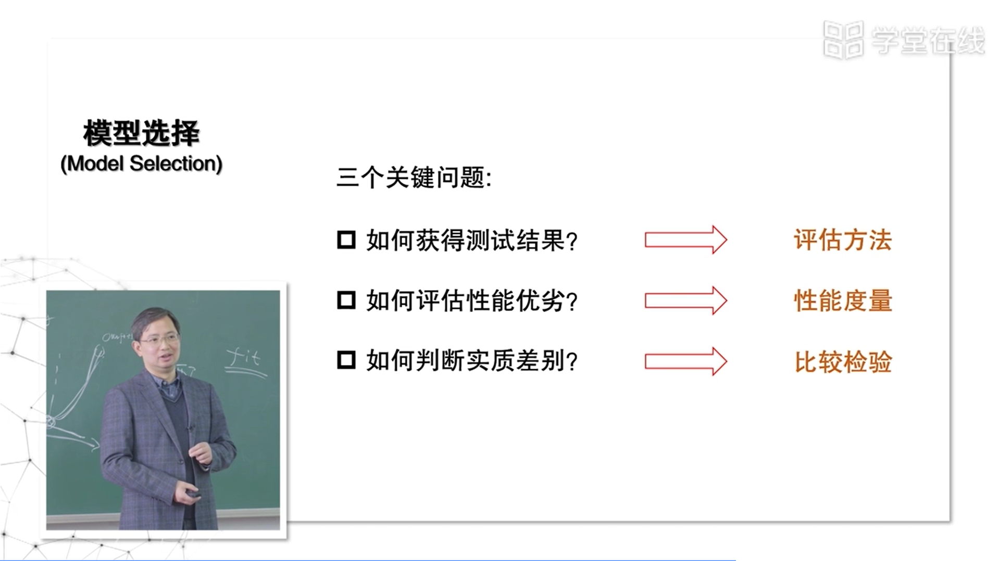

* 对于未来的数据，要设计评估的方法——如果一个模型总是对的，但对于交易诈骗这种百万分之一的情况，这个模型准确率也有99%，但明显不是我们想要的模型。

* 理解以前/现在有什么刻画的标准，才有可能对未来进行创新
* 统计意义上的好模型——比较检验
* 上述列举的，只是有什么，而不是所有的情况——以后工作可能需要根据任务新发明、新设计出度量。

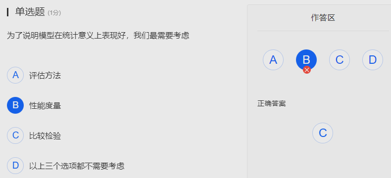

* ==【WRONG】如何理解统计意义上表现好？其他几种是用来做什么的？我错误的原因主要是没有缕清三者的定义、定位、作用。==

------

### 2.4 评估方法

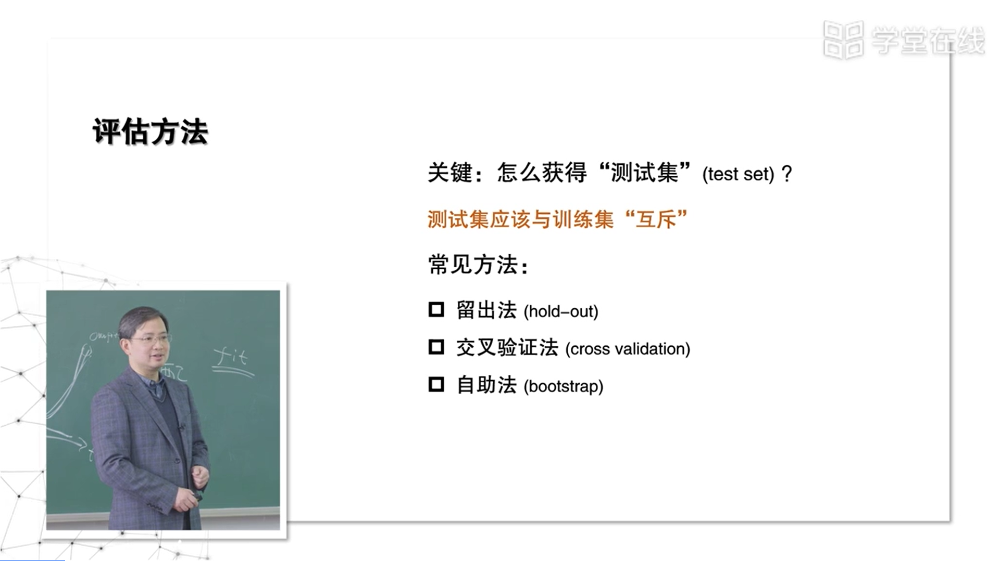

* 发明一种方法还是很困难的，所以要先搞清楚常用的有什么。

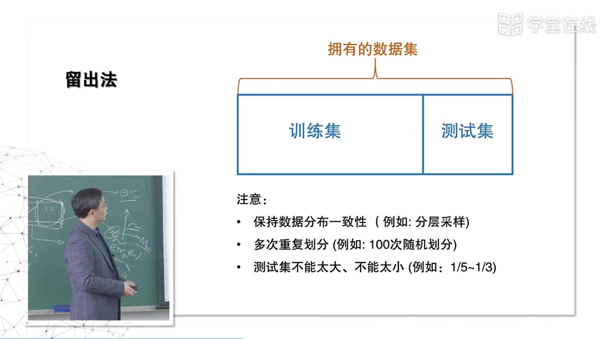

* 如何划分很重要，引出一个不可调和的矛盾
* 最后要把所有数据合起来，重新训练一遍再给用户【未理解】
* 局限：可能总是存在一些没有使用过的数据（例如考试知识点，每次随机几个，但总有两个知识点没抽到过，导致性能在那两个知识点上一塌糊涂）

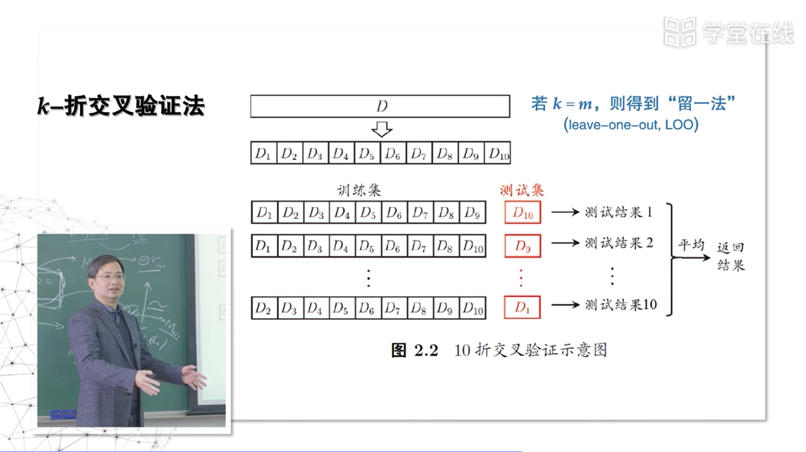

* 为了更好地使用训练样本，以达到更好的逼近，即解决 hold-out 法的不足
* 每一个环节都是 NFL
* $M_{99} \rightarrow M_{M100}$ 不一定比前面 80 个或 $10 \times 10  CV$ 更准确，因为 NFL

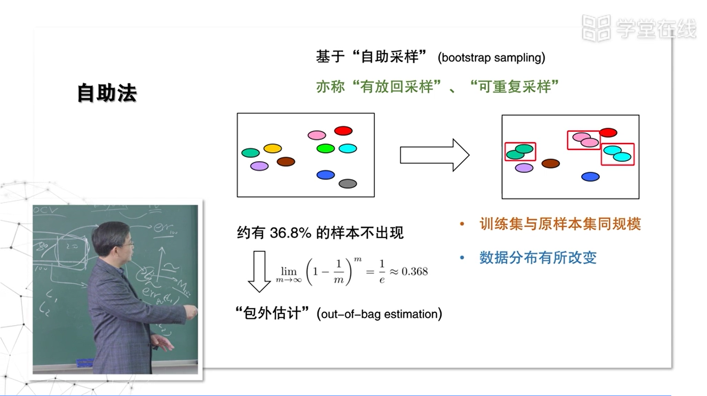

* 数据太少的时候很有用
* 但会改变数据的分布，用后一种分布去近似了，但如果认为分布的改变可以忽略，那么就很有用
* 以后，在集成学习方法当中，这是一种关键技术
* 虽然 “重复采样” 看上去简单，但在统计学有非常深刻的东西，统计大师 Efron 专门写过一本书 Bootstrap
* 概括：bootstrap sampling改变样本分布，适用对样本分布不敏感，样本量小的情况

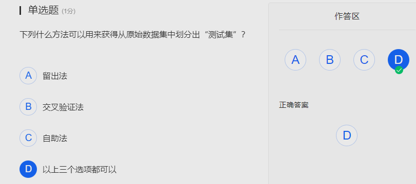

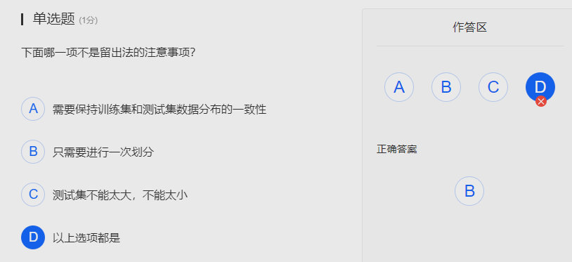

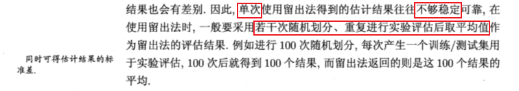

* ==【WRONG】==

------

### 2.5 调参与验证集

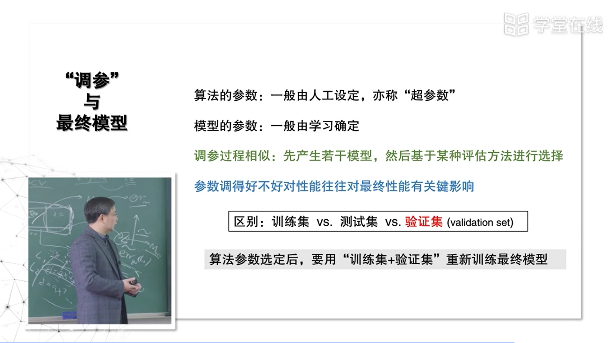

* 模型选择是一个很广泛的概念，例如算法的选择也可以看作是一个变量，实际上模型选择囊括了这一个过程中所有的变量可能性。每次的调整、每一轮的训练，其实都得到了一个新的模型。

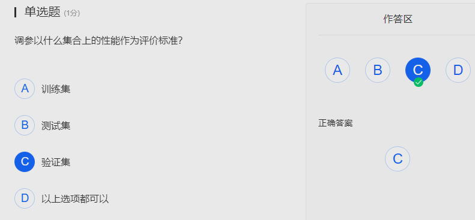

* 调参是训练过程的一部分，因此绝不能在测试集当中进行（新手往往的错误）

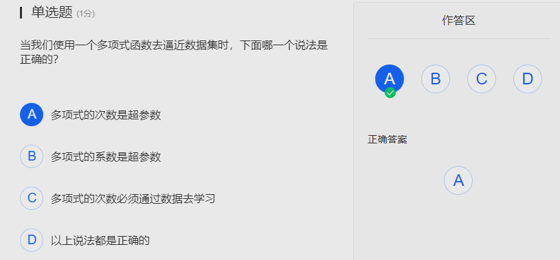

* 超参数，即人工设定的内容，算法的参数；区别计算机的任务，即模型的参数——这其中能够看到人机的分工与协同工作。

------

### 2.6 性能度量

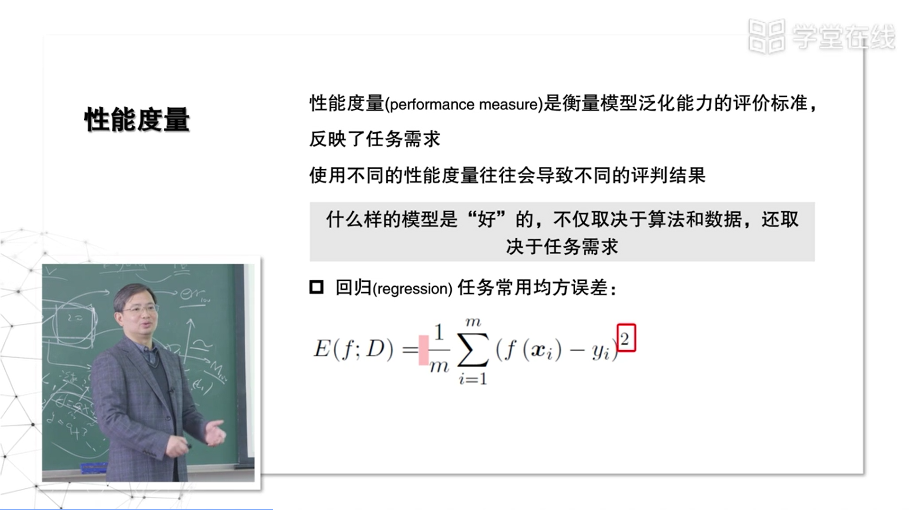

* 一个算法，对A好，不一定对B好，因为它们想的可能不是同一个目标。【突然想起迁移学习，例如神经网络的靠近输入层和靠近输出层的抽象意义不同，靠近输入层的那些内容，通常可以推广到类似的任务，以此为基础再针对性地设计靠近输出层的网络】
* 同称为二次误差、平方误差
* 有时候系数 $\frac{1}{2}$ ，对结果没有影响，因为所有模型、所有选择都乘以这个系数了——但这样操作可以带来一个计算上的好处：把导数产生的 2 消去了。

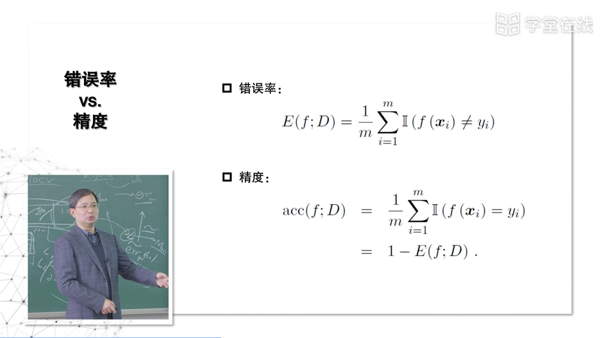

* 这些指标太简单，因此通常会使用一个混淆矩阵

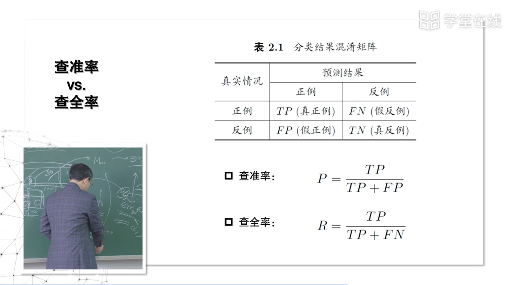

* precision 有些地方翻译为精度，但为了避免跟上门的 accuracy 混淆，此处翻译为查准率
* 这样描述，对模型的精度就有了一个更具体的刻画了
* 但由于 P 和 R 有时候人的角度看不过来，有时候 P 上更好，有时候 R 上更好，那到底谁好？于是我们把两者合在一起

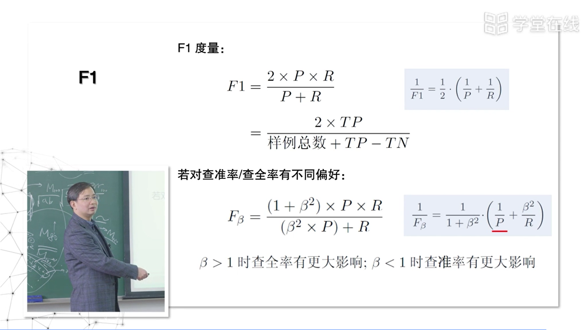

* **使用调和平均，使得两数差异可以体现，较小值不会被忽视**——反之，如果使用算术平均，那 $\frac{a + b}{2}$ 中 a 与 b 差异无法体现。
* 有时候以为要死记硬背，但只要知道从右边公式来的——$\beta$ 相当于引入一个权重，那么就更清晰了，由此可以对查准率与查全率针对性地偏好。
  * 其实就是右侧公式的两个分子进行比较
  * 加权调和平均

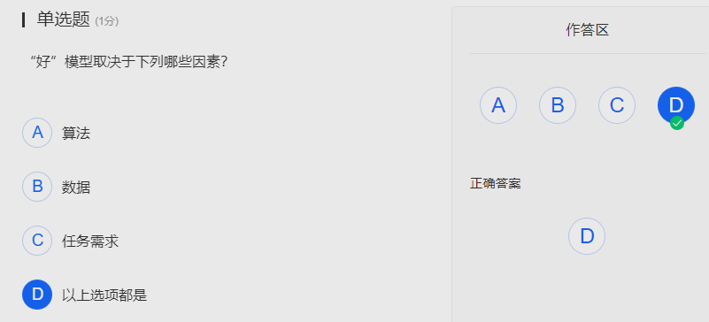

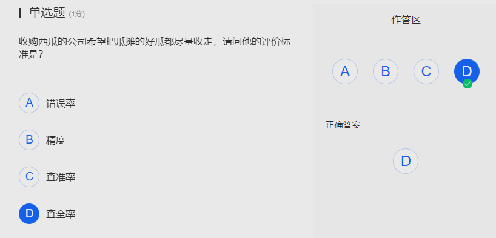

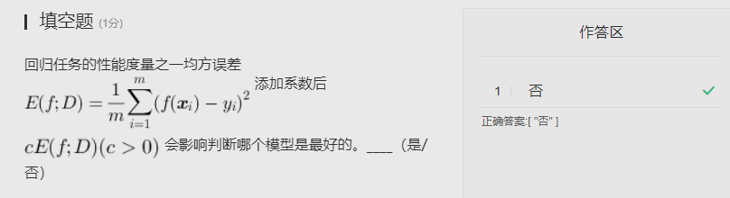

------

### 2.7 比较检验

* 背景：0.88 VS 0.9 是不是 0.9 一定更好？==【前面的几个环节，也要梳理出这个需求】==
  * 不能。因为是复杂综合的结果，并**不能单一维度去比较**【想起糖尿病遗传风险比赛，当时我就怀疑仅仅比较准确率，或者模型仅生成了这样一个指标，是否有说服力的问题——在这里可以找到答案。不过比赛具有特殊性】【多维度思考的角度】
  * 并且，**我们不是在找确定的最优，而是概率的近似正确**。

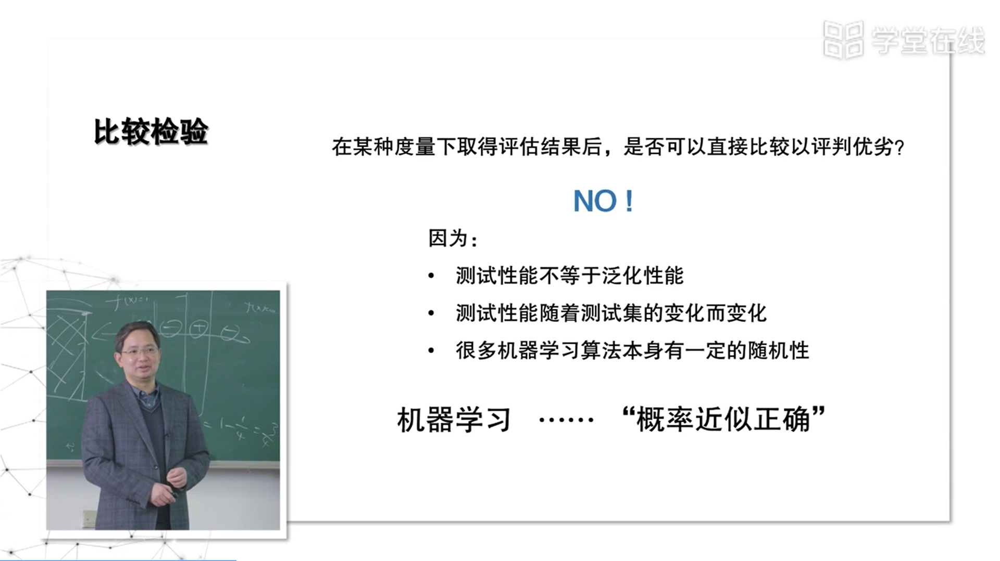

* ==03:00 左右，讲到学习的态度、程度问题，非常重要== 【待总结】

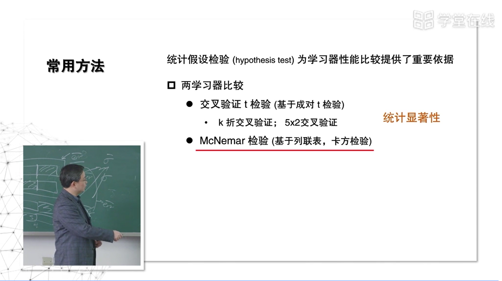

* 需借助数理统计 “假设检验” 的方法
  * 这些假设检验，不必死记硬背，目前很多工具包里都有，调用即可
  * ==更重要的是，知道什么时候该用什么，以及为什么==
  * 具体检验如何进行，自己翻书
* McNemar 检验
  * 是列联表后，考虑反对角线上的两个点

* 数理统计中，标准的 t 检验、成对的 t 检验
  * 零均值，浮动；由此可以用得到的均值、标准差来判断是否属于这个分布（零均值、浮动的分布）

* 什么是列联表？（P41）

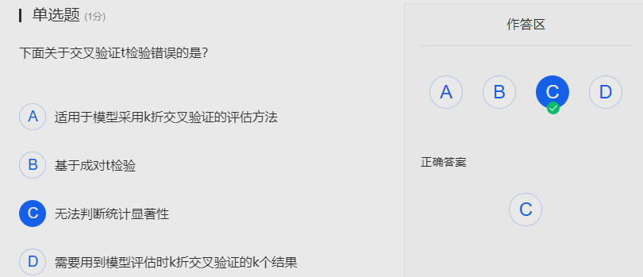

* 什么是统计显著性？t检验是什么？

* ==【疑惑】==
  * 为什么学完这个视频，==基本上不理解甚至没有吸收到上述两个学习器的概念？==
  * 这个认知上的忽视过程，**源于缺乏相关统计知识**支撑；
  * 重新看一遍视频，判断一下忽略了什么，什么不理解，为什么不理解。
  * 最小二乘法
* 【感悟】
  * 需补充数理统计知识
  * 需分步分析划分训练集的几种方法，梳理算法步骤

* 视频断层
  * 较多黑板内容剪辑掉了

------

### 【02 EXAM】

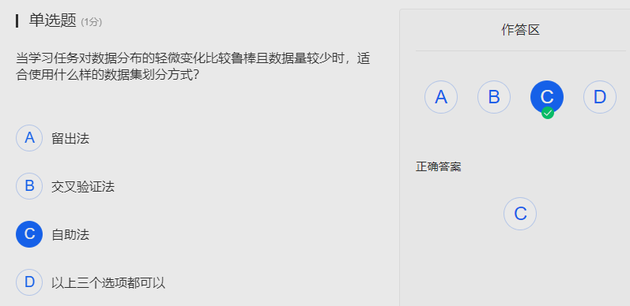

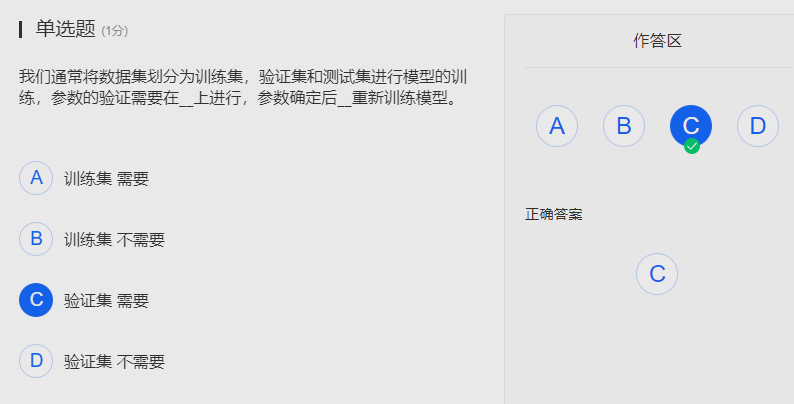

* 为什么需要重新训练模型？对应本章的什么内容？

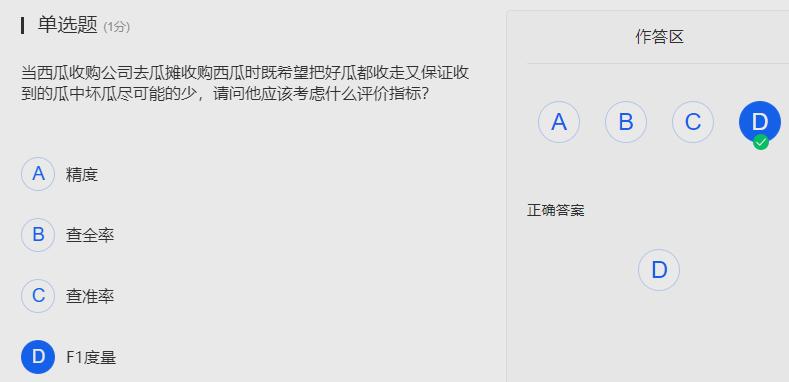

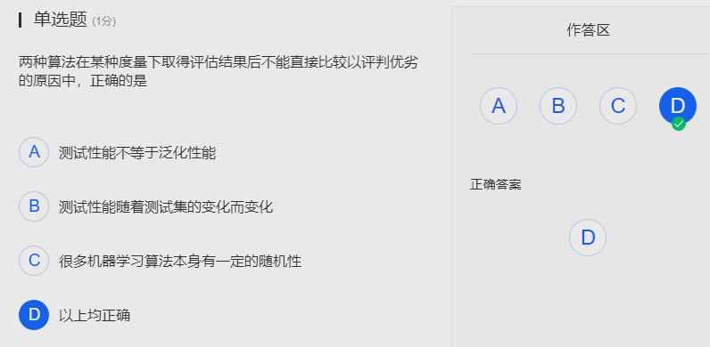

* 可逐条理解
  * A 测试性能只是一种基于已知样本，对未知样本的近似估计；而泛化性能对未知；
  * B 测试集不同，数据差异会带来扰动
  * C 例如神经网络，初始化条件不同，结果也不同

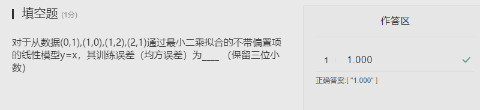

* 本来很怀疑，结果对了——怀疑的原因是：均方误差的取值范围——但仔细回忆，发现跟概率分布取值范围 $(0,1)$ 混淆了
* 而且也说不清最小二乘法——但公式用对了。为什么叫最小二乘法？谁提出的？

* 什么时候才可以推给用户？需满足什么条件？
  * 课上讲过类似的，比如数据集合在一起重新训练一遍后，再推。书上则强调需随机多次划分、重复进行实验评估，最后取平均值。——或许退给用户的时候，就是这个平均值结果较好的时候，取决于具体需求。

* ==【WRONG】并不理解这题，尤其是背后的原理==

* 按照 P27 的讲述，训练模型与使用整个数据集训练的模型应该是很相似的。【但我还未理解这种相似性的来源——即 “只少了一个样本” 这句话，同时未理解的也包括前文 M80、M99、M100】

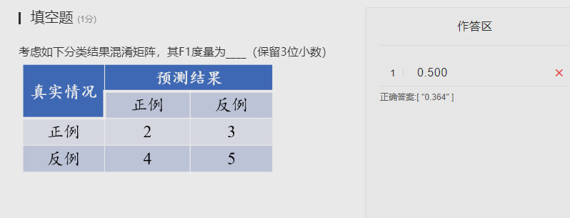

* ==【WRONG】混淆了 TN 与 FN==

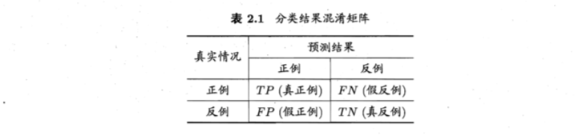

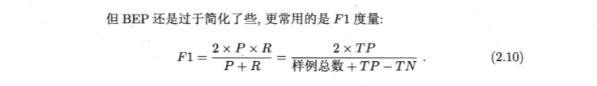

* 为什么会混淆？而且套公式的时候有一种焦虑感——因为套公式的行为。

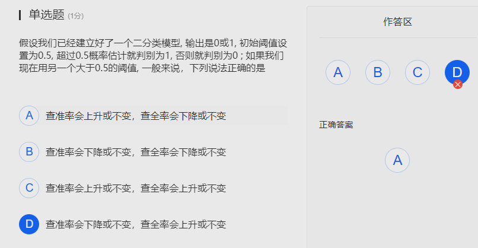

* ==【WRONG】总是做错的题目，判断完全相反了。==
  * 做这题的时候，我==完全没想起两者对应的公式==
  * 我的理解是，用大于 0.5 的阈值，判断为 1 的分类少了，0 的分类多了。
  * 由此，假设一开始好瓜都挑出来了，那么这个调整会减少一些 FP，即提高了查准率；假设一开始只挑出了部分好瓜，这个调整会减少一些 FP 的可能性，同时也把更多的好瓜过滤掉了——查准率同样会提高。
    * 不过问题在于，同时增加、同时减少，带来的整体变化是如何？或许要证明一个不等式。又或者有更加简便的理解方式。
    * **应根据两对角线理解混淆矩阵**

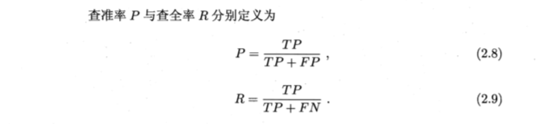

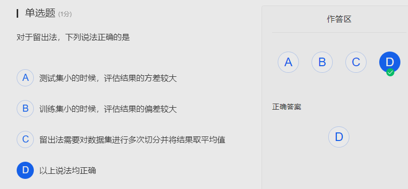

* 这题同样懵逼——因为缺少（至少没有系统学过）数理统计的知识。（P26 上）
  * 但吴恩达有讲过类似的，过了几个月，不记得了

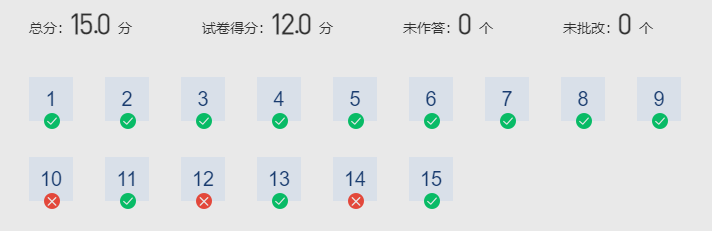

2022/10/18 20:38:39 44min + 1h27min + 1h34min = 225min = 3.75h

------

