### 3.0 线性模型

Date：2022/10/19

------

[TOC]

------

​		线性模型的重要性在于与人类的思维习惯一致，如果思考线性的内容，马上容易产生一个几何直观印象，以后加上一些技巧，就可能可以得到一些针对非常复杂的非线性问题的方案。

### 3.1 线性回归

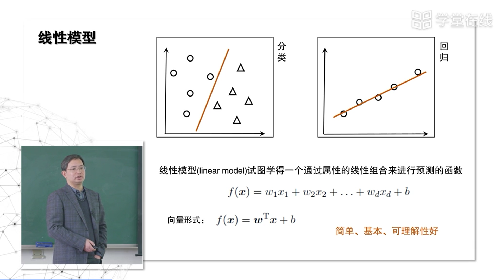

* 线性回归模型非常擅长处理数值属性
  * 需要特别的处理：把离散的东西转成连续的东西
  * 先考虑是否有 “序” 关系，不能一看到离散的东西就当成0和1，因为在具体的算法求解过程中，很可能把1和0当成了数值关系（例如当成A B C的距离，会导致引入了错误的关系）
  * **离散量的处理**
    * 有序：保序即可
    * 无序：A B C，其中 B 表示成 [0 1 0] 类似的编码，如果一个离散量有 k 个取值，则可表示成一个 k 维向量
  * 因此，看到离散的，不要马上想转成连续的，其中的处理可能会出问题
* 通常，机器学习大概有两大类方法（数值处理的角度）
  * 一大类擅长处理离散东西
  * 一大类擅长处理连续东西
  * 若要用离散的东西处理连续的信号，需先做离散化；
  * 若要用连续的东西处理离散的信号，需先做连续化；
  * 目前，尚未有完美的解决方案

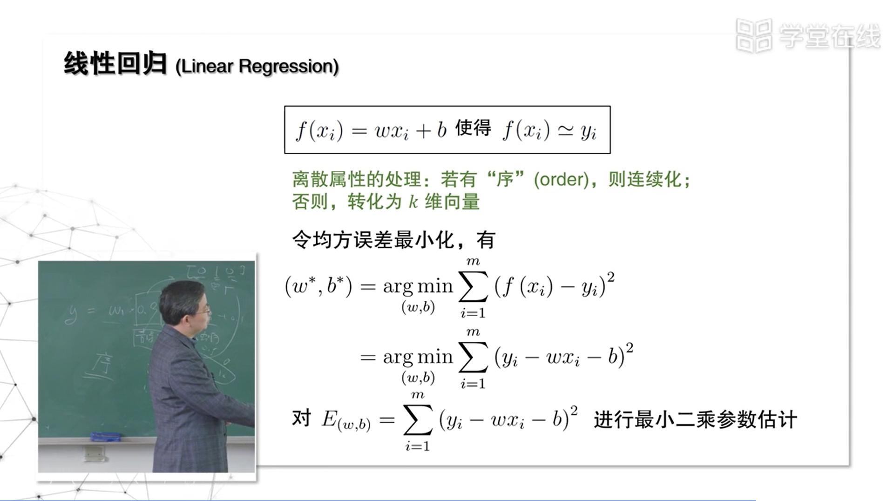

------

### 3.2 最小二乘解

* 最小二乘法估计：实际上就是求偏导，并且令导数为 0

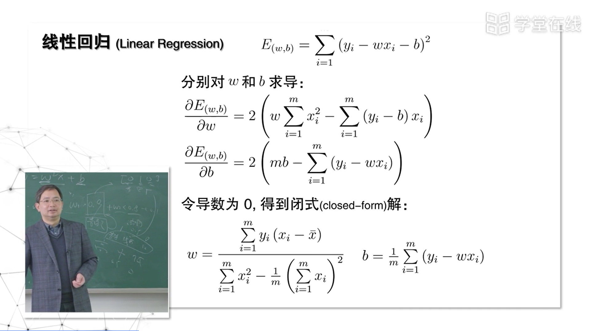

* **自己推导，并且推出来没有问题**，==如果这里觉得难，说明学习这门课的准备还没做好==（说明书对你选择，因此要回头把基础打好再回来学）
* **除了基础以外，真正要理解的是：为什么要求偏导？这些数学工具为什么我们在这里这样使用？**
  * （1）对一个对象求偏导，意味着我希望找到这个对象不再发生变化的那个点；
  * （2）什么时候不变化了，是达到了一个极值、稳定值，不会再大或再小了。对线性回归而言，偏差可以无限大，所以当我们找到这个点的时候，它就是再也不会再小了，由此找到最优解。

------

### 3.3 多元线性回归

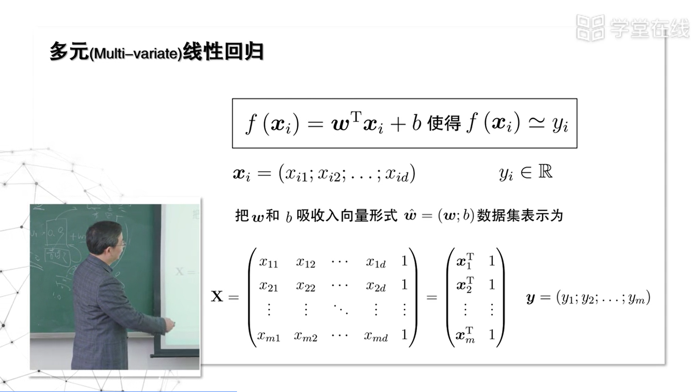

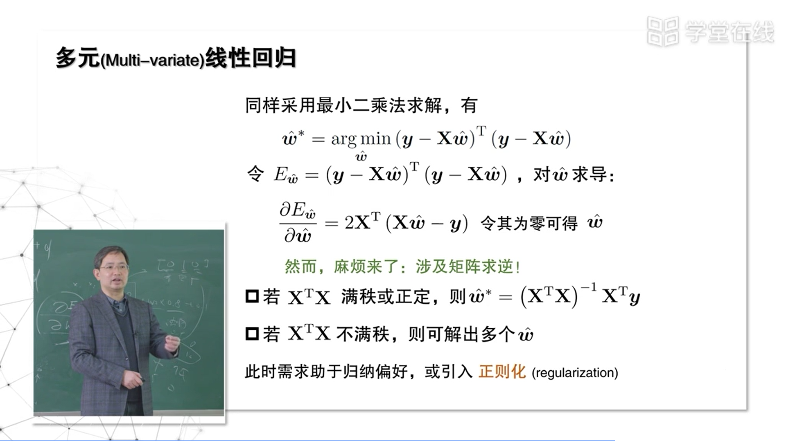

* 正则化就是前面讨论过的归纳偏好，当方程组不满秩，将有多个解，正则化可以引导筛选出需要的解。
* 【感悟】
  * ==这里矩阵的逆、秩、正定，知识需要补充；==【已补充，2022/11/24】
  * 尽管之前已学习了一部分线代知识，但讨论到矩阵的组合运算，还是不熟，尤其是讲述矩阵和方程之间相互转换，简便书写的过程。

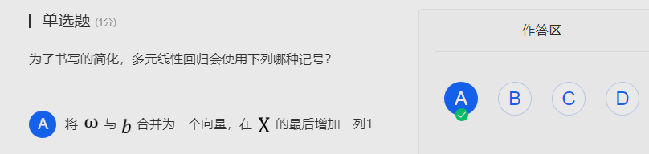

* 对这里形式的区别，就有疑惑了——在吴恩达的课上也有类似的疑问，比如数学公式的书写顺序，转置、逆的位置顺序，与编写代码的顺序感觉上有矛盾——这是亟待理清的。

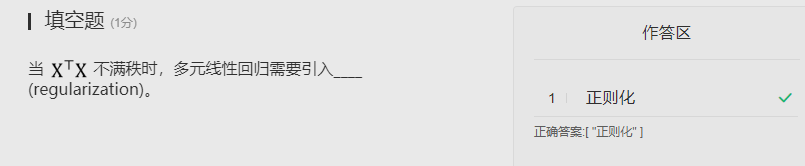

------

### 3.4 广义线性模型

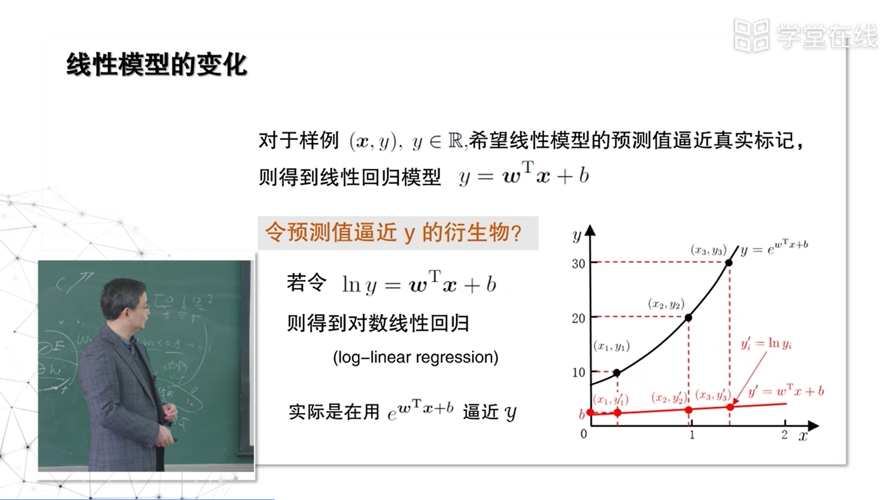

* 用线性回归逼近对数的目标

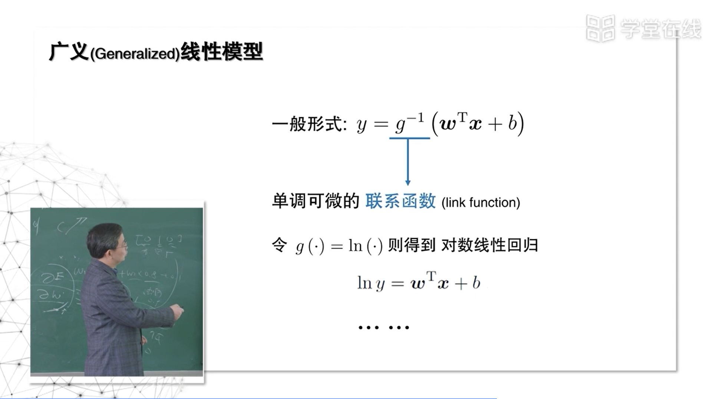

* 联系函数：把线性回归产生的结果，与你真正要的结果两者联系起来。
* 可以加各种各样的东西，得到线性回归模型的广义变化
* 其中，特别重要且有趣的是：我们如何用回归模型解分类问题

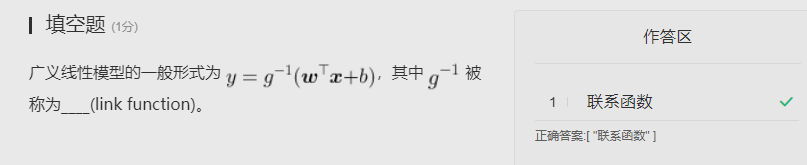

------

### 3.5 对率回归

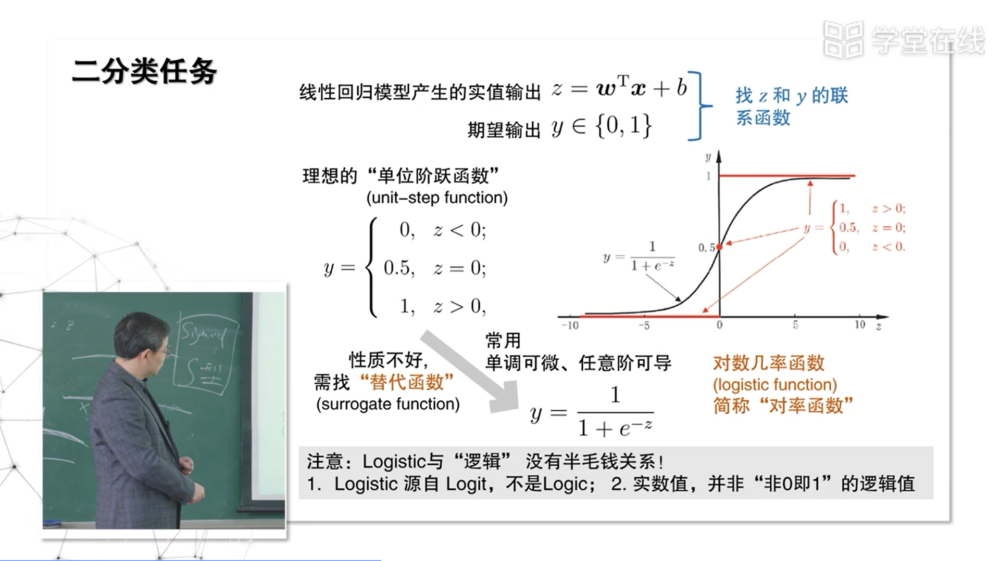

* 起因是要找一个联系函数，把模型的输出和我们期待的输出联系起来，自然的做法是想象有一个**单位阶跃函数**——但这样的函数不连续、损失大，不好用。于是，找到了一个 logistic 函数，性质非常好。
* ==注意：logistic 跟逻辑没有半毛钱关系==

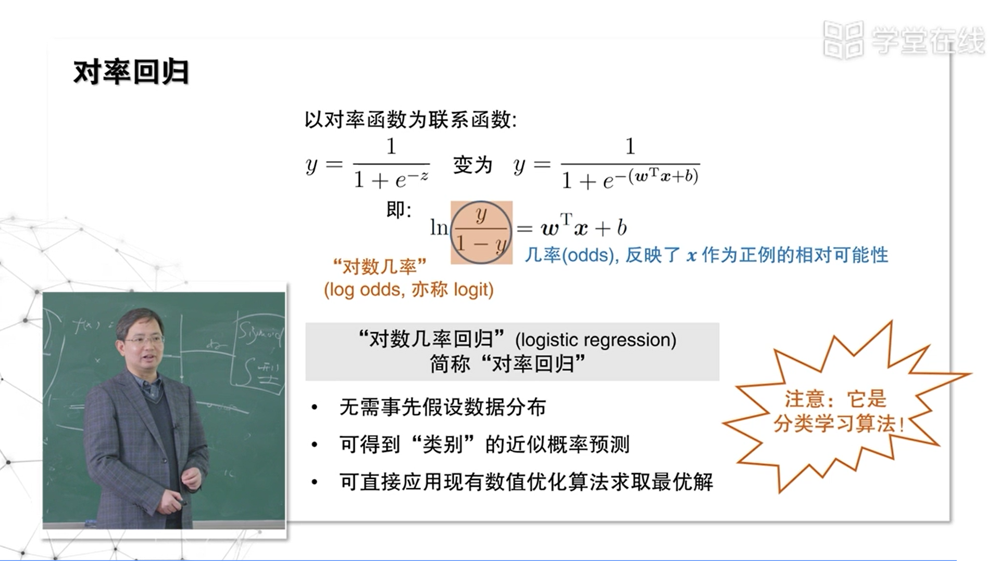

* 几率（odds），在统计学上有严格的术语。odds 和 logit 是统计学家专门造的词，要结合历史背景来说明，但国内有些地方翻译得不好。【这让我想起了之前吴恩达课程，经常混淆两者——我甚至经常用 “逻辑回归” 的名词，现在发现是错的】
* 注意：此处使用回归模型做分类，正是因为联系函数的存在——这是一个广义的线性模型。（P57）

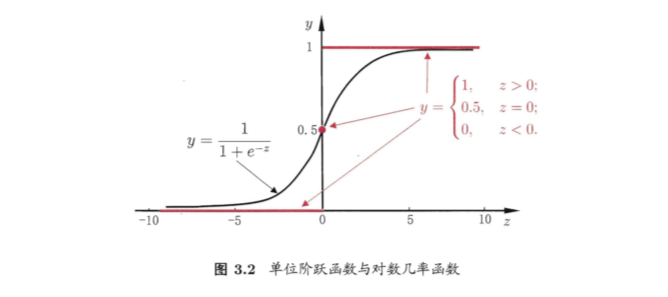

* 分段的是单位阶跃函数；

* 如何理解其他选项？应该对比两者
  * （1）中心对称性两者都有；
  * （2）严格大于0，不理解这个边界是否具有意义？
  * （3）单调且任意阶可导（这是我们希望的）；
  * （4）不需写成分段形式，不理解，但猜测后续会看到更多不一样的替代函数，或许有分段形式的。

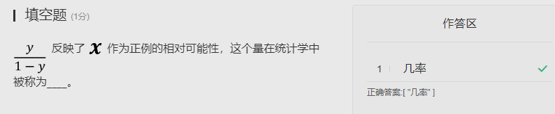

* 这一项需要好好理解与分析[05:00]
* 作为正例的可能性，相对于作为负例的可能性的比值，这个 y 不是 ground true 而是一个实值。y 越大，越可能是个正例，而 1 - y，由于在 0~1 区间取值，下面的东西越大，越可能是个负例。
* 因此，分子表达了是正例的可能性，分母表达了是负例的可能性。即 odds 为
  * $P(f(x) = + | x) $
  * $P(f(x) = - | x)$ 

------

### 3.6 对率回归求解

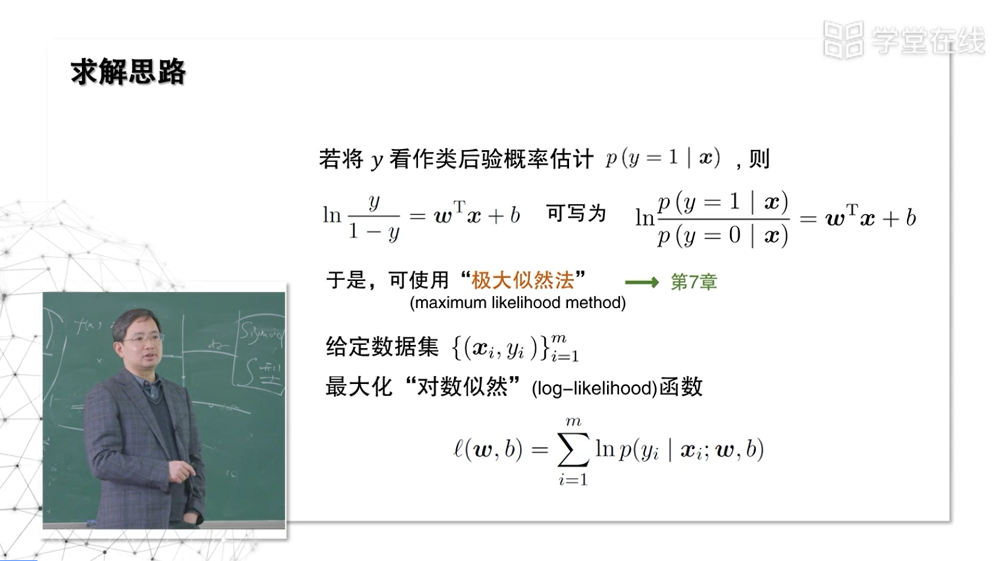

* 导数等于 0 的点，不一定是极值。因此，如果学过优化，那么可以知道有个条件——凸函数（两点连线，中点在曲线上方；有的地方是反过来的，但只要取负号就可以倒过来，不影响分析数学性质）。
* 作业：分析一下 P58 公式（3.18）的凸性（答案是非凸）

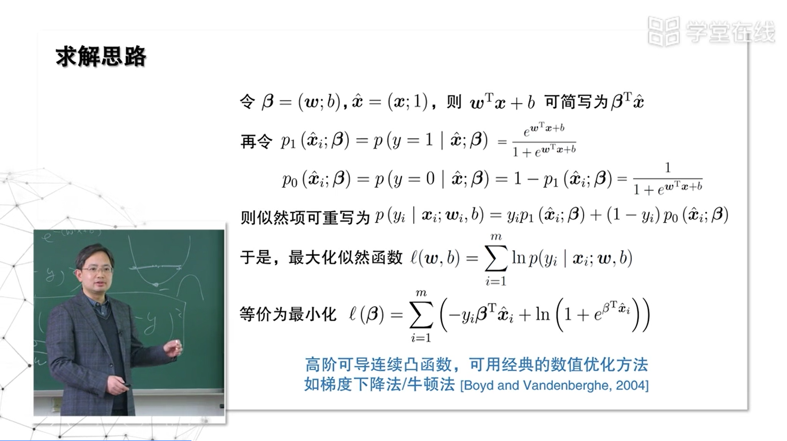

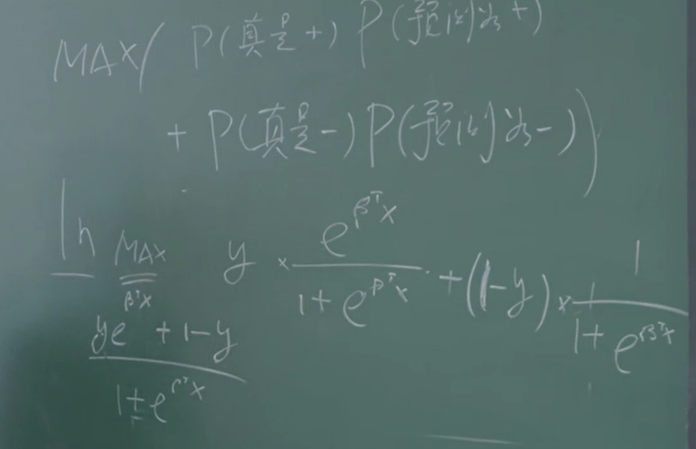

* 未理解，提到乘积项存在非常小的两项相乘，在计算机容易造成下溢，而使用对数似然，可以将乘积转换为加和——这样一定程度地缓解了下溢情况。

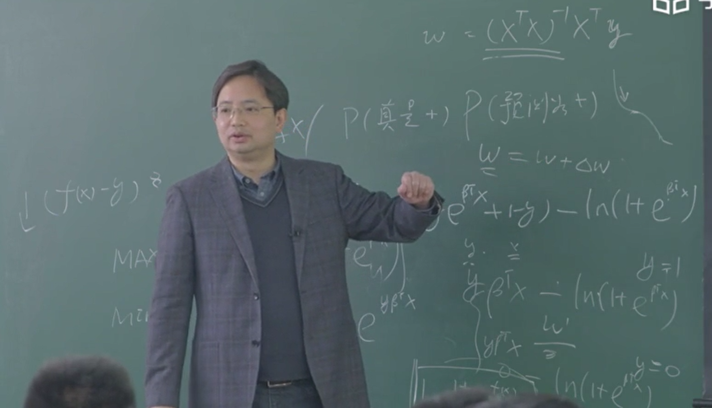

* 上述两版黑板，==未理解==；提到了书本 P59 的推导过程。提到了存在逆的形式的方程，在现实中基本上非常少（相当于直接解方程），通常都要用各种方法去逼近。而往往使用放之四海而皆准的梯度下降法。

* 是否意味着书本对应内容讲的就是这个？正因为无法另令偏导数为 0 求解，所以一系列如极大似然法（提前用到的概念，具体要第 7 章），的 “弯路” 去解题。

* C 并行——是否可理解为向量化传参，从而可并行？
* ==D 读题的时候确实认为太绝对，但没有判断能力。==
* Introductory lectures on Convex optimization - A basic course

* 这题提醒我，要回去理解什么是 “似然函数”
* ==并且本章涉及 “参数估计” 内容，要补习了。==

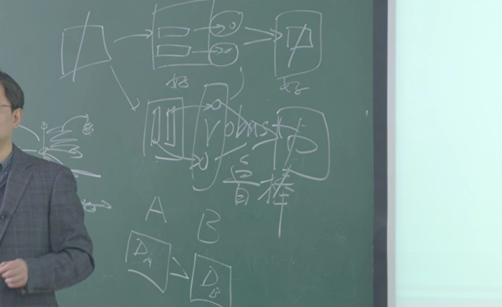

* 视频断层

------

### 3.7 类别不平衡

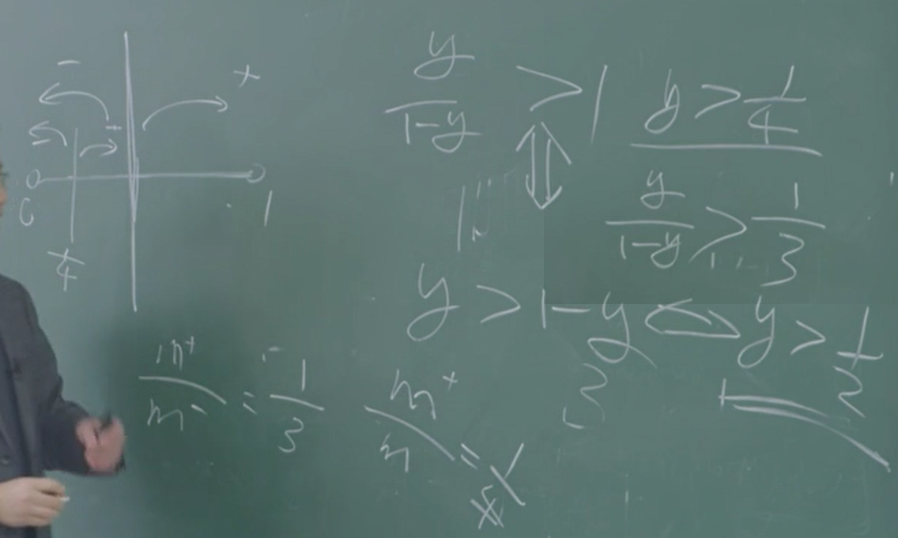

* 此处讨论的是，对比了前面使用的预测阈值，默认存在 0.5 的阈值，而如果正例和反例的比例相差大，那么阈值的选择就要调整。例如黑板列举的 1/4，但实际上，阈值的精确估计通常很困难。
* 于是，就概括了应对类比不平衡的几种学习方法
  * 过采样【有点像吴恩达讲过的应对 High bias 和 High variance 的方法】
  * 欠采样
  * 阈值移动：少数算法可以做到，例如支持向量机

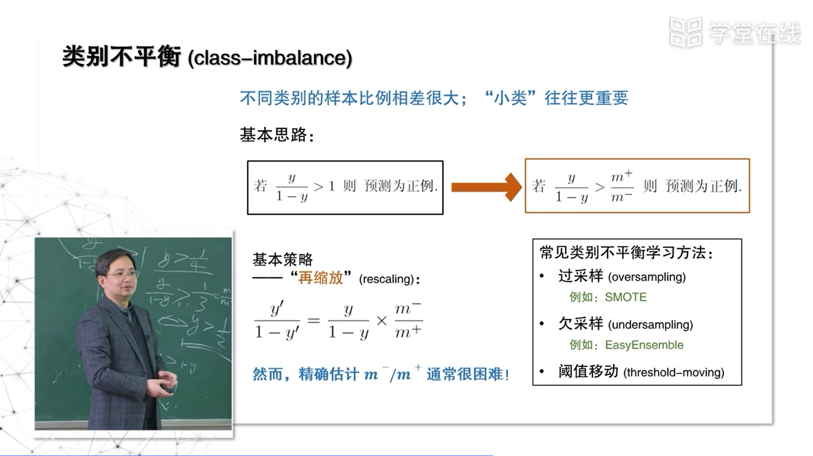

* 过采样
  * 为了平衡较小的样本，通常想到复制，但可能带来大问题，例如复制的样本有噪声，那么会放大；且容易导致过拟合。
  * 因此使用 SMOTE，两个样本中间插值，核心思想是不要完全复制，要加点变化。这个方法是目前处理不平衡问题过采样的最经典方法，大多数工具包都能找到。
  * SMOTE 算法，印度名，美国学者，圣母大学，来过南大访问 Nitech Chawla

* 欠采样
  * 意思是丢掉一些大样本，早期有随机丢掉一些，但会带来大问题：因为你不知道丢掉的是不是关键的东西——这会影响分类边界。
  * EasyEnsemble
    * 每次从大类里找3个，做一个模型①，下次再找，模型②，每一个子模型都是均衡的——这样避免丢掉了有价值的样本，并且日后集成学习可以看到，这样得到的精度反而更高。

* 【感悟】
  * 视频内容跳过了书本的不少东西，有些可能是剪辑掉了。但有好处，就是对新手更有方向。

------

### 【03 EXAM】

* B 是对率函数
* 但我跟什么混淆了？是什么用对数函数作为联系函数？
  * 跟对数线性回归混淆了；此处是对数几率回归

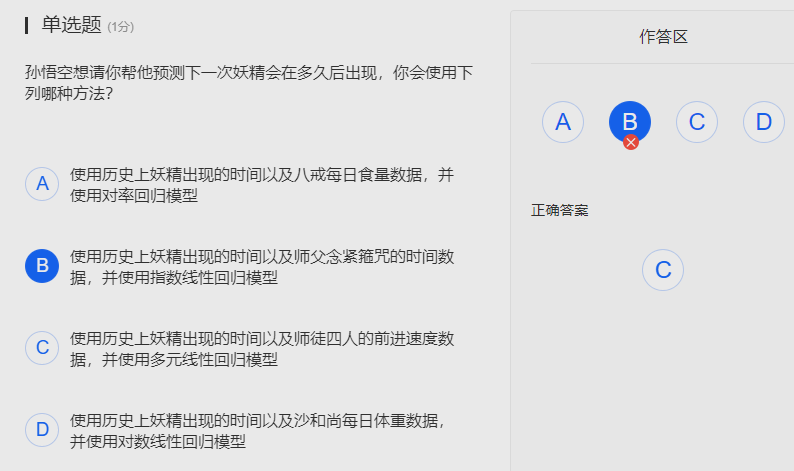

* 不解，但我用的是直觉上的相关性——并没有使用领域工具
* 但应该回到 ML 的使用场景去思考——数据的对象是多维度的，希望分析是综合性的

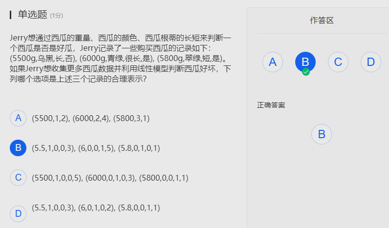

* 注意，不含标记

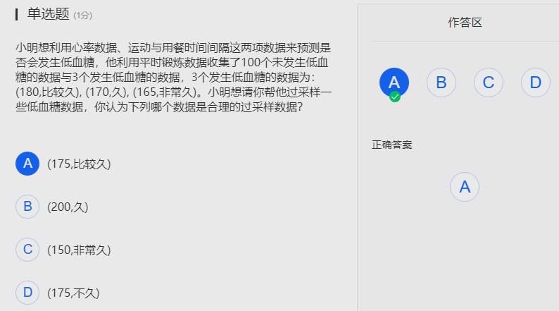

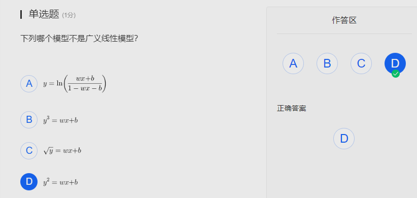

* 蒙对了，我的理解是：要近似 $y^2$ 并不简单，另一个就是对比单调性、起伏程度

* 不太懂，不过 A 有道理，吴恩达讲过类似的，引入正则项，可避免出现输出过小，导致精度溢出的情况。

* ==不知道什么是闭式解（P54，下）==
  * 即解析解，通过严格公式所求得的解——可用解析表达式来表达的解
  * 对 w 和 b 求偏导的那部分，可见

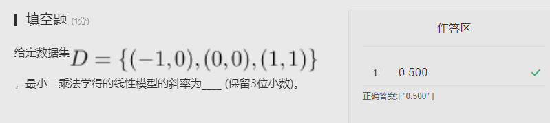

* 开始的时候懵逼，但看了书（P54）的公式就算对了，另外，吴恩达好像讲过类似的（真的欠复盘回顾！）

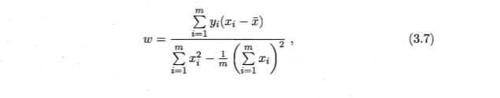

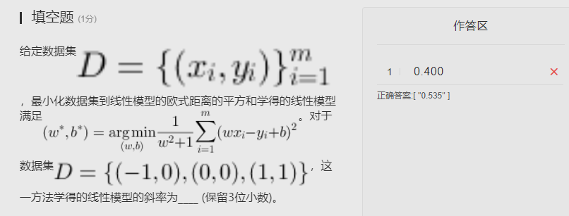

* 这题就不知道说什么了
  * （1）不知道线性模型对数据集的影响，对比上一题 0.5，我简单乘了个系数；
  * （2）如果前面理解了，是否意味着这题应该用编程做？
  * （3）不知道最小化数据集到线性模型的欧氏距离的平方和求得的斜率是什么，因为有多个参数，不知道如何解；

* 幸好这题指出了两者的区别——指向了：我应该

* OvR 视频课没讲，但阈值移动理解了

* 为什么不需要？其他的一些方法，为什么需要？

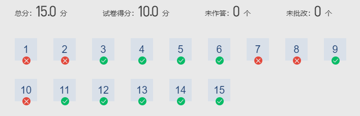

2022/10/19 23:47:36 34min + 16min + 58min + 1h53min = 221min = 3.68h

------

